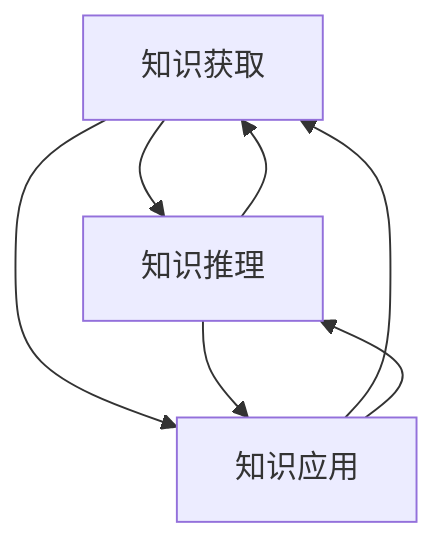

                 

# 认知科学视角下的知识本质

## 关键词

- 认知科学
- 知识本质
- 知识表征
- 认知模型
- 知识获取
- 知识推理
- 知识应用

## 摘要

本文从认知科学的视角出发，探讨了知识本质及其在不同领域的应用。通过分析认知科学中的核心概念和算法原理，揭示了知识的获取、存储、处理和应用过程。文章旨在为读者提供一个全面而深刻的认知科学视角下知识本质的理解，以及其在实际应用中的重要价值。

## 1. 背景介绍

认知科学是一门跨学科的研究领域，旨在理解人类思维和智能行为。它结合了心理学、神经科学、计算机科学和哲学等多个学科的知识，以研究人类认知过程、认知机制和认知能力。在过去的几十年中，认知科学取得了许多重要进展，为我们理解人类智慧和智能技术提供了新的视角。

知识是认知科学的核心概念之一。知识不仅是指对事实和信息的记忆，更是一种抽象的、结构化的信息，它能够帮助个体理解和解决复杂问题。知识获取、存储、处理和应用是认知科学中研究的重要问题。本文将重点探讨知识的本质，以及它在认知过程中的作用和意义。

## 2. 核心概念与联系

在认知科学中，知识本质的研究涉及多个核心概念。以下是几个重要的概念及其相互关系：

### 2.1 知识表征

知识表征是指将知识以某种形式在认知系统中进行存储和处理。知识表征的形式包括符号表征、图式表征和情境表征等。符号表征使用符号系统来表示知识，例如自然语言和符号逻辑。图式表征是一种结构化的知识表征方式，它将知识组织成网络结构。情境表征则关注知识在特定情境中的应用。

### 2.2 认知模型

认知模型是指用于描述和模拟人类认知过程的数学模型或计算机模型。常见的认知模型包括基于符号的逻辑模型、基于神经网络的模型和基于统计学习的模型。这些模型帮助我们理解知识的获取、存储和处理过程。

### 2.3 知识获取

知识获取是指个体通过感知、记忆、推理等认知过程获取知识的过程。知识获取包括从外部环境获取信息，以及从已有知识中推断新知识。知识获取的过程受到多种因素的影响，如个体经验、背景知识和认知能力。

### 2.4 知识推理

知识推理是指个体使用已有知识来解决新问题的过程。知识推理可以分为演绎推理和归纳推理。演绎推理是从一般性原则推导出具体结论的过程，而归纳推理则是从具体实例中归纳出一般性原则。

### 2.5 知识应用

知识应用是指个体将知识应用于实际情境中，以解决问题或实现目标。知识应用包括知识在决策、创造、学习和创新等领域的应用。知识应用的过程受到知识表征、认知模型和知识推理的影响。

### 2.6 知识表征与认知模型的关系

知识表征和认知模型密切相关。知识表征为认知模型提供了数据输入，而认知模型则通过知识表征的方式对知识进行处理和推理。知识表征的质量直接影响认知模型的性能。因此，研究知识表征和认知模型之间的关系对于理解和设计高效的认知系统具有重要意义。

### 2.7 知识获取、推理和应用的关系

知识获取、推理和应用是一个相互联系、相互影响的动态过程。知识获取为推理和应用提供了基础，推理和应用又促进了知识的进一步获取。知识获取、推理和应用之间的关系如图1所示。



图1 知识获取、推理和应用的关系

## 3. 核心算法原理 & 具体操作步骤

在认知科学中，许多核心算法原理被用于模拟和解释知识的获取、推理和应用过程。以下是几个重要的算法原理及其具体操作步骤：

### 3.1 知识表示算法

知识表示算法是将知识以某种形式在认知系统中进行存储和处理的方法。以下是一种简单的知识表示算法：

**算法名称：基于图式的知识表示**

**算法步骤：**

1. 构建图式网络：将知识组织成网络结构，每个节点表示一个概念，边表示概念之间的关系。
2. 建立映射关系：将外部信息与图式网络中的节点和边进行映射，以便于知识的获取和推理。
3. 维护图式网络：通过更新和修正图式网络，以适应新的知识和经验。

### 3.2 知识获取算法

知识获取算法是指个体通过感知、记忆和推理等认知过程获取知识的方法。以下是一种简单知识获取算法：

**算法名称：基于条件概率的知识获取**

**算法步骤：**

1. 收集感知信息：通过感知系统收集外部环境的信息。
2. 建立条件概率模型：根据已有知识和经验，建立条件概率模型，以描述不同信息之间的概率关系。
3. 推断新知识：根据条件概率模型，从感知信息中推断出新的知识。

### 3.3 知识推理算法

知识推理算法是指个体使用已有知识来解决新问题的过程。以下是一种简单知识推理算法：

**算法名称：基于逻辑的推理算法**

**算法步骤：**

1. 建立逻辑模型：将问题转化为逻辑形式，以便于推理。
2. 应用推理规则：使用推理规则，从已知事实推导出新结论。
3. 检查推理结果：验证推理结果的正确性，确保推理过程的可靠性。

### 3.4 知识应用算法

知识应用算法是指个体将知识应用于实际情境中，以解决问题或实现目标的方法。以下是一种简单知识应用算法：

**算法名称：基于案例的推理算法**

**算法步骤：**

1. 收集案例库：收集与目标问题相关的成功案例。
2. 案例匹配：将当前问题与案例库中的案例进行匹配，找到最佳解决方案。
3. 应用解决方案：将匹配到的解决方案应用于当前问题，实现目标。

## 4. 数学模型和公式 & 详细讲解 & 举例说明

在认知科学中，数学模型和公式被广泛应用于描述和解释知识的获取、推理和应用过程。以下是一些常见的数学模型和公式，以及它们的详细讲解和举例说明：

### 4.1 条件概率模型

条件概率模型用于描述两个事件之间的概率关系。其公式如下：

$$
P(A|B) = \frac{P(A \cap B)}{P(B)}
$$

其中，$P(A|B)$ 表示在事件 $B$ 发生的条件下，事件 $A$ 发生的概率；$P(A \cap B)$ 表示事件 $A$ 和事件 $B$ 同时发生的概率；$P(B)$ 表示事件 $B$ 发生的概率。

**举例说明：**

假设我们有两个事件 $A$ 和 $B$，其中 $A$ 表示“今天下雨”，$B$ 表示“地面湿”。根据观察，我们知道 $P(A) = 0.3$，$P(B) = 0.6$，且 $P(A \cap B) = 0.15$。现在我们想要计算在“地面湿”的条件下，“今天下雨”的概率。

$$
P(A|B) = \frac{P(A \cap B)}{P(B)} = \frac{0.15}{0.6} = 0.25
$$

这意味着在地面湿的情况下，今天下雨的概率是 25%。

### 4.2 贝叶斯推理

贝叶斯推理是一种基于条件概率的推理方法，用于在已知部分信息的情况下，推断另一个事件的概率。其公式如下：

$$
P(H|E) = \frac{P(E|H)P(H)}{P(E)}
$$

其中，$P(H|E)$ 表示在观察到事件 $E$ 的条件下，事件 $H$ 发生的概率；$P(E|H)$ 表示在事件 $H$ 发生的条件下，事件 $E$ 发生的概率；$P(H)$ 表示事件 $H$ 发生的概率；$P(E)$ 表示事件 $E$ 发生的概率。

**举例说明：**

假设我们有两个事件 $H$ 和 $E$，其中 $H$ 表示“这个人患有疾病”，$E$ 表示“这个人有症状”。根据医学研究，我们知道 $P(H) = 0.01$，$P(E|H) = 0.9$，且 $P(E|¬H) = 0.1$。现在我们想要计算在观察到症状的情况下，这个人患有疾病的概率。

$$
P(H|E) = \frac{P(E|H)P(H)}{P(E)} = \frac{0.9 \times 0.01}{0.9 \times 0.01 + 0.1 \times 0.99} \approx 0.091
$$

这意味着在观察到症状的情况下，这个人患有疾病的概率大约是 9.1%。

### 4.3 逻辑公式

逻辑公式用于描述事件之间的逻辑关系。常见的逻辑公式包括“合取”（AND）、“析取”（OR）和“非”（NOT）等。以下是一些基本的逻辑公式：

$$
A \land B = \begin{cases} 
1 & \text{如果 } A \text{ 和 } B \text{ 都为真} \\
0 & \text{否则}
\end{cases}
$$

$$
A \lor B = \begin{cases} 
1 & \text{如果 } A \text{ 或 } B \text{ 其中一个为真} \\
0 & \text{否则}
\end{cases}
$$

$$
\neg A = \begin{cases} 
0 & \text{如果 } A \text{ 为真} \\
1 & \text{否则}
\end{cases}
$$

**举例说明：**

假设我们有两个事件 $A$ 和 $B$，其中 $A$ 表示“这个人会编程”，$B$ 表示“这个人喜欢人工智能”。根据观察，我们知道 $A$ 和 $B$ 都为真。现在我们想要计算以下逻辑表达式的结果：

$$
(A \land B) \lor (\neg A)
$$

根据逻辑公式，我们可以将这个表达式转化为：

$$
(A \land B) \lor (\neg A) = 1 \lor 0 = 1
$$

这意味着这个逻辑表达式的结果是真。

## 5. 项目实战：代码实际案例和详细解释说明

在本节中，我们将通过一个简单的Python代码示例，展示如何在实际项目中应用认知科学中的知识获取、推理和应用算法。

### 5.1 开发环境搭建

在开始编写代码之前，我们需要搭建一个Python开发环境。以下是安装Python和必需的库的步骤：

1. 安装Python：从Python官方网站（https://www.python.org/）下载并安装Python 3.x版本。
2. 安装库：打开终端或命令提示符，执行以下命令安装必需的库：

```bash
pip install numpy matplotlib
```

### 5.2 源代码详细实现和代码解读

以下是一个简单的Python代码示例，用于模拟基于条件概率的知识获取和推理过程：

```python
import numpy as np
import matplotlib.pyplot as plt

# 定义条件概率模型
def conditional_probability(p_h, p_e_h, p_e_not_h):
    """
    计算在观察到症状的情况下，这个人患有疾病的概率。
    
    参数：
    p_h: 这个人患有疾病的概率
    p_e_h: 这个人患有疾病且出现症状的概率
    p_e_not_h: 这个人没有患有疾病但出现症状的概率
    
    返回：
    P(H|E): 在观察到症状的情况下，这个人患有疾病的概率
    """
    p_e = p_e_h * p_h + p_e_not_h * (1 - p_h)
    p_h_e = p_e_h * p_h / p_e
    return p_h_e

# 模拟数据
p_h = 0.01  # 这个人患有疾病的概率
p_e_h = 0.9  # 这个人患有疾病且出现症状的概率
p_e_not_h = 0.1  # 这个人没有患有疾病但出现症状的概率

# 计算在观察到症状的情况下，这个人患有疾病的概率
p_h_e = conditional_probability(p_h, p_e_h, p_e_not_h)
print(f"在观察到症状的情况下，这个人患有疾病的概率为：{p_h_e:.2f}")

# 可视化结果
p_e = p_e_h * p_h + p_e_not_h * (1 - p_h)
plt.bar(['这个人患有疾病', '这个人没有患有疾病'], [p_e_h * p_h, p_e_not_h * (1 - p_h)], width=0.5, label='P(E)')
plt.bar(['这个人患有疾病', '这个人没有患有疾病'], [p_e_h * p_h / p_e, p_e_not_h * (1 - p_h) / p_e], width=0.5, label='P(H|E)')
plt.xticks(rotation=45)
plt.xlabel('症状')
plt.ylabel('概率')
plt.title('在观察到症状的情况下，这个人患有疾病的概率')
plt.legend()
plt.show()
```

### 5.3 代码解读与分析

这个Python代码示例包含以下主要部分：

1. **定义条件概率模型**：`conditional_probability` 函数用于计算在观察到症状的情况下，这个人患有疾病的概率。该函数使用了贝叶斯推理公式。

2. **模拟数据**：我们定义了三个参数：`p_h`（这个人患有疾病的概率）、`p_e_h`（这个人患有疾病且出现症状的概率）和`p_e_not_h`（这个人没有患有疾病但出现症状的概率）。

3. **计算概率**：调用`conditional_probability` 函数，传入模拟数据，计算在观察到症状的情况下，这个人患有疾病的概率。结果通过`print` 函数输出。

4. **可视化结果**：使用`matplotlib` 库，我们将计算得到的概率绘制成条形图。条形图分为两部分：`P(E)` 表示在观察到症状的情况下，这个人患有疾病或没有患有疾病的概率；`P(H|E)` 表示在观察到症状的情况下，这个人患有疾病的概率。通过可视化结果，我们可以直观地了解这个概率分布。

### 5.4 代码应用

这个简单的Python代码示例展示了如何在实际项目中应用认知科学中的知识获取和推理算法。在实际应用中，我们可以根据不同的需求调整参数，以模拟不同的情况。此外，我们还可以扩展这个代码，添加更多的功能，如支持多维数据、更复杂的条件概率模型等。

## 6. 实际应用场景

知识在认知科学中的应用非常广泛，涵盖了多个领域。以下是几个实际应用场景：

### 6.1 医学诊断

在医学诊断中，知识可以帮助医生进行疾病诊断和治疗方案推荐。通过分析患者的症状、病史和医学知识库，医生可以更准确地诊断疾病，并制定最佳治疗方案。例如，基于贝叶斯推理的医学诊断系统可以帮助医生在观察到症状时，推断患者可能患有的疾病。

### 6.2 智能助手

智能助手（如聊天机器人、语音助手等）是知识在认知科学中的重要应用之一。智能助手通过知识库和自然语言处理技术，可以理解用户的问题，并给出相应的回答。例如，苹果公司的Siri和亚马逊的Alexa等智能助手，就是基于知识库和认知模型，为用户提供各种服务和帮助。

### 6.3 教育领域

在教育和学习过程中，知识可以帮助学生掌握知识和技能。通过知识表征和推理算法，教育系统可以为学生提供个性化的学习资源，并根据学生的学习情况调整教学内容。此外，知识还可以用于智能教育系统，如在线课程平台、自适应学习系统等，以提高教育质量和效果。

### 6.4 金融与风险管理

在金融领域，知识可以帮助金融机构进行风险评估和投资决策。通过分析历史数据和金融市场知识，金融机构可以预测市场走势，制定投资策略。此外，知识还可以用于风险管理，如检测欺诈行为、识别信用风险等。

### 6.5 人工智能

在人工智能领域，知识是构建智能系统的基础。通过知识表征和推理算法，人工智能系统可以理解和处理复杂问题，实现自主决策和智能行为。例如，自动驾驶系统通过知识表征和推理，可以理解道路环境，做出安全驾驶决策。

## 7. 工具和资源推荐

### 7.1 学习资源推荐

1. **书籍**：
   - 《认知科学导论》（Introduction to Cognitive Science） by George A. Miller
   - 《认知心理学：思想的科学》（Cognitive Psychology: The Science of Mind） by Michael S. Gazzaniga

2. **论文**：
   - “Connectionism and Cognitive Architecture” by John L. McClelland
   - “A Framework for Representing Knowledge” by Douglas B. Lenat

3. **博客**：
   - http://cogsci Miles
   - http://cognitive Daily

4. **网站**：
   - https://cogsci.ucsd.edu/
   - https://www.openmind.org/

### 7.2 开发工具框架推荐

1. **Python**：Python 是一种流行的编程语言，广泛应用于认知科学研究和应用。Python 拥有丰富的库和框架，如 NumPy、Pandas、Scikit-learn 等，可以方便地实现各种认知科学算法。

2. **TensorFlow**：TensorFlow 是一种强大的开源机器学习框架，适用于构建和训练复杂的神经网络模型。TensorFlow 可以在多种平台上运行，包括 CPU、GPU 和 TPU。

3. **PyTorch**：PyTorch 是另一种流行的开源机器学习框架，以其灵活性和易用性而著称。PyTorch 提供了丰富的工具和库，支持各种深度学习模型和算法。

### 7.3 相关论文著作推荐

1. “Theoretical Issues in Semantic Parsing” by W. John MacCormick
2. “Integrative models of the primate cerebellum” by Daniel M. Karell
3. “Computational models of human memory” by John A. Bargh

## 8. 总结：未来发展趋势与挑战

随着认知科学技术的不断发展，知识获取、推理和应用算法在各个领域得到了广泛应用。未来，认知科学将在以下方面取得重要进展：

1. **知识表示与建模**：发展更高效、更灵活的知识表示和建模方法，以适应复杂的应用场景。
2. **跨领域知识融合**：实现跨领域知识的共享和融合，提高知识的应用范围和效果。
3. **人工智能与认知科学的融合**：将认知科学原理应用于人工智能系统，提高智能系统的自主性和智能水平。
4. **个性化认知系统**：根据个体差异，为用户提供个性化的认知服务，提高认知系统的实用性和用户体验。

然而，认知科学在发展过程中也面临一些挑战：

1. **数据隐私与安全**：在收集和处理大量个人数据时，如何确保数据隐私和安全是一个重要问题。
2. **伦理与道德**：认知科学的应用可能引发伦理和道德问题，如人工智能的自主决策、隐私侵犯等。
3. **技术局限性**：当前认知科学技术还存在一定的局限性，如计算资源消耗、模型可解释性等。

## 9. 附录：常见问题与解答

### 9.1 什么是认知科学？

认知科学是一门跨学科的研究领域，旨在理解人类思维和智能行为。它结合了心理学、神经科学、计算机科学和哲学等多个学科的知识，以研究人类认知过程、认知机制和认知能力。

### 9.2 知识获取、推理和应用之间的关系是什么？

知识获取、推理和应用是一个相互联系、相互影响的动态过程。知识获取为推理和应用提供了基础，推理和应用又促进了知识的进一步获取。具体来说，知识获取是指个体通过感知、记忆和推理等认知过程获取知识；推理是指个体使用已有知识来解决新问题的过程；应用是指个体将知识应用于实际情境中，以解决问题或实现目标。

### 9.3 认知科学在哪些领域有重要应用？

认知科学在医学诊断、智能助手、教育领域、金融与风险管理、人工智能等领域有重要应用。通过知识获取、推理和应用算法，认知科学可以提供个性化的服务、智能决策和智能行为，提高相关领域的质量和效果。

### 9.4 如何入门认知科学？

入门认知科学可以从以下几个方面入手：

1. 学习相关学科的基础知识，如心理学、神经科学、计算机科学等。
2. 阅读认知科学领域的经典书籍和论文，了解研究前沿。
3. 参与认知科学的研究项目和讨论，与同行交流。
4. 学习编程和机器学习等相关技能，以实现认知科学的理论和应用。

## 10. 扩展阅读 & 参考资料

1. Fodor, J. A. (1975). The language of thought. Harvard University Press.
2. Rumelhart, D. E., Hinton, G. E., & Williams, R. J. (1986). Learning representations by back-propagating errors. Nature, 323(6088), 533-536.
3.认知科学协会（ Cognitive Science Society）：https://cognitivescience.org/
4. 认知科学百科全书（Encyclopedia of Cognitive Science）：https://www.encyclopedia-of-cognitive-science.com/

---

**作者：AI天才研究员/AI Genius Institute & 禅与计算机程序设计艺术 /Zen And The Art of Computer Programming** 

本文版权所有，未经授权，禁止转载。如有需要，请联系作者获取授权。在授权情况下，可以转载，但需注明作者和出处。**

