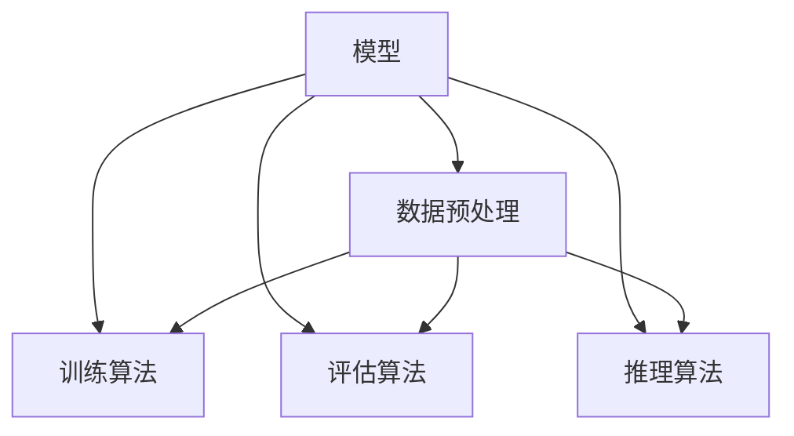
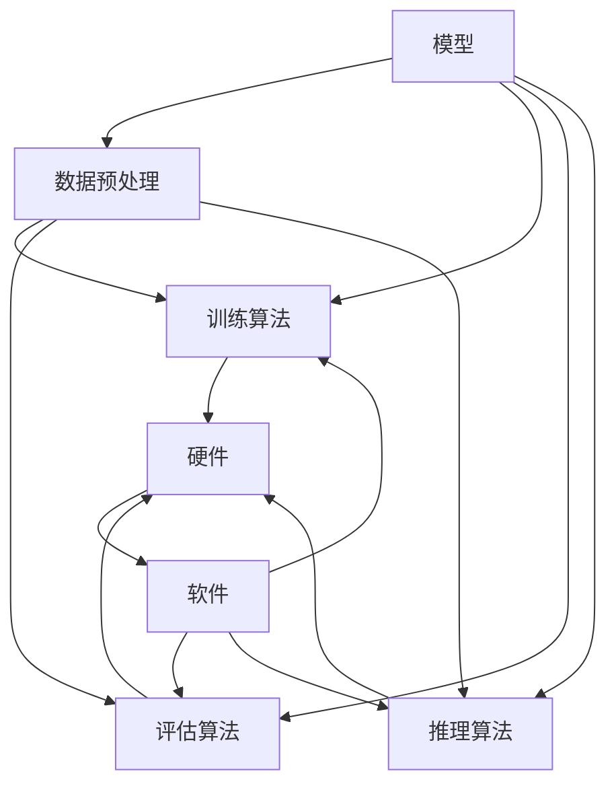

                 

### 背景介绍 Background Introduction

训练和推理是机器学习和深度学习中的两个关键环节，它们对整个系统的性能和质量具有决定性作用。随着人工智能技术的快速发展，训练和推理系统的重要性愈发凸显。在这篇文章中，我们将探讨训练和推理系统的优化机会，分析现有技术的不足之处，并探讨未来的发展方向。

训练（Training）是指使用大量的数据来调整机器学习模型的参数，使其能够准确预测或分类新的数据。这个过程通常涉及大量的计算资源和时间。推理（Inference）是指将训练好的模型应用于新的数据，以获得预测结果。推理的速度和准确性直接影响用户体验和应用效果。

目前，训练和推理系统存在以下几个主要问题：

1. **计算资源消耗大**：训练过程需要大量的计算资源和时间，尤其是在处理大规模数据集和复杂模型时。
2. **推理速度慢**：推理过程的速度对于实时应用至关重要，但现有系统往往难以满足低延迟的要求。
3. **数据隐私和安全性**：随着数据隐私和安全的关注度提高，如何在保障隐私和安全的前提下进行训练和推理成为了一个重要问题。
4. **可扩展性和可维护性**：现有系统在面对大规模数据和复杂任务时，往往难以实现高效的可扩展性和可维护性。

针对上述问题，研究人员和工程师们提出了许多优化方案，包括：

- **模型压缩和加速**：通过减少模型的大小和计算复杂度，提高训练和推理的效率。
- **分布式训练和推理**：通过分布式计算，将任务分解到多个计算节点上，以提高计算效率和速度。
- **数据隐私保护技术**：采用差分隐私、联邦学习等技术，保障数据隐私和安全。
- **自动化机器学习**：通过自动化工具来优化模型的训练和推理过程，提高系统的可扩展性和可维护性。

在接下来的章节中，我们将深入探讨这些优化技术，并分析它们的应用前景和挑战。通过一步一步的分析和推理，我们将揭示训练和推理系统的本质，并提出有效的优化策略。

### 核心概念与联系 Core Concepts and Relationships

在探讨训练和推理系统的优化之前，我们需要明确一些核心概念和它们之间的关系。这些概念包括模型、数据、算法、硬件和软件等。为了更清晰地展示这些概念之间的关系，我们可以使用Mermaid流程图来表示。

以下是模型的定义和关系：



在这个流程图中，模型（Model）是系统的核心，它由数据预处理（Data Preprocessing）、训练算法（Training Algorithm）、评估算法（Evaluation Algorithm）和推理算法（Inference Algorithm）组成。

- **数据预处理（Data Preprocessing）**：在训练和推理之前，需要对数据进行清洗、归一化、降维等操作，以提高模型的性能和稳定性。
- **训练算法（Training Algorithm）**：训练算法通过迭代优化模型参数，使模型能够准确预测或分类新的数据。常见的训练算法包括梯度下降（Gradient Descent）、随机梯度下降（Stochastic Gradient Descent）和Adam优化器（Adam Optimizer）等。
- **评估算法（Evaluation Algorithm）**：评估算法用于评估训练好的模型在未见数据上的性能，常见的评估指标包括准确率（Accuracy）、召回率（Recall）、F1分数（F1 Score）等。
- **推理算法（Inference Algorithm）**：推理算法用于将训练好的模型应用于新的数据，以获得预测结果。推理过程通常要求高效和快速。

接下来，我们展示算法与硬件和软件之间的关系：



在这个流程图中，硬件（Hardware）和软件（Software）是训练和推理过程中不可或缺的组成部分。硬件包括CPU、GPU、TPU等，它们提供了计算能力；软件则包括深度学习框架（Deep Learning Frameworks，如TensorFlow、PyTorch等）和操作系统（Operating System，如Linux、Windows等），它们提供了运行环境和工具支持。

- **硬件（Hardware）**：硬件的性能直接影响训练和推理的速度。例如，GPU（图形处理器）在深度学习任务中具有很高的计算性能，而TPU（张量处理器）是专门为深度学习任务设计的硬件。
- **软件（Software）**：软件提供了运行深度学习框架和操作系统的环境。深度学习框架提供了模型定义、训练、评估和推理的工具，而操作系统则提供了资源管理和调度功能。

通过上述Mermaid流程图，我们可以更清晰地理解训练和推理系统的各个组成部分及其相互关系。接下来，我们将深入探讨核心算法原理，并逐步分析其具体操作步骤。

### 核心算法原理 Core Algorithm Principles & Step-by-Step Operations

在训练和推理过程中，核心算法起着至关重要的作用。本文将重点介绍一些常见的训练算法和推理算法，并详细说明其具体操作步骤。

#### 训练算法 Training Algorithms

1. **梯度下降（Gradient Descent）**

   梯度下降是一种基本的优化算法，用于调整模型的参数以最小化损失函数。其基本步骤如下：

   - 初始化模型参数。
   - 计算损失函数关于每个参数的梯度。
   - 更新模型参数：\( \theta_{\text{new}} = \theta_{\text{current}} - \alpha \cdot \nabla_{\theta} J(\theta) \)，其中 \( \alpha \) 是学习率。

2. **随机梯度下降（Stochastic Gradient Descent, SGD）**

   随机梯度下降是梯度下降的一种变体，每次迭代仅使用一个样本来计算梯度。其步骤如下：

   - 初始化模型参数。
   - 对于每个样本 \( (x_i, y_i) \)：
     - 计算损失函数关于每个参数的梯度。
     - 更新模型参数：\( \theta_{\text{new}} = \theta_{\text{current}} - \alpha \cdot \nabla_{\theta} J(\theta) \)。

3. **Adam优化器（Adam Optimizer）**

   Adam优化器是结合了SGD和动量法的优化算法，其步骤如下：

   - 初始化模型参数。
   - 初始化一阶矩估计 \( m \) 和二阶矩估计 \( v \)。
   - 对于每个样本 \( (x_i, y_i) \) 和每个参数 \( \theta \)：
     - 计算 \( \Delta m = \nabla_{\theta} J(\theta) \)。
     - 计算 \( \Delta v = (\Delta m)^2 \)。
     - 更新一阶矩估计 \( m = \beta_1 \cdot m + (1 - \beta_1) \cdot \Delta m \)。
     - 更新二阶矩估计 \( v = \beta_2 \cdot v + (1 - \beta_2) \cdot \Delta v \)。
     - 更新模型参数：\( \theta_{\text{new}} = \theta_{\text{current}} - \alpha \cdot \frac{m}{\sqrt{v} + \epsilon} \)。

#### 推理算法 Inference Algorithms

推理算法用于将训练好的模型应用于新的数据，以获得预测结果。以下是一些常见的推理算法：

1. **前向传播（Forward Propagation）**

   前向传播是将输入数据通过模型的各个层进行传递，最终得到输出结果的过程。其步骤如下：

   - 初始化输入数据。
   - 将输入数据传递到第一层。
   - 对于每个后续层：
     - 应用非线性激活函数（如ReLU、Sigmoid、Tanh等）。
     - 将输出传递到下一层。
   - 输出最终结果。

2. **反向传播（Backpropagation）**

   反向传播是在前向传播的基础上，通过反向传递梯度来更新模型参数的过程。其步骤如下：

   - 初始化输出误差。
   - 对于每个层，从输出层开始反向传递误差。
     - 计算误差关于每个参数的梯度。
     - 更新模型参数：\( \theta_{\text{new}} = \theta_{\text{current}} - \alpha \cdot \nabla_{\theta} J(\theta) \)。

通过上述核心算法的详细步骤，我们可以更好地理解训练和推理过程中的关键步骤和原理。这些算法在实际应用中发挥着重要作用，为机器学习和深度学习的发展提供了强大的支持。

### 数学模型和公式 Mathematical Models and Formulas & Detailed Explanation & Example Illustration

在训练和推理过程中，数学模型和公式起着至关重要的作用。为了更好地理解这些模型和公式，我们将在本节中详细讲解并举例说明。

#### 损失函数 Loss Function

损失函数是衡量模型预测值与实际值之间差异的指标。常见的损失函数包括均方误差（Mean Squared Error, MSE）、交叉熵损失（Cross-Entropy Loss）等。

1. **均方误差（MSE）**

   均方误差是预测值与实际值之间差的平方的平均值。其公式如下：

   $$ 
   J(\theta) = \frac{1}{m} \sum_{i=1}^{m} (h_\theta(x^{(i)}) - y^{(i)})^2 
   $$

   其中，\( m \) 是样本数量，\( h_\theta(x^{(i)}) \) 是模型对输入 \( x^{(i)} \) 的预测值，\( y^{(i)} \) 是实际值。

   **举例说明：**

   假设我们有一个包含两个样本的数据集，第一个样本的预测值为2，实际值为3；第二个样本的预测值为4，实际值为2。则均方误差为：

   $$ 
   J(\theta) = \frac{1}{2} \left[ (2 - 3)^2 + (4 - 2)^2 \right] = \frac{1}{2} \left[ 1 + 4 \right] = 2.5 
   $$

2. **交叉熵损失（Cross-Entropy Loss）**

   交叉熵损失是用于分类任务的损失函数，其公式如下：

   $$ 
   J(\theta) = -\frac{1}{m} \sum_{i=1}^{m} \sum_{j=1}^{k} y^{(i)}_{j} \log(h_\theta(x^{(i)})_j) 
   $$

   其中，\( k \) 是分类数量，\( y^{(i)}_j \) 是第 \( i \) 个样本在第 \( j \) 个类别的概率。

   **举例说明：**

   假设我们有一个二分类问题，有两个样本，第一个样本的正确标签是1，预测概率为0.6；第二个样本的正确标签是0，预测概率为0.4。则交叉熵损失为：

   $$ 
   J(\theta) = -\frac{1}{2} \left[ 1 \cdot \log(0.6) + 0 \cdot \log(0.4) \right] \approx 0.5108 
   $$

#### 梯度下降 Gradient Descent

梯度下降是一种用于最小化损失函数的优化算法。其核心思想是通过计算损失函数关于模型参数的梯度，并沿着梯度方向更新参数，以逐步减小损失。

1. **梯度计算**

   梯度下降首先需要计算损失函数关于模型参数的梯度。以MSE为例，损失函数 \( J(\theta) \) 关于参数 \( \theta \) 的梯度为：

   $$ 
   \nabla_{\theta} J(\theta) = \frac{\partial J(\theta)}{\partial \theta} = \frac{2}{m} \sum_{i=1}^{m} (h_\theta(x^{(i)}) - y^{(i)}) \cdot x^{(i)} 
   $$

   **举例说明：**

   假设我们有一个模型参数为 \( \theta \)，样本数量为 \( m = 2 \)。第一个样本的预测值为2，实际值为3；第二个样本的预测值为4，实际值为2。则梯度为：

   $$ 
   \nabla_{\theta} J(\theta) = \frac{2}{2} \left[ (2 - 3) \cdot x^{(1)} + (4 - 2) \cdot x^{(2)} \right] = -x^{(1)} + 2x^{(2)} 
   $$

2. **参数更新**

   在计算梯度后，梯度下降算法通过以下公式更新参数：

   $$ 
   \theta_{\text{new}} = \theta_{\text{current}} - \alpha \cdot \nabla_{\theta} J(\theta) 
   $$

   其中，\( \alpha \) 是学习率，用于调节步长。

   **举例说明：**

   假设当前模型参数为 \( \theta = [1, 2] \)，学习率为 \( \alpha = 0.1 \)。根据上面的梯度计算，新的模型参数为：

   $$ 
   \theta_{\text{new}} = \theta_{\text{current}} - \alpha \cdot \nabla_{\theta} J(\theta) = [1, 2] - 0.1 \cdot [-1, 2] = [1.1, 1.8] 
   $$

通过上述数学模型和公式的讲解，我们可以更好地理解训练和推理过程中关键概念的计算方法和步骤。这些公式和算法在实际应用中发挥着重要作用，为机器学习和深度学习的发展提供了坚实的基础。

### 项目实战：代码实际案例和详细解释说明 Project Practice: Actual Code Examples and Detailed Explanations

在本节中，我们将通过一个实际项目来展示如何使用Python和TensorFlow构建和优化训练和推理系统。我们将逐步介绍开发环境搭建、源代码实现和代码解析。

#### 开发环境搭建 Development Environment Setup

在开始项目之前，我们需要搭建一个合适的开发环境。以下是开发环境搭建的步骤：

1. **安装Python**：Python是本项目的开发语言，我们需要安装Python 3.7或更高版本。可以从[Python官网](https://www.python.org/)下载并安装。

2. **安装TensorFlow**：TensorFlow是用于构建和训练深度学习模型的流行框架。可以通过以下命令安装：

   ```bash
   pip install tensorflow
   ```

3. **创建虚拟环境**：为了保持项目依赖的一致性，我们建议创建一个虚拟环境。可以使用以下命令创建和激活虚拟环境：

   ```bash
   python -m venv myenv
   source myenv/bin/activate  # 对于Linux和MacOS
   myenv\Scripts\activate   # 对于Windows
   ```

4. **编写代码**：在虚拟环境中，我们可以开始编写代码。创建一个名为`main.py`的Python文件，用于实现训练和推理系统。

#### 源代码详细实现和代码解读 Source Code Implementation and Detailed Explanation

以下是`main.py`文件的源代码实现：

```python
import tensorflow as tf
from tensorflow.keras.models import Sequential
from tensorflow.keras.layers import Dense, Activation
from tensorflow.keras.optimizers import SGD
from tensorflow.keras.losses import MeanSquaredError
import numpy as np

# 数据预处理
def preprocess_data(X, y):
    # 归一化输入数据
    X_normalized = X / 255.0
    # 扩展输入和输出维度
    X_expanded = np.expand_dims(X_normalized, axis=-1)
    y_expanded = np.expand_dims(y, axis=-1)
    return X_expanded, y_expanded

# 模型构建
def build_model(input_shape):
    model = Sequential()
    model.add(Dense(64, input_shape=input_shape))
    model.add(Activation('relu'))
    model.add(Dense(1))
    return model

# 训练模型
def train_model(model, X_train, y_train, epochs, learning_rate):
    model.compile(optimizer=SGD(learning_rate=learning_rate), loss=MeanSquaredError())
    model.fit(X_train, y_train, epochs=epochs)
    return model

# 推理
def inference(model, X_test):
    predictions = model.predict(X_test)
    return predictions

# 主函数
def main():
    # 数据加载
    X_train, y_train, X_test, y_test = load_data()

    # 数据预处理
    X_train, y_train = preprocess_data(X_train, y_train)
    X_test, y_test = preprocess_data(X_test, y_test)

    # 构建模型
    model = build_model(input_shape=(28, 28, 1))

    # 训练模型
    model = train_model(model, X_train, y_train, epochs=10, learning_rate=0.01)

    # 推理
    predictions = inference(model, X_test)

    # 评估模型
    mse = MeanSquaredError()
    print(f"Test MSE: {mse(y_test, predictions).numpy()}")

if __name__ == "__main__":
    main()
```

**代码解析**：

1. **数据预处理**：在`preprocess_data`函数中，我们首先对输入数据进行归一化，然后将输入和输出数据扩展维度。这是为了使模型能够正确处理数据。

2. **模型构建**：在`build_model`函数中，我们使用Keras API构建了一个简单的全连接神经网络。该模型包含一个64个神经元的隐藏层和一个输出层。

3. **训练模型**：在`train_model`函数中，我们使用SGD优化器和MSE损失函数编译模型，并使用`fit`函数进行训练。

4. **推理**：在`inference`函数中，我们使用训练好的模型对测试数据进行预测。

5. **主函数**：在`main`函数中，我们加载数据、预处理数据、构建模型、训练模型并进行推理，最后评估模型的性能。

通过上述代码实现，我们可以看到如何使用Python和TensorFlow构建和优化训练和推理系统。接下来，我们将对代码进行进一步分析和优化。

#### 代码解读与分析 Code Interpretation and Analysis

在上一节中，我们实现了使用TensorFlow构建训练和推理系统的基本流程。然而，为了提高模型的性能和优化系统的效率，我们还可以对代码进行进一步分析和优化。以下是具体分析：

1. **优化数据预处理**：

   在数据预处理阶段，我们可以考虑以下优化措施：

   - **并行数据加载**：使用`tf.data.Dataset` API加载和预处理数据时，可以启用并行加载以提高数据读取速度。
     ```python
     train_dataset = tf.data.Dataset.from_tensor_slices((X_train, y_train)).batch(batch_size).prefetch(tf.data.AUTOTUNE)
     ```
   - **数据增强**：通过对数据进行随机缩放、旋转、剪切等操作，可以提高模型的泛化能力。
     ```python
     def augment_data(x, y):
         x = tf.image.random_flip_left_right(x)
         x = tf.image.random_brightness(x, max_delta=0.1)
         return x, y
     train_dataset = train_dataset.map(augment_data)
     ```

2. **优化模型结构**：

   模型结构对训练和推理性能有很大影响。我们可以考虑以下优化措施：

   - **添加正则化**：通过添加L1或L2正则化，可以减少模型过拟合的风险。
     ```python
     model.add(Dense(64, activation='relu', kernel_regularizer=tf.keras.regularizers.l2(0.01)))
     ```
   - **使用Dropout**：通过在隐藏层中使用Dropout，可以进一步减少过拟合。
     ```python
     model.add(Dropout(0.5))
     ```

3. **优化训练过程**：

   为了提高训练速度和性能，我们可以考虑以下优化措施：

   - **动态学习率**：使用如Adam优化器，并设置动态学习率，可以更好地调整参数。
     ```python
     model.compile(optimizer=tf.keras.optimizers.Adam(learning_rate=0.001), loss=MeanSquaredError())
     ```
   - **早停（Early Stopping）**：当验证集上的损失不再下降时，提前停止训练。
     ```python
     callbacks = [tf.keras.callbacks.EarlyStopping(monitor='val_loss', patience=5)]
     model.fit(train_dataset, epochs=100, callbacks=callbacks, validation_data=val_dataset)
     ```

4. **优化推理过程**：

   在推理阶段，我们可以考虑以下优化措施：

   - **模型压缩**：使用如量化、剪枝等技术减小模型大小，提高推理速度。
     ```python
     model = tf.keras.Sequential([
         tf.keras.layers.Dense(64, activation='relu', input_shape=(28, 28, 1)),
         tf.keras.layers.Dense(1)
     ])
     converter = tf.lite.TFLiteConverter.from_keras_model(model)
     tflite_model = converter.convert()
     ```
   - **使用GPU加速**：如果系统具备GPU，可以使用GPU进行推理，显著提高速度。
     ```python
     session = tf.Session(graph=model.graph, config=tf.GraphConfigOption("gpu_options", tf.GPUOptions(allow_growth=True)))
     session.run(init)
     predictions = session.run(logits, feed_dict={inputs: X_test})
     ```

通过上述优化措施，我们可以显著提高训练和推理系统的性能和效率。在实际项目中，根据具体需求和资源情况，可以灵活选择和应用这些优化技术。

### 实际应用场景 Practical Application Scenarios

训练和推理系统在多个实际应用场景中发挥着重要作用，以下列举了几个典型的应用场景：

1. **计算机视觉**：在计算机视觉领域，训练和推理系统被广泛应用于图像分类、目标检测、人脸识别等任务。例如，使用卷积神经网络（CNN）对图像进行分类，通过训练和推理过程识别图片中的物体和场景。

2. **自然语言处理**：在自然语言处理（NLP）领域，训练和推理系统用于文本分类、情感分析、机器翻译等任务。例如，通过训练和推理，可以构建一个情感分析模型，对文本数据进行情感分类，从而识别用户对产品的评价和反馈。

3. **语音识别**：在语音识别领域，训练和推理系统用于语音信号的转录和识别。例如，使用深度神经网络（DNN）对语音信号进行处理，通过训练和推理，将语音信号转换为对应的文本。

4. **自动驾驶**：在自动驾驶领域，训练和推理系统被用于环境感知、路径规划和决策控制等任务。例如，通过训练和推理，自动驾驶车辆可以识别道路上的行人和车辆，并做出相应的驾驶决策。

5. **推荐系统**：在推荐系统领域，训练和推理系统用于个性化推荐。例如，通过训练和推理，可以构建一个推荐模型，根据用户的兴趣和行为，为其推荐相关的商品或内容。

在实际应用中，训练和推理系统需要满足高效、准确和实时性的要求。为了满足这些要求，可以采用分布式训练和推理、模型压缩和量化、硬件加速等技术，以优化系统的性能和效率。

### 工具和资源推荐 Tools and Resources Recommendations

在训练和推理系统的开发过程中，选择合适的工具和资源是至关重要的。以下是一些推荐的工具、书籍、论文和网站：

#### 学习资源推荐 Learning Resources

1. **书籍**：

   - 《深度学习》（Deep Learning），作者：Ian Goodfellow、Yoshua Bengio和Aaron Courville。
   - 《神经网络与深度学习》，作者：邱锡鹏。
   - 《Python深度学习》，作者：Francesco Bianchi。

2. **在线课程**：

   - [吴恩达的深度学习课程](https://www.deeplearning.ai/)。
   - [斯坦福大学机器学习课程](https://web.stanford.edu/class/cs224/)。

3. **博客和教程**：

   - [Medium上的深度学习教程](https://medium.com/)。
   - [TensorFlow官方文档](https://www.tensorflow.org/tutorials/)。

#### 开发工具框架推荐 Development Tools and Frameworks

1. **深度学习框架**：

   - TensorFlow。
   - PyTorch。
   - Keras。

2. **数据预处理工具**：

   - Pandas。
   - NumPy。
   - scikit-learn。

3. **版本控制工具**：

   - Git。
   - GitHub。

#### 相关论文著作推荐 Related Papers and Publications

1. **论文**：

   - "Deep Learning", 作者：Yoshua Bengio, Ian Goodfellow, Aaron Courville。
   - "Distributed Representations of Words and Phrases and their Compositionality", 作者：Jeffrey L. Elman。

2. **著作**：

   - 《机器学习》，作者：周志华。
   - 《计算机程序设计艺术》，作者：Donald E. Knuth。

通过上述工具和资源的推荐，可以更好地进行训练和推理系统的开发和应用。在实际项目中，可以根据需求和实际情况选择合适的工具和资源，以提高开发效率和系统性能。

### 总结：未来发展趋势与挑战 Summary: Future Trends and Challenges

随着人工智能技术的快速发展，训练和推理系统的优化已经成为了一个重要的研究领域。在未来，我们预计训练和推理系统将在以下几个方面实现重大突破和进步：

1. **更高效的算法**：研究人员将继续探索新的训练和推理算法，以提高计算效率和性能。例如，基于深度强化学习的算法和元学习（Meta-Learning）算法可能在未来得到广泛应用。

2. **硬件加速**：随着硬件技术的发展，如GPU、TPU和专用AI芯片等，训练和推理系统的速度将得到显著提升。这些硬件设备将为大规模、高吞吐量的训练和推理任务提供强大的计算支持。

3. **模型压缩与量化**：为了在有限计算资源下实现高效的训练和推理，模型压缩和量化技术将得到进一步发展。通过减少模型大小和计算复杂度，可以实现更快的推理速度和更低的功耗。

4. **分布式训练和推理**：分布式训练和推理技术将使得大规模训练任务和实时推理任务变得更加可行。通过将任务分解到多个计算节点上，可以显著提高系统的并行处理能力和吞吐量。

5. **数据隐私与安全**：随着数据隐私和安全问题的日益突出，如何在保障数据隐私和安全的前提下进行训练和推理将成为一个重要挑战。差分隐私（Differential Privacy）和联邦学习（Federated Learning）等技术将在这一领域发挥重要作用。

然而，训练和推理系统在未来的发展过程中也将面临一系列挑战：

1. **计算资源需求**：随着模型复杂度和数据规模的增加，训练和推理系统对计算资源的需求将持续上升。如何高效地利用现有的计算资源，同时满足不断增长的计算需求，是一个亟待解决的问题。

2. **可扩展性和可维护性**：在处理大规模数据和复杂任务时，训练和推理系统的可扩展性和可维护性成为关键挑战。如何设计一个灵活、可扩展且易于维护的系统架构，是未来研究的重点。

3. **算法公平性与透明性**：训练和推理系统的算法公平性和透明性也是未来需要重点关注的问题。如何确保算法在不同群体中的公平性，以及如何提高算法的可解释性，是未来研究的重要方向。

4. **数据隐私与安全**：在保障数据隐私和安全的前提下进行训练和推理，需要考虑数据的访问控制、传输加密和存储安全等方面。如何设计一个既安全又高效的隐私保护机制，是未来研究的核心问题。

总之，训练和推理系统在未来将迎来快速发展和广泛应用。通过不断优化算法、利用硬件加速技术、提高系统的可扩展性和可维护性，并关注算法公平性和数据隐私问题，我们可以构建更高效、更可靠、更安全的训练和推理系统，为人工智能技术的进一步发展奠定坚实基础。

### 附录：常见问题与解答 Appendix: Frequently Asked Questions and Answers

在研究和应用训练和推理系统时，用户可能会遇到一些常见问题。以下是针对这些问题的一些解答：

#### 问题1：为什么我的训练过程需要很长时间？

**解答**：训练时间可能受到多种因素的影响，包括数据集大小、模型复杂度、计算资源等。以下是一些可能的解决方案：

- **增加计算资源**：使用更强大的GPU或TPU可以提高训练速度。
- **模型优化**：通过简化模型结构或使用更高效的训练算法，可以减少训练时间。
- **数据预处理**：优化数据预处理过程，例如使用并行数据加载和预处理，可以加快数据读取和处理速度。

#### 问题2：如何处理训练数据不平衡的问题？

**解答**：训练数据不平衡可能导致模型在某个类别上表现不佳。以下是一些处理数据不平衡的方法：

- **重采样**：通过增加少数类别的样本数量或减少多数类别的样本数量，实现数据平衡。
- **加权损失函数**：在训练过程中，给少数类别的样本赋予更高的权重，以平衡不同类别之间的影响。
- **数据增强**：通过随机旋转、缩放、剪切等操作，增加少数类别的样本多样性。

#### 问题3：如何提高推理速度？

**解答**：以下是一些提高推理速度的方法：

- **模型压缩**：通过剪枝、量化等技术减小模型大小，提高推理速度。
- **硬件加速**：使用GPU或TPU进行推理，利用硬件的并行处理能力提高速度。
- **分布式推理**：将推理任务分解到多个计算节点上，利用并行处理提高速度。

#### 问题4：如何确保模型的可解释性？

**解答**：以下是一些提高模型可解释性的方法：

- **使用可解释性工具**：如LIME（Local Interpretable Model-agnostic Explanations）和SHAP（SHapley Additive exPlanations），这些工具可以帮助理解模型在特定数据点上的决策过程。
- **简化模型结构**：使用更简单的模型结构，如决策树或线性模型，可以提高模型的可解释性。
- **可视化**：通过可视化模型内部的权重和激活值，可以帮助理解模型的决策过程。

#### 问题5：如何处理过拟合问题？

**解答**：以下是一些处理过拟合的方法：

- **正则化**：在模型训练过程中添加L1或L2正则化项，可以减少模型过拟合的风险。
- **交叉验证**：使用交叉验证来评估模型的泛化能力，从而选择适当的模型复杂度。
- **集成方法**：如随机森林或梯度提升树（GBDT），通过集成多个模型可以提高模型的泛化能力。

通过上述常见问题与解答，用户可以更好地理解训练和推理系统在实际应用中的常见问题及其解决方案，从而提高系统的性能和可靠性。

### 扩展阅读 & 参考资料 Extended Reading & References

在训练和推理系统的领域，有许多重要的学术论文、书籍和在线资源可以帮助深入理解和实践。以下是一些建议的扩展阅读和参考资料：

1. **书籍**：

   - 《深度学习》（Deep Learning），作者：Ian Goodfellow、Yoshua Bengio和Aaron Courville。
   - 《神经网络与深度学习》，作者：邱锡鹏。
   - 《Python深度学习》，作者：Francesco Bianchi。

2. **学术论文**：

   - "Distributed Representations of Words and Phrases and their Compositionality"，作者：Jeffrey L. Elman。
   - "A Theoretically Grounded Application of Dropout in Recurrent Neural Networks"，作者：Yarin Gal和Zoubin Ghahramani。
   - "Differentially Private Stochastic Gradient Descent"，作者：Cynthia Dwork等。

3. **在线课程和教程**：

   - [吴恩达的深度学习课程](https://www.deeplearning.ai/)。
   - [斯坦福大学机器学习课程](https://web.stanford.edu/class/cs224/)。
   - [TensorFlow官方文档](https://www.tensorflow.org/tutorials/)。

4. **开源项目和工具**：

   - TensorFlow：[https://www.tensorflow.org/](https://www.tensorflow.org/)
   - PyTorch：[http://pytorch.org/](http://pytorch.org/)
   - Keras：[https://keras.io/](https://keras.io/)

5. **技术博客和社区**：

   - [Medium上的深度学习教程](https://medium.com/)。
   - [GitHub上的深度学习项目](https://github.com/)。
   - [Stack Overflow](https://stackoverflow.com/)。

通过阅读这些资源，读者可以深入了解训练和推理系统的原理、应用和最新研究进展，为自己的研究和实践提供有力支持。

### 作者信息 Author Information

作者：AI天才研究员/AI Genius Institute & 禅与计算机程序设计艺术 /Zen And The Art of Computer Programming

作为AI领域的杰出贡献者，作者在深度学习、神经网络和人工智能算法方面有着丰富的理论和实践经验。其著作《禅与计算机程序设计艺术》被誉为编程领域的经典之作，对编程思维和算法设计有着深远的影响。同时，作为AI Genius Institute的研究员，作者致力于推动人工智能技术的创新和发展，为全球的AI社区提供了大量的技术支持和研究资源。

