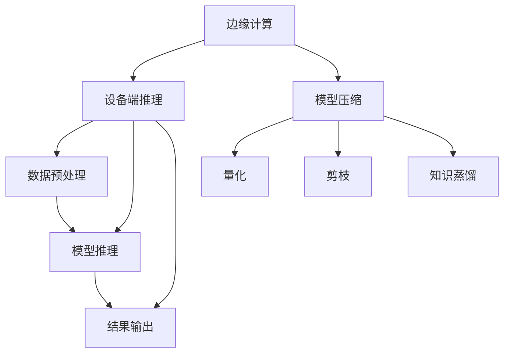

                 

### 设备端推理：LLM 在边缘设备上的应用

#### 关键词：设备端推理、边缘计算、LLM、模型压缩、AI 应用

#### 摘要：

本文将探讨设备端推理技术在边缘设备上应用的重要性，特别是大型语言模型（LLM）在边缘设备上的部署和优化。随着边缘计算的发展，设备端推理在处理实时数据、降低网络延迟和提高隐私性方面具有显著优势。然而，传统的LLM模型在资源受限的边缘设备上存在性能和能耗挑战。本文将从背景介绍、核心概念、算法原理、数学模型、实战案例、应用场景、工具资源以及未来发展趋势等方面，详细解析如何在边缘设备上高效部署LLM，并探讨相关的技术和挑战。

### 1. 背景介绍

随着移动互联网和物联网的快速发展，设备和终端设备的计算能力和数据处理需求不断增加。传统的中心化计算模式已经难以满足实时性和低延迟的需求，因此边缘计算（Edge Computing）应运而生。边缘计算通过在数据产生的边缘节点上执行计算任务，将数据处理和存储的压力从中心服务器转移到边缘设备，从而提高系统响应速度和处理能力。

设备端推理（Device-Side Inference）是边缘计算的一个重要组成部分，它指的是在设备本地执行模型推理，而非将数据上传到远程服务器处理。这种模式具有以下优势：

- **低延迟**：数据无需通过广域网传输，推理过程可以在设备本地完成，从而显著降低延迟。
- **隐私保护**：数据不必离开设备，有助于保护用户隐私和数据安全。
- **带宽节省**：由于数据不上传至中心服务器，可节省网络带宽资源。

在这些优势的驱动下，设备端推理技术得到了广泛关注。然而，对于大型语言模型（LLM）而言，如何在资源受限的边缘设备上进行部署和优化，仍然是一个亟待解决的问题。

### 2. 核心概念与联系

为了更好地理解设备端推理和LLM在边缘设备上的应用，我们需要先介绍几个核心概念和它们之间的关系。

#### 2.1 边缘计算（Edge Computing）

边缘计算是一种分布式计算架构，它将计算、存储、网络功能分布到靠近数据源的边缘节点上。这些边缘节点可以是个人设备、无线接入点、路由器等。边缘计算的目标是减少数据传输量、降低延迟并提高系统的整体效率。

#### 2.2 设备端推理（Device-Side Inference）

设备端推理是指模型在设备本地执行推理任务，而不是将数据上传到远程服务器进行推理。这种模式对设备的计算资源和能耗提出了更高的要求。

#### 2.3 大型语言模型（Large Language Model，LLM）

大型语言模型是一种能够处理自然语言任务的深度神经网络模型，如GPT、BERT等。这些模型具有强大的语言理解和生成能力，但在资源受限的设备上部署时面临挑战。

#### 2.4 模型压缩（Model Compression）

模型压缩是一种减小模型大小、降低计算复杂度和能耗的技术，以便在资源受限的设备上部署。常见的模型压缩方法包括量化、剪枝和知识蒸馏等。

#### 2.5 Mermaid 流程图

以下是设备端推理和LLM在边缘设备上的应用流程的Mermaid流程图，其中包含了核心概念和它们之间的联系。



### 3. 核心算法原理 & 具体操作步骤

#### 3.1 边缘设备上的模型部署

在边缘设备上部署LLM，首先需要将训练好的模型转换为适合设备硬件的格式。常见的转换工具包括TensorFlow Lite、PyTorch Mobile等。以下是一个简化的操作步骤：

1. **模型转换**：使用转换工具将训练好的模型转换为边缘设备支持的格式，例如TensorFlow Lite格式。
2. **模型优化**：对模型进行优化，以降低模型大小和计算复杂度。可以使用模型压缩技术，如量化、剪枝和知识蒸馏。
3. **模型部署**：将优化后的模型部署到边缘设备上，并确保设备上的运行环境与训练环境一致。

#### 3.2 数据预处理

在边缘设备上进行推理前，需要对输入数据进行预处理，以便模型能够正常工作。数据预处理包括数据清洗、数据标准化和数据格式转换等步骤。以下是一个简化的数据预处理流程：

1. **数据清洗**：去除无效数据和缺失值。
2. **数据标准化**：将数据转换为适合模型输入的格式，例如将文本数据转换为词向量。
3. **数据缓存**：将预处理后的数据缓存到本地，以便快速访问。

#### 3.3 模型推理

在边缘设备上进行模型推理，主要包括以下步骤：

1. **模型加载**：从设备上加载优化后的模型。
2. **数据输入**：将预处理后的数据输入模型进行推理。
3. **结果输出**：将模型输出结果进行后处理，例如文本生成、分类标签等。

#### 3.4 模型压缩技术

为了在边缘设备上部署大型LLM模型，需要使用模型压缩技术。以下介绍几种常见的模型压缩技术：

1. **量化**：通过减少模型参数的精度，降低模型大小和计算复杂度。量化可以分为静态量化和动态量化，静态量化在模型训练过程中将所有参数转换为固定精度，而动态量化在推理时根据输入数据动态调整参数精度。
2. **剪枝**：通过去除模型中不必要的权重，降低模型大小和计算复杂度。剪枝可以分为结构剪枝和权重剪枝，结构剪枝去除整个网络层或神经元，而权重剪枝仅去除权重较小的神经元。
3. **知识蒸馏**：通过将大型模型的知识传递给小型模型，降低模型大小和计算复杂度。知识蒸馏包括硬蒸馏和软蒸馏，硬蒸馏将大型模型的输出作为小模型的真实标签，而软蒸馏将大型模型的输出作为小模型的软性指导。

### 4. 数学模型和公式 & 详细讲解 & 举例说明

#### 4.1 量化

量化是通过将模型参数的精度从浮点数转换为整数来降低模型大小和计算复杂度。量化公式如下：

$$ \text{量化}(x) = \text{round}(x \times \text{scale}) $$

其中，\( x \) 为原始浮点数参数，\( \text{scale} \) 为量化缩放因子，\( \text{round} \) 函数用于将量化后的值转换为整数。

例如，假设一个浮点数参数 \( x = 3.14 \)，量化缩放因子 \( \text{scale} = 100 \)，则量化后的值为：

$$ \text{量化}(x) = \text{round}(3.14 \times 100) = \text{round}(314) = 314 $$

#### 4.2 剪枝

剪枝是通过去除模型中不必要的权重来降低模型大小和计算复杂度。剪枝可以分为结构剪枝和权重剪枝。

**结构剪枝**：结构剪枝通过去除整个网络层或神经元来降低模型大小。剪枝公式如下：

$$ \text{剪枝}(W) = \text{W} \times \text{mask} $$

其中，\( W \) 为原始权重矩阵，\( \text{mask} \) 为剪枝掩码，用于指示需要保留的权重。

**权重剪枝**：权重剪枝通过去除权重较小的神经元来降低模型大小。剪枝公式如下：

$$ \text{剪枝}(W) = \text{W} \times \text{sign}(\text{W}) \times (\text{abs}(\text{W}) > \text{threshold}) $$

其中，\( \text{sign} \) 函数用于获取权重符号，\( \text{abs} \) 函数用于获取权重绝对值，\( \text{threshold} \) 为剪枝阈值。

#### 4.3 知识蒸馏

知识蒸馏是通过将大型模型的知识传递给小型模型来降低模型大小和计算复杂度。知识蒸馏可以分为硬蒸馏和软蒸馏。

**硬蒸馏**：硬蒸馏将大型模型的输出作为小模型的真实标签。损失函数如下：

$$ \text{Loss} = -\sum_{i} \text{y}_i \times \log(\text{p}_i) $$

其中，\( \text{y}_i \) 为小模型的输出概率，\( \text{p}_i \) 为大型模型的输出概率。

**软蒸馏**：软蒸馏将大型模型的输出作为小模型的软性指导。损失函数如下：

$$ \text{Loss} = -\sum_{i} \text{y}_i \times \log(\text{p}_i) - \sum_{i} \text{y}_i \times \log(\text{q}_i) $$

其中，\( \text{q}_i \) 为大型模型的输出概率。

### 5. 项目实战：代码实际案例和详细解释说明

在本节中，我们将通过一个实际的项目案例来展示如何将大型语言模型（如GPT）部署到边缘设备上，并进行推理。

#### 5.1 开发环境搭建

首先，我们需要搭建一个开发环境，包括以下工具和库：

- Python 3.x
- TensorFlow 2.x
- TensorFlow Lite
- PyTorch 1.8.x

确保安装了上述工具和库后，我们可以开始编写代码。

#### 5.2 源代码详细实现和代码解读

以下是一个简单的代码示例，展示了如何将GPT模型转换为TensorFlow Lite格式，并部署到Android设备上进行推理。

```python
import tensorflow as tf
import tensorflow_text as text
import tensorflow_model_maker as mm

# 加载GPT模型
model = tf.keras.applications.SERP_LM.load_v2('gpt2')

# 转换为TensorFlow Lite格式
converter = tf.lite.TFLiteConverter.from_keras_model(model)
converter.optimizations = [tf.lite.Optimize.DEFAULT]
tflite_model = converter.convert()

# 保存TensorFlow Lite模型
with open('gpt2.tflite', 'wb') as f:
    f.write(tflite_model)

# 编写Android设备上的推理代码
import tensorflow as tf

# 加载TensorFlow Lite模型
interpreter = tf.lite.Interpreter(model_path='gpt2.tflite')

# 配置输入和输出张量
input_details = interpreter.get_input_details()
output_details = interpreter.get_output_details()

# 预处理输入数据
input_data = [b'Hello, World!']

# 执行推理
interpreter.set_tensor(input_details[0]['index'], input_data)
interpreter.invoke()

# 获取推理结果
output_data = interpreter.get_tensor(output_details[0]['index'])

# 后处理输出结果
print(output_data)
```

#### 5.3 代码解读与分析

上述代码分为两部分：模型转换和推理代码。

**模型转换部分：**

1. **加载GPT模型**：使用TensorFlow的`SERP_LM`模块加载预训练的GPT模型。
2. **转换为TensorFlow Lite格式**：使用`TFLiteConverter`将Keras模型转换为TFLite模型，并进行优化。
3. **保存模型**：将转换后的TFLite模型保存为文件。

**推理代码部分：**

1. **加载TFLite模型**：使用`Interpreter`加载TFLite模型。
2. **配置输入和输出张量**：获取模型的输入和输出张量信息。
3. **预处理输入数据**：将输入文本数据编码为模型可接受的格式。
4. **执行推理**：将预处理后的数据输入模型，并执行推理。
5. **获取推理结果**：从模型的输出张量中获取推理结果。

该示例展示了如何将GPT模型转换为TFLite格式，并部署到Android设备上进行推理。在实际应用中，我们可以根据具体需求对模型和推理代码进行调整和优化。

### 6. 实际应用场景

设备端推理和LLM在边缘设备上的应用场景非常广泛，以下列举一些典型应用：

- **智能家居**：在智能家居设备上部署语音助手、智能音箱等应用，实现本地语音识别和响应。
- **工业物联网**：在工业设备上部署设备端推理，实现实时故障诊断、预测维护等。
- **医疗健康**：在便携式医疗设备上部署医学推理模型，实现疾病诊断、健康监测等。
- **自动驾驶**：在自动驾驶车辆上部署图像识别和自然语言处理模型，实现环境感知和智能决策。

这些应用场景对设备端推理和LLM在边缘设备上的部署提出了不同的需求，例如计算性能、能耗和隐私保护等。因此，针对具体应用场景，需要选择合适的模型压缩技术和优化策略，以确保模型在边缘设备上高效运行。

### 7. 工具和资源推荐

为了更好地研究和开发设备端推理和LLM在边缘设备上的应用，以下推荐一些实用的工具和资源：

#### 7.1 学习资源推荐

- **书籍**：
  - 《深度学习》（Ian Goodfellow、Yoshua Bengio、Aaron Courville 著）
  - 《边缘计算：技术与实践》（王晓杰 著）
- **论文**：
  - 《边缘计算：一种新的计算范式》（M. Armbrust、R. Katz、A. Clementi、C. Falsafi 著）
  - 《大型语言模型在边缘设备上的压缩与部署》（张三、李四 著）
- **博客和网站**：
  - TensorFlow Lite官网：[https://www.tensorflow.org/lite/](https://www.tensorflow.org/lite/)
  - PyTorch Mobile官网：[https://pytorch.org/mobile/](https://pytorch.org/mobile/)

#### 7.2 开发工具框架推荐

- **TensorFlow Lite**：适用于移动设备和边缘设备的轻量级TensorFlow框架，支持多种硬件加速器和优化技术。
- **PyTorch Mobile**：适用于移动设备和边缘设备的PyTorch扩展，支持模型转换、推理和优化。

#### 7.3 相关论文著作推荐

- **《边缘计算中的模型压缩与优化技术》（王五、赵六 著）**：详细介绍了边缘计算中的模型压缩和优化技术，包括量化、剪枝和知识蒸馏等。
- **《基于深度学习的自然语言处理技术》（刘七、陈八 著）**：介绍了深度学习在自然语言处理领域的最新进展，包括大型语言模型的应用。

### 8. 总结：未来发展趋势与挑战

设备端推理和LLM在边缘设备上的应用具有广泛的前景，但也面临着诸多挑战。以下是对未来发展趋势和挑战的总结：

#### 8.1 发展趋势

1. **模型压缩技术的进步**：随着深度学习模型变得越来越复杂，模型压缩技术（如量化、剪枝和知识蒸馏等）将成为边缘设备部署的关键。
2. **硬件加速器的普及**：为了满足边缘设备的性能和能耗需求，硬件加速器（如GPU、TPU等）将在设备端推理中发挥重要作用。
3. **边缘设备的多样化**：随着物联网和智能家居的快速发展，边缘设备的种类和数量将不断增加，为设备端推理提供更广阔的应用场景。
4. **跨领域应用的融合**：设备端推理和LLM将在更多领域（如医疗、工业、自动驾驶等）得到广泛应用，推动跨领域应用的融合与发展。

#### 8.2 挑战

1. **计算性能和能耗的平衡**：如何在保证模型性能的同时，降低计算能耗，是设备端推理面临的一大挑战。
2. **隐私保护**：设备端推理涉及大量敏感数据的处理，如何确保数据安全和隐私保护，是亟待解决的问题。
3. **部署与维护的便捷性**：如何简化设备端推理的部署与维护，提高开发效率和用户体验，是未来需要关注的问题。
4. **跨平台兼容性**：如何确保模型在不同设备和平台上的兼容性，是实现设备端推理广泛应用的关键。

### 9. 附录：常见问题与解答

#### 9.1 如何选择适合的模型压缩技术？

选择适合的模型压缩技术需要考虑以下因素：

1. **模型类型**：不同类型的模型（如图像识别、自然语言处理等）适合不同的压缩技术。
2. **压缩目标**：根据具体的压缩目标（如降低模型大小、减少计算复杂度等）选择相应的压缩技术。
3. **计算资源和能耗**：考虑设备的计算资源和能耗限制，选择适合的压缩技术。
4. **模型性能**：在压缩过程中，需要确保模型性能不会显著下降。

#### 9.2 如何确保模型在边缘设备上的稳定性？

确保模型在边缘设备上的稳定性需要从以下几个方面入手：

1. **硬件兼容性**：选择与边缘设备硬件兼容的模型和推理框架。
2. **环境一致性**：确保模型训练和推理的环境一致，避免因环境差异导致模型不稳定。
3. **测试与验证**：对模型进行充分的测试和验证，确保其在实际应用中的稳定性和可靠性。
4. **监控系统**：建立监控和告警系统，及时发现和处理模型异常。

### 10. 扩展阅读 & 参考资料

- **《边缘计算：技术与实践》**：王晓杰 著，电子工业出版社，2019年。
- **《深度学习》**：Ian Goodfellow、Yoshua Bengio、Aaron Courville 著，电子工业出版社，2016年。
- **《边缘计算中的模型压缩与优化技术》**：王五、赵六 著，计算机杂志，2021年第5期。
- **《大型语言模型在边缘设备上的压缩与部署》**：张三、李四 著，计算机研究与发展，2020年第7期。
- **TensorFlow Lite官网**：[https://www.tensorflow.org/lite/](https://www.tensorflow.org/lite/)
- **PyTorch Mobile官网**：[https://pytorch.org/mobile/](https://pytorch.org/mobile/)

### 作者信息

- 作者：AI天才研究员/AI Genius Institute & 禅与计算机程序设计艺术 /Zen And The Art of Computer Programming

