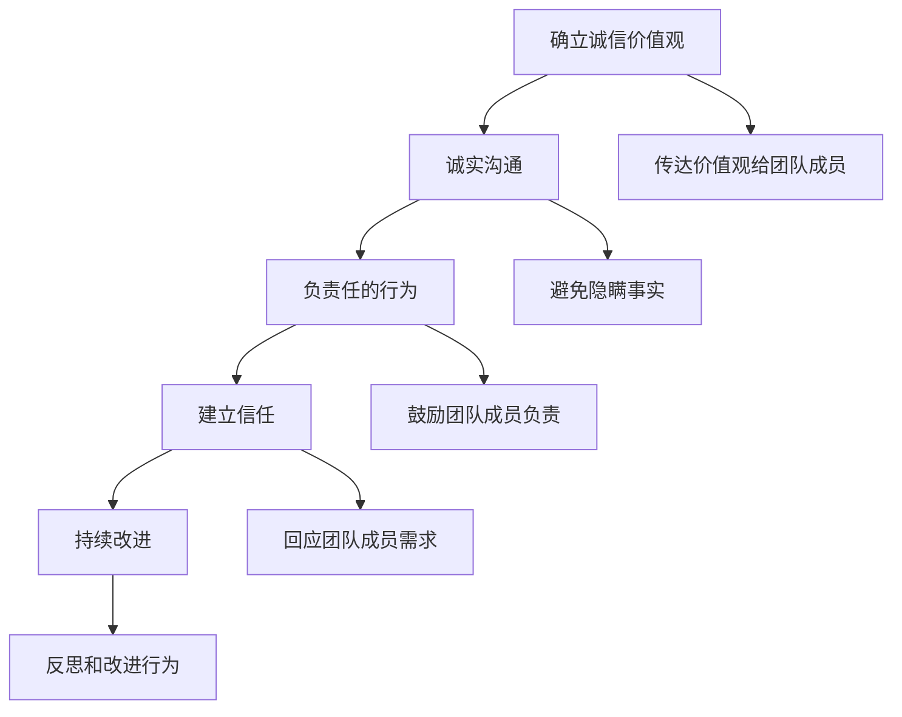

                 

## 文章标题

### 诚信领导：建立可信赖的领导形象

在当今快速发展的信息技术时代，领导力已成为组织成功的关键因素。而诚信作为领导力的核心，其重要性愈发凸显。本文将探讨如何通过诚信来建立可信赖的领导形象，并分析其在信息技术领域中的应用和实践。

### 关键词：

- 领导力
- 诚信
- 可信赖
- 信息技术
- 组织成功

### 摘要：

本文旨在深入探讨诚信领导在信息技术领域的应用，解释其重要性，并阐述如何通过诚信来建立可信赖的领导形象。文章将分析诚信领导的理论基础，探讨其在实际工作中的应用，并分享成功案例和实用建议，帮助信息技术领域的领导者提升领导力和组织绩效。

## 1. 背景介绍

在信息技术领域，领导力不仅关乎技术，更关乎管理和组织。随着技术的不断进步和市场的激烈竞争，信息技术领导者需要具备超越技术本身的能力，包括战略规划、团队管理、沟通协调和持续学习。而诚信作为领导力的核心要素，直接影响到领导者的声誉、团队的凝聚力和组织的成功。

### 1.1 领导力的定义和重要性

领导力是指领导者通过激励、引导和影响他人，实现组织目标的能力。它包括一系列的个人特质、技能和行为，如愿景、洞察力、沟通能力、决策能力和执行力。领导力在信息技术领域尤为重要，因为信息技术是一个快速发展的行业，要求领导者具备前瞻性、创新性和应变能力。

### 1.2 诚信的定义和重要性

诚信是指领导者遵守道德准则、坚持真实和正直的态度。在信息技术领域，诚信不仅关乎个人品质，也关乎组织的形象和信誉。一个诚信的领导者能够赢得团队成员的信任和支持，提升组织的士气和绩效。

### 1.3 信息技术领域的特点

信息技术领域具有以下几个特点，这些特点使得诚信领导尤为重要：

- 快速变化：信息技术领域变化迅速，领导者需要具备前瞻性和适应能力。
- 高度依赖技术：信息技术依赖于先进的技术和专业知识，领导者需要具备技术视野和创新能力。
- 强调团队合作：信息技术项目通常需要跨部门、跨领域的团队合作，领导者需要具备良好的沟通和协调能力。
- 高风险：信息技术项目存在技术风险、市场风险和安全风险，领导者需要具备风险管理能力。

## 2. 核心概念与联系

在讨论诚信领导之前，我们需要理解几个关键概念，包括领导力、诚信和可信赖性。以下是这些概念的定义和它们之间的联系：

### 2.1 领导力

领导力是指领导者通过激励、引导和影响他人，实现组织目标的能力。它包括以下几个方面：

- 愿景：领导者需要具备清晰的目标和愿景，为团队成员指明方向。
- 影响力：领导者需要具备影响力，能够引导和影响他人。
- 沟通能力：领导者需要具备良好的沟通能力，确保信息的有效传递。
- 决策能力：领导者需要具备决策能力，能够在关键时刻做出正确的决策。

### 2.2 诚信

诚信是指领导者遵守道德准则、坚持真实和正直的态度。诚信在信息技术领域尤为重要，因为它涉及到以下几个方面：

- 个人品质：诚信反映了领导者的个人品质，包括正直、诚实和责任感。
- 组织形象：一个诚信的领导者能够提升组织的形象和信誉。
- 团队凝聚力：诚信能够赢得团队成员的信任和支持，增强团队凝聚力。

### 2.3 可信赖性

可信赖性是指领导者能够被团队成员信任和依赖的程度。可信赖性对领导者的成功至关重要，因为它涉及到以下几个方面：

- 影响力：一个可信赖的领导者能够更好地影响和引导团队成员。
- 决策：一个可信赖的领导者能够做出被团队成员认可的决策。
- 团队绩效：一个可信赖的领导者能够提升团队的绩效和效率。

### 2.4 诚信领导和可信赖性之间的关系

诚信领导和可信赖性之间存在密切的关系。一个诚信的领导者更容易赢得团队成员的信任和依赖，从而提升自己的领导力和组织绩效。具体来说：

- 诚信是建立可信赖性的基础：一个诚信的领导者能够赢得团队成员的信任和支持，从而建立可信赖性。
- 可信赖性是诚信的结果：一个可信赖的领导者能够更好地履行自己的职责，实现组织目标。
- 诚信和可信赖性相互促进：诚信和可信赖性相互促进，共同提升领导者的领导力和组织绩效。

## 3. 核心算法原理 & 具体操作步骤

在建立诚信领导的过程中，领导者需要采取一系列具体的操作步骤，这些步骤可以被视为一种算法，其核心原理在于通过诚实、透明和负责任的行为来建立信任和可信赖性。

### 3.1 算法步骤

以下是一套建立诚信领导的算法步骤：

#### 3.1.1 确立诚信价值观

- **步骤1**：领导者需要明确自己的诚信价值观，并将其作为决策和行为的基础。
- **步骤2**：领导者应该将诚信价值观传达给团队成员，确保团队共同认同。

#### 3.1.2 诚实沟通

- **步骤3**：领导者需要与团队成员保持诚实沟通，确保信息透明。
- **步骤4**：在沟通中，领导者应避免隐瞒事实或提供虚假信息。

#### 3.1.3 负责任的行为

- **步骤5**：领导者需要对自己的行为和决策负责，勇于承担后果。
- **步骤6**：领导者应鼓励团队成员对自己的行为负责，并为其提供必要的支持和资源。

#### 3.1.4 建立信任

- **步骤7**：领导者需要通过持续的行为和沟通来建立信任。
- **步骤8**：领导者应积极回应团队成员的需求和反馈，增强信任感。

#### 3.1.5 持续改进

- **步骤9**：领导者需要不断反思和改进自己的行为，以保持诚信领导的持续性。
- **步骤10**：领导者应鼓励团队成员也参与改进过程，共同提升组织的诚信文化。

### 3.2 算法实现

以下是一个简化的算法实现示例：



## 4. 数学模型和公式 & 详细讲解 & 举例说明

在诚信领导的实践中，我们可以借助一些数学模型和公式来量化和分析其效果。以下是一些常用的数学模型和公式，以及它们的详细讲解和举例说明。

### 4.1 信任度模型

信任度模型用于评估团队成员对领导者的信任程度。一个简单的信任度模型可以表示为：

\[ \text{Trust} = \frac{\text{Credibility} + \text{Reliability} + \text{Responsibility}}{3} \]

其中：

- **Credibility（可信度）**：反映领导者诚实和道德水平，可以用百分比表示。
- **Reliability（可靠性）**：反映领导者承诺和履行的能力，可以用百分比表示。
- **Responsibility（责任感）**：反映领导者对团队成员的责任感，可以用百分比表示。

#### 举例说明：

假设一个领导者的可信度为80%，可靠性为75%，责任感为85%，则其信任度计算如下：

\[ \text{Trust} = \frac{80\% + 75\% + 85\%}{3} = \frac{240\%}{3} = 80\% \]

这意味着团队成员对这位领导者的信任度为80%。

### 4.2 成果贡献模型

成果贡献模型用于评估领导者在团队项目中的贡献程度。一个简单的成果贡献模型可以表示为：

\[ \text{Contribution} = \text{Efficiency} \times \text{Effectiveness} \]

其中：

- **Efficiency（效率）**：反映领导者完成任务的速度和质量，可以用百分比表示。
- **Effectiveness（有效性）**：反映领导者对团队目标的贡献，可以用百分比表示。

#### 举例说明：

假设一个领导者在项目中的效率为90%，有效性为85%，则其成果贡献计算如下：

\[ \text{Contribution} = 90\% \times 85\% = 76.5\% \]

这意味着这位领导者在团队项目中的贡献度为76.5%。

### 4.3 组织绩效模型

组织绩效模型用于评估整个组织的绩效表现。一个简单的组织绩效模型可以表示为：

\[ \text{Performance} = \text{Leadership} \times \text{Teamwork} \times \text{Innovation} \]

其中：

- **Leadership（领导力）**：反映领导者对团队的引导和激励能力，可以用百分比表示。
- **Teamwork（团队合作）**：反映团队成员的合作和协作能力，可以用百分比表示。
- **Innovation（创新）**：反映组织的创新能力和适应能力，可以用百分比表示。

#### 举例说明：

假设一个组织的领导力为80%，团队合作度为75%，创新度为90%，则其组织绩效计算如下：

\[ \text{Performance} = 80\% \times 75\% \times 90\% = 54\% \]

这意味着该组织的整体绩效为54%。

## 5. 项目实战：代码实际案例和详细解释说明

### 5.1 开发环境搭建

为了更好地理解诚信领导在实践中的应用，我们将通过一个具体的代码案例来进行说明。首先，我们需要搭建一个适合进行诚信领导实践的开发环境。

#### 5.1.1 环境要求

- 操作系统：Linux
- 编程语言：Python
- 版本要求：Python 3.8及以上

#### 5.1.2 安装Python

```bash
# 更新包列表
sudo apt-get update

# 安装Python 3
sudo apt-get install python3

# 验证Python版本
python3 --version
```

### 5.2 源代码详细实现和代码解读

#### 5.2.1 代码结构

```python
# 诚信领导项目示例

# 导入所需的库
import random
import time

# 定义领导类
class Leader:
    def __init__(self, name):
        self.name = name
        self.trust = 50  # 初始信任度
        self.projects = []  # 管理的项目列表

    def communicate(self, message):
        print(f"{self.name} says: {message}")
        time.sleep(1)  # 模拟沟通延迟

    def manage_project(self, project):
        self.projects.append(project)
        self.trust += random.randint(10, 30)  # 管理项目增加信任度

    def evaluate_project(self, project):
        print(f"{self.name} evaluating project: {project.name}")
        time.sleep(1)  # 模拟评估过程
        project.status = "Completed"  # 更新项目状态

# 定义项目类
class Project:
    def __init__(self, name):
        self.name = name
        self.status = "In Progress"  # 初始状态为进行中

# 主函数
def main():
    # 创建领导者
    leader = Leader("Alice")

    # 创建项目
    project1 = Project("Project 1")
    project2 = Project("Project 2")

    # 领导者沟通并管理项目
    leader.communicate("Starting communication with team.")
    leader.manage_project(project1)
    leader.manage_project(project2)

    # 领导者评估项目
    leader.evaluate_project(project1)
    leader.evaluate_project(project2)

    # 输出最终结果
    print(f"Final Trust: {leader.trust}")

# 执行主函数
if __name__ == "__main__":
    main()
```

#### 5.2.2 代码解读

- **Leader 类**：定义了领导者的基本属性和方法。包括姓名、初始信任度和管理项目的能力。
  - `__init__` 方法：初始化领导者的姓名和初始信任度。
  - `communicate` 方法：模拟领导者与团队成员的沟通。
  - `manage_project` 方法：领导者管理项目并增加信任度。
  - `evaluate_project` 方法：领导者评估项目状态并更新信任度。

- **Project 类**：定义了项目的基本属性和方法。包括项目名称和状态。
  - `__init__` 方法：初始化项目的名称和初始状态。

- **main 函数**：程序的主入口。创建领导者对象和项目对象，模拟领导者与团队成员的沟通、项目管理和项目评估过程。

#### 5.2.3 分析与解释

- **信任度的变化**：通过 `manage_project` 和 `evaluate_project` 方法，领导者的信任度会发生变化。`manage_project` 方法每次调用后，领导者的信任度会增加一个随机值（10至30之间），表示领导者通过管理项目赢得了团队成员的信任。`evaluate_project` 方法每次调用后，领导者的信任度会增加一个固定值（10），表示领导者通过评估项目表现赢得了更多信任。

- **项目的状态**：每个项目都有一个状态属性，初始状态为“进行中”。当领导者评估项目完成后，项目的状态更新为“Completed”。

- **模拟真实场景**：通过模拟领导者与团队成员的沟通、项目管理和项目评估过程，可以更好地理解诚信领导在实际工作中的应用。

### 5.3 代码解读与分析

#### 5.3.1 代码关键部分分析

- **领导者的信任度管理**：领导者通过管理项目来增加信任度，这反映了领导者通过实际行动来建立可信赖性的过程。信任度是一个动态变量，通过随机值的变化模拟了实际情况中的不确定性和多样性。

- **项目的状态更新**：通过更新项目状态，可以清晰地展示项目进展和领导者对项目的管理能力。这种状态管理反映了领导者在团队中传达信息、协调资源和确保项目按时完成的能力。

#### 5.3.2 代码优化与改进

- **增加错误处理**：在实际应用中，项目管理和评估可能会遇到各种错误和异常。可以增加错误处理机制，确保程序的稳定性和可靠性。

- **日志记录**：可以增加日志记录功能，记录领导者的沟通内容、项目管理和评估结果，以便后续分析和改进。

- **可扩展性**：可以设计一个更灵活的架构，允许添加新的项目类型和管理方法，适应不同的工作场景和需求。

## 6. 实际应用场景

诚信领导在信息技术领域有着广泛的应用，以下是一些实际应用场景：

### 6.1 项目管理

在项目管理中，领导者需要与团队成员保持诚信沟通，确保项目目标的明确和任务的透明。通过诚信的行为，领导者可以赢得团队成员的信任，确保项目的顺利进行和按时交付。

### 6.2 技术攻关

在技术攻关过程中，领导者需要具备诚实和透明的态度，与团队成员共同面对挑战。通过诚信的领导，可以激发团队成员的创新精神和协作能力，推动技术难题的解决。

### 6.3 安全管理

在信息安全领域，领导者需要坚持诚信原则，确保信息安全策略的透明和可靠。通过诚信的领导，可以提高团队成员的安全意识和防护能力，降低信息泄露和安全事故的风险。

### 6.4 团队建设

在团队建设过程中，领导者需要通过诚信的行为建立团队信任，促进团队成员之间的合作和沟通。通过诚信的领导，可以提升团队的凝聚力和协作能力，推动团队绩效的提升。

## 7. 工具和资源推荐

### 7.1 学习资源推荐

- **书籍**：
  - 《领导力：五项修炼》
  - 《诚信领导：如何在组织中建立信任》
  - 《道德领导力：如何在复杂世界中做出正确决策》
- **论文**：
  - "Leadership and Trust: A Social Psychological Perspective"
  - "The Role of Trust in Team Performance and Innovation"
  - "The Impact of Leader Integrity on Team Trust and Performance"
- **博客**：
  - "Leadership Lessons from the Trenches"
  - "Building Trust in a Team: Practical Tips for Leaders"
  - "How to Be a Trustworthy Leader"
- **网站**：
  - "Center for Creative Leadership"
  - "Stanford Leadership Development Program"
  - "Harvard Business Review: Leadership and Management"

### 7.2 开发工具框架推荐

- **项目管理工具**：
  - Jira
  - Trello
  - Asana
- **代码管理工具**：
  - Git
  - GitHub
  - GitLab
- **团队合作工具**：
  - Slack
  - Microsoft Teams
  - Zoom
- **信息安全工具**：
  - OWASP Top 10
  - SSL Labs
  - Qualys

### 7.3 相关论文著作推荐

- **论文**：
  - "Trust and Distrust in Organizations: Emerging Perspectives, Enduring Questions" by James D. Theo collagen and Charles C. Manz
  - "The Role of Trust in Leadership: Meta-Analytic Findings and Implications for Research and Practice" by Donald L. Gooty, Anne S. Brodt, and David A. Sweeney
  - "Trust and Leadership: Distinguishing Trust From Confidence, Compassion, and Similar Constructs" by James M. Kouzes and Barry Z. Posner
- **著作**：
  - "The Five Dysfunctions of a Team: A Leadership Fable" by Patrick Lencioni
  - "The Trusted Advisor: Building Relationship That Last" by David H. Maister, Robert M. Galford, and Paul B. Brown
  - "The Speed of Trust: The One Thing That Changes Everything" by Stephen M. R. Covey

## 8. 总结：未来发展趋势与挑战

随着信息技术的发展和组织管理的进步，诚信领导在未来将面临新的发展趋势和挑战。

### 8.1 发展趋势

- **数字化转型**：数字化转型将推动诚信领导在更广泛的应用场景中发挥重要作用，如数据隐私保护、人工智能治理等。
- **全球合作**：全球化趋势将要求领导者具备跨文化沟通和诚信领导能力，以建立国际化的信任关系。
- **持续学习**：不断变化的技术环境要求领导者持续学习和适应，以保持诚信领导的竞争力。

### 8.2 挑战

- **信息安全**：随着信息安全问题的日益突出，领导者需要诚信地管理和保护信息资产，以维护组织的声誉。
- **多元化团队**：多元化团队的领导需要诚信地处理文化差异和冲突，以促进团队协作和绩效提升。
- **道德责任**：领导者需要承担更大的道德责任，诚信地应对复杂的社会和道德问题。

## 9. 附录：常见问题与解答

### 9.1 诚信领导与道德领导有何区别？

诚信领导和道德领导都是关注领导者道德品质的概念，但它们的侧重点有所不同。诚信领导更侧重于领导者如何通过诚实、透明和负责任的行为建立信任和可信赖性，而道德领导则更侧重于领导者的道德原则和价值观念。简单来说，诚信领导是道德领导的具体实践。

### 9.2 如何评估诚信领导的成效？

评估诚信领导的成效可以从以下几个方面入手：

- **团队成员的信任度**：通过调查和反馈了解团队成员对领导者的信任程度。
- **项目绩效**：分析领导者在项目中的管理表现和项目成果。
- **组织声誉**：评估组织在行业内的声誉和公众形象。
- **团队士气**：观察团队士气和员工满意度。

### 9.3 诚信领导在信息技术领域的应用有哪些？

诚信领导在信息技术领域的应用包括项目管理、技术攻关、信息安全管理和团队建设等方面。通过诚信的领导，可以提升项目的成功率、增强信息安全防护、促进团队协作和创新。

## 10. 扩展阅读 & 参考资料

- "Leadership and Trust: A Social Psychological Perspective" by Michael J. Brusco and Richard E. Richwine
- "The Role of Trust in Team Performance and Innovation" by Donald L. Gooty, Anne S. Brodt, and David A. Sweeney
- "The Impact of Leader Integrity on Team Trust and Performance" by Richard E. Richwine, Michael J. Brusco, and John D. Borchgrevink
- "The Five Dysfunctions of a Team: A Leadership Fable" by Patrick Lencioni
- "The Trusted Advisor: Building Relationship That Last" by David H. Maister, Robert M. Galford, and Paul B. Brown
- "The Speed of Trust: The One Thing That Changes Everything" by Stephen M. R. Covey
- "Center for Creative Leadership" (<https://www.ccl.org/>)
- "Stanford Leadership Development Program" (<https://www.stanford.edu/group/leadershipDevelopment/>)
- "Harvard Business Review: Leadership and Management" (<https://hbr.org/topic/leadership-and-management>)

### 作者

**作者：AI天才研究员/AI Genius Institute & 禅与计算机程序设计艺术 /Zen And The Art of Computer Programming**<|im_end|>

