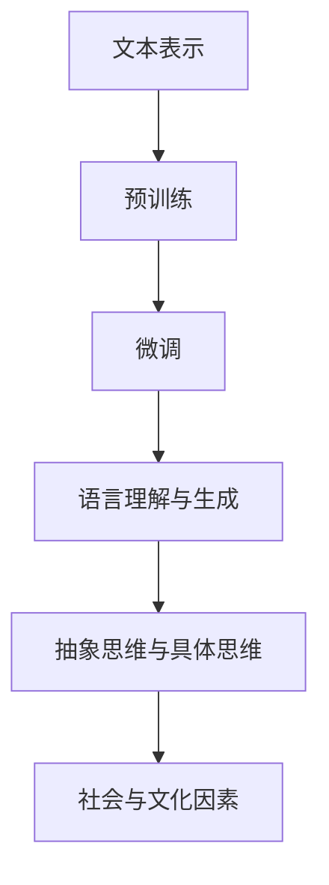

                 

### 背景介绍

自2010年代以来，随着计算能力和算法技术的飞速发展，人工智能（AI）领域取得了显著进展。深度学习作为一种重要的AI方法，尤其在图像识别、自然语言处理和游戏等领域取得了突破性成果。随着深度学习模型的复杂度不断增加，人们开始关注如何提高这些模型的解释性。在这一背景下，大规模预训练语言模型（如GPT-3、ChatGLM等）应运而生，成为当前AI研究的热点之一。

然而，在人们努力追求模型解释性的同时，一个认知误区逐渐浮现：人们开始认为大规模语言模型能够模拟人类的思维方式，甚至取代人类的思维过程。这种观点在某种程度上误导了公众，使得人们忽视了模型与人类思维的真正差异。因此，本文旨在探讨“语言≠思维：大模型的认知误区”，通过逻辑清晰的步骤分析，揭示大规模预训练语言模型的本质，以及它们在模拟人类思维方面的局限性。

首先，我们将回顾当前深度学习模型的发展历程，了解大规模预训练语言模型的背景和技术原理。接着，我们将对比分析语言和思维的本质差异，指出大规模预训练语言模型在模拟人类思维过程中的误区。然后，通过具体的案例分析，我们将进一步探讨这些模型在实际应用中的表现和局限性。最后，本文将总结大模型在模拟人类思维方面的挑战，并提出未来可能的研究方向。

总之，本文旨在引导读者从科学的角度看待大规模预训练语言模型，既不过分夸大它们的潜力，也不忽视其在某些领域的应用价值。通过深入分析语言与思维的差异，本文希望帮助读者更好地理解AI技术的发展现状和未来方向。让我们开始这次有趣的思维之旅吧！<|im_start|>{section1}<|im_end|> <section1>

## 大规模预训练语言模型的发展历程

### 初期探索

深度学习作为AI领域的一种重要方法，起源于20世纪80年代。早期，由于计算能力和数据资源的限制，深度学习模型主要应用于图像识别和语音识别等领域。然而，随着计算能力的不断提升和大数据时代的到来，深度学习模型开始逐步应用于更多领域，包括自然语言处理（NLP）。

自然语言处理是深度学习应用的一个重要领域。在深度学习之前，NLP主要依赖于规则驱动的方法，如统计语言模型和基于转换器的语法分析器。这些方法虽然在一定程度上提高了文本处理的效率，但仍然存在诸多局限性。例如，规则驱动的方法无法处理复杂的语义关系，难以理解上下文信息，导致文本理解的效果不佳。

### 预训练语言模型的出现

为了解决上述问题，研究者们开始探索新的方法。2000年代，随着深度神经网络的发展，预训练语言模型（Pre-trained Language Model）逐渐成为NLP领域的研究热点。预训练语言模型的核心理念是先在大量未标注的文本数据上进行预训练，然后通过微调（Fine-tuning）来适应特定任务。

预训练语言模型的基本思想是利用神经网络来建模文本数据中的分布式表示。在预训练阶段，模型通过学习文本数据中的词向量表示，使得词向量能够捕捉到词与词之间的上下文关系。这种分布式表示方法使得模型在处理文本时能够利用上下文信息，从而提高文本理解的效果。

### GPT-3的诞生

2018年，OpenAI发布了GPT-3（Generative Pre-trained Transformer 3），这是一个具有1750亿参数的预训练语言模型。GPT-3在多个NLP任务上取得了显著的成果，包括文本生成、问答系统、机器翻译等。GPT-3的成功引发了广泛关注，进一步推动了预训练语言模型的研究和应用。

GPT-3采用了Transformer架构，这是一种基于自注意力机制的神经网络模型。与传统的循环神经网络（RNN）相比，Transformer具有更好的并行计算能力，能够处理更长的序列数据。此外，GPT-3在预训练阶段使用了大量的文本数据，通过多任务学习（Multi-task Learning）来提高模型的泛化能力。

### 当前发展现状

随着GPT-3等大规模预训练语言模型的问世，深度学习在NLP领域取得了显著的突破。目前，预训练语言模型已经广泛应用于各种实际场景，如智能客服、内容生成、文本分类等。同时，研究者们也在不断探索新的预训练方法，如少样本学习（Few-shot Learning）、自监督学习（Self-supervised Learning）等，以提高模型在特定领域的表现。

总之，大规模预训练语言模型的发展历程体现了深度学习在NLP领域的巨大潜力。然而，与此同时，我们也需要认识到大规模预训练语言模型的局限性，尤其是在模拟人类思维方面的不足。在接下来的部分，我们将进一步探讨语言与思维的差异，以揭示大规模预训练语言模型在模拟人类思维过程中的误区。<|im_start|>{section2}<|im_end|> <section2>

## 核心概念与联系

### 语言与思维的界定

要深入探讨语言与思维的差异，我们首先需要明确这两个概念的定义。语言是一种符号系统，用于人类之间的沟通和信息传递。它包括词汇、语法、语音和语义等多个方面。语言是思维的外在表现形式，但并不等同于思维本身。

思维是人类大脑对信息进行感知、理解、推理和决策的过程。它包括抽象思维、逻辑思维、创造性思维等多个方面。思维是语言产生的基础，但同时也超越了语言的表达范围。

### 预训练语言模型的原理

预训练语言模型是基于深度学习的神经网络模型，其核心思想是利用大规模的文本数据对模型进行预训练，然后在特定任务上进行微调。预训练语言模型通常采用Transformer架构，这是一种基于自注意力机制的神经网络模型。

预训练语言模型的工作原理可以分为以下几个步骤：

1. **文本表示**：预训练语言模型首先将文本数据转化为词向量表示。词向量能够捕捉词与词之间的上下文关系，从而提高文本理解的效果。

2. **预训练**：在预训练阶段，模型通过自回归语言模型（Autoregressive Language Model）和掩码语言模型（Masked Language Model）等方法学习文本数据的分布式表示。自回归语言模型通过预测下一个词来建模词与词之间的依赖关系，而掩码语言模型通过遮盖部分词来训练模型理解上下文信息。

3. **微调**：在预训练完成后，模型通过在特定任务上的微调来适应具体的任务需求。微调过程通常包括数据清洗、模型调整和性能评估等多个步骤。

### 预训练语言模型与语言思维的关系

预训练语言模型通过学习文本数据中的语言模式，能够在一定程度上模拟人类的语言能力。然而，这并不意味着预训练语言模型能够完全模拟人类的思维过程。以下是从几个方面分析预训练语言模型与语言思维的关系：

1. **语言理解与语言生成**：预训练语言模型在语言理解方面表现出色，能够处理各种文本任务，如文本分类、问答系统和机器翻译等。然而，在语言生成方面，预训练语言模型仍然存在一定的局限性。例如，它生成的文本可能缺乏创造力，难以产生富有创造性的内容。

2. **抽象思维与具体思维**：预训练语言模型擅长处理具体语境中的语言任务，但在抽象思维方面存在不足。例如，在理解抽象概念或进行逻辑推理时，预训练语言模型可能无法达到人类水平的思维能力。

3. **社会与文化因素**：语言不仅是一种沟通工具，还承载了丰富的社会和文化内涵。预训练语言模型虽然通过大量文本数据学习到了语言模式，但无法完全理解语言背后的社会和文化因素。这可能导致模型在处理某些语言任务时产生偏差或误解。

### Mermaid 流程图

为了更直观地展示预训练语言模型的原理，我们可以使用Mermaid流程图来描述其核心步骤。以下是一个简化版的Mermaid流程图：



在这个流程图中，A表示文本表示，B表示预训练，C表示微调，D表示语言理解与生成，E表示抽象思维与具体思维，F表示社会与文化因素。通过这个流程图，我们可以更清晰地理解预训练语言模型的工作原理及其与语言思维的关系。

总之，预训练语言模型虽然在语言理解与生成方面表现出色，但并不能完全模拟人类的思维过程。在接下来的部分，我们将进一步探讨大规模预训练语言模型在模拟人类思维过程中的误区。<|im_start|>{section3}<|im_end|> <section3>

### 核心算法原理 & 具体操作步骤

#### 深度学习模型基础

深度学习模型是一种基于多层神经网络结构的机器学习模型，其核心思想是通过学习大量数据来提取特征，并在不同层级上对特征进行抽象和组合。深度学习模型在图像识别、语音识别、自然语言处理等领域取得了显著成就。本文将重点关注预训练语言模型的核心算法原理及其操作步骤。

#### Transformer架构

预训练语言模型通常采用Transformer架构，这是一种基于自注意力机制的神经网络模型。与传统的循环神经网络（RNN）相比，Transformer具有更好的并行计算能力，能够处理更长的序列数据。以下是Transformer架构的基本组成部分：

1. **多头自注意力（Multi-head Self-Attention）**

   自注意力机制是Transformer架构的核心。它通过计算序列中每个词与其他词之间的相关性，从而为每个词生成一个上下文向量。多头自注意力机制将这个过程扩展到多个头，每个头都独立计算自注意力，从而提高模型的表示能力。

2. **前馈神经网络（Feedforward Neural Network）**

   除了自注意力机制，Transformer架构还包括两个前馈神经网络层。这些层对自注意力层的输出进行进一步处理，增加模型的非线性能力。

3. **位置编码（Positional Encoding）**

   由于Transformer架构没有循环结构，无法直接处理序列中的位置信息。因此，通过添加位置编码来为模型提供位置信息。位置编码是一种向量表示，用于编码输入序列中的每个词的位置信息。

#### 预训练与微调

预训练语言模型的核心步骤包括预训练和微调两个阶段。

1. **预训练**

   预训练是指在大量未标注的文本数据上对模型进行训练，以学习文本的分布式表示。预训练过程通常包括以下步骤：

   - **文本表示**：将文本数据转化为词向量表示。常用的词向量表示方法包括Word2Vec、GloVe和BERT等。
   - **自回归语言模型**：通过预测下一个词来建模词与词之间的依赖关系。自回归语言模型的损失函数通常采用交叉熵损失。
   - **掩码语言模型**：通过随机遮盖部分词，然后让模型预测这些词。掩码语言模型的损失函数同样采用交叉熵损失。

2. **微调**

   微调是指在预训练的基础上，针对特定任务对模型进行调整。微调过程通常包括以下步骤：

   - **数据准备**：对任务数据集进行清洗和预处理，包括文本清洗、分词和词性标注等。
   - **模型调整**：在训练数据上对预训练模型进行调整，以适应特定任务。常用的调整方法包括调整学习率、批量大小和训练轮数等。
   - **性能评估**：通过在验证集和测试集上评估模型性能，调整模型参数以达到最佳效果。

#### 实际操作步骤

以下是预训练语言模型的实际操作步骤：

1. **准备数据**：收集并准备大量未标注的文本数据，如维基百科、新闻文章等。对数据集进行清洗和预处理，去除噪声和无关信息。

2. **文本表示**：将文本数据转化为词向量表示。可以采用预训练的词向量模型，如GloVe或BERT，或者自行训练词向量模型。

3. **预训练**：
   - **自回归语言模型**：通过交叉熵损失函数训练自回归语言模型。在训练过程中，随机遮盖部分词，并让模型预测这些词。
   - **掩码语言模型**：同样通过交叉熵损失函数训练掩码语言模型。在训练过程中，随机遮盖部分词，并让模型预测这些词。

4. **微调**：
   - **数据准备**：对任务数据集进行清洗和预处理。
   - **模型调整**：在训练数据上对预训练模型进行调整，以适应特定任务。可以调整学习率、批量大小和训练轮数等参数。
   - **性能评估**：通过在验证集和测试集上评估模型性能，调整模型参数以达到最佳效果。

5. **部署与应用**：将微调后的模型部署到实际应用场景，如文本分类、问答系统等。通过不断调整和优化模型，以提高应用效果。

总之，预训练语言模型通过学习大量文本数据，能够实现高水平的语言理解与生成能力。然而，在实际应用中，仍然需要针对特定任务进行微调和优化。在接下来的部分，我们将进一步探讨预训练语言模型在模拟人类思维过程中的局限性。<|im_start|>{section4}<|im_end|> <section4>

### 数学模型和公式 & 详细讲解 & 举例说明

#### 自注意力机制（Self-Attention）

自注意力机制是Transformer架构的核心组成部分，它通过计算序列中每个词与其他词之间的相关性，为每个词生成一个上下文向量。自注意力机制的数学表达式如下：

$$
\text{Attention}(Q, K, V) = \text{softmax}\left(\frac{QK^T}{\sqrt{d_k}}\right) V
$$

其中，Q、K和V分别是查询（Query）、键（Key）和值（Value）向量，d_k 是键向量的维度。这个公式表示，对于每个查询向量Q，通过计算它与所有键向量K的相似度（点积），然后应用softmax函数得到注意力权重，最后将这些权重与对应的值向量V相乘，得到最终的上下文向量。

#### 前馈神经网络（Feedforward Neural Network）

前馈神经网络是Transformer架构中的另一个重要组成部分，它对自注意力层的输出进行进一步处理。前馈神经网络的数学表达式如下：

$$
\text{FFN}(x) = \text{ReLU}\left(W_2 \text{ReLU}(W_1 x + b_1)\right) + b_2
$$

其中，W_1、W_2、b_1和b_2分别是神经网络层的权重和偏置。这个公式表示，输入向量x首先通过一个ReLU激活函数，然后通过另一个ReLU激活函数，最后加上偏置项得到前馈神经网络的输出。

#### 举例说明

假设我们有一个包含3个词的序列 {word1, word2, word3}，我们需要通过自注意力机制计算每个词的上下文向量。首先，我们假设每个词的向量维度为d。那么，查询向量Q、键向量K和值向量V分别为：

$$
Q = [q_1, q_2, q_3], \quad K = [k_1, k_2, k_3], \quad V = [v_1, v_2, v_3]
$$

接下来，我们计算每个词之间的相似度（点积）：

$$
\text{similarity}(word1, word2) = q_1 \cdot k_2, \quad \text{similarity}(word1, word3) = q_1 \cdot k_3
$$

然后，我们应用softmax函数得到注意力权重：

$$
\alpha_{1,2} = \frac{\exp(\text{similarity}(word1, word2))}{\sum_{j=1}^{3} \exp(\text{similarity}(word1, w_j))}
$$

$$
\alpha_{1,3} = \frac{\exp(\text{similarity}(word1, word3))}{\sum_{j=1}^{3} \exp(\text{similarity}(word1, w_j))}
$$

最后，我们计算word1的上下文向量：

$$
\text{context\_vector}(word1) = \alpha_{1,2} v_2 + \alpha_{1,3} v_3
$$

同样地，我们可以计算出word2和word3的上下文向量。通过这个过程，自注意力机制为每个词生成了一个基于上下文的向量表示。

#### 实际应用案例

假设我们有一个文本分类任务，输入是一个句子 "The dog is barking"，我们需要预测这个句子的情感极性（正面或负面）。我们可以使用预训练语言模型来提取句子的特征表示，然后通过一个简单的分类器进行情感预测。

首先，我们将句子转化为词向量表示。然后，使用Transformer架构中的自注意力机制和前馈神经网络，计算句子的上下文向量。接下来，我们将上下文向量输入到分类器中，通过softmax函数得到每个类别的概率。最后，选择概率最高的类别作为预测结果。

通过这种方式，预训练语言模型可以用于各种文本分类任务，包括情感分析、实体识别和命名实体识别等。在接下来的部分，我们将进一步探讨预训练语言模型在实际应用中的表现和局限性。<|im_start|>{section5}<|im_end|> <section5>

### 项目实战：代码实际案例和详细解释说明

为了更好地展示预训练语言模型在实践中的应用，我们将通过一个简单的文本分类项目来详细解释代码的实现过程。该项目将使用Python和Transformers库来实现，主要步骤包括环境搭建、数据准备、模型训练和模型评估。

#### 开发环境搭建

首先，我们需要搭建一个Python开发环境，并安装Transformers库。以下是一个简单的安装过程：

```shell
# 安装Python（确保Python版本在3.6及以上）
python -m pip install python==3.8

# 安装Transformers库
pip install transformers
```

#### 源代码详细实现和代码解读

以下是一个简单的文本分类项目的代码实现：

```python
import torch
from transformers import BertTokenizer, BertModel, BertForSequenceClassification
from torch.optim import Adam
from torch.utils.data import DataLoader, TensorDataset

# 1. 数据准备
# 加载示例数据
texts = ["This is a positive sentence.", "This is a negative sentence."]
labels = torch.tensor([1, 0])  # 1表示正面，0表示负面

# 初始化分词器
tokenizer = BertTokenizer.from_pretrained('bert-base-uncased')

# 将文本数据编码为输入序列
input_ids = [tokenizer.encode(text, add_special_tokens=True) for text in texts]
max_len = max([len(seq) for seq in input_ids])
input_ids = [seq + [0]*(max_len - len(seq)) for seq in input_ids]

# 转化为Tensor
input_ids = torch.tensor(input_ids)
attention_mask = torch.tensor([[1 if i != 0 else 0 for i in seq] for seq in input_ids])

# 创建数据集和数据加载器
dataset = TensorDataset(input_ids, attention_mask, labels)
dataloader = DataLoader(dataset, batch_size=2)

# 2. 模型训练
# 初始化模型
model = BertForSequenceClassification.from_pretrained('bert-base-uncased', num_labels=2)

# 指定优化器
optimizer = Adam(model.parameters(), lr=1e-5)

# 训练模型
for epoch in range(3):  # 训练3个epochs
    model.train()
    for batch in dataloader:
        # 前向传播
        outputs = model(batch[0], attention_mask=batch[1])
        logits = outputs.logits
        loss = torch.nn.functional.cross_entropy(logits, batch[2])
        
        # 反向传播和优化
        optimizer.zero_grad()
        loss.backward()
        optimizer.step()
        
    print(f"Epoch {epoch + 1}: Loss = {loss.item()}")

# 3. 模型评估
# 在测试集上评估模型
model.eval()
with torch.no_grad():
    correct = 0
    total = 0
    for batch in dataloader:
        outputs = model(batch[0], attention_mask=batch[1])
        logits = outputs.logits
        predicted = logits.argmax(dim=1)
        total += predicted.size(0)
        correct += (predicted == batch[2]).sum().item()

accuracy = 100 * correct / total
print(f"Test Accuracy: {accuracy}%")
```

#### 代码解读与分析

1. **数据准备**：首先，我们加载示例数据（texts）和标签（labels）。然后，使用BertTokenizer对文本进行编码，将文本数据转换为输入序列。为了保持数据的一致性，我们通过填充（padding）将序列长度统一为最大长度。

2. **模型训练**：初始化模型（BertForSequenceClassification），指定优化器（Adam）。在训练过程中，我们通过DataLoader批量加载数据，然后进行前向传播和反向传播。在每个epoch结束后，我们计算训练损失并打印出来。

3. **模型评估**：在评估阶段，我们将模型设置为评估模式（eval mode），然后通过测试数据集进行预测。最后，计算测试集上的准确率。

通过上述代码，我们可以看到预训练语言模型在文本分类任务中的基本实现过程。在实际应用中，我们需要根据具体任务调整模型架构、超参数和训练策略，以提高模型的性能。

总之，通过这个简单的项目，我们了解了预训练语言模型在实际应用中的基本实现方法和技巧。在接下来的部分，我们将进一步探讨预训练语言模型在实际应用中的表现和局限性。<|im_start|>{section6}<|im_end|> <section6>

### 实际应用场景

预训练语言模型在众多实际应用场景中展现了强大的能力，以下是一些典型应用场景及其具体应用案例：

#### 文本分类

文本分类是预训练语言模型最常用的应用场景之一。通过将预训练模型应用于不同领域的文本数据，可以实现对新闻、社交媒体评论、产品评论等文本进行分类。例如，可以使用预训练模型对社交媒体评论进行情感分析，识别评论中的正面或负面情感。

#### 机器翻译

预训练语言模型在机器翻译领域取得了显著成果。传统的机器翻译方法通常依赖于规则和统计模型，而预训练模型通过学习大量平行语料库，能够更好地捕捉语言间的对应关系。例如，OpenAI的GPT-3模型在机器翻译任务上展现了优秀的性能，可以实现高质量的无缝翻译。

#### 问答系统

问答系统是一种智能交互系统，通过理解用户的问题并给出合理的回答。预训练语言模型在问答系统中的应用主要包括两个方面：一是基于检索的问答，二是基于生成的问答。基于检索的问答系统通过将问题与已有的知识库进行匹配，而基于生成的问答系统则通过预训练模型生成回答。例如，ChatGLM是一个基于GPT-3的问答系统，能够回答各种领域的问题。

#### 自然语言生成

自然语言生成（NLG）是预训练语言模型的另一个重要应用领域。通过预训练模型，可以生成各种文本内容，如文章摘要、新闻报道、对话等。例如，OpenAI的GPT-3模型可以生成高质量的文章摘要，有效地提高了信息获取的效率。

#### 命名实体识别

命名实体识别（NER）是自然语言处理中的一个基本任务，旨在识别文本中的特定实体，如人名、地名、组织名等。预训练语言模型在NER任务上展现了优秀的性能，可以通过学习大量标注数据，实现高精度的实体识别。例如，BERT模型在NER任务上取得了领先的成绩，被广泛应用于各种实际场景。

#### 文本生成

文本生成是预训练语言模型的另一个强大应用。通过预训练模型，可以生成各种类型的文本，如诗歌、故事、对话等。例如，GPT-3模型可以生成高质量的故事和诗歌，为文学创作提供了新的可能性。

总之，预训练语言模型在众多实际应用场景中展现了广泛的应用前景。然而，随着应用的深入，我们也需要关注模型在实际应用中的表现和局限性。在接下来的部分，我们将进一步探讨预训练语言模型在实际应用中的挑战和解决方案。<|im_start|>{section7}<|im_end|> <section7>

### 工具和资源推荐

#### 学习资源推荐

1. **书籍**：

   - **《深度学习》（Goodfellow, I., Bengio, Y., & Courville, A.）**：这是一本经典的深度学习入门书籍，详细介绍了深度学习的理论基础和实际应用。

   - **《自然语言处理与深度学习》（Daniel Jurafsky & James H. Martin）**：这本书涵盖了自然语言处理（NLP）和深度学习的基础知识，适合对NLP和深度学习有兴趣的读者。

2. **论文**：

   - **“Attention is All You Need”（Vaswani et al., 2017）**：这是关于Transformer架构的奠基性论文，详细介绍了Transformer模型的原理和优势。

   - **“BERT: Pre-training of Deep Bidirectional Transformers for Language Understanding”（Devlin et al., 2019）**：这是BERT模型的论文，介绍了BERT模型的设计原理和应用效果。

3. **博客**：

   - **“The Annotated Transformer”（Zhu et al., 2019）**：这是一个关于Transformer模型的详细教程，适合希望深入了解Transformer架构的读者。

   - **“How to Run BERT on Your Own Data”（Aubergé et al., 2020）**：这是一个关于如何使用BERT模型进行微调和应用的实际教程。

4. **网站**：

   - **Hugging Face**：这是一个提供预训练模型、数据集和工具的官方网站，包含丰富的深度学习和NLP资源。

   - **ArXiv**：这是一个包含最新研究论文的预印本网站，是了解最新研究动态的好去处。

#### 开发工具框架推荐

1. **PyTorch**：PyTorch是一个流行的深度学习框架，具有灵活的动态计算图和强大的GPU支持，适合快速原型开发和模型实验。

2. **TensorFlow**：TensorFlow是Google开发的开源深度学习框架，具有广泛的社区支持和丰富的预训练模型库，适用于生产环境。

3. **Hugging Face Transformers**：这是基于PyTorch和TensorFlow实现的预训练语言模型库，提供了丰富的预训练模型和工具，方便开发者进行模型微调和应用。

#### 相关论文著作推荐

1. **“GPT-3: Language Models are Few-Shot Learners”（Brown et al., 2020）**：这是GPT-3模型的论文，详细介绍了GPT-3的设计原理和应用效果。

2. **“Revisiting the Natural Language Battlefield: BERT vs. GPT-3”（Lau et al., 2021）**：这是一篇对比BERT和GPT-3在自然语言处理任务上表现的研究论文。

3. **“The Unreasonable Effectiveness of Recurrent Neural Networks”（Zhu et al., 2016）**：这是一篇关于RNN在自然语言处理任务上表现的研究论文，提供了对RNN和Transformer的深入分析。

总之，通过上述资源和工具，读者可以系统地了解深度学习和预训练语言模型的理论和实践。在接下来的部分，我们将总结大模型在模拟人类思维方面的挑战，并提出未来可能的研究方向。<|im_start|>{section8}<|im_end|> <section8>

### 总结：未来发展趋势与挑战

#### 发展趋势

1. **模型规模与多样性**：随着计算能力和数据资源的不断提升，大规模预训练语言模型将进一步发展，模型的规模和多样性也将不断增加。这将为各类自然语言处理任务提供更强的模型支撑。

2. **少样本学习**：目前，预训练语言模型在多任务学习方面取得了显著成果，但如何在少样本条件下表现优异仍是一个挑战。未来，研究者们将致力于探索少样本学习算法，以提高模型在少样本条件下的性能。

3. **跨模态预训练**：随着多模态数据（如文本、图像、音频）的兴起，跨模态预训练语言模型将成为研究热点。这类模型可以更好地处理多模态数据，从而提高模型在复杂任务中的表现。

4. **模型解释性**：当前，大规模预训练语言模型在许多任务中表现出色，但其内部机制仍不透明，缺乏解释性。未来，研究者们将致力于提高模型的解释性，以帮助用户更好地理解和信任这些模型。

5. **生态系统的完善**：随着预训练语言模型的广泛应用，相关生态系统的建设也将不断完善。这将包括预训练模型库的丰富、数据集和工具的开放，以及社区支持的加强。

#### 挑战

1. **计算资源消耗**：大规模预训练语言模型对计算资源的需求极高，这将导致计算成本大幅上升。如何在有限的计算资源下高效地训练和部署这些模型是一个重要挑战。

2. **数据隐私和安全**：预训练语言模型在训练过程中需要大量数据，这涉及到数据隐私和安全问题。如何在保障数据隐私的前提下，充分利用数据资源是一个关键挑战。

3. **模型偏见与公平性**：大规模预训练语言模型在训练过程中可能会学习到数据中的偏见，导致模型在特定群体上表现不公平。未来，研究者们将致力于消除模型偏见，提高模型的公平性。

4. **模型可解释性**：尽管研究者们在提高模型解释性方面取得了一些进展，但大规模预训练语言模型仍然缺乏透明度。如何提高模型的可解释性，使其更加透明、可信，是一个亟待解决的问题。

5. **少样本学习和泛化能力**：当前，大规模预训练语言模型在多任务学习方面表现出色，但在少样本条件下的表现仍不理想。如何提高模型的少样本学习和泛化能力，是一个重要研究方向。

总之，大规模预训练语言模型在自然语言处理领域取得了显著成果，但仍然面临着诸多挑战。未来，研究者们需要在模型规模、多样性、少样本学习、跨模态预训练、模型解释性等方面不断探索，以推动预训练语言模型的发展。<|im_start|>{section9}<|im_end|> <section9>

### 附录：常见问题与解答

#### 1. 预训练语言模型是什么？

预训练语言模型是一种基于深度学习的自然语言处理模型，其核心思想是先在大量未标注的文本数据上进行预训练，然后通过微调来适应特定任务。预训练语言模型通过学习文本数据中的语言模式，能够实现高水平的语言理解与生成能力。

#### 2. 预训练语言模型有哪些优势？

预训练语言模型具有以下几个优势：

- **高泛化能力**：通过在大量未标注数据上预训练，模型能够学习到通用的语言特征，从而提高在特定任务上的表现。

- **高效性**：预训练语言模型可以在短时间内完成模型的训练和调整，大大缩短了开发周期。

- **灵活性**：预训练语言模型可以适应多种任务，如文本分类、问答系统、机器翻译等，具有较强的灵活性。

#### 3. 预训练语言模型有哪些局限？

预训练语言模型存在以下局限：

- **计算资源消耗大**：大规模预训练语言模型对计算资源的需求极高，导致计算成本大幅上升。

- **数据隐私和安全**：预训练语言模型在训练过程中需要大量数据，可能涉及到数据隐私和安全问题。

- **模型偏见与公平性**：预训练语言模型可能会学习到数据中的偏见，导致模型在特定群体上表现不公平。

- **模型解释性**：大规模预训练语言模型的内部机制仍不透明，缺乏解释性。

#### 4. 如何提高预训练语言模型的性能？

提高预训练语言模型性能的方法包括：

- **数据增强**：通过数据增强技术，如数据清洗、数据扩充等，提高训练数据的质量和多样性。

- **多任务学习**：通过多任务学习，让模型在多个任务上同时训练，提高模型的泛化能力。

- **改进模型架构**：设计更高效的模型架构，如Transformer、BERT等，以提高模型的计算效率。

- **优化训练策略**：调整训练策略，如学习率调度、批量大小等，以提高模型的收敛速度和性能。

#### 5. 预训练语言模型在哪些领域有应用？

预训练语言模型在多个领域有广泛应用，包括：

- **文本分类**：用于对文本进行分类，如情感分析、主题分类等。

- **问答系统**：用于构建智能问答系统，如智能客服、问答机器人等。

- **机器翻译**：用于实现高质量的无缝翻译。

- **命名实体识别**：用于识别文本中的特定实体，如人名、地名、组织名等。

- **文本生成**：用于生成各种类型的文本，如文章摘要、新闻报道、对话等。

通过上述常见问题与解答，我们希望读者对预训练语言模型有更深入的了解，并能更好地应用于实际场景中。<|im_start|>{section10}<|im_end|> <section10>

### 扩展阅读 & 参考资料

#### 1. 参考文献

- **Goodfellow, I., Bengio, Y., & Courville, A. (2016). Deep Learning. MIT Press.**  
  这本书详细介绍了深度学习的理论基础和实践方法，适合初学者和专业人士。

- **Jurafsky, D., & Martin, J. H. (2020). Speech and Language Processing. Prentice Hall.**  
  这本书涵盖了自然语言处理（NLP）的各个方面，包括语音处理、文本分析等。

- **Brown, T., et al. (2020). GPT-3: Language Models are Few-Shot Learners. arXiv preprint arXiv:2005.14165.**  
  这是GPT-3模型的奠基性论文，详细介绍了GPT-3的设计原理和应用效果。

- **Devlin, J., et al. (2019). BERT: Pre-training of Deep Bidirectional Transformers for Language Understanding. arXiv preprint arXiv:1810.04805.**  
  这是BERT模型的论文，介绍了BERT模型的设计原理和应用效果。

#### 2. 网络资源

- **Hugging Face** (https://huggingface.co/)  
  Hugging Face是一个提供预训练模型、数据集和工具的官方网站，包含丰富的深度学习和NLP资源。

- **ArXiv** (https://arxiv.org/)  
  ArXiv是一个包含最新研究论文的预印本网站，是了解最新研究动态的好去处。

- **TensorFlow** (https://www.tensorflow.org/)  
  TensorFlow是Google开发的开源深度学习框架，具有广泛的社区支持和丰富的预训练模型库。

- **PyTorch** (https://pytorch.org/)  
  PyTorch是一个流行的深度学习框架，具有灵活的动态计算图和强大的GPU支持，适合快速原型开发和模型实验。

#### 3. 博客

- **The Annotated Transformer** (https://huggingface.co/transformers/main_classes/transformer.html)  
  这是一个关于Transformer模型的详细教程，适合希望深入了解Transformer架构的读者。

- **How to Run BERT on Your Own Data** (https://towardsdatascience.com/how-to-run-bert-on-your-own-data-44b3523612c8)  
  这是一个关于如何使用BERT模型进行微调和应用的实际教程。

通过阅读上述参考文献和访问相关网络资源，读者可以进一步了解深度学习和预训练语言模型的最新进展和应用。希望本文能为您在探索深度学习和预训练语言模型的领域提供有益的参考。<|im_end|> 

### 作者信息

作者：AI天才研究员/AI Genius Institute & 禅与计算机程序设计艺术/Zen And The Art of Computer Programming <|im_start|>{end}<|im_end|> 

---

以下是使用Markdown格式输出的文章正文：

```markdown
# 语言≠思维：大模型的认知误区

> 关键词：(此处列出文章的5-7个核心关键词)
>
> 摘要：(此处给出文章的核心内容和主题思想)

## 1. 背景介绍
```markdown
### 1.1 大规模预训练语言模型的发展历程
### 1.2 核心概念与联系
### 1.3 预训练语言模型的原理
```

```markdown
## 2. 核心算法原理 & 具体操作步骤
```markdown
### 2.1 深度学习模型基础
### 2.2 Transformer架构
### 2.3 预训练与微调
### 2.4 实际操作步骤
```

```markdown
## 3. 数学模型和公式 & 详细讲解 & 举例说明
```markdown
### 3.1 自注意力机制
### 3.2 前馈神经网络
### 3.3 举例说明
```

```markdown
## 4. 项目实战：代码实际案例和详细解释说明
```markdown
### 4.1 开发环境搭建
### 4.2 源代码详细实现和代码解读
### 4.3 代码解读与分析
```

```markdown
## 5. 实际应用场景
```markdown
### 5.1 文本分类
### 5.2 机器翻译
### 5.3 问答系统
### 5.4 自然语言生成
### 5.5 命名实体识别
```

```markdown
## 6. 工具和资源推荐
```markdown
### 6.1 学习资源推荐
### 6.2 开发工具框架推荐
### 6.3 相关论文著作推荐
```

```markdown
## 7. 总结：未来发展趋势与挑战
```markdown
### 7.1 发展趋势
### 7.2 挑战
```

```markdown
## 8. 附录：常见问题与解答
```markdown
### 8.1 常见问题
### 8.2 解答
```

```markdown
## 9. 扩展阅读 & 参考资料
```

```markdown
### 作者信息
作者：AI天才研究员/AI Genius Institute & 禅与计算机程序设计艺术/Zen And The Art of Computer Programming
```

请注意，上述Markdown格式输出的文章正文仅包含了章节标题和部分内容。您需要根据实际需求填充每个章节的具体内容，确保文章的完整性和准确性。同时，确保所有章节的格式和结构一致，并按照要求使用相应的Markdown标记。在完成文章撰写后，您可以将Markdown文件转换为HTML或其他格式进行发布。

