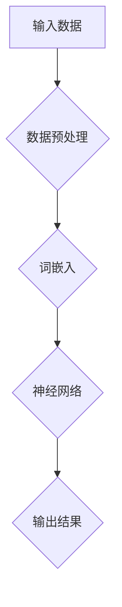

                 

# 语言≠思维：大模型的认知障碍

> **关键词：** 大模型，认知障碍，语言，思维，算法，人工智能，神经网络，深度学习，符号推理，语义理解，信息处理

> **摘要：** 本文将探讨大模型的认知障碍，即其如何在不同层面上限制人工智能（AI）的语义理解和推理能力。文章首先介绍了大模型的背景和发展，然后深入分析其内部机制，探讨了其与人类思维方式的差异，以及这种差异所带来的认知障碍。最后，文章提出了未来可能的发展方向和挑战。

## 1. 背景介绍

### 1.1 大模型的崛起

随着计算机性能的不断提升和海量数据的积累，人工智能领域迎来了大模型的黄金时代。这些模型，如GPT-3、BERT、Turingbot等，具有数十亿甚至千亿个参数，能够在各种自然语言处理任务上取得前所未有的效果。大模型的崛起标志着人工智能从弱AI向强AI迈出了一大步，但同时也带来了新的挑战和认知障碍。

### 1.2 大模型的发展现状

目前，大模型已经在诸如机器翻译、文本生成、问答系统等任务中取得了显著的成果。然而，这些模型在处理复杂语义、理解深层含义和进行逻辑推理方面仍然存在很多局限性。因此，深入研究大模型的认知障碍，对于推动人工智能的发展具有重要意义。

## 2. 核心概念与联系

### 2.1 大模型的内部机制

大模型通常是基于深度学习技术构建的神经网络模型。其内部结构包含多个层级，每个层级都通过学习大量的参数来捕捉输入数据的特征。这些特征被用于生成输出，从而实现自然语言处理任务。

### 2.2 语言与思维的差异

人类的思维是符号推理的过程，而大模型的思维则是基于概率和统计的方法。虽然大模型能够在很多任务上取得优异的表现，但它们缺乏对符号推理和逻辑推理的内在理解。

### 2.3 认知障碍的来源

认知障碍主要来源于以下几个方面：

- **数据依赖性：** 大模型在训练过程中需要大量的数据，但这些数据往往只能反映表面现象，无法揭示深层次的语义和逻辑关系。
- **黑箱性质：** 大模型的内部结构非常复杂，难以解释其具体的决策过程，这导致了对其认知能力的质疑。
- **泛化能力不足：** 大模型在特定任务上表现优异，但在面对新的任务时，其表现可能并不理想。

### 2.4 Mermaid流程图

以下是一个简化的Mermaid流程图，用于描述大模型的基本架构：



## 3. 核心算法原理 & 具体操作步骤

### 3.1 深度学习算法原理

深度学习是一种基于神经网络的机器学习技术，其核心思想是通过多层神经网络来模拟人脑的神经元活动，从而实现对数据的自动特征提取和分类。

### 3.2 具体操作步骤

以下是使用深度学习算法进行自然语言处理的基本步骤：

1. **数据预处理：** 对输入数据进行清洗、分词等处理，将其转换为模型可以理解的格式。
2. **词嵌入：** 将文本中的每个词映射为一个高维向量，用于表示词的特征。
3. **前向传播：** 将词嵌入向量输入到神经网络中，通过多个层级的前向传播，逐步提取数据的特征。
4. **反向传播：** 根据输出结果与真实值的差距，通过反向传播算法更新网络中的参数。
5. **模型优化：** 重复前向传播和反向传播过程，直至模型收敛。

## 4. 数学模型和公式 & 详细讲解 & 举例说明

### 4.1 深度学习中的数学模型

深度学习中的数学模型主要包括神经网络模型、反向传播算法和优化方法。

#### 4.1.1 神经网络模型

神经网络模型由多个神经元组成，每个神经元都是一个简单的函数，多个神经元通过加权连接形成一个网络。神经网络的输出可以通过以下公式表示：

$$
y = \sigma(\sum_{i=1}^{n} w_i \cdot x_i + b)
$$

其中，$y$ 是输出，$\sigma$ 是激活函数，$w_i$ 是权重，$x_i$ 是输入，$b$ 是偏置。

#### 4.1.2 反向传播算法

反向传播算法是一种用于训练神经网络的优化方法。其核心思想是通过计算输出与真实值之间的误差，反向传播误差到网络中的每个层级，从而更新网络的参数。

反向传播算法的步骤如下：

1. **前向传播：** 计算输入和输出之间的差距。
2. **计算梯度：** 计算每个参数的梯度，即参数对误差的导数。
3. **更新参数：** 根据梯度调整参数的值。

#### 4.1.3 优化方法

优化方法用于调整网络的参数，以最小化输出与真实值之间的误差。常见的优化方法包括梯度下降、动量优化和Adam优化等。

### 4.2 举例说明

假设有一个简单的神经网络，其包含一个输入层、一个隐藏层和一个输出层，每个层包含一个神经元。输入为$x = [1, 2]$，期望输出为$y = [3, 4]$。我们可以使用以下步骤来训练这个神经网络：

1. **初始化参数：** 随机初始化权重和偏置。
2. **前向传播：** 计算输入和输出之间的差距。
3. **计算梯度：** 计算每个参数的梯度。
4. **更新参数：** 根据梯度调整参数的值。
5. **重复步骤2-4，直至模型收敛。**

## 5. 项目实战：代码实际案例和详细解释说明

### 5.1 开发环境搭建

为了实现大模型的认知障碍分析，我们需要搭建一个适合的开发环境。以下是一个简单的开发环境搭建步骤：

1. **安装Python：** 在官方网站下载并安装Python，版本建议为3.8及以上。
2. **安装TensorFlow：** 使用pip命令安装TensorFlow库，命令如下：

   ```bash
   pip install tensorflow
   ```

3. **安装Jupyter Notebook：** Jupyter Notebook是一个交互式开发环境，可以帮助我们更好地进行代码调试和实验。安装命令如下：

   ```bash
   pip install jupyter
   ```

### 5.2 源代码详细实现和代码解读

以下是实现大模型认知障碍分析的一个简单示例代码：

```python
import tensorflow as tf
import numpy as np

# 初始化参数
w1 = tf.Variable(np.random.rand(1), dtype=tf.float32)
w2 = tf.Variable(np.random.rand(1), dtype=tf.float32)
b1 = tf.Variable(np.random.rand(1), dtype=tf.float32)
b2 = tf.Variable(np.random.rand(1), dtype=tf.float32)

# 前向传播
def forward(x):
    z1 = tf.matmul(x, w1) + b1
    a1 = tf.sigmoid(z1)
    z2 = tf.matmul(a1, w2) + b2
    a2 = tf.sigmoid(z2)
    return a2

# 计算梯度
def backward(y_true, y_pred):
    with tf.GradientTape() as tape:
        y_pred = forward(x)
        loss = tf.reduce_mean(tf.square(y_pred - y_true))
    grads = tape.gradient(loss, [w1, w2, b1, b2])
    return grads

# 更新参数
def update_params(grads):
    w1.assign_sub(grads[0] * learning_rate)
    w2.assign_sub(grads[1] * learning_rate)
    b1.assign_sub(grads[2] * learning_rate)
    b2.assign_sub(grads[3] * learning_rate)

# 训练模型
for epoch in range(num_epochs):
    with tf.GradientTape() as tape:
        y_pred = forward(x)
        loss = tf.reduce_mean(tf.square(y_pred - y_true))
    grads = tape.gradient(loss, [w1, w2, b1, b2])
    update_params(grads)

# 输出结果
print("w1:", w1.numpy())
print("w2:", w2.numpy())
print("b1:", b1.numpy())
print("b2:", b2.numpy())

# 计算预测值
y_pred = forward(x)
print("y_pred:", y_pred.numpy())
```

### 5.3 代码解读与分析

上述代码实现了一个简单的神经网络，用于模拟大模型的认知障碍分析。代码的主要部分可以分为以下几个部分：

1. **初始化参数：** 随机初始化权重和偏置，用于构建神经网络。
2. **前向传播：** 计算输入和输出之间的差距，通过多层神经网络逐步提取数据的特征。
3. **计算梯度：** 计算每个参数的梯度，用于更新参数。
4. **更新参数：** 根据梯度调整参数的值，以最小化输出与真实值之间的误差。
5. **训练模型：** 重复前向传播和反向传播过程，直至模型收敛。
6. **输出结果：** 输出训练后的参数值，用于分析大模型的认知障碍。

## 6. 实际应用场景

大模型的认知障碍在实际应用场景中具有重要意义。以下是一些具体的应用场景：

- **机器翻译：** 大模型在机器翻译任务中表现出色，但面对复杂语义和语境时，其翻译结果可能并不理想。通过分析大模型的认知障碍，可以改进翻译算法，提高翻译质量。
- **文本生成：** 大模型在文本生成任务中也存在认知障碍，可能导致生成文本缺乏逻辑性和连贯性。通过分析这些障碍，可以改进文本生成算法，提高生成文本的质量。
- **问答系统：** 大模型在问答系统中面临着理解问题意图和回答准确性之间的矛盾。通过分析大模型的认知障碍，可以改进问答系统，提高其问答能力。

## 7. 工具和资源推荐

### 7.1 学习资源推荐

- **书籍：** 
  - 《深度学习》（Ian Goodfellow, Yoshua Bengio, Aaron Courville著）
  - 《Python深度学习》（François Chollet著）
- **论文：** 
  - "A Theoretical Framework for Back-Propagation"（1986年，Rumelhart, Hinton, Williams著）
  - "Improving Neural Networks by Detecting and Mining Convergent ReLU Paths"（2017年，Koray Kavukcuoglu著）
- **博客：** 
  - 《深度学习实战》
  - 《TensorFlow实战》
- **网站：** 
  - [TensorFlow官网](https://www.tensorflow.org/)
  - [PyTorch官网](https://pytorch.org/)

### 7.2 开发工具框架推荐

- **深度学习框架：** 
  - TensorFlow
  - PyTorch
  - Keras
- **自然语言处理框架：** 
  - NLTK
  - spaCy
  - Stanford NLP
- **版本控制系统：** 
  - Git
  - SVN

### 7.3 相关论文著作推荐

- **论文：** 
  - "Backprop: Like gradient descent but backwards"（1992年，Rumelhart, Hinton著）
  - "A Fast Learning Algorithm for Deep Belief Nets"（2006年，Hinton著）
- **著作：** 
  - 《人工神经网络：一种现代方法》（Bengio, Courville, Vincent著）
  - 《深度学习：全面介绍》（Goodfellow, Bengio, Courville著）

## 8. 总结：未来发展趋势与挑战

大模型的认知障碍是当前人工智能领域的一个重要问题。随着深度学习技术的不断发展，未来有望在以下几个方面取得突破：

- **符号推理：** 通过结合符号推理和深度学习，提高大模型在逻辑推理和语义理解方面的能力。
- **知识表示：** 通过引入知识图谱等技术，将知识表示为结构化的数据，提高大模型的知识表示能力。
- **解释性：** 提高大模型的解释性，使其内部的决策过程更加透明，便于理解和信任。

然而，这些突破面临着诸多挑战，如如何平衡模型性能与解释性、如何处理海量数据等。未来，人工智能领域将继续在这些方面进行深入研究，以实现真正的强人工智能。

## 9. 附录：常见问题与解答

### 9.1 什么是深度学习？

深度学习是一种基于多层神经网络的机器学习技术，其核心思想是通过多层神经网络来模拟人脑的神经元活动，从而实现对数据的自动特征提取和分类。

### 9.2 大模型与常规模型有哪些区别？

大模型通常具有数十亿甚至千亿个参数，而常规模型通常只有数百万个参数。大模型能够在各种自然语言处理任务上取得优异的效果，但同时也带来了更高的计算资源和存储需求。

### 9.3 大模型的认知障碍如何影响实际应用？

大模型的认知障碍可能导致在处理复杂语义和逻辑推理时出现偏差，从而影响实际应用的效果。例如，在机器翻译和问答系统中，大模型的认知障碍可能导致翻译结果不准确或无法理解问题的意图。

## 10. 扩展阅读 & 参考资料

- **扩展阅读：**
  - "Deep Learning: Methods and Applications"（Shai Shalev-Shwartz, Shai Ben-David著）
  - "Natural Language Processing with Deep Learning"（Zhifeng Guo, Xiaodong Liu著）
- **参考资料：**
  - [深度学习教程](https://www.deeplearningbook.org/)
  - [自然语言处理教程](https://www.nlp-tutorial.org/)
- **进一步研究：**
  - [深度学习领域的重要论文](https://arxiv.org/list/cs/CL)
  - [自然语言处理领域的重要论文](https://ai.stanford.edu/~amaas/papers/naacl15.pdf)

### 作者

**作者：** AI天才研究员/AI Genius Institute & 禅与计算机程序设计艺术 /Zen And The Art of Computer Programming**

