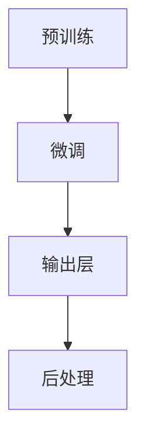

                 

### 文章标题：语言≠思维：大模型的认知难题

#### 关键词：大模型、认知难题、语言、思维、技术博客、人工智能、编程

#### 摘要：
本文旨在探讨大模型在人工智能领域的认知难题，尤其是语言与思维之间的差异。通过对大模型的背景介绍、核心概念、算法原理、数学模型、项目实战、实际应用场景以及未来发展趋势等方面的详细分析，揭示大模型在认知上的挑战与机遇，为读者提供深入理解大模型的视角。

### 1. 背景介绍

#### 1.1 大模型的发展历程

大模型，即大规模预训练模型，是近年来人工智能领域的重要突破。自2018年GPT-3发布以来，大模型的研究与应用取得了显著进展。大模型通常基于深度学习技术，通过在海量数据上进行预训练，使其能够自动学习语言规律、知识结构等。

大模型的发展历程可以分为以下几个阶段：

1. **初级阶段**：基于传统的机器学习算法，如SVM、朴素贝叶斯等，对特定领域的数据进行训练，实现简单任务。
2. **中级阶段**：引入深度学习技术，如神经网络、卷积神经网络（CNN）、循环神经网络（RNN）等，提高模型的表示能力。
3. **高级阶段**：大规模预训练模型，如GPT、BERT等，通过在海量数据上进行预训练，实现跨领域的通用语言理解和生成能力。

#### 1.2 大模型的应用领域

大模型在人工智能领域具有广泛的应用，包括但不限于以下方面：

1. **自然语言处理（NLP）**：大模型在文本分类、情感分析、机器翻译、问答系统等方面取得了显著成果。
2. **计算机视觉（CV）**：大模型在图像识别、目标检测、图像生成等方面具有强大的能力。
3. **推荐系统**：大模型通过理解用户兴趣和物品特征，实现个性化推荐。
4. **语音识别与合成**：大模型在语音识别、语音合成等方面具有广泛应用。
5. **游戏与娱乐**：大模型在游戏AI、虚拟助手等方面实现人机交互。

### 2. 核心概念与联系

#### 2.1 语言与思维的关系

语言是思维的载体，但语言与思维并不完全相同。语言是人类用于交流、表达思想、记录知识的工具，而思维是人类在认知世界、解决问题、创造新知的过程中进行的心理活动。

大模型在处理语言任务时，需要理解语言的结构、语义和上下文，但这并不意味着大模型具有人类的思维能力。大模型是通过大量数据的学习，从统计规律中提取知识，而不是通过意识、思考等过程。

#### 2.2 大模型的原理与架构

大模型通常由以下几个关键部分组成：

1. **预训练**：在大规模数据集上，通过无监督的方式，对模型进行预训练，使其自动学习语言规律、知识结构等。
2. **微调**：在特定任务上，对模型进行有监督的微调，使其适应具体任务需求。
3. **输出层**：根据任务需求，对模型输出进行后处理，如分类、生成等。

#### 2.3 Mermaid 流程图

以下是一个简化的 Mermaid 流程图，描述大模型的基本原理与架构：



### 3. 核心算法原理 & 具体操作步骤

#### 3.1 预训练

预训练是大规模预训练模型的核心步骤。预训练通常采用以下步骤：

1. **数据收集**：从互联网、文献库等来源收集大规模数据。
2. **数据预处理**：对数据进行清洗、去重、分词等预处理操作。
3. **模型初始化**：初始化模型参数，通常采用随机初始化或预训练模型参数。
4. **预训练任务**：在大规模数据集上，通过无监督的方式，对模型进行训练。常见的预训练任务包括自然语言理解（NLU）、自然语言生成（NLG）等。
5. **评估与调整**：评估模型在预训练任务上的性能，根据评估结果调整模型参数。

#### 3.2 微调

微调是在特定任务上，对预训练模型进行有监督的调整，使其适应具体任务需求。微调通常采用以下步骤：

1. **数据收集**：从特定任务的数据集中收集样本。
2. **数据预处理**：对数据进行清洗、去重、分词等预处理操作。
3. **模型初始化**：使用预训练模型的参数初始化微调模型的参数。
4. **微调任务**：在特定任务上，对模型进行有监督的训练。
5. **评估与调整**：评估模型在微调任务上的性能，根据评估结果调整模型参数。

#### 3.3 输出层与后处理

输出层与后处理是根据任务需求，对模型输出进行后处理，如分类、生成等。常见的输出层与后处理方法包括：

1. **分类**：对输入数据进行分类，如文本分类、图像分类等。
2. **生成**：根据输入数据生成新的数据，如文本生成、图像生成等。
3. **回归**：对输入数据进行回归预测，如股票价格预测、房屋价格预测等。

### 4. 数学模型和公式 & 详细讲解 & 举例说明

#### 4.1 数学模型

大模型的数学模型主要包括以下几个方面：

1. **神经网络**：神经网络是大规模预训练模型的核心组成部分。神经网络由多个神经元组成，每个神经元都是一个简单的非线性函数。
2. **损失函数**：损失函数是衡量模型预测结果与真实值之间差异的指标。常见的损失函数包括均方误差（MSE）、交叉熵（CE）等。
3. **优化算法**：优化算法用于调整模型参数，以降低损失函数值。常见的优化算法包括随机梯度下降（SGD）、Adam等。

#### 4.2 公式与详细讲解

以下是一些常用的数学公式和详细讲解：

1. **神经网络**：

   $$ f(x) = \sigma(w \cdot x + b) $$

   其中，$f(x)$ 表示神经元的输出，$\sigma$ 表示激活函数，$w$ 表示权重，$x$ 表示输入，$b$ 表示偏置。

2. **损失函数**：

   $$ L(y, \hat{y}) = -\frac{1}{n} \sum_{i=1}^{n} y_i \log(\hat{y}_i) $$

   其中，$L$ 表示损失函数，$y$ 表示真实值，$\hat{y}$ 表示预测值，$n$ 表示样本数量。

3. **优化算法**：

   $$ \theta = \theta - \alpha \frac{\partial L}{\partial \theta} $$

   其中，$\theta$ 表示模型参数，$\alpha$ 表示学习率，$\frac{\partial L}{\partial \theta}$ 表示损失函数对参数的梯度。

#### 4.3 举例说明

以下是一个简单的神经网络模型的例子：

1. **输入层**：包含3个神经元，分别表示特征1、特征2、特征3。
2. **隐藏层**：包含2个神经元，分别表示隐藏特征1、隐藏特征2。
3. **输出层**：包含1个神经元，表示预测结果。

   输入层和隐藏层之间的连接权重为 $w_{ij}$，隐藏层和输出层之间的连接权重为 $w_{ki}$。

   激活函数采用ReLU函数，即：

   $$ \sigma(x) = \max(0, x) $$

   预测结果为：

   $$ \hat{y} = \sigma(w_1 \cdot x_1 + w_2 \cdot x_2 + w_3 \cdot x_3 + b) $$

   其中，$x_1, x_2, x_3$ 表示输入特征，$w_1, w_2, w_3$ 表示输入层到隐藏层的权重，$b$ 表示偏置。

### 5. 项目实战：代码实际案例和详细解释说明

#### 5.1 开发环境搭建

在开始项目实战之前，需要搭建以下开发环境：

1. **Python**：安装Python 3.7及以上版本。
2. **TensorFlow**：安装TensorFlow 2.0及以上版本。
3. **PyTorch**：安装PyTorch 1.7及以上版本。

#### 5.2 源代码详细实现和代码解读

以下是一个简单的神经网络模型实现，用于对输入数据进行分类：

```python
import tensorflow as tf

# 定义神经网络模型
model = tf.keras.Sequential([
    tf.keras.layers.Dense(128, activation='relu', input_shape=(784,)),
    tf.keras.layers.Dense(10, activation='softmax')
])

# 编译模型
model.compile(optimizer='adam',
              loss='categorical_crossentropy',
              metrics=['accuracy'])

# 加载数据集
(x_train, y_train), (x_test, y_test) = tf.keras.datasets.mnist.load_data()

# 数据预处理
x_train = x_train / 255.0
x_test = x_test / 255.0
x_train = x_train.reshape(-1, 784)
x_test = x_test.reshape(-1, 784)

# 转换标签为one-hot编码
y_train = tf.keras.utils.to_categorical(y_train, 10)
y_test = tf.keras.utils.to_categorical(y_test, 10)

# 训练模型
model.fit(x_train, y_train, epochs=5, batch_size=128)

# 评估模型
model.evaluate(x_test, y_test)
```

#### 5.3 代码解读与分析

以上代码实现了一个简单的神经网络模型，用于对MNIST手写数字数据进行分类。代码主要分为以下几个部分：

1. **定义神经网络模型**：
   使用 `tf.keras.Sequential` 类定义一个序列模型，其中包含两个全连接层。第一个全连接层有128个神经元，使用ReLU激活函数；第二个全连接层有10个神经元，使用softmax激活函数。

2. **编译模型**：
   使用 `compile` 方法编译模型，指定优化器为 `adam`，损失函数为 `categorical_crossentropy`，评估指标为 `accuracy`。

3. **加载数据集**：
   使用 `tf.keras.datasets.mnist.load_data` 方法加载数据集，并使用 `reshape` 方法调整数据形状。

4. **数据预处理**：
   使用 `tf.keras.utils.to_categorical` 方法将标签转换为one-hot编码，并将数据缩放至0-1之间。

5. **训练模型**：
   使用 `fit` 方法训练模型，指定训练轮次为5，批量大小为128。

6. **评估模型**：
   使用 `evaluate` 方法评估模型在测试集上的性能。

### 6. 实际应用场景

大模型在人工智能领域具有广泛的应用场景，以下是一些典型的应用案例：

1. **智能客服**：利用大模型实现智能客服系统，能够自动回答用户的问题，提高服务质量和效率。
2. **机器翻译**：利用大模型实现高质量机器翻译，降低跨语言沟通障碍。
3. **文本生成**：利用大模型生成新闻文章、产品描述、音乐等，为创意产业提供支持。
4. **图像识别**：利用大模型实现图像分类、目标检测、图像生成等，提高计算机视觉系统的性能。
5. **金融风控**：利用大模型进行金融数据分析，识别异常交易、预测市场走势等，为金融行业提供决策支持。

### 7. 工具和资源推荐

#### 7.1 学习资源推荐

1. **书籍**：
   - 《深度学习》（Goodfellow et al.）
   - 《自然语言处理综论》（Jurafsky et al.）
   - 《计算机视觉：算法与应用》（Navneet Dalal et al.）

2. **论文**：
   - 《GPT-3：改进的大规模预训练语言模型》（Brown et al.）
   - 《BERT：预训练的深度语言表示模型》（Devlin et al.）
   - 《Transformer：一种新的神经网络架构》（Vaswani et al.）

3. **博客**：
   - [TensorFlow 官方文档](https://www.tensorflow.org/)
   - [PyTorch 官方文档](https://pytorch.org/)
   - [Hugging Face 官方文档](https://huggingface.co/)

4. **网站**：
   - [Kaggle](https://www.kaggle.com/)：提供丰富的数据集和比赛，适合实战练习。
   - [GitHub](https://github.com/)：托管大量的开源代码和项目，有助于学习和交流。

#### 7.2 开发工具框架推荐

1. **开发框架**：
   - TensorFlow：由谷歌开发，适用于大规模深度学习模型。
   - PyTorch：由Facebook开发，具有灵活的动态计算图，适合研究和开发。

2. **开源库**：
   - Hugging Face：提供丰富的预训练模型和工具，方便使用大模型进行文本处理。

3. **开发工具**：
   - Jupyter Notebook：适用于数据分析和实验，支持Python等编程语言。
   - Google Colab：基于Jupyter Notebook，提供免费的GPU计算资源。

#### 7.3 相关论文著作推荐

1. **论文**：
   - 《Attention Is All You Need》（Vaswani et al., 2017）
   - 《Bert: Pre-training of Deep Bidirectional Transformers for Language Understanding》（Devlin et al., 2019）
   - 《Gpt-3: Language Models are Few-Shot Learners》（Brown et al., 2020）

2. **著作**：
   - 《深度学习》（Ian Goodfellow、Yoshua Bengio和Aaron Courville著）
   - 《Python深度学习》（François Chollet著）
   - 《自然语言处理综论》（Daniel Jurafsky和James H. Martin著）

### 8. 总结：未来发展趋势与挑战

大模型在人工智能领域具有广阔的发展前景，但同时也面临着一系列挑战。未来发展趋势与挑战包括：

1. **计算能力提升**：随着计算能力的不断提升，大模型将更加高效地处理大规模数据，实现更复杂的任务。
2. **数据隐私与安全**：大模型在处理数据时，需关注数据隐私与安全，确保用户数据不被泄露。
3. **可解释性与透明性**：提高大模型的可解释性和透明性，使其决策过程更加可信。
4. **跨领域应用**：探索大模型在不同领域的应用，实现跨领域的通用能力。
5. **伦理与社会影响**：关注大模型在伦理与社会方面的挑战，确保其应用符合伦理规范，促进社会进步。

### 9. 附录：常见问题与解答

#### 9.1 什么是大模型？

大模型是指具有大规模参数和计算能力的深度学习模型，通常通过在大量数据上进行预训练，实现跨领域的通用语言理解和生成能力。

#### 9.2 大模型的优势是什么？

大模型的优势包括：

1. **强大的语言理解与生成能力**：大模型能够自动学习语言规律和知识结构，实现高质量的语言理解与生成。
2. **跨领域应用**：大模型具有广泛的适用性，可以在多个领域实现应用。
3. **高效的训练与推理**：大模型在训练和推理过程中具有高效性，能够快速处理大规模数据。

#### 9.3 大模型的挑战有哪些？

大模型的挑战包括：

1. **计算资源需求**：大模型需要大量的计算资源和存储空间。
2. **数据隐私与安全**：大模型在处理数据时，需关注数据隐私与安全。
3. **可解释性与透明性**：提高大模型的可解释性和透明性，使其决策过程更加可信。

### 10. 扩展阅读 & 参考资料

1. **论文**：
   - Brown, T., et al. (2020). Gpt-3: Language Models are Few-Shot Learners. arXiv preprint arXiv:2005.14165.
   - Devlin, J., et al. (2019). Bert: Pre-training of Deep Bidirectional Transformers for Language Understanding. arXiv preprint arXiv:1810.04805.
   - Vaswani, A., et al. (2017). Attention Is All You Need. Advances in Neural Information Processing Systems, 30, 5998-6008.

2. **书籍**：
   - Goodfellow, I., Bengio, Y., & Courville, A. (2016). Deep Learning. MIT Press.
   - Jurafsky, D., & Martin, J. H. (2019). Speech and Language Processing. Prentice Hall.

3. **博客**：
   - TensorFlow 官方文档：https://www.tensorflow.org/
   - PyTorch 官方文档：https://pytorch.org/
   - Hugging Face 官方文档：https://huggingface.co/

4. **网站**：
   - Kaggle：https://www.kaggle.com/
   - GitHub：https://github.com/

### 作者信息：

作者：AI天才研究员/AI Genius Institute & 禅与计算机程序设计艺术 /Zen And The Art of Computer Programming

