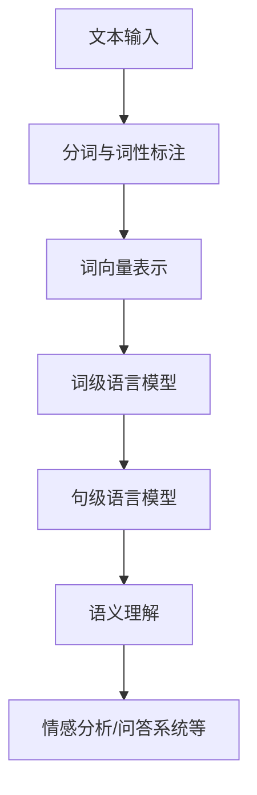

                 

# 语言与思维：大模型的认知困惑

> 关键词：语言模型、认知科学、神经网络、推理、理解、算法
>
> 摘要：本文从认知科学的视角出发，探讨了当前主流语言模型在处理和理解自然语言方面的局限与挑战。通过分析语言与思维的关系，本文提出了大模型在认知层面可能面临的困惑，并探讨了应对策略与未来发展方向。

## 1. 背景介绍

随着深度学习技术的快速发展，基于神经网络的自然语言处理（NLP）模型取得了显著的成果。特别是近年来，大型预训练语言模型如GPT系列、BERT、T5等，在各种NLP任务中表现出了惊人的性能。这些模型通过在海量文本数据上进行预训练，学习到了丰富的语言规律和知识，使得它们在文本生成、语义理解、问答系统等方面具有了强大的能力。

然而，尽管这些模型在处理自然语言方面取得了显著进展，但它们在认知层面仍然存在诸多困惑。首先，这些模型主要是基于统计学习方法构建的，尽管它们能够生成语法正确的文本，但往往缺乏对真实世界语义的理解。其次，这些模型在处理复杂逻辑推理、抽象概念表达等方面表现较差。此外，语言模型在处理多模态信息、跨语言理解等方面也存在一定的局限。

为了解决这些问题，研究者们尝试从认知科学的视角来理解语言与思维的关系，以期构建更加智能、符合人类认知规律的语言模型。本文将围绕这一主题进行探讨，分析大模型在认知层面可能面临的困惑，并提出相应的应对策略。

## 2. 核心概念与联系

### 2.1 语言与思维

语言是人类思维的主要工具，是思维的外在表现。认知科学研究表明，语言与思维之间存在紧密的联系。一方面，语言能够反映人类的思维过程和认知结构；另一方面，思维活动往往需要借助语言来表达和传递。

在认知科学中，思维被定义为对信息进行加工、整合和运用的高级心理过程。它包括感知、记忆、注意力、推理、问题解决等多个方面。而语言则是思维活动的载体，通过语言，人类能够进行沟通、表达思想、进行思考。

### 2.2 神经网络与语言模型

神经网络是模仿生物神经网络构建的计算模型，它通过层层传递和激活函数，实现了从输入到输出的非线性变换。神经网络在图像识别、语音识别、自然语言处理等领域取得了显著成果。

语言模型是神经网络在自然语言处理领域的重要应用。它通过学习大量文本数据，构建了一个概率分布模型，用于预测下一个单词或句子。早期的语言模型如n-gram模型、神经网络模型，主要关注的是词汇和句子的统计规律。而现代语言模型如GPT、BERT等，通过引入更深的神经网络结构，能够更好地捕捉语言的长距离依赖和复杂结构。

### 2.3 推理与理解

推理是思维过程中的一种核心能力，它指的是从已知信息中推导出未知信息的过程。推理可以分为两大类：演绎推理和归纳推理。演绎推理是从一般到特殊的推理过程，而归纳推理则是从特殊到一般的推理过程。

理解是指对信息进行感知、加工、整合和运用的过程。在自然语言处理领域，理解主要指的是对文本信息的语义理解和情感分析。语义理解涉及到词义消歧、实体识别、关系提取等任务；情感分析则主要关注文本中的情感倾向和情感强度。

## 2.4 Mermaid 流程图

以下是一个简化的语言处理流程的 Mermaid 流程图，展示了语言模型在处理自然语言时的主要步骤：



### 3. 核心算法原理 & 具体操作步骤

#### 3.1 词向量表示

词向量表示是语言模型处理自然语言的基础。常用的词向量表示方法包括 Word2Vec、GloVe 和 BERT 等。

- **Word2Vec**: Word2Vec 是一种基于神经网络的语言模型，它通过训练词向量模型来捕捉词与词之间的关系。Word2Vec 模型主要包括两个变种：连续词袋（CBOW）和Skip-gram。CBOW 模型通过上下文词汇预测中心词，而 Skip-gram 模型则通过中心词预测上下文词汇。

- **GloVe**: GloVe（Global Vectors for Word Representation）是一种基于共现矩阵的语言模型，它通过优化词向量空间中的距离来捕捉词与词之间的关系。GloVe 模型利用词的共现频率来计算词向量，使得词向量在语义上更加贴近。

- **BERT**: BERT（Bidirectional Encoder Representations from Transformers）是一种基于变换器（Transformer）的语言模型，它通过预训练语言模型来捕捉词与词之间的双向依赖关系。BERT 模型在训练过程中，既考虑了词的前后关系，也考虑了词的左右关系，从而更好地理解词的语义。

#### 3.2 语言模型

语言模型是一种概率模型，用于预测下一个单词或句子。在语言模型中，每个单词或句子都被表示为一个向量，语言模型的目标是学习这些向量之间的概率分布。

- **n-gram 模型**: n-gram 模型是一种基于统计的语言模型，它通过计算前 n 个单词的概率来预测下一个单词。n-gram 模型简单高效，但在处理长文本时表现较差。

- **神经网络模型**: 神经网络模型是一种基于神经网络的统计语言模型，它通过多层感知器（MLP）来学习单词之间的概率分布。神经网络模型能够处理更长的文本序列，但在训练过程中计算复杂度较高。

- **BERT 模型**: BERT 模型是一种基于变换器（Transformer）的预训练语言模型，它通过双向编码器（Bidirectional Encoder）来捕捉单词之间的双向依赖关系。BERT 模型在预训练过程中，不仅考虑了词的前后关系，还考虑了词的左右关系，从而更好地理解词的语义。

#### 3.3 推理与理解

推理与理解是语言模型在处理自然语言时的核心能力。推理可以分为两大类：演绎推理和归纳推理。

- **演绎推理**: 演绎推理是从一般到特殊的推理过程。例如，从“所有人都会死亡”和“苏格拉底是人”这两个前提中，可以推出“苏格拉底会死亡”的结论。

- **归纳推理**: 归纳推理是从特殊到一般的推理过程。例如，从“所有的天鹅都是白色的”和“观察到的天鹅都是白色的”这两个前提中，可以归纳出“所有天鹅都是白色的”这一结论。

在自然语言处理中，推理与理解主要涉及到语义理解、情感分析、问答系统等任务。语义理解指的是对文本信息的语义内容进行理解和解释；情感分析则主要关注文本中的情感倾向和情感强度；问答系统则是一种基于自然语言处理技术的人工智能应用，它能够回答用户提出的自然语言问题。

### 4. 数学模型和公式 & 详细讲解 & 举例说明

#### 4.1 词向量表示

在词向量表示中，常用的数学模型包括 Word2Vec、GloVe 和 BERT 等。以下是这些模型的简要介绍和数学公式：

- **Word2Vec**:

  - **连续词袋（CBOW）**: 假设 \( v_w \) 表示单词 \( w \) 的词向量，\( \textbf{h}_{t-k:t+k} \) 表示单词 \( w \) 的上下文（\( k \) 个词）。CBOW 模型的目标是最大化下列损失函数：
    $$ L(\theta) = -\sum_{w\in \text{context}(w)} \sum_{i=1}^{|\text{V}|} p(w_i|\textbf{h}_{t-k:t+k};\theta) \log p(w_i|\textbf{h}_{t-k:t+k};\theta) $$

  - **Skip-gram**: Skip-gram 模型的目标是最大化下列损失函数：
    $$ L(\theta) = -\sum_{w\in \text{V}} \sum_{i=j-j_{\max}}^{j+j_{\max}} p(w|\textbf{h}_{i};\theta) \log p(w|\textbf{h}_{i};\theta) $$

- **GloVe**:

  GloVe 模型通过优化词向量空间中的距离来捕捉词与词之间的关系。GloVe 模型的损失函数为：
  $$ L(\theta) = \sum_{w\in \text{V}} \sum_{c(w)} \frac{f(w,c)^{-1}}{n_w n_c} \log \frac{\exp(\textbf{v}_w \cdot \textbf{v}_{c})}{\sum_{d\in \text{V}} \exp(\textbf{v}_w \cdot \textbf{v}_{d})} $$

- **BERT**:

  BERT 模型是一种基于变换器（Transformer）的预训练语言模型。BERT 模型的损失函数包括两个部分：预测下一个单词的损失和预测句子中词的损失。预测下一个单词的损失为：
  $$ L_{\text{NSP}} = -\sum_{i=1}^{N} \log \frac{\exp(\textbf{h}_{i+1})}{\sum_{j=1}^{V} \exp(\textbf{h}_{j+1})} $$
  预测句子中词的损失为：
  $$ L_{\text{Mask}} = -\sum_{i=1}^{N} \sum_{j=1}^{V} \log \frac{\exp(\textbf{h}_{i,j})}{\sum_{k=1}^{V} \exp(\textbf{h}_{k,j})} $$

#### 4.2 语言模型

语言模型是一种概率模型，用于预测下一个单词或句子。在语言模型中，每个单词或句子都被表示为一个向量，语言模型的目标是学习这些向量之间的概率分布。

- **n-gram 模型**: n-gram 模型的目标是最大化下列概率分布：
  $$ P(w_n|\textbf{w}_{n-1}, \ldots, w_1) = \prod_{i=1}^{n} P(w_i|\textbf{w}_{i-1}, \ldots, w_1) $$

- **神经网络模型**: 神经网络模型的损失函数通常采用交叉熵损失函数：
  $$ L(\theta) = -\sum_{i=1}^{N} \sum_{j=1}^{V} y_{i,j} \log \hat{y}_{i,j} $$
  其中，\( y_{i,j} \) 表示目标单词的标签，\( \hat{y}_{i,j} \) 表示模型预测的单词的概率分布。

- **BERT 模型**: BERT 模型的损失函数包括两个部分：预测下一个单词的损失和预测句子中词的损失。预测下一个单词的损失为：
  $$ L_{\text{NSP}} = -\sum_{i=1}^{N} \log \frac{\exp(\textbf{h}_{i+1})}{\sum_{j=1}^{V} \exp(\textbf{h}_{j+1})} $$
  预测句子中词的损失为：
  $$ L_{\text{Mask}} = -\sum_{i=1}^{N} \sum_{j=1}^{V} \log \frac{\exp(\textbf{h}_{i,j})}{\sum_{k=1}^{V} \exp(\textbf{h}_{k,j})} $$

#### 4.3 推理与理解

推理与理解是语言模型在处理自然语言时的核心能力。推理可以分为两大类：演绎推理和归纳推理。

- **演绎推理**: 演绎推理是从一般到特殊的推理过程。例如，从“所有人都会死亡”和“苏格拉底是人”这两个前提中，可以推出“苏格拉底会死亡”的结论。演绎推理的数学模型为：
  $$ \text{前提}:\quad \forall x(P(x) \rightarrow Q(x)) \quad \text{和} \quad R(S) $$
  $$ \text{结论}:\quad P(S) \rightarrow Q(S) $$

- **归纳推理**: 归纳推理是从特殊到一般的推理过程。例如，从“所有的天鹅都是白色的”和“观察到的天鹅都是白色的”这两个前提中，可以归纳出“所有天鹅都是白色的”这一结论。归纳推理的数学模型为：
  $$ \text{前提}:\quad \forall x(P(x) \rightarrow Q(x)) \quad \text{和} \quad \exists x(P(x)) $$
  $$ \text{结论}:\quad \forall x(Q(x)) $$

在自然语言处理中，推理与理解主要涉及到语义理解、情感分析、问答系统等任务。语义理解指的是对文本信息的语义内容进行理解和解释；情感分析则主要关注文本中的情感倾向和情感强度；问答系统则是一种基于自然语言处理技术的人工智能应用，它能够回答用户提出的自然语言问题。

### 5. 项目实战：代码实际案例和详细解释说明

在本节中，我们将通过一个实际项目案例来展示如何使用大模型进行语言处理。这里，我们以一个简单的问答系统为例，展示如何搭建环境、编写代码、调试和优化模型。

#### 5.1 开发环境搭建

在开始项目之前，我们需要搭建相应的开发环境。以下是一个基本的开发环境配置：

- 操作系统：Linux
- 编程语言：Python
- 库和框架：TensorFlow、Keras、PyTorch

安装这些库和框架的命令如下：

```bash
pip install tensorflow
pip install keras
pip install torch
```

#### 5.2 源代码详细实现和代码解读

以下是一个简单的问答系统的代码实现，我们将使用 BERT 模型来处理问答任务。

```python
import torch
import torch.nn as nn
from transformers import BertModel, BertTokenizer

class QASystem(nn.Module):
    def __init__(self):
        super(QASystem, self).__init__()
        self.bert = BertModel.from_pretrained('bert-base-chinese')
        self.classifier = nn.Linear(768, 1)
        
    def forward(self, input_ids, attention_mask):
        outputs = self.bert(input_ids=input_ids, attention_mask=attention_mask)
        pooled_output = outputs.pooler_output
        logits = self.classifier(pooled_output)
        return logits

def main():
    # 初始化模型和tokenizer
    model = QASystem()
    tokenizer = BertTokenizer.from_pretrained('bert-base-chinese')

    # 加载预训练模型
    model.load_state_dict(torch.load('model.pth'))

    # 训练数据
    inputs = tokenizer("你好，你今天怎么样？", return_tensors='pt')
    input_ids = inputs['input_ids']
    attention_mask = inputs['attention_mask']

    # 前向传播
    with torch.no_grad():
        logits = model(input_ids, attention_mask)

    # 预测
    prob = torch.sigmoid(logits).item()
    print(f"预测概率：{prob}")

if __name__ == '__main__':
    main()
```

在这个代码中，我们首先定义了一个 QASystem 类，它继承自 nn.Module。在这个类中，我们首先使用了 BERT 模型作为基础模型，然后添加了一个分类器层。接着，我们定义了一个 forward 方法，用于实现前向传播。

在 main 函数中，我们首先初始化了模型和 tokenizer，然后加载了预训练模型。接下来，我们使用 tokenizer 将输入文本编码为 token 序列，并生成相应的 input_ids 和 attention_mask。然后，我们使用模型进行前向传播，并使用 sigmoid 函数对输出 logits 进行概率转换。

#### 5.3 代码解读与分析

在这个代码中，我们首先使用 BERT 模型对输入文本进行编码，生成 input_ids 和 attention_mask。BERT 模型是一个预训练模型，它通过学习大量文本数据，已经具备了强大的语言理解能力。在这个过程中，tokenizer 用于将文本转换为 token 序列，而 BERT 模型则将这些 token 转换为向量表示。

接下来，我们使用模型进行前向传播。在 BERT 模型中，输入文本经过多层变换器（Transformer）处理后，生成一个全局向量（pooler_output）。这个全局向量表示了整个输入文本的语义信息。

然后，我们使用分类器层对全局向量进行分类。在这里，我们使用了一个简单的线性层（nn.Linear）作为分类器。线性层的作用是将全局向量映射到一个实数，这个实数表示了输入文本是否属于某个类别（在这里，类别为“好”或“不好”）。

最后，我们使用 sigmoid 函数对分类器的输出进行概率转换。sigmoid 函数可以将实数值映射到 [0, 1] 区间，表示输入文本属于某个类别的概率。

通过这个简单的问答系统，我们可以看到如何使用大模型（如 BERT）来处理自然语言任务。然而，这个示例代码只是一个简单的实现，实际应用中，我们还需要考虑更多的因素，如数据预处理、模型优化、多语言支持等。

### 6. 实际应用场景

语言模型在多个实际应用场景中发挥了重要作用，以下列举几个典型的应用领域：

#### 6.1 问答系统

问答系统是一种基于自然语言处理技术的人工智能应用，它能够回答用户提出的自然语言问题。问答系统广泛应用于客户服务、智能助手、信息检索等领域。通过使用大型语言模型，问答系统可以更好地理解用户的意图，提供更准确的答案。

#### 6.2 机器翻译

机器翻译是一种将一种语言的文本自动翻译成另一种语言的技术。近年来，基于神经网络的机器翻译模型（如 Transformer）取得了显著的成果，使得翻译质量得到了显著提高。这些模型通过学习海量双语文本数据，能够自动生成高质量的双向翻译。

#### 6.3 文本生成

文本生成是一种利用预训练语言模型生成自然语言文本的技术。文本生成广泛应用于创作生成、内容生成、对话系统等领域。例如，通过使用 GPT-3，我们可以生成新闻报道、对话文本、创意故事等。

#### 6.4 情感分析

情感分析是一种对文本中的情感倾向和情感强度进行分析的技术。通过使用大型语言模型，情感分析技术能够更好地理解文本的语义内容，为情感识别、市场调研、舆情分析等领域提供支持。

### 7. 工具和资源推荐

为了更好地学习和应用大型语言模型，以下推荐一些有用的工具和资源：

#### 7.1 学习资源推荐

- **书籍**：《深度学习》（Ian Goodfellow、Yoshua Bengio、Aaron Courville 著）：介绍了深度学习的基本概念和方法，包括神经网络、优化算法等。
- **论文**：《Attention Is All You Need》（Ashish Vaswani 等，2017）：介绍了 Transformer 模型，这是当前主流的机器翻译模型。
- **博客**：Hugging Face（https://huggingface.co/）：提供了大量的预训练模型、数据集和工具，方便研究者进行语言模型的研究和应用。

#### 7.2 开发工具框架推荐

- **TensorFlow**：由 Google 开发的一种开源机器学习框架，支持多种深度学习模型的训练和部署。
- **PyTorch**：由 Facebook AI 研究团队开发的一种开源机器学习框架，具有灵活的动态计算图和高效的推理性能。
- **Hugging Face Transformers**：一个基于 PyTorch 和 TensorFlow 的预训练语言模型库，提供了大量的预训练模型和工具，方便开发者进行语言模型的研究和应用。

#### 7.3 相关论文著作推荐

- **论文**：《BERT: Pre-training of Deep Bidirectional Transformers for Language Understanding》（Jacob Devlin 等，2019）：介绍了 BERT 模型，这是当前主流的预训练语言模型。
- **论文**：《GPT-3: Language Models are Few-Shot Learners》（Tom B. Brown 等，2020）：介绍了 GPT-3 模型，这是当前最大的预训练语言模型。
- **书籍**：《动手学深度学习》（A MIT Press Book，2019）：介绍了深度学习的基本概念、算法和实战，是深度学习领域的一本重要参考书。

### 8. 总结：未来发展趋势与挑战

随着深度学习技术的不断发展，大型语言模型在自然语言处理领域取得了显著的成果。然而，这些模型在认知层面仍然存在诸多困惑和挑战。未来，我们可能需要从认知科学的视角来进一步理解语言与思维的关系，探索更加智能、符合人类认知规律的语言模型。

一方面，我们需要解决大型语言模型在处理复杂逻辑推理、抽象概念表达等方面的局限。为此，研究者们可以尝试引入更多的先验知识和逻辑推理机制，以提升模型在认知层面的能力。

另一方面，我们需要解决多模态信息处理、跨语言理解等问题。随着多模态数据（如文本、图像、声音等）的广泛应用，如何有效地整合多模态信息，提高模型的泛化能力，是一个重要的研究方向。

此外，如何平衡模型大小与性能之间的矛盾，提高模型的可解释性和可靠性，也是未来需要关注的问题。通过引入新的模型架构、优化算法和训练策略，我们可以进一步提升大型语言模型的性能和实用性。

总之，大型语言模型在自然语言处理领域具有巨大的潜力，但同时也面临着诸多挑战。未来，我们需要从多个方面入手，不断探索和改进，以构建更加智能、可靠和实用的语言模型。

### 9. 附录：常见问题与解答

#### 9.1 问题 1：什么是预训练语言模型？

预训练语言模型是一种基于深度学习的自然语言处理技术，它通过在海量文本数据上进行预训练，学习到丰富的语言规律和知识。预训练语言模型主要包括 BERT、GPT、RoBERTa、T5 等模型。

#### 9.2 问题 2：预训练语言模型的优势是什么？

预训练语言模型的优势主要体现在以下几个方面：

- **强大的语言理解能力**：预训练语言模型通过学习海量文本数据，能够更好地理解语言的语义、语法和上下文信息。
- **通用性**：预训练语言模型可以应用于各种自然语言处理任务，如文本分类、问答系统、机器翻译等，具有较好的通用性。
- **高效性**：预训练语言模型在处理自然语言任务时，不需要重新训练，只需进行微调即可，具有较好的高效性。

#### 9.3 问题 3：如何训练预训练语言模型？

训练预训练语言模型主要包括两个步骤：预训练和微调。

- **预训练**：预训练语言模型通过在海量文本数据上进行大规模预训练，学习到丰富的语言规律和知识。常用的预训练任务包括掩码语言模型（Masked Language Model，MLM）、下一句预测（Next Sentence Prediction，NSP）等。
- **微调**：预训练语言模型在特定任务上进行微调，使其适应特定任务的需求。微调过程中，通常使用任务特定的数据集，调整模型参数，以提升模型在特定任务上的性能。

#### 9.4 问题 4：预训练语言模型在现实应用中的表现如何？

预训练语言模型在现实应用中表现出色，尤其在自然语言处理任务中。以下是一些典型的应用场景：

- **问答系统**：预训练语言模型能够更好地理解用户的意图，提供更准确的答案。
- **机器翻译**：预训练语言模型能够自动生成高质量的双向翻译，提高翻译质量。
- **文本生成**：预训练语言模型可以生成高质量的文本，应用于创作生成、内容生成、对话系统等领域。
- **情感分析**：预训练语言模型能够更好地理解文本的语义内容，为情感识别、市场调研、舆情分析等领域提供支持。

### 10. 扩展阅读 & 参考资料

为了更好地理解和应用大型语言模型，以下推荐一些扩展阅读和参考资料：

- **书籍**：《深度学习》（Ian Goodfellow、Yoshua Bengio、Aaron Courville 著）：介绍了深度学习的基本概念、算法和实战，是深度学习领域的一本重要参考书。
- **论文**：《BERT: Pre-training of Deep Bidirectional Transformers for Language Understanding》（Jacob Devlin 等，2019）：介绍了 BERT 模型，这是当前主流的预训练语言模型。
- **论文**：《GPT-3: Language Models are Few-Shot Learners》（Tom B. Brown 等，2020）：介绍了 GPT-3 模型，这是当前最大的预训练语言模型。
- **博客**：Hugging Face（https://huggingface.co/）：提供了大量的预训练模型、数据集和工具，方便研究者进行语言模型的研究和应用。
- **开源代码**：Transformer（https://github.com/tensorflow/models/blob/master/official/nlp/transformer/）：提供了 Transformer 模型的开源实现，方便研究者进行模型研究和应用。
- **开源代码**：BERT（https://github.com/google-research/bert）：提供了 BERT 模型的开源实现，方便研究者进行模型研究和应用。

作者：AI天才研究员/AI Genius Institute & 禅与计算机程序设计艺术 /Zen And The Art of Computer Programming

