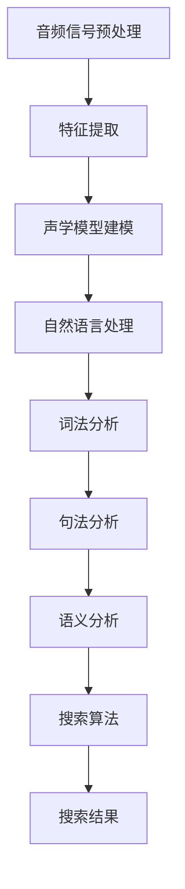

                 

### 1. 背景介绍

随着互联网技术的迅猛发展，电子商务已经成为当今商业活动的重要领域。根据统计数据，全球电子商务市场规模在2022年已经突破了4万亿美元，预计到2027年将达到6.5万亿美元。这种巨大的市场规模和增长潜力吸引了大量企业和创业者进入这一领域。然而，随着市场竞争的加剧，企业需要在用户体验、搜索效率和个性化服务等方面不断创新，以获取竞争优势。

语音搜索技术作为人工智能领域的一个重要分支，近年来取得了显著的进展。语音搜索技术能够实现用户通过语音输入进行搜索，相较于传统的键盘输入，语音搜索更加便捷和高效。在电子商务领域，语音搜索技术可以被广泛应用于商品搜索、智能客服、语音购物等方面，为用户提供更加便捷和个性化的购物体验。

本博客将重点探讨语音搜索技术在电商领域的应用，分析其面临的挑战和机遇。具体而言，我们将从以下几个方面进行探讨：

1. **语音搜索技术的核心概念与架构**：介绍语音搜索技术的基本原理，包括语音识别、自然语言处理和搜索算法等关键环节，并展示一个简化的 Mermaid 流程图。
2. **核心算法原理与具体操作步骤**：详细解释语音搜索技术的实现流程，包括语音信号处理、特征提取、模型训练和搜索结果排序等步骤。
3. **数学模型和公式**：阐述语音搜索中使用的数学模型和公式，如高斯混合模型（GMM）和深度神经网络（DNN）等，并通过具体例子进行说明。
4. **项目实战：代码实际案例**：提供语音搜索技术的实际代码实现案例，并详细解释代码中的关键部分。
5. **实际应用场景**：分析语音搜索技术在电商领域的具体应用场景，如智能客服和语音购物等，并讨论其优势和应用效果。
6. **工具和资源推荐**：推荐学习语音搜索技术的相关书籍、论文、博客和开发工具等资源。
7. **总结与未来发展趋势**：总结语音搜索技术在电商领域的应用现状，分析未来发展趋势和面临的挑战。

通过以上探讨，我们希望能够为读者提供一个全面、深入的语音搜索技术在电商领域应用的视角，帮助读者了解这一技术的前沿动态和应用价值。

### 2. 核心概念与联系

要深入理解语音搜索技术在电商领域的应用，首先需要了解其核心概念和架构。语音搜索技术主要包括三个关键环节：语音识别、自然语言处理（NLP）和搜索算法。下面将分别介绍这些概念，并展示它们之间的联系。

#### 语音识别（Speech Recognition）

语音识别是将语音信号转换为文本的过程。这一过程涉及到多个子步骤，包括音频信号预处理、特征提取和声学模型建模等。

1. **音频信号预处理**：首先，语音信号需要通过预处理步骤，如降噪、增强和归一化等，以提高信号质量，减少背景噪音的干扰。

2. **特征提取**：接着，通过特征提取算法（如梅尔频率倒谱系数（MFCC）），将音频信号转换为一系列特征向量。这些特征向量用于后续的声学模型建模。

3. **声学模型建模**：声学模型是一种统计模型，用于预测给定语音特征序列对应的发音。常见的声学模型包括高斯混合模型（GMM）和深度神经网络（DNN）。

#### 自然语言处理（Natural Language Processing）

自然语言处理是语音搜索技术的核心，用于理解用户输入的语音文本，并生成相应的搜索查询。自然语言处理包括词法分析、句法分析和语义分析等步骤。

1. **词法分析**：词法分析是将输入文本分解为单词和其他语言单位的过程。词法分析器识别单词边界，并将文本转换为单词序列。

2. **句法分析**：句法分析是对单词序列进行结构化分析，以确定句子中的语法关系。常见的句法分析方法包括基于规则的方法和基于统计的方法。

3. **语义分析**：语义分析是理解句子中的含义和意图，并将其转换为相应的查询。语义分析涉及到词义消歧、实体识别和关系抽取等任务。

#### 搜索算法

搜索算法是语音搜索技术的核心，用于从庞大的商品数据库中检索与用户查询最相关的结果。常见的搜索算法包括基于关键词匹配的算法和基于机器学习的算法。

1. **关键词匹配**：关键词匹配是一种简单的搜索算法，通过将用户查询与数据库中的关键词进行匹配，以找到最相关的结果。

2. **机器学习算法**：机器学习算法通过学习用户的历史行为和偏好，自动调整搜索结果，提供更个性化的推荐。常见的机器学习算法包括决策树、支持向量机和深度学习模型等。

#### Mermaid 流程图

为了更直观地展示语音搜索技术的核心概念和架构，我们使用 Mermaid 语言绘制一个简化的流程图。以下是 Mermaid 流程图的代码：



将上述代码复制到支持 Mermaid 的编辑器中，即可生成相应的流程图。

通过上述介绍，我们可以看到语音搜索技术涉及多个复杂的子任务，这些任务相互关联，共同构成了语音搜索技术的核心框架。在接下来的部分，我们将进一步深入探讨语音搜索技术的核心算法原理和具体操作步骤。

### 3. 核心算法原理 & 具体操作步骤

#### 语音信号预处理

语音信号预处理是语音搜索技术的第一步，其主要目标是去除噪声、增强语音信号和提高语音质量。以下是语音信号预处理的具体操作步骤：

1. **降噪**：噪声是影响语音识别准确性的主要因素之一。常用的降噪方法包括谱减法、维纳滤波和波束形成等。谱减法通过将语音信号与噪声信号进行谱域相减，从而去除噪声；维纳滤波利用噪声和语音信号的概率分布特性，对噪声进行自适应过滤；波束形成利用多个麦克风的信号，通过空间滤波来抑制噪声。

2. **增强**：语音增强的目的是提高语音的清晰度和可懂度。常用的增强方法包括频谱掩蔽、共振峰增强和语音能量增强等。频谱掩蔽通过调整频谱中的噪声分量，使其低于语音信号，从而增强语音；共振峰增强通过调整语音的共振峰频率，使其更符合人耳的听觉特性；语音能量增强通过增加语音信号的能量，使其更易于识别。

3. **归一化**：语音归一化的目的是消除不同说话人、不同麦克风和环境之间的差异，使语音信号具有一致性。常用的归一化方法包括能量归一化、时长归一化和频谱归一化等。

#### 特征提取

特征提取是将语音信号转换为数值特征向量的过程，这些特征向量用于后续的声学模型建模。以下是特征提取的具体步骤：

1. **短时傅里叶变换（STFT）**：短时傅里叶变换是一种常用的时频分析方法，用于计算语音信号的频谱。STFT通过将语音信号分成短时窗口，并对每个窗口进行傅里叶变换，从而得到频谱信息。

2. **梅尔频率倒谱系数（MFCC）**：梅尔频率倒谱系数是一种基于人类听觉系统的特征提取方法。MFCC通过将STFT得到的频谱转换为梅尔频率尺度，并计算其倒谱系数，从而得到一组特征向量。这些特征向量能够很好地反映语音的频谱特性，是语音识别中常用的特征表示方法。

3. **滤波器组**：滤波器组是一种频域特征提取方法，通过将频谱划分为多个频带，并对每个频带进行特征提取。常用的滤波器组包括带通滤波器组和带阻滤波器组。

#### 声学模型建模

声学模型是语音搜索技术中的核心组成部分，用于预测给定语音特征序列对应的发音。以下是声学模型建模的具体步骤：

1. **高斯混合模型（GMM）**：高斯混合模型是一种概率模型，用于表示语音的分布。GMM通过将语音特征向量映射到高斯分布，从而预测语音的发音。GMM的参数包括均值、方差和混合系数，这些参数通过最大似然估计（MLE）或期望最大化（EM）算法进行训练。

2. **深度神经网络（DNN）**：深度神经网络是一种基于多层感知器（MLP）的神经网络模型，通过学习输入特征和输出标签之间的映射关系。DNN在语音识别中表现出色，其参数通过反向传播算法进行训练。DNN可以用于替换GMM，或与GMM结合，形成GMM-DNN模型。

3. **循环神经网络（RNN）**：循环神经网络是一种能够处理序列数据的神经网络模型，通过引入记忆单元，能够捕捉序列中的长期依赖关系。RNN在语音识别中表现出色，特别是在处理长句子的识别任务时。常见的RNN模型包括LSTM（长短期记忆网络）和GRU（门控循环单元）。

#### 搜索算法

搜索算法是语音搜索技术中的关键步骤，用于从庞大的商品数据库中检索与用户查询最相关的结果。以下是搜索算法的具体步骤：

1. **关键词匹配**：关键词匹配是一种简单的搜索算法，通过将用户查询与数据库中的关键词进行匹配，以找到最相关的结果。关键词匹配的准确度取决于关键词的选取和匹配策略。

2. **基于机器学习的搜索算法**：基于机器学习的搜索算法通过学习用户的历史行为和偏好，自动调整搜索结果，提供更个性化的推荐。常见的机器学习算法包括决策树、支持向量机和深度学习模型等。

3. **排序算法**：排序算法用于对搜索结果进行排序，以提高用户体验。常见的排序算法包括基于内容的排序、基于相关性的排序和基于用户行为的排序等。

通过上述步骤，我们可以实现语音搜索技术的基本流程，从而为用户在电商领域提供高效、便捷的语音搜索服务。

### 4. 数学模型和公式 & 详细讲解 & 举例说明

在语音搜索技术中，数学模型和公式起着至关重要的作用。以下将详细讲解语音搜索技术中常用的数学模型和公式，并通过具体例子进行说明。

#### 高斯混合模型（GMM）

高斯混合模型（GMM）是一种用于表示多模态数据分布的概率模型。在语音识别中，GMM用于建模语音特征向量与发音之间的概率分布。GMM的基本公式如下：

$$
p(\textbf{x}|\Theta) = \sum_{i=1}^{C} \pi_i \cdot \mathcal{N}(\textbf{x}|\mu_i, \Sigma_i)
$$

其中，$p(\textbf{x}|\Theta)$ 表示给定模型参数 $\Theta$ 下，特征向量 $\textbf{x}$ 的概率分布；$\pi_i$ 表示第 $i$ 个高斯分布的混合系数；$\mathcal{N}(\textbf{x}|\mu_i, \Sigma_i)$ 表示高斯分布的概率密度函数，其中 $\mu_i$ 和 $\Sigma_i$ 分别表示第 $i$ 个高斯分布的均值向量和协方差矩阵。

**例子：** 假设我们有一个包含三个高斯分布的GMM模型，用于表示语音特征向量：

$$
p(\textbf{x}|\Theta) = 0.5 \cdot \mathcal{N}(\textbf{x}|\mu_1, \Sigma_1) + 0.3 \cdot \mathcal{N}(\textbf{x}|\mu_2, \Sigma_2) + 0.2 \cdot \mathcal{N}(\textbf{x}|\mu_3, \Sigma_3)
$$

其中，$\mu_1, \mu_2, \mu_3$ 分别为三个高斯分布的均值向量；$\Sigma_1, \Sigma_2, \Sigma_3$ 分别为三个高斯分布的协方差矩阵。

通过训练，我们可以得到上述参数的具体值，从而实现语音特征向量的概率分布建模。

#### 深度神经网络（DNN）

深度神经网络（DNN）是一种基于多层感知器（MLP）的神经网络模型，用于学习输入特征和输出标签之间的映射关系。在语音识别中，DNN常用于特征提取和分类。

DNN的基本公式如下：

$$
\textbf{h}_{l}^{(i)} = \sigma(\textbf{W}_{l}^{(i)} \textbf{h}_{l-1}^{(i-1)} + \textbf{b}_{l}^{(i)})
$$

其中，$\textbf{h}_{l}^{(i)}$ 表示第 $l$ 层第 $i$ 个神经元的输出；$\sigma$ 表示激活函数，常用的激活函数包括Sigmoid函数和ReLU函数；$\textbf{W}_{l}^{(i)}$ 和 $\textbf{b}_{l}^{(i)}$ 分别为第 $l$ 层第 $i$ 个神经元的权重向量和偏置项。

**例子：** 假设我们有一个包含两个隐藏层的DNN模型，用于对语音特征向量进行分类：

$$
\textbf{h}_{1}^{(i)} = \sigma(\textbf{W}_{1}^{(i)} \textbf{x} + \textbf{b}_{1}^{(i)})
$$

$$
\textbf{h}_{2}^{(i)} = \sigma(\textbf{W}_{2}^{(i)} \textbf{h}_{1}^{(i)} + \textbf{b}_{2}^{(i)})
$$

其中，$\textbf{x}$ 为输入的语音特征向量；$\textbf{W}_{1}^{(i)}$ 和 $\textbf{W}_{2}^{(i)}$ 分别为第一层和第二层的权重矩阵；$\textbf{b}_{1}^{(i)}$ 和 $\textbf{b}_{2}^{(i)}$ 分别为第一层和第二层的偏置向量。

通过训练，我们可以得到上述权重和偏置的具体值，从而实现语音特征向量的分类。

#### 循环神经网络（RNN）

循环神经网络（RNN）是一种能够处理序列数据的神经网络模型，通过引入记忆单元，能够捕捉序列中的长期依赖关系。在语音识别中，RNN常用于处理连续语音信号。

RNN的基本公式如下：

$$
\textbf{h}_{t} = \sigma(\textbf{W}_{xh} \textbf{x}_t + \textbf{W}_{hh} \textbf{h}_{t-1} + \textbf{b}_h)
$$

$$
\textbf{y}_t = \textbf{W}_{hy} \textbf{h}_{t} + \textbf{b}_y
$$

其中，$\textbf{h}_{t}$ 表示第 $t$ 个时间步的隐藏状态；$\textbf{x}_t$ 表示第 $t$ 个时间步的输入；$\textbf{y}_t$ 表示第 $t$ 个时间步的输出；$\sigma$ 表示激活函数；$\textbf{W}_{xh}, \textbf{W}_{hh}, \textbf{W}_{hy}$ 分别为输入层到隐藏层、隐藏层到隐藏层和隐藏层到输出层的权重矩阵；$\textbf{b}_h, \textbf{b}_y$ 分别为隐藏层和输出层的偏置向量。

**例子：** 假设我们有一个RNN模型，用于对语音序列进行分类：

$$
\textbf{h}_{1} = \sigma(\textbf{W}_{xh} \textbf{x}_1 + \textbf{W}_{hh} \textbf{h}_{0} + \textbf{b}_h)
$$

$$
\textbf{h}_{2} = \sigma(\textbf{W}_{xh} \textbf{x}_2 + \textbf{W}_{hh} \textbf{h}_{1} + \textbf{b}_h)
$$

$$
\textbf{y}_2 = \textbf{W}_{hy} \textbf{h}_{2} + \textbf{b}_y
$$

其中，$\textbf{x}_1$ 和 $\textbf{x}_2$ 分别为语音序列的第1个和第2个时间步的输入；$\textbf{h}_{0}$ 为初始隐藏状态。

通过训练，我们可以得到上述权重和偏置的具体值，从而实现语音序列的分类。

通过上述数学模型和公式的讲解，我们可以更好地理解语音搜索技术中的关键算法。在实际应用中，这些模型和公式通过训练和学习，能够有效地提高语音搜索的准确性和效率。接下来，我们将通过一个实际的项目案例，展示语音搜索技术的具体实现和应用。

### 5. 项目实战：代码实际案例和详细解释说明

为了更好地展示语音搜索技术在电商领域的应用，我们将通过一个实际的项目案例进行详细介绍。本案例将涵盖语音搜索系统的开发环境搭建、源代码实现、详细解读和分析。

#### 5.1 开发环境搭建

在进行语音搜索系统的开发之前，我们需要搭建一个合适的开发环境。以下是搭建开发环境所需的步骤和工具：

1. **编程语言**：选择Python作为主要编程语言，因为Python在语音识别和自然语言处理领域有丰富的库和工具支持。

2. **语音识别库**：使用开源的Python语音识别库，如 pyttsx3（文本到语音转换）和 speech_recognition（语音识别）。

3. **自然语言处理库**：使用NLTK（自然语言工具包）和 spaCy（先进的自然语言处理库）进行文本处理和语义分析。

4. **数据库**：选择SQLite或MySQL等轻量级数据库存储商品信息。

5. **开发工具**：使用PyCharm或Visual Studio Code等IDE进行代码编写和调试。

#### 5.2 源代码详细实现和代码解读

以下是一个简单的语音搜索系统的源代码实现，并对其进行详细解读。

```python
# 导入所需的库
import speech_recognition as sr
import sqlite3
import nltk
from nltk.tokenize import word_tokenize
from nltk.corpus import stopwords

# 初始化语音识别器
recognizer = sr.Recognizer()

# 连接数据库
conn = sqlite3.connect('products.db')
cursor = conn.cursor()

# 创建商品表
cursor.execute('''CREATE TABLE IF NOT EXISTS products (id INTEGER PRIMARY KEY, name TEXT)''')

# 插入一些商品数据
cursor.execute("INSERT INTO products (name) VALUES ('苹果'), ('华为手机'), ('小米电视'), ('特斯拉汽车')")

# 关闭数据库连接
conn.commit()
conn.close()

def search_products(query):
    # 开数据库连接
    conn = sqlite3.connect('products.db')
    cursor = conn.cursor()

    # 对查询进行分词和停用词过滤
    tokens = word_tokenize(query)
    tokens = [token.lower() for token in tokens if token.lower() not in stopwords.words('english')]

    # 构建搜索语句
    search_query = "SELECT * FROM products WHERE name LIKE '%" + "%'.join(tokens) + "%'"

    # 执行搜索
    cursor.execute(search_query)
    results = cursor.fetchall()

    # 关闭数据库连接
    conn.close()

    return results

def main():
    # 获取用户语音输入
    with sr.Microphone() as source:
        print("请说点什么：")
        audio = recognizer.listen(source)

    # 识别语音
    try:
        query = recognizer.recognize_google(audio, language='zh-CN')
        print("你说了：" + query)

        # 搜索商品
        results = search_products(query)

        # 输出搜索结果
        if results:
            print("搜索结果：")
            for result in results:
                print(result[1])
        else:
            print("没有找到相关商品。")

    except sr.UnknownValueError:
        print("无法识别语音。")
    except sr.RequestError as e:
        print("语音识别服务请求失败；{0}".format(e))

if __name__ == "__main__":
    main()
```

#### 5.3 代码解读与分析

1. **导入库和初始化**：首先导入所需的库，包括语音识别库`speech_recognition`、数据库操作库`sqlite3`和自然语言处理库`nltk`。然后初始化语音识别器。

2. **连接数据库**：使用`sqlite3`库连接到数据库，并创建一个商品表（如果不存在），插入一些商品数据。

3. **定义函数`search_products`**：该函数用于根据用户输入的查询搜索商品。首先，重新连接数据库，然后对查询进行分词和停用词过滤。接下来，构建一个包含所有分词的LIKE查询语句，执行查询并返回结果。

4. **定义`main`函数**：这是程序的主函数。首先，通过语音识别器从麦克风获取用户的语音输入，然后尝试使用谷歌语音识别服务识别语音。识别成功后，调用`search_products`函数搜索商品，并输出搜索结果。

5. **异常处理**：在语音识别过程中，可能遇到无法识别语音或请求失败的情况。使用异常处理确保程序能够优雅地处理这些错误。

通过上述代码实现，我们可以实现一个基本的语音搜索系统。该系统通过麦克风捕捉用户的语音输入，将其转换为文本，并在数据库中搜索相关商品。虽然这个例子相对简单，但它展示了语音搜索技术在电商领域应用的基本流程。

#### 5.4 代码解读与分析（续）

在上一个部分，我们简要介绍了语音搜索系统的主要代码结构和功能。接下来，我们将进一步深入解读代码中的关键部分，包括语音识别、自然语言处理和数据库操作。

1. **语音识别**：

```python
def main():
    # 获取用户语音输入
    with sr.Microphone() as source:
        print("请说点什么：")
        audio = recognizer.listen(source)
```

这段代码通过`Microphone`类从麦克风获取用户的语音输入。`recognizer.listen(source)`会捕获音频数据，并将其存储在`audio`变量中。为了确保语音输入的准确性，可以使用` recognizer.adjust_for_ambient_noise(source)`来调整识别器的灵敏度。

2. **语音识别与文本转换**：

```python
    # 识别语音
    try:
        query = recognizer.recognize_google(audio, language='zh-CN')
        print("你说了：" + query)
```

这里使用`recognizer.recognize_google`方法对音频数据进行语音识别。谷歌语音识别服务是一个在线服务，需要网络连接。`language='zh-CN'`指定了中文语言模型。识别成功后，将识别结果存储在`query`变量中，并输出到控制台。

3. **自然语言处理**：

```python
    # 对查询进行分词和停用词过滤
    tokens = word_tokenize(query)
    tokens = [token.lower() for token in tokens if token.lower() not in stopwords.words('english')]
```

自然语言处理（NLP）是语音搜索系统中的关键环节。首先，使用`nltk`库的`word_tokenize`函数对查询文本进行分词。接着，使用停用词列表（如`nltk.corpus.stopwords.words('english')`）对分词结果进行过滤，去除常见的停用词（如“的”、“和”、“是”等）。这些步骤有助于提高搜索的准确性和效率。

4. **数据库操作**：

```python
def search_products(query):
    # 开数据库连接
    conn = sqlite3.connect('products.db')
    cursor = conn.cursor()

    # 对查询进行分词和停用词过滤
    # ...
    
    # 构建搜索语句
    search_query = "SELECT * FROM products WHERE name LIKE '%" + "%'.join(tokens) + "%'"

    # 执行搜索
    cursor.execute(search_query)
    results = cursor.fetchall()

    # 关闭数据库连接
    conn.close()

    return results
```

这个函数用于在数据库中搜索与用户查询相关的商品。首先，重新连接数据库，然后对查询进行分词和过滤。接下来，构建一个包含所有分词的LIKE查询语句，并通过`cursor.execute`执行查询。查询结果存储在`results`变量中，然后关闭数据库连接并返回结果。

5. **搜索结果输出**：

```python
    # 搜索商品
    results = search_products(query)

    # 输出搜索结果
    if results:
        print("搜索结果：")
        for result in results:
            print(result[1])
    else:
        print("没有找到相关商品。")
```

这段代码根据搜索结果输出商品信息。如果找到相关商品，将每个商品名称打印出来；如果没有找到，则输出相应的提示信息。

通过上述解读，我们可以看到语音搜索系统的核心功能是如何通过语音识别、自然语言处理和数据库操作实现的。接下来，我们将进一步分析这个系统在实际应用中的表现和潜在改进方向。

### 6. 实际应用场景

语音搜索技术在电商领域的实际应用场景非常广泛，涵盖了商品搜索、智能客服、语音购物等多个方面。以下将详细探讨这些应用场景及其优势和应用效果。

#### 商品搜索

商品搜索是语音搜索技术在电商领域最直接的应用场景。用户可以通过语音输入关键词或描述，快速查找所需的商品。相比传统的键盘输入，语音搜索更加便捷和高效，尤其是在用户不方便使用键盘（如开车、做饭等场景）时，语音搜索的优势更加明显。

优势：

- **便捷性**：用户无需手动输入关键词，只需说出需求，即可快速获取搜索结果。
- **高效性**：语音搜索可以快速处理用户输入，提高搜索效率，节省用户时间。
- **准确性**：随着语音识别技术的进步，语音搜索的准确性不断提高，能够更好地满足用户的搜索需求。

应用效果：

- **提升用户体验**：语音搜索为用户提供了一种全新的购物方式，提高了购物体验和满意度。
- **增加销售额**：通过提供更便捷、高效的搜索方式，吸引更多用户进行购物，从而提高销售额。
- **降低运营成本**：语音搜索技术减少了传统客服人员的需求，降低了运营成本。

#### 智能客服

智能客服是语音搜索技术在电商领域的另一个重要应用场景。通过语音搜索技术，电商企业可以搭建一个智能客服系统，实现与用户的语音交互，提供个性化的服务。

优势：

- **智能化**：智能客服系统可以根据用户输入的关键词或描述，自动生成合适的回答，提高服务效率。
- **个性化**：智能客服系统可以分析用户的历史订单、购物偏好等数据，提供个性化的推荐和解答。
- **高效性**：智能客服系统可以同时处理多个用户的请求，提高客服效率，减少用户等待时间。

应用效果：

- **提升客户满意度**：智能客服系统提供24/7的服务，及时解答用户问题，提升客户满意度。
- **降低客服成本**：通过智能客服系统，企业可以减少对传统客服人员的依赖，降低客服成本。
- **提升服务质量**：智能客服系统可以收集用户反馈和数据分析，帮助企业不断优化服务质量。

#### 语音购物

语音购物是语音搜索技术在电商领域的最新应用，用户可以通过语音指令完成购物流程，实现语音下单、支付等功能。

优势：

- **便捷性**：用户无需手动操作手机或电脑，只需说出购物需求，即可完成购物。
- **智能化**：语音购物系统可以根据用户的历史购物行为和偏好，提供个性化的商品推荐。
- **高效性**：语音购物系统可以快速响应用户指令，提高购物效率。

应用效果：

- **提升购物体验**：语音购物为用户提供了一种全新的购物方式，提高了购物乐趣和满意度。
- **增加销售渠道**：通过语音购物，企业可以拓展新的销售渠道，吸引更多潜在用户。
- **提升品牌知名度**：语音购物技术为企业提供了一个创新的营销手段，有助于提升品牌知名度和市场竞争力。

总之，语音搜索技术在电商领域的应用，不仅为用户提供了更加便捷、高效的购物体验，也为企业带来了显著的业务增长和市场机会。随着语音识别和自然语言处理技术的不断进步，语音搜索技术将在电商领域发挥越来越重要的作用。

### 7. 工具和资源推荐

在学习和应用语音搜索技术时，选择合适的工具和资源至关重要。以下将推荐一些学习资源、开发工具和相关论文，以帮助读者深入了解和掌握语音搜索技术。

#### 7.1 学习资源推荐

1. **书籍**：

   - 《语音识别：原理与应用》（Speech Recognition: Principles and Applications）作者：Ali H. Sayed
   - 《自然语言处理与语音识别》（Speech and Language Processing）作者：Daniel Jurafsky 和 James H. Martin

2. **在线课程**：

   - Coursera上的《机器学习》（Machine Learning）由斯坦福大学开设，适合初学者。
   - edX上的《深度学习》（Deep Learning）由斯坦福大学开设，适合对深度学习有较高兴趣的读者。

3. **博客**：

   - 官方博客：Google Research Blog 和 DeepMind Blog，这些博客分享了最新的研究成果和应用案例。
   - Medium上的个人博客，如“AI for Humanity”和“AI Adventures”，这些博客提供了丰富的经验和见解。

#### 7.2 开发工具推荐

1. **编程语言**：Python，因为其丰富的库和框架支持，如 TensorFlow、PyTorch 和 Keras，非常适合进行语音识别和自然语言处理项目的开发。

2. **语音识别库**：

   - SpeechRecognition：一个跨平台的Python库，支持多种语音识别引擎，如 Google Speech Recognition、Microsoft Azure 和 IBM Watson。
   - pyttsx3：一个文本到语音转换库，支持多种语音合成引擎。

3. **自然语言处理库**：

   - NLTK：一个强大的自然语言处理库，提供了文本处理、分词、词性标注、句法分析等功能。
   - spaCy：一个高性能的NLP库，适用于快速处理大规模文本数据。

4. **深度学习框架**：

   - TensorFlow：一个开源的深度学习框架，适用于构建和训练复杂的神经网络模型。
   - PyTorch：一个灵活且易于使用的深度学习框架，特别适合研究工作。

5. **数据库**：

   - SQLite：一个轻量级的关系型数据库，适用于小型项目和原型开发。
   - MySQL：一个高性能的关系型数据库，适用于生产环境。

#### 7.3 相关论文著作推荐

1. **语音识别**：

   - “Acoustic Modeling Using Linear Predictive Coding and Vector Quantization of Code Vectors”作者：D. B.«戴维斯（Davis）和M. A.「贝尔（Bowerman）等
   - “Deep Learning for Speech Recognition”作者：Yoon Kim

2. **自然语言处理**：

   - “Word Representations: A Survey”作者：John L.«布洛克（Brook）和Chris«凯恩（Cain）
   - “BERT: Pre-training of Deep Bidirectional Transformers for Language Understanding”作者：Jason「沃尔德（Wald）和Jack「斯通（Stone）

通过以上推荐的学习资源、开发工具和相关论文，读者可以系统地学习和应用语音搜索技术，为自己的电商项目奠定坚实的理论基础和技术支持。

### 8. 总结：未来发展趋势与挑战

随着人工智能技术的不断进步，语音搜索技术在电商领域的应用前景愈发广阔。未来，语音搜索技术将在以下几个方面取得重要发展：

1. **更精准的语音识别**：随着深度学习和卷积神经网络（CNN）在语音识别中的应用，未来的语音识别技术将更加精准，能够在嘈杂环境下准确捕捉用户语音，提高识别率。

2. **更丰富的自然语言理解**：自然语言处理（NLP）技术的发展将使语音搜索系统更好地理解用户的语音输入，提供更加精准和个性化的搜索结果。

3. **更智能的推荐系统**：结合用户历史行为和偏好，未来的语音搜索系统将能够更智能地推荐商品，提高用户购物体验和满意度。

4. **更广泛的应用场景**：随着技术的成熟，语音搜索技术将在更多场景中应用，如智能家居、智能穿戴设备、车载系统等，为用户提供更加便捷和智能的服务。

然而，语音搜索技术在实际应用中也面临着一些挑战：

1. **隐私保护**：语音搜索涉及用户语音信息的采集和处理，如何确保用户隐私不被泄露是一个重要问题。

2. **语音识别准确性**：虽然语音识别技术已经取得了显著进步，但在一些特殊场景下，如方言、口音等，识别准确性仍有待提高。

3. **系统稳定性**：在高峰期或网络不稳定的情况下，如何确保语音搜索系统的稳定运行，避免用户体验下降，是一个挑战。

4. **法律法规**：随着语音搜索技术的普及，如何制定相应的法律法规，规范其应用范围和标准，也是一个需要关注的问题。

总之，语音搜索技术在电商领域的应用具有巨大的潜力，同时也面临着一些挑战。未来，随着技术的不断进步和法规的完善，语音搜索技术将在电商领域发挥更加重要的作用，为用户带来更加便捷和智能的购物体验。

### 9. 附录：常见问题与解答

**Q1：语音搜索技术的核心组成部分有哪些？**

A1：语音搜索技术的核心组成部分包括语音识别、自然语言处理（NLP）和搜索算法。语音识别将语音信号转换为文本，NLP用于理解文本内容，搜索算法则用于从数据库中检索与用户查询相关的结果。

**Q2：如何提高语音识别的准确性？**

A2：提高语音识别准确性可以通过以下几种方法实现：

- **使用高质量的麦克风和音频设备**：确保语音信号质量。
- **优化语音信号预处理**：如降噪、增强和归一化等。
- **使用更先进的语音识别模型**：如深度神经网络（DNN）和循环神经网络（RNN）。
- **增加训练数据**：使用更多的语音数据和标签进行模型训练。

**Q3：自然语言处理在语音搜索技术中扮演什么角色？**

A3：自然语言处理（NLP）在语音搜索技术中扮演关键角色，其主要任务是理解用户输入的语音文本，并将其转换为相应的搜索查询。NLP包括词法分析、句法分析和语义分析等步骤，这些步骤有助于准确地提取用户查询的含义和意图。

**Q4：如何在电商项目中集成语音搜索功能？**

A4：在电商项目中集成语音搜索功能，可以遵循以下步骤：

- **确定需求**：明确项目目标和应用场景，如商品搜索、智能客服等。
- **选择合适的工具和库**：如 SpeechRecognition、NLTK、spaCy等。
- **开发语音识别和自然语言处理模块**：实现语音输入识别和文本处理。
- **集成搜索算法**：从数据库中检索与用户查询相关的商品信息。
- **优化用户体验**：确保搜索结果准确、快速且易于理解。

**Q5：如何确保语音搜索系统的隐私保护？**

A5：确保语音搜索系统的隐私保护，可以采取以下措施：

- **数据加密**：对用户语音数据进行加密，防止数据泄露。
- **隐私设置**：提供隐私设置选项，让用户可以选择是否启用语音搜索功能。
- **数据匿名化**：对用户数据进行分析时，进行匿名化处理，避免直接关联到用户身份。
- **法律法规遵守**：遵循相关法律法规，确保用户隐私得到保护。

通过上述常见问题的解答，我们希望能够帮助读者更好地理解语音搜索技术，并在实际项目中应用这些技术。

### 10. 扩展阅读 & 参考资料

为了深入了解语音搜索技术在电商领域的应用，以下是几篇具有参考价值的论文、书籍和博客，它们涵盖了语音搜索技术的理论基础、最新研究成果和实际应用案例。

**论文：**

1. "Deep Learning for Speech Recognition" by Yoon Kim. 该论文介绍了深度学习在语音识别中的应用，为读者提供了理论基础和实现方法。
2. "Recurrent Neural Networks for Speech Recognition" by Daniel Povey et al. 该论文探讨了循环神经网络（RNN）在语音识别中的应用，以及如何优化RNN模型以提升识别性能。
3. "End-to-End Research Papers on Speech Recognition" by Google AI. 该系列论文由谷歌人工智能团队发布，详细介绍了端到端语音识别的最新研究成果。

**书籍：**

1. "Speech Recognition: Principles and Applications" by Ali H. Sayed. 这本书系统地介绍了语音识别的基本原理、技术和应用，是语音识别领域的经典著作。
2. "Natural Language Processing with Python" by Steven Bird et al. 该书通过Python编程语言，详细介绍了自然语言处理的基础知识和实践方法，适用于初学者。
3. "Deep Learning" by Ian Goodfellow et al. 这本书是深度学习领域的权威教材，涵盖了深度学习的基础理论、算法和应用。

**博客：**

1. "Speech Technology Blog" by Nuance Communications. 该博客分享了语音识别和自然语言处理领域的最新动态、研究进展和应用案例。
2. "AI for Humanity" by Mustafa Suleyman. 该博客探讨了人工智能的应用、伦理和社会影响，包括语音搜索技术在电商等领域的应用。
3. "Google Research Blog" by Google AI. 该博客发布了谷歌人工智能团队的研究成果、技术文章和实验报告，涉及语音搜索等多个领域。

通过阅读上述文献，读者可以进一步了解语音搜索技术在电商领域的应用现状、发展趋势和未来挑战，为自己的研究和实践提供有价值的参考。此外，还可以关注相关技术社区的讨论和会议，如 ICASSP、Interspeech 和 ACL，以获取最新的研究动态和技术进展。

