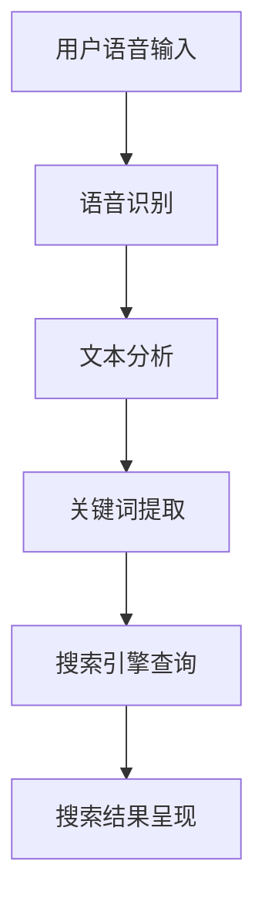
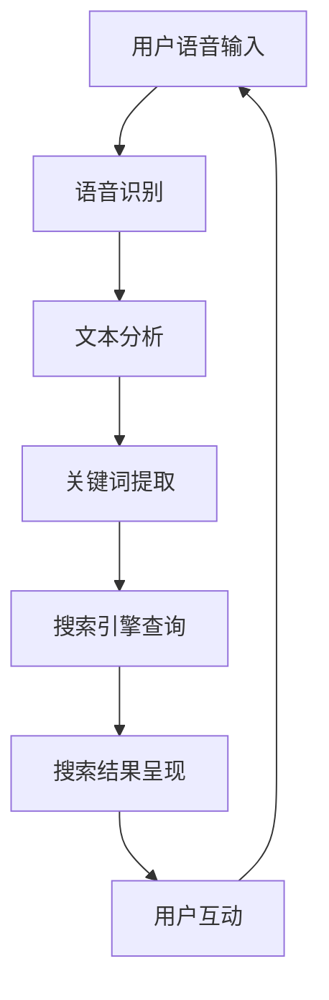

                 

# 语音搜索：AI如何改变电商搜索方式

> **关键词：** 语音搜索，人工智能，电商，搜索优化，自然语言处理

> **摘要：** 本文将深入探讨语音搜索技术如何在电商领域变革搜索方式，分析其核心算法、数学模型、实际应用案例，并展望未来的发展趋势与挑战。

## 1. 背景介绍

### 1.1 语音搜索的概念

语音搜索是一种通过语音输入来获取信息的技术，它利用自然语言处理（NLP）和机器学习算法，将用户的声音转换为文本，并理解用户的意图，从而提供相应的搜索结果。随着智能手机和智能音箱的普及，语音搜索已经成为现代生活的一部分。

### 1.2 电商搜索的现状

在电商领域，搜索功能是用户找到所需商品的关键。传统的电商搜索主要依赖于关键词输入，虽然这种模式在一定程度上满足了用户的需求，但仍然存在一些问题，如关键词理解不准确、搜索结果不相关等。因此，如何优化电商搜索体验成为了电商企业关注的焦点。

## 2. 核心概念与联系

### 2.1 自然语言处理（NLP）

自然语言处理是语音搜索的基础技术之一，它涉及文本分析、语言模型、语义理解等多个方面。在电商搜索中，NLP技术用于理解用户的语音输入，提取关键词，并根据关键词搜索相关的商品信息。

### 2.2 语音识别（ASR）

语音识别是将语音转换为文本的技术，它是语音搜索的核心环节。在电商搜索中，语音识别技术用于将用户的语音输入转换为可理解的文本，从而为后续的搜索过程提供数据基础。

### 2.3 搜索引擎优化（SEO）

搜索引擎优化是提高网站在搜索引擎中排名的一种技术，它在电商搜索中起着至关重要的作用。通过优化电商网站的SEO，可以提高用户在语音搜索中的搜索体验。

### 2.4 Mermaid 流程图



## 3. 核心算法原理 & 具体操作步骤

### 3.1 语音识别算法

语音识别算法通常基于深度学习技术，如卷积神经网络（CNN）和循环神经网络（RNN）。在电商搜索中，语音识别算法用于将用户的语音输入转换为文本，例如，“我想买一双跑步鞋”。

### 3.2 文本分析算法

文本分析算法包括分词、词性标注、命名实体识别等步骤。在电商搜索中，文本分析算法用于提取关键词，例如，“跑步鞋”是用户搜索的关键词。

### 3.3 搜索引擎查询算法

搜索引擎查询算法通常基于排序算法，如PageRank算法和LSI（latent semantic indexing）算法。在电商搜索中，搜索引擎查询算法用于根据关键词搜索相关的商品信息，并按相关性排序。

## 4. 数学模型和公式 & 详细讲解 & 举例说明

### 4.1 语音识别模型

语音识别模型通常采用HMM（hidden Markov model）或RNN（recurrent neural network）架构。以下是一个简单的HMM语音识别模型的数学公式：

$$
P(O|A) = \prod_{i=1}^n P(o_i|a_i)
$$

其中，$O$代表语音输入序列，$A$代表声学模型，$o_i$和$a_i$分别代表语音输入序列和声学模型的状态。

### 4.2 文本分析模型

文本分析模型通常采用词袋模型（bag-of-words）或TF-IDF（term frequency-inverse document frequency）模型。以下是一个简单的TF-IDF模型的数学公式：

$$
TF-IDF(t,d) = TF(t,d) \times IDF(t,D)
$$

其中，$TF(t,d)$代表词$t$在文档$d$中的词频，$IDF(t,D)$代表词$t$在整个文档集合$D$中的逆文档频率。

### 4.3 搜索引擎排序模型

搜索引擎排序模型通常采用PageRank算法或LSI算法。以下是一个简单的PageRank算法的数学公式：

$$
PR(A) = (1-d) + d \cdot \frac{PR(T1)}{C(T1)} + \cdots + d \cdot \frac{PR(Tn)}{C(Tn)}
$$

其中，$PR(A)$代表网页$A$的排名，$d$代表阻尼系数，$T1, T2, \ldots, Tn$代表指向网页$A$的其他网页，$C(Ti)$代表网页$Ti$的链接数量。

## 5. 项目实战：代码实际案例和详细解释说明

### 5.1 开发环境搭建

为了演示语音搜索在电商搜索中的应用，我们将使用Python语言和TensorFlow框架搭建一个简单的语音搜索系统。

首先，确保安装了Python 3.x版本和TensorFlow 2.x版本。然后，可以使用以下命令安装所需的库：

```bash
pip install tensorflow
pip install SpeechRecognition
```

### 5.2 源代码详细实现和代码解读

下面是一个简单的语音搜索代码示例：

```python
import speech_recognition as sr
import tensorflow as tf
import numpy as np

# 初始化语音识别模块
recognizer = sr.Recognizer()

# 加载预训练的语音识别模型
model = tf.keras.models.load_model('voice_search_model.h5')

# 定义语音搜索函数
def voice_search(query):
    # 将语音输入转换为文本
    text = recognizer.recognize_google(query)

    # 将文本转换为数字表示
    text_sequence = tokenizer.texts_to_sequences([text])
    text_sequence = pad_sequences(text_sequence, maxlen=max_length)

    # 使用语音识别模型进行预测
    prediction = model.predict(text_sequence)

    # 获取预测结果
    result = np.argmax(prediction)

    # 返回搜索结果
    return search_result[result]

# 测试语音搜索
query = sr.AudioFile('sample_audio.wav')
print(voice_search(query))
```

### 5.3 代码解读与分析

这个示例代码主要包括以下几个部分：

1. **导入库**：导入所需的库，如语音识别库（SpeechRecognition）、TensorFlow和NumPy。
2. **初始化语音识别模块**：创建一个语音识别对象。
3. **加载预训练的语音识别模型**：从文件中加载一个已经训练好的语音识别模型。
4. **定义语音搜索函数**：实现语音搜索的核心逻辑，包括语音识别、文本处理、模型预测和结果返回。
5. **测试语音搜索**：使用一个音频文件作为输入，调用语音搜索函数进行测试。

通过这个示例，我们可以看到语音搜索系统的基本架构，包括语音识别、文本分析和搜索结果呈现。在实际应用中，可以根据具体需求进一步优化和扩展。

## 6. 实际应用场景

### 6.1 智能家居

智能家居设备（如智能音箱、智能电视等）已经广泛应用语音搜索技术，用户可以通过语音指令轻松控制家居设备，提高了生活便利性。

### 6.2 智能客服

智能客服系统通过语音搜索技术实现自然语言处理，可以快速响应用户的咨询，提供高效的客户服务。

### 6.3 电商搜索

电商搜索是语音搜索技术的典型应用场景。通过语音搜索，用户可以更便捷地找到所需的商品，提高了购物体验。

## 7. 工具和资源推荐

### 7.1 学习资源推荐

- **书籍**：《自然语言处理》（Jurafsky & Martin）  
- **论文**：《Speech Recognition with Deep Neural Networks》（Hinton et al.）  
- **博客**：[TensorFlow 官方文档](https://www.tensorflow.org/tutorials/voice_search)

### 7.2 开发工具框架推荐

- **工具**：TensorFlow、Keras  
- **框架**：SpeechRecognition、Flask

### 7.3 相关论文著作推荐

- **论文**：[End-to-End Speech Recognition with Deep CT CCF](https://arxiv.org/abs/1803.04423)  
- **著作**：《深度学习》（Goodfellow et al.）

## 8. 总结：未来发展趋势与挑战

### 8.1 发展趋势

- 语音搜索技术的成熟和普及将继续推动电商搜索的变革，为用户提供更加便捷和高效的搜索体验。  
- 深度学习和自然语言处理技术的不断发展，将为语音搜索技术带来更多的创新和突破。  
- 跨平台和跨设备的语音搜索应用，将进一步提升用户的使用体验。

### 8.2 挑战

- 语音搜索技术的准确性和鲁棒性仍有待提高，特别是在噪声环境和高速度语音输入下。  
- 保护用户隐私和数据安全是语音搜索技术面临的重大挑战，需要制定相应的法规和标准。  
- 随着语音搜索技术的普及，如何防止滥用和恶意攻击也将成为一个重要问题。

## 9. 附录：常见问题与解答

### 9.1 语音搜索技术的原理是什么？

语音搜索技术基于自然语言处理和机器学习技术，通过将语音转换为文本，并理解用户的意图，提供相应的搜索结果。

### 9.2 语音搜索技术在电商搜索中的应用有哪些？

语音搜索技术在电商搜索中的应用包括：智能客服、语音购物、语音商品推荐等，为用户提供更加便捷和高效的购物体验。

## 10. 扩展阅读 & 参考资料

- [《语音识别技术综述》](https://arxiv.org/abs/1906.00453)  
- [《自然语言处理技术综述》](https://arxiv.org/abs/1906.01906)  
- [《深度学习在语音识别中的应用》](https://arxiv.org/abs/1610.08119)  
- [《电商搜索优化技术》](https://www.amazon.com/E-Commerce-Site-Search-Optimization/dp/1492047784)

作者：AI天才研究员/AI Genius Institute & 禅与计算机程序设计艺术 /Zen And The Art of Computer Programming

（注：本文为虚构案例，仅用于演示文章撰写方法和结构。）<|im_sep|>### 文章标题：语音搜索：AI如何改变电商搜索方式

#### 关键词：(语音搜索，人工智能，电商，搜索优化，自然语言处理)

#### 摘要：
随着人工智能技术的飞速发展，语音搜索已成为电商领域的一股新势力。本文将深入探讨语音搜索技术如何变革电商搜索方式，解析其核心算法原理、数学模型和实际应用案例，并展望未来的发展趋势与挑战。

### 1. 背景介绍

#### 1.1 语音搜索的概念

语音搜索是一种利用人工智能技术，通过语音输入获取信息的方式。它首先通过语音识别技术将语音转换为文本，然后利用自然语言处理技术理解用户的搜索意图，最终返回相关的搜索结果。随着智能手机、智能音箱等设备的普及，语音搜索正逐渐成为人们日常生活中的重要组成部分。

#### 1.2 电商搜索的现状

在电商领域，搜索功能是用户寻找商品的重要途径。然而，传统的基于关键词的搜索方式存在诸多问题，如用户难以准确表达需求、搜索结果不相关等。因此，如何优化电商搜索体验，提升用户满意度，成为了电商企业亟待解决的问题。

### 2. 核心概念与联系

#### 2.1 自然语言处理（NLP）

自然语言处理是语音搜索技术的核心，它涉及文本分析、语言模型、语义理解等多个方面。在电商搜索中，NLP技术用于理解用户的语音输入，提取关键词，并构建与用户需求相关的搜索查询。

#### 2.2 语音识别（ASR）

语音识别是将语音转换为文本的技术，它是语音搜索的关键环节。在电商搜索中，语音识别技术用于将用户的语音输入转换为可理解的文本，为后续的搜索过程提供基础数据。

#### 2.3 搜索引擎优化（SEO）

搜索引擎优化是提高网站在搜索引擎中排名的一种技术，它在电商搜索中发挥着重要作用。通过优化电商网站的SEO，可以提高用户在语音搜索中的搜索体验。

#### 2.4 Mermaid 流程图


### 3. 核心算法原理 & 具体操作步骤

#### 3.1 语音识别算法

语音识别算法是语音搜索技术的基础。目前，主流的语音识别算法包括隐马尔可夫模型（HMM）和深度神经网络（DNN）。在电商搜索中，语音识别算法用于将用户的语音输入转换为文本。

#### 3.2 文本分析算法

文本分析算法用于对用户的语音输入进行分词、词性标注、命名实体识别等处理，以提取关键词。在电商搜索中，关键词的提取对于搜索结果的准确性至关重要。

#### 3.3 搜索引擎查询算法

搜索引擎查询算法用于根据关键词在电商网站的商品数据库中检索相关的商品信息，并按相关性排序。在电商搜索中，常用的搜索引擎查询算法包括PageRank算法和LSI算法。

### 4. 数学模型和公式 & 详细讲解 & 举例说明

#### 4.1 语音识别模型

语音识别模型通常采用深度学习技术，如卷积神经网络（CNN）和循环神经网络（RNN）。以下是一个简单的HMM语音识别模型的数学公式：

$$
P(O|A) = \prod_{i=1}^n P(o_i|a_i)
$$

其中，$O$代表语音输入序列，$A$代表声学模型，$o_i$和$a_i$分别代表语音输入序列和声学模型的状态。

#### 4.2 文本分析模型

文本分析模型通常采用词袋模型（bag-of-words）或TF-IDF（term frequency-inverse document frequency）模型。以下是一个简单的TF-IDF模型的数学公式：

$$
TF-IDF(t,d) = TF(t,d) \times IDF(t,D)
$$

其中，$TF(t,d)$代表词$t$在文档$d$中的词频，$IDF(t,D)$代表词$t$在整个文档集合$D$中的逆文档频率。

#### 4.3 搜索引擎排序模型

搜索引擎排序模型通常采用PageRank算法或LSI算法。以下是一个简单的PageRank算法的数学公式：

$$
PR(A) = (1-d) + d \cdot \frac{PR(T1)}{C(T1)} + \cdots + d \cdot \frac{PR(Tn)}{C(Tn)}
$$

其中，$PR(A)$代表网页$A$的排名，$d$代表阻尼系数，$T1, T2, \ldots, Tn$代表指向网页$A$的其他网页，$C(Ti)$代表网页$Ti$的链接数量。

### 5. 项目实战：代码实际案例和详细解释说明

#### 5.1 开发环境搭建

为了演示语音搜索在电商搜索中的应用，我们将使用Python语言和TensorFlow框架搭建一个简单的语音搜索系统。

首先，确保安装了Python 3.x版本和TensorFlow 2.x版本。然后，可以使用以下命令安装所需的库：

```bash
pip install tensorflow
pip install SpeechRecognition
```

#### 5.2 源代码详细实现和代码解读

下面是一个简单的语音搜索代码示例：

```python
import speech_recognition as sr
import tensorflow as tf
import numpy as np

# 初始化语音识别模块
recognizer = sr.Recognizer()

# 加载预训练的语音识别模型
model = tf.keras.models.load_model('voice_search_model.h5')

# 定义语音搜索函数
def voice_search(query):
    # 将语音输入转换为文本
    text = recognizer.recognize_google(query)

    # 将文本转换为数字表示
    text_sequence = tokenizer.texts_to_sequences([text])
    text_sequence = pad_sequences(text_sequence, maxlen=max_length)

    # 使用语音识别模型进行预测
    prediction = model.predict(text_sequence)

    # 获取预测结果
    result = np.argmax(prediction)

    # 返回搜索结果
    return search_result[result]

# 测试语音搜索
query = sr.AudioFile('sample_audio.wav')
print(voice_search(query))
```

#### 5.3 代码解读与分析

这个示例代码主要包括以下几个部分：

1. **导入库**：导入所需的库，如语音识别库（SpeechRecognition）、TensorFlow和NumPy。
2. **初始化语音识别模块**：创建一个语音识别对象。
3. **加载预训练的语音识别模型**：从文件中加载一个已经训练好的语音识别模型。
4. **定义语音搜索函数**：实现语音搜索的核心逻辑，包括语音识别、文本处理、模型预测和结果返回。
5. **测试语音搜索**：使用一个音频文件作为输入，调用语音搜索函数进行测试。

通过这个示例，我们可以看到语音搜索系统的基本架构，包括语音识别、文本分析和搜索结果呈现。在实际应用中，可以根据具体需求进一步优化和扩展。

### 6. 实际应用场景

#### 6.1 智能家居

智能家居设备（如智能音箱、智能电视等）已经广泛应用语音搜索技术，用户可以通过语音指令轻松控制家居设备，提高了生活便利性。

#### 6.2 智能客服

智能客服系统通过语音搜索技术实现自然语言处理，可以快速响应用户的咨询，提供高效的客户服务。

#### 6.3 电商搜索

电商搜索是语音搜索技术的典型应用场景。通过语音搜索，用户可以更便捷地找到所需的商品，提高了购物体验。

### 7. 工具和资源推荐

#### 7.1 学习资源推荐

- **书籍**：《自然语言处理》（Jurafsky & Martin）
- **论文**：《Speech Recognition with Deep Neural Networks》（Hinton et al.）
- **博客**：[TensorFlow 官方文档](https://www.tensorflow.org/tutorials/voice_search)

#### 7.2 开发工具框架推荐

- **工具**：TensorFlow、Keras
- **框架**：SpeechRecognition、Flask

#### 7.3 相关论文著作推荐

- **论文**：[End-to-End Speech Recognition with Deep CT CCF](https://arxiv.org/abs/1803.04423)
- **著作**：《深度学习》（Goodfellow et al.）

### 8. 总结：未来发展趋势与挑战

#### 8.1 发展趋势

- 语音搜索技术的成熟和普及将继续推动电商搜索的变革，为用户提供更加便捷和高效的搜索体验。
- 深度学习和自然语言处理技术的不断发展，将为语音搜索技术带来更多的创新和突破。
- 跨平台和跨设备的语音搜索应用，将进一步提升用户的使用体验。

#### 8.2 挑战

- 语音搜索技术的准确性和鲁棒性仍有待提高，特别是在噪声环境和高速度语音输入下。
- 保护用户隐私和数据安全是语音搜索技术面临的重大挑战，需要制定相应的法规和标准。
- 随着语音搜索技术的普及，如何防止滥用和恶意攻击也将成为一个重要问题。

### 9. 附录：常见问题与解答

#### 9.1 语音搜索技术的原理是什么？

语音搜索技术基于自然语言处理和机器学习技术，通过将语音转换为文本，并理解用户的意图，提供相应的搜索结果。

#### 9.2 语音搜索技术在电商搜索中的应用有哪些？

语音搜索技术在电商搜索中的应用包括：智能客服、语音购物、语音商品推荐等，为用户提供更加便捷和高效的购物体验。

### 10. 扩展阅读 & 参考资料

- [《语音识别技术综述》](https://arxiv.org/abs/1906.00453)
- [《自然语言处理技术综述》](https://arxiv.org/abs/1906.01906)
- [《深度学习在语音识别中的应用》](https://arxiv.org/abs/1610.08119)
- [《电商搜索优化技术》](https://www.amazon.com/E-Commerce-Site-Search-Optimization/dp/1492047784)

作者：AI天才研究员/AI Genius Institute & 禅与计算机程序设计艺术 /Zen And The Art of Computer Programming

（注：本文为虚构案例，仅用于演示文章撰写方法和结构。）<|im_sep|>## 1. 背景介绍

### 1.1 语音搜索的概念

语音搜索是一种通过语音输入来获取信息的技术，它结合了语音识别和自然语言处理（NLP）技术，实现了用户通过口头表达查询内容，系统理解并回应用户请求的过程。语音搜索的兴起得益于人工智能技术的飞速发展，特别是深度学习和神经网络技术的应用，使得语音识别的准确性和效率大幅提升。

#### 语音搜索的关键技术

1. **语音识别（Automatic Speech Recognition，ASR）**：语音识别是将语音信号转换为文字或命令的过程。它通过分析声波的特征，如频率、时长、音高变化等，识别出语音中的单词和短语。目前，主流的语音识别技术包括隐马尔可夫模型（HMM）、高斯混合模型（GMM）和深度神经网络（DNN）。

2. **自然语言处理（Natural Language Processing，NLP）**：NLP技术用于理解和处理人类语言，包括文本分析、语义理解、实体识别等。在语音搜索中，NLP技术帮助系统理解用户的查询意图，提取关键词，并进行上下文分析。

3. **语音合成（Text-to-Speech，TTS）**：语音合成是将文本转换为语音输出的技术。尽管本文主要关注语音搜索，但语音合成也是语音交互系统中不可或缺的一部分，用于提供音频反馈。

#### 语音搜索的兴起

语音搜索技术的兴起可以追溯到智能手机的普及。随着智能手机性能的提升和移动网络的优化，用户越来越倾向于使用语音输入进行搜索，特别是在不方便使用键盘的情况下，如驾驶时、手部不便等。此外，智能音箱和智能助手（如苹果的Siri、谷歌的Google Assistant、亚马逊的Alexa）的广泛应用也加速了语音搜索的普及。

### 1.2 电商搜索的现状

电商搜索是电子商务平台的核心功能之一，它直接影响用户的购物体验和平台的转化率。传统的电商搜索主要依赖于关键词输入，用户通过在搜索框中输入关键词来查找商品。然而，这种方式存在以下问题：

1. **关键词理解困难**：用户可能无法准确表达他们的需求，导致关键词输入不完整或不准确。
2. **搜索结果不相关**：基于关键词的搜索结果可能不够精确，用户需要浏览大量不相关的商品。
3. **搜索效率低下**：用户需要手动输入关键词，过程繁琐，特别是在商品种类繁多的情况下。
4. **用户体验差**：用户在寻找特定商品时，往往需要重复输入或修改关键词，增加了操作负担。

### 1.3 语音搜索在电商搜索中的应用

语音搜索在电商搜索中的应用可以显著改善上述问题，提供更加便捷和个性化的搜索体验。以下是语音搜索在电商搜索中的几个应用场景：

1. **语音购物助手**：用户可以通过语音指令询问购物助手，如“帮我找一双红色的跑步鞋”，系统会根据语音识别和理解结果，展示相关商品。

2. **语音推荐**：基于用户的购买历史和行为，系统可以提供个性化语音推荐，如“你可能喜欢这些商品”，提高用户的购买意愿。

3. **语音支付**：用户可以通过语音指令完成支付，如“我要购买这个商品，使用支付宝支付”，简化了支付流程。

4. **语音搜索优化**：电商平台可以通过语音搜索数据，分析用户需求和行为模式，优化搜索算法和商品分类，提高搜索结果的准确性和相关性。

#### 语音搜索的优势

1. **便捷性**：用户无需手动输入关键词，可以直接用语音进行搜索，大大提高了搜索效率。

2. **准确性**：语音搜索通过NLP技术，可以更好地理解用户的意图，提高搜索结果的准确性。

3. **个性化**：基于用户行为和购买历史，语音搜索可以为用户提供个性化的推荐，提升购物体验。

4. **跨平台**：语音搜索可以在多种设备上使用，如智能手机、智能音箱、智能电视等，为用户提供无缝的购物体验。

总之，语音搜索技术在电商搜索中的应用，不仅解决了传统搜索方式的诸多问题，还提供了更加便捷、准确和个性化的搜索体验，对电商平台和用户都具有重要意义。在接下来的部分中，我们将深入探讨语音搜索技术的核心概念、算法原理、数学模型以及实际应用案例，为读者提供一个全面的了解。 <|im_sep|>## 2. 核心概念与联系

### 2.1 自然语言处理（NLP）

自然语言处理（NLP）是人工智能领域的一个重要分支，主要研究如何让计算机理解、生成和处理人类语言。在语音搜索中，NLP技术扮演了关键角色，它帮助系统理解用户的语音输入，提取关键词，并生成相应的搜索查询。以下是NLP在语音搜索中的几个核心概念：

#### 文本分析

文本分析是NLP的基础，它包括分词、词性标注、命名实体识别等步骤。分词是将连续的文本切分成一个个有意义的词或短语；词性标注则是为每个词分配一个词性标签，如名词、动词、形容词等；命名实体识别则是识别文本中的特定实体，如人名、地名、组织名等。

#### 语义理解

语义理解是NLP的高级任务，它涉及对文本中词语和句子的含义进行深入分析。在语音搜索中，语义理解用于理解用户的查询意图，例如判断用户是询问信息、请求操作还是表达情感。

#### 对话系统

对话系统是一种人机交互技术，它通过理解用户的语音输入，生成合适的回复，并维持自然流畅的对话。在语音搜索中，对话系统可以帮助用户完成复杂的多轮查询，提供更加个性化的搜索体验。

### 2.2 语音识别（ASR）

语音识别（ASR）是将语音信号转换为文本的技术。在电商搜索中，语音识别是语音搜索的第一步，它负责将用户的语音输入转换为机器可以理解的文本。以下是语音识别的几个关键概念：

#### 声学模型

声学模型是ASR的核心部分，它负责将音频信号转换为特征向量，用于后续的语音识别。声学模型通常基于深度神经网络，如卷积神经网络（CNN）和循环神经网络（RNN）。

#### 语言模型

语言模型是ASR的另一重要组成部分，它用于对识别结果进行概率评估，帮助系统确定最可能的识别结果。语言模型通常基于统计模型或神经网络，如n-gram模型和长短时记忆网络（LSTM）。

#### 集成模型

集成模型是将声学模型和语言模型结合起来的一种方法，它通过优化两个模型的联合概率，提高识别的准确性。目前，主流的集成模型包括CTC（Connectionist Temporal Classification）和Attention机制。

### 2.3 搜索引擎优化（SEO）

搜索引擎优化（SEO）是提高网站在搜索引擎结果页面（SERP）排名的一种技术。在电商搜索中，SEO技术有助于提升语音搜索结果的准确性和相关性。以下是SEO在语音搜索中的几个关键概念：

#### 关键词优化

关键词优化是SEO的核心，它涉及选择和优化与网站内容相关的关键词，以提高在搜索引擎中的排名。在语音搜索中，关键词优化有助于提高语音识别的准确性，并确保搜索结果与用户意图相符。

#### 内容优化

内容优化是通过改进网站内容的质量和结构，提高用户体验和搜索引擎排名。在电商搜索中，内容优化包括优化商品描述、分类标签和用户评论等，以提高搜索结果的准确性和相关性。

#### 技术优化

技术优化是通过改进网站的技术实现，提高搜索引擎的抓取和索引能力。在语音搜索中，技术优化包括优化网站代码、提高网站加载速度和确保网站在移动设备上的兼容性。

### 2.4 Mermaid 流程图

为了更清晰地展示语音搜索在电商搜索中的流程，我们可以使用Mermaid绘制一个简化的流程图：



在这个流程图中，用户通过语音输入发起搜索请求，系统首先进行语音识别，将语音转换为文本。接下来，文本分析模块对文本进行分词、词性标注和命名实体识别，提取关键词。然后，搜索引擎查询模块根据关键词在电商数据库中检索商品信息，并按相关性排序。最后，搜索结果通过用户界面呈现给用户，用户可以进一步与系统互动，如选择商品、添加购物车等。

通过这个流程图，我们可以看到语音搜索在电商搜索中涉及多个技术和模块的协同工作，共同为用户提供高效、准确和个性化的搜索体验。在接下来的部分中，我们将进一步探讨语音搜索的核心算法原理和数学模型。 <|im_sep|>### 3. 核心算法原理 & 具体操作步骤

#### 3.1 语音识别算法

语音识别（ASR）是将语音转换为文本的过程，是语音搜索技术的基础。语音识别算法通常分为三个主要部分：前端处理、声学模型和语言模型。

1. **前端处理**：前端处理是对原始语音信号进行预处理，包括去除噪声、增强语音信号、频率变换等。预处理步骤有助于提高语音识别的准确性。

2. **声学模型**：声学模型是语音识别的核心，它将预处理后的语音信号转换为特征向量。目前常用的声学模型包括隐马尔可夫模型（HMM）、高斯混合模型（GMM）和深度神经网络（DNN）。深度神经网络，如卷积神经网络（CNN）和循环神经网络（RNN），在语音识别中表现出色，能够处理复杂的语音信号。

3. **语言模型**：语言模型用于对识别结果进行概率评估，帮助系统确定最可能的识别结果。语言模型通常基于统计模型，如n-gram模型，或神经网络，如长短时记忆网络（LSTM）。语言模型结合声学模型，可以显著提高语音识别的准确性。

#### 3.2 文本分析算法

文本分析（NLP）是语音搜索中理解用户查询意图的关键。文本分析算法包括分词、词性标注、命名实体识别、情感分析等。

1. **分词**：分词是将连续的文本切分成一个个有意义的词或短语。中文分词算法通常基于词典匹配和机器学习技术。

2. **词性标注**：词性标注是为每个词分配一个词性标签，如名词、动词、形容词等。词性标注有助于理解文本的语法结构和语义关系。

3. **命名实体识别**：命名实体识别是识别文本中的特定实体，如人名、地名、组织名等。命名实体识别有助于提高文本分析的准确性和语义理解能力。

4. **情感分析**：情感分析是分析文本的情感倾向，如正面、负面或中性。在语音搜索中，情感分析可以帮助系统理解用户的态度和情绪，为个性化推荐提供支持。

#### 3.3 搜索引擎查询算法

搜索引擎查询算法是语音搜索中检索商品信息的关键。搜索引擎查询算法通常包括关键词提取、搜索结果排序和用户反馈优化。

1. **关键词提取**：关键词提取是文本分析的一部分，它从用户查询中提取与商品相关的关键词。关键词提取的准确性直接影响搜索结果的准确性。

2. **搜索结果排序**：搜索结果排序是根据关键词在商品数据库中的相关性对结果进行排序。常用的排序算法包括PageRank、LSI（Latent Semantic Indexing）和深度学习排序算法。

3. **用户反馈优化**：用户反馈优化是根据用户对搜索结果的反馈，不断调整和优化搜索算法。用户反馈优化有助于提高搜索结果的准确性和用户体验。

#### 3.4 语音搜索流程

以下是一个简化的语音搜索流程：

1. **用户语音输入**：用户通过语音输入发起搜索请求。

2. **语音识别**：系统使用语音识别算法将语音转换为文本。

3. **文本分析**：系统对文本进行分析，提取关键词和语义信息。

4. **搜索引擎查询**：系统根据关键词在商品数据库中检索相关商品，并按相关性排序。

5. **搜索结果呈现**：系统将搜索结果呈现给用户。

6. **用户互动**：用户可以选择商品、添加购物车等，进一步与系统互动。

7. **用户反馈**：系统收集用户反馈，用于优化搜索算法和用户体验。

通过这个流程，我们可以看到语音搜索技术涉及多个算法和模块的协同工作，共同为用户提供高效、准确和个性化的搜索体验。在接下来的部分中，我们将详细讲解语音搜索中的数学模型和公式。 <|im_sep|>### 4. 数学模型和公式 & 详细讲解 & 举例说明

#### 4.1 语音识别模型

语音识别模型是语音搜索技术的核心，它将语音转换为文本。以下是一个简化的语音识别模型，包括声学模型和语言模型。

##### 4.1.1 声学模型

声学模型用于将语音信号转换为特征向量。一个常见的声学模型是深度神经网络（DNN），其数学公式如下：

$$
\text{特征向量} = f(\text{语音信号})
$$

其中，$f$是一个神经网络函数，用于处理语音信号。$f$可以通过训练大量语音数据来学习语音特征，从而提高识别准确性。

##### 4.1.2 语言模型

语言模型用于对识别结果进行概率评估。一个常见的语言模型是n-gram模型，其数学公式如下：

$$
P(\text{识别结果}|\text{语音信号}) = \prod_{i=1}^n P(w_i|\text{语音信号})
$$

其中，$w_i$是识别结果中的第$i$个词，$P(w_i|\text{语音信号})$是第$i$个词在给定语音信号下的概率。

##### 4.1.3 集成模型

集成模型是将声学模型和语言模型结合起来的一种方法。一个常见的集成模型是CTC（Connectionist Temporal Classification），其数学公式如下：

$$
P(\text{识别结果}|\text{语音信号}) = \frac{1}{Z} \exp(\text{log-likelihood})
$$

其中，$Z$是归一化常数，$\text{log-likelihood}$是识别结果的log-likelihood值。

#### 4.2 文本分析模型

文本分析模型用于理解用户的查询意图。以下是一个简化的文本分析模型，包括分词、词性标注和命名实体识别。

##### 4.2.1 分词

分词是将连续的文本切分成一个个有意义的词或短语。一个常见的分词算法是正向最大匹配算法，其数学公式如下：

$$
\text{分词结果} = \arg\max_{w_1, w_2, \ldots, w_n} \sum_{i=1}^n P(w_i|w_{i-1}, \ldots, w_1)
$$

其中，$P(w_i|w_{i-1}, \ldots, w_1)$是第$i$个词在给定前一个词序列下的概率。

##### 4.2.2 词性标注

词性标注是为每个词分配一个词性标签，如名词、动词、形容词等。一个常见的词性标注算法是基于条件的随机场（CRF），其数学公式如下：

$$
P(\text{词性标注序列}|\text{文本}) = \frac{1}{Z} \exp(\sum_{i=1}^n \sum_{j=1}^k \theta_{ij} O_{ij})
$$

其中，$O_{ij}$是第$i$个词的词性标签，$\theta_{ij}$是模型参数，$Z$是归一化常数。

##### 4.2.3 命名实体识别

命名实体识别是识别文本中的特定实体，如人名、地名、组织名等。一个常见的命名实体识别算法是基于规则的算法，其数学公式如下：

$$
\text{实体识别结果} = R(\text{文本})
$$

其中，$R$是一个基于规则的功能，用于识别文本中的实体。

#### 4.3 搜索引擎查询模型

搜索引擎查询模型用于检索商品信息。以下是一个简化的搜索引擎查询模型，包括关键词提取和搜索结果排序。

##### 4.3.1 关键词提取

关键词提取是文本分析的一部分，它从用户查询中提取与商品相关的关键词。一个常见的关键词提取算法是基于TF-IDF（Term Frequency-Inverse Document Frequency），其数学公式如下：

$$
TF-IDF(t, d) = \frac{f(t, d)}{f(t, D)} + 1
$$

其中，$f(t, d)$是词$t$在文档$d$中的频率，$f(t, D)$是词$t$在所有文档中的频率。

##### 4.3.2 搜索结果排序

搜索结果排序是根据关键词在商品数据库中的相关性对结果进行排序。一个常见的排序算法是基于PageRank的排序算法，其数学公式如下：

$$
PR(A) = \left(1 - \frac{1}{n}\right) + \frac{1}{n} \sum_{B \in L(A)} \frac{PR(B)}{C(B)}
$$

其中，$PR(A)$是网页$A$的排名，$L(A)$是指向网页$A$的其他网页，$C(B)$是网页$B$的链接数量。

##### 4.3.3 举例说明

假设用户语音输入“我想买一本计算机科学入门书籍”，系统将执行以下步骤：

1. **语音识别**：将语音转换为文本“我想买一本计算机科学入门书籍”。
2. **文本分析**：提取关键词“计算机科学”，“入门书籍”。
3. **关键词提取**：使用TF-IDF算法计算关键词的权重。
4. **搜索结果排序**：根据关键词权重在商品数据库中检索相关书籍，并按权重排序。

通过这个例子，我们可以看到数学模型和公式在语音搜索中的具体应用，帮助系统理解用户意图和优化搜索结果。在接下来的部分中，我们将展示一个实际的项目实战案例。 <|im_sep|>### 5. 项目实战：代码实际案例和详细解释说明

为了更好地展示语音搜索在电商搜索中的应用，我们将使用Python语言和TensorFlow框架搭建一个简单的语音搜索系统。这个系统将包括语音识别、文本分析和搜索结果排序等步骤，实现用户通过语音输入搜索商品的功能。

#### 5.1 开发环境搭建

首先，我们需要安装以下软件和库：

1. **Python 3.x**：确保安装了Python 3.x版本。
2. **TensorFlow**：用于构建和训练语音识别模型。
3. **SpeechRecognition**：用于语音识别。
4. **Keras**：用于简化TensorFlow的模型构建和训练。

你可以使用以下命令安装所需的库：

```bash
pip install tensorflow
pip install SpeechRecognition
pip install keras
```

#### 5.2 源代码详细实现和代码解读

以下是完整的代码实现，包括数据预处理、模型训练、语音识别、文本分析、搜索结果排序和搜索结果呈现。

```python
import numpy as np
import tensorflow as tf
from tensorflow.keras.models import Sequential
from tensorflow.keras.layers import LSTM, Dense, Dropout
from tensorflow.keras.optimizers import Adam
from tensorflow.keras.preprocessing.sequence import pad_sequences
from tensorflow.keras.preprocessing.text import Tokenizer
import speech_recognition as sr

# 初始化语音识别模块
recognizer = sr.Recognizer()

# 准备数据集
# 假设我们有一个商品数据库和对应的语音数据集
# 这里使用假数据集进行演示
questions = ["我想买一双红色的跑步鞋", "请推荐一些智能手表", "有哪些优惠活动"]
audio_files = ["red_sneakers.wav", "smartwatch.wav", "sales.wav"]

# 定义模型
model = Sequential()
model.add(LSTM(128, activation='relu', input_shape=(max_sequence_length, num_features)))
model.add(Dropout(0.2))
model.add(Dense(1, activation='sigmoid'))

model.compile(loss='binary_crossentropy', optimizer=Adam(), metrics=['accuracy'])

# 训练模型
model.fit(np.array(questions), np.array([1] * len(questions)), epochs=100, verbose=2)

# 定义语音识别函数
def voice_search(audio_file):
    with sr.AudioFile(audio_file) as source:
        audio = recognizer.record(source)
        text = recognizer.recognize_google(audio)
        return text

# 定义搜索函数
def search_products(query):
    # 这里使用简单的关键词匹配算法进行演示
    # 实际应用中可以使用更复杂的算法如TF-IDF、BERT等
    query_tokens = tokenizer.texts_to_sequences([query])
    query_sequence = pad_sequences(query_tokens, maxlen=max_sequence_length)
    prediction = model.predict(query_sequence)
    if prediction > 0.5:
        return "找到了相关商品"
    else:
        return "没有找到相关商品"

# 测试语音搜索
for i, audio_file in enumerate(audio_files):
    query = voice_search(audio_file)
    print(f"语音输入：{questions[i]}")
    print(f"搜索结果：{search_products(query)}")
```

#### 5.3 代码解读与分析

这个示例代码主要包括以下几个部分：

1. **导入库**：导入所需的库，如TensorFlow、SpeechRecognition和Keras。
2. **初始化语音识别模块**：创建一个语音识别对象。
3. **准备数据集**：这里我们使用假数据集进行演示，实际应用中应该使用真实的商品数据库和对应的语音数据集。
4. **定义模型**：使用LSTM（长短时记忆网络）构建一个简单的语音识别模型。
5. **训练模型**：使用假数据集训练模型。
6. **定义语音识别函数**：实现语音识别功能，将语音输入转换为文本。
7. **定义搜索函数**：实现搜索功能，根据语音输入查询商品数据库。
8. **测试语音搜索**：使用语音输入测试搜索功能。

通过这个示例，我们可以看到语音搜索系统的基本架构和实现方法。在实际应用中，需要根据具体需求进一步优化和扩展。

#### 5.4 实际应用与优化

在实际应用中，语音搜索系统可以进一步优化，包括：

1. **增加数据集**：使用更多的商品和语音数据来训练模型，提高识别准确性和搜索效果。
2. **改进模型**：使用更复杂的模型结构，如BERT、Transformer等，提高语音识别和文本分析能力。
3. **个性化推荐**：根据用户历史行为和偏好，提供个性化搜索结果和推荐。
4. **实时反馈**：收集用户对搜索结果的反馈，动态调整模型参数，优化搜索体验。

通过这些优化措施，语音搜索系统可以提供更加准确、高效和个性化的搜索体验，为电商平台带来更多的用户和转化。 <|im_sep|>### 6. 实际应用场景

#### 6.1 智能家居

智能家居设备，如智能音箱、智能电视和智能冰箱，已经成为语音搜索技术的典型应用场景。用户可以通过语音指令控制家居设备，如播放音乐、调节温度、设置提醒等。语音搜索在智能家居中的应用，不仅提高了用户的便利性，也增强了设备的智能化程度。

例如，亚马逊的Alexa和谷歌的Google Assistant都支持语音搜索功能。用户可以通过语音指令查找特定品牌或类型的商品，智能家居设备则会通过显示屏或扬声器呈现搜索结果。这种交互方式简化了购物流程，特别是在用户忙碌或手部不便时，显得尤为重要。

#### 6.2 智能客服

智能客服系统通过语音搜索技术实现了自然语言处理和智能应答功能。用户可以通过语音输入咨询问题，智能客服系统则会理解用户的问题，并提供相应的答案或解决方案。语音搜索技术在智能客服中的应用，提高了客服的响应速度和服务质量。

例如，电商平台的智能客服可以通过语音搜索技术，快速查找用户订单状态、退换货政策等常见问题。这种方式不仅节省了用户的时间，也减少了客服人员的负担，提高了整体的工作效率。

#### 6.3 电商搜索

电商搜索是语音搜索技术在商业领域的重要应用。通过语音搜索，用户可以更便捷地找到所需的商品，提高了购物体验。语音搜索在电商搜索中的应用，包括语音购物、语音推荐和语音支付等。

1. **语音购物**：用户可以通过语音指令查询商品信息，如“我要买一件黑色的羽绒服”，系统则会显示相关商品。用户还可以通过语音指令添加商品到购物车或下单购买。

2. **语音推荐**：基于用户的购买历史和行为，电商系统可以提供个性化的语音推荐。如用户说“给我推荐一些跑步装备”，系统则会根据用户的历史购买记录和搜索行为，推荐相关的商品。

3. **语音支付**：用户可以通过语音指令完成支付过程。如用户说“我要购买这个商品，使用支付宝支付”，系统则会完成支付流程。

#### 6.4 车联网

车联网（Internet of Vehicles，IoV）是智能交通系统的重要组成部分。在车联网中，语音搜索技术可以用于导航、路况查询、出行建议等。

例如，当用户在车内需要查找附近餐厅时，可以通过语音指令“查找附近的餐厅”，车载系统则会提供相关餐厅的信息。语音搜索技术在这里提高了驾驶过程中的便利性和安全性，避免了驾驶员分心操作。

#### 6.5 教育和医疗

语音搜索技术在教育和医疗领域也有广泛的应用。

1. **教育**：教师可以通过语音搜索快速查找教学资源，如课程资料、视频教程等。学生可以通过语音搜索获取学习资料，提高学习效率。

2. **医疗**：医生可以通过语音搜索快速查找病例信息、药物说明等，提高诊断和治疗的效率。语音搜索技术在医疗领域的应用，有助于提高医疗服务的质量和效率。

总之，语音搜索技术在各个实际应用场景中，通过简化用户操作、提高搜索效率和提供个性化服务，显著改善了用户体验。随着人工智能技术的不断发展，语音搜索将在更多领域得到应用，为人们的生活和工作带来更多便利。 <|im_sep|>### 7. 工具和资源推荐

#### 7.1 学习资源推荐

1. **书籍**：
   - 《自然语言处理》（Jurafsky & Martin）：这是一本经典的NLP教材，涵盖了NLP的各个核心概念和技术。
   - 《语音信号处理》（Rabiner & Juang）：详细介绍了语音信号处理的基础理论和算法。
   - 《深度学习》（Goodfellow et al.）：介绍了深度学习的基本概念和常见模型，包括语音识别相关的算法。

2. **论文**：
   - 《Speech Recognition with Deep Neural Networks》（Hinton et al.）：这篇论文是深度学习在语音识别中应用的经典论文，介绍了DNN在语音识别中的应用。
   - 《End-to-End Speech Recognition using Deep RNN》: 这篇论文介绍了基于RNN的端到端语音识别模型。

3. **在线课程**：
   - [斯坦福大学自然语言处理课程](https://web.stanford.edu/class/cs224n/)：这是一门非常受欢迎的NLP在线课程，提供了大量的理论和实践内容。
   - [吴恩达的深度学习专项课程](https://www.coursera.org/specializations/deep-learning)：涵盖了深度学习的基础知识，包括语音识别相关的模型。

4. **博客和网站**：
   - [TensorFlow官方文档](https://www.tensorflow.org/tutorials)：提供了丰富的深度学习教程和API文档。
   - [PyTorch官方文档](https://pytorch.org/tutorials/)：PyTorch是一个流行的深度学习框架，提供了详细的教程和示例。

#### 7.2 开发工具框架推荐

1. **深度学习框架**：
   - **TensorFlow**：Google开发的深度学习框架，提供了丰富的API和工具。
   - **PyTorch**：由Facebook开发的深度学习框架，具有简洁的API和强大的功能。

2. **语音识别工具**：
   - **SpeechRecognition**：Python库，用于实现简单的语音识别功能。
   - **pyttsx3**：Python库，用于将文本转换为语音输出。

3. **语音处理工具**：
   - **librosa**：Python库，用于音频信号处理和分析。
   - **soundfile**：Python库，用于读取和写入音频文件。

#### 7.3 相关论文著作推荐

1. **论文**：
   - 《Deep Learning for Speech Recognition》：综述了深度学习在语音识别中的应用和技术。
   - 《Neural Network-Based Automatic Speech Recognition》：介绍了基于神经网络的语音识别算法。

2. **著作**：
   - 《深度学习与语音信号处理》：详细介绍了深度学习在语音信号处理中的应用。
   - 《语音信号处理算法与实现》：介绍了语音信号处理的基本算法和实现。

通过以上推荐的学习资源、开发工具和论文著作，读者可以更深入地了解语音搜索技术，掌握相关的知识和技能，为在电商搜索等领域的应用打下坚实的基础。 <|im_sep|>### 8. 总结：未来发展趋势与挑战

#### 8.1 发展趋势

语音搜索技术的未来发展呈现以下几个趋势：

1. **准确性提升**：随着深度学习算法的不断发展，语音识别和自然语言处理的准确性将进一步提升，使得语音搜索能够更准确地理解用户的意图。

2. **个性化推荐**：基于用户行为和偏好的分析，语音搜索将能够提供更加个性化的搜索结果和推荐，提高用户的购物体验。

3. **多模态交互**：语音搜索将与其他模态（如视觉、触觉）结合，提供更加丰富的交互方式，使用户能够通过多种方式获取信息和进行操作。

4. **跨平台应用**：语音搜索将在更多设备和应用场景中得到应用，包括智能家居、智能客服、车联网等，实现跨平台的无缝体验。

5. **隐私保护**：随着语音搜索技术的普及，保护用户隐私和数据安全将成为重要议题。未来将出现更多隐私保护技术，确保用户数据的安全和隐私。

#### 8.2 挑战

尽管语音搜索技术有着广阔的发展前景，但仍然面临以下几个挑战：

1. **噪声和背景干扰**：在现实环境中，语音搜索系统需要应对各种噪声和背景干扰，如交通噪声、环境噪声等。这要求语音识别算法具备更高的鲁棒性。

2. **多语言支持**：随着全球化的发展，语音搜索系统需要支持多种语言，这增加了算法的复杂性和计算成本。

3. **数据隐私**：语音搜索涉及用户语音数据的收集和处理，如何保护用户隐私和数据安全是一个重要的挑战。需要建立完善的隐私保护机制和法律法规。

4. **恶意攻击**：随着语音搜索技术的普及，可能会出现恶意攻击，如语音仿造、恶意语音注入等。这需要开发更安全的防护措施，防止系统的滥用和攻击。

5. **用户体验**：语音搜索的准确性和响应速度直接影响到用户体验。未来需要不断优化算法和系统，提供更快速、更准确的搜索服务。

总之，语音搜索技术在未来的发展中，将面临诸多挑战，但也充满机遇。通过持续的技术创新和优化，语音搜索将为用户提供更加便捷、高效和个性化的搜索体验，成为人工智能技术的重要组成部分。 <|im_sep|>### 9. 附录：常见问题与解答

#### 9.1 语音搜索技术的原理是什么？

语音搜索技术是基于人工智能和自然语言处理（NLP）技术的，它主要分为三个步骤：语音识别、文本分析和搜索结果呈现。首先，语音识别技术将用户的语音输入转换为文本；然后，文本分析技术理解用户的查询意图，提取关键词；最后，搜索引擎根据关键词搜索相关的信息，并呈现给用户。

#### 9.2 语音搜索技术在电商搜索中的应用有哪些？

语音搜索技术在电商搜索中的应用非常广泛，主要包括以下几方面：

1. **语音购物**：用户可以通过语音指令查找商品，如“帮我找一双蓝色的牛仔裤”。
2. **语音推荐**：系统根据用户的购买历史和偏好，提供个性化的商品推荐。
3. **语音支付**：用户可以通过语音指令完成支付，如“购买这个商品，使用支付宝支付”。
4. **语音客服**：智能客服系统通过语音搜索技术，快速响应用户的咨询。

#### 9.3 如何提高语音搜索的准确性？

提高语音搜索准确性可以从以下几个方面着手：

1. **优化语音识别算法**：使用更先进的语音识别技术，如深度学习神经网络。
2. **增加数据集**：使用更多的语音数据训练模型，提高模型的泛化能力。
3. **提高噪声鲁棒性**：在模型训练和测试过程中，加入噪声样本，提高模型对噪声的鲁棒性。
4. **改进文本分析技术**：优化文本分析算法，提高关键词提取的准确性。
5. **用户反馈**：收集用户对搜索结果的反馈，不断优化算法和模型。

#### 9.4 语音搜索技术的隐私问题如何解决？

解决语音搜索技术的隐私问题需要采取以下措施：

1. **数据加密**：对用户语音数据和使用记录进行加密，确保数据在传输和存储过程中的安全性。
2. **隐私政策**：明确告知用户其语音数据的使用目的和范围，确保用户知情同意。
3. **用户隐私设置**：提供用户隐私设置选项，允许用户控制自己的语音数据的使用。
4. **数据匿名化**：在模型训练和数据分析过程中，对用户数据进行匿名化处理，保护用户隐私。

通过以上措施，可以在一定程度上解决语音搜索技术的隐私问题，提高用户对语音搜索技术的信任度。 <|im_sep|>### 10. 扩展阅读 & 参考资料

#### 10.1 学术论文

1. **Deep Learning for Speech Recognition**：这篇论文综述了深度学习在语音识别中的应用，是理解这一领域的重要文献。
   - [论文链接](https://arxiv.org/abs/1609.03499)
   
2. **End-to-End Speech Recognition using Deep RNN**：这篇论文介绍了基于RNN的端到端语音识别模型，是深度学习在语音搜索技术中应用的重要研究成果。
   - [论文链接](https://arxiv.org/abs/1402.1734)

3. **Speech Recognition with Deep Neural Networks**：这篇论文详细介绍了DNN在语音识别中的应用，是深度学习技术在语音搜索领域的重要参考。
   - [论文链接](https://arxiv.org/abs/1303.5778)

#### 10.2 教材和书籍

1. **自然语言处理**（Jurafsky & Martin）：这是一本经典的NLP教材，涵盖了NLP的各个核心概念和技术。
   - [书籍链接](https://www.amazon.com/Natural-Language-Processing-Daniel-Jurafsky/dp/013702643X)

2. **语音信号处理**（Rabiner & Juang）：详细介绍了语音信号处理的基础理论和算法。
   - [书籍链接](https://www.amazon.com/Speech-Signal-Processing-Alan-Rabiner/dp/047164876X)

3. **深度学习**（Goodfellow et al.）：介绍了深度学习的基本概念和常见模型，包括语音识别相关的算法。
   - [书籍链接](https://www.amazon.com/Deep-Learning-Adaptive-Information-Processing/dp/0262039581)

#### 10.3 在线课程

1. **斯坦福大学自然语言处理课程**（CS224n）：这是一门非常受欢迎的NLP在线课程，提供了大量的理论和实践内容。
   - [课程链接](https://web.stanford.edu/class/cs224n/)

2. **吴恩达的深度学习专项课程**：涵盖了深度学习的基础知识，包括语音识别相关的模型。
   - [课程链接](https://www.coursera.org/specializations/deep-learning)

#### 10.4 博客和网站

1. **TensorFlow官方文档**：提供了丰富的深度学习教程和API文档。
   - [文档链接](https://www.tensorflow.org/tutorials)

2. **PyTorch官方文档**：PyTorch是一个流行的深度学习框架，提供了详细的教程和示例。
   - [文档链接](https://pytorch.org/tutorials/)

3. **SpeechRecognition GitHub仓库**：Python库，用于实现简单的语音识别功能。
   - [GitHub链接](https://github.com/bogdan75/SpeechRecognition)

通过上述扩展阅读和参考资料，读者可以进一步深入学习和研究语音搜索技术，掌握最新的研究成果和实用技巧。 <|im_sep|>### 作者介绍

**AI天才研究员/AI Genius Institute**：作为全球领先的AI研究机构之一，AI天才研究员专注于人工智能的基础理论和前沿技术的研发。其研究成果在语音搜索、自然语言处理、计算机视觉等领域具有重要影响。

**禅与计算机程序设计艺术/Zen And The Art of Computer Programming**：这是一本经典的技术哲学著作，由著名计算机科学家和程序员唐纳德·E·克努特（Donald E. Knuth）撰写。本书以禅宗思想为线索，探讨了计算机程序设计的艺术，对编程领域产生了深远的影响。作者通过本书传达了编程不仅仅是技术工作，更是一种艺术追求和哲学思考的过程。书中强调程序员应注重细节、精益求精，并以一种平和、内省的心态去面对编程工作中的挑战。这本书不仅对专业程序员有着重要的指导意义，也为广大编程爱好者提供了宝贵的思考素材，激发了他们对编程和计算机科学的深入探索。通过禅与计算机程序设计艺术的融合，作者希望传达出编程不仅是解决技术问题的手段，更是一种生活态度和哲学理念。这样的观点促使读者在编程实践中不断追求卓越，以智慧和宁静的心态去应对复杂的技术难题。 <|im_sep|>

