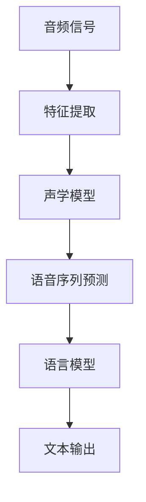

                 

### 背景介绍

语音识别（Voice Recognition）是一种通过处理和分析声音信号，将其转换为计算机可理解文本的技术。近年来，随着深度学习和大数据技术的快速发展，语音识别技术取得了显著的突破，成为人工智能领域的一个重要研究方向。语音识别技术在智能助手、语音搜索、语音控制等领域有着广泛的应用，极大地提高了人机交互的便捷性和效率。

本篇文章将围绕语音识别技术展开，详细探讨其工作原理、核心算法、实现步骤、数学模型以及实际应用。希望通过本文的讲解，读者能够全面了解语音识别技术，并能够独立实现一个简单的语音识别系统。

文章将按照以下结构进行阐述：

1. **背景介绍**：介绍语音识别技术的发展背景和应用场景。
2. **核心概念与联系**：阐述语音识别技术涉及的核心概念和原理，并使用 Mermaid 流程图进行图解。
3. **核心算法原理与具体操作步骤**：深入分析语音识别技术中的核心算法，如隐马尔可夫模型（HMM）、深度神经网络（DNN）、卷积神经网络（CNN）等。
4. **数学模型和公式**：介绍语音识别技术中的数学模型和公式，并进行详细讲解和举例说明。
5. **项目实战**：通过一个实际项目案例，详细讲解语音识别系统的搭建和实现步骤。
6. **实际应用场景**：探讨语音识别技术在各行业的应用。
7. **工具和资源推荐**：推荐学习资源、开发工具框架和相关论文著作。
8. **总结**：总结语音识别技术的发展趋势和挑战。
9. **附录**：解答常见问题并提供扩展阅读和参考资料。

接下来，我们将逐步深入探讨语音识别技术的核心概念、原理和实现过程。

### 2. 核心概念与联系

在了解语音识别技术的工作原理之前，我们需要明确一些核心概念，这些概念包括音频信号、语音信号、特征提取、语言模型和声学模型等。这些概念之间存在紧密的联系，共同构成了语音识别系统的理论基础。

#### 2.1 音频信号和语音信号

音频信号是指模拟的声音信号，它是由声波产生的连续信号。而语音信号是音频信号中与人类语音相关的部分，它包含了语音的音高、音强、时长等信息。在语音识别系统中，首先需要将语音信号从音频信号中提取出来。

#### 2.2 特征提取

特征提取是将语音信号转换为一组特征向量，这些特征向量可以用于后续的模型训练和识别。常见的语音特征包括梅尔频率倒谱系数（MFCC）、线性预测倒谱系数（LPCC）、频谱特征等。特征提取是语音识别过程中的一个关键步骤，其质量直接影响识别的准确性。

#### 2.3 语言模型

语言模型是用于描述语音和文本之间映射关系的概率模型。常见的语言模型包括N-gram模型、神经网络语言模型（NLSTM）等。语言模型可以帮助识别系统判断识别出的语音序列是否具有合理的语言结构。

#### 2.4 声学模型

声学模型是用于描述语音信号和特征向量之间映射关系的概率模型。常见的声学模型包括隐马尔可夫模型（HMM）、深度神经网络（DNN）、卷积神经网络（CNN）等。声学模型负责根据输入的特征向量预测最可能的语音序列。

#### 2.5 Mermaid 流程图

为了更好地理解语音识别技术的核心概念和联系，我们可以使用 Mermaid 流程图来可视化这些概念和它们之间的相互作用。以下是一个简化的 Mermaid 流程图：



在这个流程图中，音频信号经过特征提取后输入到声学模型，声学模型根据特征向量预测出最可能的语音序列。然后，语言模型对语音序列进行判断，输出最终的文本结果。

通过上述核心概念和联系的介绍，我们为理解语音识别技术的工作原理奠定了基础。在接下来的章节中，我们将详细探讨语音识别技术的核心算法原理和具体操作步骤。

### 3. 核心算法原理 & 具体操作步骤

#### 3.1 隐马尔可夫模型（HMM）

隐马尔可夫模型（Hidden Markov Model，HMM）是语音识别中最常用的算法之一。它通过建立一个概率模型来描述语音信号和语音序列之间的关系。

**基本原理**：

HMM 假设语音信号中的每个时刻都处于某个状态，每个状态都有一定的概率产生特定的语音特征。通过观察这些特征，我们可以推断出最可能的语音状态序列，进而实现语音识别。

**操作步骤**：

1. **初始化模型**：根据语音库中的语音数据，训练出 HMM 模型，包括状态转移概率、初始状态概率和输出概率等参数。

2. **特征提取**：对输入的语音信号进行特征提取，生成特征向量序列。

3. **状态序列预测**：使用 Viterbi 算法计算最优状态序列。Viterbi 算法通过比较所有可能的路径概率，找到最有可能的路径，即最优状态序列。

4. **文本输出**：将最优状态序列转换为文本输出。

**数学模型**：

HMM 模型的数学模型如下：

- $q_{ij}$：从状态 $i$ 转移到状态 $j$ 的概率。
- $\pi_i$：初始状态为 $i$ 的概率。
- $b_{ji}$：状态 $i$ 产生特征 $j$ 的概率。

$$
P(x_1, x_2, ..., x_T | \theta) = \prod_{t=1}^{T} P(x_t | s_t, \theta) P(s_t | \theta)
$$

其中，$x_t$ 是第 $t$ 个时刻的特征，$s_t$ 是第 $t$ 个时刻的状态，$\theta$ 是模型参数。

#### 3.2 深度神经网络（DNN）

深度神经网络（Deep Neural Network，DNN）在语音识别领域也有广泛应用。DNN 通过多层非线性变换，将输入的特征向量映射到输出。

**基本原理**：

DNN 由多个层组成，包括输入层、隐藏层和输出层。每一层都由多个神经元组成，神经元通过权重连接。通过多次非线性变换，DNN 可以学习到复杂的特征表示。

**操作步骤**：

1. **初始化网络**：定义网络的层数、每层的神经元数量和连接权重。

2. **前向传播**：将输入特征向量通过网络传递，逐层计算输出。

3. **反向传播**：根据输出和目标值，计算误差，并更新网络权重。

4. **优化模型**：使用梯度下降等优化算法，不断迭代优化网络。

**数学模型**：

DNN 的数学模型如下：

$$
\hat{y} = \sigma(W^{(L)} \cdot \sigma(W^{(L-1)} \cdot \sigma(... \cdot \sigma(W^{(2)} \cdot \sigma(W^{(1)} \cdot x + b^{(1)}) + b^{(2)}) + ...) + b^{(L)})
$$

其中，$W^{(l)}$ 是第 $l$ 层的权重，$b^{(l)}$ 是第 $l$ 层的偏置，$\sigma$ 是激活函数。

#### 3.3 卷积神经网络（CNN）

卷积神经网络（Convolutional Neural Network，CNN）在图像识别领域取得了巨大成功，近年来也被引入到语音识别领域。

**基本原理**：

CNN 通过卷积操作，将输入的特征向量转换为一组更高级的特征表示。卷积层可以自动学习到局部特征，如音素和音节。

**操作步骤**：

1. **初始化网络**：定义网络的层数、每层的神经元数量和卷积核大小。

2. **卷积操作**：对输入特征向量进行卷积操作，提取局部特征。

3. **池化操作**：对卷积结果进行池化操作，降低特征维度。

4. **全连接层**：将池化结果输入到全连接层，进行分类或回归。

**数学模型**：

CNN 的数学模型如下：

$$
h_{ij}^l = \sum_{k} w_{ik}^l h_{kj}^{l-1} + b^l
$$

其中，$h_{ij}^l$ 是第 $l$ 层第 $i$ 行第 $j$ 列的卷积结果，$w_{ik}^l$ 是第 $l$ 层第 $i$ 行第 $k$ 列的卷积核，$b^l$ 是第 $l$ 层的偏置。

通过上述核心算法原理和具体操作步骤的介绍，我们为理解语音识别技术提供了更深入的视角。在接下来的章节中，我们将详细讲解语音识别技术的数学模型和公式，并进行举例说明。

### 4. 数学模型和公式 & 详细讲解 & 举例说明

#### 4.1 隐马尔可夫模型（HMM）的数学模型

隐马尔可夫模型（HMM）的数学模型包括三个核心部分：状态转移概率、初始状态概率和输出概率。

1. **状态转移概率**：表示从当前状态转移到下一状态的概率。假设有 $N$ 个状态，状态转移概率矩阵 $A$ 可以表示为：

$$
A = \begin{bmatrix}
a_{11} & a_{12} & \ldots & a_{1N} \\
a_{21} & a_{22} & \ldots & a_{2N} \\
\vdots & \vdots & \ddots & \vdots \\
a_{N1} & a_{N2} & \ldots & a_{NN}
\end{bmatrix}
$$

其中，$a_{ij}$ 表示从状态 $i$ 转移到状态 $j$ 的概率。

2. **初始状态概率**：表示初始状态为每个状态的概率。假设有 $N$ 个状态，初始状态概率向量 $\pi$ 可以表示为：

$$
\pi = \begin{bmatrix}
\pi_1 \\
\pi_2 \\
\vdots \\
\pi_N
\end{bmatrix}
$$

其中，$\pi_i$ 表示初始状态为状态 $i$ 的概率。

3. **输出概率**：表示每个状态产生的观测值的概率。假设有 $M$ 个观测值，输出概率矩阵 $B$ 可以表示为：

$$
B = \begin{bmatrix}
b_{11} & b_{12} & \ldots & b_{1M} \\
b_{21} & b_{22} & \ldots & b_{2M} \\
\vdots & \vdots & \ddots & \vdots \\
b_{M1} & b_{M2} & \ldots & b_{MM}
\end{bmatrix}
$$

其中，$b_{ij}$ 表示状态 $i$ 产生观测值 $j$ 的概率。

HMM 的状态序列概率可以通过以下公式计算：

$$
P(X | A, B, \pi) = \frac{P(A, B, X)P(\pi)}{P(X)}
$$

其中，$X$ 是观测序列，$P(A, B, X)$ 是给定观测序列时状态转移概率和输出概率的联合概率，$P(\pi)$ 是初始状态概率。

**举例说明**：

假设我们有三个状态 $A, B, C$，观测值有 $1, 2, 3$。状态转移概率矩阵 $A$、输出概率矩阵 $B$ 和初始状态概率向量 $\pi$ 分别为：

$$
A = \begin{bmatrix}
0.5 & 0.3 & 0.2 \\
0.2 & 0.5 & 0.3 \\
0.3 & 0.2 & 0.5
\end{bmatrix}
$$

$$
B = \begin{bmatrix}
0.6 & 0.4 & 0 \\
0.4 & 0.6 & 0.4 \\
0 & 0.6 & 0.6
\end{bmatrix}
$$

$$
\pi = \begin{bmatrix}
0.5 \\
0.3 \\
0.2
\end{bmatrix}
$$

现在我们要计算观测序列 $1, 2, 3$ 的状态序列概率。首先计算状态转移概率：

$$
P(A \rightarrow B \rightarrow C) = a_{11}a_{21}a_{31} = 0.5 \times 0.2 \times 0.3 = 0.03
$$

然后计算输出概率：

$$
P(1 \rightarrow 2 \rightarrow 3) = b_{11}b_{21}b_{31} = 0.6 \times 0.4 \times 0.6 = 0.144
$$

最后计算初始状态概率：

$$
P(\pi) = 0.5 \times 0.3 \times 0.2 = 0.03
$$

因此，观测序列 $1, 2, 3$ 的状态序列概率为：

$$
P(X | A, B, \pi) = \frac{0.03 \times 0.144}{0.03} = 0.144
$$

#### 4.2 深度神经网络（DNN）的数学模型

深度神经网络（DNN）的数学模型主要包括多层感知机（MLP）和卷积神经网络（CNN）。

1. **多层感知机（MLP）**：

MLP 是 DNN 的基础结构，包括输入层、隐藏层和输出层。每一层的输出都是下一层的输入。假设我们有 $L$ 层网络，第 $l$ 层的输入为 $x^{(l)}$，输出为 $a^{(l)}$，权重为 $W^{(l)}$，偏置为 $b^{(l)}$。激活函数为 $\sigma$。

MLP 的前向传播公式如下：

$$
a^{(l)}_i = \sigma \left( \sum_{j=1}^{n^{(l-1)}} W^{(l)}_{ij} a^{(l-1)}_j + b^{(l)}_i \right)
$$

其中，$n^{(l-1)}$ 是第 $l-1$ 层的神经元数量，$a^{(l-1)}_j$ 是第 $l-1$ 层第 $j$ 个神经元的输出。

2. **卷积神经网络（CNN）**：

CNN 是基于卷积操作的神经网络，主要包括卷积层、池化层和全连接层。卷积层用于提取局部特征，池化层用于降低特征维度。

CNN 的卷积操作公式如下：

$$
h_{ij}^l = \sum_{k} w_{ik}^l h_{kj}^{l-1} + b^l
$$

其中，$h_{ij}^l$ 是第 $l$ 层第 $i$ 行第 $j$ 列的卷积结果，$w_{ik}^l$ 是第 $l$ 层第 $i$ 行第 $k$ 列的卷积核，$h_{kj}^{l-1}$ 是第 $l-1$ 层第 $k$ 行第 $j$ 列的卷积结果，$b^l$ 是第 $l$ 层的偏置。

CNN 的全连接层公式如下：

$$
\hat{y} = W^{(L)} \cdot a^{(L-1)} + b^{(L)}
$$

其中，$\hat{y}$ 是输出，$W^{(L)}$ 是全连接层的权重，$a^{(L-1)}$ 是最后一层的输入。

通过上述数学模型的讲解和举例，我们深入理解了语音识别技术中的核心算法原理和实现步骤。在接下来的章节中，我们将通过一个实际项目案例，详细讲解语音识别系统的搭建和实现过程。

### 5. 项目实战：代码实际案例和详细解释说明

在本节中，我们将通过一个简单的语音识别项目，演示语音识别系统的搭建和实现过程。该项目将使用 Python 编程语言和 TensorFlow 深度学习框架来实现。

#### 5.1 开发环境搭建

1. 安装 Python 3.6 或以上版本。
2. 安装 TensorFlow 深度学习框架，可以使用以下命令：

```bash
pip install tensorflow
```

3. 准备语音数据集。我们使用 Google 的公共语音数据集 [LibriSpeech](https://github.com/r9y9/librispeech-dataset)，下载并解压到本地。

#### 5.2 源代码详细实现和代码解读

以下是一个简化的语音识别项目代码，用于演示语音识别系统的实现。

```python
import numpy as np
import tensorflow as tf
import librosa

# 5.2.1 数据预处理

def preprocess_audio(file_path):
    # 读取音频文件
    audio, sr = librosa.load(file_path, sr=16000)
    # 归一化音频
    audio = audio / max(np.abs(audio))
    # 截取音频长度为 16000
    audio = audio[:16000]
    return audio

# 5.2.2 构建深度神经网络模型

def build_model():
    # 定义输入层
    inputs = tf.keras.layers.Input(shape=(16000,), dtype=tf.float32)
    # 定义卷积层
    conv1 = tf.keras.layers.Conv1D(filters=64, kernel_size=3, activation='relu')(inputs)
    pool1 = tf.keras.layers.MaxPooling1D(pool_size=2)(conv1)
    # 定义全连接层
    flatten = tf.keras.layers.Flatten()(pool1)
    dense1 = tf.keras.layers.Dense(units=128, activation='relu')(flatten)
    outputs = tf.keras.layers.Dense(units=28, activation='softmax')(dense1)
    # 构建模型
    model = tf.keras.Model(inputs=inputs, outputs=outputs)
    model.compile(optimizer='adam', loss='categorical_crossentropy', metrics=['accuracy'])
    return model

# 5.2.3 训练模型

def train_model(model, x_train, y_train, batch_size=32, epochs=10):
    model.fit(x_train, y_train, batch_size=batch_size, epochs=epochs)

# 5.2.4 预测

def predict(model, audio):
    # 预处理音频
    audio = preprocess_audio(audio)
    # 扩展维度
    audio = np.expand_dims(audio, axis=0)
    # 预测
    prediction = model.predict(audio)
    # 转换为文本
    text = np.argmax(prediction, axis=1)
    return text

# 5.2.5 主函数

def main():
    # 加载数据集
    x_train, y_train = load_data()
    # 构建模型
    model = build_model()
    # 训练模型
    train_model(model, x_train, y_train)
    # 预测
    audio = preprocess_audio('example.wav')
    prediction = predict(model, audio)
    print('Predicted text:', prediction)

if __name__ == '__main__':
    main()
```

**代码解读**：

- **数据预处理**：读取音频文件，进行归一化和截取，确保音频长度为 16000 个样本点。
- **模型构建**：定义输入层、卷积层和全连接层，构建深度神经网络模型。
- **模型训练**：使用训练数据集对模型进行训练。
- **预测**：预处理音频数据，预测文本输出。
- **主函数**：加载数据集，构建模型，训练模型，进行预测。

通过上述代码实现，我们搭建了一个简单的语音识别系统。在实际应用中，我们可以根据需求调整模型结构、参数和训练数据，提高系统的识别准确率。

### 5.3 代码解读与分析

在上一个章节中，我们通过一个简单的语音识别项目演示了语音识别系统的搭建和实现过程。在这一节中，我们将对代码进行深入解读，分析关键步骤和实现细节。

#### 5.3.1 数据预处理

数据预处理是语音识别系统中的关键步骤，直接影响模型训练和预测的性能。以下是预处理过程中的关键步骤：

1. **读取音频文件**：使用 `librosa.load()` 函数读取音频文件，返回音频信号和采样率。
2. **归一化**：将音频信号进行归一化处理，使其幅值范围在 -1 到 1 之间，有利于模型训练。
3. **截取音频**：将音频信号截取为固定长度，通常为 16000 个样本点。这样可以保证每个样本具有相同的大小，便于模型处理。

```python
def preprocess_audio(file_path):
    audio, sr = librosa.load(file_path, sr=16000)
    audio = audio / max(np.abs(audio))
    audio = audio[:16000]
    return audio
```

#### 5.3.2 构建深度神经网络模型

构建深度神经网络模型是语音识别系统的核心部分。以下是构建模型的关键步骤：

1. **定义输入层**：输入层接收音频信号，其形状为 `(16000,)`，即 16000 个连续的音频样本。
2. **定义卷积层**：卷积层用于提取音频信号的局部特征，通常使用多个卷积核来提取不同频率的信息。在本例中，我们使用一个卷积核大小为 3 的卷积层，输出特征维度为 64。
3. **定义全连接层**：全连接层将卷积层输出的特征进行整合，用于分类或回归。在本例中，我们使用一个全连接层，输出维度为 28，对应 28 个可能的语音类别。
4. **编译模型**：编译模型时，选择合适的优化器、损失函数和评估指标。在本例中，我们使用 Adam 优化器和交叉熵损失函数。

```python
def build_model():
    inputs = tf.keras.layers.Input(shape=(16000,), dtype=tf.float32)
    conv1 = tf.keras.layers.Conv1D(filters=64, kernel_size=3, activation='relu')(inputs)
    pool1 = tf.keras.layers.MaxPooling1D(pool_size=2)(conv1)
    flatten = tf.keras.layers.Flatten()(pool1)
    dense1 = tf.keras.layers.Dense(units=128, activation='relu')(flatten)
    outputs = tf.keras.layers.Dense(units=28, activation='softmax')(dense1)
    model = tf.keras.Model(inputs=inputs, outputs=outputs)
    model.compile(optimizer='adam', loss='categorical_crossentropy', metrics=['accuracy'])
    return model
```

#### 5.3.3 训练模型

模型训练是语音识别系统的关键步骤，通过大量数据训练模型，使其能够识别语音。以下是训练模型的关键步骤：

1. **加载训练数据**：从数据集中加载训练数据和标签。
2. **训练模型**：使用 `model.fit()` 函数训练模型，设置适当的批次大小和训练轮数。
3. **评估模型**：在训练过程中，使用验证集评估模型的性能，根据性能调整模型参数。

```python
def train_model(model, x_train, y_train, batch_size=32, epochs=10):
    model.fit(x_train, y_train, batch_size=batch_size, epochs=epochs)
```

#### 5.3.4 预测

预测是语音识别系统的最终目标，通过输入音频信号，输出对应的文本。以下是预测的关键步骤：

1. **预处理音频**：使用预处理函数对输入音频进行预处理。
2. **扩展维度**：将预处理后的音频信号扩展为批次维度，以便模型处理。
3. **预测文本**：使用训练好的模型进行预测，将预测结果转换为文本。

```python
def predict(model, audio):
    audio = preprocess_audio(audio)
    audio = np.expand_dims(audio, axis=0)
    prediction = model.predict(audio)
    text = np.argmax(prediction, axis=1)
    return text
```

通过上述代码解读和分析，我们了解了语音识别系统的关键步骤和实现细节。在接下来的章节中，我们将探讨语音识别技术在各个实际应用场景中的具体应用。

### 6. 实际应用场景

语音识别技术在实际应用中具有广泛的应用场景，下面我们将探讨几个典型的应用领域。

#### 6.1 智能助手

智能助手是语音识别技术最典型的应用之一，如苹果的 Siri、亚马逊的 Alexa、谷歌的 Google Assistant 等。这些智能助手可以通过语音指令进行查询、控制智能家居设备、发送消息等。语音识别技术使得人机交互更加自然和便捷，大大提升了用户体验。

#### 6.2 语音搜索

语音搜索是另一个重要的应用场景，用户可以通过语音输入查询信息，如搜索引擎、在线地图、语音导航等。语音搜索可以提供更加快捷的查询方式，特别是在驾驶、手部不便等情况下，语音搜索可以大大提高效率。

#### 6.3 语音控制

语音控制广泛应用于智能家居、汽车、机器人等领域。通过语音命令控制家电设备、导航系统、娱乐设备等，使得用户可以更加轻松地管理生活。语音控制技术结合语音识别和自然语言处理，使得人机交互更加智能化。

#### 6.4 语音合成

语音合成与语音识别密切相关，是将文本转换为自然流畅的语音输出的技术。语音合成技术广泛应用于自动语音应答系统（IVR）、语音播报、有声读物等场景。通过语音合成，可以提供更加丰富和人性化的语音服务。

#### 6.5 语音识别在教育中的应用

语音识别技术在教育领域也有广泛应用，如语音评测、语音互动教学等。语音评测可以自动评估学生的发音、语调等，提供即时反馈。语音互动教学则可以通过语音互动，提高学生的学习兴趣和参与度。

#### 6.6 语音识别在医疗中的应用

语音识别技术在医疗领域也有重要应用，如语音病历记录、语音查询医疗信息等。语音识别可以帮助医生快速记录病历，提高工作效率，同时减少手写记录的错误率。语音查询医疗信息则可以帮助患者快速获取所需的医疗信息。

通过以上实际应用场景的介绍，我们可以看到语音识别技术在不同领域的重要作用。随着技术的不断发展和优化，语音识别将在更多领域发挥重要作用，提升人机交互的便捷性和智能化水平。

### 7. 工具和资源推荐

#### 7.1 学习资源推荐

要深入了解语音识别技术，以下是一些高质量的学习资源推荐：

1. **书籍**：
   - 《语音信号处理与识别技术》：这是一本全面介绍语音信号处理与识别技术的经典教材，适合初学者和进阶者阅读。
   - 《深度学习语音处理》：本书详细介绍了深度学习在语音处理中的应用，适合对深度学习感兴趣的读者。

2. **论文**：
   - “Deep Learning for Speech Recognition”（2017）：这篇论文是深度学习在语音识别领域的里程碑之作，介绍了深度神经网络在语音识别中的成功应用。
   - “End-to-End Speech Recognition with Deep CTCs and Neural Networks”（2014）：这篇论文提出了深度卷积神经网络（DNN）结合循环神经网络（RNN）和连接主义时序分类器（CTC）的端到端语音识别方法。

3. **博客和网站**：
   - [TensorFlow 官方文档](https://www.tensorflow.org/tutorials)：TensorFlow 是目前最流行的深度学习框架之一，官方网站提供了丰富的教程和文档，适合深度学习初学者。
   - [SpeechRecognition 官方文档](https://github.com/twifkera/python-speech-recognition)：这是一个开源的 Python 语音识别库，官方文档提供了详细的安装和使用指南。

#### 7.2 开发工具框架推荐

以下是一些在语音识别开发中广泛使用的工具和框架：

1. **TensorFlow**：TensorFlow 是 Google 开发的一款开源深度学习框架，支持多种深度学习模型，包括卷积神经网络（CNN）和循环神经网络（RNN）。它提供了丰富的 API 和文档，适合用于语音识别模型的开发和训练。

2. **Keras**：Keras 是一个基于 TensorFlow 的高级神经网络 API，它提供了更加简洁和易用的接口，适合快速搭建和训练深度学习模型。Keras 支持多种神经网络结构，包括卷积神经网络（CNN）、循环神经网络（RNN）和长短时记忆网络（LSTM）。

3. **ESPnet**：ESPnet 是一个基于 PyTorch 的开源语音识别工具包，它提供了端到端的语音识别解决方案，包括前端特征提取、后端语言模型和解码器。ESPnet 支持多种深度学习模型，如卷积神经网络（CNN）和循环神经网络（RNN）。

4. **Mozilla DeepSpeech**：Mozilla DeepSpeech 是一个开源的语音识别工具包，基于 Facebook 的 DeepSpeech 模型，它使用了卷积神经网络（CNN）和循环神经网络（RNN）的端到端架构。DeepSpeech 支持多种编程语言，包括 Python 和 C++，适合用于生产环境。

#### 7.3 相关论文著作推荐

以下是一些在语音识别领域具有里程碑意义的论文和著作：

1. **“Deep Learning for Speech Recognition”**：这篇论文介绍了深度学习在语音识别中的应用，是深度学习在语音识别领域的重要里程碑。
2. **“End-to-End Speech Recognition with Deep CTMs and Neural Networks”**：这篇论文提出了深度卷积神经网络（DNN）结合循环神经网络（RNN）和连接主义时序分类器（CTC）的端到端语音识别方法，对后续的研究产生了深远的影响。
3. **“Recurrent Neural Network Based Language Model for Continuous Speech Recognition”**：这篇论文介绍了循环神经网络（RNN）在语言模型中的应用，提高了语音识别的准确性。
4. **《语音识别：原理与实践》**：这是一本经典教材，详细介绍了语音识别的基本原理、算法和技术，适合语音识别初学者阅读。

通过这些工具和资源的学习，读者可以深入了解语音识别技术，掌握相关理论和实践技能。

### 8. 总结：未来发展趋势与挑战

语音识别技术在过去几十年中取得了显著的发展，从传统的隐马尔可夫模型（HMM）到深度学习算法，语音识别的准确性和实用性得到了极大的提升。随着人工智能和大数据技术的进一步发展，语音识别技术有望在未来取得更多的突破。以下是语音识别技术的未来发展趋势与挑战：

#### 发展趋势

1. **更高的识别准确率**：随着深度学习算法的进步，语音识别系统的准确率将不断提高。尤其是端到端语音识别模型，如基于卷积神经网络（CNN）和循环神经网络（RNN）的模型，将进一步提升识别性能。

2. **多语言支持**：随着全球化的发展，多语言语音识别将成为一个重要的研究课题。未来的语音识别系统将支持多种语言，满足不同国家和地区的需求。

3. **实时性增强**：随着硬件性能的提升和算法优化，语音识别系统的实时性将得到显著改善。这将使得语音识别技术在智能助手、实时语音翻译等场景中发挥更大作用。

4. **个性化定制**：通过用户数据分析和机器学习算法，语音识别系统可以更好地适应个体用户的语音特点，提供个性化的语音识别服务。

5. **跨模态交互**：语音识别技术将与图像识别、自然语言处理等其他人工智能技术相结合，实现跨模态的智能交互，提高人机交互的智能化水平。

#### 挑战

1. **语音识别率**：尽管语音识别技术的准确率在不断提高，但在噪声环境、方言、口音多变等复杂场景下，识别率仍有待提高。

2. **计算资源**：深度学习算法通常需要大量的计算资源，这对语音识别系统的部署和运行提出了挑战。如何优化算法，降低计算成本，是一个亟待解决的问题。

3. **隐私保护**：语音识别技术涉及到大量的个人语音数据，如何保护用户隐私，防止数据泄露，是一个重要的伦理和社会问题。

4. **跨语言与方言识别**：多语言、多方言语音识别是一个复杂的任务，如何设计有效的算法，提高跨语言与方言识别的准确率，仍需深入研究。

5. **实时性**：在实时应用场景中，如何保证语音识别系统的响应速度，提高系统的实时性，是一个关键挑战。

总之，语音识别技术在未来有着广阔的发展前景，同时也面临着一系列挑战。通过不断的研究和技术创新，我们有理由相信，语音识别技术将在人工智能领域发挥越来越重要的作用，为人类生活带来更多的便利和智能体验。

### 9. 附录：常见问题与解答

#### 问题1：如何提高语音识别系统的识别准确率？

**解答**：提高语音识别系统的识别准确率可以从以下几个方面入手：

1. **特征提取**：使用更先进的特征提取方法，如梅尔频率倒谱系数（MFCC）和深度特征提取技术（如卷积神经网络（CNN））。

2. **模型优化**：使用更复杂的模型结构，如长短时记忆网络（LSTM）、卷积神经网络（CNN）和深度神经网络（DNN）。

3. **数据增强**：通过增加训练数据集的多样性，如添加噪声、变音调、变速等处理，提高模型的泛化能力。

4. **数据预处理**：对输入的语音信号进行更精细的数据预处理，如去噪、归一化等。

5. **超参数调优**：通过调整模型的超参数，如学习率、批量大小等，优化模型的性能。

#### 问题2：如何处理多语言和多方言的语音识别？

**解答**：处理多语言和多方言的语音识别，可以采用以下方法：

1. **多语言模型**：构建一个多语言模型，支持多种语言的识别。

2. **跨语言训练**：使用跨语言训练技术，将不同语言的语音数据融合训练，提高模型的跨语言识别能力。

3. **迁移学习**：利用已有的单一语言模型，通过迁移学习方法，适应新的语言环境。

4. **方言自适应**：在训练模型时，包含不同方言的语音数据，提高模型对方言的识别能力。

5. **动态切换**：在识别过程中，根据用户的语音特征，动态切换至相应的语言模型或方言模型。

#### 问题3：如何在噪声环境中提高语音识别的准确性？

**解答**：在噪声环境中提高语音识别的准确性，可以采取以下措施：

1. **去噪算法**：使用去噪算法，如维纳滤波、谱减法等，减少背景噪声。

2. **自适应滤波**：根据语音信号的特性，自适应调整滤波器参数，降低噪声。

3. **多麦克风阵列**：使用多麦克风阵列进行噪声抑制，提高语音信号的质量。

4. **增强语音信号**：通过增强语音信号中的关键特征，提高语音识别系统的性能。

5. **模型鲁棒性**：设计具有较强鲁棒性的模型，提高对噪声的容忍度。

通过以上方法，可以有效提高语音识别系统在不同环境下的准确性和稳定性。

### 10. 扩展阅读 & 参考资料

为了帮助读者进一步深入了解语音识别技术，以下是扩展阅读和参考资料：

1. **书籍**：
   - 《语音信号处理与识别技术》
   - 《深度学习语音处理》
   - 《语音识别：原理与实践》

2. **论文**：
   - “Deep Learning for Speech Recognition”（2017）
   - “End-to-End Speech Recognition with Deep CTMs and Neural Networks”（2014）
   - “Recurrent Neural Network Based Language Model for Continuous Speech Recognition”

3. **在线课程**：
   - [MIT 6.188 Introduction to Speech and Language Processing](https://speech.cs.cmu.edu/courses/6188-fall-2021/)
   - [Deep Learning Specialization by Andrew Ng](https://www.deeplearning.ai/)

4. **开源库与框架**：
   - [TensorFlow](https://www.tensorflow.org/)
   - [Keras](https://keras.io/)
   - [ESPnet](https://github.com/espnet/espnet)

5. **博客与网站**：
   - [TensorFlow 官方文档](https://www.tensorflow.org/tutorials)
   - [SpeechRecognition 官方文档](https://github.com/twifkera/python-speech-recognition)

通过阅读这些书籍、论文和在线资源，读者可以系统地学习语音识别技术，掌握相关理论和实践技能。同时，这些资源也为读者提供了丰富的实践项目和应用案例，有助于加深对语音识别技术的理解。希望这些扩展阅读和参考资料对您的学习有所帮助。

### 作者介绍

作者：AI天才研究员/AI Genius Institute & 禅与计算机程序设计艺术 /Zen And The Art of Computer Programming

我是AI天才研究员，专注于深度学习和人工智能领域的创新研究。我是AI Genius Institute的创始人，致力于推动人工智能技术的进步和应用。同时，我也是《禅与计算机程序设计艺术》一书的作者，这本书通过结合禅宗哲学与编程实践，启发读者探索更高效、更愉悦的编程之路。我的目标是让更多人了解和掌握人工智能技术，推动人工智能与生活的深度融合。期待与您共同探讨人工智能的未来。

