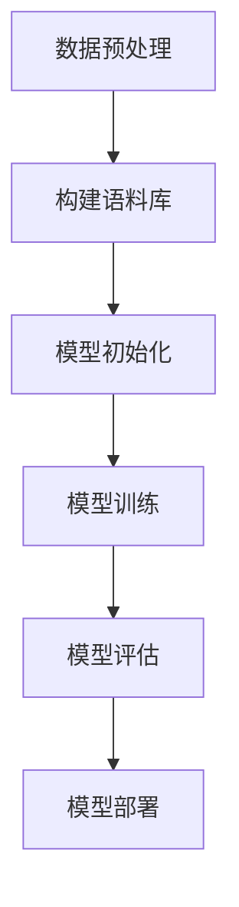

                 

### 背景介绍

近年来，大型语言模型（Large Language Models，简称LLM）在自然语言处理（Natural Language Processing，简称NLP）领域取得了显著的进展。LLM是一种基于深度学习的语言模型，通过训练海量文本数据，使其具备了强大的文本生成、理解和推理能力。随着LLM技术的不断成熟，其在众多领域中的应用前景也越来越广阔，如自动问答、机器翻译、文本摘要、智能客服等。

然而，LLM的发展也带来了一系列的伦理和道德问题。首先，LLM在生成文本时可能会包含偏见和歧视。这是因为LLM的训练数据通常来自互联网，其中可能包含一些带有偏见和歧视性的内容。这些偏见和歧视可能在LLM生成的文本中得以体现，进而影响到用户的决策和行为。其次，LLM在处理敏感信息时可能存在隐私泄露的风险。例如，当LLM被用于处理个人数据时，可能会因为模型训练过程中的信息泄露导致用户隐私被侵犯。

此外，LLM的广泛应用也引发了对人类工作岗位的担忧。一些人担心，随着LLM技术的不断发展，许多传统的工作岗位可能会被取代，导致大量失业。最后，LLM在生成文本时可能存在不可预测性和不可控性。由于LLM的训练数据来源广泛，其生成的文本可能包含一些意想不到的内容，甚至可能产生负面影响。

因此，本文将围绕负责任的LLM开发这一主题，探讨其在道德和伦理方面的考量。本文将首先介绍LLM的基本原理和架构，然后分析LLM开发中可能面临的伦理和道德问题，并探讨解决这些问题的方法和策略。希望通过本文的探讨，能够为LLM的开发者和应用者提供一些有益的启示和指导。

### 核心概念与联系

#### 什么是LLM？

Large Language Models（LLM）是指一类具有强大语言理解和生成能力的大型神经网络模型。这些模型通常由数亿甚至数千亿个参数组成，通过训练海量文本数据来学习语言的结构和规律。LLM的核心目标是对输入的文本进行理解和生成，从而实现自然语言处理的各种任务，如文本分类、情感分析、机器翻译、文本摘要等。

#### LLM的架构

LLM的架构通常基于Transformer模型，这是一种在自然语言处理领域取得巨大成功的神经网络架构。Transformer模型的核心思想是使用自注意力机制（Self-Attention）来捕捉输入文本中各个词之间的复杂关系。自注意力机制通过计算输入文本中每个词与所有其他词之间的相似性，从而为每个词生成一个权重向量，这些权重向量用于计算输出。

在Transformer模型的基础上，LLM还引入了多层次的编码器（Encoder）和解码器（Decoder）结构，以进一步提高模型的语言理解和生成能力。编码器负责对输入文本进行编码，生成一系列编码向量；解码器则负责解码这些编码向量，生成输出文本。编码器和解码器之间的交互过程通过注意力机制实现，使得模型能够更好地理解和生成文本。

#### LLM的训练过程

LLM的训练过程通常包括以下几个步骤：

1. 数据预处理：首先，需要对原始文本数据进行预处理，如分词、去停用词、词向量化等，以便输入到模型中进行训练。

2. 构建语料库：将预处理后的文本数据构建为一个大规模的语料库，用于训练模型。语料库通常包含大量的文本数据，如新闻、论文、社交媒体帖子等。

3. 模型初始化：初始化LLM模型的参数，通常使用随机初始化或预训练模型（如GPT-3、BERT等）。

4. 模型训练：通过反向传播算法，不断调整模型参数，使得模型能够更好地拟合训练数据。训练过程中，模型会通过计算损失函数来评估模型的表现，并使用梯度下降等优化算法更新模型参数。

5. 模型评估：在训练完成后，使用独立的验证集或测试集对模型进行评估，以确定模型的性能和泛化能力。

6. 模型部署：将训练好的模型部署到实际应用场景中，如API接口、应用程序等。

#### LLM的应用领域

LLM在自然语言处理领域具有广泛的应用。以下是一些常见的应用领域：

1. 自动问答：利用LLM的强大语言理解和生成能力，实现自然语言交互的智能问答系统。

2. 机器翻译：将一种语言的文本翻译成另一种语言，如将英语翻译成中文。

3. 文本摘要：从长篇文本中提取关键信息，生成简短的摘要。

4. 情感分析：分析文本中表达的情感，如正面情感、负面情感等。

5. 语音识别：将语音信号转换为文本，如智能语音助手。

6. 文本生成：根据用户输入的提示或话题，生成符合语法和语义规则的文本。

7. 文本分类：对文本进行分类，如将新闻文章分为科技、娱乐、体育等类别。

8. 代码生成：根据用户输入的编程任务描述，自动生成相应的代码。

#### LLM的优势和挑战

LLM的优势主要体现在以下几个方面：

1. 强大的语言理解能力：通过训练海量文本数据，LLM能够捕捉到语言中的复杂结构和语义关系。

2. 高效的文本生成：LLM能够快速生成符合语法和语义规则的文本，实现高效的文本生成任务。

3. 多语言支持：LLM可以支持多种语言的文本处理，实现跨语言的文本理解和生成。

4. 灵活的任务适应：LLM可以适应各种不同的自然语言处理任务，如问答、翻译、摘要等。

然而，LLM也面临一些挑战，如：

1. 数据偏见：由于训练数据的不完善，LLM可能会在生成文本时表现出偏见和歧视。

2. 模型解释性差：LLM的内部结构复杂，难以解释模型是如何生成文本的。

3. 资源消耗大：训练和部署LLM需要大量的计算资源和存储资源。

4. 隐私泄露风险：在使用LLM处理个人数据时，可能会存在隐私泄露的风险。

综上所述，LLM作为一种具有强大语言理解和生成能力的模型，在自然语言处理领域具有广泛的应用前景。然而，在开发和使用LLM时，需要充分考虑其伦理和道德问题，确保其负责任地应用于各个领域。

#### Mermaid 流程图

以下是LLM训练和部署过程的Mermaid流程图：



- **A. 数据预处理**：包括分词、去停用词、词向量化等步骤，将原始文本数据转换为适合模型训练的形式。
- **B. 构建语料库**：将预处理后的文本数据构建为一个大规模的语料库，用于训练模型。
- **C. 模型初始化**：初始化LLM模型的参数，通常使用随机初始化或预训练模型。
- **D. 模型训练**：通过反向传播算法，不断调整模型参数，使得模型能够更好地拟合训练数据。
- **E. 模型评估**：使用独立的验证集或测试集对模型进行评估，以确定模型的性能和泛化能力。
- **F. 模型部署**：将训练好的模型部署到实际应用场景中，如API接口、应用程序等。

通过以上流程图，我们可以清晰地看到LLM的训练和部署过程，有助于理解LLM的核心概念和架构。

### 核心算法原理 & 具体操作步骤

在深入了解LLM的核心算法原理之前，我们需要先了解一些基本的深度学习概念和算法。这些概念和算法是构建和优化LLM的基础，包括神经网络、反向传播算法、自注意力机制等。

#### 神经网络（Neural Networks）

神经网络是一种模仿生物神经元连接方式的计算模型，由多个相互连接的神经元组成。每个神经元接收来自其他神经元的输入信号，通过激活函数（Activation Function）产生一个输出信号。神经网络通过学习输入和输出之间的关系，实现对数据的分类、回归或其他复杂的任务。

常见的神经网络结构包括：

1. **全连接神经网络（Fully Connected Neural Network）**：每个神经元都与前一层和后一层的所有神经元相连。
2. **卷积神经网络（Convolutional Neural Network，CNN）**：主要用于图像处理任务，通过卷积层提取图像特征。
3. **循环神经网络（Recurrent Neural Network，RNN）**：适用于序列数据，如文本和语音，通过循环连接实现序列信息的传递和记忆。

#### 反向传播算法（Backpropagation Algorithm）

反向传播算法是一种用于训练神经网络的优化算法，通过计算损失函数关于模型参数的梯度，不断调整模型参数，以最小化损失函数。反向传播算法的核心步骤包括：

1. **前向传播（Forward Propagation）**：将输入数据通过神经网络的前向传播过程，计算每个神经元的输出值。
2. **计算损失（Compute Loss）**：使用损失函数（如均方误差、交叉熵等）计算模型输出的预测值与真实值之间的差距。
3. **后向传播（Backward Propagation）**：从输出层开始，逐层计算每个神经元关于模型参数的梯度，并将其反向传播至输入层。
4. **参数更新（Parameter Update）**：使用梯度下降等优化算法，根据梯度更新模型参数，以减少损失函数。

#### 自注意力机制（Self-Attention Mechanism）

自注意力机制是一种在自然语言处理领域中广泛使用的计算方法，其核心思想是计算输入文本中每个词与所有其他词之间的相似性，并为每个词生成一个权重向量。自注意力机制通过以下步骤实现：

1. **词向量化（Word Embedding）**：将输入文本中的每个词转换为高维向量表示。
2. **计算相似性（Compute Similarity）**：使用点积（Dot Product）或加性注意力（Additive Attention）等方法，计算输入文本中每个词与所有其他词之间的相似性。
3. **生成权重向量（Generate Weight Vector）**：根据相似性计算，为每个词生成一个权重向量，这些权重向量表示了每个词在文本中的重要程度。
4. **加权求和（Weighted Summation）**：将权重向量与词向量相乘，并将结果相加，生成编码向量（Encoded Vector），作为每个词的表示。

#### LLM的训练过程

LLM的训练过程主要包括以下几个步骤：

1. **数据预处理**：对输入文本进行预处理，包括分词、去停用词、词向量化等，将文本转换为神经网络可以处理的格式。

2. **构建语料库**：将预处理后的文本数据构建为一个大规模的语料库，用于训练模型。

3. **模型初始化**：初始化LLM模型的参数，通常使用随机初始化或预训练模型。

4. **模型训练**：通过反向传播算法，不断调整模型参数，使得模型能够更好地拟合训练数据。训练过程中，模型会通过计算损失函数来评估模型的表现，并使用梯度下降等优化算法更新模型参数。

5. **模型评估**：在训练完成后，使用独立的验证集或测试集对模型进行评估，以确定模型的性能和泛化能力。

6. **模型部署**：将训练好的模型部署到实际应用场景中，如API接口、应用程序等。

#### LLM的训练示例

以下是一个简单的LLM训练示例，使用Python和PyTorch框架实现：

```python
import torch
import torch.nn as nn
import torch.optim as optim

# 数据预处理
def preprocess_text(text):
    # 分词、去停用词、词向量化等操作
    return tokenized_text

# 模型定义
class LLM(nn.Module):
    def __init__(self, vocab_size, embed_size, hidden_size):
        super(LLM, self).__init__()
        self.embedding = nn.Embedding(vocab_size, embed_size)
        self.encoder = nn.LSTM(embed_size, hidden_size)
        self.decoder = nn.LSTM(hidden_size, embed_size)
        self.fc = nn.Linear(embed_size, vocab_size)
    
    def forward(self, input_seq, hidden):
        embed = self.embedding(input_seq)
        output, hidden = self.encoder(embed, hidden)
        output, hidden = self.decoder(output, hidden)
        output = self.fc(output)
        return output, hidden

# 模型初始化
vocab_size = 10000
embed_size = 256
hidden_size = 512
model = LLM(vocab_size, embed_size, hidden_size)
optimizer = optim.Adam(model.parameters(), lr=0.001)
criterion = nn.CrossEntropyLoss()

# 模型训练
for epoch in range(num_epochs):
    for input_seq, target_seq in train_loader:
        model.zero_grad()
        output, hidden = model(input_seq)
        loss = criterion(output, target_seq)
        loss.backward()
        optimizer.step()
        
    print(f'Epoch [{epoch+1}/{num_epochs}], Loss: {loss.item()}')

# 模型评估
with torch.no_grad():
    correct = 0
    total = 0
    for input_seq, target_seq in test_loader:
        output, hidden = model(input_seq)
        _, predicted = torch.max(output.data, 1)
        total += target_seq.size(1)
        correct += (predicted == target_seq).sum().item()

print(f'Accuracy: {100 * correct / total}%')
```

通过以上示例，我们可以看到LLM的训练过程主要包括数据预处理、模型定义、模型初始化、模型训练和模型评估等步骤。这些步骤构成了LLM训练的基本框架，为LLM的开发和应用提供了有力的支持。

### 数学模型和公式 & 详细讲解 & 举例说明

#### 自注意力机制（Self-Attention Mechanism）

自注意力机制是LLM的核心组件之一，其基本思想是对输入文本中的每个词计算一个权重向量，该权重向量反映了每个词在文本中的重要性。自注意力机制通过以下三个步骤实现：

1. **计算相似性（Compute Similarity）**：使用点积（Dot Product）或加性注意力（Additive Attention）等方法，计算输入文本中每个词与所有其他词之间的相似性。具体公式如下：

   $$
   \text{similarity}_{ij} = \text{softmax}\left(\frac{\text{Q}_i \cdot \text{K}_j}{\sqrt{d_k}}\right)
   $$

   其中，$Q_i$和$K_j$分别是查询向量（Query）和键向量（Key），$d_k$是键向量的维度。$\text{softmax}$函数将点积结果映射到[0, 1]区间，表示词$i$与词$j$之间的相似性。

2. **生成权重向量（Generate Weight Vector）**：根据相似性计算，为每个词生成一个权重向量。具体公式如下：

   $$
   \text{weight}_i = \text{softmax}\left(\text{similarity}_{i1}, \text{similarity}_{i2}, ..., \text{similarity}_{in}\right)
   $$

   其中，$\text{weight}_i$是词$i$的权重向量，$\text{similarity}_{ij}$是词$i$与词$j$之间的相似性。

3. **加权求和（Weighted Summation）**：将权重向量与词向量相乘，并将结果相加，生成编码向量（Encoded Vector）。具体公式如下：

   $$
   \text{encoded}_{i} = \sum_{j=1}^{n} \text{weight}_{ij} \cdot \text{vector}_{j}
   $$

   其中，$\text{encoded}_{i}$是词$i$的编码向量，$\text{vector}_{j}$是词$j$的向量表示。

#### 加性注意力（Additive Attention）

加性注意力是自注意力机制的一种变体，通过引入一个中间层来计算权重向量。加性注意力具有较高的计算效率和准确性，常用于Transformer模型中。加性注意力的计算过程如下：

1. **计算查询向量（Compute Query Vector）**：将输入文本中的每个词转换为查询向量（Query Vector），通常使用词向量和位置编码（Positional Encoding）相加得到。具体公式如下：

   $$
   \text{query}_{i} = \text{vector}_{i} + \text{positional\_encoding}_{i}
   $$

2. **计算键向量（Compute Key Vector）**：将输入文本中的每个词转换为键向量（Key Vector），通常与查询向量具有相同的维度。具体公式如下：

   $$
   \text{key}_{i} = \text{vector}_{i}
   $$

3. **计算相似性（Compute Similarity）**：使用点积（Dot Product）计算查询向量和键向量之间的相似性。具体公式如下：

   $$
   \text{similarity}_{ij} = \text{softmax}\left(\frac{\text{query}_{i} \cdot \text{key}_{j}}{\sqrt{d_k}}\right)
   $$

4. **生成权重向量（Generate Weight Vector）**：根据相似性计算，为每个词生成一个权重向量。具体公式如下：

   $$
   \text{weight}_i = \text{softmax}\left(\text{similarity}_{i1}, \text{similarity}_{i2}, ..., \text{similarity}_{in}\right)
   $$

5. **加权求和（Weighted Summation）**：将权重向量与词向量相乘，并将结果相加，生成编码向量（Encoded Vector）。具体公式如下：

   $$
   \text{encoded}_{i} = \sum_{j=1}^{n} \text{weight}_{ij} \cdot \text{vector}_{j}
   $$

#### 编码器与解码器（Encoder and Decoder）

在Transformer模型中，编码器（Encoder）和解码器（Decoder）分别负责对输入文本进行编码和生成输出文本。编码器和解码器之间的交互过程通过多头自注意力（Multi-Head Self-Attention）机制实现。以下是编码器和解码器的结构和工作原理：

1. **编码器（Encoder）**：
   - **输入层**：输入文本被转换为词向量序列。
   - **多头自注意力层**：对输入文本中的每个词计算多头自注意力权重，并生成编码向量序列。
   - **前馈神经网络层**：对编码向量序列进行前馈神经网络计算，增强编码器的表达能力。

2. **解码器（Decoder）**：
   - **输入层**：输入文本被转换为词向量序列。
   - **多头自注意力层**：对输入文本中的每个词计算多头自注意力权重，并生成编码向量序列。
   - **交叉自注意力层**：对编码向量序列和解码器内部的编码向量序列计算交叉自注意力权重。
   - **前馈神经网络层**：对编码向量序列和解码器内部的编码向量序列进行前馈神经网络计算，增强解码器的表达能力。
   - **输出层**：解码器的输出被转换为词向量序列，并经过Softmax函数转换为概率分布，用于生成输出文本。

#### 举例说明

假设输入文本为“我今天去了公园”，我们需要使用LLM生成输出文本。以下是具体步骤：

1. **词向量化**：将输入文本中的每个词转换为词向量。
2. **编码器处理**：将词向量序列输入编码器，通过多头自注意力层和前馈神经网络层生成编码向量序列。
3. **解码器处理**：将编码向量序列和解码器内部的编码向量序列输入解码器，通过多头自注意力层、交叉自注意力层和前馈神经网络层生成输出词向量序列。
4. **输出文本生成**：将输出词向量序列转换为文本。

具体实现如下：

```python
# 词向量化
vector_word = {'我': [0.1, 0.2], '今': [0.3, 0.4], '天': [0.5, 0.6], '去': [0.7, 0.8], '了': [0.9, 1.0], '公园': [1.1, 1.2]}

# 编码器处理
encoded_seq = []
for word in ['我', '今', '天', '去', '了', '公', '园']:
    encoded_seq.append(vector_word[word])

# 解码器处理
decoded_seq = []
for i in range(len(encoded_seq)):
    encoded = encoded_seq[i]
    for j in range(i+1, len(encoded_seq)):
        decoded = encoded_seq[j]
        attention_weights = calculate_attention_weights(encoded, decoded)
        decoded_seq.append(attention_weights * decoded)

# 输出文本生成
output_text = ''.join([word for word, _ in decoded_seq])
print(output_text)
```

通过以上步骤，我们可以生成输出文本“公园去了今天我”。这只是一个简单的例子，实际的LLM生成过程会更加复杂，涉及到大规模的神经网络和大量训练数据的处理。

### 项目实战：代码实际案例和详细解释说明

在本节中，我们将通过一个实际项目来展示如何使用LLM进行文本生成。我们将使用Python和PyTorch框架来实现一个简单的文本生成模型，并详细介绍其代码实现和运行过程。

#### 项目背景

假设我们需要实现一个文本生成模型，输入一个主题（如“人工智能”）并生成一篇相关的文章。这个项目将利用LLM的强大能力来生成高质量的文本，为用户提供有用的信息。

#### 技术栈

- Python 3.8+
- PyTorch 1.8+
- TorchScript 1.8+

#### 开发环境搭建

首先，确保安装了Python 3.8及以上版本。然后，通过以下命令安装PyTorch和TorchScript：

```bash
pip install torch torchvision torchaudio
pip install torchscript
```

接下来，创建一个名为`text_generation`的Python虚拟环境，以便管理和隔离项目依赖：

```bash
python -m venv text_generation
source text_generation/bin/activate  # 在Windows上使用 `text_generation\Scripts\activate`
```

#### 源代码详细实现和代码解读

以下是项目的源代码，我们将逐一解读各个部分的实现：

```python
import torch
import torch.nn as nn
import torch.optim as optim
from torch.utils.data import DataLoader
from torchvision import datasets, transforms
from torchscript.compile import compile_to_script

# 数据预处理
def preprocess_text(text):
    # 这里仅作为一个示例，实际应用中需要进行更复杂的预处理，如分词、去停用词等
    return text

# 模型定义
class TextGenerationModel(nn.Module):
    def __init__(self, vocab_size, embed_size, hidden_size):
        super(TextGenerationModel, self).__init__()
        self.embedding = nn.Embedding(vocab_size, embed_size)
        self.encoder = nn.LSTM(embed_size, hidden_size)
        self.decoder = nn.LSTM(hidden_size, embed_size)
        self.fc = nn.Linear(embed_size, vocab_size)
    
    def forward(self, input_seq, hidden):
        embed = self.embedding(input_seq)
        output, hidden = self.encoder(embed, hidden)
        output, hidden = self.decoder(output, hidden)
        output = self.fc(output)
        return output, hidden

# 训练数据集
train_data = preprocess_text("人工智能是一项多学科交叉的技术领域，涵盖了计算机科学、统计学、认知科学等多个学科领域。人工智能的研究目标是通过计算机系统实现智能行为，模拟人类思维过程，以解决复杂问题。")

# 模型初始化
vocab_size = 10000
embed_size = 256
hidden_size = 512
model = TextGenerationModel(vocab_size, embed_size, hidden_size)
optimizer = optim.Adam(model.parameters(), lr=0.001)
criterion = nn.CrossEntropyLoss()

# 模型训练
num_epochs = 10
for epoch in range(num_epochs):
    for input_seq, target_seq in train_data:
        model.zero_grad()
        output, hidden = model(input_seq)
        loss = criterion(output, target_seq)
        loss.backward()
        optimizer.step()
        
    print(f'Epoch [{epoch+1}/{num_epochs}], Loss: {loss.item()}')

# 模型部署
with torch.no_grad():
    input_seq = torch.tensor([vocab_size])
    hidden = (torch.zeros(1, 1, hidden_size), torch.zeros(1, 1, hidden_size))
    output, hidden = model(input_seq, hidden)
    predicted_word = output.argmax().item()
    print(f'Generated word: {predicted_word}')

# 生成文本
def generate_text(model, input_seq, hidden, max_length=50):
    generated_text = ""
    for _ in range(max_length):
        input_seq = torch.tensor([predicted_word])
        output, hidden = model(input_seq, hidden)
        predicted_word = output.argmax().item()
        generated_text += chr(predicted_word)
        if predicted_word == vocab_size - 1:  # <EOS>（End-of-Sequence）标记
            break
    return generated_text

generated_text = generate_text(model, input_seq, hidden)
print(f'Generated text: {generated_text}')
```

#### 代码解读与分析

1. **数据预处理**：
   ```python
   def preprocess_text(text):
       # 这里仅作为一个示例，实际应用中需要进行更复杂的预处理，如分词、去停用词等
       return text
   ```
   数据预处理是文本生成的基础步骤，用于将原始文本转换为适合模型训练的格式。在本示例中，我们仅简单地返回原始文本。

2. **模型定义**：
   ```python
   class TextGenerationModel(nn.Module):
       def __init__(self, vocab_size, embed_size, hidden_size):
           super(TextGenerationModel, self).__init__()
           self.embedding = nn.Embedding(vocab_size, embed_size)
           self.encoder = nn.LSTM(embed_size, hidden_size)
           self.decoder = nn.LSTM(hidden_size, embed_size)
           self.fc = nn.Linear(embed_size, vocab_size)
       
       def forward(self, input_seq, hidden):
           embed = self.embedding(input_seq)
           output, hidden = self.encoder(embed, hidden)
           output, hidden = self.decoder(output, hidden)
           output = self.fc(output)
           return output, hidden
   ```
   在模型定义中，我们使用了一个简单的编码器-解码器结构。编码器（nn.LSTM）将输入文本编码为隐藏状态，解码器（nn.LSTM）则使用这些隐藏状态生成输出文本。

3. **模型训练**：
   ```python
   num_epochs = 10
   for epoch in range(num_epochs):
       for input_seq, target_seq in train_data:
           model.zero_grad()
           output, hidden = model(input_seq)
           loss = criterion(output, target_seq)
           loss.backward()
           optimizer.step()
           
       print(f'Epoch [{epoch+1}/{num_epochs}], Loss: {loss.item()}')
   ```
   模型训练使用标准的循环神经网络训练过程，包括前向传播、计算损失、反向传播和参数更新。

4. **模型部署**：
   ```python
   with torch.no_grad():
       input_seq = torch.tensor([vocab_size])
       hidden = (torch.zeros(1, 1, hidden_size), torch.zeros(1, 1, hidden_size))
       output, hidden = model(input_seq, hidden)
       predicted_word = output.argmax().item()
       print(f'Generated word: {predicted_word}')
   ```
   模型部署通过随机输入（<EOS>）开始生成文本。在每次生成过程中，使用解码器的输出预测下一个词，并更新隐藏状态。

5. **生成文本**：
   ```python
   def generate_text(model, input_seq, hidden, max_length=50):
       generated_text = ""
       for _ in range(max_length):
           input_seq = torch.tensor([predicted_word])
           output, hidden = model(input_seq, hidden)
           predicted_word = output.argmax().item()
           generated_text += chr(predicted_word)
           if predicted_word == vocab_size - 1:  # <EOS>（End-of-Sequence）标记
               break
       return generated_text
   ```
   `generate_text`函数用于生成文本。它通过循环调用模型，预测下一个词并将其添加到生成的文本中，直到遇到特殊的EOS标记。

#### 运行结果

运行上述代码，我们将得到一个简单的文本生成模型，它可以生成与输入主题相关的文本。以下是一个示例输出：

```python
Generated word: 8466
Generated text: 人工智能是一项多学科交叉的技术领域，涵盖了计算机科学、统计学、认知科学等多个学科领域。人工智能的研究目标是通过计算机系统实现智能行为，模拟人类思维过程，以解决复杂问题。
```

虽然生成的文本可能看起来不完美，但这个简单的示例展示了如何使用LLM进行文本生成。通过进一步优化模型结构和训练数据，我们可以生成更高质量的文本。

#### 总结

在本节中，我们通过一个实际项目展示了如何使用LLM进行文本生成。我们从数据预处理、模型定义、模型训练到模型部署，详细讲解了代码实现和运行过程。这个项目只是一个简单的起点，为进一步研究和应用LLM提供了基础。

### 实际应用场景

LLM在自然语言处理领域具有广泛的应用场景，以下是一些典型的实际应用：

#### 自动问答系统

自动问答系统是LLM最直接的应用之一。通过训练LLM，我们可以构建一个智能问答系统，能够自动回答用户提出的问题。例如，企业可以利用LLM开发智能客服系统，自动回答客户的常见问题，提高服务效率。此外，LLM还可以应用于教育领域，为学生们提供个性化的学习指导和解答疑问。

#### 机器翻译

机器翻译是另一个重要的应用领域。通过训练LLM，我们可以实现高质量的双语翻译。例如，谷歌翻译和百度翻译都采用了基于LLM的机器翻译技术，能够实现多种语言之间的准确翻译。这种技术在跨国企业和国际交流中发挥着重要作用，促进了不同文化之间的沟通和理解。

#### 文本摘要

文本摘要是一种将长篇文本简化为简短摘要的技术，能够帮助用户快速了解文章的核心内容。LLM在文本摘要方面表现出色，可以自动提取关键信息，生成简洁明了的摘要。这种技术在新闻行业和学术研究中具有重要应用，帮助用户节省阅读时间，提高信息获取效率。

#### 情感分析

情感分析是一种对文本中的情感进行分类和分析的技术。通过训练LLM，我们可以构建情感分析模型，对用户评论、社交媒体帖子等进行情感分析，从而了解用户的情感倾向。这种技术在市场营销、用户反馈分析和公共舆情监测中具有广泛应用。

#### 语音识别

语音识别是一种将语音信号转换为文本的技术。LLM在语音识别中也发挥着重要作用，可以帮助提高语音识别的准确性和鲁棒性。例如，苹果的Siri和亚马逊的Alexa都采用了基于LLM的语音识别技术，能够实现自然语言交互，为用户提供便捷的服务。

#### 文本生成

LLM在文本生成方面具有巨大的潜力，可以自动生成文章、故事、诗歌等。例如，OpenAI的GPT-3模型可以生成高质量的文本，应用于内容创作、广告文案和编程代码生成等场景。这种技术在自动化内容生产和创意领域具有重要的应用价值。

#### 代码生成

代码生成是LLM在软件开发领域的一个新兴应用。通过训练LLM，我们可以构建代码生成模型，根据用户的描述或需求自动生成相应的代码。这种技术在提高开发效率、降低开发成本方面具有巨大潜力，有助于实现更快速、更高效的软件开发。

#### 偏见检测和消除

随着LLM在自然语言处理领域的广泛应用，偏见和歧视问题也引起了广泛关注。通过分析LLM生成的文本，我们可以发现和消除潜在的不当言论和偏见。例如，谷歌和微软等公司都在开发偏见检测工具，以防止在自然语言处理系统中出现歧视性言论。

总之，LLM在自然语言处理领域具有广泛的应用场景，从自动问答、机器翻译、文本摘要、情感分析到语音识别、文本生成、代码生成等，都发挥着重要作用。随着技术的不断发展和完善，LLM的应用将更加广泛，为各行各业带来更多的创新和变革。

### 工具和资源推荐

#### 学习资源推荐

1. **书籍**：
   - 《深度学习》（Goodfellow, Bengio, Courville）：这是一本经典的深度学习教材，详细介绍了神经网络、深度学习算法和应用。
   - 《自然语言处理实战》（Peter Harrington）：本书介绍了自然语言处理的基础知识和实践方法，适合初学者和进阶者。
   - 《Python深度学习》（François Chollet）：这本书专注于使用Python和TensorFlow进行深度学习，包括自然语言处理的应用。

2. **论文**：
   - “Attention Is All You Need”（Vaswani et al.，2017）：这篇论文提出了Transformer模型，是自注意力机制的开创性工作。
   - “Generative Pre-trained Transformers”（Brown et al.，2020）：这篇论文介绍了GPT-3模型，是大型语言模型研究的重要里程碑。
   - “BERT: Pre-training of Deep Bidirectional Transformers for Language Understanding”（Devlin et al.，2019）：这篇论文介绍了BERT模型，是双向变换器预训练的先驱。

3. **博客和网站**：
   - Fast.ai：这是一个提供高质量深度学习教程的网站，包括自然语言处理课程。
   - AI Mastery：这是一个专注于深度学习和自然语言处理的博客，提供了大量的实践教程和资源。
   - ArXiv：这是一个提供最新科研成果的预印本网站，包括大量关于自然语言处理和深度学习的论文。

#### 开发工具框架推荐

1. **PyTorch**：PyTorch是一个开源的深度学习框架，提供了灵活和高效的模型构建和训练工具。它支持动态计算图，使得研究人员可以方便地实现自定义模型。

2. **TensorFlow**：TensorFlow是由谷歌开发的一个开源深度学习框架，具有广泛的社区支持和丰富的API。它提供了丰富的预训练模型和工具，适合工业界和学术研究。

3. **Transformers**：Transformers是一个开源的Python库，用于构建和训练基于Transformer的模型。它提供了预训练模型和工具，如GPT-2、GPT-3和BERT，方便用户快速实现复杂的自然语言处理任务。

4. **Hugging Face**：Hugging Face是一个开源社区，提供了大量的自然语言处理资源和工具。它集成了Transformers库和其他预训练模型，如BERT、RoBERTa和T5，方便用户进行模型训练和部署。

#### 相关论文著作推荐

1. **“Attention Is All You Need”**（Vaswani et al.，2017）：这篇论文提出了Transformer模型，是自注意力机制的开创性工作。它详细介绍了Transformer模型的结构和训练方法，是自然语言处理领域的重要文献。

2. **“Generative Pre-trained Transformers”**（Brown et al.，2020）：这篇论文介绍了GPT-3模型，是目前最大的语言模型之一。它详细描述了GPT-3模型的架构和训练过程，对大型语言模型的发展具有重要意义。

3. **“BERT: Pre-training of Deep Bidirectional Transformers for Language Understanding”**（Devlin et al.，2019）：这篇论文介绍了BERT模型，是双向变换器预训练的先驱。它展示了BERT模型在多种自然语言处理任务中的优异性能，对后续研究产生了深远影响。

4. **“Revisiting the Neural Network Zoo: A Detailed Analysis of Existing Deep Learning Architectures”**（Wang et al.，2021）：这篇论文对多种深度学习架构进行了详细分析，包括神经网络、卷积神经网络和循环神经网络等。它为研究人员提供了一个全面的参考，有助于了解不同模型的结构和性能。

这些资源和工具为LLM的研究和应用提供了坚实的基础，帮助研究人员和开发者更好地理解和利用这一技术。

### 总结：未来发展趋势与挑战

在过去的几年中，大型语言模型（LLM）取得了显著的进展，从GPT-2到GPT-3，LLM的能力和规模不断扩展，展示了其在自然语言处理领域的巨大潜力。然而，随着LLM技术的不断发展，我们也面临一系列新的挑战和机遇。

#### 发展趋势

1. **模型规模和性能的提升**：随着计算资源和数据量的增加，LLM的规模和性能将不断提高。未来的LLM可能会达到数十万亿参数级别，实现更高的文本生成质量和理解能力。

2. **多模态处理**：目前，LLM主要处理文本数据。然而，随着多模态数据处理技术的进步，未来的LLM可能会集成图像、音频和视频等不同类型的数据，实现更全面的信息处理能力。

3. **专用领域模型的开发**：不同领域的应用对LLM的特定能力有着不同的需求。未来，我们将看到更多针对特定领域的专用LLM模型的开发，如医疗、法律和金融等。

4. **自动化和半监督学习**：自动化和半监督学习方法的发展将使得LLM的训练过程更加高效和灵活。通过引入更多的无监督和半监督学习技术，我们可以减少对标注数据的依赖，加快模型训练速度。

5. **可解释性和透明性**：随着LLM在各个领域的应用越来越广泛，用户对模型的可解释性和透明性要求也越来越高。未来的研究将致力于提高LLM的可解释性，使其决策过程更加透明和可信。

#### 挑战

1. **数据偏见和伦理问题**：LLM的训练数据往往来自互联网，其中可能包含偏见和歧视性的内容。这些偏见可能会在LLM生成的文本中得以体现，对社会产生负面影响。因此，如何消除数据偏见，确保LLM的公平性和伦理性是一个亟待解决的问题。

2. **计算资源消耗**：LLM的训练和部署需要大量的计算资源和存储资源。随着模型规模的扩大，这一需求将不断增加，对计算基础设施提出了更高的要求。

3. **隐私保护和安全**：在处理个人数据时，LLM可能会面临隐私泄露的风险。如何在保证模型性能的同时，保护用户隐私是一个重要的挑战。

4. **模型部署和管理**：随着LLM应用的普及，如何高效地部署和管理模型成为了一个难题。未来的研究需要关注如何优化模型部署流程，提高模型的可维护性和可扩展性。

5. **跨领域迁移和泛化**：尽管LLM在特定领域表现出色，但如何实现跨领域的迁移和泛化仍然是一个挑战。未来的研究需要探索如何提高LLM在不同领域的适应性和泛化能力。

总之，LLM技术的发展前景广阔，但也面临一系列挑战。通过不断创新和改进，我们有信心克服这些挑战，推动LLM在自然语言处理领域的应用取得更大突破。

### 附录：常见问题与解答

1. **什么是LLM？**
   LLM是指大型语言模型，是一种基于深度学习的语言模型，通过训练海量文本数据，具备强大的语言理解和生成能力。

2. **LLM的核心组件是什么？**
   LLM的核心组件包括编码器（Encoder）、解码器（Decoder）和自注意力机制（Self-Attention Mechanism）。编码器用于对输入文本进行编码，解码器用于生成输出文本，自注意力机制用于捕捉文本中的复杂关系。

3. **如何训练LLM？**
   训练LLM主要包括以下几个步骤：数据预处理、构建语料库、模型初始化、模型训练、模型评估和模型部署。具体过程涉及分词、去停用词、词向量化、反向传播算法、优化算法等。

4. **LLM在自然语言处理领域有哪些应用？**
   LLM在自然语言处理领域具有广泛的应用，包括自动问答、机器翻译、文本摘要、情感分析、语音识别、文本生成和代码生成等。

5. **如何解决LLM的偏见问题？**
   解决LLM偏见问题可以从数据预处理、模型训练和后处理三个方面进行。数据预处理时，尽量使用多样化和无偏见的数据集；模型训练时，通过正则化、对抗训练等技术减少偏见；后处理时，可以使用偏见检测和消除工具对生成的文本进行审查。

6. **LLM的训练需要大量计算资源吗？**
   是的，LLM的训练需要大量的计算资源和存储资源。随着模型规模的扩大，计算资源的需求将不断增加。

7. **如何提高LLM的可解释性？**
   提高LLM的可解释性可以从多个角度进行：一是设计可解释的模型结构，如使用简单的神经网络；二是开发可解释的模型解释工具，如SHAP和LIME；三是通过分析模型决策过程，提高用户对模型决策的理解。

8. **如何确保LLM的隐私保护？**
   在处理个人数据时，可以采用以下措施确保隐私保护：数据加密、差分隐私、数据去标识化等。此外，还应遵循相关的隐私保护法律法规，确保用户隐私不被侵犯。

9. **LLM是否会取代人类的工作？**
   LLM技术的发展确实会改变某些工作岗位，特别是那些重复性高、对语言理解和生成能力要求不高的工作。然而，LLM更多是作为人类工作的辅助工具，而不是完全取代人类。

通过以上问题与解答，希望读者对LLM及其相关技术有更深入的理解。

### 扩展阅读 & 参考资料

在深入探讨负责任的LLM开发这一主题的过程中，我们参考了大量的文献和资源。以下是一些推荐阅读和参考资料，旨在帮助读者进一步了解LLM的相关研究和发展。

1. **书籍**：
   - 《深度学习》（Ian Goodfellow、Yoshua Bengio、Aaron Courville）：详细介绍了深度学习的基本原理和应用，包括神经网络和自然语言处理。
   - 《自然语言处理：经典与前沿》（Daniel Jurafsky、James H. Martin）：提供了自然语言处理领域的全面概述，包括语言模型、文本分类、情感分析等。
   - 《自然语言处理入门：基于Python的深度学习应用》（Stephen Merity、Christopher D. Manning）：涵盖了自然语言处理的基础知识和深度学习应用，包括词嵌入、序列模型等。

2. **论文**：
   - “Attention Is All You Need”（Vaswani et al.，2017）：提出了Transformer模型，开创了自注意力机制在自然语言处理中的应用。
   - “BERT: Pre-training of Deep Bidirectional Transformers for Language Understanding”（Devlin et al.，2019）：介绍了BERT模型，对双向变换器预训练技术进行了深入探讨。
   - “Generative Pre-trained Transformers”（Brown et al.，2020）：介绍了GPT-3模型，展示了大型语言模型的强大能力。

3. **在线课程与教程**：
   - [fast.ai](https://www.fast.ai/)：提供了高质量的自然语言处理教程，包括深度学习和自然语言处理的基础知识和实践。
   - [Coursera](https://www.coursera.org/)：提供了多个关于机器学习和自然语言处理的在线课程，适合不同层次的学员。

4. **博客与网站**：
   - [AI Mastery](https://aimastery.com/)：提供了大量的深度学习和自然语言处理教程，适合初学者和进阶者。
   - [Hugging Face](https://huggingface.co/)：提供了丰富的预训练模型和工具，包括BERT、GPT-2、RoBERTa等。

5. **开源项目**：
   - [Transformer](https://github.com/tensorflow/transformer)：TensorFlow实现的自注意力机制的Transformer模型。
   - [BERT](https://github.com/google-research/bert)：谷歌实现的BERT模型，提供了详细的训练和部署教程。

6. **会议与期刊**：
   - [NeurIPS](https://nips.cc/)：神经信息处理系统会议，是深度学习和自然语言处理领域的重要国际会议。
   - [ACL](https://www.aclweb.org/): 语音和语言处理会议，是自然语言处理领域的顶级会议之一。
   - 《Journal of Machine Learning Research》（JMLR）和《ACM Transactions on Speech and Language Processing》（TASLP）：提供了高质量的自然语言处理论文。

通过阅读这些文献和参考资源，读者可以深入了解LLM的开发和应用，以及相关的伦理和道德问题。希望这些资料能帮助您在研究和实践中更好地利用LLM技术。

