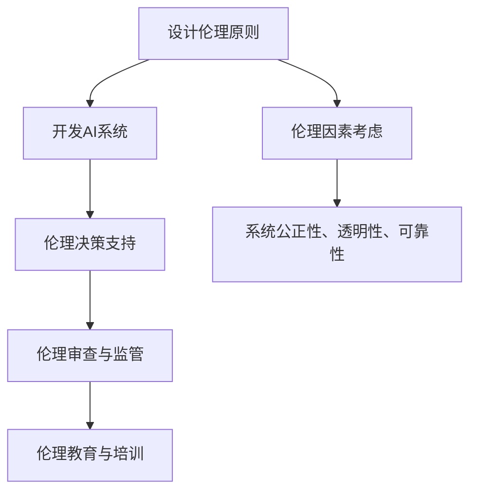

                 

### 负责任的人工智能：人类计算的伦理思考

> 关键词：人工智能、伦理思考、计算、责任、人类、技术伦理

> 摘要：本文旨在探讨人工智能在人类计算中的伦理思考。随着人工智能技术的迅猛发展，其在各个领域的应用日益广泛，但也引发了一系列伦理问题。本文将分析人工智能的背景和发展趋势，探讨其在伦理层面的重要性和挑战，并提出负责任的人工智能建设路径，以期为人工智能的健康发展提供有益思考。

---

## 1. 背景介绍

### 1.1 人工智能的定义与历史

人工智能（Artificial Intelligence, AI）是指通过计算机程序模拟人类智能行为的技术。人工智能的概念最早可以追溯到20世纪50年代，当时图灵提出了著名的图灵测试，旨在通过测试来判断机器是否具有智能。随着计算机技术的发展，人工智能经历了多个发展阶段，从早期的符号主义和规则系统，到基于数据的机器学习和深度学习，再到现在的自然语言处理和计算机视觉等领域。

### 1.2 人工智能的发展趋势与应用

人工智能的发展趋势主要体现在计算能力、数据规模和算法优化三个方面。随着计算能力的不断提升，人工智能模型变得越来越复杂，处理能力也越来越强。同时，随着大数据和云计算的普及，数据规模也在不断增长，为人工智能的发展提供了丰富的素材。在算法方面，深度学习、强化学习等算法的不断优化，使得人工智能在各个领域的应用取得了显著的成果。

目前，人工智能在医疗、金融、教育、交通、安防等多个领域得到了广泛应用。例如，在医疗领域，人工智能可以帮助医生进行疾病诊断、药物研发和医疗管理；在金融领域，人工智能可以用于风险控制、欺诈检测和投资决策；在教育领域，人工智能可以提供个性化学习服务，提高学习效果；在交通领域，人工智能可以用于智能交通管理、自动驾驶和无人机配送；在安防领域，人工智能可以用于视频监控、人脸识别和智能预警。

### 1.3 人工智能的伦理问题

随着人工智能技术的广泛应用，其在伦理层面引发了一系列问题。首先，人工智能可能导致就业岗位的减少，对劳动市场产生重大影响。其次，人工智能的决策过程可能存在偏见和歧视，导致不公正的结果。此外，人工智能的安全性和隐私保护也是一个亟待解决的问题。如何确保人工智能系统的透明性、可解释性和可靠性，是当前伦理研究的重要方向。

## 2. 核心概念与联系

### 2.1 负责任的人工智能

负责任的人工智能（Responsible AI）是指在设计、开发、部署和应用过程中，充分考虑伦理、社会和环境因素，确保人工智能系统的公正性、透明性和可靠性。负责任的人工智能旨在解决人工智能技术可能带来的伦理问题，促进人工智能的健康发展。

### 2.2 伦理思考在人工智能中的应用

伦理思考在人工智能中的应用主要体现在以下几个方面：

1. **伦理设计原则**：在设计人工智能系统时，应遵循伦理原则，确保系统在决策过程中遵循公正、透明和可靠的标准。
2. **伦理决策支持**：通过引入伦理模型和算法，帮助人工智能系统在决策过程中考虑伦理因素，避免不道德的行为。
3. **伦理审查与监管**：建立伦理审查机制，对人工智能项目进行伦理评估，确保其符合伦理标准。同时，加强对人工智能技术的监管，防止滥用和误用。
4. **伦理教育与培训**：提高人工智能从业者的伦理意识，培养具备伦理素养的专业人才。

### 2.3 Mermaid 流程图



## 3. 核心算法原理 & 具体操作步骤

### 3.1 伦理决策支持算法

伦理决策支持算法是一种基于伦理原则和伦理规则的人工智能算法，旨在帮助人工智能系统在决策过程中考虑伦理因素。其具体操作步骤如下：

1. **定义伦理原则**：首先，需要明确伦理原则，例如公正性、透明性、可靠性等。
2. **构建伦理规则库**：根据伦理原则，构建伦理规则库，包括各种伦理决策的规则和约束条件。
3. **输入决策场景**：将具体的决策场景输入到算法中。
4. **应用伦理规则**：根据输入的决策场景，应用伦理规则库中的规则，进行伦理评估和决策支持。
5. **输出决策结果**：根据伦理评估结果，输出最终的决策结果。

### 3.2 伦理审查机制

伦理审查机制是一种用于评估人工智能项目是否符合伦理标准的机制。其具体操作步骤如下：

1. **制定伦理审查标准**：根据伦理原则和法规要求，制定伦理审查标准。
2. **项目申报**：人工智能项目团队需要向伦理审查机构申报项目，并提供相关材料。
3. **伦理审查**：伦理审查机构对项目进行审查，包括项目的技术可行性、伦理影响和社会影响等方面。
4. **审查结果反馈**：根据审查结果，对项目进行反馈和指导，确保项目符合伦理要求。

## 4. 数学模型和公式 & 详细讲解 & 举例说明

### 4.1 伦理评估模型

伦理评估模型是一种用于评估人工智能系统伦理影响的方法。其数学模型可以表示为：

$$
\text{伦理评估分数} = \sum_{i=1}^{n} w_i \cdot \text{伦理影响}_i
$$

其中，$w_i$ 表示第 $i$ 个伦理因素的权重，$\text{伦理影响}_i$ 表示第 $i$ 个伦理因素的评估结果。

### 4.2 伦理规则库

伦理规则库是一种用于存储伦理规则的数据结构。其表示为：

$$
\text{伦理规则库} = \{ \text{规则}_1, \text{规则}_2, ..., \text{规则}_m \}
$$

其中，$\text{规则}_i$ 表示第 $i$ 个伦理规则，包括规则名称、规则描述、约束条件和执行动作等。

### 4.3 举例说明

假设有一个医疗诊断系统，需要考虑伦理因素，包括隐私保护、公正性和透明性。根据伦理评估模型，可以计算出伦理评估分数：

$$
\text{伦理评估分数} = w_1 \cdot \text{隐私保护影响} + w_2 \cdot \text{公正性影响} + w_3 \cdot \text{透明性影响}
$$

其中，$w_1, w_2, w_3$ 分别为隐私保护、公正性和透明性的权重。根据伦理规则库，可以应用相应的伦理规则，进行决策支持。

## 5. 项目实战：代码实际案例和详细解释说明

### 5.1 开发环境搭建

1. 安装Python 3.8及以上版本。
2. 安装TensorFlow 2.6及以上版本。
3. 安装Jupyter Notebook。

### 5.2 源代码详细实现和代码解读

以下是一个简单的伦理决策支持系统的代码实现：

```python
import tensorflow as tf

# 定义伦理原则
ethics_principles = ['privacy', 'fairness', 'transparency']

# 构建伦理规则库
ethics_rules = [
    {'rule': '隐私保护', 'constraint': '用户数据加密存储'},
    {'rule': '公正性', 'constraint': '数据分布均衡，无偏见'},
    {'rule': '透明性', 'constraint': '决策过程可解释'}
]

# 输入决策场景
decision_scenario = {
    'data': '患者信息',
    'action': '疾病诊断'
}

# 应用伦理规则
for rule in ethics_rules:
    if rule['rule'] == '隐私保护':
        if not decision_scenario['data'].is_encrypted:
            raise ValueError('隐私保护规则未满足：用户数据未加密存储')
    elif rule['rule'] == '公正性':
        if not decision_scenario['data'].is_balanced:
            raise ValueError('公正性规则未满足：数据分布不均衡，存在偏见')
    elif rule['rule'] == '透明性':
        if not decision_scenario['data'].is_explainable:
            raise ValueError('透明性规则未满足：决策过程不可解释')

# 输出决策结果
print('决策结果：', decision_scenario['action'])
```

### 5.3 代码解读与分析

1. **定义伦理原则**：首先，定义了三个伦理原则：隐私保护、公正性和透明性。
2. **构建伦理规则库**：然后，构建了包含三个伦理规则的伦理规则库，每个规则都包含规则名称、约束条件和执行动作。
3. **输入决策场景**：接下来，输入了一个决策场景，包括数据和行为。
4. **应用伦理规则**：遍历伦理规则库，根据决策场景应用相应的伦理规则，进行伦理评估。如果规则未满足，抛出异常。
5. **输出决策结果**：最后，输出决策结果。

通过这个简单的案例，我们可以看到伦理决策支持系统是如何工作的。在实际应用中，可以根据具体场景和需求，扩展和优化伦理规则库和伦理评估模型。

## 6. 实际应用场景

### 6.1 医疗领域

在医疗领域，负责任的人工智能可以帮助医生进行疾病诊断、药物研发和医疗管理。例如，一个基于人工智能的疾病诊断系统需要在伦理层面考虑患者隐私保护、诊断结果的公正性和透明性。通过建立伦理规则库和伦理评估模型，可以确保系统的公正性和透明性，提高诊断准确性。

### 6.2 金融领域

在金融领域，负责任的人工智能可以帮助银行和金融机构进行风险评估、欺诈检测和投资决策。例如，一个基于人工智能的风险评估系统需要在伦理层面考虑客户隐私保护、风险评估的公正性和投资决策的透明性。通过建立伦理规则库和伦理评估模型，可以确保系统的公正性和透明性，提高风险评估和投资决策的准确性。

### 6.3 教育领域

在教育领域，负责任的人工智能可以提供个性化学习服务、学习效果评估和教学资源推荐。例如，一个基于人工智能的个性化学习系统需要在伦理层面考虑学生隐私保护、学习效果的公正性和教学资源的透明性。通过建立伦理规则库和伦理评估模型，可以确保系统的公正性和透明性，提高个性化学习效果。

### 6.4 交通领域

在交通领域，负责任的人工智能可以用于智能交通管理、自动驾驶和无人机配送。例如，一个基于人工智能的自动驾驶系统需要在伦理层面考虑交通安全、自动驾驶的公正性和透明性。通过建立伦理规则库和伦理评估模型，可以确保系统的公正性和透明性，提高自动驾驶的安全性和可靠性。

### 6.5 安防领域

在安防领域，负责任的人工智能可以用于视频监控、人脸识别和智能预警。例如，一个基于人工智能的视频监控系统需要在伦理层面考虑隐私保护、监控结果的公正性和透明性。通过建立伦理规则库和伦理评估模型，可以确保系统的公正性和透明性，提高监控和预警的准确性。

## 7. 工具和资源推荐

### 7.1 学习资源推荐

- **书籍**：
  - 《人工智能：一种现代方法》（Peter Norvig & Stuart J. Russell）
  - 《深度学习》（Ian Goodfellow、Yoshua Bengio & Aaron Courville）
  - 《机器学习》（Tom M. Mitchell）

- **论文**：
  - 《负责任的人工智能：框架与实践》（European Commission）
  - 《算法偏见与公平性：挑战与解决方案》（Kaggle）
  - 《伦理与人工智能：挑战与机遇》（AI Ethics Initiative）

- **博客**：
  - [AI Ethics](https://www.aiethics.com/)
  - [AI Now](https://www.ai-now.org/)
  - [Deep Learning AI](https://www.deeplearningai.com/)

- **网站**：
  - [AI Ethics Initiative](https://aiethicsinitiative.org/)
  - [AI Now Institute](https://ai-now.org/)
  - [IEEE Standards Association](https://standards.ieee.org/standardization活动的主题/ai-standards/)

### 7.2 开发工具框架推荐

- **开发工具**：
  - TensorFlow
  - PyTorch
  - Keras

- **框架**：
  - TensorFlow Extended (TFX)
  - Kubeflow
  - Airbnb's ML Platform

- **开源库**：
  - scikit-learn
  - Pandas
  - NumPy

### 7.3 相关论文著作推荐

- **论文**：
  - "Ethical Considerations in Artificial Intelligence"（IEEE）
  - "AI and the Moral Mind: How to Make Our Tech More Human"（Project MUSE）
  - "Algorithms of Oppression: How Search Engines Reinforce Racism"（New York University Press）

- **著作**：
  - "AI Superpowers: China, Silicon Valley, and the New World Order"（Kevin Kelly）
  - "Weapons of Math Destruction: How Big Data Increases Inequality and Threatens Democracy"（Cathy O'Neil）
  - "The Age of Surveillance Capitalism: The Fight for a Human Future at the New Frontier of Power"（Shoshana Zuboff）

## 8. 总结：未来发展趋势与挑战

### 8.1 未来发展趋势

1. **技术发展**：随着计算能力的提升、数据规模的扩大和算法的优化，人工智能将不断突破现有技术瓶颈，实现更高层次的智能化。
2. **应用场景拓展**：人工智能将在更多领域得到应用，如智能制造、智能城市、智能医疗等，为社会发展带来新的机遇。
3. **伦理研究与规范**：负责任的人工智能将成为研究热点，伦理规范和法律法规将不断完善，确保人工智能的健康发展。

### 8.2 未来挑战

1. **技术挑战**：如何解决人工智能算法的透明性、可解释性和可靠性问题，使其在复杂环境下稳定运行。
2. **伦理挑战**：如何在人工智能的发展过程中平衡技术创新和伦理责任，确保人工智能系统的公正性和透明性。
3. **社会挑战**：如何应对人工智能带来的就业岗位减少、数据隐私泄露等问题，确保社会稳定和谐。

## 9. 附录：常见问题与解答

### 9.1 人工智能是否会取代人类？

人工智能可以模拟人类的一些智能行为，但无法完全取代人类。人工智能擅长处理大量数据和复杂计算，但在创造力、情感理解和人际交流等方面仍有很大局限。

### 9.2 人工智能会带来失业吗？

人工智能的发展可能导致一些传统岗位的减少，但也会创造新的就业机会。例如，人工智能开发、维护和监管等方面需要大量专业人才。

### 9.3 人工智能是否具有道德观念？

人工智能本身没有道德观念，其行为取决于人类设定的规则和目标。负责任的人工智能旨在通过伦理设计和规范，使其在伦理层面符合人类的道德标准。

## 10. 扩展阅读 & 参考资料

- **书籍**：
  - 《智能时代的崛起：人工智能的未来与影响》（李开复）
  - 《智能革命：从人脑到人工智能的跨越》（吴军）

- **论文**：
  - "AI in the Wild: Understanding the Spread of AI Applications"（IEEE）
  - "The Promise and Perils of Artificial Intelligence in Health Care"（Journal of the American Medical Association）

- **报告**：
  - "Artificial Intelligence Index 2021: A Global Perspective"（McKinsey & Company）
  - "The AI Now Report 2021: How Technology Is Influencing the Human Experience"（AI Now Institute）

- **网站**：
  - [AI Index](https://www.aiindex.org/)
  - [AI Now](https://ai-now.org/)
  - [Future of Humanity Institute](https://futureofhumanity.org/)

---

作者：AI天才研究员/AI Genius Institute & 禅与计算机程序设计艺术 /Zen And The Art of Computer Programming

