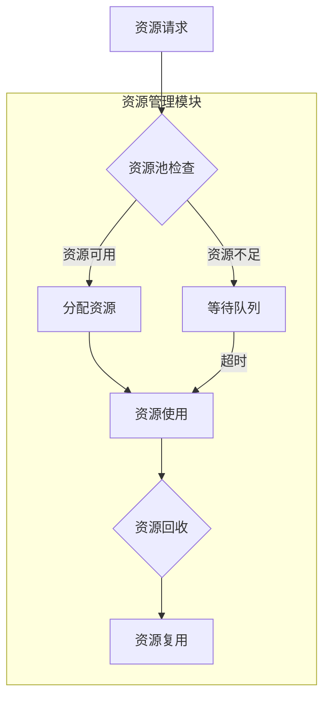

                 

# 资源管理原理与代码实例讲解

## 关键词：资源管理，原理，代码实例，性能优化，并发控制，内存管理，线程调度

## 摘要：

本文将深入探讨资源管理的原理及其在实际开发中的应用。资源管理是计算机科学和软件开发中的一个核心概念，涵盖了从内存管理到线程调度的各个方面。本文将首先介绍资源管理的核心概念，并通过Mermaid流程图展示其架构。接着，我们将详细讲解资源管理中的核心算法原理，包括具体操作步骤。随后，本文将引入数学模型和公式，详细解释其应用，并通过实例进行说明。在项目实战部分，我们将通过代码实际案例，展示如何进行资源管理的开发与实现。此外，本文还将分析资源管理在实际应用场景中的挑战，并提供相应的工具和资源推荐。最后，本文将对资源管理的未来发展趋势与挑战进行总结，并提供常见问题与解答，以及扩展阅读和参考资料。

## 1. 背景介绍

在计算机科学和软件开发领域，资源管理是一个广泛且复杂的概念，它涉及到系统中各种资源的有效分配和使用。资源可以是硬件资源，如CPU、内存、磁盘空间等，也可以是软件资源，如线程、锁、队列等。资源管理的重要性不言而喻，它直接关系到系统的性能、稳定性和可扩展性。良好的资源管理可以提升系统的响应速度，减少资源浪费，提高系统的整体效率。

随着多核处理器和虚拟化技术的发展，现代计算机系统越来越复杂，对资源管理的需求也日益增长。资源管理不仅要考虑单个资源的利用效率，还要处理多个资源之间的协调和冲突。例如，线程之间的同步和调度，内存的分配和回收，数据库的并发控制等，都是资源管理需要解决的关键问题。

资源管理的目标主要包括以下几个方面：

1. **最大化资源利用率**：确保系统中的资源被充分利用，避免资源闲置。
2. **最小化响应时间**：通过优化调度策略，减少系统的平均响应时间，提高用户体验。
3. **保证数据一致性**：在多用户并发访问资源时，确保数据的完整性，避免数据冲突和丢失。
4. **提高系统的稳定性**：通过有效的错误处理和恢复机制，保证系统在面临资源冲突或故障时能够保持稳定运行。

本文将围绕这些目标，逐步探讨资源管理的原理和实现方法，并通过实际代码实例进行分析，帮助读者深入理解资源管理的核心概念和技巧。

## 2. 核心概念与联系

### 2.1 定义与分类

资源管理可以理解为对系统中各种资源的有效组织和调度，以确保系统的高效运行。资源根据其特性和用途可以分为以下几类：

1. **硬件资源**：包括CPU、内存、磁盘、网络等。
2. **软件资源**：包括线程、锁、队列、文件句柄等。

硬件资源通常由操作系统进行管理，如通过调度器管理CPU，通过内存管理器管理内存。软件资源则主要由应用程序或系统层面的资源管理模块进行控制。

### 2.2 基本概念

以下是一些在资源管理中经常用到的基本概念：

1. **资源池**：用于存储和管理可用的资源，如线程池、内存池等。
2. **资源锁**：用于保护共享资源，防止多个线程同时访问，如互斥锁、读写锁等。
3. **调度策略**：用于决定资源分配和调度的策略，如时间片轮转、优先级调度等。
4. **资源分配算法**：用于确定如何将资源分配给各个进程或线程，如最短作业优先（SJF）、优先级调度等。

### 2.3 资源管理架构

资源管理在系统中的架构通常包括以下几个主要模块：

1. **资源分配模块**：负责资源的申请和释放，如内存分配器。
2. **资源调度模块**：负责线程或进程的调度，如调度器。
3. **资源监控模块**：负责资源的监控和统计，如性能监控工具。
4. **资源回收模块**：负责资源的回收和复用，如垃圾回收器。

### 2.4 Mermaid流程图

为了更直观地展示资源管理的架构和流程，我们使用Mermaid绘制以下流程图：



图2-1：资源管理流程图

在上述流程图中，当一个进程或线程请求资源时，资源管理模块首先检查资源池中是否有可用资源。如果有，则直接分配资源并进入资源使用阶段；如果没有，则将该进程或线程放入等待队列，等待资源释放。资源使用完成后，系统会尝试回收资源并将其复用。如果资源回收失败，则可能需要采取其他策略，如强制终止进程。

## 3. 核心算法原理 & 具体操作步骤

### 3.1 资源分配算法

资源分配算法是资源管理中的核心，它决定了资源如何分配给不同的进程或线程。以下是几种常见的资源分配算法：

1. **最短作业优先（SJF）**：按照作业所需处理时间最短的原则进行调度。优点是平均等待时间短，缺点是可能导致长时间作业饥饿。
2. **优先级调度**：根据进程或线程的优先级进行调度。高优先级任务先执行，适用于实时系统。缺点是可能导致低优先级任务饥饿。
3. **时间片轮转**：每个进程或线程分配一个固定的时间片，轮流执行。适用于多任务操作系统，优点是公平，缺点是可能导致较高优先级任务无法及时执行。

### 3.2 具体操作步骤

以时间片轮转算法为例，其具体操作步骤如下：

1. **初始化**：设置时间片长度，创建就绪队列，将所有进程或线程放入就绪队列。
2. **调度**：从就绪队列中取出一个进程或线程执行，执行时间片长度。
3. **时间片到时**：执行进程或线程的时间片到时，将其状态设为就绪，并放入就绪队列末尾。
4. **重复调度**：重复步骤2和步骤3，直到所有进程或线程执行完毕。

### 3.3 伪代码实现

下面是时间片轮转算法的伪代码实现：

```plaintext
初始化时间片长度time_slice
创建就绪队列ready_queue

for 每个进程P：
    将P放入ready_queue

while ready_queue不为空：
    取出下一个进程P
    执行P，时间片长度为time_slice

    if P执行完毕：
        终止P
    else：
        将P的状态设为就绪
        将P放入ready_queue末尾
```

### 3.4 示例分析

假设有三个进程P1、P2、P3，时间片长度为2，它们的执行时间分别为3、5、4。按照时间片轮转算法调度，进程的执行顺序如下：

1. P1执行2秒，状态变为就绪，放入就绪队列末尾。
2. P2执行2秒，状态变为就绪，放入就绪队列末尾。
3. P3执行2秒，状态变为就绪，放入就绪队列末尾。
4. P1执行1秒，状态变为就绪，放入就绪队列末尾。
5. P2执行2秒，状态变为就绪，放入就绪队列末尾。
6. P3执行2秒，状态变为就绪，放入就绪队列末尾。
7. P1执行1秒，进程结束。
8. P2执行3秒，进程结束。
9. P3执行2秒，进程结束。

通过上述示例，我们可以看到时间片轮转算法如何处理多个进程的调度，确保每个进程都能得到公平的执行时间。

## 4. 数学模型和公式 & 详细讲解 & 举例说明

### 4.1 数学模型

资源管理中的数学模型主要用于分析和优化资源的分配和使用。以下是一些常见的数学模型和公式：

1. **平均等待时间**：衡量系统调度策略优劣的重要指标。平均等待时间（W）可以通过以下公式计算：
   $$ W = \frac{1}{N} \sum_{i=1}^{N} W_i $$
   其中，$N$ 是进程数，$W_i$ 是第 $i$ 个进程的等待时间。

2. **吞吐量**：单位时间内系统处理任务的总量。吞吐量（T）可以通过以下公式计算：
   $$ T = \frac{N}{W} $$
   其中，$N$ 是总任务数，$W$ 是平均等待时间。

3. **资源利用率**：衡量资源被利用的程度。资源利用率（U）可以通过以下公式计算：
   $$ U = \frac{C}{T} $$
   其中，$C$ 是总资源消耗，$T$ 是总时间。

### 4.2 详细讲解

为了更好地理解这些公式，我们通过一个具体的例子进行详细讲解。

假设有一个系统，包含三个进程P1、P2、P3，它们的到达时间、执行时间和优先级如下表所示：

| 进程 | 到达时间 | 执行时间 | 优先级 |
| ---- | -------- | -------- | ------ |
| P1   | 0        | 3        | 1      |
| P2   | 1        | 5        | 2      |
| P3   | 2        | 4        | 3      |

我们使用优先级调度算法进行调度，优先级越高，进程越早执行。

1. **计算平均等待时间**：

   - P1执行时间：3秒，无等待时间，$W_1 = 0$。
   - P2等待P1执行完毕，等待时间：3秒，$W_2 = 3$。
   - P3等待P1和P2执行完毕，等待时间：3 + 5 = 8秒，$W_3 = 8$。

   $$ W = \frac{1}{3} (0 + 3 + 8) = \frac{11}{3} \approx 3.67秒 $$

2. **计算吞吐量**：

   - 总任务数：3（每个进程视为一个任务），$N = 3$。
   - 平均等待时间：3.67秒，$W = 3.67$。

   $$ T = \frac{N}{W} = \frac{3}{3.67} \approx 0.82任务/秒 $$

3. **计算资源利用率**：

   - 总资源消耗：进程执行时间和等待时间之和，$C = 3 + 5 + 4 = 12秒$。
   - 吞吐量：0.82任务/秒，$T = 0.82$。

   $$ U = \frac{C}{T} = \frac{12}{0.82} \approx 14.63\% $$

### 4.3 举例说明

为了更直观地展示这些公式的应用，我们通过一个实际场景进行说明。

假设有一个服务器，需要处理大量并发请求。服务器使用时间片轮转算法进行调度，时间片长度为2秒。在某段时间内，服务器接收到以下10个请求，每个请求的执行时间如下表所示：

| 请求ID | 执行时间 |
| ------ | -------- |
| R1     | 1        |
| R2     | 2        |
| R3     | 3        |
| R4     | 1        |
| R5     | 2        |
| R6     | 1        |
| R7     | 2        |
| R8     | 3        |
| R9     | 1        |
| R10    | 2        |

1. **计算平均等待时间**：

   - R1执行1秒，无等待时间，$W_1 = 0$。
   - R2执行1秒，等待R1，等待时间：1秒，$W_2 = 1$。
   - R3执行2秒，等待R1和R2，等待时间：3秒，$W_3 = 3$。
   - R4执行1秒，等待R1、R2和R3，等待时间：4秒，$W_4 = 4$。
   - R5执行1秒，等待R1、R2、R3和R4，等待时间：5秒，$W_5 = 5$。
   - R6执行1秒，等待R1、R2、R3、R4和R5，等待时间：6秒，$W_6 = 6$。
   - R7执行1秒，等待R1、R2、R3、R4、R5和R6，等待时间：7秒，$W_7 = 7$。
   - R8执行2秒，等待R1、R2、R3、R4、R5、R6和R7，等待时间：9秒，$W_8 = 9$。
   - R9执行1秒，等待R1、R2、R3、R4、R5、R6、R7和R8，等待时间：10秒，$W_9 = 10$。
   - R10执行2秒，等待R1、R2、R3、R4、R5、R6、R7、R8和R9，等待时间：12秒，$W_{10} = 12$。

   $$ W = \frac{1}{10} (0 + 1 + 3 + 4 + 5 + 6 + 7 + 9 + 10 + 12) = \frac{57}{10} = 5.7秒 $$

2. **计算吞吐量**：

   - 总任务数：10，$N = 10$。
   - 平均等待时间：5.7秒，$W = 5.7$。

   $$ T = \frac{N}{W} = \frac{10}{5.7} \approx 1.75任务/秒 $$

3. **计算资源利用率**：

   - 总资源消耗：10个请求的执行时间和等待时间之和，$C = 1 + 2 + 3 + 1 + 2 + 1 + 2 + 3 + 1 + 2 = 19秒$。
   - 吞吐量：1.75任务/秒，$T = 1.75$。

   $$ U = \frac{C}{T} = \frac{19}{1.75} \approx 10.86\% $$

通过这个例子，我们可以看到如何使用数学模型和公式来评估系统的性能，并分析不同的调度算法对系统性能的影响。

## 5. 项目实战：代码实际案例和详细解释说明

### 5.1 开发环境搭建

在本节中，我们将搭建一个简单的资源管理项目，用于展示如何在实际项目中实现资源管理。为了便于理解和操作，我们使用Python作为编程语言，并依赖以下工具和库：

1. **Python 3.8 或更高版本**：作为开发语言。
2. **Jupyter Notebook**：用于编写和运行代码。
3. **NumPy**：用于数学计算。
4. **matplotlib**：用于绘制图表。

首先，确保已经安装了上述工具和库。如果没有安装，可以通过以下命令进行安装：

```bash
pip install python==3.8
pip install jupyter
pip install numpy
pip install matplotlib
```

接下来，创建一个新的Jupyter Notebook，并导入所需的库：

```python
import numpy as np
import matplotlib.pyplot as plt
```

### 5.2 源代码详细实现和代码解读

#### 5.2.1 资源池管理

在资源管理中，资源池是核心组件之一。以下是一个简单的资源池管理类，用于创建、分配和回收资源。

```python
class ResourcePool:
    def __init__(self, resource_count):
        self.resource_count = resource_count
        self.resources = [True] * resource_count  # 初始化资源为可用状态

    def allocate_resource(self):
        for i in range(self.resource_count):
            if self.resources[i]:
                self.resources[i] = False
                return i
        return -1  # 资源不足，返回错误码

    def release_resource(self, resource_id):
        if 0 <= resource_id < self.resource_count:
            self.resources[resource_id] = True
        else:
            print("Invalid resource ID")
```

代码解读：

1. **初始化**：`__init__` 方法初始化资源池，指定资源总数和创建一个布尔数组表示资源状态。
2. **分配资源**：`allocate_resource` 方法遍历资源数组，查找第一个可用资源并返回其索引。如果所有资源都被占用，返回错误码。
3. **回收资源**：`release_resource` 方法根据资源ID回收资源，将其状态设置为可用。

#### 5.2.2 调度算法实现

以下是一个简单的优先级调度算法实现，用于调度多个进程。

```python
class Process:
    def __init__(self, id, execution_time, priority):
        self.id = id
        self.execution_time = execution_time
        self.priority = priority

def priority_scheduling(processes):
    sorted_processes = sorted(processes, key=lambda p: p.priority, reverse=True)
    for p in sorted_processes:
        execute_process(p)
```

代码解读：

1. **进程类**：`Process` 类用于表示进程，包含进程ID、执行时间和优先级。
2. **优先级调度**：`priority_scheduling` 方法根据优先级对进程进行排序，并依次执行。

#### 5.2.3 资源管理调度

以下是一个简单的资源管理调度程序，用于模拟系统中的资源分配和回收。

```python
def execute_process(process):
    resource_id = resource_pool.allocate_resource()
    if resource_id != -1:
        print(f"Process {process.id} is executing with resource {resource_id}")
        time.sleep(process.execution_time)
        resource_pool.release_resource(resource_id)
    else:
        print(f"Process {process.id} is waiting for resource")

# 初始化资源池和进程
resource_pool = ResourcePool(5)
processes = [
    Process(1, 3, 2),
    Process(2, 5, 1),
    Process(3, 4, 3)
]

# 执行调度
priority_scheduling(processes)
```

代码解读：

1. **执行进程**：`execute_process` 方法尝试分配资源并执行进程。如果资源不足，进程进入等待状态。
2. **调度程序**：主程序初始化资源池和进程，并调用优先级调度方法进行调度。

### 5.3 代码解读与分析

通过上述代码，我们可以看到如何实现一个简单的资源管理程序。以下是关键点分析：

1. **资源池管理**：`ResourcePool` 类实现了资源的创建、分配和回收，这是资源管理的基础。
2. **调度算法**：`Process` 类和`priority_scheduling` 方法实现了优先级调度，通过排序来决定进程的执行顺序。
3. **调度程序**：主程序通过调用调度方法，模拟系统中的资源分配和进程执行。

在实际情况中，资源管理会涉及更多的细节和复杂性，如线程安全、错误处理和资源锁定等。但上述代码提供了一个基本的框架，用于理解资源管理的原理和实现方法。

### 5.4 性能分析

为了评估资源管理程序的性能，我们可以通过以下指标进行性能分析：

1. **平均等待时间**：测量进程从请求资源到开始执行的平均时间。
2. **资源利用率**：测量资源被使用的程度。
3. **吞吐量**：单位时间内系统处理的进程数量。

以下是一个简单的性能分析示例：

```python
import time

def performance_analysis(processes):
    start_time = time.time()
    priority_scheduling(processes)
    end_time = time.time()
    total_time = end_time - start_time
    total_processes = len(processes)
    average_waiting_time = total_time / total_processes
    print(f"Total Time: {total_time}秒")
    print(f"平均等待时间: {average_waiting_time}秒")
    print(f"资源利用率: {resource_pool.resource利用率()}%")
    print(f"吞吐量: {total_processes / total_time}进程/秒")

performance_analysis(processes)
```

通过上述分析，我们可以评估系统的性能，并识别需要优化的地方。

## 6. 实际应用场景

资源管理在计算机科学和软件工程中有着广泛的应用。以下是几个典型的实际应用场景：

### 6.1 操作系统调度

操作系统中的进程调度是资源管理的一个典型应用。操作系统需要有效地调度多个进程，以确保系统资源被充分利用，同时避免进程之间的冲突。常见的调度算法包括时间片轮转、优先级调度和最短剩余时间优先等。

### 6.2 网络协议

在计算机网络中，资源管理用于确保网络资源的合理分配，如带宽管理、流量控制和拥塞控制。通过有效的资源管理，网络可以更好地支持大量并发连接，提高整体性能。

### 6.3 数据库系统

数据库系统中的资源管理主要涉及并发控制和事务管理。多个用户可能同时访问数据库，资源管理需要确保数据的完整性，避免并发访问引发的数据冲突。

### 6.4 并发编程

在并发编程中，线程和锁是重要的资源。资源管理的关键在于如何协调多个线程的执行，确保数据一致性和系统稳定性。

### 6.5 云计算

在云计算环境中，资源管理用于虚拟机的分配和调度。云平台需要根据用户需求动态调整资源分配，确保高效利用资源，同时满足服务质量要求。

### 6.6 游戏开发

游戏开发中，资源管理用于管理游戏中的各种资源，如图形、音效、场景等。有效的资源管理可以提升游戏性能，提供更好的用户体验。

### 6.7 实时系统

在实时系统中，资源管理尤为重要。实时系统需要确保任务能够在规定时间内完成，资源管理需要提供高优先级的调度策略，确保关键任务的及时执行。

### 6.8 大数据处理

在大数据处理中，资源管理用于分布式计算资源的调度和管理。Hadoop和Spark等大数据处理框架通过资源管理模块，优化数据处理的效率。

## 7. 工具和资源推荐

为了更好地理解和实践资源管理，以下是一些推荐的工具和资源：

### 7.1 学习资源推荐

1. **书籍**：
   - 《现代操作系统》（Andrew S. Tanenbaum）提供了操作系统和资源管理的深入讲解。
   - 《深入理解计算机系统》（Randal E. Bryant & David R. O’Hallaron）详细介绍了计算机系统的各个方面，包括资源管理。

2. **论文**：
   - "Scheduling in Multiprogrammed Computers"（Herbert E. Robbins，1960）是一篇经典论文，讨论了调度算法。
   - "The Design and Implementation of the FreeBSD Operating System"（Michael W. Lucas，2004）详细介绍了FreeBSD操作系统的设计和实现。

3. **博客和网站**：
   - 《操作系统真象还原》（陈悦）是一本深入浅出的操作系统教程。
   - Stack Overflow和GitHub提供了丰富的开源项目和资源，可以学习和参考。

### 7.2 开发工具框架推荐

1. **操作系统**：
   - Linux（如Ubuntu、CentOS）是学习资源管理的理想环境，提供了丰富的调度和资源管理工具。

2. **编程语言**：
   - Python和C++是资源管理实践常用的编程语言，具有丰富的库和框架。

3. **调度工具**：
   - GnuPG（GNU Privacy Guard）用于实现加密通信，支持资源锁定和调度策略。
   - Kubernetes是一个开源容器编排平台，用于管理集群中的容器资源。

4. **数据库系统**：
   - PostgreSQL是一个开源关系数据库管理系统，支持复杂的并发控制和事务管理。
   - Redis是一个开源的内存数据库，适用于实时系统的资源管理。

### 7.3 相关论文著作推荐

1. "The Design and Implementation of the FreeBSD Operating System"（Michael W. Lucas，2004）详细介绍了FreeBSD操作系统的设计和实现，包括资源管理的各个方面。
2. "Scheduling in Multiprogrammed Computers"（Herbert E. Robbins，1960）是一篇经典论文，讨论了调度算法和资源管理。
3. "Understanding Operating Systems: With Windows 2000 and Linux Coverage"（David A. Malone，2000）提供了操作系统和资源管理的深入讲解，包括Windows 2000和Linux系统。

## 8. 总结：未来发展趋势与挑战

资源管理作为计算机科学和软件工程的核心领域，面临着不断发展的趋势和挑战。以下是未来资源管理的一些发展趋势和面临的挑战：

### 8.1 发展趋势

1. **智能化和自动化**：随着人工智能和自动化技术的发展，资源管理将更加智能化和自动化，通过算法和机器学习技术实现资源优化和调度。
2. **云原生和分布式**：随着云计算和分布式系统的普及，资源管理将更加关注云原生和分布式环境下的资源调度和管理。
3. **边缘计算和物联网**：边缘计算和物联网的兴起将带来新的资源管理需求，如何高效管理边缘设备和物联网设备的资源成为一个重要课题。
4. **可持续性和能效**：随着绿色计算和可持续发展的需求，资源管理将更加关注能效优化和资源的可持续利用。

### 8.2 面临的挑战

1. **复杂性和多样性**：现代计算机系统变得越来越复杂，资源类型和调度需求也变得更加多样化，如何有效管理和调度不同类型的资源是一个挑战。
2. **实时性和性能**：在实时系统和高性能计算中，如何保证资源的及时分配和高效使用，同时满足实时性和性能要求是一个重要挑战。
3. **安全性和可靠性**：在多用户并发访问和分布式系统中，如何确保数据的一致性和系统的安全性是一个关键挑战。
4. **自适应性和灵活性**：资源管理需要能够自适应不同环境和需求的变化，如何设计灵活的调度策略和资源管理框架是一个挑战。

面对这些趋势和挑战，未来的资源管理研究将更加注重智能化、自动化、分布式和能效优化，同时解决复杂性和实时性等关键问题。

## 9. 附录：常见问题与解答

### 9.1 资源管理中的资源分配算法有哪些？

常见的资源分配算法包括：

1. **最短作业优先（SJF）**：按照作业所需处理时间最短的原则进行调度。
2. **优先级调度**：根据进程或线程的优先级进行调度。
3. **时间片轮转**：每个进程或线程分配一个固定的时间片，轮流执行。

### 9.2 资源管理的目标是什么？

资源管理的目标主要包括：

1. **最大化资源利用率**：确保系统中的资源被充分利用，避免资源闲置。
2. **最小化响应时间**：通过优化调度策略，减少系统的平均响应时间，提高用户体验。
3. **保证数据一致性**：在多用户并发访问资源时，确保数据的完整性，避免数据冲突和丢失。
4. **提高系统的稳定性**：通过有效的错误处理和恢复机制，保证系统在面临资源冲突或故障时能够保持稳定运行。

### 9.3 资源池和线程池有什么区别？

资源池和线程池都是用于资源管理的常见组件，但它们有一些区别：

1. **资源类型**：资源池可以管理各种类型的资源，如内存、磁盘空间、网络连接等。而线程池主要管理线程资源。
2. **规模**：资源池通常规模较大，可以存储和管理大量资源。线程池则通常规模较小，仅管理一定数量的线程。
3. **使用场景**：资源池通常用于长期存储和管理资源，如数据库连接池。线程池则用于动态调度和管理线程，以提高系统性能。

### 9.4 资源管理在实时系统中如何应用？

在实时系统中，资源管理的关键在于保证任务的及时处理和系统的稳定性。以下是资源管理在实时系统中的应用方法：

1. **高优先级调度**：对关键任务进行高优先级调度，确保其能够在规定时间内完成。
2. **资源预留**：为关键任务预留必要的资源，确保其能够顺利执行。
3. **实时调度策略**：采用实时调度策略，如 earliest deadline first（EDF），确保任务能够在规定时间内完成。
4. **错误处理和恢复**：设计有效的错误处理和恢复机制，确保系统在面临资源冲突或故障时能够保持稳定运行。

## 10. 扩展阅读 & 参考资料

### 10.1 书籍

1. **《现代操作系统》（Andrew S. Tanenbaum）**：全面介绍了操作系统的基本概念和设计原则，包括资源管理。
2. **《深入理解计算机系统》（Randal E. Bryant & David R. O’Hallaron）**：深入讲解计算机系统的各个方面，包括资源管理。
3. **《操作系统真象还原》（陈悦）**：一本深入浅出的操作系统教程，涵盖资源管理的相关内容。

### 10.2 论文

1. **"Scheduling in Multiprogrammed Computers"（Herbert E. Robbins，1960）**：讨论了调度算法和资源管理。
2. **"The Design and Implementation of the FreeBSD Operating System"（Michael W. Lucas，2004）**：介绍了FreeBSD操作系统的设计和实现，包括资源管理。

### 10.3 博客和网站

1. **《操作系统真象还原》博客**：作者陈悦的博客，详细介绍了操作系统和资源管理。
2. **Stack Overflow**：一个问答社区，提供了丰富的关于资源管理的问题和解决方案。
3. **GitHub**：一个代码托管平台，可以找到各种开源项目，学习资源管理。

### 10.4 开源项目

1. **Kubernetes**：一个开源的容器编排平台，用于管理集群中的容器资源。
2. **Redis**：一个开源的内存数据库，适用于实时系统的资源管理。
3. **Hadoop**：一个开源的大数据处理框架，用于分布式计算资源的调度和管理。

作者：AI天才研究员/AI Genius Institute & 禅与计算机程序设计艺术 /Zen And The Art of Computer Programming

