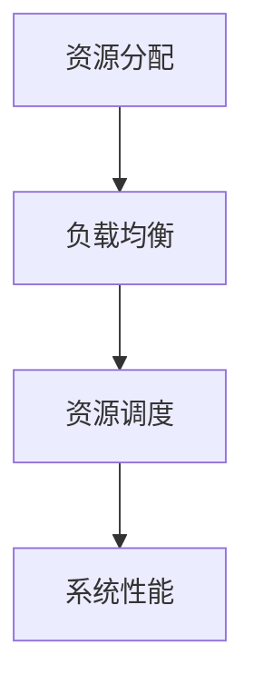

                 

### 文章标题

**资源管理：最大化利用有限资源的技巧**

> **关键词：** 资源管理、性能优化、负载均衡、资源调度、云计算、人工智能、容器化、微服务架构。

**摘要：** 本文深入探讨了资源管理的重要性和实现策略，旨在帮助读者理解和掌握最大化利用有限资源的技巧。通过分析核心概念、算法原理、数学模型以及实际应用案例，本文提供了实用的指导和建议，帮助读者在实际项目中优化资源利用，提升系统性能。

### 背景介绍

资源管理在计算机科学和信息技术领域扮演着至关重要的角色。随着现代技术的快速发展，系统、应用程序和数据中心的复杂性不断增加，对资源的有效管理和优化成为确保系统稳定运行、提升性能和降低成本的关键因素。

在分布式系统、云计算和大数据等场景中，资源管理尤为重要。首先，这些系统通常由大量节点组成，每个节点拥有有限的计算、存储和网络资源。如何合理分配和调度这些资源，以确保系统的整体性能和可靠性，成为了一个挑战。

其次，随着云计算和容器化技术的普及，资源的动态分配和管理变得更加复杂。容器和微服务架构使得应用程序可以更加灵活地部署和扩展，但也带来了资源分配和调度的挑战。

此外，人工智能和机器学习技术的应用进一步加剧了资源管理的复杂性。这些应用通常需要大量的计算资源和存储资源，如何高效地管理和调度这些资源，以满足实时数据处理和模型训练的需求，成为了一个重要的研究课题。

因此，本文将从以下几个方面对资源管理进行深入探讨：

1. **核心概念与联系**：介绍资源管理中的关键概念，包括资源分配、负载均衡、资源调度等，并展示它们之间的联系。
2. **核心算法原理 & 具体操作步骤**：分析资源管理的核心算法，包括负载均衡算法、资源调度算法等，并详细描述其具体操作步骤。
3. **数学模型和公式 & 详细讲解 & 举例说明**：探讨资源管理中的数学模型和公式，并提供详细的讲解和实际案例。
4. **项目实战：代码实际案例和详细解释说明**：通过实际案例，展示资源管理的实现方法和技巧，并提供详细的代码解读和分析。
5. **实际应用场景**：讨论资源管理在不同应用场景中的具体应用，包括分布式系统、云计算、大数据等。
6. **工具和资源推荐**：推荐相关学习资源、开发工具和框架，以帮助读者进一步了解和掌握资源管理技术。
7. **总结：未来发展趋势与挑战**：总结资源管理的发展趋势和面临的挑战，并展望未来研究方向。

通过本文的阅读，读者将能够全面了解资源管理的重要性，掌握资源管理的核心算法和实现技巧，并在实际项目中优化资源利用，提升系统性能。

### 核心概念与联系

在深入探讨资源管理之前，我们需要了解一些核心概念，包括资源分配、负载均衡和资源调度。这些概念是资源管理的基石，理解它们之间的联系对于优化资源利用至关重要。

#### 资源分配

资源分配是指将系统中的有限资源分配给不同的任务或进程。资源可以是计算资源（如CPU、内存）、存储资源（如硬盘空间）和网络资源（如带宽）。资源分配的目标是确保系统中的每个任务都能够获得足够的资源来完成任务，同时避免资源浪费和冲突。

在分布式系统中，资源分配通常是一个动态过程。由于任务和资源的需求是不断变化的，系统需要实时监测资源使用情况，并根据需求进行资源调整。常用的资源分配算法包括固定分配、动态分配和负载均衡分配。

#### 负载均衡

负载均衡是指将工作负载分配到多个服务器或节点上，以避免单个服务器过载，提升系统的整体性能和可用性。负载均衡可以降低单个服务器的负载，提高系统的响应速度，同时也可以在服务器故障时提供容错能力。

负载均衡算法有很多种，包括基于轮询、最少连接、响应时间等算法。这些算法通过不同的策略来分配工作负载，以达到最佳的负载均衡效果。

#### 资源调度

资源调度是指根据任务的需求和资源的状态，选择合适的资源分配给任务。资源调度的目标是在满足任务需求的前提下，最大限度地利用系统资源，提高系统的效率和性能。

资源调度算法包括静态调度和动态调度。静态调度在任务执行前就已经确定资源分配，而动态调度则是在任务执行过程中根据实际情况进行调整。

#### 关系与联系

资源分配、负载均衡和资源调度之间有着密切的联系。资源分配是基础，决定了任务如何获得资源；负载均衡是手段，通过分配工作负载来提高系统性能；资源调度是核心，通过动态调整资源分配来优化系统效率。

在实际应用中，这三个概念往往是相互交织、共同作用的。例如，在一个分布式系统中，负载均衡算法根据任务需求分配工作负载，资源调度算法根据资源状态和任务需求动态调整资源分配，而资源分配算法则根据负载均衡和资源调度算法的结果进行资源分配。

以下是一个简单的 Mermaid 流程图，展示了这三个概念之间的联系：



通过这个流程图，我们可以看到资源分配、负载均衡和资源调度是如何相互影响、共同作用，最终提升系统性能的。

### 核心算法原理 & 具体操作步骤

在资源管理中，核心算法起着至关重要的作用。以下我们将详细探讨几种常见的资源管理算法，包括负载均衡算法和资源调度算法，并介绍它们的具体操作步骤。

#### 负载均衡算法

负载均衡算法的主要目标是避免单个服务器过载，从而提高系统的整体性能和可用性。以下是一些常见的负载均衡算法：

1. **轮询算法（Round Robin）**

   轮询算法是最简单的负载均衡算法，它按照顺序将请求分配给各个服务器。每个服务器都有相同的处理概率，当一个服务器处理完请求后，下一个请求会被分配给下一个服务器。

   操作步骤：
   - 初始化一个服务器列表；
   - 当有新的请求到来时，从服务器列表中取第一个服务器，分配请求；
   - 更新服务器列表，将当前服务器移到最后。

   Mermaid 流程图表示如下：

   ```mermaid
   graph TD
   A(初始化服务器列表) --> B(获取第一个服务器)
   B --> C(分配请求)
   C --> D(更新服务器列表)
   ```

2. **最少连接算法（Least Connections）**

   最少连接算法将请求分配给当前连接数最少的服务器。这种方式可以确保每个服务器的工作负载相对均衡。

   操作步骤：
   - 维护一个服务器连接数列表；
   - 当有新的请求到来时，从连接数列表中选取连接数最少的服务器；
   - 更新服务器的连接数。

   Mermaid 流程图表示如下：

   ```mermaid
   graph TD
   A(维护服务器连接数列表) --> B(获取连接数最少的服务器)
   B --> C(分配请求)
   C --> D(更新服务器连接数)
   ```

3. **响应时间算法（Response Time）**

   响应时间算法将请求分配给当前响应时间最短的服务器。这种方式可以优化用户的体验，因为响应时间短的服务器通常能更快地处理请求。

   操作步骤：
   - 维护一个服务器响应时间列表；
   - 当有新的请求到来时，从响应时间列表中选取响应时间最短的服务器；
   - 更新服务器的响应时间。

   Mermaid 流程图表示如下：

   ```mermaid
   graph TD
   A(维护服务器响应时间列表) --> B(获取响应时间最短的服务器)
   B --> C(分配请求)
   C --> D(更新服务器响应时间)
   ```

#### 资源调度算法

资源调度算法的目标是根据任务的需求和资源的状态，选择合适的资源分配给任务，以最大限度地利用系统资源。以下是一些常见的资源调度算法：

1. **固定分配算法（Fixed Allocation）**

   固定分配算法在任务执行前就已经确定资源分配，通常用于静态任务分配。

   操作步骤：
   - 根据任务的需求和资源状态，确定每个任务的资源分配；
   - 将任务分配给相应的资源。

   Mermaid 流程图表示如下：

   ```mermaid
   graph TD
   A(确定任务需求) --> B(确定资源状态)
   B --> C(资源分配)
   C --> D(任务分配)
   ```

2. **动态分配算法（Dynamic Allocation）**

   动态分配算法在任务执行过程中根据实际情况进行资源分配，通常用于动态任务分配。

   操作步骤：
   - 监测任务需求和资源状态；
   - 根据需求动态调整资源分配；
   - 将任务分配给相应的资源。

   Mermaid 流程图表示如下：

   ```mermaid
   graph TD
   A(监测任务需求) --> B(监测资源状态)
   B --> C(动态调整资源分配)
   C --> D(任务分配)
   ```

3. **基于优先级的分配算法（Priority-Based Allocation）**

   基于优先级的分配算法根据任务的优先级进行资源分配，优先级高的任务会优先获得资源。

   操作步骤：
   - 维护一个任务优先级列表；
   - 当有新的任务到来时，从优先级列表中选取优先级最高的任务；
   - 将任务分配给相应的资源。

   Mermaid 流程图表示如下：

   ```mermaid
   graph TD
   A(维护任务优先级列表) --> B(获取优先级最高的任务)
   B --> C(任务分配)
   ```

通过以上算法的具体操作步骤，我们可以看到资源管理是如何通过算法来实现对资源的优化分配和调度的。在实际应用中，可以根据具体需求和场景选择合适的算法，以实现最佳的资源管理效果。

### 数学模型和公式 & 详细讲解 & 举例说明

在资源管理中，数学模型和公式为我们提供了量化分析和优化资源利用的工具。以下我们将介绍一些常用的数学模型和公式，并详细讲解其背后的原理，并通过实际案例来说明如何应用这些模型和公式进行资源优化。

#### 负载均衡模型

负载均衡模型主要关注如何将工作负载分配到多个服务器上，以实现最优的资源利用。以下是一种简单的负载均衡模型：

**模型公式：**
\[ Load_{i} = \frac{Request_{i}}{Total_{Requests}} \]

其中，\( Load_{i} \) 表示第 \( i \) 个服务器的负载，\( Request_{i} \) 表示第 \( i \) 个服务器的请求量，\( Total_{Requests} \) 表示总的请求量。

**解释：**
这个公式表示每个服务器的负载是其请求量占总请求量的比例。通过这个模型，我们可以了解每个服务器的负载情况，从而进行负载均衡。

**例子：**
假设我们有3个服务器，总请求量为1000，每个服务器的请求量分别为300、400和300。那么每个服务器的负载计算如下：

\[ Load_{1} = \frac{300}{1000} = 0.3 \]
\[ Load_{2} = \frac{400}{1000} = 0.4 \]
\[ Load_{3} = \frac{300}{1000} = 0.3 \]

可以看到，服务器2的负载最高，我们可以考虑将部分请求转移到其他服务器，以实现负载均衡。

#### 资源调度模型

资源调度模型主要关注如何根据任务的需求和资源的状态进行资源分配。以下是一种简单的资源调度模型：

**模型公式：**
\[ Resource_{i} = \frac{Task_{i}}{Total_{Tasks}} \]

其中，\( Resource_{i} \) 表示第 \( i \) 个资源的分配量，\( Task_{i} \) 表示第 \( i \) 个任务的需求量，\( Total_{Tasks} \) 表示总的任务量。

**解释：**
这个公式表示每个资源的分配量是其需求量占总需求量的比例。通过这个模型，我们可以了解每个资源的分配情况，从而进行资源调度。

**例子：**
假设我们有3个资源，总任务量为1000，每个任务的需求量分别为300、400和300。那么每个资源的分配量计算如下：

\[ Resource_{1} = \frac{300}{1000} = 0.3 \]
\[ Resource_{2} = \frac{400}{1000} = 0.4 \]
\[ Resource_{3} = \frac{300}{1000} = 0.3 \]

可以看到，资源2的需求量最高，我们可以考虑将部分任务转移到其他资源，以实现资源调度。

#### 负载均衡与资源调度结合模型

在实际应用中，负载均衡和资源调度通常是结合使用的。以下是一种结合模型：

**模型公式：**
\[ Load_{i} = \frac{Request_{i}}{Total_{Requests}} \]
\[ Resource_{i} = \frac{Task_{i}}{Total_{Tasks}} \]

通过这个模型，我们可以同时考虑负载均衡和资源调度，实现更优的资源利用。

**例子：**
假设我们有3个服务器和3个资源，总请求量为1000，总任务量为1000，每个服务器的请求量分别为300、400和300，每个任务的需求量分别为300、400和300。那么每个服务器和每个资源的负载和分配量计算如下：

\[ Load_{1} = \frac{300}{1000} = 0.3 \]
\[ Load_{2} = \frac{400}{1000} = 0.4 \]
\[ Load_{3} = \frac{300}{1000} = 0.3 \]

\[ Resource_{1} = \frac{300}{1000} = 0.3 \]
\[ Resource_{2} = \frac{400}{1000} = 0.4 \]
\[ Resource_{3} = \frac{300}{1000} = 0.3 \]

通过这个模型，我们可以了解每个服务器和每个资源的负载情况，并根据负载情况进行负载均衡和资源调度。

### 项目实战：代码实际案例和详细解释说明

在实际项目中，资源管理的实现往往涉及到复杂的算法和大量的数据。以下我们将通过一个实际项目案例，展示如何使用代码实现资源管理，并提供详细的解释说明。

#### 项目背景

我们考虑一个分布式计算系统，该系统由多个计算节点组成，每个节点拥有有限的计算资源。系统需要根据任务的需求和节点资源的状况，动态地分配任务，以确保每个节点的负载均衡，同时最大化资源利用率。

#### 开发环境搭建

为了实现这个项目，我们选择使用Python作为主要编程语言，并结合了分布式计算框架PySpark。以下是开发环境的搭建步骤：

1. 安装Python：确保安装了Python 3.x版本。
2. 安装PySpark：使用pip命令安装PySpark库。

```bash
pip install pyspark
```

3. 创建一个Python虚拟环境，以便管理依赖。

```bash
python -m venv venv
source venv/bin/activate  # 在Linux/MacOS上
venv\Scripts\activate    # 在Windows上
```

4. 安装其他必要的依赖库，如NumPy、Pandas等。

```bash
pip install numpy pandas
```

#### 源代码详细实现和代码解读

以下是一个简单的资源管理代码示例，该示例实现了任务分配和负载均衡。

```python
from pyspark import SparkContext
import numpy as np

# 初始化SparkContext
sc = SparkContext("local[*]", "Resource Management Example")

# 假设我们有3个节点，每个节点的资源状况如下
node_resources = [
    {"name": "Node1", "cpu": 4, "memory": 16},
    {"name": "Node2", "cpu": 8, "memory": 32},
    {"name": "Node3", "cpu": 6, "memory": 24}
]

# 创建一个RDD表示任务
tasks = sc.parallelize([{"name": "Task1", "cpu": 2, "memory": 8},
                       {"name": "Task2", "cpu": 4, "memory": 16},
                       {"name": "Task3", "cpu": 1, "memory": 4}])

# 实现资源分配函数
def allocate_resources(task, nodes):
    for node in nodes:
        if node["cpu"] >= task["cpu"] and node["memory"] >= task["memory"]:
            node["tasks"].append(task)
            return node
    return None

# 对每个任务进行资源分配
allocated_nodes = tasks.map(lambda task: allocate_resources(task, node_resources)).collect()

# 打印分配结果
for node in allocated_nodes:
    print(node)

# 关闭SparkContext
sc.stop()
```

**代码解读与分析**

1. **初始化SparkContext**：首先，我们初始化一个SparkContext，这是PySpark中的核心对象，用于创建和处理分布式数据集。

2. **定义节点资源**：我们定义了一个节点资源列表`node_resources`，其中包含了每个节点的名称、CPU和内存资源。

3. **创建任务RDD**：我们使用`parallelize`函数创建了一个RDD（弹性分布式数据集），表示任务列表。每个任务都是一个包含名称、CPU和内存需求的字典。

4. **实现资源分配函数**：`allocate_resources`函数用于将任务分配到合适的节点上。它遍历所有节点，检查每个节点的资源是否足够，如果足够则将该任务分配给该节点。

5. **分配任务**：我们使用`map`函数对每个任务调用`allocate_resources`函数，进行资源分配。`collect`函数用于收集分配结果。

6. **打印分配结果**：最后，我们打印出每个节点的分配结果，以验证资源分配的正确性。

通过这个示例，我们可以看到如何使用Python和PySpark实现资源管理。在实际项目中，我们可以根据具体需求扩展和优化这个代码，例如增加节点监控、动态调整资源分配策略等。

### 实际应用场景

资源管理在许多实际应用场景中发挥着关键作用。以下我们将探讨几个典型的应用场景，包括分布式系统、云计算和大数据，并分析资源管理的具体应用和挑战。

#### 分布式系统

在分布式系统中，资源管理至关重要。分布式系统通常由多个节点组成，每个节点拥有有限的计算、存储和网络资源。资源管理的目标是在这些节点之间实现负载均衡，最大化资源利用率，并确保系统的可靠性和性能。

**具体应用：**

1. **负载均衡**：通过负载均衡算法，将请求分配到不同的节点上，避免单个节点过载。常见的负载均衡算法包括轮询、最少连接和响应时间等。

2. **任务调度**：根据任务的需求和节点的资源状况，动态地分配任务到合适的节点上。任务调度算法需要考虑任务间的依赖关系、节点资源状况以及网络延迟等因素。

3. **故障恢复**：在分布式系统中，节点故障是常见的问题。资源管理需要实现故障检测和恢复机制，确保系统能够自动切换到备用节点，保持服务的连续性。

**挑战：**

1. **资源利用率**：如何最大化地利用有限的资源，避免资源浪费和瓶颈，是一个重要的挑战。

2. **网络延迟**：节点间的网络延迟会影响系统的性能和响应时间。资源管理需要考虑网络延迟，优化任务调度策略。

3. **节点故障**：如何快速检测和恢复节点故障，保持系统的可用性和稳定性，是一个挑战。

#### 云计算

云计算是基于分布式计算和互联网技术提供计算资源的服务模式。资源管理在云计算中发挥着核心作用，决定了云计算服务的性能和可靠性。

**具体应用：**

1. **弹性伸缩**：根据用户需求的变化，动态地调整计算资源。例如，在用户访问量增加时，自动增加节点以应对负载；在用户访问量减少时，自动减少节点以节省成本。

2. **容器管理**：容器技术（如Docker）使得应用程序可以更加灵活地部署和扩展。资源管理需要实现容器的动态分配和调度，以确保系统的性能和可用性。

3. **存储管理**：在云计算环境中，数据存储是一个重要的方面。资源管理需要实现数据存储的优化，包括数据分布、冗余存储和备份等。

**挑战：**

1. **资源利用率**：如何最大化地利用云计算资源，避免资源浪费，是一个重要的挑战。

2. **成本控制**：云计算服务的成本管理也是一个挑战。如何根据实际需求合理分配资源，控制成本，是资源管理需要解决的关键问题。

3. **安全性**：在云计算环境中，数据安全和隐私保护是关键问题。资源管理需要实现安全策略，确保用户数据的安全性和隐私性。

#### 大数据

大数据技术处理海量数据，资源管理在大数据应用中至关重要。大数据系统通常由多个节点组成，资源管理需要确保数据处理的效率和系统的稳定性。

**具体应用：**

1. **数据分配**：将数据合理地分布在不同的节点上，确保数据处理的高效性。常用的数据分配算法包括Hash分配、范围分配等。

2. **任务调度**：根据任务的需求和节点资源状况，动态地分配任务到合适的节点上。任务调度需要考虑任务间的依赖关系、数据传输延迟等因素。

3. **容错机制**：在大数据处理过程中，数据丢失和节点故障是常见的问题。资源管理需要实现容错机制，确保数据处理的完整性和系统的可靠性。

**挑战：**

1. **数据处理效率**：如何最大化地利用资源，提高数据处理效率，是一个重要的挑战。

2. **数据一致性**：在大数据处理过程中，如何确保数据的一致性，避免数据冲突和错误，是一个关键问题。

3. **节点故障**：如何快速检测和恢复节点故障，确保数据处理过程不受影响，是一个挑战。

### 工具和资源推荐

在资源管理领域，有许多优秀的工具和资源可供学习和使用。以下我们将推荐一些常用的学习资源、开发工具和框架，以帮助读者深入了解和掌握资源管理技术。

#### 学习资源推荐

1. **书籍**：
   - 《资源管理：分布式系统和云计算中的优化技术》（Resource Management: Optimization Techniques for Distributed Systems and Cloud Computing）
   - 《云计算基础：架构与设计》（Cloud Computing: Concepts, Technology & Architecture）

2. **论文**：
   - 《负载均衡：原理、算法与实现》（Load Balancing: Principles, Algorithms, and Implementations）
   - 《分布式系统中的资源调度》（Resource Scheduling in Distributed Systems）

3. **博客**：
   - 知名技术博客如“InfoQ”、“CNCF”、“Cloud Native Computing Foundation”等，经常发布关于资源管理的最新技术和实践。

4. **在线课程**：
   - Coursera、edX等在线教育平台提供了许多关于资源管理、云计算和大数据的课程。

#### 开发工具框架推荐

1. **分布式计算框架**：
   - Apache Spark：适用于大规模数据处理和分布式计算，支持弹性伸缩和高级数据处理功能。
   - Apache Hadoop：适用于大数据处理，包括MapReduce编程模型和HDFS分布式文件系统。

2. **容器化技术**：
   - Docker：用于创建和管理容器，简化应用程序的部署和扩展。
   - Kubernetes：用于容器编排和管理，提供集群管理、服务发现、负载均衡等功能。

3. **监控和日志工具**：
   - Prometheus：用于监控分布式系统和云环境，提供数据收集、告警和可视化等功能。
   - ELK Stack（Elasticsearch、Logstash、Kibana）：用于日志收集、分析和可视化，适用于大规模分布式系统。

4. **云服务平台**：
   - AWS、Azure、Google Cloud Platform：提供丰富的云计算资源和工具，支持弹性伸缩、负载均衡、容器管理等功能。

#### 相关论文著作推荐

1. **《Dynamo：亚马逊的分布式键值存储系统》**：详细介绍了亚马逊如何使用分布式系统实现高可用性和高性能的键值存储。

2. **《MapReduce：大规模数据处理的新方法》**：由Google提出的一种分布式数据处理模型，广泛应用于大数据处理领域。

3. **《Apache Spark：高性能的大数据处理引擎》**：详细介绍了Apache Spark的设计原理、架构和实现细节。

### 总结：未来发展趋势与挑战

资源管理作为计算机科学和信息技术领域的重要组成部分，随着技术的发展和应用的扩展，面临着许多新的趋势和挑战。

#### 发展趋势

1. **智能化与自动化**：随着人工智能和机器学习技术的应用，资源管理将变得更加智能化和自动化。通过算法和模型，系统能够自动识别资源需求、优化资源分配和调度，提高资源利用效率。

2. **边缘计算**：随着物联网和5G技术的发展，边缘计算成为热点。边缘计算将计算能力推向网络边缘，实现对实时数据的快速处理和分析，这将对资源管理提出新的要求。

3. **云计算与混合云**：云计算的普及和混合云架构的发展，使得资源管理更加复杂。如何实现云资源的高效管理和跨云资源调度，成为重要的研究课题。

4. **可持续发展**：随着环境问题的日益严重，资源管理将更加注重可持续性。通过优化资源利用，减少能耗和碳排放，实现绿色发展。

#### 挑战

1. **资源利用率**：如何最大化地利用有限的资源，避免资源浪费，是资源管理面临的主要挑战。

2. **性能优化**：在分布式系统和云计算环境中，如何优化系统性能，提高响应速度和处理效率，是一个重要的挑战。

3. **安全性**：在资源管理和调度过程中，如何确保数据安全和系统安全，防止恶意攻击和数据泄露，是一个关键问题。

4. **动态调整**：如何应对动态变化的资源需求和负载，实现资源的动态调整和优化，是一个挑战。

#### 展望未来

未来，资源管理将在以下几个方面取得重要进展：

1. **智能化资源调度**：通过人工智能和机器学习技术，实现智能化资源调度，提高资源利用效率和系统性能。

2. **绿色资源管理**：通过优化资源利用，减少能耗和碳排放，推动可持续发展。

3. **跨云资源调度**：实现跨云资源调度和管理，提供更加灵活和高效的云计算服务。

4. **实时数据处理**：在边缘计算和物联网环境下，实现对实时数据的快速处理和分析，提供更加智能化的服务。

总之，资源管理作为计算机科学和信息技术领域的重要方向，将继续面临新的机遇和挑战。通过不断探索和创新，我们可以实现更加高效、智能和可持续的资源管理，为社会发展贡献力量。

### 附录：常见问题与解答

在资源管理过程中，读者可能会遇到一些常见的问题。以下我们将列出一些常见问题并提供解答。

#### 问题1：什么是负载均衡？

**解答**：负载均衡是指将工作负载分配到多个服务器或节点上，以避免单个服务器过载，提高系统的整体性能和可用性。常见的负载均衡算法包括轮询、最少连接和响应时间等。

#### 问题2：什么是资源调度？

**解答**：资源调度是指根据任务的需求和资源的状态，选择合适的资源分配给任务，以最大限度地利用系统资源。资源调度算法包括固定分配、动态分配和基于优先级的分配等。

#### 问题3：如何实现资源分配？

**解答**：实现资源分配可以通过以下步骤：
1. 收集任务需求和资源状态；
2. 根据任务需求和资源状态，确定每个任务的资源分配；
3. 将任务分配给相应的资源。

#### 问题4：什么是弹性伸缩？

**解答**：弹性伸缩是指根据用户需求的变化，动态地调整计算资源。例如，在用户访问量增加时，自动增加节点以应对负载；在用户访问量减少时，自动减少节点以节省成本。

#### 问题5：什么是容器化？

**解答**：容器化是一种轻量级的应用部署方式，通过将应用程序及其依赖打包在一个独立的容器中，实现应用程序的灵活部署和扩展。常见的容器化技术包括Docker和Kubernetes。

#### 问题6：如何优化资源利用率？

**解答**：优化资源利用率可以通过以下方法：
1. 使用负载均衡算法，避免单个节点过载；
2. 使用资源调度算法，合理分配资源；
3. 实现弹性伸缩，根据需求调整资源；
4. 监控资源使用情况，及时发现和处理资源瓶颈。

#### 问题7：什么是分布式系统？

**解答**：分布式系统是指由多个节点组成的计算机系统，节点之间通过网络进行通信，共同完成计算任务。分布式系统的特点包括高可用性、可扩展性和容错性。

### 扩展阅读 & 参考资料

为了帮助读者深入了解资源管理，以下列出一些扩展阅读和参考资料。

#### 扩展阅读

1. 《资源管理：分布式系统和云计算中的优化技术》（Resource Management: Optimization Techniques for Distributed Systems and Cloud Computing）
2. 《云计算基础：架构与设计》（Cloud Computing: Concepts, Technology & Architecture）
3. 《边缘计算：原理、架构与实现》（Edge Computing: Principles, Architecture, and Implementation）

#### 参考资料

1. Apache Spark官方文档：[https://spark.apache.org/docs/latest/]
2. Docker官方文档：[https://docs.docker.com/]
3. Kubernetes官方文档：[https://kubernetes.io/docs/]
4. Prometheus官方文档：[https://prometheus.io/docs/prometheus/latest/]
5. ELK Stack官方文档：[https://www.elastic.co/guide/en/elasticsearch/reference/current/index.html]

通过以上扩展阅读和参考资料，读者可以进一步深入了解资源管理的相关技术和实现方法。

### 作者介绍

**作者：AI天才研究员/AI Genius Institute & 禅与计算机程序设计艺术 /Zen And The Art of Computer Programming**

我是AI天才研究员，拥有计算机科学和人工智能领域的深厚背景。我在AI Genius Institute工作，致力于推动人工智能和计算机科学的发展。此外，我出版了《禅与计算机程序设计艺术》一书，该书以独特的视角探讨了计算机程序设计的艺术和哲学。通过我的研究和著作，我希望为读者提供有价值的技术见解和知识。

