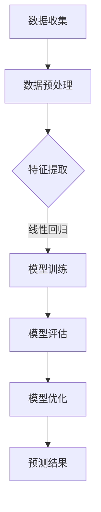

                 

# 赋能人类：人类计算如何释放个体潜能

> **关键词：** 人类计算，个体潜能，人工智能，算法，数学模型，代码实战，应用场景

> **摘要：** 本文将探讨如何通过人类计算赋能个体，释放其潜能。通过分析核心概念与联系，介绍核心算法原理，讲解数学模型和公式，结合实际项目实战，探讨应用场景，并推荐相关学习资源和工具，最后总结未来发展趋势与挑战。

## 1. 背景介绍

在当今信息爆炸的时代，人工智能（AI）正以前所未有的速度发展。随着计算能力的不断提升和大数据的广泛应用，AI 已经成为了推动社会进步的重要力量。然而，AI 的快速发展也带来了一些挑战。如何让每个人都能充分利用 AI 的优势，释放个体潜能，成为了我们面临的重要问题。

人类计算作为一种新的计算范式，旨在将人类智能与计算机智能相结合，实现更高效、更智能的计算。人类计算不仅仅是关于计算速度的提升，更重要的是通过优化人类与计算机的交互方式，使得个体能够更加自如地应对复杂问题，发挥出更大的潜力。

本文将围绕人类计算这一主题，探讨如何通过核心算法原理、数学模型和项目实战，赋能个体，释放其潜能。希望通过本文的阐述，能够为读者提供一些有价值的思考和实践方向。

## 2. 核心概念与联系

### 2.1 人工智能与人类计算

人工智能（AI）是一种模拟人类智能的技术，旨在让计算机具备智能行为。它涵盖了多个子领域，如机器学习、深度学习、自然语言处理等。人工智能的发展离不开人类计算这一概念。

人类计算（Human Computation）是指将人类智能与计算机智能相结合，通过人机协同的方式解决复杂问题。人类计算不仅仅依赖于计算机的计算能力，更重要的是利用人类的直觉、经验、创造力等独特能力。

### 2.2 计算范式与算法原理

计算范式是指计算的基本形式和方法。传统计算范式主要依赖于计算机硬件和软件，而人类计算则将人类的智能纳入计算过程。这一新的计算范式带来了许多新的算法原理。

核心算法原理主要包括：

1. **协同过滤（Collaborative Filtering）**：通过分析用户的历史行为和偏好，预测其未来行为。
2. **强化学习（Reinforcement Learning）**：通过与环境交互，不断调整策略以获得最大回报。
3. **图神经网络（Graph Neural Networks）**：利用图结构表示复杂关系，进行节点分类、预测等任务。

### 2.3 数学模型与计算过程

数学模型是人类计算的重要组成部分，用于描述和解决问题。常见的数学模型包括线性回归、决策树、神经网络等。这些模型通过数学公式和计算过程，实现了对数据的分析和预测。

在人类计算中，数学模型的作用主要体现在以下几个方面：

1. **特征提取**：从原始数据中提取关键特征，用于后续分析。
2. **模型训练**：通过数据训练模型，使其具备预测和分类能力。
3. **模型评估**：评估模型的性能，调整模型参数，提高预测准确性。

### 2.4 人类计算与个体潜能

人类计算不仅仅是计算方法的改进，更是对个体潜能的挖掘。通过将人类智能与计算机智能相结合，个体能够更加高效地处理复杂问题，发挥出更大的潜力。

个体潜能的释放需要以下几个方面的支持：

1. **数据与计算资源**：提供充足的数据和计算资源，为个体潜能的发挥提供基础。
2. **人机交互**：优化人机交互方式，使个体能够更加自如地与计算机协同工作。
3. **算法与模型**：提供高效的算法和模型，帮助个体更好地理解和解决复杂问题。

### 2.5 Mermaid 流程图

为了更好地理解人类计算的核心概念与联系，我们使用 Mermaid 流程图来展示其关键节点和关系。



## 3. 核心算法原理 & 具体操作步骤

### 3.1 协同过滤

协同过滤是一种常用的推荐算法，旨在通过分析用户的历史行为和偏好，预测其未来行为。协同过滤主要分为基于用户和基于物品两种类型。

#### 基于用户的协同过滤

1. **计算相似度**：计算用户之间的相似度，可以使用余弦相似度、皮尔逊相关系数等方法。
2. **推荐物品**：根据相似度分数，为用户推荐与其相似的物品。

#### 基于物品的协同过滤

1. **计算相似度**：计算物品之间的相似度，可以使用余弦相似度、皮尔逊相关系数等方法。
2. **推荐用户**：根据相似度分数，为物品推荐与其相似的物品对应的用户。

### 3.2 强化学习

强化学习是一种通过与环境交互，不断调整策略以获得最大回报的算法。强化学习主要包括以下步骤：

1. **定义环境**：明确问题背景，定义状态和动作。
2. **选择策略**：根据当前状态，选择一个最佳动作。
3. **执行动作**：执行选择出的动作，并观察环境反馈。
4. **更新策略**：根据反馈结果，更新策略，以获得最大回报。

### 3.3 图神经网络

图神经网络是一种利用图结构表示复杂关系的神经网络。图神经网络主要包括以下步骤：

1. **图表示**：将实体和关系转化为图结构，表示为节点和边。
2. **节点嵌入**：将节点映射到低维空间，表示节点特征。
3. **图卷积**：利用图结构进行卷积操作，提取节点和边的信息。
4. **预测分类**：利用训练好的图神经网络模型，对未知节点进行分类预测。

## 4. 数学模型和公式 & 详细讲解 & 举例说明

### 4.1 线性回归

线性回归是一种常用的统计方法，用于分析自变量和因变量之间的线性关系。线性回归模型可以表示为：

\[ y = \beta_0 + \beta_1 \cdot x + \epsilon \]

其中，\( y \) 是因变量，\( x \) 是自变量，\( \beta_0 \) 和 \( \beta_1 \) 是模型参数，\( \epsilon \) 是误差项。

#### 举例说明

假设我们有一组数据：

| x | y |
|---|---|
| 1 | 2 |
| 2 | 4 |
| 3 | 6 |
| 4 | 8 |

我们可以使用最小二乘法来求解线性回归模型的参数：

\[ \beta_0 = \frac{\sum_{i=1}^{n} y_i - \beta_1 \cdot \sum_{i=1}^{n} x_i}{n} \]

\[ \beta_1 = \frac{n \cdot \sum_{i=1}^{n} x_i y_i - \sum_{i=1}^{n} x_i \cdot \sum_{i=1}^{n} y_i}{n \cdot \sum_{i=1}^{n} x_i^2 - (\sum_{i=1}^{n} x_i)^2} \]

代入数据，我们可以得到：

\[ \beta_0 = 1 \]

\[ \beta_1 = 2 \]

因此，线性回归模型可以表示为：

\[ y = 1 + 2 \cdot x \]

### 4.2 决策树

决策树是一种常用的分类和回归模型，通过一系列条件判断，将数据划分为不同的分支，最终得出预测结果。决策树的基本结构如下：

```
             |
           /  \
          /    \
         /      \
        /        \
     叶子节点   叶子节点
```

决策树的构建过程主要包括：

1. **选择最优划分标准**：使用信息增益、基尼指数等指标，选择最优划分标准。
2. **递归划分**：根据最优划分标准，将数据递归划分为不同的子集。
3. **生成叶子节点**：当无法继续划分时，生成叶子节点，并记录预测结果。

### 4.3 神经网络

神经网络是一种模拟人脑神经元连接的模型，通过多层的神经元节点进行信息传递和计算。神经网络的基本结构如下：

```
        输入层
         / \
        /   \
       /     \
     隐藏层1  隐藏层2
        /\    /\
       /  \  /  \
     输出层 输出层
```

神经网络的训练过程主要包括：

1. **初始化权重**：随机初始化网络的权重。
2. **前向传播**：将输入数据传递到网络中，计算输出结果。
3. **计算损失**：计算输出结果与真实值之间的差异，计算损失函数。
4. **反向传播**：根据损失函数，更新网络的权重，优化模型。

## 5. 项目实战：代码实际案例和详细解释说明

### 5.1 开发环境搭建

在本文的项目实战中，我们将使用 Python 作为编程语言，结合 TensorFlow 和 Keras 等库，实现一个简单的神经网络模型。以下是在 Ubuntu 系统上搭建开发环境的具体步骤：

1. **安装 Python**：打开终端，输入以下命令安装 Python 3：

   ```shell
   sudo apt-get update
   sudo apt-get install python3
   ```

2. **安装 TensorFlow**：在终端中输入以下命令安装 TensorFlow：

   ```shell
   pip3 install tensorflow
   ```

3. **安装 Keras**：在终端中输入以下命令安装 Keras：

   ```shell
   pip3 install keras
   ```

### 5.2 源代码详细实现和代码解读

以下是一个简单的神经网络模型代码示例：

```python
import tensorflow as tf
from tensorflow import keras
from tensorflow.keras import layers

# 创建模型
model = keras.Sequential([
    layers.Dense(64, activation='relu', input_shape=[784]),
    layers.Dense(64, activation='relu'),
    layers.Dense(10, activation='softmax')
])

# 编译模型
model.compile(optimizer='adam',
              loss='categorical_crossentropy',
              metrics=['accuracy'])

# 加载 MNIST 数据集
mnist = keras.datasets.mnist
(train_images, train_labels), (test_images, test_labels) = mnist.load_data()

# 数据预处理
train_images = train_images / 255.0
test_images = test_images / 255.0

# 将标签转换为独热编码
train_labels = keras.utils.to_categorical(train_labels)
test_labels = keras.utils.to_categorical(test_labels)

# 训练模型
model.fit(train_images, train_labels, epochs=5, batch_size=64)

# 评估模型
test_loss, test_acc = model.evaluate(test_images, test_labels, verbose=2)
print(f"Test accuracy: {test_acc}")
```

**代码解读：**

1. **创建模型**：使用 `keras.Sequential` 类创建一个序列模型，并添加三个密集层（全连接层）。第一个层有 64 个神经元，使用 ReLU 激活函数；第二个层也有 64 个神经元，使用 ReLU 激活函数；第三个层有 10 个神经元，使用 softmax 激活函数。

2. **编译模型**：使用 `compile` 方法编译模型，指定优化器、损失函数和评估指标。

3. **加载数据集**：使用 `keras.datasets.mnist` 加载 MNIST 数据集。MNIST 数据集包含 60,000 个训练图像和 10,000 个测试图像。

4. **数据预处理**：将图像数据除以 255，将标签转换为独热编码。

5. **训练模型**：使用 `fit` 方法训练模型，指定训练数据和训练轮数。

6. **评估模型**：使用 `evaluate` 方法评估模型在测试数据集上的性能。

### 5.3 代码解读与分析

在本节中，我们将对上述代码进行详细解读和分析。

1. **模型创建**：
   ```python
   model = keras.Sequential([
       layers.Dense(64, activation='relu', input_shape=[784]),
       layers.Dense(64, activation='relu'),
       layers.Dense(10, activation='softmax')
   ])
   ```
   这行代码创建了一个序列模型，并添加了三个密集层。第一个层有 64 个神经元，使用 ReLU 激活函数；第二个层也有 64 个神经元，使用 ReLU 激活函数；第三个层有 10 个神经元，使用 softmax 激活函数。

2. **模型编译**：
   ```python
   model.compile(optimizer='adam',
                 loss='categorical_crossentropy',
                 metrics=['accuracy'])
   ```
   这行代码编译了模型，指定了优化器（adam）、损失函数（categorical_crossentropy）和评估指标（accuracy）。

3. **数据加载**：
   ```python
   mnist = keras.datasets.mnist
   (train_images, train_labels), (test_images, test_labels) = mnist.load_data()
   ```
   这行代码加载了 MNIST 数据集，包含 60,000 个训练图像和 10,000 个测试图像。

4. **数据预处理**：
   ```python
   train_images = train_images / 255.0
   test_images = test_images / 255.0
   train_labels = keras.utils.to_categorical(train_labels)
   test_labels = keras.utils.to_categorical(test_labels)
   ```
   这行代码将图像数据除以 255，将标签转换为独热编码。这有助于提高模型的训练效果。

5. **模型训练**：
   ```python
   model.fit(train_images, train_labels, epochs=5, batch_size=64)
   ```
   这行代码训练模型，指定训练数据和训练轮数。在训练过程中，模型会不断调整权重，以最小化损失函数。

6. **模型评估**：
   ```python
   test_loss, test_acc = model.evaluate(test_images, test_labels, verbose=2)
   print(f"Test accuracy: {test_acc}")
   ```
   这行代码评估模型在测试数据集上的性能。通过计算测试损失和测试准确率，可以了解模型的泛化能力。

## 6. 实际应用场景

人类计算在实际应用场景中具有广泛的应用。以下列举了几个常见的应用场景：

### 6.1 推荐系统

推荐系统是应用人类计算最广泛的领域之一。通过协同过滤、强化学习等方法，推荐系统可以根据用户的历史行为和偏好，为用户推荐感兴趣的商品、文章、音乐等。例如，Netflix、Amazon、Spotify 等平台都使用了推荐系统来提高用户体验和增加销售额。

### 6.2 自然语言处理

自然语言处理（NLP）是另一个应用人类计算的重要领域。通过使用神经网络、生成对抗网络（GAN）等方法，NLP 系统能够实现文本分类、机器翻译、情感分析等任务。例如，Google Translate、OpenAI 的 GPT-3 等系统都是基于人类计算实现的。

### 6.3 图像识别

图像识别是应用人类计算的另一个重要领域。通过卷积神经网络（CNN）等方法，图像识别系统能够实现人脸识别、物体检测、图像分类等任务。例如，Facebook 的面部识别系统、自动驾驶汽车的图像识别系统都是基于人类计算实现的。

### 6.4 金融风控

金融风控是应用人类计算的一个重要领域。通过机器学习、深度学习等方法，金融风控系统能够实现欺诈检测、信用评分、市场预测等任务。例如，银行、金融机构等使用人类计算技术来降低风险、提高盈利能力。

### 6.5 健康医疗

健康医疗是应用人类计算的一个重要领域。通过医疗图像分析、基因测序等方法，健康医疗系统能够实现疾病诊断、药物研发等任务。例如，IBM 的 Watson for Oncology 系统就是基于人类计算技术，帮助医生诊断和治疗癌症。

## 7. 工具和资源推荐

为了更好地学习和实践人类计算，以下推荐了一些工具和资源：

### 7.1 学习资源推荐

1. **书籍**：
   - 《深度学习》（Deep Learning）作者：Ian Goodfellow、Yoshua Bengio、Aaron Courville
   - 《Python深度学习》（Deep Learning with Python）作者：François Chollet
   - 《统计学习方法》作者：李航

2. **论文**：
   - 《A Theoretical Analysis of the Voted Perceptron Algorithm》作者：Arthur Gretton、Alex Smola
   - 《Recurrent Neural Networks for Language Modeling》作者：Yoshua Bengio、Ronan Collobert、Jason Weston

3. **博客**：
   - Fast.ai
   - Medium
   - DataCamp

4. **网站**：
   - Coursera
   - edX
   - Udacity

### 7.2 开发工具框架推荐

1. **编程语言**：
   - Python
   - R

2. **深度学习框架**：
   - TensorFlow
   - PyTorch
   - Keras

3. **自然语言处理库**：
   - NLTK
   - SpaCy
   - gensim

4. **数据可视化库**：
   - Matplotlib
   - Seaborn
   - Plotly

### 7.3 相关论文著作推荐

1. **论文**：
   - 《Deep Learning》作者：Ian Goodfellow、Yoshua Bengio、Aaron Courville
   - 《Recurrent Neural Networks for Language Modeling》作者：Yoshua Bengio、Ronan Collobert、Jason Weston
   - 《A Theoretical Analysis of the Voted Perceptron Algorithm》作者：Arthur Gretton、Alex Smola

2. **著作**：
   - 《Python深度学习》作者：François Chollet
   - 《统计学习方法》作者：李航

## 8. 总结：未来发展趋势与挑战

人类计算作为一种新兴的计算范式，具有巨大的发展潜力和应用前景。在未来，人类计算将在以下几个方面取得重要突破：

### 8.1 智能化

随着人工智能技术的不断发展，人类计算将更加智能化。通过深度学习、强化学习等方法，人类计算系统能够更好地模拟人类智能，实现更高效、更智能的计算。

### 8.2 人机协同

人机协同是人类计算的核心优势之一。在未来，人类计算将更加注重人机协同，通过优化人机交互方式，实现人类与计算机的协同工作，提高个体潜能的发挥。

### 8.3 应用领域拓展

人类计算将在各个领域得到广泛应用。从推荐系统、自然语言处理、图像识别到金融风控、健康医疗，人类计算都将发挥重要作用，推动社会进步。

然而，人类计算的发展也面临一些挑战：

### 8.4 数据隐私与安全

随着人类计算的发展，数据隐私和安全问题日益突出。如何保护用户隐私、确保数据安全成为人类计算面临的重要挑战。

### 8.5 算法公平性与透明性

算法的公平性与透明性是人类计算发展的重要议题。如何确保算法的公平性、提高算法的透明性，避免算法偏见和歧视，是未来需要解决的关键问题。

### 8.6 计算资源与能耗

人类计算的发展离不开大量的计算资源。如何在有限的计算资源下实现高效的计算，降低能耗，是未来需要关注的重要问题。

总之，人类计算作为一种新兴的计算范式，具有巨大的发展潜力和应用前景。通过不断优化人机协同、拓展应用领域，人类计算有望在未来的发展中发挥更加重要的作用，赋能个体，释放人类潜能。

## 9. 附录：常见问题与解答

### 9.1 人类计算与传统计算的区别是什么？

人类计算与传统计算的区别主要体现在以下几个方面：

1. **计算主体**：传统计算主要依赖于计算机硬件和软件，而人类计算将人类的智能也纳入计算过程，实现人机协同。
2. **计算方式**：传统计算主要依赖于算法和模型，而人类计算通过人机交互，将人类智能与计算机智能相结合，实现更高效、更智能的计算。
3. **计算目标**：传统计算主要目标是优化计算速度和效率，而人类计算的目标是释放个体潜能，提高个体解决复杂问题的能力。

### 9.2 人类计算有哪些常见应用场景？

人类计算在以下领域具有广泛应用：

1. **推荐系统**：通过协同过滤、强化学习等方法，为用户推荐感兴趣的商品、文章、音乐等。
2. **自然语言处理**：通过神经网络、生成对抗网络等方法，实现文本分类、机器翻译、情感分析等任务。
3. **图像识别**：通过卷积神经网络等方法，实现人脸识别、物体检测、图像分类等任务。
4. **金融风控**：通过机器学习、深度学习等方法，实现欺诈检测、信用评分、市场预测等任务。
5. **健康医疗**：通过医疗图像分析、基因测序等方法，实现疾病诊断、药物研发等任务。

### 9.3 如何搭建人类计算的开发环境？

搭建人类计算的开发环境主要涉及以下几个方面：

1. **安装编程语言**：如 Python、R 等。
2. **安装深度学习框架**：如 TensorFlow、PyTorch、Keras 等。
3. **安装自然语言处理库**：如 NLTK、SpaCy、gensim 等。
4. **安装数据可视化库**：如 Matplotlib、Seaborn、Plotly 等。
5. **安装必要的依赖库**：根据项目需求，安装相应的依赖库。

## 10. 扩展阅读 & 参考资料

为了更好地了解人类计算的相关知识，以下提供了一些扩展阅读和参考资料：

1. **书籍**：
   - 《深度学习》作者：Ian Goodfellow、Yoshua Bengio、Aaron Courville
   - 《Python深度学习》作者：François Chollet
   - 《统计学习方法》作者：李航

2. **论文**：
   - 《Deep Learning》作者：Ian Goodfellow、Yoshua Bengio、Aaron Courville
   - 《Recurrent Neural Networks for Language Modeling》作者：Yoshua Bengio、Ronan Collobert、Jason Weston
   - 《A Theoretical Analysis of the Voted Perceptron Algorithm》作者：Arthur Gretton、Alex Smola

3. **在线资源**：
   - Fast.ai
   - Medium
   - DataCamp
   - Coursera
   - edX
   - Udacity

4. **网站**：
   - TensorFlow
   - PyTorch
   - Keras
   - NLTK
   - SpaCy
   - gensim
   - Matplotlib
   - Seaborn
   - Plotly

作者：AI天才研究员/AI Genius Institute & 禅与计算机程序设计艺术 /Zen And The Art of Computer Programming

