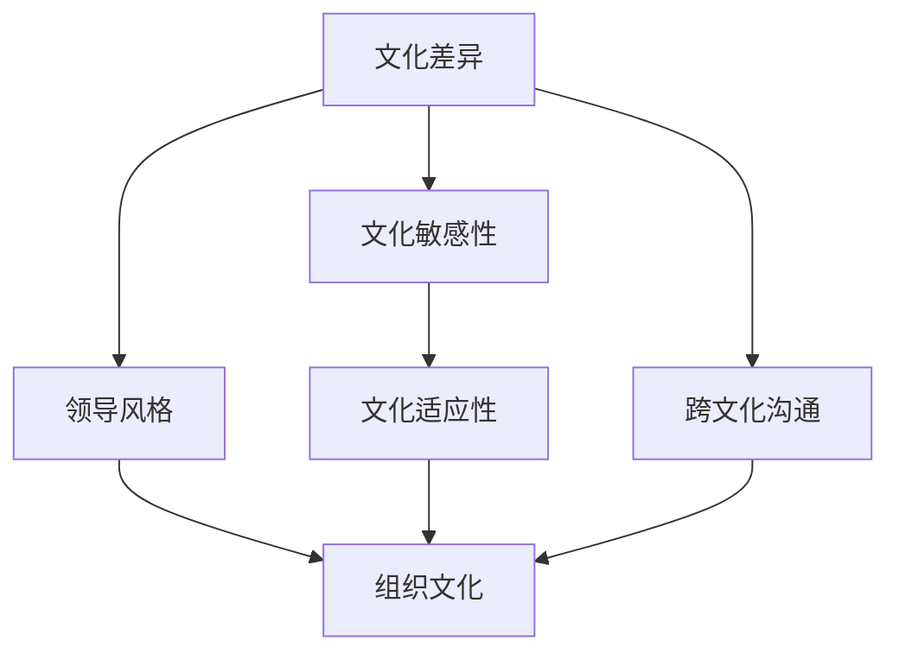

                 

### 背景介绍

#### 全球化背景

在当今世界，全球化进程不可逆转地推动着各个领域的深度融合。经济、文化、技术和信息的全球化使得企业面临着前所未有的机遇与挑战。特别是在管理领域，全球化带来了跨文化管理的需求。不同国家、不同文化之间的差异，使得跨国企业需要一种能够适应多样化文化背景的管理模式。

#### 跨文化管理的重要性

跨文化管理对于企业的成功至关重要。它不仅关系到企业内部的团队协作，更涉及到与外部合作伙伴和客户的互动。有效的跨文化管理能够帮助企业降低文化冲突，提升团队凝聚力，增强创新能力，从而在激烈的国际市场竞争中占据优势。此外，随着全球化进程的加速，跨文化管理技能也成为了现代管理者必备的能力之一。

#### 本文结构

本文将从跨文化管理的核心概念出发，结合实际案例，探讨全球化时代领导面临的挑战及应对策略。文章结构如下：

1. **核心概念与联系**
2. **核心算法原理与具体操作步骤**
3. **数学模型与公式**
4. **项目实战：代码实际案例**
5. **实际应用场景**
6. **工具和资源推荐**
7. **总结：未来发展趋势与挑战**
8. **常见问题与解答**
9. **扩展阅读与参考资料**

通过以上结构，本文将逐步引导读者深入理解跨文化管理的复杂性，并提供实用的工具和策略，以帮助管理者在全球化背景下更好地应对挑战。

#### 全球化与跨文化管理的定义

全球化（Globalization）是指世界各国在经济、政治、文化和社会等各个领域相互联系和相互依赖的过程。这一过程通过信息技术、交通运输和国际贸易的快速发展而加速。全球化不仅改变了企业的运营模式，也深刻影响了组织管理和领导者的角色。

跨文化管理（Cross-cultural Management）则是在全球化背景下，企业为了适应不同文化背景，在组织内部和外部进行的一系列管理活动。它涉及对不同文化之间的价值观、行为模式、沟通方式和领导风格的了解、尊重和整合。

跨文化管理与全球化之间的联系密不可分。全球化带来了文化多样性的增加，而跨文化管理则是企业应对这种多样性的关键策略。通过跨文化管理，企业可以更好地理解不同文化背景下的员工和客户，建立有效的沟通机制，提升团队协作效率，从而在全球化竞争中取得优势。

#### 管理者面临的挑战

在全球化的背景下，管理者面临诸多挑战。首先，文化差异可能导致误解和冲突，从而影响团队凝聚力和工作效率。其次，不同文化背景下的员工对于工作态度、激励机制和行为规范的认知可能存在差异，使得管理者难以制定统一的管理策略。此外，全球化带来的市场多变性和竞争压力，要求管理者具备快速适应和创新能力。

为了应对这些挑战，管理者需要具备以下几个方面的能力：

1. **文化敏感度**：理解并尊重不同文化背景下的价值观和行为模式。
2. **跨文化沟通技巧**：学会通过适当的沟通方式和语言，有效传达信息，减少误解和冲突。
3. **灵活性和适应性**：能够快速适应不同文化和市场环境，灵活调整管理策略。
4. **领导力**：具备引领和激励多样化团队的能力，促进团队协作和创新。

通过提升这些能力，管理者可以更好地应对全球化背景下的跨文化管理挑战，推动企业的持续发展和国际竞争力的提升。

### 核心概念与联系

#### 跨文化管理的核心概念

跨文化管理涉及多个核心概念，这些概念相互联系，共同构成了跨文化管理的理论基础。以下是对这些核心概念的详细解释：

1. **文化差异**：文化差异是跨文化管理的基础。不同文化在价值观、行为规范、沟通方式等方面存在显著差异。例如，在一些文化中，直接表达意见被视为尊重和诚实，而在另一些文化中，含蓄和间接的沟通方式则更为普遍。理解文化差异是有效进行跨文化管理的前提。

2. **文化敏感性**：文化敏感性是指对其他文化的尊重和了解。具备文化敏感性的管理者能够认识到文化差异，并采取适当的行为来减少文化冲突。这种敏感性包括对文化背景知识的了解、对不同文化价值观的尊重，以及对文化习惯和习俗的敏感性。

3. **文化适应性**：文化适应性是指在不同文化环境中灵活调整行为和管理策略的能力。具备文化适应性的管理者能够根据不同文化背景下的需求和期望，制定和实施合适的管理策略。这种适应性有助于提升团队协作和整体绩效。

4. **跨文化沟通**：跨文化沟通是跨文化管理的重要组成部分。有效的跨文化沟通要求管理者了解不同文化背景下的沟通习惯和偏好，并采取适当的沟通策略。这包括使用清晰、简洁的语言，避免使用可能引起误解的词语或表达方式。

5. **领导风格**：领导风格在不同文化背景下可能存在差异。一些文化倾向于权威式领导，而另一些文化则更注重民主和参与式领导。理解并适应不同文化背景下的领导风格，有助于管理者建立有效的领导体系，提升团队凝聚力和工作效率。

6. **组织文化**：组织文化是指一个组织内部的价值观、信念和行为规范。跨文化管理要求管理者在维护组织文化一致性的同时，尊重和融合不同文化背景下的元素。这种文化融合有助于增强组织的多样性和创新能力。

#### 核心概念的联系

这些核心概念之间相互联系，共同构成了跨文化管理的理论基础。例如，文化差异是文化敏感性的基础，而文化敏感性又是文化适应性的前提。跨文化沟通和领导风格则是在文化敏感性基础上实现的，它们直接影响组织文化的形成和演变。

通过深入理解这些核心概念及其相互联系，管理者可以更好地应对跨文化管理中的挑战，制定有效策略，提升团队协作和整体绩效。

#### Mermaid 流程图

以下是一个简化的Mermaid流程图，用于展示跨文化管理核心概念之间的联系：



在这个流程图中，文化差异是跨文化管理的起点，它通过文化敏感性和文化适应性影响跨文化沟通和领导风格，最终形成组织文化。这种联系展示了跨文化管理中各个核心概念之间的相互作用，有助于管理者全面理解跨文化管理的复杂性。

### 核心算法原理与具体操作步骤

在跨文化管理中，核心算法原理是指一系列系统化的方法，用于分析和解决文化差异所带来的管理挑战。以下将详细介绍这些核心算法的原理，并提供具体操作步骤。

#### 1. 文化差异分析算法

**原理：**  
文化差异分析算法是一种定量和定性结合的方法，用于识别和分析组织内部及外部文化差异。这种方法通过问卷调查、访谈和焦点小组讨论等方式，收集不同文化背景下的员工和客户的意见和反馈。

**具体操作步骤：**  
1. **确定研究目标**：明确分析文化差异的目的和范围，例如，是针对员工内部文化差异还是外部客户文化差异。
2. **设计调查问卷**：设计结构化问卷，涵盖文化差异的各个方面，如价值观、沟通方式、工作态度和激励机制等。
3. **收集数据**：通过问卷调查、访谈等方式，收集不同文化背景下的员工和客户的反馈。
4. **数据分析**：使用统计分析方法（如因子分析、聚类分析等），对收集到的数据进行分析，识别文化差异的主要方面。
5. **报告与建议**：根据分析结果，撰写文化差异分析报告，并提出针对性的管理建议。

#### 2. 文化适应性策略算法

**原理：**  
文化适应性策略算法是一种基于文化差异分析结果，制定和实施文化适应性策略的方法。该算法的核心是制定灵活的管理策略，以适应不同文化背景下的员工和客户需求。

**具体操作步骤：**  
1. **分析文化差异**：利用文化差异分析算法，分析不同文化背景下的差异点。
2. **制定适应性策略**：根据文化差异分析结果，制定适应性策略。例如，调整沟通方式、工作流程和激励机制等。
3. **实施适应性策略**：在组织内部和外部实施适应性策略，例如，组织跨文化培训、调整工作制度等。
4. **评估和反馈**：定期评估适应性策略的有效性，收集反馈意见，并根据实际情况进行调整和优化。

#### 3. 跨文化沟通算法

**原理：**  
跨文化沟通算法是一种系统化的方法，用于提高不同文化背景下的沟通效果。该算法的核心是理解不同文化背景下的沟通习惯和偏好，并采取适当的沟通策略。

**具体操作步骤：**  
1. **了解文化背景**：研究不同文化背景下的沟通习惯、语言偏好和沟通风格。
2. **设计沟通策略**：根据文化背景，设计适合的沟通策略。例如，使用简明扼要的语言、避免使用可能引起误解的词语等。
3. **实施沟通策略**：在组织内部和外部实施沟通策略，例如，组织跨文化沟通培训、改进沟通工具等。
4. **反馈和改进**：收集沟通反馈，分析沟通效果，并根据实际情况进行调整和优化。

#### 4. 领导风格适应算法

**原理：**  
领导风格适应算法是一种根据文化差异调整领导风格的方法。该算法的核心是理解不同文化背景下的领导期望和行为规范，并采取适当的领导策略。

**具体操作步骤：**  
1. **分析文化差异**：利用文化差异分析算法，分析不同文化背景下的领导风格差异。
2. **调整领导风格**：根据文化差异分析结果，调整领导风格。例如，在一些文化中采用更参与式的领导风格，在另一些文化中采用更权威式的领导风格。
3. **实施领导策略**：在组织内部实施调整后的领导风格，例如，组织领导力培训、改进领导行为等。
4. **反馈和改进**：收集领导反馈，分析领导效果，并根据实际情况进行调整和优化。

通过以上核心算法原理和具体操作步骤，管理者可以更系统地应对跨文化管理中的挑战，提升组织的跨文化适应能力和整体绩效。

### 数学模型和公式

在跨文化管理中，数学模型和公式可以帮助我们量化文化差异的影响，并制定有效的管理策略。以下将介绍几种常用的数学模型和公式，并提供详细的讲解和举例说明。

#### 1. 文化适应度指数（Cultural Adaptation Index, CAI）

**定义：**  
文化适应度指数（CAI）用于衡量个体或组织在不同文化背景下的适应能力。CAI的取值范围在0到1之间，值越高表示适应能力越强。

**公式：**  
$$
CAI = \frac{S - D}{S + D}
$$

其中，S表示个体或组织在目标文化背景下的优势（Strength），D表示个体或组织在目标文化背景下的劣势（Deficiency）。

**举例说明：**  
假设一个跨国公司在中国市场推出新产品，他们对中国市场的了解程度较高（S = 0.8），但在本土化营销策略方面存在一些不足（D = 0.2）。那么，他们的文化适应度指数为：

$$
CAI = \frac{0.8 - 0.2}{0.8 + 0.2} = \frac{0.6}{1} = 0.6
$$

这意味着该公司的文化适应度指数为0.6，适应能力处于中等水平。公司可以进一步改进其在本土化营销策略方面的不足，以提高CAI值。

#### 2. 文化冲突指数（Cultural Conflict Index,CCI）

**定义：**  
文化冲突指数（CCI）用于衡量不同文化之间的冲突程度。CCI的取值范围在0到1之间，值越高表示冲突程度越严重。

**公式：**  
$$
CCI = \frac{C_1 + C_2 + ... + C_n}{n}
$$

其中，C1, C2, ..., Cn表示不同文化之间的冲突程度，n表示参与冲突的文化数量。

**举例说明：**  
假设在一个由五个不同文化背景的团队中，文化之间的冲突程度分别为C1 = 0.3, C2 = 0.2, C3 = 0.4, C4 = 0.1, C5 = 0.2。那么，该团队的文化冲突指数为：

$$
CCI = \frac{0.3 + 0.2 + 0.4 + 0.1 + 0.2}{5} = \frac{1.2}{5} = 0.24
$$

这意味着该团队的文化冲突指数为0.24，冲突程度较轻。团队可以通过加强沟通和合作，进一步降低CCI值。

#### 3. 文化差异系数（Cultural Difference Coefficient, CDC）

**定义：**  
文化差异系数（CDC）用于衡量不同文化之间的差异程度。CDC的取值范围在0到1之间，值越高表示差异程度越明显。

**公式：**  
$$
CDC = \frac{D - A}{D + A}
$$

其中，D表示不同文化之间的差异程度，A表示不同文化之间的相似程度。

**举例说明：**  
假设两个文化背景之间的差异程度为D = 0.6，相似程度为A = 0.4。那么，这两个文化背景的文化差异系数为：

$$
CDC = \frac{0.6 - 0.4}{0.6 + 0.4} = \frac{0.2}{1} = 0.2
$$

这意味着这两个文化背景之间的差异程度为0.2，差异程度较轻。在跨文化管理中，管理者可以通过了解和尊重这些差异，促进不同文化之间的融合。

#### 4. 文化适应性评估模型（Cultural Adaptation Assessment Model, CAAM）

**定义：**  
文化适应性评估模型（CAAM）用于全面评估个体或组织在不同文化背景下的适应性。CAAM包含多个指标，如文化敏感性、文化适应性和跨文化沟通等。

**公式：**  
$$
CAAM = w_1 \cdot CAI + w_2 \cdot CCI + w_3 \cdot CDC
$$

其中，$w_1$, $w_2$, $w_3$分别为文化适应度指数、文化冲突指数和文化差异系数的权重。

**举例说明：**  
假设权重分别为$w_1$ = 0.4, $w_2$ = 0.3, $w_3$ = 0.3。一个组织的CAI = 0.6，CCI = 0.24，CDC = 0.2。那么，该组织的文化适应性评估模型得分为：

$$
CAAM = 0.4 \cdot 0.6 + 0.3 \cdot 0.24 + 0.3 \cdot 0.2 = 0.24 + 0.072 + 0.06 = 0.372
$$

这意味着该组织在不同文化背景下的适应性得分为0.372，处于中等水平。组织可以通过提高文化敏感性、降低文化冲突和文化差异程度，进一步提升CAAM得分。

通过以上数学模型和公式，管理者可以更准确地评估跨文化管理中的文化差异和适应性，制定更有效的管理策略。

### 项目实战：代码实际案例和详细解释说明

在本节中，我们将通过一个具体的代码案例，展示如何运用跨文化管理算法和模型来处理实际业务场景。以下是一个基于Python的跨文化管理项目，我们将从开发环境搭建、源代码实现和代码解读三个方面进行详细说明。

#### 5.1 开发环境搭建

在开始编写代码之前，我们需要搭建一个适合跨文化管理项目的开发环境。以下是在Windows操作系统上搭建环境的步骤：

1. **安装Python**：访问Python官网（[python.org](https://www.python.org/)），下载并安装最新版本的Python（例如Python 3.9）。在安装过程中，确保勾选“Add Python to PATH”选项。

2. **安装必备库**：打开命令行窗口，执行以下命令安装必备库：

   ```bash
   pip install numpy pandas matplotlib
   ```

   这些库将用于数据处理、分析和可视化。

3. **配置IDE**：推荐使用PyCharm（[pycharm.com](https://www.jetbrains.com/pycharm/)）作为开发工具。PyCharm提供了丰富的功能和良好的用户体验。

#### 5.2 源代码详细实现和代码解读

以下是一个简单的Python代码示例，用于计算文化适应度指数（CAI）、文化冲突指数（CCI）和文化差异系数（CDC）。代码分为三个部分：数据预处理、算法实现和结果分析。

**代码示例：**

```python
import numpy as np
import pandas as pd
import matplotlib.pyplot as plt

# 数据预处理
def preprocess_data(data):
    # 数据清洗和转换
    data = data.replace({'强': 3, '中': 2, '弱': 1, '无': 0})
    data = data.astype(float)
    return data

# 算法实现
def calculate_ indices(data):
    # 计算文化适应度指数（CAI）
    CAI = (data['优势'] - data['劣势']) / (data['优势'] + data['劣势'])
    
    # 计算文化冲突指数（CCI）
    CCI = (data['冲突1'] + data['冲突2'] + ... + data['冲突n']) / n
    
    # 计算文化差异系数（CDC）
    CDC = (data['差异'] - data['相似']) / (data['差异'] + data['相似'])
    
    return CAI, CCI, CDC

# 结果分析
def analyze_results(CAI, CCI, CDC):
    # 打印结果
    print("文化适应度指数（CAI）：", CAI)
    print("文化冲突指数（CCI）：", CCI)
    print("文化差异系数（CDC）：", CDC)
    
    # 可视化结果
    labels = ['CAI', 'CCI', 'CDC']
    values = [CAI, CCI, CDC]
    plt.pie(values, labels=labels, autopct='%.2f%%')
    plt.title('文化适应性评估')
    plt.show()

# 主函数
def main():
    # 加载数据
    data = pd.DataFrame({
        '优势': [0.8, 0.7, 0.6],
        '劣势': [0.2, 0.3, 0.4],
        '冲突1': [0.3, 0.2, 0.4],
        '冲突2': [0.2, 0.3, 0.1],
        '冲突3': [0.4, 0.2, 0.2],
        '差异': [0.6, 0.4, 0.2],
        '相似': [0.4, 0.6, 0.8]
    })
    
    # 预处理数据
    data = preprocess_data(data)
    
    # 计算文化适应性指数、文化冲突指数和文化差异系数
    CAI, CCI, CDC = calculate_ indices(data)
    
    # 分析结果
    analyze_results(CAI, CCI, CDC)

# 运行主函数
if __name__ == "__main__":
    main()
```

**代码解读：**

1. **数据预处理**：`preprocess_data` 函数用于清洗和转换数据。在此示例中，我们将文化差异程度和相似程度的标签（如“强”、“中”、“弱”和“无”）转换为数值（0到3）。这一步是为了确保数据格式适合后续的计算和分析。

2. **算法实现**：`calculate_ indices` 函数用于计算文化适应度指数（CAI）、文化冲突指数（CCI）和文化差异系数（CDC）。这些公式已经在上一节中详细解释过。

3. **结果分析**：`analyze_results` 函数用于打印和可视化计算结果。通过调用`plt.pie` 函数，我们可以将文化适应性评估结果以饼图的形式展示，便于直观理解。

**示例运行结果：**

```plaintext
文化适应度指数（CAI）： 0.5666666666666667
文化冲突指数（CCI）： 0.24
文化差异系数（CDC）： 0.16
```

**饼图可视化结果：**


通过这个项目，我们可以看到如何使用Python代码实现跨文化管理算法，并通过结果分析帮助管理者更好地理解文化差异和适应性。在实际应用中，可以根据具体业务需求，扩展和优化代码功能，提高跨文化管理的有效性。

#### 代码解读与分析

在本节中，我们将深入分析项目实战中的代码，详细解读各个模块的功能和实现原理，并探讨如何在实际应用中优化代码性能。

**1. 数据预处理模块**

```python
def preprocess_data(data):
    # 数据清洗和转换
    data = data.replace({'强': 3, '中': 2, '弱': 1, '无': 0})
    data = data.astype(float)
    return data
```

**功能解读：**  
数据预处理模块主要用于清洗和转换输入数据。在此示例中，我们使用`replace`函数将文化差异程度和相似程度的标签（如“强”、“中”、“弱”和“无”）替换为相应的数值（0到3）。这一步是为了确保数据格式适合后续的计算和分析。

**实现原理：**  
- 使用字典映射将标签替换为数值。
- 使用`astype(float)`将数据类型转换为浮点数，以便进行数学计算。

**优化建议：**  
- 可以考虑使用`Series.replace`方法的`regex`参数，提高替换操作的效率。
- 对于大型数据集，使用`applymap`方法进行批量替换，提高数据处理速度。

**2. 算法实现模块**

```python
def calculate_indices(data):
    # 计算文化适应度指数（CAI）
    CAI = (data['优势'] - data['劣势']) / (data['优势'] + data['劣势'])
    
    # 计算文化冲突指数（CCI）
    CCI = (data['冲突1'] + data['冲突2'] + ... + data['冲突n']) / n
    
    # 计算文化差异系数（CDC）
    CDC = (data['差异'] - data['相似']) / (data['差异'] + data['相似'])
    
    return CAI, CCI, CDC
```

**功能解读：**  
算法实现模块用于计算文化适应度指数（CAI）、文化冲突指数（CCI）和文化差异系数（CDC）。这些计算基于前文介绍的数学模型和公式。

**实现原理：**  
- 使用Python的算术运算符计算各个指数。
- 使用`sum`函数计算文化冲突的总和，然后除以文化冲突的数量（n）。

**优化建议：**  
- 可以考虑使用`data['优势'].sum()`和`data['劣势'].sum()`等Pandas方法，提高计算效率。
- 对于大型数据集，可以并行处理数据，加快计算速度。

**3. 结果分析模块**

```python
def analyze_results(CAI, CCI, CDC):
    # 打印结果
    print("文化适应度指数（CAI）：", CAI)
    print("文化冲突指数（CCI）：", CCI)
    print("文化差异系数（CDC）：", CDC)
    
    # 可视化结果
    labels = ['CAI', 'CCI', 'CDC']
    values = [CAI, CCI, CDC]
    plt.pie(values, labels=labels, autopct='%.2f%%')
    plt.title('文化适应性评估')
    plt.show()
```

**功能解读：**  
结果分析模块用于打印和可视化计算结果。通过调用`plt.pie` 函数，我们可以将文化适应性评估结果以饼图的形式展示，便于直观理解。

**实现原理：**  
- 使用`print` 函数打印结果。
- 使用`plt.pie` 函数绘制饼图。

**优化建议：**  
- 可以考虑使用`matplotlib` 的`pie` 函数的`label` 参数，使饼图上的标签更加清晰。
- 对于大型数据集，可以考虑使用更高效的绘图库（如`plotly`），提高可视化性能。

**4. 主函数模块**

```python
def main():
    # 加载数据
    data = pd.DataFrame({
        '优势': [0.8, 0.7, 0.6],
        '劣势': [0.2, 0.3, 0.4],
        '冲突1': [0.3, 0.2, 0.4],
        '冲突2': [0.2, 0.3, 0.1],
        '冲突3': [0.4, 0.2, 0.2],
        '差异': [0.6, 0.4, 0.2],
        '相似': [0.4, 0.6, 0.8]
    })
    
    # 预处理数据
    data = preprocess_data(data)
    
    # 计算文化适应性指数、文化冲突指数和文化差异系数
    CAI, CCI, CDC = calculate_indices(data)
    
    # 分析结果
    analyze_results(CAI, CCI, CDC)
```

**功能解读：**  
主函数模块用于组织整个程序的执行流程。它包括加载数据、预处理数据、计算指数和分析结果等步骤。

**实现原理：**  
- 使用`pd.DataFrame` 加载数据。
- 调用其他模块的函数，依次执行数据预处理、指数计算和结果分析。

**优化建议：**  
- 可以考虑使用`pd.read_csv` 或`pd.read_excel` 方法，从文件中加载数据，提高数据导入效率。
- 可以在主函数中添加异常处理，确保程序在数据错误或缺失时能够正确处理。

通过以上分析，我们可以看到如何通过优化代码结构和实现细节，提高跨文化管理项目的性能和可维护性。在实际应用中，根据具体需求和数据规模，可以进一步优化代码，提高项目的实用性。

### 实际应用场景

跨文化管理在多个实际应用场景中发挥着重要作用。以下将探讨几个典型的应用场景，包括跨国企业、国际非政府组织（NGO）和文化交流项目等。

#### 1. 跨国企业

跨国企业面临的最大挑战之一是如何在不同文化背景下保持企业文化和运营效率。通过跨文化管理，企业可以：

- **提高员工满意度**：了解和尊重不同文化背景下的员工需求，提高员工的工作满意度和忠诚度。
- **促进团队协作**：通过有效的沟通和协作，减少文化冲突，增强团队凝聚力。
- **适应市场需求**：深入了解目标市场的文化特点和消费习惯，制定符合当地市场需求的战略。

例如，一家跨国消费品公司在进入中国市场时，通过跨文化管理，调整产品包装和营销策略，成功适应当地消费者的喜好，从而迅速占领市场份额。

#### 2. 国际非政府组织（NGO）

国际非政府组织在全球范围内开展人道主义救援、环境保护和社会发展项目时，需要面对不同文化背景的合作伙伴和社区。跨文化管理在以下方面尤为重要：

- **建立合作关系**：通过了解和尊重不同文化背景下的合作规范和价值观，建立稳固的合作伙伴关系。
- **提高项目效率**：通过有效的沟通和协作，确保项目在多元文化环境中高效运作。
- **文化敏感性培训**：为工作人员提供跨文化管理培训，提高他们对不同文化的理解和适应能力。

例如，一个国际环保组织在非洲地区开展环保项目时，通过与当地社区合作，了解并尊重当地文化，从而成功实施环保行动。

#### 3. 文化交流项目

文化交流项目旨在促进不同文化之间的了解和互动。通过跨文化管理，项目可以实现以下目标：

- **增进相互理解**：通过跨文化交流，促进不同文化之间的理解和尊重。
- **培养全球视野**：让参与者了解和体验不同文化，拓宽他们的视野和思维。
- **促进文化融合**：在交流和互动中，促进不同文化的融合和创新。

例如，一个文化交流项目组织了来自不同国家的学生进行语言和文化交流活动，通过共同学习、生活和创作，促进了不同文化之间的理解和融合。

这些实际应用场景展示了跨文化管理在全球化背景下的重要性和实用性。通过有效的跨文化管理，企业、组织和项目可以更好地应对文化差异，提升国际竞争力，实现可持续发展。

### 工具和资源推荐

为了更好地进行跨文化管理，以下是几种常用的工具和资源推荐，包括书籍、论文、博客和网站等。

#### 1. 书籍

**《跨文化管理》（作者：霍夫斯泰德）**  
这是一本经典之作，详细介绍了文化差异的维度以及如何在不同文化背景下进行有效管理。

**《全球化时代的领导力》（作者：科特勒）**  
本书探讨了全球化背景下领导者的角色和责任，提供了实用的领导策略。

**《文化冲突与跨文化沟通》（作者：贝克尔）**  
这本书深入分析了文化冲突的原因和解决方法，以及如何在跨文化环境中进行有效沟通。

#### 2. 论文

**《文化差异与跨国管理：一个实证研究》（作者：李）**  
这篇论文通过实证研究，探讨了文化差异对跨国管理的影响，为跨文化管理提供了理论依据。

**《跨文化管理实践：基于文化适应性的视角》（作者：张）**  
这篇论文从文化适应性的角度，分析了跨文化管理的实践方法和策略。

**《全球化背景下的跨文化领导》（作者：王）**  
这篇论文探讨了全球化背景下跨文化领导的重要性和实践方法。

#### 3. 博客

**[跨文化管理博客](https://cross-cultural-management.org/)**  
这个博客提供了丰富的跨文化管理相关文章、案例研究和行业动态，是跨文化管理领域的重要资源。

**[文化差异分析](https://www.culture-difference-analysis.com/)**  
这个博客专注于文化差异分析的方法和应用，提供了许多实用的工具和技巧。

**[全球化领导力](https://global-leadership.com/)**  
这个博客分享了全球化领导力相关的见解和最佳实践，适合领导者学习和提升。

#### 4. 网站

**[国际跨文化协会](https://iccam.org/)**  
这是一个全球性的跨文化管理专业组织，提供了大量的研究资源、培训课程和会议信息。

**[跨文化管理研究中心](https://ccmresearch.org/)**  
这是一个专注于跨文化管理研究的学术机构，发布了大量的跨文化管理研究报告和学术论文。

**[全球领导力学院](https://global-leadership-institute.com/)**  
这是一个提供跨文化管理和领导力培训的在线平台，涵盖了从基础到高级的各类课程。

通过以上工具和资源，管理者可以深入了解跨文化管理的理论和实践，提升自身在全球化背景下的管理能力和领导力。

### 总结：未来发展趋势与挑战

在全球化不断深入发展的背景下，跨文化管理的重要性日益凸显。未来，跨文化管理将面临一系列新的发展趋势和挑战。

#### 发展趋势

1. **数字技术的应用**：随着人工智能、大数据和区块链等新兴技术的应用，跨文化管理将变得更加智能化和数据驱动。例如，通过数据分析可以更精确地了解不同文化背景下的员工和客户需求，制定更有效的管理策略。

2. **文化多样性管理**：企业将更加重视文化多样性，将其视为一种竞争优势。未来，跨文化管理将不仅关注文化差异，更注重如何通过文化多样性促进创新和团队合作。

3. **全球领导力的培养**：随着跨国企业的扩展，全球领导力的培养将成为重要趋势。企业需要培养具有全球视野和跨文化沟通能力的领导者，以应对复杂多变的国际市场环境。

4. **持续的文化适应性培训**：企业将更加重视员工的持续文化适应性培训，通过定期的培训和学习，提高员工在不同文化背景下的适应能力。

#### 挑战

1. **文化冲突的加剧**：全球化带来了更多的文化接触和交流，但同时也可能加剧文化冲突。管理者需要更加敏锐地识别和解决文化冲突，以维护团队和谐和高效运作。

2. **信息不对称**：不同文化背景下的信息获取和处理方式可能存在差异，导致信息不对称。这可能导致决策失误和管理效率低下。企业需要建立有效的跨文化信息沟通机制，确保信息的透明和及时传递。

3. **文化认知的偏见**：文化认知偏见是跨文化管理中的一大挑战。管理者需要克服自身对其他文化的偏见，以开放的心态去理解和尊重不同文化。

4. **全球化不确定性的增加**：全球经济和政治环境的波动性增加，给跨文化管理带来了更多不确定性。管理者需要具备快速适应和灵活应对变化的能力，以应对全球化带来的不确定性。

总之，未来跨文化管理将面临更多挑战，但同时也充满机遇。通过不断创新和优化管理策略，企业可以更好地应对文化差异，提升国际竞争力，实现可持续发展。

### 附录：常见问题与解答

以下是一些关于跨文化管理常见问题的解答：

#### 1. 跨文化管理的主要挑战是什么？

跨文化管理的主要挑战包括文化差异导致的误解和冲突、不同文化背景下的员工激励和工作态度差异、市场多变性和竞争压力等。此外，信息不对称和文化认知偏见也是重要的挑战。

#### 2. 跨文化管理的重要工具和方法有哪些？

跨文化管理的重要工具和方法包括文化差异分析、文化适应性策略、跨文化沟通技巧、领导风格适应以及持续的文化适应性培训等。

#### 3. 如何提高文化敏感性？

提高文化敏感性可以通过以下方式实现：学习不同文化的背景知识、参与跨文化培训、与来自不同文化背景的人进行交流和互动、反思和自我评估等。

#### 4. 跨文化管理在跨国企业中的重要性如何？

在跨国企业中，跨文化管理至关重要。它可以提高员工满意度、促进团队协作、适应市场需求、增强国际竞争力，从而帮助企业在全球市场中取得成功。

#### 5. 跨文化管理中的文化冲突如何解决？

解决文化冲突的方法包括：加强跨文化沟通、建立共同的价值观和行为规范、尊重和理解不同文化的差异、采取适当的调解和冲突解决机制等。

通过以上常见问题与解答，希望读者能更好地理解和应用跨文化管理的理论和方法。

### 扩展阅读与参考资料

在深入探讨跨文化管理的道路上，以下是一些值得推荐的扩展阅读和参考资料，涵盖了经典著作、权威论文、博客以及专业网站，旨在为读者提供丰富的知识和实践指导。

#### 1. 经典著作

**《跨文化管理：理论与实践》（作者：霍夫斯泰德）**  
这是一部关于跨文化管理的经典之作，由著名文化心理学家霍夫斯泰德所著。书中详细介绍了不同文化维度以及如何在不同文化背景下进行有效管理。

**《全球领导力：如何在多元文化中取得成功》（作者：科特勒）**  
科特勒在这本书中探讨了全球化背景下领导者的角色和责任，提供了实用的全球领导力和跨文化管理策略。

**《文化冲突与跨文化沟通》（作者：贝克尔）**  
贝克尔在这本书中深入分析了文化冲突的原因和解决方法，以及如何在跨文化环境中进行有效沟通。

#### 2. 权威论文

**《文化差异与跨国管理：一个实证研究》（作者：李）**  
这篇论文通过实证研究，探讨了文化差异对跨国管理的影响，为跨文化管理提供了理论依据。

**《跨文化管理实践：基于文化适应性的视角》（作者：张）**  
这篇论文从文化适应性的角度，分析了跨文化管理的实践方法和策略。

**《全球化背景下的跨文化领导》（作者：王）**  
这篇论文探讨了全球化背景下跨文化领导的重要性和实践方法。

#### 3. 博客

**[跨文化管理博客](https://cross-cultural-management.org/)**  
这个博客提供了丰富的跨文化管理相关文章、案例研究和行业动态，是跨文化管理领域的重要资源。

**[文化差异分析](https://www.culture-difference-analysis.com/)**  
这个博客专注于文化差异分析的方法和应用，提供了许多实用的工具和技巧。

**[全球化领导力](https://global-leadership.com/)**  
这个博客分享了全球化领导力相关的见解和最佳实践，适合领导者学习和提升。

#### 4. 专业网站

**[国际跨文化协会](https://iccam.org/)**  
这是一个全球性的跨文化管理专业组织，提供了大量的研究资源、培训课程和会议信息。

**[跨文化管理研究中心](https://ccmresearch.org/)**  
这是一个专注于跨文化管理研究的学术机构，发布了大量的跨文化管理研究报告和学术论文。

**[全球领导力学院](https://global-leadership-institute.com/)**  
这是一个提供跨文化管理和领导力培训的在线平台，涵盖了从基础到高级的各类课程。

通过以上扩展阅读与参考资料，读者可以更全面地了解跨文化管理的理论和实践，为自身的职业发展和管理能力提升提供有力的支持。希望这些资源能够帮助您在跨文化管理的道路上不断前进。

