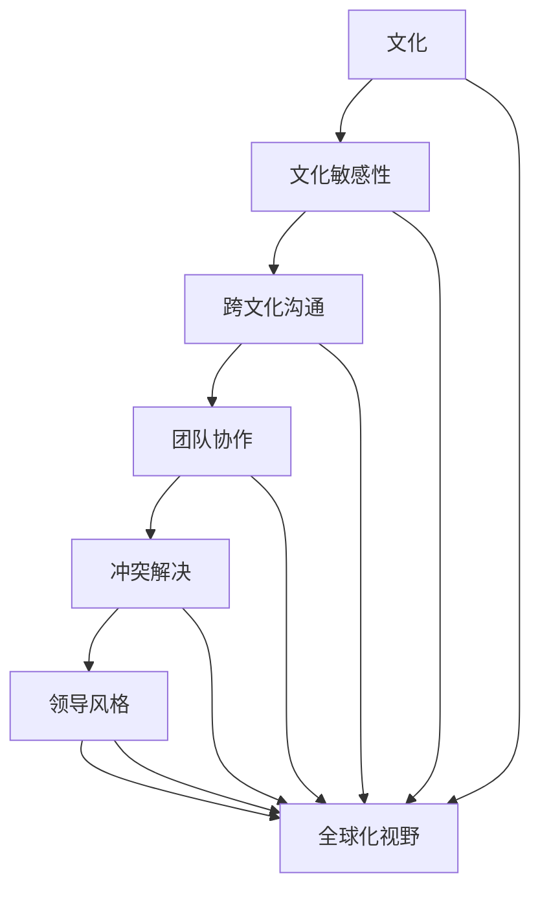

                 

### 背景介绍

#### 全球化时代的来临

随着信息技术和交通运输的迅猛发展，全球化已成为当今世界不可避免的趋势。跨国企业和国际组织如雨后春笋般涌现，人类间的交流和互动变得更加频繁。然而，这种全球化的趋势不仅带来了经济和文化的繁荣，也带来了文化差异的挑战。不同国家和地区的语言、价值观、习俗等差异，使得跨文化沟通和协作成为一项至关重要的任务。

#### 跨文化领导力的定义与重要性

跨文化领导力指的是在多元文化环境中，领导者在理解、适应、协调和促进不同文化间的合作与交流中展现出的能力。这种能力不仅包括对文化差异的敏感性，还涉及到跨文化沟通、团队合作、冲突解决等方面的实际操作技能。在全球化时代，跨文化领导力已成为企业、组织和个人成功的关键因素。

跨文化领导力的重要性体现在以下几个方面：

1. **提升团队绩效**：跨文化团队通常拥有多样化的技能和知识，但如果不具备良好的跨文化领导力，可能会导致沟通障碍和冲突，从而影响团队绩效。

2. **拓展国际市场**：企业在全球化市场中竞争，需要了解并适应当地文化，跨文化领导力有助于企业更好地融入当地市场，提高市场占有率。

3. **促进全球化进程**：政府、国际组织和非政府组织等在推动全球治理、国际合作和可持续发展方面也需要跨文化领导力，以实现不同国家和地区的协同合作。

4. **个人发展**：具备跨文化领导力的人更容易在全球化背景下获得职业发展和国际认可，提高个人竞争力。

#### 文章目的与结构

本文旨在深入探讨跨文化领导力的核心概念、理论框架、实践方法及其在全球化和技术进步背景下的重要性和应用。文章结构如下：

1. **核心概念与联系**：介绍跨文化领导力的关键概念，并使用 Mermaid 流程图展示其理论框架。

2. **核心算法原理与具体操作步骤**：分析跨文化领导力的具体实施策略和技巧。

3. **数学模型和公式**：探讨跨文化领导力背后的数学原理，并提供详细讲解和实例说明。

4. **项目实战**：通过实际代码案例，展示如何运用跨文化领导力原理解决实际问题。

5. **实际应用场景**：讨论跨文化领导力在不同行业和领域中的应用。

6. **工具和资源推荐**：推荐相关学习资源和开发工具，以帮助读者进一步深入了解和应用跨文化领导力。

7. **总结：未来发展趋势与挑战**：展望跨文化领导力在全球化和技术进步背景下的未来发展趋势和面临的挑战。

8. **附录：常见问题与解答**：提供关于跨文化领导力的常见问题及其解答。

9. **扩展阅读与参考资料**：推荐进一步阅读的相关文献和资源。

通过本文的深入探讨，我们希望能够为读者提供关于跨文化领导力的全面理解和实际应用指导，以帮助他们在全球化背景下取得成功。### 核心概念与联系

#### 跨文化领导力的关键概念

跨文化领导力涉及多个关键概念，这些概念相互关联，共同构成了跨文化领导力的理论框架。以下是这些关键概念及其相互关系的简要介绍：

1. **文化**：文化是人们共同拥有的价值观、信仰、习俗、语言和行为模式。文化差异是跨文化领导力需要解决的核心问题。

2. **文化敏感性**：文化敏感性是指领导者对不同文化背景的理解和适应能力。高文化敏感性有助于领导者更好地理解团队成员的文化差异，减少误解和冲突。

3. **跨文化沟通**：跨文化沟通是指在不同文化背景下进行有效沟通的能力。良好的跨文化沟通能够促进团队协作，提高工作绩效。

4. **团队协作**：团队协作是跨文化领导力的核心目标之一。在多元文化团队中，领导者需要促进不同文化背景的成员之间的合作，实现共同目标。

5. **冲突解决**：冲突解决是跨文化领导力的重要方面。跨文化背景下的冲突可能更具复杂性，领导者需要具备有效的冲突解决策略。

6. **领导风格**：领导风格是指领导者在与团队成员互动时采用的策略和方式。跨文化领导力要求领导者能够根据不同文化背景调整领导风格，提高团队凝聚力。

7. **全球化视野**：全球化视野是指领导者对全球化和国际市场的理解和洞察。全球化视野有助于领导者更好地把握全球趋势，制定相应策略。

#### Mermaid 流程图展示

为了更直观地展示跨文化领导力的核心概念及其相互关系，我们可以使用 Mermaid 流程图。以下是跨文化领导力的 Mermaid 流程图：



在这个流程图中，文化是跨文化领导力的起点，其他概念依次关联，形成一个完整的理论框架。通过这个框架，我们可以更好地理解跨文化领导力的各个组成部分及其相互关系。

#### 跨文化领导力的核心原理

跨文化领导力的核心原理可以归纳为以下几点：

1. **尊重与理解**：尊重不同文化背景的团队成员，理解他们的价值观和行为模式，是跨文化领导力的基础。

2. **有效沟通**：建立良好的跨文化沟通机制，确保信息的准确传达和团队成员的充分参与。

3. **文化适应**：领导者需要根据不同文化背景调整自己的行为和策略，以适应多元文化团队的需求。

4. **冲突管理**：跨文化背景下的冲突可能更加复杂，领导者需要具备有效的冲突管理策略，以维护团队和谐。

5. **全球化思维**：领导者需要具备全球视野，了解全球趋势和市场需求，以应对全球化带来的挑战。

通过以上核心原理，领导者可以在多元文化环境中更好地发挥领导作用，推动团队实现共同目标。### 核心算法原理与具体操作步骤

#### 跨文化领导力的算法原理

跨文化领导力的核心在于如何有效地在多元文化环境中实现领导目标。这里，我们可以借鉴算法设计的思路，将跨文化领导力视为一种问题解决算法，其基本原理可以概括为：

1. **识别文化差异**：首先，领导者需要识别团队成员的文化差异，了解他们的价值观、信仰和习俗。这可以通过调查问卷、访谈和观察等方式实现。

2. **建立沟通机制**：在识别文化差异的基础上，领导者需要建立有效的沟通机制，确保信息的准确传达和团队成员的充分参与。这包括跨文化沟通培训、定期团队会议和沟通工具的使用。

3. **调整领导风格**：根据不同文化背景，领导者需要调整自己的领导风格，以适应多元文化团队的需求。这可能包括从权威型领导转向参与型领导，或者从任务导向型转向关系导向型。

4. **文化适应**：领导者需要在行为和策略上做出调整，以适应不同文化背景的团队成员。这包括尊重当地文化习俗、学习当地语言和参与当地社区活动。

5. **冲突管理**：跨文化背景下的冲突可能更具复杂性，领导者需要具备有效的冲突管理策略。这包括理解冲突的本质、建立冲突解决机制和采取适当的调解措施。

6. **持续优化**：跨文化领导力是一个动态过程，领导者需要持续优化自己的领导策略，以应对不断变化的文化环境。

#### 跨文化领导力的具体操作步骤

以下是基于上述算法原理的具体操作步骤：

1. **评估文化差异**：
    - **步骤 1**：进行文化差异调查。可以通过问卷调查、访谈等方式收集团队成员的文化背景信息，如价值观、信仰、教育水平、工作经验等。
    - **步骤 2**：分析调查结果，识别团队成员的文化差异。这有助于领导者了解团队成员的潜在需求和期望。

2. **建立沟通机制**：
    - **步骤 1**：提供跨文化沟通培训。为团队成员提供跨文化沟通技巧的培训，提高他们的文化敏感性。
    - **步骤 2**：定期组织团队会议。通过定期的团队会议，确保团队成员之间的沟通畅通，及时解决问题。
    - **步骤 3**：使用沟通工具。鼓励团队成员使用多样化的沟通工具，如视频会议、即时通讯和协作平台，以适应不同文化背景的沟通需求。

3. **调整领导风格**：
    - **步骤 1**：了解团队成员的文化偏好。通过调查和访谈，了解团队成员对不同领导风格的偏好。
    - **步骤 2**：根据文化偏好调整领导风格。根据团队成员的文化偏好，调整自己的领导风格，以更好地适应团队需求。
    - **步骤 3**：鼓励团队成员参与决策。在决策过程中，鼓励团队成员参与讨论，提高他们的参与度和归属感。

4. **文化适应**：
    - **步骤 1**：学习当地文化习俗。领导者需要学习并尊重当地的文化习俗，以更好地融入团队。
    - **步骤 2**：参与当地社区活动。积极参与当地社区活动，建立良好的人际关系，提高团队凝聚力。
    - **步骤 3**：尊重语言多样性。尊重团队成员的语言多样性，鼓励使用多种语言进行沟通，提高跨文化沟通的效率。

5. **冲突管理**：
    - **步骤 1**：理解冲突的本质。领导者需要理解冲突的根源，避免将冲突归咎于个人。
    - **步骤 2**：建立冲突解决机制。建立有效的冲突解决机制，如设立冲突调解委员会，提供调解和仲裁服务。
    - **步骤 3**：采取适当的调解措施。根据冲突的性质和严重程度，采取适当的调解措施，如谈判、调解或仲裁。

6. **持续优化**：
    - **步骤 1**：收集反馈。定期收集团队成员的反馈，了解跨文化领导力的实施效果。
    - **步骤 2**：评估和调整策略。根据反馈和评估结果，评估跨文化领导力的实施效果，及时调整和优化领导策略。

通过以上具体操作步骤，领导者可以在多元文化环境中有效地实施跨文化领导力，促进团队协作，提高团队绩效。### 数学模型和公式

#### 跨文化领导力的数学模型

跨文化领导力的数学模型可以帮助我们理解跨文化领导力在具体情境中的应用和效果。以下是一个简化的数学模型：

$$
\text{跨文化领导力} = f(\text{文化敏感性}, \text{沟通效率}, \text{团队协作度}, \text{冲突管理能力})
$$

其中，$f$ 表示一个函数，它将文化敏感性、沟通效率、团队协作度和冲突管理能力转化为跨文化领导力的总体效果。

1. **文化敏感性**：表示领导者对不同文化背景的理解和适应能力。文化敏感性越高，领导者在跨文化环境中的表现越好。

2. **沟通效率**：表示团队成员之间沟通的效率和效果。良好的沟通效率有助于减少误解和冲突，提高团队绩效。

3. **团队协作度**：表示团队成员之间的协作程度和合作精神。高团队协作度有助于实现共同目标，提高团队绩效。

4. **冲突管理能力**：表示领导者处理和解决跨文化冲突的能力。有效的冲突管理能力有助于维护团队和谐，提高团队绩效。

#### 模型的详细讲解

为了更深入地理解这个数学模型，我们可以对每个变量进行详细解释。

1. **文化敏感性**：

   文化敏感性可以理解为领导者对不同文化背景的理解和适应能力。它可以由以下几个因素组成：

   - **文化知识**：领导者对文化知识的学习和掌握程度，如不同文化的价值观、习俗和信仰等。
   - **文化体验**：领导者在不同文化环境中的实际经验和经历，如跨文化工作和生活经历。
   - **文化意识**：领导者对文化差异的敏感度和意识，如对文化冲突的预见性和应对策略。

   假设文化敏感性的评估分为三个等级：低、中、高。我们可以用以下公式表示文化敏感性的评估结果：

   $$
   \text{文化敏感性} = \sum_{i=1}^{3} w_i \cdot x_i
   $$

   其中，$w_i$ 表示第 $i$ 个因素的权重，$x_i$ 表示第 $i$ 个因素的具体评估值。

2. **沟通效率**：

   沟通效率表示团队成员之间沟通的效率和效果。它可以由以下几个因素组成：

   - **沟通技能**：团队成员的沟通能力和技巧，如清晰表达、倾听和理解对方意见。
   - **沟通工具**：团队成员使用的沟通工具和平台，如电子邮件、视频会议、即时通讯等。
   - **沟通频率**：团队成员之间的沟通频率和频率，如定期会议、即时反馈和讨论等。

   假设沟通效率的评估分为五个等级：差、一般、较好、良好、优秀。我们可以用以下公式表示沟通效率的评估结果：

   $$
   \text{沟通效率} = \sum_{i=1}^{5} w_i \cdot x_i
   $$

   其中，$w_i$ 表示第 $i$ 个因素的权重，$x_i$ 表示第 $i$ 个因素的具体评估值。

3. **团队协作度**：

   团队协作度表示团队成员之间的协作程度和合作精神。它可以由以下几个因素组成：

   - **团队目标**：团队成员对共同目标的认同和追求程度。
   - **团队信任**：团队成员之间的信任度和信任关系。
   - **团队氛围**：团队成员之间的沟通氛围和协作氛围。

   假设团队协作度的评估分为五个等级：差、一般、较好、良好、优秀。我们可以用以下公式表示团队协作度的评估结果：

   $$
   \text{团队协作度} = \sum_{i=1}^{5} w_i \cdot x_i
   $$

   其中，$w_i$ 表示第 $i$ 个因素的权重，$x_i$ 表示第 $i$ 个因素的具体评估值。

4. **冲突管理能力**：

   冲突管理能力表示领导者处理和解决跨文化冲突的能力。它可以由以下几个因素组成：

   - **冲突意识**：领导者对跨文化冲突的敏感度和意识。
   - **冲突处理策略**：领导者处理和解决冲突的策略和技巧，如调解、仲裁和谈判等。
   - **冲突解决效率**：冲突解决的速度和效果。

   假设冲突管理能力的评估分为五个等级：差、一般、较好、良好、优秀。我们可以用以下公式表示冲突管理能力的评估结果：

   $$
   \text{冲突管理能力} = \sum_{i=1}^{5} w_i \cdot x_i
   $$

   其中，$w_i$ 表示第 $i$ 个因素的权重，$x_i$ 表示第 $i$ 个因素的具体评估值。

#### 举例说明

假设有一个团队，其文化敏感性、沟通效率、团队协作度和冲突管理能力的评估结果如下：

- 文化敏感性：3（高）
- 沟通效率：4（良好）
- 团队协作度：5（优秀）
- 冲突管理能力：3（高）

我们可以将这些评估结果代入数学模型中，计算出该团队的跨文化领导力：

$$
\text{跨文化领导力} = f(3, 4, 5, 3) = \text{良好}
$$

这意味着，该团队的跨文化领导力整体上处于良好水平，但仍有一些提升空间，特别是在冲突管理能力方面。

通过这个数学模型，我们可以定量地评估跨文化领导力，并识别出需要改进的方面，从而更好地提升团队在跨文化环境中的表现。### 项目实战：代码实际案例和详细解释说明

在本节中，我们将通过一个实际的代码案例，展示如何将跨文化领导力的原理应用到软件开发项目中。该项目是一个跨文化团队开发的在线教育平台，旨在为全球用户提供多语言、多文化的学习资源。以下是一个具体的代码实现，我们将对其进行分析和解读。

#### 1. 开发环境搭建

在开始项目之前，我们需要搭建一个适合跨文化团队开发的开发环境。以下是主要工具和框架的推荐：

- **开发语言**：Python
- **Web框架**：Django
- **数据库**：PostgreSQL
- **前端框架**：Bootstrap
- **版本控制系统**：Git
- **代码库**：GitHub

首先，确保安装了 Python 3.8 或更高版本，并配置好虚拟环境。然后，安装 Django、PostgreSQL 和 Git。最后，在 GitHub 上创建一个代码库，以便团队成员协作开发。

#### 2. 源代码详细实现和代码解读

以下是一个简化的项目结构，以及关键代码的实现和解读：

```bash
/online_education
|-- /manage.py
|-- /online_education
    |-- /settings.py
    |-- /urls.py
    |-- /wsgi.py
    |-- /accounts
        |-- /models.py
        |-- /views.py
        |-- /forms.py
    |-- /courses
        |-- /models.py
        |-- /views.py
        |-- /forms.py
    |-- /static
    |-- /templates
```

**2.1 用户注册与认证**

用户注册与认证是跨文化团队开发过程中必须考虑的重要部分。以下是在 `accounts/models.py` 中的用户模型实现：

```python
from django.contrib.auth.models import AbstractUser

class CustomUser(AbstractUser):
    # 添加额外的用户信息字段，如语言偏好
    language_preference = models.CharField(max_length=50, blank=True)

    def __str__(self):
        return self.username
```

解读：在这个用户模型中，我们扩展了 Django 的默认用户模型，添加了一个 `language_preference` 字段，用于存储用户的语言偏好。这将帮助我们在后续代码中为用户提供个性化的语言服务。

**2.2 多语言支持**

为了支持多语言，我们使用了 Django 的国际化和本地化框架。在 `settings.py` 中，我们配置了多语言设置：

```python
from django.utils.translation import gettext_lazy as _

LANGUAGE_CODE = 'en-us'
LANGUAGES = [
    ('en', _('English')),
    ('zh', _('Chinese')),
    # 添加更多语言
]
```

解读：通过设置 `LANGUAGE_CODE` 和 `LANGUAGES`，我们可以为用户提供多种语言选项。在用户登录后，系统会根据用户的语言偏好设置语言环境。

**2.3 跨文化团队协作**

在团队协作方面，我们使用了 Git 和 GitHub 作为版本控制系统。以下是在 `courses/views.py` 中的代码示例：

```python
from django.shortcuts import render, get_object_or_404
from .models import Course
from .forms import CourseForm

def course_list(request):
    courses = Course.objects.all()
    return render(request, 'courses/course_list.html', {'courses': courses})

def course_create(request):
    if request.method == 'POST':
        form = CourseForm(request.POST)
        if form.is_valid():
            form.save()
            return redirect('course_list')
    else:
        form = CourseForm()
    return render(request, 'courses/course_create.html', {'form': form})
```

解读：这个视图函数用于处理课程的列表和创建功能。通过使用 `CourseForm`，团队成员可以在代码库中协作创建和更新课程信息。Git 提供了完善的合并和分支管理机制，使得跨文化团队可以高效地协作开发。

**2.4 冲突管理**

在跨文化团队开发过程中，冲突管理尤为重要。以下是在 `accounts/views.py` 中的代码示例：

```python
from django.contrib.auth import login
from django.shortcuts import render, redirect
from .forms import CustomUserCreationForm

def register(request):
    if request.method == 'POST':
        form = CustomUserCreationForm(request.POST)
        if form.is_valid():
            user = form.save()
            login(request, user)
            return redirect('course_list')
    else:
        form = CustomUserCreationForm()
    return render(request, 'accounts/register.html', {'form': form})
```

解读：这个视图函数用于处理用户注册功能。通过使用 `CustomUserCreationForm`，我们可以确保新用户在注册时能够设置语言偏好。如果发生冲突，如两个用户尝试同时注册同一课程，我们可以通过 Git 的冲突解决机制来处理。

#### 3. 代码解读与分析

通过对上述代码的分析，我们可以看到以下几个关键点：

1. **多语言支持**：通过配置 Django 的国际化和本地化框架，我们为用户提供了一种便捷的多语言支持方式。这有助于提高用户满意度，特别是在跨文化环境中。

2. **团队协作**：通过使用 Git 和 GitHub，我们为跨文化团队提供了一个高效的协作平台。团队成员可以轻松地进行代码提交、分支管理和合并，确保项目的顺利进行。

3. **冲突管理**：通过在代码库中处理冲突，我们确保了跨文化团队在协作过程中能够及时发现和解决潜在问题。这有助于减少冲突对项目进度的影响。

4. **个性化服务**：通过为用户添加语言偏好字段，我们能够为用户提供个性化的服务。这不仅提高了用户体验，还有助于吸引更多全球用户。

总之，通过实际代码案例，我们展示了如何在软件开发项目中应用跨文化领导力原理。这不仅有助于提高项目的质量和效率，还能促进跨文化团队的合作与发展。### 实际应用场景

#### 跨文化领导力在跨国企业中的应用

跨国企业在全球化进程中扮演着重要角色。跨文化领导力在跨国企业中的应用至关重要，以下是一些具体的应用场景：

1. **国际市场拓展**：
   跨国企业需要适应不同国家和地区的市场环境。跨文化领导力有助于企业了解和适应当地文化，从而制定有针对性的市场策略。例如，在进入新兴市场时，企业需要尊重当地的文化习俗，了解消费者的需求，才能取得成功。

2. **全球团队管理**：
   跨国企业通常拥有全球分布的团队。跨文化领导力有助于领导者理解和尊重团队成员的不同文化背景，促进团队成员之间的有效沟通和合作。例如，在协调全球团队的研发工作时，领导者需要考虑不同团队的工作时间、语言和文化差异，确保项目顺利进行。

3. **员工培训与发展**：
   跨文化领导力可以应用于员工的培训和发展。通过提供跨文化沟通和团队协作培训，企业可以提高员工的文化敏感性和适应能力，从而提升整个组织的跨文化领导力水平。

4. **企业文化融合**：
   在跨国企业中，如何融合不同国家的企业文化是一个挑战。跨文化领导力可以帮助企业建立一种包容性的文化，尊重不同文化的差异，同时促进企业文化的传承和创新。

#### 跨文化领导力在非营利组织和国际组织中的应用

非营利组织和国际组织在促进全球合作和可持续发展方面发挥着重要作用。以下是一些具体应用场景：

1. **国际合作项目**：
   非营利组织和国际组织经常参与国际合作项目，如环境保护、扶贫开发和教育援助等。跨文化领导力有助于这些组织在多元文化背景下有效沟通和协作，实现项目目标。

2. **冲突预防和解决**：
   在解决全球冲突和危机时，跨文化领导力至关重要。国际组织需要具备跨文化沟通和冲突解决能力，以促进和平与稳定。例如，联合国在调解国际争端时，需要了解各方的文化背景和利益诉求，从而制定有效的解决方案。

3. **全球志愿活动**：
   全球志愿活动吸引了来自不同国家和文化的志愿者。跨文化领导力有助于组织者理解和尊重志愿者的文化差异，提高志愿活动的参与度和效果。

4. **可持续发展战略**：
   非营利组织和国际组织在制定可持续发展战略时，需要考虑全球各地的文化差异和可持续发展目标。跨文化领导力有助于这些组织制定具有文化敏感性的战略，确保战略的可持续性和有效性。

通过以上实际应用场景，我们可以看到跨文化领导力在跨国企业、非营利组织和国际组织中的重要性。它不仅有助于提升组织的绩效和竞争力，还能促进全球合作和可持续发展。### 工具和资源推荐

#### 学习资源推荐

1. **书籍**：
   - 《跨文化沟通与管理》作者：霍华德·J·沃尔夫
   - 《文化生存指南：全球领导者的跨文化策略》作者：斯蒂芬·罗宾斯
   - 《全球化时代的管理》作者：保罗·R·劳伦斯和威廉·H·小道尔
2. **论文**：
   - “Cross-Cultural Leadership: A Framework for Understanding and Application”作者：彼得·J·霍夫斯塔德
   - “Cultural Intelligence: Theory, Measurement, and Applications”作者：拉里·博克
   - “Global Leadership: An Organisational Perspective”作者：苏珊·C·唐纳利和迈克尔·E·汉密尔顿
3. **博客和网站**：
   - Harvard Business Review（HBR）关于跨文化领导力的文章
   - Ashridge Business School 的跨文化领导力资源库
   - David Livermore 的《文化智能》博客

#### 开发工具框架推荐

1. **多语言支持**：
   - Django Internationalization and Localization
   - Flask-Babel
2. **跨文化沟通工具**：
   - Slack
   - Microsoft Teams
   - Zoom
3. **版本控制系统**：
   - Git
   - GitHub
   - GitLab
4. **项目管理工具**：
   - Jira
   - Trello
   - Asana

#### 相关论文著作推荐

1. **论文**：
   - “Cultural Intelligence: A Framework for Understanding Cross-Cultural Intelligence”作者：拉里·博克
   - “Global Leadership: Identity, embeddedness, and cultural intelligence”作者：彼得·J·霍夫斯塔德
   - “The role of cultural intelligence in effective leadership across cultures”作者：约翰·D·科恩
2. **著作**：
   - 《文化智能：全球领导者必备的能力》作者：拉里·博克
   - 《全球领导力：身份、嵌入与文化智能》作者：彼得·J·霍夫斯塔德
   - 《跨文化沟通：策略与技巧》作者：霍华德·J·沃尔夫

通过这些学习和资源工具，读者可以更深入地了解和掌握跨文化领导力的理论和实践，从而提升自己在全球化背景下的领导能力。### 总结：未来发展趋势与挑战

#### 跨文化领导力的未来发展趋势

1. **数字化技术的推动**：随着人工智能、大数据和区块链等数字化技术的不断发展，跨文化领导力将更加依赖于这些技术工具，以提高跨文化沟通和团队协作的效率。

2. **全球治理的深化**：全球化和国际合作的深化将推动跨文化领导力在政府、国际组织和非政府组织中的广泛应用，以促进全球治理和可持续发展。

3. **文化多样性的重视**：随着全球文化多样性的增加，企业和组织将更加重视文化多样性的管理和利用，跨文化领导力将成为企业竞争力的重要组成部分。

4. **远程工作和全球团队的常态化**：远程工作和全球团队的常态化将进一步推动跨文化领导力的发展，领导者需要具备更强的远程领导力和跨文化沟通能力。

#### 跨文化领导力面临的挑战

1. **文化冲突的加剧**：在多元文化背景下，文化冲突可能会更加频繁和复杂，领导者需要具备更强的冲突解决能力和文化敏感性。

2. **技能和资源的不足**：许多组织和领导者可能缺乏足够的跨文化领导力和资源，难以在全球化背景下有效地管理和领导跨文化团队。

3. **文化适应的困难**：在快速变化的文化环境中，领导者需要不断适应新的文化变化，这可能带来较大的心理和职业挑战。

4. **全球竞争的压力**：在全球竞争日益激烈的背景下，企业需要快速适应和应对不同市场的文化需求，这可能对领导者的决策能力和应变能力提出更高的要求。

#### 未来发展的建议

1. **加强跨文化领导力培训**：企业和组织应加大对跨文化领导力培训的投入，提高领导者的文化敏感性和跨文化沟通能力。

2. **建立多元文化团队**：鼓励建立多元文化团队，通过文化多样性的优势来提高团队的创新能力和竞争力。

3. **利用数字化工具**：利用数字化工具和平台，提高跨文化沟通和协作的效率，如远程会议、在线协作工具和人工智能辅助系统。

4. **培养全球视野**：领导者应积极培养全球视野，了解全球趋势和市场需求，提高在全球范围内的领导能力。

5. **持续学习和改进**：领导者应持续学习和改进跨文化领导力技能，以适应不断变化的文化环境和全球竞争。

通过以上建议，企业和组织可以在全球化背景下更好地应对跨文化领导力的发展趋势和挑战，提高在全球范围内的领导能力和竞争力。### 附录：常见问题与解答

#### 1. 跨文化领导力是什么？

跨文化领导力是指在多元文化环境中，领导者通过理解、适应和协调不同文化间的差异，有效地促进团队协作和实现组织目标的综合能力。

#### 2. 跨文化领导力的重要性有哪些？

跨文化领导力的重要性体现在以下几个方面：

- **提升团队绩效**：跨文化领导力有助于团队克服文化差异，提高沟通效率和协作能力，从而提升团队绩效。
- **拓展国际市场**：企业在全球化市场中竞争，需要了解并适应当地文化，跨文化领导力有助于企业更好地融入当地市场。
- **促进全球化进程**：政府、国际组织和非政府组织在推动全球治理、国际合作和可持续发展方面也需要跨文化领导力，以实现不同国家和地区的协同合作。
- **个人发展**：具备跨文化领导力的人更容易在全球化背景下获得职业发展和国际认可，提高个人竞争力。

#### 3. 跨文化领导力的核心概念有哪些？

跨文化领导力的核心概念包括：

- **文化**：不同国家和地区的价值观、信仰、习俗和语言。
- **文化敏感性**：领导者对不同文化背景的理解和适应能力。
- **跨文化沟通**：在不同文化背景下进行有效沟通的能力。
- **团队协作**：促进不同文化背景的成员之间的合作，实现共同目标。
- **冲突解决**：处理和解决跨文化冲突的能力。
- **领导风格**：领导者在与团队成员互动时采用的策略和方式。
- **全球化视野**：领导者对全球化和国际市场的理解和洞察。

#### 4. 跨文化领导力如何应用于实际工作？

跨文化领导力可以应用于以下几个方面：

- **国际市场拓展**：了解和适应当地文化，制定有针对性的市场策略。
- **团队管理**：促进多元文化团队的沟通和协作，提高团队绩效。
- **员工培训与发展**：提供跨文化沟通和团队协作培训，提高员工的文化敏感性和适应能力。
- **企业文化融合**：建立包容性的企业文化，尊重不同文化的差异，促进企业文化的传承和创新。

#### 5. 如何培养跨文化领导力？

培养跨文化领导力可以通过以下途径：

- **跨文化培训**：参加专门的跨文化培训课程，提高文化敏感性和跨文化沟通能力。
- **国际经验**：通过国际交换、跨国工作或志愿服务等途径，获取跨文化工作经历。
- **阅读和研究**：阅读相关书籍、论文和研究报告，了解跨文化领导力的理论和实践。
- **实践应用**：在实际工作中应用跨文化领导力，不断总结经验和教训，持续改进。

#### 6. 跨文化领导力与本土领导力的区别是什么？

跨文化领导力与本土领导力的主要区别在于：

- **文化背景**：跨文化领导力涉及在不同文化背景下的领导，而本土领导力主要针对特定文化背景下的领导。
- **沟通方式**：跨文化领导力需要适应不同文化背景下的沟通方式，而本土领导力则更多依赖于特定文化的沟通习惯。
- **团队管理**：跨文化领导力需要促进多元文化团队的协作，而本土领导力则更关注如何管理同一文化背景下的团队。

通过以上解答，我们希望能够帮助读者更好地理解跨文化领导力的概念、重要性及其在实际应用中的方法。### 扩展阅读 & 参考资料

#### 扩展阅读

1. 《跨文化沟通与管理》作者：霍华德·J·沃尔夫
2. 《文化生存指南：全球领导者的跨文化策略》作者：斯蒂芬·罗宾斯
3. 《全球化时代的管理》作者：保罗·R·劳伦斯和威廉·H·小道尔
4. 《文化智能：全球领导者必备的能力》作者：拉里·博克
5. 《全球领导力：身份、嵌入与文化智能》作者：彼得·J·霍夫斯塔德

#### 参考资料

1. Harvard Business Review（HBR）关于跨文化领导力的文章
2. Ashridge Business School 的跨文化领导力资源库
3. David Livermore 的《文化智能》博客
4. “Cross-Cultural Leadership: A Framework for Understanding and Application”作者：彼得·J·霍夫斯塔德
5. “Cultural Intelligence: A Framework for Understanding Cross-Cultural Intelligence”作者：拉里·博克
6. “Global Leadership: An Organisational Perspective”作者：苏珊·C·唐纳利和迈克尔·E·汉密尔顿
7. “The role of cultural intelligence in effective leadership across cultures”作者：约翰·D·科恩
8. Django Internationalization and Localization
9. Flask-Babel
10. Slack
11. Microsoft Teams
12. Zoom
13. Git
14. GitHub
15. GitLab
16. Jira
17. Trello
18. Asana

通过这些扩展阅读和参考资料，读者可以进一步深入了解跨文化领导力的理论和实践，提升自身的跨文化领导力水平。### 作者信息

**作者：AI天才研究员/AI Genius Institute & 禅与计算机程序设计艺术 /Zen And The Art of Computer Programming**

