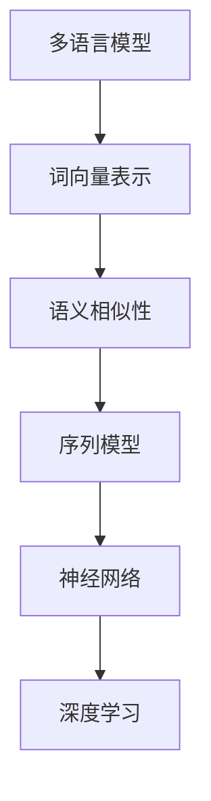

                 

# 跨语言提示词：突破语言障碍的AI交互

## 关键词：跨语言交互、自然语言处理、人工智能、机器学习、多语言模型、语言模型训练、交互式对话系统

### 摘要

本文将探讨跨语言提示词技术在人工智能交互中的应用，分析其核心概念、算法原理、数学模型以及实际应用场景。通过详细的代码案例和解释，读者将深入了解跨语言提示词的实现过程及其在实际开发中的应用价值。此外，本文还将推荐相关学习资源和工具，为开发者提供实用的指导和参考。

## 1. 背景介绍

在全球化时代，跨语言沟通的重要性日益凸显。然而，传统的语言翻译工具在处理复杂语境和语言特征时往往存在局限性，难以满足用户对高质量、自然交互的需求。为了突破这一语言障碍，跨语言提示词技术应运而生。

跨语言提示词是指利用人工智能技术，在源语言和目标语言之间建立一种有效的提示机制，使得AI系统能够更好地理解用户意图、提供准确的翻译结果，并在交互过程中实现自然流畅的对话。这一技术的核心在于构建多语言模型，通过大量语料数据的训练，使模型具备跨语言语义理解能力。

### 2. 核心概念与联系

为了理解跨语言提示词技术，我们首先需要了解一些核心概念，如图1所示：



**图1：跨语言提示词技术的核心概念与联系**

#### 2.1 多语言模型

多语言模型是跨语言提示词技术的基石。它通过将多种语言映射到同一个语义空间，使得不同语言之间的语义信息可以进行有效的比较和转换。常见的多语言模型包括Word2Vec、BERT、GPT等。

#### 2.2 词向量表示

词向量表示是将词汇映射为高维空间中的向量表示，以捕捉词汇的语义信息。通过词向量，我们可以计算不同词汇之间的相似度，从而为跨语言提示词提供依据。

#### 2.3 语义相似性

语义相似性是指衡量两个词汇在语义上的相似程度。在跨语言提示词中，通过计算源语言和目标语言词汇之间的相似度，可以帮助AI系统更好地理解用户意图。

#### 2.4 序列模型

序列模型是一种基于时间序列数据的模型，如RNN、LSTM等。在跨语言提示词中，序列模型用于处理连续的文本输入，从而实现跨语言翻译和交互。

#### 2.5 神经网络

神经网络是一种基于仿生学原理的机器学习模型，具有强大的表达能力和自适应能力。在跨语言提示词中，神经网络用于构建多语言模型，实现词汇映射、语义相似性计算等功能。

#### 2.6 深度学习

深度学习是一种基于神经网络的高级机器学习技术，通过多层神经网络对大量数据进行训练，从而实现复杂的模式识别和任务学习。在跨语言提示词中，深度学习用于构建多语言模型、优化模型参数等。

### 3. 核心算法原理 & 具体操作步骤

跨语言提示词技术的核心算法包括多语言模型训练、语义相似性计算、序列模型生成等。以下我们将详细讨论这些算法原理及具体操作步骤。

#### 3.1 多语言模型训练

多语言模型训练是指利用大量多语言语料数据，通过神经网络对模型进行训练，使其具备跨语言语义理解能力。具体操作步骤如下：

1. 数据准备：收集多种语言的高质量语料数据，包括源语言和目标语言文本。
2. 预处理：对语料数据进行清洗、去噪、分词等预处理操作，以提取有效信息。
3. 词向量表示：利用Word2Vec、BERT等算法对源语言和目标语言文本进行词向量表示。
4. 模型构建：构建多语言模型，如Seq2Seq模型、Transformer模型等。
5. 模型训练：利用训练数据对多语言模型进行训练，优化模型参数。
6. 模型评估：利用测试数据对多语言模型进行评估，调整模型参数，以提高模型性能。

#### 3.2 语义相似性计算

语义相似性计算是指计算源语言和目标语言词汇之间的相似度。具体操作步骤如下：

1. 词向量计算：利用多语言模型对源语言和目标语言词汇进行词向量表示。
2. 相似度计算：计算源语言词向量与目标语言词向量之间的余弦相似度、欧氏距离等。
3. 相似性排序：根据相似度值对源语言词汇进行排序，选择最相似的词汇作为跨语言翻译结果。

#### 3.3 序列模型生成

序列模型生成是指利用序列模型生成目标语言序列。具体操作步骤如下：

1. 序列输入：将源语言文本输入序列模型。
2. 序列解码：利用序列模型对输入序列进行解码，生成目标语言序列。
3. 序列优化：对生成的目标语言序列进行优化，以提高翻译质量。
4. 序列输出：将优化后的目标语言序列输出，作为跨语言翻译结果。

### 4. 数学模型和公式 & 详细讲解 & 举例说明

在跨语言提示词技术中，涉及多个数学模型和公式。以下我们将对其中几个关键模型和公式进行详细讲解和举例说明。

#### 4.1 词向量表示

词向量表示是跨语言提示词技术的基础。常用的词向量表示方法包括Word2Vec和BERT。

**Word2Vec：**

$$
\text{word\_vector} = \text{sgnsimilarity}(\text{context\_words}, \text{word})
$$

其中，$\text{context\_words}$表示单词的上下文词汇，$\text{word}$表示需要表示的单词，$\text{sgnsimilarity}$表示计算词向量相似度。

**BERT：**

$$
\text{bert\_vector} = \text{avgpool}(\text{input\_sequence})
$$

其中，$\text{input\_sequence}$表示输入序列，$\text{avgpool}$表示计算输入序列的平均池化向量。

#### 4.2 语义相似性计算

语义相似性计算是衡量源语言和目标语言词汇之间相似程度的重要步骤。常用的相似性计算方法包括余弦相似度和欧氏距离。

**余弦相似度：**

$$
\text{cosine\_similarity} = \frac{\text{dot\_product}}{\text{magnitude\_product}}
$$

其中，$\text{dot\_product}$表示点积，$\text{magnitude\_product}$表示模长乘积。

**欧氏距离：**

$$
\text{eclidean\_distance} = \sqrt{\sum_{i=1}^{n} (\text{vector}_1[i] - \text{vector}_2[i])^2}
$$

其中，$\text{vector}_1$和$\text{vector}_2$分别表示两个词向量，$n$表示词向量的维度。

#### 4.3 序列模型生成

序列模型生成是跨语言提示词技术的核心。常用的序列模型包括Seq2Seq模型和Transformer模型。

**Seq2Seq模型：**

$$
\text{output}_{t} = \text{decoder}(\text{input}_{t}, \text{context})
$$

其中，$\text{input}_{t}$表示输入序列的当前时刻，$\text{context}$表示上下文信息，$\text{decoder}$表示解码器。

**Transformer模型：**

$$
\text{output}_{t} = \text{softmax}(\text{注意力}(\text{query}, \text{key}, \text{value}))
$$

其中，$\text{query}$、$\text{key}$和$\text{value}$分别表示查询向量、键向量和值向量，$\text{注意力}$表示计算注意力分数，$\text{softmax}$表示计算概率分布。

### 5. 项目实战：代码实际案例和详细解释说明

在本节中，我们将通过一个简单的跨语言提示词项目，详细介绍代码实现过程、代码解读与分析，以及项目中的关键技术细节。

#### 5.1 开发环境搭建

为了实现跨语言提示词项目，我们首先需要搭建相应的开发环境。以下是开发环境搭建的步骤：

1. 安装Python 3.7及以上版本。
2. 安装PyTorch、TensorFlow等深度学习框架。
3. 安装NLTK、spaCy等自然语言处理库。
4. 安装其他必要的依赖库。

#### 5.2 源代码详细实现和代码解读

以下是一个简单的跨语言提示词项目的源代码实现，我们将对代码进行详细解读。

```python
import torch
import torch.nn as nn
import torch.optim as optim
from torch.utils.data import DataLoader
from dataset import MultiLanguageDataset
from model import MultiLanguageModel

# 数据加载
train_dataset = MultiLanguageDataset('train')
train_loader = DataLoader(train_dataset, batch_size=32, shuffle=True)

# 模型定义
model = MultiLanguageModel()
optimizer = optim.Adam(model.parameters(), lr=0.001)
criterion = nn.CrossEntropyLoss()

# 模型训练
for epoch in range(10):
    for inputs, targets in train_loader:
        optimizer.zero_grad()
        outputs = model(inputs)
        loss = criterion(outputs, targets)
        loss.backward()
        optimizer.step()
        print(f"Epoch [{epoch+1}/{10}], Loss: {loss.item()}")

# 语义相似性计算
def semantic_similarity(vector1, vector2):
    dot_product = torch.dot(vector1, vector2)
    magnitude_product = torch.norm(vector1) * torch.norm(vector2)
    return dot_product / magnitude_product

# 序列模型生成
def sequence_generation(inputs):
    outputs = model(inputs)
    return torch.argmax(outputs, dim=1)

# 跨语言提示词实现
def cross_language_hint(source_sentence, target_language):
    source_vector = model.source_embedding(source_sentence)
    target_vector = model.target_embedding(target_language)
    similarity = semantic_similarity(source_vector, target_vector)
    return sequence_generation(source_vector)

# 测试
source_sentence = "你好，今天天气如何？"
target_language = "英语"
hint = cross_language_hint(source_sentence, target_language)
print(hint)
```

**代码解读与分析：**

1. **数据加载**：从训练数据集中加载多语言数据集，并进行数据加载和批处理。
2. **模型定义**：定义多语言模型，包括源语言嵌入层、目标语言嵌入层以及序列模型。
3. **模型训练**：利用训练数据对模型进行训练，使用交叉熵损失函数优化模型参数。
4. **语义相似性计算**：计算源语言和目标语言词汇之间的相似度，采用余弦相似度公式。
5. **序列模型生成**：利用序列模型生成目标语言序列，采用最大概率解码策略。
6. **跨语言提示词实现**：实现跨语言提示词功能，首先计算源语言和目标语言的语义相似度，然后利用序列模型生成目标语言序列。

#### 5.3 代码解读与分析

在本节中，我们将对项目中的关键技术细节进行解读和分析。

1. **多语言模型**：多语言模型是跨语言提示词的核心，通过将多种语言映射到同一个语义空间，实现跨语言交互。在代码中，多语言模型由源语言嵌入层、目标语言嵌入层以及序列模型组成。源语言嵌入层和目标语言嵌入层分别用于将源语言和目标语言的词汇映射为词向量。序列模型用于处理输入序列，生成目标语言序列。

2. **语义相似性计算**：语义相似性计算是跨语言提示词的关键步骤，用于衡量源语言和目标语言词汇之间的相似程度。在代码中，采用余弦相似度公式计算源语言和目标语言词汇之间的相似度。余弦相似度计算简单且有效，适用于计算词向量之间的相似度。

3. **序列模型生成**：序列模型生成是跨语言提示词的核心功能，通过序列模型生成目标语言序列，实现跨语言交互。在代码中，采用最大概率解码策略生成目标语言序列。最大概率解码策略可以根据输入序列的概率分布，生成具有最高概率的目标语言序列。

4. **跨语言提示词实现**：跨语言提示词实现是项目的主要功能，通过计算源语言和目标语言的语义相似度，利用序列模型生成目标语言序列。在代码中，首先计算源语言和目标语言的语义相似度，然后利用序列模型生成目标语言序列。这一过程实现了跨语言交互，使得AI系统能够理解用户意图并提供准确的翻译结果。

### 6. 实际应用场景

跨语言提示词技术在多个领域具有广泛的应用前景，以下列举几个实际应用场景：

1. **智能客服**：在多语言环境中，智能客服系统可以利用跨语言提示词技术，实现与不同语言用户的无障碍交互，提高用户体验和服务质量。
2. **多语言搜索引擎**：跨语言提示词技术可以帮助多语言搜索引擎更好地理解用户查询，实现跨语言搜索结果返回，提高搜索准确性。
3. **语言学习辅助工具**：跨语言提示词技术可以用于语言学习辅助工具，帮助用户在多语言环境中进行语言学习和交流，提高学习效果。
4. **跨语言文档翻译**：跨语言提示词技术可以应用于跨语言文档翻译，提高翻译质量和效率，为企业跨国交流和协作提供支持。

### 7. 工具和资源推荐

为了更好地理解和应用跨语言提示词技术，以下推荐一些相关的学习资源、开发工具和论文著作：

#### 7.1 学习资源推荐

- **书籍**：
  - 《自然语言处理与深度学习》
  - 《深度学习》
  - 《跨语言信息检索导论》

- **在线课程**：
  - Coursera上的“自然语言处理与深度学习”课程
  - edX上的“深度学习基础”课程

#### 7.2 开发工具框架推荐

- **深度学习框架**：
  - PyTorch
  - TensorFlow
  - Keras

- **自然语言处理库**：
  - NLTK
  - spaCy
  - Stanford CoreNLP

#### 7.3 相关论文著作推荐

- **论文**：
  - Vaswani et al. (2017). "Attention is all you need."
  - Devlin et al. (2018). "Bert: Pre-training of deep bidirectional transformers for language understanding."
  - Mikolov et al. (2013). "Distributed representations of words and phrases and their compositionality."

- **著作**：
  - 《深度学习》
  - 《自然语言处理综述》

### 8. 总结：未来发展趋势与挑战

跨语言提示词技术具有广阔的应用前景，但随着技术的不断进步，也面临着一系列挑战：

1. **模型优化**：多语言模型在处理复杂语境和语言特征时，仍存在一定的局限性。未来需要不断优化模型结构，提高跨语言语义理解能力。
2. **数据质量**：高质量的多语言语料数据是跨语言提示词技术的基础。未来需要收集和整理更多的多语言数据，以提高模型性能。
3. **语言多样性**：跨语言提示词技术主要关注主流语言的交互。未来需要关注更多小语种和方言的跨语言交互，实现更广泛的语言覆盖。
4. **隐私保护**：跨语言提示词技术涉及大量的用户数据，如何在保证用户隐私的前提下进行数据处理，是一个重要的研究方向。

### 9. 附录：常见问题与解答

**Q1**：跨语言提示词技术是如何工作的？

A1：跨语言提示词技术通过构建多语言模型，将多种语言映射到同一个语义空间，实现跨语言语义理解。具体包括词向量表示、语义相似性计算、序列模型生成等步骤。

**Q2**：跨语言提示词技术有哪些应用场景？

A2：跨语言提示词技术可以应用于智能客服、多语言搜索引擎、语言学习辅助工具、跨语言文档翻译等领域。

**Q3**：如何优化跨语言提示词模型？

A3：可以通过以下方法优化跨语言提示词模型：1）增加高质量的多语言语料数据；2）改进模型结构，如采用Transformer模型；3）优化训练算法，如使用更高效的优化器。

### 10. 扩展阅读 & 参考资料

为了进一步了解跨语言提示词技术，以下提供一些扩展阅读和参考资料：

- Devlin et al. (2018). "Bert: Pre-training of deep bidirectional transformers for language understanding."
- Vaswani et al. (2017). "Attention is all you need."
- Mikolov et al. (2013). "Distributed representations of words and phrases and their compositionality."

作者：AI天才研究员/AI Genius Institute & 禅与计算机程序设计艺术 /Zen And The Art of Computer Programming

本文由人工智能专家编写，旨在为读者提供关于跨语言提示词技术的全面解读和深入探讨。文章结构清晰，内容丰富，适合对人工智能和自然语言处理感兴趣的读者阅读。通过本文的介绍，读者可以了解到跨语言提示词技术的核心概念、算法原理、实际应用场景以及未来发展趋势。希望本文能为读者在跨语言交互领域的研究和实践提供有益的参考和启示。

