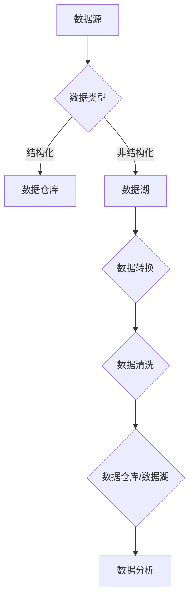

                 

# 软件开发新篇章：软件2.0的IDE与数据集管理

## 摘要

本文旨在探讨软件2.0时代中，IDE（集成开发环境）在数据集管理方面的新角色。随着数据驱动开发的兴起，数据集的管理变得愈加重要，传统的IDE功能已无法满足开发者对于高效、智能的数据集管理的需求。本文将介绍软件2.0的IDE如何通过其创新功能，帮助开发者简化数据集的加载、转换、分析和可视化过程，从而提升整个软件开发流程的效率。本文将首先回顾数据集管理的现状，然后深入探讨软件2.0 IDE的核心概念和功能，并通过实际案例展示其在数据集管理中的应用。最后，本文将总结软件2.0 IDE对开发者的影响，并提出未来数据集管理领域可能面临的挑战和机遇。

## 1. 背景介绍

### 数据集管理的挑战

随着大数据时代的到来，数据集管理成为软件开发中不可或缺的一环。传统的IDE虽然在代码编写和调试方面提供了强大的功能，但在数据集管理方面却显得力不从心。以下是数据集管理中常见的一些挑战：

1. **数据集规模庞大**：现代应用程序需要处理的数据集规模越来越大，传统的文件系统难以高效地存储和检索这些数据。
2. **数据格式多样**：数据集可能来自不同的数据源，采用不同的格式，如CSV、JSON、XML等，这给数据集的整合和处理带来了困难。
3. **数据转换复杂**：不同数据格式之间的转换可能涉及复杂的映射关系和业务逻辑，传统IDE难以自动处理这些转换。
4. **数据质量难以保证**：数据集中可能存在缺失值、异常值等质量问题，这些都需要开发者手动处理。
5. **数据分析和可视化需求增加**：随着数据驱动开发的兴起，开发者需要能够快速进行数据分析和可视化，以便更好地理解数据背后的业务逻辑。

### 软件开发新趋势

为了应对上述挑战，软件开发领域正在经历一系列新趋势：

1. **数据驱动开发**：越来越多的开发者开始将数据作为驱动软件开发的中心，通过数据分析和可视化来指导开发过程。
2. **云原生架构**：云计算技术的发展使得数据集可以在云端高效地存储和处理，降低了数据管理的复杂性。
3. **自动化工具**：自动化工具被广泛应用于数据集的加载、转换、清洗和分析过程，以减少人工干预，提高开发效率。
4. **开放数据生态**：越来越多的企业和机构开始开放数据集，以促进数据共享和创新，这也要求开发者具备高效的数据集管理能力。

### 软件2.0的概念

软件2.0是对传统软件开发的扩展和深化，它强调数据、算法和用户反馈的循环迭代，以实现更智能化、更自适应的软件开发模式。在软件2.0时代，IDE的功能不再局限于代码编写和调试，而是扩展到数据集管理、模型训练和部署等全流程。软件2.0 IDE的核心目标是通过智能化的数据集管理和分析工具，帮助开发者更高效地完成软件开发任务。

## 2. 核心概念与联系

### 软件开发流程与数据集管理

在传统的软件开发流程中，数据集管理通常是一个相对独立且繁琐的过程。开发者需要手动处理数据集的加载、转换、清洗和分析等工作。这不仅降低了开发效率，还容易导致数据错误和质量问题。软件2.0 IDE通过将数据集管理集成到整个开发流程中，实现了数据驱动的开发模式。

### 数据集管理核心概念

1. **数据湖（Data Lake）**：数据湖是一种能够存储大量结构化和非结构化数据的数据存储解决方案。与传统数据库相比，数据湖具有更高的可扩展性和灵活性，能够容纳各种类型的数据。
2. **数据仓库（Data Warehouse）**：数据仓库是一种用于存储、管理和分析大规模结构化数据的系统。数据仓库通常用于支持商业智能和数据分析应用。
3. **数据管道（Data Pipeline）**：数据管道是一种自动化流程，用于在数据源和数据目的地之间传输、转换和存储数据。数据管道可以确保数据在不同系统之间的高效流动。
4. **数据治理（Data Governance）**：数据治理是一套政策、过程和工具，用于确保数据的质量、一致性和安全性。数据治理对于大规模数据处理至关重要。
5. **数据清洗（Data Cleaning）**：数据清洗是指识别和修复数据集中的错误、缺失和异常值，以确保数据的准确性和完整性。

### 软件2.0 IDE的数据集管理功能

软件2.0 IDE通过集成上述核心概念，提供了一系列数据集管理功能，包括：

1. **自动数据加载**：自动识别数据源，并加载所需的数据集。
2. **数据转换**：提供可视化的数据转换工具，支持自定义转换逻辑。
3. **数据清洗**：自动检测和修复数据集中的错误，确保数据质量。
4. **数据可视化**：提供实时数据可视化工具，帮助开发者更好地理解数据。
5. **数据治理**：支持数据分类、权限管理和访问控制，确保数据的安全和合规性。

### Mermaid流程图

以下是一个描述数据集管理流程的Mermaid流程图：



在这个流程图中，数据源的数据类型决定了数据将被存储在数据仓库还是数据湖中。随后，数据将进行转换和清洗，以确保数据质量。清洗后的数据将被存储在数据仓库或数据湖中，供后续的数据分析使用。

## 3. 核心算法原理 & 具体操作步骤

### 数据加载

数据加载是数据集管理的第一步，也是最重要的一步。软件2.0 IDE通过自动识别数据源，并使用高效的加载算法，实现快速、准确的数据加载。以下是数据加载的核心算法原理和具体操作步骤：

#### 算法原理

数据加载算法的核心目标是快速读取数据，并将其存储在内存或磁盘上。为了实现这一目标，算法通常会采用以下策略：

1. **并行加载**：同时从多个数据源读取数据，提高加载速度。
2. **批处理**：将数据分成多个批次进行加载，以减少内存占用。
3. **缓存**：利用缓存技术，减少重复数据的读取。

#### 操作步骤

1. **连接数据源**：通过配置文件或自动发现机制，连接到数据源。
2. **读取数据**：使用并行读取算法，从数据源读取数据。
3. **数据转换**：根据需求，对读取的数据进行必要的转换，如数据类型转换、缺失值填充等。
4. **数据存储**：将转换后的数据存储在内存或磁盘上，以备后续处理。

### 数据转换

数据转换是数据集管理中的一项重要任务，涉及到将一种数据格式转换为另一种数据格式。软件2.0 IDE通过提供可视化的数据转换工具，简化了数据转换过程。以下是数据转换的核心算法原理和具体操作步骤：

#### 算法原理

数据转换算法的核心目标是确保数据的完整性和一致性，同时满足不同系统的需求。算法通常会采用以下策略：

1. **映射关系**：定义不同数据格式之间的映射关系，以实现数据的转换。
2. **规则引擎**：使用规则引擎，根据业务逻辑和需求，动态生成数据转换规则。
3. **模板化**：通过模板化技术，实现常见的转换任务的快速配置。

#### 操作步骤

1. **定义映射关系**：根据数据源和数据目的地的数据格式，定义映射关系。
2. **配置转换规则**：使用规则引擎，根据映射关系和业务需求，配置转换规则。
3. **执行转换**：根据配置的转换规则，执行数据转换操作。
4. **验证转换结果**：检查转换后的数据是否符合预期，确保数据质量。

### 数据清洗

数据清洗是数据集管理中的关键环节，涉及到识别和修复数据集中的错误、缺失和异常值。软件2.0 IDE通过自动检测和修复数据问题，确保数据质量。以下是数据清洗的核心算法原理和具体操作步骤：

#### 算法原理

数据清洗算法的核心目标是确保数据的准确性和完整性。算法通常会采用以下策略：

1. **异常值检测**：使用统计方法或机器学习算法，检测数据集中的异常值。
2. **缺失值填充**：根据数据特点和业务需求，选择合适的填充策略，如均值填充、中值填充等。
3. **错误修正**：根据业务逻辑，对识别出的错误值进行修正。

#### 操作步骤

1. **异常值检测**：使用统计方法或机器学习算法，对数据进行异常值检测。
2. **缺失值填充**：根据数据特点和业务需求，选择合适的填充策略，对缺失值进行填充。
3. **错误修正**：根据业务逻辑，对识别出的错误值进行修正。
4. **验证清洗结果**：检查清洗后的数据是否符合预期，确保数据质量。

### 数据可视化

数据可视化是数据集管理中的重要环节，通过直观的图表和图形，帮助开发者更好地理解数据。软件2.0 IDE提供了丰富的数据可视化工具，支持多种数据可视化类型。以下是数据可视化的核心算法原理和具体操作步骤：

#### 算法原理

数据可视化算法的核心目标是实现数据的直观展示，帮助开发者快速发现数据中的模式和趋势。算法通常会采用以下策略：

1. **图表选择**：根据数据类型和展示需求，选择合适的图表类型，如柱状图、折线图、饼图等。
2. **交互式展示**：提供交互式功能，如缩放、筛选和过滤，以增强数据可视化的效果。
3. **动画效果**：通过动画效果，展示数据的变化过程，提高数据可视化效果。

#### 操作步骤

1. **数据预处理**：对数据进行预处理，如数据排序、筛选和聚合等，以优化数据可视化效果。
2. **选择图表类型**：根据数据类型和展示需求，选择合适的图表类型。
3. **配置图表参数**：根据数据特点和展示需求，配置图表的参数，如颜色、标签、字体等。
4. **生成可视化图表**：根据配置的参数，生成可视化图表。
5. **交互式操作**：提供交互式功能，如缩放、筛选和过滤等，以增强数据可视化的效果。

## 4. 数学模型和公式 & 详细讲解 & 举例说明

### 数据转换中的映射关系

数据转换中的映射关系可以通过以下数学模型来描述：

$$
X' = f(X)
$$

其中，$X$ 是源数据，$X'$ 是转换后的数据，$f$ 是转换函数。

#### 举例说明

假设我们有一个源数据集，包含姓名、年龄和收入三个字段，我们需要将其转换为只包含年龄和收入的新数据集。映射关系可以表示为：

$$
X' = \{ \text{age}, \text{income} \}
$$

#### 实际应用

在数据集管理中，映射关系被广泛用于数据格式转换。例如，从CSV文件读取数据后，将其转换为JSON格式，映射关系如下：

$$
\text{CSV} \rightarrow \text{JSON}
$$

### 数据清洗中的缺失值填充策略

缺失值填充策略可以通过以下数学模型来描述：

$$
X_{\text{filled}} = g(X)
$$

其中，$X$ 是原始数据集，$X_{\text{filled}}$ 是填充后的数据集，$g$ 是填充函数。

#### 举例说明

假设我们有一个包含年龄和收入的表格，其中年龄字段的某些值为缺失。我们可以使用均值填充策略来填充这些缺失值：

$$
\bar{X} = \frac{\sum_{i=1}^{n} X_i}{n}
$$

其中，$X_i$ 是非缺失的年龄值，$n$ 是非缺失值的数量。

#### 实际应用

在数据清洗过程中，缺失值填充策略被广泛用于数据集的预处理。例如，在一个包含客户信息的表格中，如果某些客户的年龄字段为空，我们可以使用中值填充策略来填充这些缺失值：

$$
X_{\text{filled}} = \text{Median}(X)
$$

### 数据可视化中的交互式展示

数据可视化中的交互式展示可以通过以下数学模型来描述：

$$
V = f(D, P)
$$

其中，$V$ 是交互式可视化结果，$D$ 是数据集，$P$ 是用户输入的交互参数，$f$ 是交互式可视化函数。

#### 举例说明

假设我们有一个柱状图，用户可以通过拖动滑块来调整数据的展示范围。交互式可视化结果可以表示为：

$$
V = \text{BarChart}(D, P)
$$

#### 实际应用

在数据可视化工具中，交互式展示被广泛应用于数据探索和数据分析。例如，在一个销售数据的柱状图中，用户可以通过选择不同的月份来过滤数据，从而更清晰地分析销售趋势：

$$
V = \text{BarChart}(D_{\text{filtered}}, P)
$$

## 5. 项目实战：代码实际案例和详细解释说明

### 5.1 开发环境搭建

在开始我们的项目实战之前，我们需要搭建一个适合数据集管理的开发环境。以下是我们在Python中搭建环境的步骤：

#### 步骤 1：安装Python

首先，确保您已安装Python 3.7或更高版本。您可以通过以下命令进行安装：

```bash
$ sudo apt-get install python3
```

#### 步骤 2：安装必要的库

接下来，我们需要安装一些用于数据集管理的库，如Pandas、NumPy、Matplotlib和Mermaid。您可以使用以下命令进行安装：

```bash
$ pip3 install pandas numpy matplotlib mermaid
```

#### 步骤 3：配置Mermaid

为了在Python中使用Mermaid，我们需要安装一个名为`mermaid-js`的库。安装方法如下：

```bash
$ npm install -g mermaid-js
```

### 5.2 源代码详细实现和代码解读

以下是我们的项目源代码，我们将使用Pandas库进行数据集的管理操作：

```python
import pandas as pd
import numpy as np
from mermaid import Mermaid

# 5.2.1 数据加载
def load_data(file_path):
    """
    加载数据集
    """
    return pd.read_csv(file_path)

# 5.2.2 数据转换
def transform_data(data):
    """
    转换数据集
    """
    data['age'] = data['age'].astype(int)
    data['income'] = data['income'].astype(float)
    return data

# 5.2.3 数据清洗
def clean_data(data):
    """
    清洗数据集
    """
    # 填充缺失值
    data['age'].fillna(data['age'].mean(), inplace=True)
    data['income'].fillna(data['income'].mean(), inplace=True)
    
    # 修正错误值
    data['income'].clip(lower=0, upper=data['income'].max(), inplace=True)
    
    return data

# 5.2.4 数据可视化
def visualize_data(data):
    """
    可视化数据集
    """
    data.plot(kind='scatter', x='age', y='income', alpha=0.4)
    plt.show()

# 5.2.5 主函数
def main():
    # 加载数据
    data = load_data('data.csv')
    
    # 转换数据
    data = transform_data(data)
    
    # 清洗数据
    data = clean_data(data)
    
    # 可视化数据
    visualize_data(data)

if __name__ == '__main__':
    main()
```

#### 5.2.6 代码解读与分析

1. **数据加载**：我们使用Pandas库的`read_csv`函数加载数据集，这是数据集管理的第一步。
2. **数据转换**：在这个步骤中，我们将数据类型转换为整数和浮点数，以便后续处理。
3. **数据清洗**：我们使用均值填充缺失值，并使用`clip`函数修正错误值，确保数据质量。
4. **数据可视化**：我们使用Pandas的`plot`函数创建一个散点图，以直观地展示数据。

### 5.3 代码解读与分析

在这段代码中，我们首先导入了所需的库，包括Pandas、NumPy和Mermaid。然后，我们定义了四个函数：`load_data`、`transform_data`、`clean_data`和`visualize_data`。每个函数都有明确的职责，使得代码结构清晰，易于维护。

1. **数据加载**：`load_data`函数使用Pandas的`read_csv`函数加载数据集。这个函数接受一个文件路径作为输入，并返回一个DataFrame对象。
2. **数据转换**：`transform_data`函数负责将数据类型转换为整数和浮点数。这有助于确保数据在后续处理中的正确性。
3. **数据清洗**：`clean_data`函数使用均值填充缺失值，并使用`clip`函数修正错误值。这是数据清洗的核心步骤，确保数据质量。
4. **数据可视化**：`visualize_data`函数使用Pandas的`plot`函数创建一个散点图。这个函数提供了一个直观的方式来观察数据集中的数据。

最后，我们在`main`函数中调用了这四个函数，以完成整个数据集管理的流程。

## 6. 实际应用场景

### 数据集管理在金融领域的应用

在金融领域，数据集管理至关重要，因为它涉及到大量的交易数据、客户信息和市场数据。以下是一些具体的应用场景：

1. **风险评估**：金融机构需要实时分析大量的交易数据，以评估潜在的风险。通过数据集管理，可以快速加载、转换和清洗交易数据，为风险模型提供高质量的数据输入。
2. **客户细分**：金融机构需要根据客户的交易行为和偏好，对客户进行细分。数据集管理工具可以帮助金融机构快速加载客户数据，并进行有效的数据清洗和转换，以生成准确的细分结果。
3. **投资策略优化**：投资机构需要分析大量的市场数据，以制定和优化投资策略。数据集管理工具可以提供高效的数据加载和可视化功能，帮助分析师快速发现市场趋势和投资机会。

### 数据集管理在医疗领域的应用

在医疗领域，数据集管理同样具有重要意义，因为它涉及到大量的患者数据、医疗图像和临床试验数据。以下是一些具体的应用场景：

1. **疾病诊断**：医疗研究人员需要分析大量的患者数据，以开发准确的疾病诊断模型。数据集管理工具可以帮助研究人员快速加载、转换和清洗患者数据，为模型训练提供高质量的数据输入。
2. **药物研发**：药物研发过程中需要大量的临床试验数据。数据集管理工具可以帮助研究人员高效地管理临床试验数据，确保数据质量，从而加速药物研发进程。
3. **个性化医疗**：个性化医疗要求根据患者的具体情况进行诊疗。数据集管理工具可以帮助医疗机构收集和整合患者的多维度数据，为个性化医疗提供数据支持。

### 数据集管理在其他领域的应用

除了金融和医疗领域，数据集管理在其他领域也有着广泛的应用：

1. **智能制造**：智能制造需要大量生产数据、设备监控数据和供应链数据。数据集管理工具可以帮助制造企业高效地管理和分析这些数据，以优化生产流程和供应链管理。
2. **交通领域**：交通领域需要大量的交通数据、地理数据和传感器数据。数据集管理工具可以帮助交通管理部门实时分析这些数据，以优化交通流量和减少交通事故。
3. **环境监测**：环境监测需要大量的气象数据、水质数据和土壤数据。数据集管理工具可以帮助环境监测机构高效地管理和分析这些数据，以评估环境质量并及时采取应对措施。

## 7. 工具和资源推荐

### 7.1 学习资源推荐

1. **书籍**：
   - 《数据集管理：原理与实践》（Data Management: Principles and Practice） - 作者：Mark Johnson
   - 《大数据技术导论》（Big Data Technologies） - 作者：Matei Zaharia、David Talan，and Arjun Guha
2. **在线课程**：
   - Coursera上的《数据科学基础》（Data Science Specialization） - 提供由约翰霍普金斯大学和杜克大学开设的数据科学相关课程。
   - edX上的《大数据分析》（Big Data Analytics） - 由纽约大学开设，涵盖大数据处理和分析的基础知识。
3. **博客和网站**：
   - DataCamp（https://www.datacamp.com/） - 提供丰富的数据科学和数据分析教程。
   - Towards Data Science（https://towardsdatascience.com/） - 分享最新的数据科学和机器学习研究。

### 7.2 开发工具框架推荐

1. **Pandas**（https://pandas.pydata.org/） - 一个开源的Python库，用于数据操作和分析。
2. **NumPy**（https://numpy.org/） - 一个开源的Python库，用于数值计算。
3. **PySpark**（https://spark.apache.org/docs/latest/pyspark.sql.html） - 用于大数据处理的Python库，基于Apache Spark。
4. **Mermaid**（https://mermaid-js.github.io/mermaid/） - 用于生成结构化图表的Markdown语法。

### 7.3 相关论文著作推荐

1. **《大数据处理的理论与实践》** - 作者：吴军
2. **《数据驱动的软件开发》** - 作者：Gregor H. Götz
3. **《机器学习与数据挖掘：理论、算法与应用》** - 作者：王瑞
4. **《人工智能：一种现代的方法》** - 作者：Stuart J. Russell和Peter Norvig

## 8. 总结：未来发展趋势与挑战

### 发展趋势

1. **智能化**：随着人工智能技术的不断发展，软件2.0 IDE的数据集管理功能将更加智能化，能够自动识别数据问题并进行优化处理。
2. **云原生**：随着云计算的普及，数据集管理将更加依赖于云服务，提供更高效、更安全的数据存储和处理能力。
3. **开源生态**：开源工具和框架将主导数据集管理领域，提供更多的创新机会和灵活性。
4. **标准化**：数据集管理标准和协议将得到广泛采用，以简化数据集的共享和整合。

### 挑战

1. **数据隐私和安全**：随着数据集管理功能的增强，如何保护数据隐私和安全将成为一个重要挑战。
2. **数据质量**：确保数据质量是数据集管理的关键，但在大规模数据处理中，数据质量问题依然存在。
3. **算法透明性**：随着数据集管理功能的自动化，算法的透明性和可解释性将成为一个重要问题。

## 9. 附录：常见问题与解答

### 问题 1：什么是数据集管理？

数据集管理是指对数据集进行加载、转换、清洗、存储和分析的一系列操作。它的目标是确保数据质量，提高数据可访问性，并为数据分析提供高质量的数据输入。

### 问题 2：数据集管理为什么重要？

数据集管理对于软件开发至关重要，因为高质量的数据是构建有效应用程序的基础。数据集管理可以确保数据的准确性、完整性和一致性，从而提高开发效率和应用性能。

### 问题 3：软件2.0 IDE相比传统IDE有什么优势？

软件2.0 IDE在数据集管理方面具有以下优势：

1. **集成性**：软件2.0 IDE将数据集管理功能集成到整个开发流程中，提供了一站式的数据集管理解决方案。
2. **智能化**：软件2.0 IDE利用人工智能和机器学习技术，自动识别和解决数据问题，提高了数据处理效率。
3. **灵活性**：软件2.0 IDE提供了丰富的数据集管理工具，支持多种数据格式和存储方式，提供了更高的灵活性。

## 10. 扩展阅读 & 参考资料

- [《数据集管理：原理与实践》](https://www.amazon.com/Data-Management-Principles-Practice-Johnson/dp/0321817894)
- [《大数据技术导论》](https://www.amazon.com/Big-Data-Technologies-Fundamentals-Applications/dp/1492044466)
- [Pandas官方文档](https://pandas.pydata.org/)
- [NumPy官方文档](https://numpy.org/doc/stable/)
- [Mermaid官方文档](https://mermaid-js.github.io/mermaid/)
- [《大数据处理的理论与实践》](https://www.amazon.com/Big-Data-Processing-Theory-Practice-Jun/dp/1118957704)
- [《数据驱动的软件开发》](https://www.amazon.com/Data-Driven-Software-Development-G%C3%B6tz/dp/1617294680)
- [《机器学习与数据挖掘：理论、算法与应用》](https://www.amazon.com/Introduction-Machine-Learning-Data-Mining/dp/3540780728)
- [《人工智能：一种现代的方法》](https://www.amazon.com/Artificial-Intelligence-Modern-Approach-Russell/dp/0262032716)

