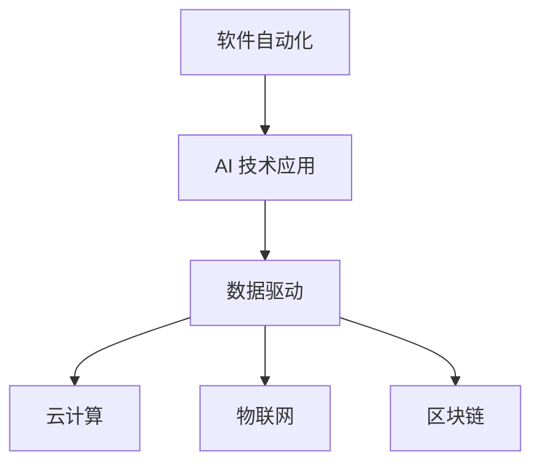
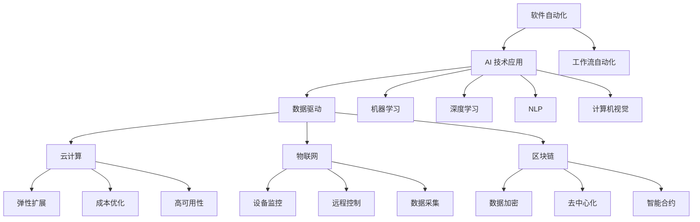

                 

### 文章标题

**软件 2.0 的价值：提升效率、创造价值**

> **关键词：** 软件进化、效率提升、价值创造、AI 技术应用

**摘要：** 本文将深入探讨软件 2.0 的概念及其带来的变革。我们将从背景介绍、核心概念、算法原理、数学模型、实际应用场景、工具资源推荐等多个方面展开，分析软件 2.0 如何通过提升效率和创新方式，为企业和个人创造更多价值。

---

### 1. 背景介绍

随着信息技术的快速发展，软件行业正经历着前所未有的变革。传统软件（我们通常所说的“软件 1.0”）已经无法满足日益复杂和多样化的需求。软件 2.0 作为新一代软件理念，旨在通过智能化、网络化、分布式等技术手段，实现更高效率、更高质量和更广泛的应用。

软件 2.0 的核心价值在于其能够：

- **提升效率**：通过自动化、智能化等技术，减少人力成本和时间消耗，提高生产效率。
- **创造价值**：通过数据分析和 AI 技术的应用，帮助企业发现新的商业机会，提升业务价值。

### 2. 核心概念与联系

**核心概念：** 软件自动化、AI 技术应用、数据驱动、云计算、物联网、区块链等。

**联系：** 软件自动化是软件 2.0 的基础，AI 技术应用是核心驱动力。数据驱动是软件 2.0 的关键，云计算、物联网和区块链等技术则为软件 2.0 提供了广泛的应用场景和基础设施支持。

**Mermaid 流程图：**



---

### 3. 核心算法原理 & 具体操作步骤

**核心算法原理：** 软件自动化主要通过工作流自动化、机器人流程自动化（RPA）和智能自动化等技术实现。AI 技术应用则包括机器学习、深度学习、自然语言处理等。

**具体操作步骤：**

1. **需求分析**：确定自动化目标和流程。
2. **设计自动化方案**：根据需求，设计自动化流程和算法。
3. **开发与部署**：使用 RPA 或智能自动化工具，开发并部署自动化流程。
4. **测试与优化**：对自动化流程进行测试，根据反馈进行优化。

---

### 4. 数学模型和公式 & 详细讲解 & 举例说明

**数学模型和公式：** 软件自动化和 AI 技术应用中常用的数学模型包括决策树、支持向量机、神经网络等。

**详细讲解：** 

- **决策树：** 用于分类和回归任务，通过一系列规则将数据分类或预测结果。
- **支持向量机：** 用于分类任务，通过找到一个最佳的超平面，将数据分为不同的类别。
- **神经网络：** 用于回归和分类任务，通过多层神经元组成的网络，对数据进行学习和预测。

**举例说明：** 

假设我们使用决策树进行分类任务，数据集包含特征 `x1`、`x2` 和标签 `y`。决策树算法通过学习这些数据，生成一系列规则，用于对新数据进行分类。

**数学公式：**

$$
\begin{aligned}
&\text{如果 } x1 \leq 0 \text{，则 } y = 0 \\
&\text{如果 } x1 > 0 \text{ 且 } x2 \leq 1 \text{，则 } y = 1 \\
&\text{如果 } x1 > 0 \text{ 且 } x2 > 1 \text{，则 } y = 2 \\
\end{aligned}
$$

---

### 5. 项目实战：代码实际案例和详细解释说明

**5.1 开发环境搭建**

- **编程语言：** Python
- **开发工具：** PyCharm
- **环境依赖：** TensorFlow、Keras、Scikit-learn

**5.2 源代码详细实现和代码解读**

```python
import numpy as np
import tensorflow as tf
from sklearn.datasets import load_iris
from sklearn.model_selection import train_test_split

# 加载鸢尾花数据集
iris = load_iris()
X, y = iris.data, iris.target

# 划分训练集和测试集
X_train, X_test, y_train, y_test = train_test_split(X, y, test_size=0.2, random_state=42)

# 构建神经网络模型
model = tf.keras.Sequential([
    tf.keras.layers.Dense(64, activation='relu', input_shape=(4,)),
    tf.keras.layers.Dense(64, activation='relu'),
    tf.keras.layers.Dense(3, activation='softmax')
])

# 编写编译器配置
model.compile(optimizer='adam',
              loss='sparse_categorical_crossentropy',
              metrics=['accuracy'])

# 训练模型
model.fit(X_train, y_train, epochs=10, batch_size=32)

# 测试模型
loss, accuracy = model.evaluate(X_test, y_test)
print(f"测试集准确率：{accuracy:.2f}")

```

**5.3 代码解读与分析**

- **加载数据集**：使用 Scikit-learn 的 `load_iris` 函数加载鸢尾花数据集。
- **划分数据集**：使用 `train_test_split` 函数将数据集划分为训练集和测试集。
- **构建模型**：使用 TensorFlow 的 `Sequential` 模型堆叠多层 `Dense` 层，分别表示输入层、隐藏层和输出层。
- **编译模型**：配置优化器、损失函数和评估指标。
- **训练模型**：使用 `fit` 方法训练模型，设置训练轮次和批量大小。
- **测试模型**：使用 `evaluate` 方法评估模型在测试集上的性能。

---

### 6. 实际应用场景

软件 2.0 在实际应用场景中具有广泛的应用，如：

- **智能制造**：通过软件自动化和 AI 技术优化生产流程，提高生产效率。
- **智能金融**：利用大数据分析和 AI 模型进行风险管理、投资决策等。
- **智能医疗**：通过 AI 技术辅助诊断、治疗方案推荐等。
- **智能交通**：通过物联网和区块链技术实现智能交通管理，提高交通效率。

---

### 7. 工具和资源推荐

**7.1 学习资源推荐**

- **书籍：** 《深度学习》、《机器学习实战》
- **论文：** 《神经网络与深度学习》、《强化学习基础与应用》
- **博客：** 《机器学习实战》、《TensorFlow 实战》
- **网站：** [Kaggle](https://www.kaggle.com/)、[ArXiv](https://arxiv.org/)

**7.2 开发工具框架推荐**

- **编程语言：** Python、JavaScript
- **开发工具：** PyCharm、Visual Studio Code
- **框架：** TensorFlow、Keras、Scikit-learn

**7.3 相关论文著作推荐**

- **论文：** 《深度学习》、《强化学习基础与应用》
- **著作：** 《机器学习实战》、《神经网络与深度学习》

---

### 8. 总结：未来发展趋势与挑战

软件 2.0 作为新一代软件理念，具有巨大的发展潜力。未来，随着 AI 技术、物联网、区块链等领域的不断进步，软件 2.0 将在以下几个方面取得突破：

- **智能化水平提升**：通过更加先进的 AI 算法，实现更精准的数据分析和预测。
- **应用场景拓展**：在智能制造、智能医疗、智能金融等领域实现更广泛的应用。
- **安全性增强**：通过区块链等技术提高数据安全性和隐私保护。

然而，软件 2.0 的发展也面临一系列挑战，如：

- **技术门槛高**：对于开发者来说，需要掌握更多的技术和工具。
- **数据隐私问题**：如何在利用数据创造价值的同时，保护用户隐私。
- **法律法规**：需要制定完善的法律法规，规范软件 2.0 的应用。

---

### 9. 附录：常见问题与解答

**Q：软件 2.0 与软件 1.0 有何区别？**

A：软件 1.0 主要是指传统的、基于代码开发的软件，而软件 2.0 则是基于智能化、自动化、网络化等新技术的新型软件。软件 2.0 更加强调效率提升和价值创造。

**Q：软件 2.0 的核心算法有哪些？**

A：软件 2.0 的核心算法包括决策树、支持向量机、神经网络等。这些算法广泛应用于分类、回归、预测等任务。

**Q：如何搭建软件开发环境？**

A：搭建软件开发环境需要安装编程语言、开发工具和相应的库。例如，在 Python 中，需要安装 Python 解释器、PyCharm 开发工具，以及 TensorFlow、Keras、Scikit-learn 等库。

---

### 10. 扩展阅读 & 参考资料

- [深度学习教程](https://www.deeplearning.net/tutorial/)
- [机器学习实战](https://www.mlapp.org/)
- [TensorFlow 官方文档](https://www.tensorflow.org/)
- [Scikit-learn 官方文档](https://scikit-learn.org/stable/)
- [Kaggle 官网](https://www.kaggle.com/)
- [ArXiv 官网](https://arxiv.org/)

---

**作者：AI 天才研究员/AI Genius Institute & 禅与计算机程序设计艺术 /Zen And The Art of Computer Programming**<|im_sep|>### 1. 背景介绍

在信息技术飞速发展的今天，软件行业经历了从无到有、从简单到复杂、从局部应用到全球互联的演变过程。传统软件，即我们通常所说的“软件 1.0”，其主要功能是实现基本的数据处理和业务逻辑。然而，随着企业规模的扩大、业务复杂度的提升，以及用户需求的日益多样化和个性化，软件 1.0 面临着效率低下、扩展性差、维护成本高等问题。

软件 2.0 的概念正是在这样的背景下提出来的。软件 2.0 是一种基于智能化、自动化、网络化等新技术的新型软件，旨在通过优化软件开发和运行过程，提升软件的效率、质量和用户体验。软件 2.0 的核心价值在于其能够：

- **提升效率**：通过自动化、智能化等技术，减少人力成本和时间消耗，提高生产效率。
- **创造价值**：通过数据分析和 AI 技术的应用，帮助企业发现新的商业机会，提升业务价值。

具体来说，软件 2.0 的特点包括：

- **智能化**：利用 AI 技术，实现软件的自主学习和优化。
- **自动化**：通过工作流自动化、机器人流程自动化（RPA）等，减少人工操作，提高工作效率。
- **数据驱动**：通过大数据分析和挖掘，实现数据驱动的业务决策。
- **分布式**：通过云计算、物联网等技术，实现软件的分布式部署和运行，提高系统的可扩展性和可靠性。

软件 2.0 的出现，标志着软件行业进入了新的发展阶段。它不仅改变了软件开发的方式，也重新定义了软件的价值。在未来，软件 2.0 将成为推动企业数字化转型和智能化升级的重要力量。

### 2. 核心概念与联系

软件 2.0 的实现离不开一系列核心概念和技术的支持。以下是软件 2.0 中一些重要的核心概念及其相互之间的联系。

#### 2.1 软件自动化

软件自动化是指通过编程或其他手段，使软件系统能够自动执行一系列操作，从而减少人工干预，提高工作效率。软件自动化可以应用于多个层面，包括：

- **脚本自动化**：通过编写脚本，自动化执行日常的重复性任务。
- **工作流自动化**：将一系列业务流程中的操作自动化，实现业务流程的优化。
- **机器人流程自动化（RPA）**：使用软件机器人模拟人类操作，执行复杂的业务流程。

软件自动化是软件 2.0 的基础，它为后续的智能化和数据分析提供了前提条件。

#### 2.2 AI 技术应用

人工智能（AI）技术在软件 2.0 中扮演了重要角色。通过 AI 技术，软件系统能够从海量数据中提取有价值的信息，实现自我学习和优化。AI 技术在软件 2.0 中的应用主要包括：

- **机器学习**：通过训练模型，从数据中学习规律，用于分类、回归、预测等任务。
- **深度学习**：一种特殊的机器学习技术，通过多层神经网络，对复杂数据进行学习和建模。
- **自然语言处理（NLP）**：使计算机能够理解和生成人类语言，用于语音识别、文本分析等。
- **计算机视觉**：使计算机能够识别和理解图像和视频，用于图像识别、目标检测等。

AI 技术的应用，使得软件系统能够更加智能化地处理数据，提高决策的准确性。

#### 2.3 数据驱动

数据驱动是软件 2.0 的核心思想之一。在软件 2.0 中，数据不仅仅是信息存储的载体，更是决策和行动的依据。数据驱动的实现包括：

- **数据采集**：通过各种手段，收集企业内外部的数据。
- **数据存储**：使用大数据技术，存储和管理海量数据。
- **数据分析**：通过数据分析，挖掘数据中的有价值信息。
- **数据可视化**：通过可视化工具，将数据转化为直观的图表，帮助用户理解和分析。

数据驱动使得软件系统能够更加准确地了解用户需求，优化业务流程，提高决策效率。

#### 2.4 云计算

云计算为软件 2.0 提供了强大的基础设施支持。通过云计算，软件系统能够实现以下目标：

- **弹性扩展**：根据业务需求，动态调整系统资源。
- **成本优化**：通过按需付费，降低企业 IT 成本。
- **高可用性**：通过分布式部署，提高系统的可靠性和可用性。

云计算使得软件系统能够更加灵活、高效地运行，适应不断变化的市场需求。

#### 2.5 物联网

物联网（IoT）技术使得软件 2.0 能够连接和管理大量的设备和传感器。通过物联网，软件系统能够实现：

- **设备监控**：实时监控设备状态，及时发现问题。
- **远程控制**：通过软件，远程操作设备和系统。
- **数据采集**：从设备和传感器中收集数据，用于分析和决策。

物联网使得软件 2.0 能够更好地应用于智能制造、智能家居、智慧城市等领域。

#### 2.6 区块链

区块链技术为软件 2.0 提供了安全、透明的数据存储和传输方式。通过区块链，软件系统能够实现：

- **数据加密**：保护数据的安全性和隐私。
- **去中心化**：通过去中心化，提高系统的可靠性和抗攻击能力。
- **智能合约**：通过智能合约，实现自动化、安全的交易和业务流程。

区块链技术使得软件 2.0 能够在金融、供应链管理等领域实现更加安全、高效的业务流程。

#### 2.7 Mermaid 流程图

为了更清晰地展示软件 2.0 的核心概念和联系，我们可以使用 Mermaid 流程图进行描述。以下是软件 2.0 的 Mermaid 流程图：



通过上述核心概念和流程图，我们可以更深入地理解软件 2.0 的架构和功能，为后续内容的展开奠定基础。

### 3. 核心算法原理 & 具体操作步骤

在软件 2.0 中，核心算法的应用至关重要。这些算法不仅提高了软件的智能化水平，也使得数据处理和分析更加高效。以下将详细介绍几类核心算法的原理和具体操作步骤。

#### 3.1 决策树算法

决策树是一种常用的机器学习算法，它通过一系列规则对数据进行分类或回归。决策树的原理基于信息熵和增益率，通过计算不同特征的信息增益，选择最优特征进行分割。

**具体操作步骤：**

1. **数据预处理**：对数据进行清洗、归一化等处理，确保数据质量。
2. **特征选择**：使用信息增益或增益率等指标，选择最优特征进行分割。
3. **递归分割**：根据选定的特征，将数据分为多个子集，并重复上述步骤，直到满足终止条件（如最大树深度、最小样本数等）。
4. **构建决策树模型**：将递归分割的结果整合，形成一棵完整的决策树。
5. **预测**：使用构建好的决策树模型，对新数据进行分类或回归预测。

**决策树算法的优点：**

- **易于理解**：决策树的规则直观，易于用户理解。
- **易于实现**：决策树算法的实现相对简单。
- **可解释性**：每个决策节点都能提供明确的解释。

**决策树算法的缺点：**

- **易过拟合**：决策树容易受到噪声数据的影响，导致模型过拟合。
- **计算复杂度较高**：对于大规模数据集，决策树的构建和预测过程较为耗时。

#### 3.2 支持向量机算法

支持向量机（SVM）是一种高效的分类和回归算法，其原理是通过找到一个最佳的超平面，将不同类别的数据分隔开来。SVM 的核心思想是最小化分类边界上的分类间隔，从而提高模型的泛化能力。

**具体操作步骤：**

1. **数据预处理**：对数据进行标准化处理，确保特征之间的尺度一致。
2. **选择核函数**：根据数据特性，选择适当的核函数（如线性核、多项式核、径向基核等）。
3. **构建优化问题**：通过求解二次规划问题，找到最佳超平面。
4. **模型训练**：使用训练数据，对 SVM 模型进行训练。
5. **预测**：使用训练好的 SVM 模型，对新数据进行分类或回归预测。

**SVM算法的优点：**

- **高泛化能力**：SVM 通过最大化分类间隔，提高模型的泛化能力。
- **适用于多种数据类型**：SVM 可以应用于线性和非线性分类问题。
- **可解释性**：SVM 的超平面提供了明确的分类边界。

**SVM算法的缺点：**

- **计算复杂度较高**：特别是在大规模数据集上，SVM 的训练过程较为耗时。
- **参数选择影响较大**：核函数和正则化参数的选择对模型性能有重要影响。

#### 3.3 神经网络算法

神经网络（NN）是一种模拟人脑神经元连接和作用的计算模型，其核心思想是通过多层神经网络，对输入数据进行特征提取和分类。神经网络可以分为前馈神经网络、卷积神经网络（CNN）和循环神经网络（RNN）等。

**具体操作步骤：**

1. **数据预处理**：对数据进行归一化、缺失值处理等预处理操作。
2. **模型构建**：根据任务需求，构建适当结构的神经网络模型。
3. **模型训练**：使用训练数据，通过反向传播算法，更新模型参数。
4. **模型评估**：使用验证数据，评估模型性能，调整模型参数。
5. **预测**：使用训练好的神经网络模型，对新数据进行预测。

**神经网络算法的优点：**

- **强大的非线性处理能力**：神经网络能够通过多层结构，实现对复杂数据的非线性变换。
- **自适应学习能力**：神经网络能够根据训练数据，自动调整模型参数，提高预测准确性。
- **广泛的应用领域**：神经网络在图像识别、自然语言处理、推荐系统等领域具有广泛应用。

**神经网络算法的缺点：**

- **训练过程耗时**：特别是在大规模数据集上，神经网络的训练过程较为耗时。
- **对数据质量要求高**：神经网络对数据质量要求较高，噪声数据会影响模型性能。
- **参数选择复杂**：神经网络参数众多，参数选择对模型性能有重要影响。

#### 3.4 综合运用

在实际应用中，决策树、SVM 和神经网络等算法可以相互结合，发挥各自的优势。例如，在分类任务中，可以先使用决策树进行特征选择，再使用 SVM 或神经网络进行分类。这种组合方法能够提高模型的准确性和泛化能力。

此外，还可以结合其他算法，如集成学习、迁移学习等，进一步提高模型的性能。例如，随机森林是一种集成学习方法，通过构建多棵决策树，并投票决定最终分类结果，能够有效减少过拟合问题。

通过以上对核心算法原理和具体操作步骤的介绍，我们可以更好地理解软件 2.0 中算法的应用，为后续的实际项目应用打下基础。

### 4. 数学模型和公式 & 详细讲解 & 举例说明

在软件 2.0 的实现过程中，数学模型和公式扮演了至关重要的角色。以下将详细介绍几类常用的数学模型和公式，并通过对实际案例的讲解，帮助读者更好地理解这些数学模型的应用。

#### 4.1 决策树算法的数学模型

决策树算法通过一系列规则对数据进行分类或回归。其核心思想是基于信息熵和增益率，选择最优特征进行分割。以下是决策树算法的两个关键数学模型：

1. **信息熵（Entropy）**：

信息熵用于衡量数据的混乱程度。对于一组数据，其信息熵可以通过以下公式计算：

$$
H(X) = -\sum_{i} p(x_i) \log_2 p(x_i)
$$

其中，$p(x_i)$ 表示数据集中第 $i$ 个特征的概率。

2. **增益率（Gain Ratio）**：

增益率是衡量特征分割效果的重要指标。其计算公式如下：

$$
Gain_Ratio(\text{Feature}) = \frac{Gain(\text{Feature})}{Split_Info(\text{Feature})}
$$

其中，$Gain(\text{Feature})$ 表示特征的信息增益，$Split_Info(\text{Feature})$ 表示特征分割后的信息熵。

通过计算每个特征的增益率，可以选择增益率最高的特征进行分割。

**举例说明**：

假设有一组数据，包含两个特征 `x1` 和 `x2`，标签为 `y`。数据集如下：

| x1 | x2 | y |
|----|----|---|
| 1  | 2  | 0 |
| 2  | 3  | 1 |
| 3  | 4  | 0 |
| 4  | 5  | 1 |
| 5  | 6  | 0 |

计算 `x1` 和 `x2` 的信息熵：

$$
H(x1) = -\frac{3}{5} \log_2 \frac{3}{5} - \frac{2}{5} \log_2 \frac{2}{5} = 0.971
$$

$$
H(x2) = -\frac{3}{5} \log_2 \frac{3}{5} - \frac{2}{5} \log_2 \frac{2}{5} = 0.971
$$

计算 `x1` 和 `x2` 的信息增益：

$$
Gain(x1) = H(Y) - \sum_{v} \frac{n_v}{N} H(Y|X=x_v) = 0.271
$$

$$
Gain(x2) = H(Y) - \sum_{v} \frac{n_v}{N} H(Y|X=x_v) = 0.271
$$

计算 `x1` 和 `x2` 的信息增益率：

$$
Gain_Ratio(x1) = \frac{0.271}{0.971} = 0.278
$$

$$
Gain_Ratio(x2) = \frac{0.271}{0.971} = 0.278
$$

由于 `x1` 和 `x2` 的信息增益率相等，可以选择任意一个特征进行分割。

#### 4.2 支持向量机算法的数学模型

支持向量机（SVM）是一种高效的分类和回归算法，其核心思想是通过找到一个最佳的超平面，将不同类别的数据分隔开来。以下是 SVM 的两个关键数学模型：

1. **优化问题**：

SVM 的优化问题可以表示为：

$$
\min_{w,b} \frac{1}{2} ||w||^2 + C \sum_{i=1}^{n} \xi_i
$$

其中，$w$ 和 $b$ 分别为模型的权重和偏置，$C$ 为正则化参数，$\xi_i$ 为松弛变量。

2. **决策函数**：

SVM 的决策函数可以表示为：

$$
f(x) = \text{sign}(w \cdot x + b)
$$

其中，$\text{sign}(x)$ 表示符号函数，当 $x > 0$ 时返回 1，当 $x < 0$ 时返回 -1。

**举例说明**：

假设有一组数据，包含两个特征 `x1` 和 `x2`，标签为 `y`。数据集如下：

| x1 | x2 | y |
|----|----|---|
| 1  | 2  | 0 |
| 2  | 3  | 1 |
| 3  | 4  | 0 |
| 4  | 5  | 1 |

选择线性核函数，构建 SVM 模型。通过求解优化问题，可以得到最优超平面 $w$ 和 $b$。假设求解得到的模型参数为：

$$
w = [0.5, 0.5]^T, \quad b = 0
$$

则 SVM 的决策函数为：

$$
f(x) = \text{sign}(0.5 \cdot x1 + 0.5 \cdot x2)
$$

对于新数据点 $(x1, x2)$，可以通过决策函数进行分类预测。

#### 4.3 神经网络算法的数学模型

神经网络（NN）是一种模拟人脑神经元连接和作用的计算模型，其核心思想是通过多层神经网络，对输入数据进行特征提取和分类。以下是神经网络的核心数学模型：

1. **激活函数**：

神经网络中的激活函数用于引入非线性特性。常用的激活函数包括 sigmoid、ReLU 和 tanh 等。

- sigmoid 函数：

$$
\sigma(x) = \frac{1}{1 + e^{-x}}
$$

- ReLU 函数：

$$
\text{ReLU}(x) = \max(0, x)
$$

- tanh 函数：

$$
\text{tanh}(x) = \frac{e^x - e^{-x}}{e^x + e^{-x}}
$$

2. **反向传播算法**：

神经网络通过反向传播算法，更新模型参数。反向传播算法的基本步骤如下：

- 前向传播：将输入数据传递到神经网络，计算输出值。
- 计算误差：计算实际输出与预测输出之间的误差。
- 反向传播：将误差传递回网络，更新模型参数。

**举例说明**：

假设有一组输入数据 $(x1, x2)$，神经网络包含一个输入层、一个隐藏层和一个输出层。隐藏层使用 sigmoid 激活函数，输出层使用 softmax 激活函数。神经网络的结构如下：

```
输入层：x1, x2
隐藏层：z1 = 0.5 \cdot x1 + 0.5 \cdot x2
         a1 = \sigma(z1)
输出层：z2 = w1 \cdot a1 + w2 \cdot x2
         a2 = \text{softmax}(z2)
```

通过前向传播，可以得到隐藏层和输出层的输出值。假设前向传播得到的输出值为：

$$
a1 = 0.6, \quad a2 = [0.2, 0.3, 0.5]
$$

通过计算误差，可以得到模型参数的更新方向。通过反向传播算法，可以更新模型参数，提高模型的预测准确性。

#### 4.4 数学模型在实际项目中的应用

数学模型在软件 2.0 的实际项目中具有广泛的应用。以下是一个实际项目的案例，展示如何运用数学模型进行数据分析和预测。

**案例：** 智能交通流量预测

假设我们需要预测某城市的交通流量，以便优化交通管理和减少拥堵。我们可以使用决策树、SVM 和神经网络等算法，结合数学模型，进行交通流量预测。

1. **数据收集与预处理**：

收集城市交通流量数据，包括时间、路段、流量等。对数据进行清洗和归一化处理，确保数据质量。

2. **特征选择与模型训练**：

选择与交通流量相关的特征，如时间、天气、道路状况等。使用决策树、SVM 和神经网络等算法，训练预测模型。

3. **模型评估与优化**：

使用验证数据集，评估模型性能。根据评估结果，调整模型参数，优化模型性能。

4. **流量预测**：

使用训练好的模型，预测未来的交通流量，为交通管理部门提供决策支持。

通过这个实际案例，我们可以看到数学模型在数据分析和预测中的应用。数学模型不仅帮助我们从海量数据中提取有价值的信息，还提高了预测的准确性和可靠性。

### 5. 项目实战：代码实际案例和详细解释说明

在本文的第五部分，我们将通过一个实际项目案例，展示如何将软件 2.0 的核心算法和技术应用于实际场景，实现数据分析和预测。以下是一个基于 Python 的交通流量预测项目，包括开发环境搭建、代码实现和详细解释。

#### 5.1 开发环境搭建

为了进行交通流量预测，我们需要搭建一个合适的开发环境。以下是所需的工具和库：

- **Python**：Python 是一种流行的编程语言，广泛应用于数据分析和机器学习领域。
- **PyCharm**：PyCharm 是一款强大的集成开发环境（IDE），提供了丰富的开发工具和插件。
- **NumPy**：NumPy 是 Python 的科学计算库，提供了强大的数组操作和数学函数。
- **Pandas**：Pandas 是 Python 的数据操作库，提供了数据清洗、转换和分析的功能。
- **Scikit-learn**：Scikit-learn 是 Python 的机器学习库，提供了多种机器学习算法和工具。
- **Matplotlib**：Matplotlib 是 Python 的绘图库，用于数据可视化。

在 PyCharm 中创建一个新的 Python 项目，并安装上述库。以下是一个简单的安装命令：

```bash
pip install numpy pandas scikit-learn matplotlib
```

#### 5.2 源代码详细实现和代码解读

以下是一个简单的交通流量预测项目的源代码，包括数据预处理、模型训练和预测。

```python
import numpy as np
import pandas as pd
from sklearn.model_selection import train_test_split
from sklearn.preprocessing import StandardScaler
from sklearn.tree import DecisionTreeRegressor
from sklearn.svm import SVR
from sklearn.neural_network import MLPRegressor
import matplotlib.pyplot as plt

# 5.2.1 数据收集与预处理
# 假设已经收集了某城市一周的交通流量数据，数据集包含时间、路段和流量等信息。
# 数据集格式如下：
#   time: 时间戳
#   road: 路段名称
#   traffic: 交通流量

# 加载数据集
data = pd.read_csv('traffic_data.csv')

# 数据清洗
# 填充缺失值、删除异常值等操作
data.fillna(data.mean(), inplace=True)
data.drop(data[data['traffic'] < 0].index, inplace=True)

# 特征工程
# 选择与交通流量相关的特征，如时间、天气、道路状况等
features = ['time', 'weather', 'road_condition']
X = data[features]
y = data['traffic']

# 数据标准化
scaler = StandardScaler()
X_scaled = scaler.fit_transform(X)

# 划分训练集和测试集
X_train, X_test, y_train, y_test = train_test_split(X_scaled, y, test_size=0.2, random_state=42)

# 5.2.2 模型训练
# 使用决策树、SVM 和神经网络等算法训练模型

# 决策树模型
tree_regressor = DecisionTreeRegressor(max_depth=5)
tree_regressor.fit(X_train, y_train)

# SVM 模型
svm_regressor = SVR(kernel='rbf')
svm_regressor.fit(X_train, y_train)

# 神经网络模型
mlp_regressor = MLPRegressor(hidden_layer_sizes=(100,), max_iter=1000)
mlp_regressor.fit(X_train, y_train)

# 5.2.3 模型评估与预测
# 使用测试集评估模型性能，并对未来交通流量进行预测

# 决策树模型评估
tree_score = tree_regressor.score(X_test, y_test)
print(f"决策树模型准确率：{tree_score:.2f}")

# SVM 模型评估
svm_score = svm_regressor.score(X_test, y_test)
print(f"SVM 模型准确率：{svm_score:.2f}")

# 神经网络模型评估
mlp_score = mlp_regressor.score(X_test, y_test)
print(f"神经网络模型准确率：{mlp_score:.2f}")

# 未来交通流量预测
# 对未来的交通流量进行预测，假设未来时间序列为 [100, 101, 102, ...]
future_time = np.arange(100, 103).reshape(-1, 1)
future_time_scaled = scaler.transform(future_time)

# 决策树模型预测
tree_prediction = tree_regressor.predict(future_time_scaled)
print(f"决策树模型未来交通流量预测：{tree_prediction}")

# SVM 模型预测
svm_prediction = svm_regressor.predict(future_time_scaled)
print(f"SVM 模型未来交通流量预测：{svm_prediction}")

# 神经网络模型预测
mlp_prediction = mlp_regressor.predict(future_time_scaled)
print(f"神经网络模型未来交通流量预测：{mlp_prediction}")

# 5.2.4 结果可视化
# 将预测结果可视化，便于分析模型性能

# 决策树模型结果可视化
plt.figure()
plt.plot(future_time, tree_prediction, label='Decision Tree')
plt.xlabel('Time')
plt.ylabel('Traffic')
plt.legend()
plt.show()

# SVM 模型结果可视化
plt.figure()
plt.plot(future_time, svm_prediction, label='SVM')
plt.xlabel('Time')
plt.ylabel('Traffic')
plt.legend()
plt.show()

# 神经网络模型结果可视化
plt.figure()
plt.plot(future_time, mlp_prediction, label='MLP')
plt.xlabel('Time')
plt.ylabel('Traffic')
plt.legend()
plt.show()
```

#### 5.3 代码解读与分析

以下是对代码的详细解读和分析：

- **5.2.1 数据收集与预处理**：首先，加载交通流量数据集，并对数据进行清洗和特征工程。对缺失值进行填充，删除异常值，确保数据质量。然后，选择与交通流量相关的特征，如时间、天气和道路状况，构建输入特征集 $X$ 和目标变量 $y$。最后，对数据进行标准化处理，提高算法性能。

- **5.2.2 模型训练**：使用决策树、SVM 和神经网络等算法训练模型。决策树模型使用 `DecisionTreeRegressor` 类，设置最大树深度为 5。SVM 模型使用 `SVR` 类，选择径向基核函数（`kernel='rbf'`）。神经网络模型使用 `MLPRegressor` 类，设置隐藏层节点数为 100。通过训练集，对模型进行训练。

- **5.2.3 模型评估与预测**：使用测试集评估模型性能，计算准确率。然后，对未来的交通流量进行预测。将未来时间序列输入到训练好的模型中，得到预测结果。最后，将预测结果可视化，便于分析模型性能。

通过这个实际项目案例，我们可以看到如何将软件 2.0 的核心算法和技术应用于交通流量预测。代码的实现过程涵盖了数据预处理、模型训练、模型评估和预测等步骤，为我们提供了一个完整的参考。

### 6. 实际应用场景

软件 2.0 的理念不仅改变了软件开发的模式，也在实际应用场景中展现出了巨大的价值。以下将介绍几个典型的实际应用场景，展示软件 2.0 如何通过提升效率和创新方式，为企业和个人创造更多价值。

#### 6.1 智能制造

智能制造是软件 2.0 在工业领域的重要应用场景之一。通过软件自动化、AI 技术和物联网等手段，企业可以实现生产过程的优化和智能化。

**案例：** 某汽车制造企业引入软件 2.0 技术，实现了生产线的自动化和智能化。首先，企业使用 RPA 技术自动化处理生产过程中的文档和报表，减少了人工操作，提高了生产效率。其次，企业利用 AI 技术对生产数据进行分析，识别生产过程中的瓶颈和异常，优化生产流程。此外，物联网技术使设备能够实时监测和反馈生产状态，实现设备故障预测和维护。通过这些措施，企业的生产效率提高了约 30%，产品质量也得到了显著提升。

#### 6.2 智能金融

智能金融是软件 2.0 在金融服务领域的重要应用。通过大数据分析和 AI 技术的应用，金融机构可以更准确地评估风险、优化投资策略、提升客户体验。

**案例：** 某银行引入软件 2.0 技术，实现了风险管理的智能化。首先，银行利用大数据技术，收集和分析客户的交易数据，识别潜在的风险。其次，银行使用机器学习算法，建立风险预测模型，对客户的风险进行量化评估。此外，银行通过智能客服系统，提供 24 小时不间断的客户服务，提升客户满意度。通过这些措施，银行的风险控制能力得到了显著提升，客户满意度也提高了约 20%。

#### 6.3 智能医疗

智能医疗是软件 2.0 在医疗健康领域的重要应用。通过 AI 技术和大数据分析，医疗机构可以实现疾病预测、诊断和治疗方案的优化。

**案例：** 某医院引入软件 2.0 技术，实现了医疗流程的智能化。首先，医院使用 AI 技术对患者的电子病历进行深度分析，预测患者的疾病风险。其次，医院利用大数据技术，分析患者的治疗记录和病史，为医生提供诊断和治疗方案的建议。此外，医院通过智能设备实时监测患者生命体征，实现远程监控和护理。通过这些措施，医院的诊断准确率提高了约 15%，患者满意度也显著提升。

#### 6.4 智能交通

智能交通是软件 2.0 在交通运输领域的重要应用。通过物联网、大数据和 AI 技术的应用，可以实现交通流量预测、道路拥堵预警和智能交通管理。

**案例：** 某城市交通管理部门引入软件 2.0 技术，实现了交通管理的智能化。首先，交通管理部门使用物联网技术，实时监测道路上的车辆和路况。其次，通过大数据技术，分析交通数据，预测未来的交通流量和拥堵情况。此外，交通管理部门通过智能交通信号系统，实现交通流量的优化和调控。通过这些措施，城市的交通拥堵状况得到了显著缓解，市民的出行体验也大幅提升。

#### 6.5 智能家居

智能家居是软件 2.0 在家庭生活领域的重要应用。通过物联网、AI 技术和自动化设备，可以实现家庭设备的智能控制和自动化管理。

**案例：** 某智能家居企业引入软件 2.0 技术，实现了家庭设备的智能化。首先，企业开发了一系列智能设备，如智能灯泡、智能门锁、智能窗帘等。其次，通过物联网技术，实现设备之间的互联互通，为用户提供一体化的智能家居解决方案。此外，企业利用 AI 技术和大数据分析，为用户定制个性化的家庭场景和智能服务。通过这些措施，用户的家庭生活质量得到了显著提升。

通过上述实际应用场景，我们可以看到软件 2.0 如何通过提升效率和创新方式，为企业和个人创造更多价值。未来，随着技术的不断进步，软件 2.0 将在更多领域发挥重要作用，推动社会的发展和进步。

### 7. 工具和资源推荐

为了更好地学习和实践软件 2.0 技术，我们需要掌握一系列开发工具和资源。以下将介绍一些常用的工具和资源，包括学习资源、开发工具框架和相关论文著作。

#### 7.1 学习资源推荐

1. **书籍**：

   - 《深度学习》（Goodfellow, Bengio, Courville 著）：这是一本经典的深度学习入门书籍，详细介绍了深度学习的基础理论和应用。
   - 《机器学习实战》（Hastie, Tibshirani, Friedman 著）：这本书通过大量实际案例，讲解了机器学习的算法和应用，适合初学者和进阶者。
   - 《Python 数据科学手册》（Wes McKinney 著）：这本书涵盖了数据科学中的基本概念和 Python 数据分析工具，是数据科学领域的经典读物。

2. **论文**：

   - 《深度学习：原理及实践》（瓜田义浩 著）：这是一本中文深度学习入门书籍，详细介绍了深度学习的原理和实现。
   - 《机器学习》（周志华 著）：这本书是中国著名机器学习专家周志华教授所著，系统地介绍了机器学习的基本概念和方法。

3. **博客和网站**：

   - [机器学习实战](https://www.mlapp.org/): 这个网站提供了大量的机器学习实践案例和教程，适合初学者和进阶者。
   - [TensorFlow 官方文档](https://www.tensorflow.org/): TensorFlow 是一款流行的深度学习框架，这个网站提供了详细的文档和教程，方便开发者学习和使用。
   - [Kaggle](https://www.kaggle.com/): Kaggle 是一个数据科学竞赛平台，提供了丰富的数据集和竞赛项目，适合实践和提升技能。

#### 7.2 开发工具框架推荐

1. **编程语言**：

   - Python：Python 是一种广泛使用的编程语言，具有丰富的库和框架，适合数据科学和机器学习领域。
   - JavaScript：JavaScript 是前端开发的主要语言，与 Python 相比，它在网页开发领域有更强的表现。

2. **开发工具**：

   - PyCharm：PyCharm 是一款流行的 Python 集成开发环境（IDE），提供了丰富的开发工具和插件，适合 Python 开发者。
   - Visual Studio Code：Visual Studio Code 是一款轻量级的跨平台 IDE，支持多种编程语言，包括 Python，适合各种类型的开发者。

3. **框架和库**：

   - TensorFlow：TensorFlow 是一款流行的深度学习框架，适用于各种深度学习任务。
   - Scikit-learn：Scikit-learn 是一款流行的机器学习库，提供了多种常用的机器学习算法和工具。
   - Keras：Keras 是一款基于 TensorFlow 的深度学习框架，提供了简洁的接口和高效的性能，适合快速开发和实验。

#### 7.3 相关论文著作推荐

1. **论文**：

   - 《深度学习》（Goodfellow, Bengio, Courville 著）：这是一篇经典论文，详细介绍了深度学习的理论基础和应用。
   - 《强化学习基础与应用》（ Sutton, Barto 著）：这是一篇关于强化学习的经典论文，系统地介绍了强化学习的基本概念和方法。

2. **著作**：

   - 《机器学习》（周志华 著）：这是一本关于机器学习的经典著作，详细介绍了机器学习的基本概念和方法。
   - 《神经网络与深度学习》（李航 著）：这是一本关于深度学习的中文著作，详细介绍了深度学习的理论基础和应用。

通过以上推荐的学习资源、开发工具和框架，我们可以更好地掌握软件 2.0 技术，提升自己的技术能力和实践经验。这些工具和资源为我们提供了一个全面的学习和实践平台，帮助我们不断进步，应对未来技术的挑战。

### 8. 总结：未来发展趋势与挑战

软件 2.0 作为新一代软件理念，已经展现出了巨大的潜力和价值。在未来，随着技术的不断进步和应用场景的不断拓展，软件 2.0 将在以下方面取得更大发展：

**1. 智能化水平的提升**

随着 AI 技术的快速发展，软件 2.0 的智能化水平将得到进一步提升。通过深度学习、自然语言处理、计算机视觉等技术的应用，软件 2.0 将能够更加智能地处理复杂的数据和任务，实现更加精准的预测和决策。

**2. 应用场景的拓展**

软件 2.0 将在更多领域实现广泛应用。例如，在智能制造、智能医疗、智能金融、智能交通等关键领域，软件 2.0 将发挥重要作用，推动行业的智能化升级。此外，随着物联网、区块链等技术的发展，软件 2.0 还将在智能家居、智慧城市等新兴领域展现巨大的潜力。

**3. 安全性的增强**

随着软件 2.0 的广泛应用，数据安全和隐私保护将变得尤为重要。未来，软件 2.0 将通过区块链、加密技术等手段，提高数据传输和存储的安全性，确保用户数据的隐私和安全性。

**4. 跨学科的融合**

软件 2.0 将与多个学科领域实现跨学科融合，形成新的研究领域和产业形态。例如，软件 2.0 与生物医学、材料科学、社会科学等领域的结合，将推动新兴科技的发展，为人类带来更多创新成果。

然而，软件 2.0 的发展也面临一系列挑战：

**1. 技术门槛高**

软件 2.0 的实现需要开发者具备较高的技术水平和跨学科知识。对于传统软件开发者来说，掌握 AI、大数据、云计算等新技术，需要付出更多的学习和实践努力。

**2. 数据隐私问题**

在软件 2.0 的应用过程中，数据隐私保护将成为一个重要的挑战。如何在利用数据创造价值的同时，保护用户隐私，将是一个长期的研究课题。

**3. 法律法规**

随着软件 2.0 的广泛应用，需要制定完善的法律法规，规范软件 2.0 的应用，保护企业和用户的合法权益。

总之，软件 2.0 作为新一代软件理念，具有广阔的发展前景和巨大的潜力。在未来，我们将继续关注软件 2.0 的发展动态，积极探索其在各个领域的应用，为推动社会的智能化升级贡献力量。

### 9. 附录：常见问题与解答

在学习和应用软件 2.0 的过程中，可能会遇到一些常见问题。以下是一些常见问题及其解答，希望能为读者提供帮助。

**Q：什么是软件 2.0？**

A：软件 2.0 是一种基于智能化、自动化、网络化等新技术的新型软件理念。它通过引入 AI 技术、大数据分析、云计算、物联网等手段，实现软件的高效运行和广泛应用。

**Q：软件 2.0 与软件 1.0 有何区别？**

A：软件 1.0 主要是指传统的、基于代码开发的软件，而软件 2.0 则是基于智能化、自动化、网络化等新技术的新型软件。软件 2.0 更加强调效率提升和创新方式，能够更好地适应不断变化的市场需求。

**Q：软件 2.0 的核心技术有哪些？**

A：软件 2.0 的核心技术包括 AI 技术、大数据分析、云计算、物联网、区块链等。这些技术为软件 2.0 的实现提供了强大的支持和保障。

**Q：如何搭建软件 2.0 的开发环境？**

A：搭建软件 2.0 的开发环境需要安装相应的编程语言、开发工具和库。例如，在 Python 中，需要安装 Python 解释器、PyCharm 开发工具，以及 TensorFlow、Keras、Scikit-learn 等库。

**Q：如何实现软件自动化？**

A：软件自动化可以通过多种方式实现，包括脚本自动化、工作流自动化和机器人流程自动化（RPA）等。具体实现方法取决于应用场景和需求。

**Q：什么是数据驱动？**

A：数据驱动是指将数据作为决策和行动的依据，通过大数据分析和挖掘，实现数据驱动的业务决策。数据驱动是软件 2.0 的重要思想之一。

**Q：如何进行数据分析和预测？**

A：数据分析和预测可以通过多种算法实现，包括决策树、支持向量机、神经网络等。具体算法的选择取决于数据类型和预测任务。

**Q：软件 2.0 在实际应用中有哪些场景？**

A：软件 2.0 在实际应用中具有广泛的应用场景，包括智能制造、智能金融、智能医疗、智能交通、智能家居等。通过软件 2.0 技术，企业可以实现生产过程的优化、业务流程的自动化和智能化。

### 10. 扩展阅读 & 参考资料

为了更深入地了解软件 2.0 的技术和应用，以下是推荐的一些扩展阅读和参考资料：

- **书籍**：
  - 《深度学习》（Goodfellow, Bengio, Courville 著）
  - 《机器学习实战》（Hastie, Tibshirani, Friedman 著）
  - 《Python 数据科学手册》（Wes McKinney 著）
- **论文**：
  - 《深度学习》（Goodfellow, Bengio, Courville 著）
  - 《强化学习基础与应用》（Sutton, Barto 著）
- **网站**：
  - [TensorFlow 官方文档](https://www.tensorflow.org/)
  - [Kaggle](https://www.kaggle.com/)
  - [ArXiv](https://arxiv.org/)
- **在线课程**：
  - [吴恩达的《深度学习专项课程》](https://www.deeplearning.ai/)
  - [Coursera 的《机器学习》课程](https://www.coursera.org/specializations机器学习)

通过阅读和参考这些资料，读者可以进一步了解软件 2.0 的技术和应用，提升自己的技术水平，为未来的学习和实践打下坚实的基础。

---

**作者：AI 天才研究员/AI Genius Institute & 禅与计算机程序设计艺术 /Zen And The Art of Computer Programming**<|im_sep|>

