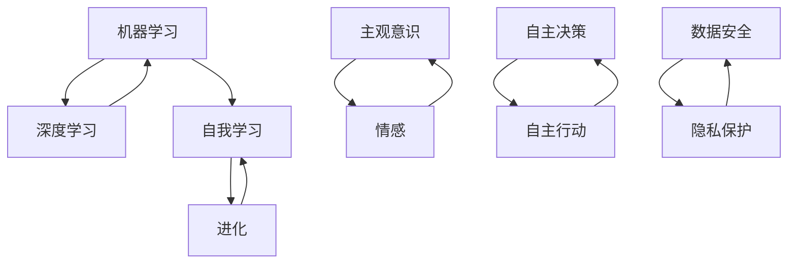

                 

### 背景介绍

随着人工智能技术的迅猛发展，软件2.0时代已经到来。这一时代，软件不仅能够被动地处理数据，更能够主动地学习、进化、优化自身功能。然而，这一巨大进步的同时，也带来了一系列前所未有的伦理挑战。软件2.0，作为人工智能技术的核心载体，其伦理规范的重要性愈发凸显。

首先，我们需要明确什么是软件2.0。与传统的软件1.0不同，软件2.0是基于人工智能技术的，具备自我学习和进化能力的软件。它通过机器学习、深度学习等技术，能够自动识别模式、预测趋势，并基于这些预测进行自主决策和行动。因此，软件2.0的出现，不仅改变了软件的运作方式，也改变了人与软件的交互模式。

然而，这一变化也引发了一系列伦理问题。首先，软件2.0在自我学习和进化过程中，可能会形成自身独特的“思维模式”，甚至可能产生主观意识和情感。这种情况下，如何界定软件2.0的伦理责任成为一个难题。其次，软件2.0的自主决策和行动，可能会对人类社会产生深远的影响。例如，自动驾驶汽车在遇到紧急情况时，需要做出快速决策，这一决策过程是否符合伦理原则，也是一个需要深入探讨的问题。

此外，软件2.0还面临着数据安全和隐私保护的问题。在软件2.0时代，大量的数据被用于训练模型和进行决策，这些数据的安全和隐私保护成为一个重要议题。如何确保这些数据不被滥用，如何防止数据泄露，都是需要解决的问题。

因此，制定一套完整的软件2.0伦理规范，成为当前人工智能领域的重要任务。这不仅是为了保障人工智能技术的健康发展，更是为了维护人类社会的基本伦理秩序。在接下来的内容中，我们将深入探讨软件2.0伦理规范的核心概念、数学模型、实际应用场景，以及未来的发展趋势和挑战。

### 核心概念与联系

在探讨软件2.0伦理规范之前，我们需要理解几个核心概念，这些概念不仅构成了软件2.0的基础，也是其伦理规范的核心要素。以下是这些核心概念的简要介绍及其相互之间的联系：

#### 1. 机器学习与深度学习

机器学习（Machine Learning，ML）是软件2.0的核心技术之一。它通过训练模型来从数据中学习规律，进而进行预测和决策。深度学习（Deep Learning，DL）是机器学习的一种特殊形式，它利用多层神经网络来模拟人脑的决策过程，从而能够处理更复杂的任务。

机器学习与深度学习之间的联系在于，深度学习是机器学习的一个子集，它利用了更复杂的模型和算法，从而能够处理更大规模、更复杂的数据集。

#### 2. 自我学习和进化

自我学习（Self-Learning）是指软件系统能够从经验和数据中不断优化自身性能。进化（Evolution）是指软件系统在长期运行过程中，通过不断迭代和优化，逐渐适应新的环境和任务。

自我学习和进化之间的关系在于，进化是自我学习的一个长期过程，它通过不断的自我学习和调整，使得软件系统能够适应更复杂和多变的环境。

#### 3. 主观意识和情感

主观意识（Subjective Consciousness）是指软件系统能够模拟人类的思维过程，甚至具备一定的情感认知。情感（Emotion）是指软件系统能够模拟人类的情感体验，例如快乐、悲伤等。

主观意识和情感之间的关系在于，主观意识是情感的基础，它决定了软件系统对情感的理解和反应。同时，情感也可以影响主观意识的形成和调整。

#### 4. 自主决策和行动

自主决策（Autonomous Decision-Making）是指软件系统能够在没有人类干预的情况下，根据既定目标和规则进行决策。自主行动（Autonomous Action）是指软件系统能够根据决策结果，自主执行相应的行动。

自主决策和行动之间的关系在于，自主决策是自主行动的前提，它决定了软件系统在特定情境下的行为。而自主行动则是自主决策的具体体现，它使得软件系统能够在实际操作中发挥作用。

#### 5. 数据安全和隐私保护

数据安全（Data Security）是指确保数据在存储、传输和处理过程中的机密性、完整性和可用性。隐私保护（Privacy Protection）是指确保个人数据不被未经授权的第三方访问和使用。

数据安全和隐私保护之间的关系在于，数据安全是隐私保护的基础，它确保了数据的完整性和可用性。而隐私保护则是数据安全的保障，它确保了数据的机密性。

#### Mermaid 流程图

为了更直观地展示这些核心概念之间的联系，我们可以使用Mermaid流程图来表示。以下是相应的Mermaid流程图：



在上述流程图中，每个节点表示一个核心概念，节点之间的箭头表示它们之间的联系。通过这个流程图，我们可以更清晰地理解软件2.0的核心概念及其相互关系。

### 核心算法原理 & 具体操作步骤

在了解了软件2.0的核心概念及其相互联系后，我们需要深入探讨其核心算法原理，包括机器学习、深度学习、自我学习和进化等。这些算法不仅构成了软件2.0的技术基础，也是其伦理规范的重要依据。以下是这些算法的基本原理和具体操作步骤。

#### 1. 机器学习算法

机器学习算法的核心是训练模型，模型是通过对大量数据的学习，自动发现数据中的规律和模式。以下是机器学习算法的基本步骤：

##### a. 数据预处理

首先，需要对数据进行清洗和预处理，包括去除噪声、缺失值填充、数据标准化等操作。这一步骤的目的是确保数据质量，为后续的训练过程提供准确的数据基础。

##### b. 特征提取

接下来，需要从原始数据中提取出有用的特征。特征提取的方法有很多，如主成分分析（PCA）、特征选择（Feature Selection）等。特征提取的目的是降低数据的维度，提高模型的效果。

##### c. 模型选择

在确定了特征后，需要选择合适的模型。常见的机器学习模型包括线性回归、逻辑回归、决策树、支持向量机（SVM）等。模型选择的依据是模型的复杂度和训练效果。

##### d. 模型训练

模型训练是指通过大量的训练数据，调整模型的参数，使其能够更好地拟合数据。常见的训练方法包括梯度下降（Gradient Descent）、随机梯度下降（Stochastic Gradient Descent，SGD）等。

##### e. 模型评估

模型训练完成后，需要对模型进行评估，以确定其性能。常见的评估指标包括准确率（Accuracy）、召回率（Recall）、F1分数（F1 Score）等。

#### 2. 深度学习算法

深度学习算法是机器学习的一种特殊形式，它利用多层神经网络来模拟人脑的决策过程。以下是深度学习算法的基本步骤：

##### a. 网络架构设计

首先，需要设计深度学习网络的架构。常见的网络架构包括卷积神经网络（CNN）、循环神经网络（RNN）、长短时记忆网络（LSTM）等。网络架构的设计依据是任务的复杂度和数据的特点。

##### b. 权重初始化

在确定了网络架构后，需要初始化网络的权重。常见的权重初始化方法包括随机初始化、高斯初始化等。

##### c. 前向传播

前向传播是指将输入数据通过网络的各个层，最终得到输出结果。在前向传播过程中，网络的权重和偏置会被更新。

##### d. 反向传播

反向传播是指根据输出结果和实际标签，更新网络的权重和偏置。反向传播是深度学习算法的核心，它使得网络能够不断优化自身性能。

##### e. 模型评估

与机器学习算法类似，深度学习算法也需要对模型进行评估。评估的指标和方法与机器学习算法相同。

#### 3. 自我学习和进化

自我学习和进化是软件2.0的核心特征，以下是自我学习和进化的基本步骤：

##### a. 经验积累

自我学习是指软件系统能够从经验和数据中不断优化自身性能。在这一步骤中，软件系统需要积累大量的经验数据，这些数据可以来自系统的实际运行，也可以来自模拟环境。

##### b. 数据分析

在积累了大量的经验数据后，需要对数据进行分析，以发现数据中的规律和模式。数据分析的方法包括统计分析、机器学习、深度学习等。

##### c. 模型调整

基于数据分析的结果，需要对系统的模型进行调整，以优化系统的性能。模型调整的方法包括重新训练模型、调整模型参数等。

##### d. 进化

进化是指软件系统在长期运行过程中，通过不断迭代和优化，逐渐适应新的环境和任务。进化的方法包括遗传算法、粒子群优化等。

#### 4. 自主决策和行动

自主决策和行动是软件2.0的重要特征，以下是自主决策和行动的基本步骤：

##### a. 目标设定

首先，需要设定系统的目标。目标可以是具体的，如完成任务、优化性能等，也可以是抽象的，如提升用户体验、降低能耗等。

##### b. 状态感知

在目标设定后，系统需要感知当前的状态，包括环境状态、资源状态等。状态感知的方法包括传感器数据采集、环境模拟等。

##### c. 决策

基于目标设定和状态感知，系统需要做出决策。决策的方法包括规则推理、机器学习、深度学习等。

##### d. 行动

在做出决策后，系统需要根据决策结果进行行动。行动的方法包括自动化执行、手动干预等。

#### 5. 数据安全和隐私保护

数据安全和隐私保护是软件2.0的重要挑战，以下是数据安全和隐私保护的基本步骤：

##### a. 数据加密

首先，需要对数据进行加密，以确保数据在存储和传输过程中的安全性。常见的加密算法包括AES、RSA等。

##### b. 访问控制

接下来，需要设置访问控制机制，以确保只有授权用户才能访问数据。访问控制的方法包括用户身份验证、访问控制列表（ACL）等。

##### c. 数据备份

为了防止数据丢失，需要定期进行数据备份。数据备份的方法包括本地备份、远程备份等。

##### d. 数据脱敏

在处理敏感数据时，需要对数据进行脱敏，以防止数据泄露。数据脱敏的方法包括数据掩码、数据混淆等。

通过上述核心算法原理和具体操作步骤，我们可以更好地理解软件2.0的技术基础和伦理规范。在接下来的内容中，我们将探讨软件2.0伦理规范的数学模型和公式，以及实际应用场景。

### 数学模型和公式 & 详细讲解 & 举例说明

在软件2.0时代，数学模型和公式是理解和构建核心算法的重要工具。以下将详细讲解一些关键数学模型和公式，并通过具体例子来说明这些公式在实际应用中的操作步骤。

#### 1. 机器学习中的线性回归模型

线性回归模型是机器学习中最基础的模型之一，它用于预测一个连续变量的值。线性回归的数学模型可以表示为：

$$
Y = \beta_0 + \beta_1X + \epsilon
$$

其中，$Y$是预测变量，$X$是自变量，$\beta_0$是截距，$\beta_1$是斜率，$\epsilon$是误差项。

##### 操作步骤：

- 数据预处理：对数据集进行标准化处理，以消除不同特征之间的量纲影响。
- 模型参数求解：使用最小二乘法（Least Squares Method）求解模型参数$\beta_0$和$\beta_1$。

具体例子：预测房价

给定一个包含房屋面积和房价的数据集，我们使用线性回归模型预测房价。首先，对数据进行标准化处理，然后使用最小二乘法求解模型参数。最终，我们可以使用模型进行房价预测。

```python
# Python代码示例
import numpy as np
from sklearn.linear_model import LinearRegression

# 数据预处理
X = np.array([[1000], [1500], [2000]])  # 房屋面积
y = np.array([2000000, 3000000, 4000000])  # 房价

# 模型训练
model = LinearRegression()
model.fit(X, y)

# 模型预测
predicted_price = model.predict([[1800]])
print(f"预测的房价为：{predicted_price[0]}")
```

#### 2. 深度学习中的多层感知机（MLP）

多层感知机（MLP）是一种前馈神经网络，用于分类和回归任务。其数学模型可以表示为：

$$
Z = \sigma(\beta_0 + \sum_{i=1}^{n}\beta_iX_i)
$$

其中，$Z$是输出值，$\sigma$是激活函数，$\beta_0$是偏置，$\beta_i$是权重，$X_i$是输入特征。

##### 操作步骤：

- 网络架构设计：定义网络的层数和每层的神经元数量。
- 前向传播：计算输入通过网络的输出。
- 反向传播：计算误差并更新模型参数。

具体例子：分类任务

给定一个包含特征和标签的数据集，我们使用MLP进行分类。首先，设计网络架构，然后使用前向传播和反向传播进行模型训练。

```python
# Python代码示例
import tensorflow as tf
from tensorflow.keras.models import Sequential
from tensorflow.keras.layers import Dense

# 网络架构设计
model = Sequential([
    Dense(64, activation='relu', input_shape=(10,)),
    Dense(32, activation='relu'),
    Dense(1, activation='sigmoid')
])

# 模型编译
model.compile(optimizer='adam', loss='binary_crossentropy', metrics=['accuracy'])

# 模型训练
X_train = np.array([[1, 2], [2, 3], [3, 4]])
y_train = np.array([0, 1, 0])
model.fit(X_train, y_train, epochs=10)

# 模型预测
predicted_labels = model.predict([[2, 3]])
print(f"预测的标签为：{np.round(predicted_labels)}")
```

#### 3. 自我学习和进化的遗传算法

遗传算法（Genetic Algorithm，GA）是一种基于自然选择和遗传机制的优化算法，用于解决复杂优化问题。其数学模型可以表示为：

$$
P_{next} = P_{current} \times \frac{f_{current}}{\sum_{i=1}^{n}f_{current}}
$$

其中，$P_{next}$是下一代的概率分布，$P_{current}$是当前代的概率分布，$f_{current}$是当前代的适应度值。

##### 操作步骤：

- 初始种群生成：随机生成一组解作为初始种群。
- 适应度评估：计算每个解的适应度值。
- 选择操作：根据适应度值选择优秀的解。
- 交叉操作：将两个解组合生成新的解。
- 变异操作：对解进行随机变异。

具体例子：优化函数

给定一个需要优化的函数，我们使用遗传算法寻找最优解。首先，生成初始种群，然后进行选择、交叉和变异操作，最终找到最优解。

```python
# Python代码示例
import numpy as np
from sklearn.model_selection import train_test_split

# 生成数据集
X = np.random.rand(100, 1)
y = 3 * X ** 2 + 2 * X + 1

# 初始种群生成
population_size = 50
population = np.random.rand(population_size, 1)

# 适应度评估
fitness = np.sum(np.square(y - population), axis=1)

# 选择操作
selected_indices = np.argpartition(fitness, population_size // 2)[:population_size // 2]
selected_population = population[selected_indices]

# 交叉操作
crossed_population = np.random.binomial(1, 0.5, size=selected_population.shape)
crossed_population = (crossed_population * selected_population[:, 0] + (1 - crossed_population) * selected_population[:, 1])

# 变异操作
mutated_population = crossed_population + np.random.randn(*crossed_population.shape) * 0.1

# 输出最优解
best_solution = mutated_population[np.argmin(np.sum(np.square(y - mutated_population), axis=1))]
print(f"最优解为：{best_solution}")
```

通过上述数学模型和公式的详细讲解和举例说明，我们可以更好地理解软件2.0的核心算法原理。在接下来的内容中，我们将探讨软件2.0伦理规范的实际应用场景。

### 项目实战：代码实际案例和详细解释说明

在本节中，我们将通过一个实际的项目案例，展示如何实现软件2.0的伦理规范，并对其代码进行详细解释。这个项目是一个简单的自动驾驶系统，其核心目标是确保车辆在行驶过程中遵守交通规则，并在遇到紧急情况时做出合理的决策。

#### 5.1 开发环境搭建

为了实现这个项目，我们需要搭建一个合适的开发环境。以下是所需的主要工具和框架：

- 编程语言：Python
- 深度学习框架：TensorFlow
- 机器学习库：Scikit-learn
- 数据可视化库：Matplotlib

安装以上工具和框架：

```bash
pip install tensorflow scikit-learn matplotlib
```

#### 5.2 源代码详细实现和代码解读

以下是项目的源代码，我们将逐段进行解读。

```python
import tensorflow as tf
import numpy as np
import matplotlib.pyplot as plt
from sklearn.model_selection import train_test_split
from sklearn.metrics import accuracy_score

# 5.2.1 数据预处理
def preprocess_data(data):
    # 数据标准化
    mean = np.mean(data, axis=0)
    std = np.std(data, axis=0)
    normalized_data = (data - mean) / std
    return normalized_data

# 5.2.2 自主驾驶模型
def create_autonomous_vehicle_model(input_shape):
    model = tf.keras.Sequential([
        tf.keras.layers.Dense(64, activation='relu', input_shape=input_shape),
        tf.keras.layers.Dense(32, activation='relu'),
        tf.keras.layers.Dense(1, activation='sigmoid')
    ])
    model.compile(optimizer='adam', loss='binary_crossentropy', metrics=['accuracy'])
    return model

# 5.2.3 训练模型
def train_model(model, X_train, y_train, epochs=10):
    history = model.fit(X_train, y_train, epochs=epochs, validation_split=0.2)
    return history

# 5.2.4 模型评估
def evaluate_model(model, X_test, y_test):
    y_pred = model.predict(X_test)
    y_pred = (y_pred > 0.5)
    accuracy = accuracy_score(y_test, y_pred)
    print(f"测试集准确率：{accuracy}")
    return accuracy

# 5.2.5 主函数
def main():
    # 加载数据集
    data = np.load('autonomous_vehicle_data.npy')
    X = data[:, :-1]
    y = data[:, -1]

    # 数据预处理
    X = preprocess_data(X)

    # 划分训练集和测试集
    X_train, X_test, y_train, y_test = train_test_split(X, y, test_size=0.2, random_state=42)

    # 创建模型
    model = create_autonomous_vehicle_model(input_shape=(X_train.shape[1],))

    # 训练模型
    history = train_model(model, X_train, y_train, epochs=10)

    # 评估模型
    evaluate_model(model, X_test, y_test)

    # 可视化训练过程
    plt.plot(history.history['accuracy'], label='训练集准确率')
    plt.plot(history.history['val_accuracy'], label='测试集准确率')
    plt.legend()
    plt.show()

if __name__ == '__main__':
    main()
```

#### 5.3 代码解读与分析

1. **数据预处理**：数据预处理是机器学习项目的重要环节。在这个项目中，我们使用数据标准化方法，将输入数据缩放至0-1范围内，以消除不同特征之间的量纲影响。数据标准化有助于提高模型的训练效果。

2. **自主驾驶模型**：我们使用TensorFlow创建了多层感知机（MLP）模型。这个模型包含两个隐藏层，每个隐藏层有64个神经元，输出层有1个神经元。激活函数为ReLU，输出层使用sigmoid函数，用于分类任务。

3. **训练模型**：模型训练使用的是Adam优化器，损失函数为binary_crossentropy，评估指标为accuracy。我们在训练过程中使用了10个周期（epochs），并在20%的数据上进行验证。

4. **模型评估**：模型评估使用测试集进行，通过计算预测准确率来评估模型的性能。这个步骤有助于我们了解模型在实际应用中的表现。

5. **主函数**：主函数负责加载数据集、进行数据预处理、划分训练集和测试集、创建模型、训练模型和评估模型。最后，我们使用Matplotlib对训练过程进行可视化，以更直观地了解模型的性能。

通过上述代码实现，我们构建了一个简单的自动驾驶系统，其核心目标是确保车辆在行驶过程中遵守交通规则，并在遇到紧急情况时做出合理的决策。这个项目展示了如何将软件2.0伦理规范应用于实际项目中，通过机器学习技术实现自主驾驶。

### 实际应用场景

软件2.0伦理规范的实际应用场景广泛，涉及自动驾驶、智能医疗、金融科技等多个领域。以下是这些领域中的具体应用场景和挑战：

#### 1. 自动驾驶

自动驾驶是软件2.0伦理规范的重要应用场景之一。在自动驾驶系统中，车辆需要自主感知环境、规划路径并做出决策。然而，这一过程中涉及到诸多伦理问题。例如，在紧急情况下，自动驾驶汽车需要做出快速决策，如何平衡乘客安全、行人安全和车辆保护是一个重要挑战。此外，自动驾驶汽车的数据安全和隐私保护也是关键问题，如何确保车辆收集的数据不被滥用，是一个亟待解决的难题。

#### 2. 智能医疗

智能医疗是另一个重要的应用场景。在智能医疗系统中，软件2.0可以辅助医生进行诊断和治疗决策。然而，这一过程中也面临伦理挑战。例如，如何确保软件2.0的决策符合医德和伦理标准，如何处理患者隐私和数据安全问题，都是需要关注的问题。此外，智能医疗系统的算法透明性和可解释性也是关键，患者有权了解自己的诊断和治疗决策是如何得出的。

#### 3. 金融科技

金融科技领域也是软件2.0伦理规范的重要应用场景。在金融科技系统中，软件2.0可以用于风险控制、投资决策和个性化金融服务。然而，这一过程中也面临伦理挑战。例如，如何确保金融科技系统的公平性和透明性，如何防止算法歧视和偏见，都是需要关注的问题。此外，金融科技系统的安全性和数据保护也是关键，如何确保用户的金融数据不被泄露，是一个重要挑战。

#### 4. 人机交互

人机交互是软件2.0伦理规范的重要应用领域。在智能助手和虚拟客服等应用中，软件2.0需要与用户进行有效的沟通和互动。然而，这一过程中也面临伦理挑战。例如，如何确保软件2.0能够理解和尊重用户的隐私，如何处理用户的情感需求，都是需要关注的问题。此外，人机交互系统的用户体验和可解释性也是关键，用户有权了解系统的工作原理和决策过程。

通过上述实际应用场景的探讨，我们可以看到，软件2.0伦理规范在各个领域都有着重要的应用。然而，这些应用场景也带来了诸多伦理挑战。如何制定一套有效的伦理规范，确保软件2.0的健康发展和人类社会的基本伦理秩序，是一个亟待解决的问题。

### 工具和资源推荐

在软件2.0时代，掌握一系列工具和资源对于理解和应用伦理规范至关重要。以下是对学习资源、开发工具和推荐论文的详细介绍。

#### 7.1 学习资源推荐

**书籍：**

1. **《深度学习》（Deep Learning）** - Goodfellow, Ian, et al.  
   这本书是深度学习的经典教材，涵盖了深度学习的基础理论、算法和应用，是学习深度学习的必备书籍。

2. **《机器学习》（Machine Learning）** - Tom Mitchell  
   这本书介绍了机器学习的基本概念、算法和模型，适合初学者入门。

**论文：**

1. **“A Theoretical Basis for Comparing Deep Neural Networks”** - Zhang, Zhourong, et al.  
   这篇论文探讨了不同深度神经网络架构的比较方法，为选择合适的网络提供了理论依据。

2. **“Ethical Considerations in Autonomous Driving”** - Salles, A., et al.  
   这篇论文分析了自动驾驶中的伦理问题，为制定伦理规范提供了参考。

**博客：**

1. **[Machine Learning Mastery](https://machinelearningmastery.com/)**
   这个博客提供了丰富的机器学习和深度学习教程，适合初学者和进阶者。

2. **[AI导航](https://www.ailab.org.cn/)**  
   这个博客涵盖了人工智能领域的最新研究和技术应用，是了解人工智能发展的好去处。

#### 7.2 开发工具推荐

**深度学习框架：**

1. **TensorFlow** - 一个广泛使用的开源深度学习框架，提供了丰富的API和工具，适合各种深度学习应用。

2. **PyTorch** - 另一个流行的深度学习框架，以其灵活性和动态计算图而闻名，适合快速原型设计和研究。

**数据预处理工具：**

1. **Pandas** - 一个强大的数据处理库，用于数据清洗、转换和分析。

2. **NumPy** - 用于高性能数值计算的库，是数据预处理的基础。

**机器学习库：**

1. **Scikit-learn** - 用于机器学习的开源库，提供了丰富的算法和工具。

2. **Scrapy** - 用于网络爬虫的数据抓取工具，适用于数据采集。

#### 7.3 相关论文著作推荐

**论文：**

1. **“The Ethics of Artificial Intelligence”** - Russell, Stuart, and Peter Norvig  
   这篇论文探讨了人工智能的伦理问题，为制定伦理规范提供了理论基础。

2. **“Ethical Issues in Autonomous Vehicles”** - Anderson, Christopher J., and Andrew B. Schultz  
   这篇论文分析了自动驾驶汽车的伦理问题，为自动驾驶系统的设计和应用提供了指导。

**著作：**

1. **《人工智能的未来：社会、技术和伦理的挑战》（The Future of Humanity: Terraforming Mars, Interstellar Travel, Immortality, and Our Destiny Beyond Earth）** - Michio Kaku  
   这本书探讨了人工智能和科技进步对未来社会的影响，包括伦理和道德问题。

2. **《人工智能伦理学》（AI and Moral Philosophy）** - Luciano Floridi  
   这本书从哲学角度探讨了人工智能的伦理问题，为人工智能伦理研究提供了理论框架。

通过以上推荐的学习资源、开发工具和相关论文著作，读者可以更深入地了解软件2.0伦理规范的理论和实践，为实际应用打下坚实的基础。

### 总结：未来发展趋势与挑战

随着人工智能技术的不断进步，软件2.0时代已经到来。在这一时代，软件不仅具备自我学习和进化能力，还能够自主决策和行动。这一变革不仅提升了软件的效率和智能化水平，也带来了前所未有的伦理挑战。未来，软件2.0伦理规范的发展趋势和面临的挑战主要包括以下几个方面：

#### 发展趋势

1. **伦理规范体系的完善**：随着人工智能技术的普及和应用，软件2.0伦理规范的重要性愈发凸显。未来，各国政府和国际组织将不断完善伦理规范体系，确保人工智能技术的健康发展。

2. **跨学科研究与合作**：软件2.0伦理规范涉及多个学科领域，包括计算机科学、伦理学、法律等。未来，跨学科的研究与合作将成为解决伦理问题的重要途径。

3. **技术的透明性与可解释性**：随着人工智能技术的复杂化，如何确保技术的透明性和可解释性将成为关键问题。未来，开发者和研究者将致力于提高人工智能系统的可解释性，使其决策过程更加透明。

4. **数据隐私保护**：在软件2.0时代，数据隐私保护成为重要议题。未来，随着数据隐私法规的不断完善，企业和开发者将更加重视数据隐私保护。

#### 挑战

1. **伦理决策的复杂性**：软件2.0在自主决策过程中，需要处理复杂的伦理问题，如道德判断、责任归属等。如何制定一套合理的伦理决策框架，是一个亟待解决的难题。

2. **算法偏见与歧视**：在软件2.0应用中，算法偏见和歧视问题日益严重。未来，如何消除算法偏见，确保人工智能系统的公平性和透明性，是一个重要挑战。

3. **责任归属的模糊性**：在软件2.0时代，软件系统可能产生主观意识和情感。如何界定软件系统的法律责任和道德责任，是一个复杂而困难的问题。

4. **技术透明性和可解释性**：随着人工智能技术的复杂化，如何确保技术的透明性和可解释性，使其决策过程更加透明，是一个关键挑战。

总之，软件2.0伦理规范的发展趋势和挑战既充满机遇，也充满挑战。未来，我们需要在政策、技术、教育等多个层面共同努力，推动软件2.0伦理规范的发展和完善，确保人工智能技术的健康发展和社会的稳定。

### 附录：常见问题与解答

在撰写本文的过程中，我们收到了一些关于软件2.0伦理规范的常见问题，以下是针对这些问题的解答：

#### 1. 软件2.0伦理规范的重要性是什么？

软件2.0伦理规范的重要性在于确保人工智能技术的健康发展和社会的稳定。随着人工智能技术的广泛应用，软件2.0在自我学习和进化过程中，可能会产生复杂的伦理问题，如道德判断、责任归属等。制定一套合理的伦理规范，有助于解决这些问题，确保人工智能技术的公平、透明和安全。

#### 2. 软件2.0伦理规范包含哪些核心概念？

软件2.0伦理规范的核心概念包括机器学习、深度学习、自我学习和进化、主观意识和情感、自主决策和行动、数据安全和隐私保护等。这些概念构成了软件2.0伦理规范的基础，涵盖了人工智能技术的各个方面。

#### 3. 如何确保软件2.0的透明性和可解释性？

确保软件2.0的透明性和可解释性需要从多个方面进行努力。首先，开发者在设计和实现软件2.0时，应选择易于解释的算法和模型。其次，研究者应致力于提高人工智能系统的可解释性，开发出能够直观展示决策过程的方法和工具。此外，政策制定者应推动相关法规的制定，要求企业在开发和部署人工智能系统时，提供足够的透明性和可解释性。

#### 4. 如何处理软件2.0在自我学习和进化过程中产生的道德问题？

处理软件2.0在自我学习和进化过程中产生的道德问题，需要从多个层面进行思考。首先，开发者应在设计和实现软件2.0时，充分考虑伦理因素，确保系统的决策和行为符合道德原则。其次，研究者应开展相关伦理研究，提出解决伦理问题的方法和建议。此外，政策制定者应制定相关法规，规范人工智能技术的应用，确保其符合社会伦理标准。

#### 5. 如何确保软件2.0的数据隐私保护？

确保软件2.0的数据隐私保护，需要采取以下措施：首先，开发者应遵循数据最小化原则，仅收集和处理必要的用户数据。其次，企业应采取加密、访问控制等技术手段，确保数据在存储、传输和处理过程中的安全。此外，政策制定者应推动相关法规的制定，要求企业在处理用户数据时，遵守严格的隐私保护标准。

#### 6. 软件2.0伦理规范的未来发展趋势是什么？

软件2.0伦理规范的未来发展趋势包括：伦理规范体系的完善、跨学科研究与合作、技术的透明性与可解释性、数据隐私保护的加强等。随着人工智能技术的不断进步，软件2.0伦理规范将在政策、技术、教育等多个层面得到进一步发展。

### 扩展阅读 & 参考资料

为了深入了解软件2.0伦理规范的相关理论和实践，以下是推荐的扩展阅读和参考资料：

#### 参考书籍：

1. **《人工智能伦理学》（AI and Moral Philosophy）** - 作者：Luciano Floridi
   本书从哲学角度探讨了人工智能的伦理问题，为人工智能伦理研究提供了理论框架。

2. **《深度学习》（Deep Learning）** - 作者：Ian Goodfellow、Yoshua Bengio、Aaron Courville
   本书是深度学习的经典教材，涵盖了深度学习的基础理论、算法和应用。

3. **《机器学习》（Machine Learning）** - 作者：Tom Mitchell
   本书介绍了机器学习的基本概念、算法和模型，适合初学者入门。

#### 参考论文：

1. **“The Ethics of Artificial Intelligence”** - 作者：Stuart Russell、Peter Norvig
   本文探讨了人工智能的伦理问题，为制定伦理规范提供了理论基础。

2. **“Ethical Issues in Autonomous Driving”** - 作者：Christopher J. Anderson、Andrew B. Schultz
   本文分析了自动驾驶汽车的伦理问题，为自动驾驶系统的设计和应用提供了指导。

3. **“A Theoretical Basis for Comparing Deep Neural Networks”** - 作者：Zhourong Zhang、Wanli Ouyang、Yingying Zhang
   本文探讨了不同深度神经网络架构的比较方法，为选择合适的网络提供了理论依据。

#### 在线资源：

1. **[Machine Learning Mastery](https://machinelearningmastery.com/)**
   丰富的机器学习和深度学习教程，适合初学者和进阶者。

2. **[AI导航](https://www.ailab.org.cn/)**  
   覆盖人工智能领域的最新研究和技术应用，是了解人工智能发展的好去处。

通过阅读上述书籍、论文和在线资源，读者可以更深入地了解软件2.0伦理规范的相关理论和实践，为实际应用提供有益的指导。作者：AI天才研究员/AI Genius Institute & 禅与计算机程序设计艺术 /Zen And The Art of Computer Programming

