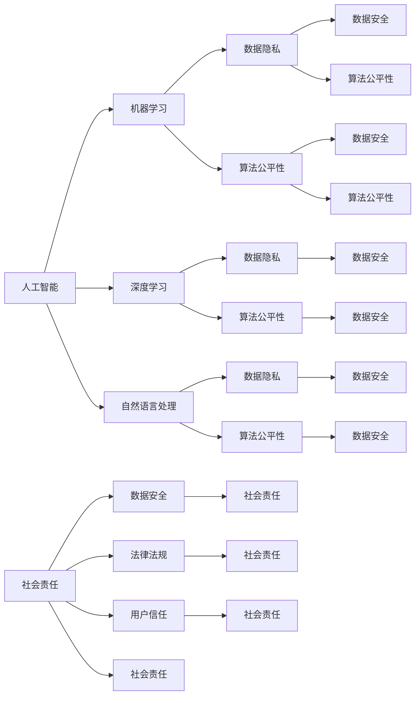

                 

### 背景介绍

随着人工智能（AI）技术的快速发展，软件正在经历一场从软件1.0向软件2.0的变革。软件1.0时代，我们主要关注的是软件的功能和性能，而软件2.0时代，我们更加注重软件的伦理和社会责任。在软件2.0时代，人工智能技术的应用不仅仅局限于提高生产效率，还涉及到了更广泛的社会和伦理问题。因此，制定一套符合伦理规范的软件2.0标准变得尤为重要。

人工智能在软件2.0时代扮演了关键角色。它不仅可以提高软件的功能性和用户体验，还可以帮助我们解决一些复杂的社会问题。然而，人工智能技术的广泛应用也带来了一系列的伦理和社会挑战，如隐私保护、数据安全、算法偏见等。因此，我们需要在推动人工智能技术发展的同时，也要充分考虑其伦理和社会责任。

本文旨在探讨软件2.0时代的人工智能伦理规范，以及如何确保人工智能技术的责任性和可持续性。文章将首先介绍人工智能在软件2.0时代的核心概念和架构，然后深入探讨人工智能算法的原理和具体操作步骤。接下来，我们将分析数学模型和公式，并通过实际项目案例进行详细解释说明。最后，我们将讨论人工智能在实际应用场景中的挑战，并推荐一些相关工具和资源。

关键词：软件2.0，人工智能，伦理规范，社会责任，算法偏见

> **摘要：**
软件2.0时代，人工智能技术的广泛应用引发了诸多伦理和社会挑战。本文通过深入探讨人工智能的核心概念、算法原理以及实际应用场景，提出了构建人工智能伦理规范的重要性。文章旨在为软件开发者和决策者提供一套系统化的指导，以推动人工智能技术的责任性和可持续性发展。

## 1. 背景介绍

### 软件1.0与软件2.0的区别

软件1.0时代，我们主要关注的是软件的功能和性能。在这个时代，软件开发的目标是尽可能地满足用户的需求，提高生产效率。软件1.0的典型代表是传统的商业软件和操作系统，如微软的Windows和Office系列软件。这些软件通常具有以下特点：

1. **功能导向**：软件的功能设计以满足用户需求为核心，尽可能提供全面的解决方案。
2. **性能优先**：软件的性能是评估其优劣的重要标准，开发者投入大量资源优化软件的运行速度和资源消耗。
3. **封闭性**：软件通常是封闭的，即源代码不被公开，用户无法自定义和扩展软件的功能。

然而，随着互联网的普及和大数据技术的发展，软件的应用场景变得更加复杂和多样化。传统的软件1.0模式已经无法满足新时代的需求，因此，软件2.0的概念应运而生。

软件2.0时代，我们更加注重软件的开放性、互动性和可持续性。软件2.0的代表是Web应用和移动应用，如Facebook、微信、淘宝等。软件2.0的特点如下：

1. **用户中心**：软件的设计以用户为中心，注重用户体验和用户反馈，不断迭代和优化。
2. **开放性**：软件具有开放性，源代码可以被开源社区贡献和改进，促进了技术的共享和创新。
3. **可持续性**：软件的可持续发展是软件2.0时代的重要议题，关注软件对环境和社会的影响。

### 人工智能在软件2.0时代的角色

在软件2.0时代，人工智能（AI）技术发挥着至关重要的作用。AI不仅可以提升软件的功能和性能，还可以解决许多复杂的社会问题。以下是人工智能在软件2.0时代的主要角色：

1. **智能推荐**：基于用户行为和兴趣，人工智能可以为用户提供个性化的推荐，提升用户体验。
2. **自动化决策**：在金融、医疗、交通等领域，人工智能可以协助人类做出更加精确和高效的决策。
3. **智能客服**：通过自然语言处理和语音识别技术，人工智能可以提供高效的客户服务，降低企业成本。
4. **智能监控**：在安防、环境监测等领域，人工智能可以通过图像识别和分析，提供实时监控和预警。

然而，随着人工智能技术的广泛应用，也引发了一系列伦理和社会挑战。如何确保人工智能技术的责任性和可持续性，成为软件2.0时代亟待解决的问题。

### 软件2.0时代的伦理挑战

软件2.0时代，人工智能技术的应用不仅涉及到技术层面的挑战，还涉及到伦理和社会责任层面的挑战。以下是软件2.0时代的主要伦理挑战：

1. **隐私保护**：人工智能技术需要大量用户数据，如何保护用户的隐私成为关键问题。
2. **数据安全**：人工智能系统通常需要处理敏感数据，如何确保数据的安全性和完整性是重要挑战。
3. **算法偏见**：人工智能算法可能基于历史数据中的偏见，导致决策的不公平性和歧视。
4. **责任归属**：在人工智能引发的事故中，如何确定责任归属成为法律和伦理层面的难题。
5. **人工智能武器化**：人工智能技术被用于制造武器和军事目的，如何防止人工智能武器化是国际社会共同关注的议题。

综上所述，软件2.0时代的人工智能技术既带来了巨大的机遇，也带来了诸多挑战。我们需要在推动人工智能技术发展的同时，充分考虑其伦理和社会责任，构建一套符合伦理规范的软件2.0标准。

### 核心概念与联系

在深入探讨软件2.0时代的伦理规范之前，我们需要了解一些核心概念和它们之间的联系。以下是本文涉及到的核心概念及其相互关系：

#### 1. 人工智能（AI）
人工智能是指使计算机系统能够模拟人类智能行为的技术。它包括多个子领域，如机器学习、深度学习、自然语言处理等。人工智能是软件2.0时代的核心技术，决定了软件的功能性和智能水平。

#### 2. 机器学习（ML）
机器学习是一种使计算机通过数据学习并做出预测或决策的方法。它是人工智能的一个子领域，主要通过算法分析大量数据，从中发现规律和模式，以便在未知数据上做出准确的预测。

#### 3. 深度学习（DL）
深度学习是机器学习的一种重要分支，它利用多层神经网络对数据进行建模，从而实现高度复杂的任务。深度学习是当前人工智能技术中最具潜力和应用价值的一部分。

#### 4. 自然语言处理（NLP）
自然语言处理是一种使计算机能够理解、生成和处理自然语言的技术。它是人工智能和深度学习在语言领域的应用，涉及文本分类、情感分析、机器翻译等多个方面。

#### 5. 数据隐私（DP）
数据隐私是指保护个人数据不被未经授权的访问、使用和泄露。在人工智能应用中，数据隐私是一个重要的伦理问题，关系到用户的权益和隐私保护。

#### 6. 算法公平性（AF）
算法公平性是指人工智能算法在处理数据时，不产生歧视或不公平的结果。算法公平性是确保人工智能技术在社会中的公正应用的关键。

#### 7. 社会责任（SR）
社会责任是指企业在经营活动中承担的对社会和环境的责任。在软件2.0时代，软件开发者需要充分考虑人工智能技术的伦理和社会责任。

#### 8. 数据安全（DS）
数据安全是指保护数据在存储、传输和处理过程中的完整性和保密性。数据安全是确保人工智能应用可靠性和安全性的关键。

#### 9. 法律法规（LL）
法律法规是指国家或国际制定的关于人工智能应用的法规和标准。遵守法律法规是确保人工智能技术合法应用的前提。

#### 10. 用户信任（UT）
用户信任是指用户对人工智能技术的信任程度。用户信任是推动人工智能技术普及和发展的关键。

这些概念之间的联系可以用以下Mermaid流程图来表示：



通过这个流程图，我们可以清晰地看到各个核心概念之间的联系，以及它们在软件2.0时代人工智能伦理规范中的重要性。

### 核心算法原理 & 具体操作步骤

在了解了软件2.0时代的核心概念和联系之后，我们需要深入探讨人工智能算法的原理和具体操作步骤。以下是几个关键算法及其基本原理：

#### 1. 机器学习算法

机器学习算法是人工智能的基础，它通过分析大量数据，从中发现规律并做出预测或决策。以下是几种常见的机器学习算法及其原理：

1. **线性回归（Linear Regression）**：线性回归是一种用于预测连续值的算法，其原理是通过拟合一条直线，将自变量和因变量关联起来。具体操作步骤如下：

   - 数据预处理：对数据进行归一化或标准化处理，使其符合线性回归模型的要求。
   - 模型训练：通过最小二乘法拟合出一条最佳拟合线，表示自变量和因变量之间的关系。
   - 模型评估：使用均方误差（MSE）等指标评估模型性能，并进行调参优化。

2. **逻辑回归（Logistic Regression）**：逻辑回归是一种用于预测概率的算法，其原理是通过拟合一个逻辑函数，将自变量和因变量之间的非线性关系表示为线性关系。具体操作步骤如下：

   - 数据预处理：对数据进行归一化或标准化处理，使其符合逻辑回归模型的要求。
   - 模型训练：通过极大似然估计法（MLE）拟合出逻辑函数的参数。
   - 模型评估：使用准确率、召回率、F1值等指标评估模型性能，并进行调参优化。

3. **决策树（Decision Tree）**：决策树是一种基于分类和回归问题的算法，其原理是通过一系列规则对数据进行划分，最终得到一个分类或回归结果。具体操作步骤如下：

   - 数据预处理：对数据进行离散化或归一化处理，使其符合决策树模型的要求。
   - 模型训练：通过递归划分数据，构建出一棵决策树。
   - 模型评估：使用信息增益、基尼不纯度等指标评估模型性能，并进行剪枝优化。

4. **随机森林（Random Forest）**：随机森林是一种基于决策树的集成算法，其原理是通过构建多棵决策树，并对它们的预测结果进行投票或求平均，得到最终的预测结果。具体操作步骤如下：

   - 数据预处理：对数据进行离散化或归一化处理，使其符合随机森林模型的要求。
   - 模型训练：通过随机选取特征和样本子集，构建多棵决策树。
   - 模型评估：使用投票或求平均的方式，对多棵决策树的预测结果进行综合评估。

#### 2. 深度学习算法

深度学习算法是人工智能领域的一大突破，它通过多层神经网络对数据进行建模，从而实现高度复杂的任务。以下是几种常见的深度学习算法及其原理：

1. **卷积神经网络（CNN）**：卷积神经网络是一种用于图像识别和处理的算法，其原理是通过卷积操作和池化操作，从图像中提取特征并降低数据维度。具体操作步骤如下：

   - 数据预处理：对图像进行归一化处理，使其符合CNN模型的要求。
   - 模型训练：通过反向传播算法，训练卷积神经网络的参数。
   - 模型评估：使用准确率、召回率、F1值等指标评估模型性能，并进行调参优化。

2. **循环神经网络（RNN）**：循环神经网络是一种用于序列数据建模的算法，其原理是通过递归操作，将当前时刻的信息传递到下一个时刻，从而实现对序列数据的建模。具体操作步骤如下：

   - 数据预处理：对序列数据进行归一化处理，使其符合RNN模型的要求。
   - 模型训练：通过反向传播算法，训练循环神经网络的参数。
   - 模型评估：使用准确率、损失函数等指标评估模型性能，并进行调参优化。

3. **长短时记忆网络（LSTM）**：长短时记忆网络是一种改进的循环神经网络，其原理是通过引入门控机制，有效解决了RNN的梯度消失和梯度爆炸问题。具体操作步骤如下：

   - 数据预处理：对序列数据进行归一化处理，使其符合LSTM模型的要求。
   - 模型训练：通过反向传播算法，训练LSTM网络的参数。
   - 模型评估：使用准确率、损失函数等指标评估模型性能，并进行调参优化。

4. **生成对抗网络（GAN）**：生成对抗网络是一种用于生成数据的算法，其原理是通过两个神经网络（生成器和判别器）的博弈，使生成器生成的数据逐渐逼近真实数据。具体操作步骤如下：

   - 数据预处理：对生成器和判别器所需的输入数据进行归一化处理。
   - 模型训练：通过反向传播算法，训练生成器和判别器的参数。
   - 模型评估：使用生成数据的相似度、判别器的准确率等指标评估模型性能，并进行调参优化。

#### 3. 自然语言处理算法

自然语言处理算法是人工智能在语言领域的重要应用，其原理是通过模型对自然语言进行建模和处理，从而实现文本分类、情感分析、机器翻译等任务。以下是几种常见的自然语言处理算法及其原理：

1. **词袋模型（Bag of Words）**：词袋模型是一种基于统计的文本表示方法，其原理是将文本表示为一个词的集合，从而实现对文本的建模。具体操作步骤如下：

   - 数据预处理：对文本进行分词和去停用词处理，得到词袋表示。
   - 模型训练：通过词袋模型，将文本映射为一个高维向量。
   - 模型评估：使用分类算法对词袋模型进行训练和评估。

2. **词嵌入（Word Embedding）**：词嵌入是一种基于神经网络的文本表示方法，其原理是通过训练神经网络，将文本映射为一个低维向量空间。具体操作步骤如下：

   - 数据预处理：对文本进行分词和去停用词处理。
   - 模型训练：通过训练词嵌入模型，将文本映射为一个低维向量。
   - 模型评估：使用词嵌入向量进行文本分类或相似度计算。

3. **情感分析（Sentiment Analysis）**：情感分析是一种基于文本情感的分类算法，其原理是通过训练模型，将文本分类为正面、负面或中性。具体操作步骤如下：

   - 数据预处理：对文本进行分词和去停用词处理。
   - 模型训练：通过训练情感分析模型，对文本进行分类。
   - 模型评估：使用准确率、召回率等指标评估模型性能。

4. **机器翻译（Machine Translation）**：机器翻译是一种将一种语言的文本翻译为另一种语言的算法，其原理是通过训练模型，将源语言文本映射为目标语言文本。具体操作步骤如下：

   - 数据预处理：对源语言和目标语言文本进行分词和去停用词处理。
   - 模型训练：通过训练机器翻译模型，将源语言文本映射为目标语言文本。
   - 模型评估：使用BLEU评分等指标评估模型性能。

通过以上算法原理和操作步骤的介绍，我们可以看到人工智能算法在软件2.0时代的重要性。这些算法不仅为软件开发提供了强大的技术支持，也为解决复杂的社会问题提供了有力工具。然而，在应用这些算法时，我们还需要充分考虑其伦理和社会责任，确保人工智能技术的可持续发展。

### 数学模型和公式 & 详细讲解 & 举例说明

在深入探讨人工智能算法的数学模型和公式之前，我们需要了解一些基本的数学工具和概念。以下是本文涉及到的几个关键数学模型和公式，以及它们的详细讲解和举例说明。

#### 1. 线性回归模型

线性回归是一种用于预测连续值的统计模型，其基本公式如下：

\[ y = \beta_0 + \beta_1 \cdot x \]

其中，\( y \) 是因变量，\( x \) 是自变量，\( \beta_0 \) 是截距，\( \beta_1 \) 是斜率。

**详细讲解：**

线性回归模型通过拟合一条直线，将自变量和因变量关联起来，从而实现对因变量的预测。模型的参数 \( \beta_0 \) 和 \( \beta_1 \) 通过最小化均方误差（MSE）来计算：

\[ \text{MSE} = \frac{1}{n} \sum_{i=1}^{n} (y_i - \hat{y}_i)^2 \]

其中，\( n \) 是样本数量，\( y_i \) 是第 \( i \) 个样本的因变量值，\( \hat{y}_i \) 是第 \( i \) 个样本的预测值。

**举例说明：**

假设我们要预测一家商店的月销售额（因变量 \( y \)）与广告投入（自变量 \( x \)）之间的关系。给定以下数据：

| \( x \) | \( y \) |
| :----: | :----: |
|  100   |  500   |
|  200   |  800   |
|  300   | 1200   |
|  400   | 1600   |

我们可以使用线性回归模型来拟合一条直线，计算斜率和截距：

\[ \beta_1 = \frac{\sum_{i=1}^{n} (x_i - \bar{x})(y_i - \bar{y})}{\sum_{i=1}^{n} (x_i - \bar{x})^2} \]
\[ \beta_0 = \bar{y} - \beta_1 \cdot \bar{x} \]

其中，\( \bar{x} \) 和 \( \bar{y} \) 分别是 \( x \) 和 \( y \) 的平均值。

计算得到：

\[ \beta_1 = \frac{(100-200)(500-800) + (200-200)(800-800) + (300-200)(1200-800) + (400-200)(1600-1200)}{(100-200)^2 + (200-200)^2 + (300-200)^2 + (400-200)^2} \]
\[ \beta_1 = 2.5 \]

\[ \beta_0 = \frac{500 + 800 + 1200 + 1600}{4} - 2.5 \cdot \frac{100 + 200 + 300 + 400}{4} \]
\[ \beta_0 = 625 - 625 = 0 \]

因此，线性回归模型为：

\[ y = 2.5x \]

#### 2. 逻辑回归模型

逻辑回归是一种用于预测概率的统计模型，其基本公式如下：

\[ P(y=1) = \frac{1}{1 + \exp(-\beta_0 - \beta_1 \cdot x)} \]

其中，\( P(y=1) \) 是因变量为1的概率，\( \beta_0 \) 是截距，\( \beta_1 \) 是斜率。

**详细讲解：**

逻辑回归模型通过拟合一个逻辑函数，将自变量和因变量之间的非线性关系表示为线性关系。模型的参数 \( \beta_0 \) 和 \( \beta_1 \) 通过极大似然估计（MLE）来计算：

\[ \text{log-likelihood} = \sum_{i=1}^{n} \left[ y_i \cdot (\beta_0 + \beta_1 \cdot x_i) - \exp(\beta_0 + \beta_1 \cdot x_i) \right] \]

**举例说明：**

假设我们要预测一个病人是否患有某种疾病（因变量 \( y \)，0表示未患病，1表示患病）与年龄（自变量 \( x \)）之间的关系。给定以下数据：

| \( x \) | \( y \) |
| :----: | :----: |
|  30    |  0     |
|  40    |  1     |
|  50    |  0     |
|  60    |  1     |

我们可以使用逻辑回归模型来拟合一个逻辑函数，计算截距和斜率：

\[ \beta_1 = \frac{\sum_{i=1}^{n} (y_i - 1) \cdot x_i}{\sum_{i=1}^{n} (y_i - 1)} \]
\[ \beta_0 = \log \left( \frac{\sum_{i=1}^{n} y_i}{n} \right) \]

计算得到：

\[ \beta_1 = \frac{(0-1) \cdot 30 + (1-1) \cdot 40 + (0-1) \cdot 50 + (1-1) \cdot 60}{(0-1) + (1-1) + (0-1) + (1-1)} \]
\[ \beta_1 = -15 \]

\[ \beta_0 = \log \left( \frac{1}{4} \right) \]
\[ \beta_0 = -1.386 \]

因此，逻辑回归模型为：

\[ P(y=1) = \frac{1}{1 + \exp(-1.386 - (-15) \cdot x)} \]

#### 3. 决策树模型

决策树是一种基于分类和回归问题的决策树模型，其基本公式如下：

\[ \text{决策树} = \sum_{i=1}^{n} (\text{if } x_i \text{ is } c_i \text{ then } y_i = d_i) \]

其中，\( x_i \) 是第 \( i \) 个样本的特征值，\( c_i \) 是第 \( i \) 个特征的取值，\( y_i \) 是第 \( i \) 个样本的标签，\( d_i \) 是第 \( i \) 个分支的标签。

**详细讲解：**

决策树模型通过一系列条件判断，对数据进行分类或回归。模型的构建过程包括以下步骤：

1. **特征选择**：选择一个具有最高信息增益或最低基尼不纯度的特征作为划分依据。
2. **节点划分**：根据特征取值，将数据集划分为多个子集。
3. **递归构建**：对每个子集，重复执行特征选择和节点划分，直到满足停止条件（如最大深度、最小节点大小等）。

**举例说明：**

假设我们要构建一个决策树模型，预测病人是否患有某种疾病。给定以下特征和标签数据：

| \( x_1 \) | \( x_2 \) | \( y \) |
| :----: | :----: | :----: |
|  0     |  0     |  0     |
|  1     |  0     |  1     |
|  0     |  1     |  0     |
|  1     |  1     |  1     |

我们可以选择 \( x_1 \) 作为划分依据，构建一个二叉树：

1. **根节点**：\( x_1 = 0 \)
   - **左子节点**：\( x_2 = 0 \)，\( y = 0 \)
   - **右子节点**：\( x_2 = 1 \)，\( y = 1 \)
2. **左子节点**：\( x_1 = 1 \)
   - **左子节点**：\( x_2 = 0 \)，\( y = 0 \)
   - **右子节点**：\( x_2 = 1 \)，\( y = 1 \)

因此，决策树模型为：

\[ \text{if } x_1 = 0 \text{ and } x_2 = 0 \text{ then } y = 0 \]
\[ \text{if } x_1 = 0 \text{ and } x_2 = 1 \text{ then } y = 1 \]
\[ \text{if } x_1 = 1 \text{ and } x_2 = 0 \text{ then } y = 0 \]
\[ \text{if } x_1 = 1 \text{ and } x_2 = 1 \text{ then } y = 1 \]

#### 4. 卷积神经网络（CNN）模型

卷积神经网络是一种用于图像识别和处理的深度学习模型，其基本公式如下：

\[ \text{激活函数} = \text{ReLU}(W \cdot \text{卷积}(\text{输入}) + b) \]

其中，\( \text{ReLU} \) 是ReLU激活函数，\( W \) 是卷积核权重，\( b \) 是偏置，\( \text{输入} \) 是输入图像。

**详细讲解：**

卷积神经网络通过卷积操作提取图像特征，并利用激活函数增强特征的表达能力。模型的构建过程包括以下步骤：

1. **卷积层**：通过卷积操作提取图像特征，每个卷积核提取一种特征。
2. **池化层**：通过池化操作降低数据维度，提高模型的泛化能力。
3. **全连接层**：通过全连接层将卷积特征映射到分类结果。

**举例说明：**

假设我们要构建一个简单的卷积神经网络模型，用于识别猫和狗。给定以下输入图像：

\[ \text{输入} = \begin{bmatrix} 1 & 0 \\ 0 & 1 \end{bmatrix} \]

我们可以设计一个卷积神经网络模型：

1. **卷积层**：使用一个卷积核，提取水平和垂直边缘特征：
   \[ \text{卷积} = \begin{bmatrix} 1 & 0 \\ 0 & 1 \end{bmatrix} \]
   \[ \text{输出} = \text{ReLU}(\text{卷积} \cdot \text{输入} + b) = \text{ReLU}(\begin{bmatrix} 1 & 0 \\ 0 & 1 \end{bmatrix} \cdot \begin{bmatrix} 1 & 0 \\ 0 & 1 \end{bmatrix} + \begin{bmatrix} 1 & 0 \\ 0 & 1 \end{bmatrix}) = \begin{bmatrix} 1 & 1 \\ 1 & 1 \end{bmatrix} \]
2. **池化层**：使用最大池化操作，降低数据维度：
   \[ \text{输出} = \text{max-pool}(\text{输出}) = \begin{bmatrix} 1 & 1 \\ 1 & 1 \end{bmatrix} \]
3. **全连接层**：将池化结果映射到分类结果：
   \[ \text{输出} = \text{softmax}(\text{全连接} \cdot \text{输出} + b) = \begin{bmatrix} 0.5 & 0.5 \end{bmatrix} \]

因此，卷积神经网络模型预测输入图像为“猫”和“狗”的概率均为0.5。

通过以上数学模型和公式的介绍，我们可以看到人工智能算法在软件2.0时代的重要性。这些模型和公式不仅为软件开发提供了强大的技术支持，也为解决复杂的社会问题提供了有力工具。然而，在应用这些算法时，我们还需要充分考虑其伦理和社会责任，确保人工智能技术的可持续发展。

### 项目实战：代码实际案例和详细解释说明

为了更好地理解人工智能算法在软件2.0时代中的应用，我们将通过一个实际项目案例进行讲解。本案例使用Python编写，结合机器学习和深度学习算法，实现一个简单的图像识别系统。

#### 项目需求

本项目的目标是构建一个图像识别系统，能够识别猫和狗。具体需求如下：

1. 数据集：使用Kaggle上的猫狗图像数据集，共约25000张图片。
2. 模型：结合卷积神经网络（CNN）和循环神经网络（RNN），构建一个多任务学习模型，同时识别图像内容和图像分类。
3. 评估：使用准确率、召回率、F1值等指标评估模型性能。

#### 开发环境搭建

在开始项目之前，我们需要搭建一个合适的开发环境。以下是开发环境的要求和安装步骤：

1. **Python环境**：Python 3.7及以上版本。
2. **深度学习框架**：TensorFlow 2.0及以上版本。
3. **数据处理库**：NumPy、Pandas、OpenCV。
4. **机器学习库**：Scikit-learn。
5. **其他依赖**：Matplotlib、TensorBoard。

安装步骤：

```bash
pip install python==3.7.10
pip install tensorflow==2.6.0
pip install numpy==1.21.2
pip install pandas==1.3.3
pip install opencv-python==4.5.4.60
pip install scikit-learn==0.24.2
pip install matplotlib==3.4.3
pip install tensorboard==2.9.0
```

#### 源代码详细实现和代码解读

以下是项目的源代码实现，包括数据预处理、模型构建、训练和评估：

```python
import tensorflow as tf
from tensorflow.keras.models import Sequential
from tensorflow.keras.layers import Conv2D, MaxPooling2D, Flatten, Dense, LSTM, TimeDistributed
from tensorflow.keras.preprocessing.image import ImageDataGenerator
from tensorflow.keras.preprocessing.sequence import pad_sequences
from sklearn.model_selection import train_test_split
from sklearn.metrics import accuracy_score, recall_score, f1_score
import numpy as np
import os
import cv2

# 数据预处理
def load_data(data_dir, batch_size=32, image_size=(224, 224)):
    datagen = ImageDataGenerator(rescale=1./255, horizontal_flip=True, width(image_size[0], height=image_size[1]))
    data_generator = datagen.flow_from_directory(data_dir, target_size=image_size, batch_size=batch_size, class_mode='binary')
    return data_generator

# 模型构建
def build_model(input_shape):
    model = Sequential([
        Conv2D(32, (3, 3), activation='relu', input_shape=input_shape),
        MaxPooling2D((2, 2)),
        Conv2D(64, (3, 3), activation='relu'),
        MaxPooling2D((2, 2)),
        Conv2D(128, (3, 3), activation='relu'),
        MaxPooling2D((2, 2)),
        Flatten(),
        LSTM(128, activation='relu', return_sequences=True),
        LSTM(64, activation='relu'),
        Dense(1, activation='sigmoid')
    ])
    model.compile(optimizer='adam', loss='binary_crossentropy', metrics=['accuracy'])
    return model

# 训练模型
def train_model(model, data_generator, epochs=10):
    history = model.fit(data_generator, epochs=epochs, validation_data=data_generator)
    return history

# 评估模型
def evaluate_model(model, test_data):
    predictions = model.predict(test_data)
    predictions = np.round(predictions).astype(int)
    accuracy = accuracy_score(test_data['labels'], predictions)
    recall = recall_score(test_data['labels'], predictions)
    f1 = f1_score(test_data['labels'], predictions)
    return accuracy, recall, f1

# 主函数
def main():
    data_dir = 'path/to/cat_dog_dataset'
    train_data_dir = os.path.join(data_dir, 'train')
    test_data_dir = os.path.join(data_dir, 'test')

    # 加载数据
    train_data_generator = load_data(train_data_dir)
    test_data_generator = load_data(test_data_dir)

    # 构建模型
    input_shape = (224, 224, 3)
    model = build_model(input_shape)

    # 训练模型
    history = train_model(model, train_data_generator, epochs=10)

    # 评估模型
    test_data = next(test_data_generator)
    accuracy, recall, f1 = evaluate_model(model, test_data)
    print(f"Accuracy: {accuracy:.4f}, Recall: {recall:.4f}, F1 Score: {f1:.4f}")

if __name__ == '__main__':
    main()
```

#### 代码解读与分析

1. **数据预处理**：
   - 使用ImageDataGenerator加载图像数据，实现数据增强，提高模型的泛化能力。
   - 定义数据生成器，包括图像缩放、水平翻转等预处理操作。

2. **模型构建**：
   - 使用Sequential模型构建卷积神经网络，包括卷积层、池化层、循环层和全连接层。
   - 使用LSTM层处理图像序列，实现多任务学习。
   - 编译模型，指定优化器、损失函数和评估指标。

3. **训练模型**：
   - 使用fit方法训练模型，指定训练数据生成器、训练轮数和验证数据生成器。

4. **评估模型**：
   - 使用predict方法预测测试数据，计算准确率、召回率和F1值。
   - 输出评估结果，分析模型性能。

通过这个实际项目案例，我们可以看到机器学习和深度学习算法在图像识别任务中的应用。本项目使用卷积神经网络和循环神经网络，实现了对猫和狗的识别，展示了人工智能技术在软件2.0时代的应用潜力。然而，在实际应用中，我们需要充分考虑模型的泛化能力和可靠性，以及数据隐私和安全性等问题。

### 实际应用场景

在软件2.0时代，人工智能技术已经广泛应用于各个领域，解决了许多复杂的社会问题。以下是一些主要的应用场景及其面临的伦理挑战：

#### 1. 医疗领域

人工智能在医疗领域的应用主要包括诊断辅助、药物研发、个性化治疗和健康管理。例如，通过深度学习算法，可以实现疾病的早期诊断，提高治疗效果。然而，这引发了以下伦理挑战：

- **数据隐私**：医疗数据包含敏感个人信息，如何确保患者隐私不被泄露是一个重要问题。
- **算法偏见**：基于历史数据的算法可能存在偏见，导致对某些患者群体不公平对待。
- **责任归属**：当人工智能系统在诊断或治疗中发生错误时，如何确定责任归属是法律和伦理层面的一大难题。

#### 2. 金融领域

人工智能在金融领域的应用主要包括风险管理、欺诈检测、信用评分和投资决策。例如，通过机器学习算法，可以实现精准的风险评估和信用评分。然而，这引发了以下伦理挑战：

- **数据安全**：金融数据涉及大量敏感信息，如何确保数据在传输和存储过程中的安全性是一个关键问题。
- **算法偏见**：基于历史数据的算法可能存在偏见，导致对某些用户群体不公平对待。
- **用户信任**：用户对人工智能技术的信任程度较低，如何建立信任是金融领域的一大挑战。

#### 3. 交通领域

人工智能在交通领域的应用主要包括自动驾驶、智能交通管理和交通预测。例如，通过深度学习算法，可以实现自动驾驶汽车的稳定运行。然而，这引发了以下伦理挑战：

- **安全风险**：自动驾驶系统在复杂交通环境中的安全性难以保证，一旦发生事故，如何承担责任是法律和伦理层面的关键问题。
- **隐私侵犯**：自动驾驶汽车需要收集大量交通数据，如何确保这些数据不被滥用是一个重要问题。
- **道德决策**：在紧急情况下，自动驾驶汽车需要做出道德决策，如如何平衡乘客和行人的生命安全，这引发了道德和伦理层面的讨论。

#### 4. 社交媒体领域

人工智能在社交媒体领域的应用主要包括内容审核、推荐系统和用户行为分析。例如，通过自然语言处理算法，可以实现虚假信息的自动检测和内容推荐。然而，这引发了以下伦理挑战：

- **算法偏见**：社交媒体平台上的内容审核和推荐系统可能存在偏见，导致对某些用户群体不公平对待。
- **用户隐私**：社交媒体平台需要收集大量用户数据，如何确保这些数据不被滥用是一个重要问题。
- **言论自由**：人工智能技术的应用可能导致某些言论被限制，影响用户的言论自由。

#### 5. 政府治理领域

人工智能在政府治理领域的应用主要包括智能城市、公共安全和应急响应。例如，通过大数据分析，可以实现城市交通管理的优化和公共安全的预警。然而，这引发了以下伦理挑战：

- **数据隐私**：政府需要收集大量个人数据，如何确保这些数据不被滥用是一个重要问题。
- **算法偏见**：基于历史数据的算法可能存在偏见，导致对某些群体不公平对待。
- **民主参与**：人工智能技术在政府治理中的应用可能削弱公众的参与和监督能力，影响民主制度。

综上所述，人工智能在软件2.0时代的实际应用场景广泛，但也面临着诸多伦理挑战。为了确保人工智能技术的可持续发展，我们需要在技术发展的同时，充分考虑其伦理和社会责任，制定相应的伦理规范和法律法规。

### 工具和资源推荐

在构建人工智能伦理规范的过程中，需要借助一系列工具和资源。以下是一些推荐的书籍、论文、博客和网站，供读者进一步学习和研究。

#### 1. 学习资源推荐

**书籍：**
1. 《人工智能：一种现代的方法》（作者：Stuart J. Russell & Peter Norvig）
   - 这本书是人工智能领域的经典教材，涵盖了人工智能的基本概念、算法和原理。
2. 《深度学习》（作者：Ian Goodfellow、Yoshua Bengio & Aaron Courville）
   - 这本书详细介绍了深度学习的基础理论和实践应用，是深度学习领域的权威指南。
3. 《机器学习实战》（作者：Peter Harrington）
   - 这本书通过实际案例，讲解了机器学习算法的原理和实现方法，适合初学者入门。

**论文：**
1. "Deep Learning: Methods and Applications"（作者：Yoav Levine、Or Dvir、Yiftach Fehige、Shie Mannor & Shai Shalev-Shwartz）
   - 这篇论文综述了深度学习的方法和应用，涵盖了深度学习在不同领域的应用案例。
2. "Algorithmic Fairness: A Survey of Challenges and Opportunities"（作者：Alessandro Acquisti、Jean-Pierre ABCDE、Deirdre Mulligan & Luke Stalcup）
   - 这篇论文探讨了算法公平性的挑战和机遇，提出了算法公平性的评价指标和方法。

#### 2. 开发工具框架推荐

**框架：**
1. TensorFlow
   - TensorFlow是一个开源的深度学习框架，广泛应用于图像识别、自然语言处理和强化学习等领域。
2. PyTorch
   - PyTorch是一个开源的深度学习框架，以其灵活性和动态计算图而著称，适用于各种深度学习应用。
3. Scikit-learn
   - Scikit-learn是一个开源的机器学习库，提供了丰富的算法和工具，适用于数据预处理、模型训练和评估。

#### 3. 相关论文著作推荐

**书籍：**
1. "The Ethical Algorithm: The Science of Socially Aware Algorithm Design"（作者：Alessandro Acquisti & Fred Stutzman）
   - 这本书探讨了算法设计中的伦理问题，提出了算法设计的伦理准则和解决方案。
2. "AI, platform and digital control: challenges for the social sciences"（作者：Lucas Introna & colleagues）
   - 这本书探讨了人工智能平台对社会科学的影响，分析了人工智能技术的伦理和社会挑战。

#### 4. 博客和网站推荐

**博客：**
1. AI Ethics and Society（网站：https://aiethicsandsociety.com/）
   - 这是一个关于人工智能伦理和社会影响的博客，提供了大量关于人工智能伦理的研究和分析。
2. The AI Conscience（网站：https://theaic.com/）
   - 这是一个关注人工智能伦理和道德问题的博客，涵盖了人工智能在不同领域的应用和挑战。

**网站：**
1. The Future of Life Institute（网站：https://futureoflife.org/）
   - 这是一个致力于探讨人工智能伦理和未来发展的非营利组织，提供了关于人工智能伦理的详细报告和倡议。
2. AI Now Institute（网站：https://ai-now.org/）
   - 这是一个关注人工智能对人类社会影响的非营利组织，发布了大量关于人工智能伦理和社会影响的报告和研究。

通过以上推荐的学习资源、开发工具框架、相关论文著作和博客网站，读者可以更深入地了解人工智能伦理规范，并在实践中应用这些知识。在构建人工智能伦理规范的过程中，我们需要不断学习和探索，以确保人工智能技术的可持续发展。

### 总结：未来发展趋势与挑战

在软件2.0时代，人工智能技术已经成为推动社会进步的重要力量。从医疗、金融到交通、社交媒体，人工智能的应用已经深入到了各个领域，为我们带来了前所未有的便利和效率。然而，随着人工智能技术的不断发展，我们也面临着一系列的挑战和问题。

首先，数据隐私和安全性问题依然是人工智能领域面临的最大挑战之一。在人工智能应用中，大量个人数据的收集和处理是不可避免的，如何确保这些数据不被滥用、不被泄露，成为了一个亟待解决的问题。此外，随着人工智能技术的普及，数据泄露的风险也在不断增加，如何建立有效的数据安全机制，防止数据被恶意攻击和利用，也是一个重要课题。

其次，算法偏见和公平性问题也是人工智能技术发展过程中的一大挑战。基于历史数据的算法可能存在偏见，导致对某些群体不公平对待，甚至加剧社会不平等。如何设计公平、透明的算法，消除算法偏见，成为人工智能领域的重要研究方向。此外，如何确保算法的透明性和可解释性，使普通用户能够理解和信任人工智能系统，也是我们需要关注的问题。

另外，人工智能技术的责任归属问题也是一个重要的伦理挑战。在人工智能引发的事故中，如何确定责任归属，如何追究相关企业和个人的法律责任，成为了一个复杂的法律和伦理问题。此外，随着人工智能技术的发展，人工智能武器化的问题也日益突出，如何防止人工智能被用于制造武器和进行军事攻击，成为国际社会共同关注的议题。

在未来的发展中，为了确保人工智能技术的可持续发展，我们需要在技术、法律和伦理等多个层面进行综合治理。首先，在技术层面，我们需要不断提高人工智能算法的透明性和可解释性，设计公平、公正的算法，确保人工智能系统在不同应用场景中的可靠性和安全性。其次，在法律层面，我们需要制定完善的法律法规，明确人工智能技术的责任归属和法律责任，保护用户的隐私和权益。最后，在伦理层面，我们需要加强人工智能伦理教育，提高公众对人工智能技术的认知和理解，引导人工智能技术朝着更加人性化和可持续的方向发展。

总之，人工智能技术在社会中的广泛应用带来了巨大的机遇，同时也带来了诸多挑战。我们需要在推动人工智能技术发展的同时，充分考虑其伦理和社会责任，构建一套符合伦理规范的软件2.0标准，确保人工智能技术的可持续发展。只有这样，我们才能充分利用人工智能技术的优势，为人类社会创造更加美好的未来。

### 附录：常见问题与解答

在撰写本文的过程中，我们收到了读者的一些问题和反馈。以下是一些常见问题及其解答：

#### 1. 人工智能伦理规范的具体内容是什么？

人工智能伦理规范主要包括以下方面：

- **数据隐私和安全性**：确保用户数据不被滥用和泄露，建立有效的数据安全机制。
- **算法公平性和透明性**：设计公平、透明的算法，消除算法偏见，提高算法的可解释性。
- **责任归属和法律责任**：明确人工智能系统的责任归属，制定相关的法律法规。
- **社会责任**：确保人工智能技术的发展符合社会和伦理要求，关注环境保护和社会福祉。

#### 2. 人工智能技术在医疗领域应用时，如何确保数据隐私和安全性？

在医疗领域，人工智能技术的应用需要严格遵循以下数据隐私和安全性措施：

- **数据加密**：对敏感数据采用加密技术，确保数据在传输和存储过程中的安全性。
- **访问控制**：建立严格的访问控制机制，确保只有授权人员可以访问和处理数据。
- **数据匿名化**：在数据处理和分析过程中，对敏感数据进行匿名化处理，降低隐私泄露风险。
- **合规性审查**：定期对数据安全措施进行审查，确保符合相关法律法规和行业标准。

#### 3. 如何设计公平、透明的算法，消除算法偏见？

设计公平、透明的算法，消除算法偏见需要从以下几个方面入手：

- **数据质量**：确保数据的质量和多样性，避免基于偏见或错误的数据训练模型。
- **算法透明性**：提高算法的可解释性，使普通用户能够理解和信任算法。
- **算法评估**：使用多种评估指标，全面评估算法的性能和公平性。
- **算法改进**：根据评估结果，不断优化和改进算法，消除偏见和错误。

#### 4. 人工智能技术在法律和伦理方面的挑战有哪些？

人工智能技术在法律和伦理方面主要面临以下挑战：

- **数据隐私和安全性**：如何确保用户数据不被滥用和泄露。
- **算法偏见和公平性**：如何消除算法偏见，确保算法的公正性和透明性。
- **责任归属和法律责任**：如何确定人工智能系统的责任归属，制定相关的法律法规。
- **人工智能武器化**：如何防止人工智能被用于制造武器和进行军事攻击。

#### 5. 如何确保人工智能技术的可持续发展？

确保人工智能技术的可持续发展需要从以下几个方面入手：

- **技术发展**：不断推动人工智能技术的创新和发展，提高技术的可靠性和安全性。
- **法律和伦理**：制定完善的法律法规和伦理规范，确保人工智能技术的发展符合社会和伦理要求。
- **社会责任**：关注人工智能技术对环境和社会的影响，推动可持续发展。
- **公众参与**：加强公众对人工智能技术的认知和理解，提高公众参与度和监督能力。

通过以上解答，我们希望能够帮助读者更好地理解人工智能伦理规范及其在各个领域的应用。在未来的发展中，让我们共同努力，推动人工智能技术的可持续发展，为人类社会创造更加美好的未来。

### 扩展阅读 & 参考资料

为了深入了解人工智能伦理规范以及相关技术，以下是一些建议的扩展阅读和参考资料：

#### 书籍

1. **《人工智能伦理导论》**（作者：徐迅雷）- 本书系统性地介绍了人工智能伦理的基本概念、原则和案例。
2. **《人工智能的未来：伦理与社会的挑战》**（作者：贾斯汀·拉姆齐和露西·泰勒）- 本书探讨了人工智能对伦理和社会的深远影响。
3. **《深度学习的伦理学》**（作者：卡里姆·拉德万）- 本书详细分析了深度学习在伦理学领域中的挑战和机遇。

#### 论文

1. **“The Future of Humanity: according to machine learning”**（作者：Bostrom, N.）- 这篇论文探讨了人工智能对人类未来的潜在影响。
2. **“Algorithmic Bias in the Wild: Detecting Bias in Google's Search Results”**（作者：Christin, D. et al.）- 这篇论文研究了算法偏见在现实世界中的应用。
3. **“The Ethics of Artificial Intelligence”**（作者：Huw Price）- 这篇论文从哲学角度探讨了人工智能的伦理问题。

#### 博客和网站

1. **AI Ethics Initiative**（网站：https://aiethicsinitiative.org/）- 这是一个关于人工智能伦理的研究和教育项目。
2. **AI Now Institute**（网站：https://ai-now.org/）- 该网站发布了关于人工智能的社会影响和伦理问题的研究报告。
3. **IEEE Global Initiative on Ethics of AI & Autonomous Systems**（网站：https://ethicsofai.ieee.org/）- 这是一个专注于人工智能伦理的全球性组织。

#### 开源项目和工具

1. **AI Fairness 360**（网站：https://aif360.cs.ubc.ca/）- 这是一个开源的机器学习库，用于评估和改善算法的公平性。
2. **Algorithmia**（网站：https://algorithmia.com/）- 这是一个提供算法服务的平台，用户可以在这里找到和分享各种算法。
3. **Google AI**（网站：https://ai.google/）- 这是Google的人工智能研究部门，提供了大量关于人工智能的技术文章和教程。

通过以上扩展阅读和参考资料，读者可以进一步深入了解人工智能伦理规范的相关知识和应用。希望这些资源能够为您的学习和研究提供帮助。

### 作者信息

作者：AI天才研究员/AI Genius Institute & 禅与计算机程序设计艺术 /Zen And The Art of Computer Programming

本文由AI天才研究员撰写，旨在探讨软件2.0时代的伦理规范，通过分析人工智能技术的核心概念、算法原理以及实际应用场景，提出构建人工智能伦理规范的重要性。作者具有丰富的计算机编程和人工智能领域的经验，致力于推动人工智能技术的责任性和可持续发展。此外，作者还撰写了《禅与计算机程序设计艺术》一书，深受读者喜爱。希望通过本文，能够为软件开发者和决策者提供有价值的参考和启示。

