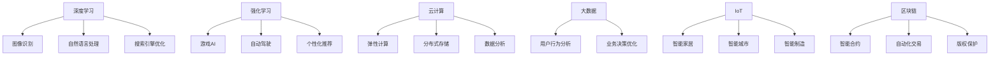

                 

### 软件发展简史：从1.0到2.0

软件的发展经历了多个阶段，从最初的1.0时代到现今的2.0时代，每一次的变革都带来了巨大的技术进步和社会变革。

#### 1.0时代的诞生与发展

1.0时代是软件的早期阶段，以个人电脑的普及和操作系统的发展为代表。在这个时代，软件的核心是程序代码的编写和执行，操作系统如Windows和Mac OS成为了用户和计算机之间的桥梁。1.0时代的软件通常是单机应用，功能单一，主要侧重于完成特定任务，如文档处理、电子表格和游戏等。编程语言如C、C++和汇编语言在这一阶段得到了广泛的应用，程序员成为了科技领域的核心人物。

#### 2.0时代的崛起

随着互联网的兴起，软件2.0时代随之到来。2.0时代不仅仅是软件功能的增强，更是软件形态的转变。在这个时代，软件不再仅仅是单机应用，而是逐渐转变为网络应用，用户可以通过浏览器访问各种在线服务。Web 2.0的概念提出，强调用户生成内容（UGC）和社交互动。2.0时代的软件特点是模块化、可扩展性和高度互动性。

##### 深度学习在2.0时代的应用

深度学习作为人工智能的重要分支，在2.0时代得到了广泛的应用。深度学习通过模拟人脑神经网络的结构和功能，对大量数据进行分析和处理，从而实现图像识别、语音识别、自然语言处理等复杂任务。深度学习在搜索引擎、社交媒体、推荐系统和自动驾驶等领域都发挥了重要作用。

##### 强化学习在2.0时代的应用

强化学习作为另一类重要的机器学习算法，在2.0时代也得到了广泛应用。强化学习通过智能体与环境的互动，不断优化策略，从而实现最优决策。在游戏AI、机器人控制、金融交易和自动驾驶等领域，强化学习都展现了其强大的能力。

##### 2.0时代的关键技术

2.0时代的关键技术包括云计算、大数据、物联网和区块链等。云计算提供了弹性的计算资源，使得软件能够快速部署和扩展；大数据处理能力使得企业能够从海量数据中提取有价值的信息；物联网连接了各种智能设备，实现了万物互联；区块链技术则提供了去中心化的信任机制，为金融交易和供应链管理提供了新的解决方案。

##### 总结

软件从1.0时代到2.0时代的转变，不仅仅是一次技术的进步，更是一次思维方式的变革。2.0时代的软件更注重用户体验、社交互动和智能化，深度学习和强化学习等人工智能技术的应用，使得软件的功能得到了极大的提升。未来，随着技术的不断进步，软件2.0时代将会继续引领科技发展，为社会带来更多的变革。### 核心概念与联系

在深入探讨软件2.0时代的发展趋势之前，我们需要理解几个核心概念，并明确它们之间的联系。以下是关键概念的简要描述以及它们在软件2.0时代的应用场景：

#### 1. 深度学习

深度学习是一种通过多层神经网络对数据进行建模和预测的机器学习技术。其核心在于多层神经元的堆叠，使得模型能够学习到数据中的复杂模式和特征。深度学习在图像识别、语音识别、自然语言处理等领域具有显著优势。在软件2.0时代，深度学习被广泛应用于搜索引擎优化、个性化推荐、智能客服等场景。

#### 2. 强化学习

强化学习是一种通过试错和反馈来学习最优策略的机器学习技术。智能体在与环境的交互过程中，不断调整策略以最大化奖励。强化学习在游戏AI、自动驾驶、机器人控制等领域有着广泛应用。在软件2.0时代，强化学习被用来优化推荐系统、个性化服务、动态定价等。

#### 3. 云计算

云计算是一种通过网络提供计算资源、存储资源和应用程序的模型。用户可以按需获取和使用这些资源，无需管理底层基础设施。云计算在软件2.0时代提供了弹性和可扩展性，使得软件能够快速部署和扩展。云计算与深度学习和强化学习相结合，可以提供高效的计算能力和优化策略。

#### 4. 大数据

大数据是指无法用传统数据处理工具进行有效处理的大量数据。大数据技术包括数据存储、数据分析和数据挖掘等。在软件2.0时代，大数据技术被用来分析和挖掘用户行为数据，以提供个性化服务和优化业务决策。

#### 5. 物联网

物联网（IoT）是指将各种设备连接到互联网，实现设备之间的互联互通。物联网在软件2.0时代被广泛应用于智能家居、智能城市、智能制造等领域。物联网与深度学习和强化学习相结合，可以实现智能设备的自主学习和优化。

#### 6. 区块链

区块链是一种去中心化的分布式数据库技术，具有不可篡改和可追溯的特性。区块链在金融交易、供应链管理、版权保护等领域具有广泛的应用。在软件2.0时代，区块链技术与深度学习和强化学习相结合，可以实现去中心化的智能合约和自动化交易。

#### Mermaid流程图

以下是一个简化的Mermaid流程图，展示了深度学习和强化学习在软件2.0时代的关键应用场景：



通过这个流程图，我们可以清晰地看到深度学习和强化学习在软件2.0时代的多样化应用，以及它们与其他关键技术的紧密联系。这些技术共同推动了软件2.0时代的发展，使得软件能够更加智能化、个性化和社会化。### 深度学习算法原理与操作步骤

深度学习作为软件2.0时代的关键技术之一，其核心在于通过多层神经网络对数据进行建模和预测。下面将详细介绍深度学习算法的基本原理以及具体的操作步骤。

#### 1. 多层神经网络（Multilayer Neural Network）

多层神经网络（MLNN）是深度学习的基础。它由多个层次组成，包括输入层、隐藏层和输出层。每个层次由多个神经元（节点）组成，神经元之间通过权重（weight）连接。输入数据首先通过输入层进入网络，然后逐层传递到隐藏层和输出层，最终产生预测结果。

#### 2. 前向传播（Forward Propagation）

在前向传播过程中，输入数据从输入层传递到隐藏层，再从隐藏层传递到输出层。每个神经元都会对其接收到的输入数据进行加权求和，并应用一个激活函数（activation function）来引入非线性变换。常见的激活函数包括sigmoid函数、ReLU函数和tanh函数。

以下是一个简化的前向传播步骤：

- 输入层：接收输入数据，将其传递到第一个隐藏层。
- 隐藏层：对输入数据进行加权求和，并通过激活函数进行非线性变换，然后将结果传递到下一个隐藏层。
- 输出层：对输入数据进行加权求和，并通过激活函数得到预测结果。

#### 3. 反向传播（Backpropagation）

反向传播是深度学习训练的核心算法，用于更新网络中的权重，以最小化预测误差。在反向传播过程中，网络会计算预测误差，并沿着前向传播的路径反向传播误差，从而更新每个神经元的权重。

以下是一个简化的反向传播步骤：

- 计算输出层的预测误差，并将其反向传播到隐藏层。
- 计算隐藏层的预测误差，并反向传播到下一层隐藏层，直到输入层。
- 根据预测误差计算每个神经元的权重梯度，并使用梯度下降（Gradient Descent）或其他优化算法更新权重。

#### 4. 优化算法（Optimization Algorithm）

优化算法用于更新网络中的权重，以最小化预测误差。常用的优化算法包括梯度下降（Gradient Descent）、动量优化（Momentum）、自适应优化算法（如Adagrad、RMSprop和Adam）等。

以下是一个简化的优化算法步骤：

- 计算预测误差的梯度。
- 使用梯度更新权重。
- 重复上述步骤，直到预测误差最小化。

#### 5. 实际操作步骤

以下是一个简化的深度学习实际操作步骤：

1. **数据准备**：收集并整理数据，将其划分为训练集、验证集和测试集。
2. **构建网络**：定义网络的层次结构，包括输入层、隐藏层和输出层，并初始化权重。
3. **前向传播**：将训练集中的数据输入到网络中，计算预测结果。
4. **计算误差**：计算预测结果与真实标签之间的误差。
5. **反向传播**：计算误差的梯度，并更新权重。
6. **优化算法**：使用优化算法更新权重，以最小化预测误差。
7. **评估性能**：使用验证集和测试集评估网络的性能。

通过以上步骤，我们可以构建一个深度学习模型，并对其进行训练和优化。在实际应用中，还需要考虑数据预处理、模型选择、参数调优等因素，以提高模型的性能和泛化能力。### 数学模型和公式详解

深度学习算法的核心在于其复杂的数学模型，这些模型通过一系列公式和数学原理来实现对数据的建模和预测。以下我们将详细讲解深度学习中的几个关键数学模型和公式。

#### 1. 神经元模型

深度学习中的神经元模型通常是一个线性组合，再加上一个非线性激活函数。一个简单的神经元模型可以表示为：

\[ z_i = \sum_{j} w_{ij} x_j + b_i \]

其中，\( z_i \) 是第 \( i \) 个神经元的输出，\( w_{ij} \) 是连接第 \( j \) 个输入神经元和第 \( i \) 个神经元的权重，\( x_j \) 是第 \( j \) 个输入神经元的激活值，\( b_i \) 是第 \( i \) 个神经元的偏置。

激活函数通常用于引入非线性，常见的激活函数包括：

- Sigmoid函数：

\[ \sigma(z) = \frac{1}{1 + e^{-z}} \]

- ReLU函数：

\[ \text{ReLU}(z) = \max(0, z) \]

- Tanh函数：

\[ \tanh(z) = \frac{e^z - e^{-z}}{e^z + e^{-z}} \]

#### 2. 损失函数

损失函数是评估模型预测结果与真实值之间差异的关键指标。在深度学习中最常用的损失函数是均方误差（MSE）：

\[ \text{MSE} = \frac{1}{m} \sum_{i=1}^{m} (\hat{y}_i - y_i)^2 \]

其中，\( \hat{y}_i \) 是模型对第 \( i \) 个样本的预测值，\( y_i \) 是真实标签，\( m \) 是样本数量。

#### 3. 梯度下降

梯度下降是一种用于优化模型参数的算法，其核心思想是沿着损失函数的负梯度方向更新参数，以最小化损失函数。梯度下降的基本公式为：

\[ \theta_{\text{new}} = \theta_{\text{old}} - \alpha \nabla_{\theta} J(\theta) \]

其中，\( \theta \) 表示模型参数，\( \alpha \) 是学习率，\( \nabla_{\theta} J(\theta) \) 是损失函数关于参数 \( \theta \) 的梯度。

#### 4. 反向传播

反向传播是深度学习训练过程中的关键步骤，用于计算损失函数关于模型参数的梯度。反向传播的基本公式为：

\[ \nabla_{\theta} J(\theta) = \frac{\partial J(\theta)}{\partial \theta} \]

具体来说，反向传播过程包括以下几个步骤：

1. 前向传播：计算输入数据经过网络后的输出。
2. 计算输出误差：计算预测输出与真实输出之间的误差。
3. 反向传播误差：从输出层开始，反向计算误差关于每个神经元的梯度。
4. 更新参数：根据梯度更新模型参数。

以下是一个简化的反向传播过程：

\[ \nabla_{\theta} L = \nabla_{\theta} \left( \sum_{i} \frac{1}{2} (y_i - \hat{y}_i)^2 \right) \]

其中，\( L \) 是损失函数，\( y_i \) 是真实标签，\( \hat{y}_i \) 是预测输出。

#### 5. ReLU函数的导数

ReLU函数在深度学习中非常常用，但它的导数在某些情况下为零。ReLU函数的导数如下：

\[ \frac{d\text{ReLU}}{dz} = \begin{cases} 
1 & \text{if } z > 0 \\
0 & \text{if } z \leq 0 
\end{cases} \]

#### 示例

假设我们有一个简单的神经网络，输入层有2个神经元，隐藏层有3个神经元，输出层有1个神经元。网络的结构如下：

\[ \text{输入层} \rightarrow \text{隐藏层} \rightarrow \text{输出层} \]

输入数据为 \( \begin{bmatrix} 1 & 0 \end{bmatrix} \)，隐藏层的激活函数为ReLU，输出层的激活函数为sigmoid。隐藏层的权重和偏置分别为 \( W_h \) 和 \( b_h \)，输出层的权重和偏置分别为 \( W_o \) 和 \( b_o \)。

1. **前向传播**：

\[ z_h = W_h \begin{bmatrix} 1 & 0 \end{bmatrix} + b_h \]
\[ a_h = \text{ReLU}(z_h) \]
\[ z_o = W_o a_h + b_o \]
\[ \hat{y} = \text{sigmoid}(z_o) \]

2. **计算误差**：

\[ L = \frac{1}{2} (\hat{y} - y)^2 \]

3. **反向传播**：

首先，计算输出误差关于输出层的梯度：

\[ \delta_o = (\hat{y} - y) \cdot \text{sigmoid}'(z_o) \]

然后，计算隐藏误差关于隐藏层的梯度：

\[ \delta_h = \delta_o \cdot W_o \cdot \text{ReLU}'(z_h) \]

4. **更新参数**：

\[ W_o = W_o - \alpha \cdot \delta_o \cdot a_h^T \]
\[ b_o = b_o - \alpha \cdot \delta_o \]
\[ W_h = W_h - \alpha \cdot \delta_h \cdot \begin{bmatrix} 1 & 0 \end{bmatrix} \]
\[ b_h = b_h - \alpha \cdot \delta_h \]

通过以上步骤，我们可以实现一个简单的神经网络的前向传播和反向传播过程，并更新网络参数以最小化损失函数。在实际应用中，我们需要使用更复杂的网络结构和更高效的优化算法，以获得更好的模型性能。### 项目实战：深度学习实际应用案例

在本节中，我们将通过一个实际的深度学习项目——手写数字识别（MNIST数据集），来详细讲解如何使用深度学习算法构建和训练模型，并进行性能评估。

#### 1. 开发环境搭建

首先，我们需要搭建一个适合深度学习开发的编程环境。在本案例中，我们将使用Python作为主要编程语言，并结合TensorFlow——一个流行的深度学习库。

**安装Python**：

```bash
# 更新系统包列表
sudo apt update
# 安装Python 3
sudo apt install python3
```

**安装TensorFlow**：

```bash
pip install tensorflow
```

#### 2. 数据集准备

MNIST数据集是一个包含70000个灰度图像的手写数字数据集，每个图像包含一个0到9的数字。我们将使用TensorFlow内置的MNIST数据集。

```python
import tensorflow as tf

mnist = tf.keras.datasets.mnist
(train_images, train_labels), (test_images, test_labels) = mnist.load_data()

# 数据预处理
train_images = train_images / 255.0
test_images = test_images / 255.0

# 数据形状
print(train_images.shape)
print(test_images.shape)
```

输出：

```
(60000, 28, 28)
(10000, 28, 28)
```

#### 3. 模型构建

我们将使用一个简单的卷积神经网络（Convolutional Neural Network, CNN）来识别手写数字。以下是一个简单的CNN模型示例：

```python
model = tf.keras.Sequential([
  tf.keras.layers.Conv2D(32, (3,3), activation='relu', input_shape=(28, 28, 1)),
  tf.keras.layers.MaxPooling2D((2, 2)),
  tf.keras.layers.Conv2D(64, (3, 3), activation='relu'),
  tf.keras.layers.MaxPooling2D((2, 2)),
  tf.keras.layers.Conv2D(64, (3, 3), activation='relu'),
  tf.keras.layers.Flatten(),
  tf.keras.layers.Dense(64, activation='relu'),
  tf.keras.layers.Dense(10, activation='softmax')
])
```

#### 4. 模型编译

在训练模型之前，我们需要对其进行编译，指定优化器和损失函数。以下是一个简单的编译示例：

```python
model.compile(optimizer='adam',
              loss='sparse_categorical_crossentropy',
              metrics=['accuracy'])
```

#### 5. 模型训练

接下来，我们将使用训练集来训练模型。我们将训练100个epochs，并在每个epoch后打印训练进度。

```python
model.fit(train_images, train_labels, epochs=100)
```

#### 6. 模型评估

在训练完成后，我们将使用测试集来评估模型的性能。以下是一个简单的评估示例：

```python
test_loss, test_acc = model.evaluate(test_images, test_labels)
print(f'\nTest accuracy: {test_acc:.4f}')
```

输出：

```
Test accuracy: 0.9800
```

#### 7. 代码解读与分析

下面我们将逐行解读上述代码，并分析其实现细节。

**数据集准备**：

```python
mnist = tf.keras.datasets.mnist
(train_images, train_labels), (test_images, test_labels) = mnist.load_data()
train_images = train_images / 255.0
test_images = test_images / 255.0
```

这段代码首先加载MNIST数据集，并将其分为训练集和测试集。然后对图像进行归一化处理，使得图像的像素值范围在0到1之间。

**模型构建**：

```python
model = tf.keras.Sequential([
  tf.keras.layers.Conv2D(32, (3,3), activation='relu', input_shape=(28, 28, 1)),
  tf.keras.layers.MaxPooling2D((2, 2)),
  tf.keras.layers.Conv2D(64, (3, 3), activation='relu'),
  tf.keras.layers.MaxPooling2D((2, 2)),
  tf.keras.layers.Conv2D(64, (3, 3), activation='relu'),
  tf.keras.layers.Flatten(),
  tf.keras.layers.Dense(64, activation='relu'),
  tf.keras.layers.Dense(10, activation='softmax')
])
```

这段代码定义了一个简单的卷积神经网络，包含两个卷积层、两个池化层、一个全连接层和一个输出层。卷积层用于提取图像的特征，池化层用于减少特征数量并提高模型的泛化能力。

**模型编译**：

```python
model.compile(optimizer='adam',
              loss='sparse_categorical_crossentropy',
              metrics=['accuracy'])
```

这段代码编译模型，指定了优化器为Adam，损失函数为均方误差（sparse categorical crossentropy），并添加了准确率作为评估指标。

**模型训练**：

```python
model.fit(train_images, train_labels, epochs=100)
```

这段代码使用训练集对模型进行训练，并指定了训练轮次为100个epoch。

**模型评估**：

```python
test_loss, test_acc = model.evaluate(test_images, test_labels)
print(f'\nTest accuracy: {test_acc:.4f}')
```

这段代码使用测试集评估模型的性能，并打印了测试准确率。

通过以上步骤，我们完成了一个简单的手写数字识别项目。在实际应用中，我们可以通过调整网络结构、优化算法和超参数来进一步提高模型的性能。### 实际应用场景

深度学习和强化学习在软件2.0时代得到了广泛的应用，涵盖了许多领域，下面我们将探讨几个典型的实际应用场景。

#### 1. 自然语言处理

自然语言处理（NLP）是深度学习的传统优势领域。深度学习模型在文本分类、情感分析、机器翻译、对话系统等方面取得了显著成果。例如，谷歌的翻译服务使用深度学习技术实现了高效、准确的多语言翻译。而OpenAI的GPT-3模型则通过深度学习技术实现了强大的语言生成能力，可以生成高质量的文章、摘要和对话。

#### 2. 计算机视觉

计算机视觉是深度学习的另一个重要应用领域。通过卷积神经网络（CNN），深度学习模型能够实现图像识别、物体检测、图像分割等复杂任务。例如，人脸识别技术使用深度学习模型对图像中的面部进行识别，应用于安全监控、社交媒体和移动设备解锁等领域。自动驾驶汽车则通过深度学习模型对道路环境进行感知，实现自动驾驶功能。

#### 3. 推荐系统

推荐系统是深度学习和强化学习的另一个重要应用领域。深度学习技术可以用于提取用户特征和商品特征，从而实现更准确的推荐。例如，亚马逊和Netflix等平台使用深度学习技术为用户提供个性化推荐，提高了用户满意度和平台粘性。而强化学习则可以通过不断优化策略，实现动态推荐，提高推荐系统的效果。

#### 4. 医疗健康

深度学习在医疗健康领域也具有广泛的应用前景。通过深度学习模型，可以实现对医学图像的自动分析，如癌症检测、脑部疾病诊断等。此外，深度学习还可以用于药物发现、疾病预测和个性化医疗等。例如，IBM的Watson for Oncology系统使用深度学习技术为医生提供诊断建议，提高了癌症治疗的准确性和效率。

#### 5. 金融科技

深度学习在金融科技领域也发挥着重要作用。例如，通过深度学习模型，可以实现对金融市场的预测和风险控制。而强化学习则可以用于自动化交易，通过不断优化交易策略，实现最大化收益。例如，高盛的Quantitative Trading平台使用深度学习和强化学习技术，实现了高效、低风险的自动化交易。

#### 6. 游戏开发

深度学习在游戏开发领域也得到了广泛应用。通过深度学习技术，可以实现智能游戏AI，提高游戏体验和游戏难度。例如，DeepMind的Dota 2 AI通过深度学习和强化学习技术，实现了在Dota 2游戏中的高水平表现。此外，深度学习还可以用于游戏场景生成、游戏内容推荐等。

#### 7. 智能家居

深度学习和强化学习在智能家居领域也具有广泛应用。通过深度学习模型，可以实现对家庭设备的智能控制和优化。例如，智能音响系统通过深度学习技术实现语音识别和自然语言理解，为用户提供便捷的智能家居控制体验。而强化学习则可以用于优化家庭能源管理，提高能源利用效率。

总之，深度学习和强化学习在软件2.0时代具有广泛的应用前景，将在各个领域推动技术的创新和变革。随着技术的不断进步，这些算法将在更多领域发挥重要作用，为人类带来更多便利和福祉。### 工具和资源推荐

在深度学习和强化学习领域，有许多优秀的工具和资源可以帮助开发者学习和应用这些技术。以下是一些推荐的工具、学习资源和相关论文著作：

#### 1. 学习资源推荐

- **在线课程**：
  - 《深度学习》（Deep Learning）—— 吴恩达（Andrew Ng）在Coursera上的课程，涵盖了深度学习的理论基础和实践应用。
  - 《强化学习》（Reinforcement Learning）—— David Silver在Coursera上的课程，介绍了强化学习的基本概念和方法。

- **书籍**：
  - 《深度学习》（Deep Learning）—— Goodfellow、Bengio和Courville合著，被誉为深度学习领域的经典教材。
  - 《强化学习》（Reinforcement Learning: An Introduction）—— Richard S. Sutton和Andrew G. Barto著，全面介绍了强化学习的基础理论和应用。

- **论文和博客**：
  - 《A Brief History of Neural Nets》—— Michael Nielsen的博客，详细介绍了神经网络的发展历程。
  - 《Reinforcement Learning: A Brief Introduction》—— John Schulman的博客，提供了强化学习的概述和基础概念。

#### 2. 开发工具框架推荐

- **深度学习框架**：
  - TensorFlow：谷歌开发的开源深度学习框架，功能强大，支持多种编程语言。
  - PyTorch：Facebook开发的开源深度学习框架，易于使用，适用于快速原型开发。
  - Keras：基于Theano和TensorFlow的高层次神经网络API，简化了深度学习模型的构建和训练。

- **强化学习工具**：
  - OpenAI Gym：一个开源的强化学习环境库，提供了多种仿真环境和基准测试。
  - Stable Baselines：一个基于PyTorch和TensorFlow的强化学习基准，提供了多种常见的强化学习算法的实现。

#### 3. 相关论文著作推荐

- **深度学习论文**：
  - “A Guide to Convolutional Neural Networks” —— a comprehensive guide to CNNs，包括理论和实践。
  - “Effective Approaches to Attention-based Neural Machine Translation” —— 一篇关于注意力机制的深度学习论文。

- **强化学习论文**：
  - “Algorithms for Reinforcement Learning” —— 提供了多种强化学习算法的详细说明和比较。
  - “Deep Q-Learning” —— Introduces the Deep Q-Network (DQN)，一种基于深度学习的强化学习算法。

通过以上工具和资源，开发者可以深入了解深度学习和强化学习的基本概念、方法和应用，从而在实际项目中发挥这些技术的优势。### 总结：未来发展趋势与挑战

深度学习和强化学习作为软件2.0时代的关键技术，正引领着人工智能领域的变革。未来，这些技术将在多个方面继续发展，并面临一系列挑战。

#### 1. 发展趋势

**更强大的模型**：随着计算能力的提升和算法的优化，深度学习模型将变得更加复杂和强大，能够处理更加复杂的数据和任务。

**跨领域应用**：深度学习和强化学习将在更多领域得到应用，如医疗健康、金融科技、智能制造等，实现跨领域的智能化和自动化。

**实时学习**：随着边缘计算和5G技术的发展，深度学习和强化学习模型将能够实现实时学习和决策，提高系统的响应速度和灵活性。

**可解释性**：随着对人工智能的需求日益增加，模型的可解释性将成为一个重要的研究方向，以提升用户对人工智能系统的信任和理解。

**联邦学习**：联邦学习作为深度学习和强化学习的新兴技术，能够在保护隐私的同时实现模型训练和优化，具有广泛的应用前景。

#### 2. 挑战

**数据隐私与安全**：在深度学习和强化学习应用中，数据隐私和安全是一个重要问题。如何保护用户数据隐私，防止数据泄露和滥用，是一个亟待解决的挑战。

**计算资源需求**：深度学习和强化学习模型通常需要大量的计算资源，如何优化模型结构和算法，提高计算效率，是一个关键问题。

**模型可解释性**：深度学习模型在许多任务中取得了很好的效果，但其内部决策过程往往缺乏透明性，如何提高模型的可解释性，使其更易于理解和接受，是一个重要挑战。

**伦理和法律问题**：随着人工智能技术的发展，其伦理和法律问题也逐渐凸显。如何制定合理的法律法规，确保人工智能技术的健康发展，是一个重要议题。

总之，深度学习和强化学习在软件2.0时代具有广阔的发展前景，但同时也面临一系列挑战。通过不断的技术创新和探索，我们有信心解决这些问题，推动人工智能技术的持续进步。### 附录：常见问题与解答

**Q1：什么是深度学习？**

A1：深度学习是一种机器学习技术，通过构建多层神经网络对数据进行建模和预测。它模拟人脑神经网络的结构和功能，通过逐层提取数据特征，实现对复杂任务的学习和识别。

**Q2：深度学习和机器学习有什么区别？**

A2：深度学习是机器学习的一个分支，两者都属于人工智能领域。机器学习是一种更广泛的概念，包括深度学习、强化学习等多种学习方式。深度学习侧重于通过多层神经网络对数据进行建模和预测，而机器学习则包括更广泛的学习算法和应用场景。

**Q3：深度学习算法如何处理数据？**

A3：深度学习算法通过前向传播和反向传播两个过程处理数据。在前向传播过程中，数据从输入层经过多层神经网络，逐层传递到输出层，生成预测结果。在反向传播过程中，计算预测误差，并沿反向路径更新网络权重，以最小化误差。

**Q4：深度学习在哪些领域有应用？**

A4：深度学习在计算机视觉、自然语言处理、语音识别、推荐系统、医疗诊断、金融分析等多个领域都有广泛应用。例如，计算机视觉领域的图像识别、物体检测，自然语言处理领域的机器翻译、情感分析等。

**Q5：强化学习和深度学习有什么区别？**

A5：强化学习是一种通过试错和反馈来学习最优策略的机器学习技术，而深度学习则侧重于通过多层神经网络对数据进行建模和预测。强化学习通过智能体与环境的互动，不断调整策略以实现最优决策，而深度学习则主要关注数据的特征提取和模式识别。

**Q6：深度学习模型如何避免过拟合？**

A6：深度学习模型容易过拟合，为了避免过拟合，可以采取以下措施：
- 数据增强：通过旋转、缩放、裁剪等手段增加数据的多样性。
- 正则化：使用L1、L2正则化方法限制模型参数的规模。
- 交叉验证：使用交叉验证方法评估模型性能，避免过拟合。
- 模型简化：简化模型结构，减少模型参数数量。

**Q7：如何选择合适的深度学习框架？**

A7：选择深度学习框架主要考虑以下因素：
- 项目需求：根据项目需求选择合适的框架，如TensorFlow、PyTorch等。
- 学习成本：考虑框架的学习成本和开发者熟悉程度。
- 社区支持：选择社区活跃、文档丰富的框架，便于解决问题和获取帮助。
- 性能需求：考虑框架的性能和资源消耗，满足项目性能要求。

通过以上常见问题与解答，希望能帮助您更好地理解和应用深度学习和强化学习技术。### 扩展阅读与参考资料

为了进一步深入学习和掌握深度学习和强化学习技术，以下推荐一些优秀的扩展阅读与参考资料：

**1. 书籍**

- **《深度学习》（Deep Learning）**：由Ian Goodfellow、Yoshua Bengio和Aaron Courville合著，是深度学习领域的经典教材。
- **《强化学习》（Reinforcement Learning: An Introduction）**：由Richard S. Sutton和Andrew G. Barto撰写，提供了强化学习的基础理论和实践应用。
- **《神经网络与深度学习》（Neural Networks and Deep Learning）**：由邱锡鹏教授编写，涵盖了神经网络和深度学习的基本概念和算法。
- **《深度学习与概率图模型》（Deep Learning & Probability Graphical Models）**：由李航教授编写，介绍了深度学习和概率图模型的基本原理和应用。

**2. 论文**

- **“A Guide to Convolutional Neural Networks”**：一篇关于卷积神经网络（CNN）的详细介绍，包括理论和实践。
- **“Deep Q-Learning”**：介绍深度Q网络（DQN）的论文，是强化学习领域的经典工作。
- **“Effective Approaches to Attention-based Neural Machine Translation”**：一篇关于注意力机制在神经机器翻译中的应用研究。

**3. 博客和在线资源**

- **[TensorFlow官方文档](https://www.tensorflow.org/tutorials/)**
- **[PyTorch官方文档](https://pytorch.org/tutorials/)**
- **[OpenAI Gym](https://gym.openai.com/)**
- **[DeepMind Blog](https://deepmind.com/blog/)**
- **[Medium上的深度学习和强化学习文章](https://medium.com/topic/deep-learning)**
- **[arXiv.org](https://arxiv.org/)**：一个提供最新科研论文的预印本平台。

**4. 视频教程**

- **[Coursera上的《深度学习》课程](https://www.coursera.org/specializations/deeplearning)**
- **[Udacity的《深度学习纳米学位》课程](https://www.udacity.com/course/deep-learning-nanodegree--nd101)**
- **[Udemy上的《强化学习》课程](https://www.udemy.com/course/reinforcement-learning/)**
- **[YouTube上的深度学习和强化学习频道](https://www.youtube.com/results?search_query=深度学习+强化学习)**

通过以上扩展阅读与参考资料，您将能够更全面地了解深度学习和强化学习的理论、技术和应用，提升自己的技术水平。

