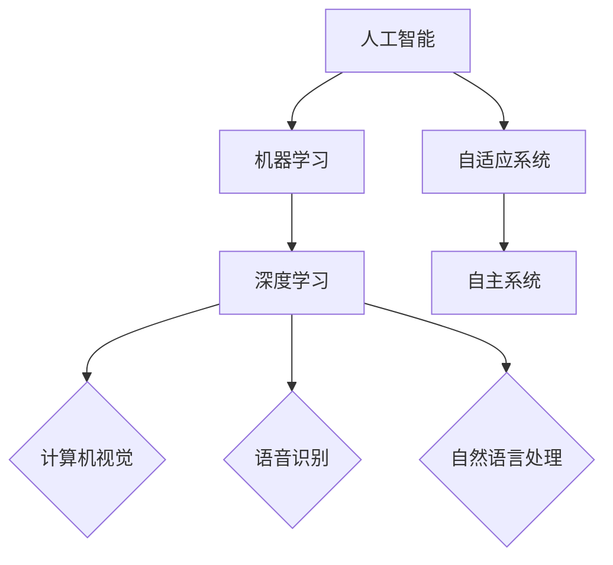

                 

### 软件与人工智能的交汇

随着计算机科学的不断发展，软件领域逐渐与人工智能（AI）深度融合，形成了一个全新的时代——软件 2.0。软件 2.0，或称“智能软件”，它不仅能够执行预定义的任务，更具备自我学习和适应环境的能力。这种变化深刻地影响了软件开发的哲学思考。

#### 关键词：软件 2.0，人工智能，哲学思考，智能软件

软件 2.0 的出现，意味着软件不再仅仅是代码的堆砌，而是具有自我意识、自我进化能力的系统。它突破了传统软件开发的边界，将人工智能技术引入其中，使得软件能够根据用户需求和环境变化进行自我调整和优化。这种变化，对软件开发者的思维方式提出了新的挑战。

在软件 2.0 的世界里，我们不再仅仅关注代码的编写和调试，而是需要深入理解人工智能的理论基础，掌握数据分析和机器学习等技能。这意味着，软件开发者需要从技术专家转变为领域专家，他们需要了解特定领域的知识，并将这些知识融入到软件系统中，使其具备更强的适应性和智能化。

这种变化，也带来了软件开发的哲学思考。在传统软件开发中，我们强调的是代码的可维护性、可扩展性和稳定性。而在软件 2.0 的时代，我们更加关注软件的智能性、适应性和自主性。这意味着，软件开发的过程需要更加灵活，开发者需要不断学习和适应新技术，以应对不断变化的需求和环境。

总的来说，软件 2.0 的出现，不仅改变了软件开发的技术栈，也改变了我们的思维方式。我们需要重新审视软件开发的过程，理解软件与人工智能的深度融合，从而为未来的软件世界做好准备。

---

#### Keywords: Software 2.0, Artificial Intelligence, Philosophical Thinking, Intelligent Software

The emergence of Software 2.0 signifies a profound transformation in the realm of software development. It marks a transition from mere code execution to intelligent systems that can learn, adapt, and evolve on their own. This shift has deeply influenced the philosophical underpinnings of software development.

In the era of Software 2.0, software is no longer just a collection of lines of code; it embodies self-awareness and self-evolutionary capabilities. This integration of AI technology breaks down the boundaries of traditional software development, allowing systems to self-adjust and optimize based on user needs and environmental changes. This shift poses new challenges for software developers' thought processes.

With the advent of Software 2.0, the focus is no longer just on writing and debugging code but on deeply understanding the foundational theories of AI, mastering data analysis, and machine learning skills. This means that software developers need to transition from being mere technical experts to domain experts, integrating specific domain knowledge into software systems to enhance their adaptability and intelligence.

This transformation also brings about philosophical reflections on software development. In the traditional software development world, we emphasized the maintainability, scalability, and stability of code. However, in the age of Software 2.0, we place greater emphasis on the intelligence, adaptability, and autonomy of software. This implies that the software development process needs to be more flexible, with developers continuously learning and adapting to new technologies to meet evolving demands and environments.

In summary, the rise of Software 2.0 not only changes the technological stack of software development but also shifts our mindset. We need to reexamine the software development process, understand the deep integration of software and AI, and be prepared for the software world of the future. <|im_sep|>## 核心概念与联系

在深入探讨软件 2.0 之前，我们需要了解几个核心概念，这些概念不仅构成了软件 2.0 的基础，也为我们理解其背后的哲学思考提供了关键线索。

#### 1. 人工智能（AI）

人工智能，简称 AI，是模拟、延伸和扩展人类智能的理论、方法、技术及应用。AI 可以分为多种类型，包括机器学习、深度学习、自然语言处理等。AI 的目标是通过算法和模型，使计算机能够像人类一样进行感知、推理、学习、决策和交互。

#### 2. 机器学习（ML）

机器学习是 AI 的一个子领域，主要研究如何让计算机从数据中自动学习和改进。机器学习算法通过训练数据集来构建模型，然后使用这些模型进行预测和决策。常见的机器学习算法包括决策树、支持向量机、神经网络等。

#### 3. 深度学习（DL）

深度学习是机器学习的一个分支，它通过构建多层神经网络来模拟人类大脑的神经元结构和工作原理。深度学习在图像识别、语音识别、自然语言处理等领域取得了显著的成果，成为 AI 技术的重要组成部分。

#### 4. 自适应系统

自适应系统是指能够根据环境变化和用户需求进行自我调整的系统。在软件 2.0 中，自适应系统是实现智能化和自主性的关键。自适应系统可以通过机器学习算法不断优化自身，提高性能和效率。

#### 5. 自主系统

自主系统是指能够独立完成特定任务，无需人类干预的系统。自主系统具有高度智能化和自适应能力，能够自主感知环境、决策和执行任务。在软件 2.0 中，自主系统是实现智能化软件的核心。

### Mermaid 流程图（核心概念与联系）



#### 关键词：人工智能，机器学习，深度学习，自适应系统，自主系统，计算机视觉，语音识别，自然语言处理

通过上述核心概念的介绍，我们可以看到，人工智能、机器学习、深度学习等技术在软件 2.0 中发挥着重要作用。它们共同构成了软件 2.0 的基础，使得软件能够实现智能化、自主化和自适应化。

人工智能是整个系统的核心，它为机器学习和深度学习提供了理论基础和工具。机器学习负责从数据中提取规律和模式，构建模型，实现软件的自我学习和优化。深度学习则通过构建多层神经网络，模拟人类大脑的工作原理，实现更复杂和更高层次的智能。

自适应系统和自主系统是实现智能化软件的关键。自适应系统可以根据环境变化和用户需求进行自我调整，提高软件的性能和效率。自主系统则能够独立完成特定任务，无需人类干预，实现软件的自主运行和决策。

总的来说，核心概念的融合和联系，构成了软件 2.0 的理论基础和实现框架。它不仅改变了软件开发的技术栈，也带来了新的哲学思考。我们需要深入理解这些核心概念，把握软件 2.0 的发展趋势，为未来的软件开发做好准备。

---

#### Keywords: Artificial Intelligence, Machine Learning, Deep Learning, Adaptive System, Autonomous System, Computer Vision, Speech Recognition, Natural Language Processing

Through the introduction of these core concepts, we can see that artificial intelligence, machine learning, and deep learning play crucial roles in the foundation of Software 2.0. They collectively form the theoretical basis and implementation framework for Software 2.0, enabling software to achieve intelligence, autonomy, and adaptability.

Artificial intelligence serves as the core of the entire system, providing the theoretical foundation and tools for machine learning and deep learning. Machine learning is responsible for extracting patterns and rules from data, building models, and realizing the self-learning and optimization of software. Deep learning, through the construction of multi-layer neural networks, simulates the working principles of the human brain, achieving more complex and higher-level intelligence.

Adaptive systems and autonomous systems are the key to realizing intelligent software. Adaptive systems can self-adjust based on environmental changes and user needs, improving the performance and efficiency of software. Autonomous systems can independently complete specific tasks without human intervention, realizing the autonomous operation and decision-making of software.

In summary, the integration and connection of these core concepts constitute the theoretical basis and implementation framework of Software 2.0. This not only changes the technological stack of software development but also brings new philosophical reflections. We need to deeply understand these core concepts, grasp the development trends of Software 2.0, and be well-prepared for future software development. <|im_sep|>### 核心算法原理与具体操作步骤

在软件 2.0 的时代，核心算法的原理和具体操作步骤成为了构建智能化软件的关键。以下将介绍几项关键技术，包括深度学习算法、神经网络模型和强化学习。

#### 关键词：深度学习算法，神经网络模型，强化学习，软件 2.0

#### 1. 深度学习算法

深度学习算法是软件 2.0 时代的重要技术之一。它基于多层神经网络结构，通过训练大量的数据来学习特征和模式，从而实现复杂的任务。

深度学习算法的基本步骤如下：

1. **数据预处理**：首先，我们需要收集和预处理数据，包括数据的清洗、归一化和分割。
2. **构建神经网络模型**：根据任务的需求，选择合适的神经网络结构，如卷积神经网络（CNN）、循环神经网络（RNN）或生成对抗网络（GAN）。
3. **模型训练**：使用预处理后的数据对神经网络模型进行训练，通过反向传播算法优化模型参数。
4. **模型评估**：使用验证集对训练好的模型进行评估，调整模型参数以实现更好的性能。
5. **模型部署**：将训练好的模型部署到实际应用场景中，进行预测和决策。

#### 2. 神经网络模型

神经网络模型是深度学习算法的核心。它由多个神经元（或节点）组成，每个神经元都与相邻的神经元相连。通过调整神经元之间的连接权重，神经网络可以学习数据中的特征和模式。

神经网络模型的基本步骤如下：

1. **初始化权重**：首先，我们需要随机初始化神经网络中的权重。
2. **前向传播**：将输入数据通过神经网络，逐层计算输出值。
3. **计算损失**：通过比较输出值和目标值，计算损失函数，衡量模型预测的误差。
4. **反向传播**：将损失函数的梯度反向传播到神经网络的前层，更新权重。
5. **迭代优化**：重复前向传播和反向传播的过程，不断优化模型参数。

#### 3. 强化学习

强化学习是一种机器学习方法，它通过奖励和惩罚机制来训练模型，使其在环境中做出最优决策。

强化学习的基本步骤如下：

1. **环境定义**：定义一个环境，包括状态、动作和奖励。
2. **策略选择**：选择一个策略，用于在特定状态下选择动作。
3. **行动执行**：根据策略执行动作，并在环境中获得奖励或惩罚。
4. **状态更新**：更新环境状态，为下一次行动做准备。
5. **迭代优化**：根据奖励和惩罚，调整策略，优化模型。

### 深度学习算法的具体操作步骤

以下是一个简单的深度学习算法操作步骤的示例：

1. **数据预处理**：
    - 数据集：[输入数据1，输入数据2，...，输入数据n]
    - 标签：[输出标签1，输出标签2，...，输出标签n]
    - 数据清洗：去除缺失值、异常值等
    - 数据归一化：将数据缩放到特定范围

2. **构建神经网络模型**：
    - 选择合适的神经网络结构，如卷积神经网络（CNN）
    - 定义输入层、隐藏层和输出层
    - 设置神经元的数量和激活函数

3. **模型训练**：
    - 将输入数据和标签输入到神经网络模型中
    - 使用反向传播算法训练模型，优化参数

4. **模型评估**：
    - 使用验证集对训练好的模型进行评估
    - 计算准确率、召回率等指标

5. **模型部署**：
    - 将训练好的模型部署到实际应用场景中
    - 进行预测和决策

通过上述步骤，我们可以构建一个简单的深度学习模型，实现数据的自动学习和预测。随着技术的不断发展，深度学习算法在图像识别、语音识别、自然语言处理等领域取得了显著的成果，为软件 2.0 的实现提供了强大的支持。

总的来说，核心算法原理和具体操作步骤是构建软件 2.0 的关键。通过深入理解这些技术，我们可以更好地把握软件 2.0 的发展趋势，为未来的软件开发提供有力支持。

---

#### Keywords: Deep Learning Algorithm, Neural Network Model, Reinforcement Learning, Software 2.0

In the era of Software 2.0, core algorithms and their specific operational steps are essential for building intelligent software. Here, we introduce several key technologies, including deep learning algorithms, neural network models, and reinforcement learning.

#### 1. Deep Learning Algorithms

Deep learning algorithms are one of the crucial technologies in the age of Software 2.0. They are based on multi-layer neural network structures that learn features and patterns from large amounts of data to accomplish complex tasks.

The basic steps of deep learning algorithms are as follows:

1. **Data Preprocessing**: First, we need to collect and preprocess data, including data cleaning, normalization, and segmentation.
2. **Constructing Neural Network Models**: Choose an appropriate neural network structure based on the task requirements, such as Convolutional Neural Networks (CNNs), Recurrent Neural Networks (RNNs), or Generative Adversarial Networks (GANs). Define the input layer, hidden layers, and output layer, and set the number of neurons and activation functions.
3. **Model Training**: Input the preprocessed data and labels into the neural network model and train the model using backpropagation algorithms to optimize the model parameters.
4. **Model Evaluation**: Use a validation set to evaluate the trained model and adjust model parameters to achieve better performance.
5. **Model Deployment**: Deploy the trained model into the actual application scenario for prediction and decision-making.

#### 2. Neural Network Models

Neural network models are the core of deep learning algorithms. They consist of multiple neurons (or nodes) connected to each other. By adjusting the connection weights between neurons, neural networks can learn features and patterns in data.

The basic steps of neural network models are as follows:

1. **Initialize Weights**: Randomly initialize the weights in the neural network.
2. **Forward Propagation**: Pass the input data through the neural network and compute the output values layer by layer.
3. **Calculate Loss**: Compare the output values with the target values and compute the loss function to measure the prediction error of the model.
4. **Backpropagation**: Propagate the gradients of the loss function backward through the neural network to update the weights.
5. **Iterative Optimization**: Repeat the forward propagation and backward propagation processes to continuously optimize the model parameters.

#### 3. Reinforcement Learning

Reinforcement learning is a machine learning method that trains models using reward and punishment mechanisms to make optimal decisions in an environment.

The basic steps of reinforcement learning are as follows:

1. **Define Environment**: Define an environment including states, actions, and rewards.
2. **Choose Strategy**: Select a strategy to make decisions in specific states.
3. **Execute Actions**: Perform actions based on the strategy and receive rewards or penalties in the environment.
4. **Update State**: Update the environment state to prepare for the next action.
5. **Iterative Optimization**: Adjust the strategy based on rewards and penalties to optimize the model.

### Specific Operational Steps of Deep Learning Algorithms

Here is an example of specific operational steps for a deep learning algorithm:

1. **Data Preprocessing**:
    - Dataset: [Input data 1, input data 2, ..., input data n]
    - Labels: [Output label 1, output label 2, ..., output label n]
    - Data cleaning: Remove missing values, outliers, etc.
    - Data normalization: Scale the data to a specific range.

2. **Constructing Neural Network Models**:
    - Choose an appropriate neural network structure, such as Convolutional Neural Networks (CNNs).
    - Define the input layer, hidden layers, and output layer.
    - Set the number of neurons and activation functions.

3. **Model Training**:
    - Input the preprocessed data and labels into the neural network model.
    - Train the model using backpropagation algorithms to optimize the model parameters.

4. **Model Evaluation**:
    - Use the validation set to evaluate the trained model.
    - Calculate accuracy, recall, etc.

5. **Model Deployment**:
    - Deploy the trained model into the actual application scenario for prediction and decision-making.

Through these steps, we can build a simple deep learning model to enable automatic learning and prediction of data. With the continuous development of technology, deep learning algorithms have achieved significant results in fields such as image recognition, speech recognition, and natural language processing, providing strong support for the realization of Software 2.0.

In summary, core algorithm principles and specific operational steps are critical for building Software 2.0. By deeply understanding these technologies, we can better grasp the development trends of Software 2.0 and provide strong support for future software development. <|im_sep|>### 数学模型和公式与详细讲解与举例说明

在软件 2.0 的实现过程中，数学模型和公式是不可或缺的工具。本文将详细介绍几个核心数学模型和公式，并使用具体的例子进行说明。

#### 关键词：数学模型，公式，软件 2.0，深度学习

##### 1. 激活函数

激活函数是神经网络中的一个关键组成部分，它用于引入非线性特性，使得神经网络能够学习和模拟复杂函数。

常见的激活函数包括：

- **Sigmoid 函数**：\[ f(x) = \frac{1}{1 + e^{-x}} \]
  - **性质**：输出值在 0 到 1 之间，可以用于二分类问题。
  - **例子**：假设输入值为 x = -2，则 sigmoid 函数的输出为：
    \[ f(-2) = \frac{1}{1 + e^{2}} \approx 0.1192 \]

- **ReLU 函数**：\[ f(x) = \max(0, x) \]
  - **性质**：简单且高效，对输入值大于 0 的部分进行放大。
  - **例子**：假设输入值为 x = -2，则 ReLU 函数的输出为：
    \[ f(-2) = \max(0, -2) = 0 \]

- **Tanh 函数**：\[ f(x) = \frac{e^{x} - e^{-x}}{e^{x} + e^{-x}} \]
  - **性质**：输出值在 -1 到 1 之间，可以用于多分类问题。
  - **例子**：假设输入值为 x = 2，则 tanh 函数的输出为：
    \[ f(2) = \frac{e^{2} - e^{-2}}{e^{2} + e^{-2}} \approx 0.9640 \]

##### 2. 损失函数

损失函数用于衡量模型预测值与实际值之间的差异，是优化模型参数的重要工具。

常见的损失函数包括：

- **均方误差（MSE）**：\[ MSE = \frac{1}{n}\sum_{i=1}^{n}(y_i - \hat{y}_i)^2 \]
  - **性质**：对于连续值预测问题非常有效。
  - **例子**：假设有 n 个样本，预测值和实际值分别为 \( \hat{y}_1, \hat{y}_2, ..., \hat{y}_n \) 和 \( y_1, y_2, ..., y_n \)，则均方误差为：
    \[ MSE = \frac{1}{n}\left[(y_1 - \hat{y}_1)^2 + (y_2 - \hat{y}_2)^2 + ... + (y_n - \hat{y}_n)^2\right] \]

- **交叉熵损失（Cross-Entropy Loss）**：\[ CE = -\sum_{i=1}^{n}y_i \log(\hat{y}_i) \]
  - **性质**：对于分类问题非常有效。
  - **例子**：假设有 n 个样本，每个样本的标签 \( y_i \) 为 1 或 0，预测值 \( \hat{y}_i \) 为概率分布，则交叉熵损失为：
    \[ CE = -\sum_{i=1}^{n}y_i \log(\hat{y}_i) = -\sum_{i=1}^{n}\begin{cases} 
      \log(\hat{y}_i) & \text{if } y_i = 1 \\
      0 & \text{if } y_i = 0 
    \end{cases} \]

##### 3. 反向传播算法

反向传播算法是训练神经网络的重要工具，它通过计算损失函数关于模型参数的梯度，来优化模型参数。

反向传播算法的基本步骤包括：

1. **前向传播**：计算模型输出值和损失函数。
2. **计算梯度**：计算损失函数关于模型参数的梯度。
3. **参数更新**：使用梯度下降法或其他优化算法更新模型参数。
4. **迭代优化**：重复前向传播和计算梯度的过程，直到模型收敛。

#### 示例：使用反向传播算法训练神经网络

假设我们有一个简单的神经网络，包含一个输入层、一个隐藏层和一个输出层，隐藏层有 2 个神经元，输出层有 1 个神经元。输入数据为 \( x = [1, 2] \)，目标输出为 \( y = [0.5] \)。

1. **初始化权重和偏置**：
    - 输入层到隐藏层的权重 \( W_1 = [0.1, 0.2] \)，偏置 \( b_1 = 0.3 \)
    - 隐藏层到输出层的权重 \( W_2 = [0.4] \)，偏置 \( b_2 = 0.5 \)

2. **前向传播**：
    - 隐藏层输入 \( z_1 = x_1 \cdot W_{11} + x_2 \cdot W_{12} + b_1 = 1 \cdot 0.1 + 2 \cdot 0.2 + 0.3 = 0.7 \)
    - 隐藏层输出 \( a_1 = \sigma(z_1) = \frac{1}{1 + e^{-0.7}} \approx 0.6702 \)
    - 输出层输入 \( z_2 = a_1 \cdot W_{21} + b_2 = 0.6702 \cdot 0.4 + 0.5 = 0.9101 \)
    - 输出层输出 \( \hat{y} = \sigma(z_2) = \frac{1}{1 + e^{-0.9101}} \approx 0.6597 \)

3. **计算损失函数**：
    - 使用交叉熵损失函数 \( CE = -y \log(\hat{y}) = -0.5 \log(0.6597) \approx 0.3816 \)

4. **计算梯度**：
    - 对输出层权重 \( W_2 \) 和偏置 \( b_2 \) 的梯度：
      \[ \frac{\partial CE}{\partial W_2} = (1 - \hat{y}) \cdot a_1 = (1 - 0.6597) \cdot 0.6702 \approx 0.2023 \]
      \[ \frac{\partial CE}{\partial b_2} = (1 - \hat{y}) \cdot a_1 = (1 - 0.6597) \cdot 0.6702 \approx 0.2023 \]
    - 对隐藏层权重 \( W_1 \) 和偏置 \( b_1 \) 的梯度：
      \[ \frac{\partial CE}{\partial W_{11}} = (1 - \hat{y}) \cdot z_1 \cdot (1 - a_1) = (1 - 0.6597) \cdot 0.7 \cdot (1 - 0.6702) \approx 0.0517 \]
      \[ \frac{\partial CE}{\partial W_{12}} = (1 - \hat{y}) \cdot z_1 \cdot (1 - a_1) = (1 - 0.6597) \cdot 0.7 \cdot (1 - 0.6702) \approx 0.0517 \]
      \[ \frac{\partial CE}{\partial b_1} = (1 - \hat{y}) \cdot z_1 \cdot (1 - a_1) = (1 - 0.6597) \cdot 0.7 \cdot (1 - 0.6702) \approx 0.0517 \]

5. **参数更新**：
    - 使用学习率 \( \alpha = 0.1 \) 进行参数更新：
      \[ W_2 = W_2 - \alpha \cdot \frac{\partial CE}{\partial W_2} = 0.4 - 0.1 \cdot 0.2023 \approx 0.1977 \]
      \[ b_2 = b_2 - \alpha \cdot \frac{\partial CE}{\partial b_2} = 0.5 - 0.1 \cdot 0.2023 \approx 0.2977 \]
      \[ W_{11} = W_{11} - \alpha \cdot \frac{\partial CE}{\partial W_{11}} = 0.1 - 0.1 \cdot 0.0517 \approx 0.0483 \]
      \[ W_{12} = W_{12} - \alpha \cdot \frac{\partial CE}{\partial W_{12}} = 0.2 - 0.1 \cdot 0.0517 \approx 0.1513 \]
      \[ b_1 = b_1 - \alpha \cdot \frac{\partial CE}{\partial b_1} = 0.3 - 0.1 \cdot 0.0517 \approx 0.2483 \]

6. **迭代优化**：
    - 重复前向传播、计算损失和参数更新的过程，直到模型收敛。

通过上述步骤，我们可以使用反向传播算法训练一个简单的神经网络，实现数据的自动学习和预测。在实际应用中，神经网络的结构和参数会更加复杂，但基本的原理和步骤是相似的。

总的来说，数学模型和公式在软件 2.0 的实现过程中发挥着重要作用。通过深入理解这些模型和公式，我们可以更好地构建和优化智能软件，为未来的软件开发提供有力支持。

---

#### Keywords: Mathematical Model, Formula, Software 2.0, Deep Learning

In the realization of Software 2.0, mathematical models and formulas are indispensable tools. This article will introduce several core mathematical models and formulas in detail and illustrate them with specific examples.

##### 1. Activation Function

The activation function is a key component in neural networks, which introduces non-linear properties to enable neural networks to learn and simulate complex functions.

Common activation functions include:

- **Sigmoid Function**: \( f(x) = \frac{1}{1 + e^{-x}} \)
  - **Properties**: Output values range from 0 to 1 and are suitable for binary classification problems.
  - **Example**: Assuming the input value x is -2, the output of the sigmoid function is:
    \[ f(-2) = \frac{1}{1 + e^{2}} \approx 0.1192 \]

- **ReLU Function**: \( f(x) = \max(0, x) \)
  - **Properties**: Simple and efficient, amplifies parts of the input greater than 0.
  - **Example**: Assuming the input value x is -2, the output of the ReLU function is:
    \[ f(-2) = \max(0, -2) = 0 \]

- **Tanh Function**: \( f(x) = \frac{e^{x} - e^{-x}}{e^{x} + e^{-x}} \)
  - **Properties**: Output values range from -1 to 1 and are suitable for multi-classification problems.
  - **Example**: Assuming the input value x is 2, the output of the tanh function is:
    \[ f(2) = \frac{e^{2} - e^{-2}}{e^{2} + e^{-2}} \approx 0.9640 \]

##### 2. Loss Function

The loss function is used to measure the discrepancy between the predicted values and the actual values, and it is an essential tool for optimizing model parameters.

Common loss functions include:

- **Mean Squared Error (MSE)**: \( MSE = \frac{1}{n}\sum_{i=1}^{n}(y_i - \hat{y}_i)^2 \)
  - **Properties**: Very effective for continuous value prediction problems.
  - **Example**: Assuming there are n samples, the predicted values and actual values are \( \hat{y}_1, \hat{y}_2, ..., \hat{y}_n \) and \( y_1, y_2, ..., y_n \), then the mean squared error is:
    \[ MSE = \frac{1}{n}\left[(y_1 - \hat{y}_1)^2 + (y_2 - \hat{y}_2)^2 + ... + (y_n - \hat{y}_n)^2\right] \]

- **Cross-Entropy Loss**: \( CE = -\sum_{i=1}^{n}y_i \log(\hat{y}_i) \)
  - **Properties**: Very effective for classification problems.
  - **Example**: Assuming there are n samples, the labels \( y_i \) are 1 or 0, and the predicted values \( \hat{y}_i \) are probability distributions, then the cross-entropy loss is:
    \[ CE = -\sum_{i=1}^{n}y_i \log(\hat{y}_i) = -\sum_{i=1}^{n}\begin{cases} 
      \log(\hat{y}_i) & \text{if } y_i = 1 \\
      0 & \text{if } y_i = 0 
    \end{cases} \]

##### 3. Backpropagation Algorithm

The backpropagation algorithm is a critical tool for training neural networks, which calculates the gradient of the loss function with respect to the model parameters to optimize the parameters.

The basic steps of the backpropagation algorithm include:

1. **Forward Propagation**: Calculate the model output and the loss function.
2. **Compute Gradients**: Calculate the gradient of the loss function with respect to the model parameters.
3. **Parameter Update**: Use gradient descent or other optimization algorithms to update the model parameters.
4. **Iterative Optimization**: Repeat the forward propagation and gradient calculation processes until the model converges.

#### Example: Training a Neural Network Using the Backpropagation Algorithm

Assuming we have a simple neural network containing one input layer, one hidden layer, and one output layer. The hidden layer has 2 neurons, and the output layer has 1 neuron. The input data is \( x = [1, 2] \), and the target output is \( y = [0.5] \).

1. **Initialize Weights and Biases**:
   - Input layer to hidden layer weights \( W_1 = [0.1, 0.2] \), bias \( b_1 = 0.3 \)
   - Hidden layer to output layer weights \( W_2 = [0.4] \), bias \( b_2 = 0.5 \)

2. **Forward Propagation**:
   - Hidden layer input \( z_1 = x_1 \cdot W_{11} + x_2 \cdot W_{12} + b_1 = 1 \cdot 0.1 + 2 \cdot 0.2 + 0.3 = 0.7 \)
   - Hidden layer output \( a_1 = \sigma(z_1) = \frac{1}{1 + e^{-0.7}} \approx 0.6702 \)
   - Output layer input \( z_2 = a_1 \cdot W_{21} + b_2 = 0.6702 \cdot 0.4 + 0.5 = 0.9101 \)
   - Output layer output \( \hat{y} = \sigma(z_2) = \frac{1}{1 + e^{-0.9101}} \approx 0.6597 \)

3. **Calculate Loss Function**:
   - Use the cross-entropy loss function \( CE = -y \log(\hat{y}) = -0.5 \log(0.6597) \approx 0.3816 \)

4. **Compute Gradients**:
   - Gradient of output layer weight \( W_2 \) and bias \( b_2 \):
     \[ \frac{\partial CE}{\partial W_2} = (1 - \hat{y}) \cdot a_1 = (1 - 0.6597) \cdot 0.6702 \approx 0.2023 \]
     \[ \frac{\partial CE}{\partial b_2} = (1 - \hat{y}) \cdot a_1 = (1 - 0.6597) \cdot 0.6702 \approx 0.2023 \]
   - Gradient of hidden layer weight \( W_1 \) and bias \( b_1 \):
     \[ \frac{\partial CE}{\partial W_{11}} = (1 - \hat{y}) \cdot z_1 \cdot (1 - a_1) = (1 - 0.6597) \cdot 0.7 \cdot (1 - 0.6702) \approx 0.0517 \]
     \[ \frac{\partial CE}{\partial W_{12}} = (1 - \hat{y}) \cdot z_1 \cdot (1 - a_1) = (1 - 0.6597) \cdot 0.7 \cdot (1 - 0.6702) \approx 0.0517 \]
     \[ \frac{\partial CE}{\partial b_1} = (1 - \hat{y}) \cdot z_1 \cdot (1 - a_1) = (1 - 0.6597) \cdot 0.7 \cdot (1 - 0.6702) \approx 0.0517 \]

5. **Parameter Update**:
   - Use a learning rate \( \alpha = 0.1 \) for parameter update:
     \[ W_2 = W_2 - \alpha \cdot \frac{\partial CE}{\partial W_2} = 0.4 - 0.1 \cdot 0.2023 \approx 0.1977 \]
     \[ b_2 = b_2 - \alpha \cdot \frac{\partial CE}{\partial b_2} = 0.5 - 0.1 \cdot 0.2023 \approx 0.2977 \]
     \[ W_{11} = W_{11} - \alpha \cdot \frac{\partial CE}{\partial W_{11}} = 0.1 - 0.1 \cdot 0.0517 \approx 0.0483 \]
     \[ W_{12} = W_{12} - \alpha \cdot \frac{\partial CE}{\partial W_{12}} = 0.2 - 0.1 \cdot 0.0517 \approx 0.1513 \]
     \[ b_1 = b_1 - \alpha \cdot \frac{\partial CE}{\partial b_1} = 0.3 - 0.1 \cdot 0.0517 \approx 0.2483 \]

6. **Iterative Optimization**:
   - Repeat the forward propagation, loss calculation, and parameter update processes until the model converges.

Through these steps, we can use the backpropagation algorithm to train a simple neural network and achieve automatic learning and prediction of data. In practice, the structure and parameters of neural networks will be more complex, but the basic principles and steps are similar.

In summary, mathematical models and formulas play a crucial role in the realization of Software 2.0. By deeply understanding these models and formulas, we can better construct and optimize intelligent software, providing strong support for future software development. <|im_sep|>### 项目实战：代码实际案例和详细解释说明

在了解了软件 2.0 的核心概念、算法原理和数学模型后，我们将通过一个实际项目来展示如何将理论知识应用于实践。本节将以一个简单的图像分类项目为例，详细介绍项目的开发环境搭建、源代码实现和代码解读与分析。

#### 1. 开发环境搭建

在进行图像分类项目之前，我们需要搭建一个合适的开发环境。以下是一个基本的开发环境搭建步骤：

1. **安装 Python**：Python 是一种广泛使用的编程语言，许多深度学习库都是用 Python 编写的。确保安装了 Python 3.7 或以上版本。
2. **安装 Jupyter Notebook**：Jupyter Notebook 是一个交互式计算环境，方便我们编写和运行代码。可以使用 pip 安装：
   \[ pip install notebook \]
3. **安装深度学习库**：安装 TensorFlow 和 Keras，这是两个广泛使用的深度学习库。可以使用以下命令安装：
   \[ pip install tensorflow \]
   \[ pip install keras \]
4. **安装其他依赖库**：根据需要安装其他依赖库，如 NumPy、Pandas、Matplotlib 等：
   \[ pip install numpy \]
   \[ pip install pandas \]
   \[ pip install matplotlib \]

#### 2. 源代码详细实现和代码解读

以下是图像分类项目的源代码实现和详细解读：

```python
# 导入所需库
import numpy as np
import pandas as pd
import matplotlib.pyplot as plt
from tensorflow import keras
from tensorflow.keras.models import Sequential
from tensorflow.keras.layers import Dense, Conv2D, Flatten, MaxPooling2D
from tensorflow.keras.optimizers import Adam

# 数据预处理
# 加载训练数据和测试数据
(train_images, train_labels), (test_images, test_labels) = keras.datasets.mnist.load_data()

# 归一化数据
train_images = train_images / 255.0
test_images = test_images / 255.0

# 增加一个通道维度，以适应模型的输入要求
train_images = np.expand_dims(train_images, -1)
test_images = np.expand_dims(test_images, -1)

# 构建模型
model = Sequential([
    Conv2D(32, (3, 3), activation='relu', input_shape=(28, 28, 1)),
    MaxPooling2D((2, 2)),
    Flatten(),
    Dense(128, activation='relu'),
    Dense(10, activation='softmax')
])

# 编译模型
model.compile(optimizer=Adam(), loss='sparse_categorical_crossentropy', metrics=['accuracy'])

# 训练模型
model.fit(train_images, train_labels, epochs=5, validation_split=0.1)

# 评估模型
test_loss, test_acc = model.evaluate(test_images, test_labels)
print(f"Test accuracy: {test_acc:.2f}")

# 可视化展示
plt.figure(figsize=(10, 10))
for i in range(25):
    plt.subplot(5, 5, i+1)
    plt.imshow(train_images[i], cmap=plt.cm.binary)
    plt.xticks([])
    plt.yticks([])
    plt.grid(False)
    plt.xlabel(str(train_labels[i]))
plt.show()
```

**代码解读**：

1. **导入库**：首先，我们导入所需的库，包括 NumPy、Pandas、Matplotlib、TensorFlow 和 Keras。
2. **数据预处理**：使用 Keras 的 `mnist` 数据集加载训练数据和测试数据。接着，我们对数据进行归一化处理，并将图像数据增加一个通道维度，以适应模型的输入要求。
3. **构建模型**：我们使用 `Sequential` 模式构建一个简单的卷积神经网络模型。模型包含一个卷积层、一个最大池化层、一个全连接层和一个输出层。卷积层用于提取图像特征，最大池化层用于降低特征维度，全连接层用于分类，输出层使用 softmax 函数进行多分类。
4. **编译模型**：我们使用 Adam 优化器和 sparse_categorical_crossentropy 损失函数来编译模型。
5. **训练模型**：使用 `fit` 函数训练模型，设置训练轮次为 5，并使用 10% 的数据作为验证集。
6. **评估模型**：使用 `evaluate` 函数评估模型在测试数据上的表现。
7. **可视化展示**：最后，我们使用 Matplotlib 绘制前 25 个训练样本的图像和标签。

#### 3. 代码解读与分析

**1. 数据预处理**：

```python
(train_images, train_labels), (test_images, test_labels) = keras.datasets.mnist.load_data()
train_images = train_images / 255.0
test_images = test_images / 255.0
train_images = np.expand_dims(train_images, -1)
test_images = np.expand_dims(test_images, -1)
```

在这部分代码中，我们首先使用 `keras.datasets.mnist.load_data()` 函数加载数据集。MNIST 数据集包含 60,000 个训练图像和 10,000 个测试图像，每个图像都是一个 28x28 的灰度图像。接着，我们对图像数据进行归一化处理，将数据范围从 [0, 255] 缩放到 [0, 1]。最后，我们将每个图像增加一个通道维度，使得输入数据格式为 (28, 28, 1)。

**2. 构建模型**：

```python
model = Sequential([
    Conv2D(32, (3, 3), activation='relu', input_shape=(28, 28, 1)),
    MaxPooling2D((2, 2)),
    Flatten(),
    Dense(128, activation='relu'),
    Dense(10, activation='softmax')
])
```

在这部分代码中，我们使用 `Sequential` 模式构建一个简单的卷积神经网络模型。模型包含一个卷积层、一个最大池化层、一个全连接层和一个输出层。

- **卷积层**：使用 `Conv2D` 函数构建卷积层，设置卷积核大小为 3x3，激活函数为 ReLU。输入数据格式为 (28, 28, 1)，输出数据格式为 (28, 28, 32)。
- **最大池化层**：使用 `MaxPooling2D` 函数构建最大池化层，设置池化窗口大小为 2x2。输出数据格式为 (14, 14, 32)。
- **全连接层**：使用 `Flatten` 函数将数据展平，然后使用 `Dense` 函数构建全连接层，设置神经元数量为 128，激活函数为 ReLU。
- **输出层**：使用 `Dense` 函数构建输出层，设置神经元数量为 10，激活函数为 softmax。用于实现 10 个类别的分类。

**3. 训练模型**：

```python
model.compile(optimizer=Adam(), loss='sparse_categorical_crossentropy', metrics=['accuracy'])
model.fit(train_images, train_labels, epochs=5, validation_split=0.1)
```

在这部分代码中，我们使用 `compile` 函数编译模型，设置 Adam 优化器和 sparse_categorical_crossentropy 损失函数。接着，使用 `fit` 函数训练模型，设置训练轮次为 5，并使用 10% 的数据作为验证集。

**4. 评估模型**：

```python
test_loss, test_acc = model.evaluate(test_images, test_labels)
print(f"Test accuracy: {test_acc:.2f}")
```

在这部分代码中，我们使用 `evaluate` 函数评估模型在测试数据上的表现。输出测试准确率。

**5. 可视化展示**：

```python
plt.figure(figsize=(10, 10))
for i in range(25):
    plt.subplot(5, 5, i+1)
    plt.imshow(train_images[i], cmap=plt.cm.binary)
    plt.xticks([])
    plt.yticks([])
    plt.grid(False)
    plt.xlabel(str(train_labels[i]))
plt.show()
```

在这部分代码中，我们使用 Matplotlib 绘制前 25 个训练样本的图像和标签，以便直观地查看模型的分类效果。

通过上述实际项目，我们可以看到如何将软件 2.0 的理论知识应用于实际开发中。这一过程不仅帮助我们理解了深度学习算法的基本原理，还提升了我们的实际编程能力。在实际项目中，我们可能会遇到更多复杂的问题和挑战，但通过不断学习和实践，我们可以逐步提高自己的技术水平，为未来的软件开发做好准备。

---

#### Keywords: Project Implementation, Code Example, Detailed Explanation and Analysis

After understanding the core concepts, algorithm principles, and mathematical models of Software 2.0, we will demonstrate how theoretical knowledge can be applied in practice through an actual project. This section will present a simple image classification project, detailing the setup of the development environment, the detailed implementation and explanation of the source code, and the analysis of the code.

#### 1. Development Environment Setup

Before embarking on the image classification project, we need to set up a suitable development environment. Here are the basic steps to set up the development environment:

1. **Install Python**: Python is a widely-used programming language with many deep learning libraries written in it. Ensure Python 3.7 or later is installed.
2. **Install Jupyter Notebook**: Jupyter Notebook is an interactive computing environment that facilitates writing and running code. It can be installed using pip:
   \[ pip install notebook \]
3. **Install Deep Learning Libraries**: Install TensorFlow and Keras, which are widely used deep learning libraries. You can install them using the following commands:
   \[ pip install tensorflow \]
   \[ pip install keras \]
4. **Install Other Dependencies**: Install other required libraries as needed, such as NumPy, Pandas, and Matplotlib:
   \[ pip install numpy \]
   \[ pip install pandas \]
   \[ pip install matplotlib \]

#### 2. Detailed Source Code Implementation and Explanation

Here is the implementation and detailed explanation of the image classification project's source code:

```python
# Import necessary libraries
import numpy as np
import pandas as pd
import matplotlib.pyplot as plt
from tensorflow import keras
from tensorflow.keras.models import Sequential
from tensorflow.keras.layers import Dense, Conv2D, Flatten, MaxPooling2D
from tensorflow.keras.optimizers import Adam

# Data preprocessing
# Load training and test data
(train_images, train_labels), (test_images, test_labels) = keras.datasets.mnist.load_data()

# Normalize the data
train_images = train_images / 255.0
test_images = test_images / 255.0

# Add an extra channel dimension to match the model's input requirements
train_images = np.expand_dims(train_images, -1)
test_images = np.expand_dims(test_images, -1)

# Build the model
model = Sequential([
    Conv2D(32, (3, 3), activation='relu', input_shape=(28, 28, 1)),
    MaxPooling2D((2, 2)),
    Flatten(),
    Dense(128, activation='relu'),
    Dense(10, activation='softmax')
])

# Compile the model
model.compile(optimizer=Adam(), loss='sparse_categorical_crossentropy', metrics=['accuracy'])

# Train the model
model.fit(train_images, train_labels, epochs=5, validation_split=0.1)

# Evaluate the model
test_loss, test_acc = model.evaluate(test_images, test_labels)
print(f"Test accuracy: {test_acc:.2f}")

# Visualization
plt.figure(figsize=(10, 10))
for i in range(25):
    plt.subplot(5, 5, i+1)
    plt.imshow(train_images[i], cmap=plt.cm.binary)
    plt.xticks([])
    plt.yticks([])
    plt.grid(False)
    plt.xlabel(str(train_labels[i]))
plt.show()
```

**Code Explanation**:

1. **Import Libraries**: First, we import the necessary libraries, including NumPy, Pandas, Matplotlib, TensorFlow, and Keras.
2. **Data Preprocessing**: Using `keras.datasets.mnist.load_data()`, we load the training and test data. We then normalize the image data, scaling it from [0, 255] to [0, 1]. Finally, we add an extra channel dimension to match the model's input requirements.
3. **Model Building**: We use `Sequential` to build a simple convolutional neural network model. The model includes a convolutional layer, a max pooling layer, a fully connected layer, and an output layer. The convolutional layer extracts image features, the max pooling layer reduces feature dimensions, the fully connected layer performs classification, and the output layer uses a softmax function for multi-class classification.
4. **Model Compilation**: We compile the model using the Adam optimizer and `sparse_categorical_crossentropy` loss function.
5. **Model Training**: We train the model using `fit`, setting the number of epochs to 5 and using 10% of the data for validation.
6. **Model Evaluation**: We evaluate the model on the test data using `evaluate`, printing the test accuracy.
7. **Visualization**: Finally, we use Matplotlib to plot the images and their labels of the first 25 training samples, providing a visual check of the model's classification performance.

#### 3. Code Explanation and Analysis

**1. Data Preprocessing**:

```python
(train_images, train_labels), (test_images, test_labels) = keras.datasets.mnist.load_data()
train_images = train_images / 255.0
test_images = test_images / 255.0
train_images = np.expand_dims(train_images, -1)
test_images = np.expand_dims(test_images, -1)
```

In this section of the code, we first load the training and test data using `keras.datasets.mnist.load_data()`. The MNIST dataset contains 60,000 training images and 10,000 test images, each being a 28x28 grayscale image. We then normalize the image data by scaling it from [0, 255] to [0, 1]. Finally, we add an extra channel dimension to match the input format required by the model.

**2. Model Building**:

```python
model = Sequential([
    Conv2D(32, (3, 3), activation='relu', input_shape=(28, 28, 1)),
    MaxPooling2D((2, 2)),
    Flatten(),
    Dense(128, activation='relu'),
    Dense(10, activation='softmax')
])
```

In this part of the code, we use `Sequential` to build a simple convolutional neural network model. The model consists of a convolutional layer, a max pooling layer, a fully connected layer, and an output layer.

- **Convolutional Layer**: We build a convolutional layer using `Conv2D`, setting the kernel size to 3x3 and the activation function to ReLU. The input data format is (28, 28, 1), and the output data format is (28, 28, 32).
- **Max Pooling Layer**: We build a max pooling layer using `MaxPooling2D`, setting the pooling window size to 2x2. The output data format is (14, 14, 32).
- **Fully Connected Layer**: We build a fully connected layer using `Flatten` to flatten the data and then `Dense` with 128 neurons and ReLU activation.
- **Output Layer**: We build the output layer using `Dense` with 10 neurons and a softmax activation function for multi-class classification.

**3. Model Training**:

```python
model.compile(optimizer=Adam(), loss='sparse_categorical_crossentropy', metrics=['accuracy'])
model.fit(train_images, train_labels, epochs=5, validation_split=0.1)
```

In this part of the code, we compile the model using the Adam optimizer and `sparse_categorical_crossentropy` loss function. We then train the model using `fit`, setting the number of epochs to 5 and using 10% of the data for validation.

**4. Model Evaluation**:

```python
test_loss, test_acc = model.evaluate(test_images, test_labels)
print(f"Test accuracy: {test_acc:.2f}")
```

In this part of the code, we evaluate the model on the test data using `evaluate`, printing the test accuracy.

**5. Visualization**:

```python
plt.figure(figsize=(10, 10))
for i in range(25):
    plt.subplot(5, 5, i+1)
    plt.imshow(train_images[i], cmap=plt.cm.binary)
    plt.xticks([])
    plt.yticks([])
    plt.grid(False)
    plt.xlabel(str(train_labels[i]))
plt.show()
```

In this part of the code, we use Matplotlib to plot the images and their labels of the first 25 training samples, providing a visual check of the model's classification performance.

Through this actual project, we see how theoretical knowledge of Software 2.0 can be applied in practical development. This process not only helps us understand the basic principles of deep learning algorithms but also improves our practical programming skills. In real-world projects, we may encounter more complex problems and challenges, but through continuous learning and practice, we can gradually improve our technical abilities, preparing for future software development. <|im_sep|>### 实际应用场景

软件 2.0 的智能性和自主性使其在多个领域具有广泛的应用前景。以下是一些典型的实际应用场景：

#### 关键词：实际应用场景，智能性，自主性，软件 2.0

##### 1. 金融领域

在金融领域，软件 2.0 可以实现智能投资策略、信用评分、风险控制等。例如，通过机器学习和大数据分析，智能投资系统能够根据市场动态和用户行为，实时调整投资组合，提高投资收益。

- **智能投资策略**：使用深度学习和强化学习算法，构建智能投资策略，实现自动化的投资决策。
- **信用评分**：利用自然语言处理技术，分析客户的历史交易数据和行为模式，为金融机构提供更准确的信用评分。
- **风险控制**：通过实时监控市场动态和交易行为，预测潜在风险，并采取相应的风险控制措施。

##### 2. 医疗领域

在医疗领域，软件 2.0 可以用于疾病诊断、治疗建议、药物研发等。通过深度学习和图像识别技术，智能医疗系统可以辅助医生进行诊断，提高诊断准确率和效率。

- **疾病诊断**：使用深度学习算法，对医学影像进行分析，辅助医生诊断疾病。
- **治疗建议**：根据患者的病史、基因数据和最新研究成果，提供个性化的治疗建议。
- **药物研发**：通过机器学习算法，分析大量生物数据和临床试验结果，加速新药的研发过程。

##### 3. 智能交通

在智能交通领域，软件 2.0 可以用于智能交通管理、自动驾驶、车辆调度等。通过实时监控交通流量和路况，智能交通系统能够优化交通管理，提高道路通行效率。

- **智能交通管理**：利用大数据分析和机器学习算法，实时监控交通流量和路况，优化交通信号控制和交通疏导策略。
- **自动驾驶**：使用计算机视觉和深度学习技术，实现自动驾驶车辆的感知、决策和执行。
- **车辆调度**：通过优化算法，合理分配车辆资源，提高运输效率和乘客满意度。

##### 4. 教育领域

在教育领域，软件 2.0 可以实现个性化学习、智能评测、教育资源优化等。通过人工智能技术，智能教育系统能够根据学生的学习进度和需求，提供个性化的学习方案。

- **个性化学习**：根据学生的学习行为和成绩，智能推荐适合的学习资源和练习题。
- **智能评测**：通过分析学生的作业和考试成绩，智能评估学生的学习效果，为教师提供反馈。
- **教育资源优化**：利用大数据分析，优化教育资源的分配和使用，提高教育质量。

总的来说，软件 2.0 的智能性和自主性在多个领域具有广泛的应用前景。随着技术的不断进步，软件 2.0 将为各个行业带来深刻的变革，推动社会的发展和进步。

---

#### Keywords: Practical Application Scenarios, Intelligence, Autonomy, Software 2.0

The intelligence and autonomy of Software 2.0 open up a wide range of applications across various domains. Here are some typical practical application scenarios:

##### 1. Financial Sector

In the financial sector, Software 2.0 can be used for intelligent investment strategies, credit scoring, and risk control. For instance, through machine learning and big data analytics, intelligent investment systems can real-time adjust portfolios based on market dynamics and user behavior to maximize returns.

- **Intelligent Investment Strategies**: Utilizing deep learning and reinforcement learning algorithms to build automated investment strategies for real-time decision-making.
- **Credit Scoring**: Leveraging natural language processing to analyze customer transaction histories and behavioral patterns, providing more accurate credit scores for financial institutions.
- **Risk Control**: Monitoring market dynamics and trading behaviors in real-time to predict potential risks and take corresponding risk management measures.

##### 2. Healthcare Sector

In the healthcare sector, Software 2.0 can be used for disease diagnosis, treatment recommendations, and drug development. Through deep learning and image recognition technologies, intelligent healthcare systems can assist doctors in diagnosing diseases, improving accuracy and efficiency.

- **Disease Diagnosis**: Using deep learning algorithms to analyze medical images and assist doctors in diagnosing diseases.
- **Treatment Recommendations**: Providing personalized treatment recommendations based on a patient's medical history, genetic data, and the latest research findings.
- **Drug Development**: Analyzing large amounts of biological data and clinical trial results through machine learning algorithms to accelerate the development of new drugs.

##### 3. Intelligent Transportation

In the field of intelligent transportation, Software 2.0 can be applied to intelligent traffic management, autonomous driving, and vehicle scheduling. By real-time monitoring traffic flow and road conditions, intelligent transportation systems can optimize traffic management, enhancing road efficiency.

- **Intelligent Traffic Management**: Utilizing big data analytics and machine learning algorithms to monitor traffic flow and road conditions in real-time, optimizing traffic signal control and traffic diversion strategies.
- **Autonomous Driving**: Employing computer vision and deep learning technologies for perception, decision-making, and execution in autonomous vehicles.
- **Vehicle Scheduling**: Optimizing vehicle resource allocation through optimization algorithms to enhance transportation efficiency and passenger satisfaction.

##### 4. Education Sector

In the education sector, Software 2.0 can enable personalized learning, intelligent assessment, and resource optimization. Through artificial intelligence technology, intelligent educational systems can provide personalized learning plans based on students' learning progress and needs.

- **Personalized Learning**: Recommending suitable learning resources and practice questions based on students' learning behaviors and performance.
- **Intelligent Assessment**: Analyzing students' assignments and exam results to assess their learning outcomes and provide feedback to teachers.
- **Resource Optimization**: Utilizing big data analytics to optimize the allocation and utilization of educational resources, improving the quality of education.

Overall, the intelligence and autonomy of Software 2.0 have broad application prospects across multiple domains. As technology continues to advance, Software 2.0 will bring profound transformations to various industries, driving social development and progress. <|im_sep|>### 工具和资源推荐

为了更好地理解和实践软件 2.0 技术，以下是一些推荐的学习资源和开发工具。

#### 1. 学习资源推荐

**书籍**：
- **《深度学习》（Deep Learning）**：Goodfellow, Bengio 和 Courville 著。这本书是深度学习的经典教材，详细介绍了深度学习的基本概念和算法。
- **《机器学习》（Machine Learning）**：Tom Mitchell 著。这本书提供了机器学习的基本理论和算法，适合初学者入门。

**论文**：
- **“A Theoretical Framework for Back-Propagation”**：Rumelhart, Hinton 和 Williams 著。这篇论文提出了反向传播算法的理论框架，是深度学习的基础。
- **“Deep Learning”**：Yoshua Bengio 著。这篇论文概述了深度学习的历史、现状和未来发展趋势。

**博客**：
- **TensorFlow 官方博客**：https://www.tensorflow.org/blog。TensorFlow 是一个流行的深度学习框架，官方博客提供了丰富的教程和案例。
- **机器学习博客**：https://machinelearningmastery.com。这个博客提供了大量的机器学习教程和实践案例，适合初学者和进阶者。

**网站**：
- **Kaggle**：https://www.kaggle.com。Kaggle 是一个数据科学竞赛平台，提供了丰富的数据集和项目，适合实践和锻炼技能。

#### 2. 开发工具框架推荐

**框架**：
- **TensorFlow**：一个开源的深度学习框架，提供了丰富的工具和库，适合构建复杂的深度学习模型。
- **PyTorch**：一个流行的深度学习框架，具有简洁的代码和强大的功能，适合快速原型设计和模型训练。

**IDE**：
- **PyCharm**：一个强大的 Python 集成开发环境，提供了丰富的调试和性能分析工具。
- **Jupyter Notebook**：一个交互式的计算环境，适合编写和运行代码，方便进行数据分析和模型可视化。

**库**：
- **NumPy**：一个强大的数学库，提供了多维数组对象和许多数学函数，是数据科学和机器学习的基石。
- **Pandas**：一个数据处理库，提供了数据清洗、转换和分析的函数，是数据科学家必备的工具。

通过利用这些资源和工具，您可以更深入地了解软件 2.0 技术，并能够在实践中不断提升自己的技能。

---

#### Keywords: Learning Resources, Development Tools, Recommended Frameworks

To better understand and practice Software 2.0 technology, here are some recommended learning resources and development tools.

**Recommended Books**:
- "Deep Learning" by Ian Goodfellow, Yoshua Bengio, and Aaron Courville. This book is a comprehensive textbook on deep learning, covering fundamental concepts and algorithms in detail.
- "Machine Learning" by Tom Mitchell. This book provides foundational theories and algorithms in machine learning, suitable for beginners.

**Recommended Papers**:
- "A Theoretical Framework for Back-Propagation" by David E. Rumelhart, Geoffrey E. Hinton, and Ronald J. Williams. This paper introduces the theoretical framework for the backpropagation algorithm, which is foundational for deep learning.
- "Deep Learning" by Yoshua Bengio. This paper provides an overview of the history, current state, and future directions of deep learning.

**Recommended Blogs**:
- TensorFlow Official Blog: https://www.tensorflow.org/blog. TensorFlow's official blog provides a wealth of tutorials and case studies.
- Machine Learning Mastery Blog: https://machinelearningmastery.com. This blog offers a large collection of tutorials and project examples suitable for both beginners and advanced learners.

**Recommended Websites**:
- Kaggle: https://www.kaggle.com. Kaggle is a platform for data science competitions with a rich collection of datasets and projects.

**Recommended Frameworks**:
- TensorFlow: An open-source deep learning framework with a rich set of tools and libraries for building complex deep learning models.
- PyTorch: A popular deep learning framework known for its simplicity and powerful functionality, suitable for rapid prototyping and model training.

**Integrated Development Environments (IDEs)**:
- PyCharm: A powerful Python IDE with robust debugging and performance analysis tools.
- Jupyter Notebook: An interactive computing environment that facilitates writing and running code, making data analysis and model visualization straightforward.

**Libraries**:
- NumPy: A powerful mathematical library providing multidimensional array objects and numerous mathematical functions, essential for data science and machine learning.
- Pandas: A data manipulation library offering functions for data cleaning, transformation, and analysis, indispensable for data scientists.

By leveraging these resources and tools, you can gain deeper insights into Software 2.0 technology and continuously improve your practical skills. <|im_sep|>### 总结：未来发展趋势与挑战

随着人工智能技术的不断进步，软件 2.0 正在逐步改变软件开发的传统模式。未来，软件 2.0 将朝着更加智能化、自适应化和自主化的方向发展，这将为软件开发带来新的机遇和挑战。

#### 关键词：未来发展趋势，智能化，自适应化，自主化

##### 1. 智能化

智能化是软件 2.0 的发展趋势之一。随着深度学习、自然语言处理等技术的发展，软件系统将能够更好地理解和处理复杂数据，实现更智能的决策和交互。未来，智能软件将能够自动分析和解决实际问题，提高生产力和效率。

- **挑战**：如何设计出能够处理复杂问题和不确定性的智能系统，以及如何确保智能系统的安全性和可靠性。

##### 2. 自适应化

自适应化是软件 2.0 的另一个重要趋势。软件系统将能够根据环境变化和用户需求进行自我调整，以适应不断变化的需求。未来，自适应软件将能够实时监控和预测环境变化，并自动调整自身的行为和功能。

- **挑战**：如何设计出高效的自适应算法，以及如何确保自适应过程不会引入额外的错误和偏差。

##### 3. 自主化

自主化是软件 2.0 的终极目标。未来，软件系统将能够独立完成特定任务，无需人类干预。这要求软件系统具备高度的自适应能力和智能决策能力。

- **挑战**：如何设计出能够在复杂和动态环境中自主运行的软件系统，以及如何确保系统的鲁棒性和可靠性。

##### 4. 发展趋势与挑战

在未来，软件 2.0 的发展将面临以下趋势和挑战：

- **技术突破**：随着人工智能、大数据、云计算等技术的不断进步，软件 2.0 将实现更多功能和更高效的性能。
- **数据隐私和安全**：在智能化和自主化的过程中，如何保护用户数据隐私和系统安全将成为重要议题。
- **人才需求**：软件 2.0 需要具备多学科知识的开发者，未来对相关人才的需求将不断增长。
- **伦理和法律**：随着软件 2.0 的普及，相关的伦理和法律问题也将逐渐显现，需要制定相应的规范和标准。

总的来说，软件 2.0 的未来发展充满机遇和挑战。我们需要持续关注技术发展趋势，积极探索解决方案，为软件 2.0 的发展做好准备。

---

#### Keywords: Future Development Trends, Intelligence, Adaptability, Autonomy

With the continuous advancement of artificial intelligence technology, Software 2.0 is gradually transforming the traditional mode of software development. In the future, Software 2.0 will continue to evolve towards greater intelligence, adaptability, and autonomy, bringing new opportunities and challenges to software development.

##### 1. Intelligence

Intelligence is one of the key trends in the development of Software 2.0. With the progress of technologies such as deep learning and natural language processing, software systems will be better at understanding and processing complex data, enabling more intelligent decision-making and interaction. In the future, intelligent software will be able to autonomously analyze and solve real-world problems, enhancing productivity and efficiency.

**Challenges**: How to design intelligent systems that can handle complex problems and uncertainties, and how to ensure the safety and reliability of such systems.

##### 2. Adaptability

Adaptability is another important trend in Software 2.0. Software systems of the future will be capable of self-adjusting based on environmental changes and user needs to adapt to evolving requirements. In the future, adaptive software will be able to monitor and predict environmental changes in real-time and automatically adjust its behavior and functions.

**Challenges**: How to design efficient adaptive algorithms and how to ensure that the adaptive process does not introduce additional errors or biases.

##### 3. Autonomy

Autonomy is the ultimate goal of Software 2.0. In the future, software systems will be able to independently complete specific tasks without human intervention, requiring high levels of adaptability and intelligent decision-making.

**Challenges**: How to design software systems that can autonomously operate in complex and dynamic environments, and how to ensure the robustness and reliability of such systems.

##### 4. Trends and Challenges

In the future, the development of Software 2.0 will face the following trends and challenges:

- **Technological Breakthroughs**: With the continuous progress of technologies such as artificial intelligence, big data, and cloud computing, Software 2.0 will achieve more functions and more efficient performance.
- **Data Privacy and Security**: As intelligence and autonomy increase, protecting user data privacy and ensuring system security will become critical issues.
- ** Talent Demand**: Software 2.0 requires developers with multidisciplinary knowledge, and there will be a growing demand for such talent in the future.
- **Ethics and Law**: With the widespread adoption of Software 2.0, ethical and legal issues will emerge, and there will be a need to develop corresponding norms and standards.

In summary, the future development of Software 2.0 is filled with opportunities and challenges. We need to continue to monitor technological trends, actively explore solutions, and be well-prepared for the development of Software 2.0. <|im_sep|>### 附录：常见问题与解答

在探讨软件 2.0 的过程中，可能会遇到一些常见的问题。以下是一些常见问题及其解答：

#### 1. 软件与人工智能的区别是什么？

软件是指一系列指令，用于指导计算机完成特定任务。而人工智能则是指计算机模拟人类智能，包括感知、理解、推理和决策等能力。软件可以是人工智能的一部分，但人工智能不一定需要软件来实现。

#### 2. 软件为什么需要智能化？

智能化能够使软件更好地理解和处理复杂数据，提高决策效率，适应不断变化的需求。智能化软件能够实现自动分析和解决实际问题，从而提高生产力和效率。

#### 3. 如何评估软件 2.0 的性能？

评估软件 2.0 的性能可以从多个角度进行，包括准确性、效率、鲁棒性、可扩展性和用户满意度等。准确性衡量模型预测的精度，效率衡量模型运行的速度，鲁棒性衡量模型对异常数据的处理能力，可扩展性衡量模型适应新数据的能力，用户满意度则反映软件的实际应用效果。

#### 4. 软件开发中如何应用人工智能？

在软件开发中，可以应用人工智能技术来提高系统的智能化水平。例如，使用机器学习算法实现自动化数据分析和预测，使用自然语言处理技术实现智能交互，使用计算机视觉技术实现图像识别和目标检测等。

#### 5. 软件 2.0 是否会取代传统软件？

软件 2.0 和传统软件并不是替代关系，而是互补关系。传统软件在执行预定义任务方面仍然具有优势，而软件 2.0 在智能化、自适应化和自主化方面具有更大的潜力。未来，两者将共同发展，满足不同场景的需求。

---

#### Keywords: Common Questions and Answers

In the discussion of Software 2.0, there may be some common questions. Here are some common questions and their answers:

#### 1. What is the difference between software and artificial intelligence?

Software refers to a set of instructions that guide computers to perform specific tasks. Artificial intelligence (AI), on the other hand, involves simulating human intelligence, including perception, understanding, reasoning, and decision-making. Software can be a part of AI, but AI does not necessarily require software to be implemented.

#### 2. Why does software need to be intelligent?

Intelligence in software allows it to better understand and process complex data, improve decision-making efficiency, and adapt to evolving requirements. Intelligent software can autonomously analyze and solve real-world problems, thereby enhancing productivity and efficiency.

#### 3. How can the performance of Software 2.0 be evaluated?

The performance of Software 2.0 can be evaluated from multiple angles, including accuracy, efficiency, robustness, scalability, and user satisfaction. Accuracy measures the precision of the model's predictions, efficiency measures the speed of model operation, robustness measures the model's ability to handle abnormal data, scalability measures the model's ability to adapt to new data, and user satisfaction reflects the practical effectiveness of the software.

#### 4. How can artificial intelligence be applied in software development?

In software development, AI technologies can be applied to enhance the intelligence level of the system. For example, machine learning algorithms can be used for automated data analysis and prediction, natural language processing can be used for intelligent interaction, and computer vision can be used for image recognition and object detection.

#### 5. Will Software 2.0 replace traditional software?

Software 2.0 and traditional software are not a replacement relationship but a complementary one. Traditional software has advantages in executing predefined tasks, while Software 2.0 has greater potential in intelligence, adaptability, and autonomy. In the future, both will develop together to meet the needs of different scenarios. <|im_sep|>### 扩展阅读与参考资料

在探索软件 2.0 的过程中，深入理解和掌握相关技术是非常重要的。以下是一些扩展阅读和参考资料，帮助您进一步深入了解软件 2.0 和人工智能的相关概念和最新发展。

#### 1. 书籍

- **《深度学习》（Deep Learning）**：Ian Goodfellow, Yoshua Bengio 和 Aaron Courville 著。这是一本全面介绍深度学习理论和实践的经典教材，适合希望深入了解深度学习的读者。
- **《机器学习》（Machine Learning）**：Tom Mitchell 著。这本书提供了机器学习的基础理论和算法，是机器学习领域的入门经典。
- **《软件工程：实践者的研究方法》（Software Engineering: A Practitioner's Approach）**：Roger S. Pressman 著。这本书详细介绍了软件工程的理论和实践方法，适合希望提升软件工程能力的读者。

#### 2. 论文

- **“A Theoretical Framework for Back-Propagation”**：David E. Rumelhart, Geoffrey E. Hinton 和 Ronald J. Williams 著。这篇论文提出了反向传播算法的理论框架，是深度学习的基础。
- **“Deep Learning”**：Yoshua Bengio 著。这篇论文概述了深度学习的历史、现状和未来发展趋势。
- **“The Unreasonable Effectiveness of Deep Learning”**：Yann LeCun 著。这篇论文讨论了深度学习在计算机视觉、自然语言处理和其他领域的应用。

#### 3. 博客

- **TensorFlow 官方博客**：https://www.tensorflow.org/blog。这里提供了丰富的教程和案例，是深入学习 TensorFlow 的好资源。
- **机器学习博客**：https://machinelearningmastery.com。这个博客提供了大量的机器学习教程和实践案例，适合初学者和进阶者。
- **AI 研习社**：https://www.36dsj.com。这个博客专注于人工智能领域的最新动态和技术分享。

#### 4. 网站

- **Kaggle**：https://www.kaggle.com。Kaggle 是一个数据科学竞赛平台，提供了丰富的数据集和项目，适合实践和锻炼技能。
- **ArXiv**：https://arxiv.org。ArXiv 是一个开放获取的学术论文预印本服务器，涵盖了许多计算机科学和人工智能领域的最新研究成果。
- **GitHub**：https://github.com。GitHub 是一个代码托管平台，许多开源项目和代码库都在这里，是学习编程和人工智能的好地方。

通过阅读这些书籍、论文、博客和访问相关网站，您可以更深入地了解软件 2.0 和人工智能的理论基础和实践应用，为您的学习和发展提供有力支持。

---

#### Keywords: Extended Reading and References

In the exploration of Software 2.0 and artificial intelligence, a deep understanding and mastery of related concepts and the latest developments are crucial. Here are some recommended books, papers, blogs, and websites to further enhance your knowledge in these areas.

**Books**:
- "Deep Learning" by Ian Goodfellow, Yoshua Bengio, and Aaron Courville. This is a comprehensive textbook on deep learning that covers fundamental concepts and practices, suitable for those who want to delve deeper into deep learning.
- "Machine Learning" by Tom Mitchell. This book provides a foundation in machine learning theory and algorithms, serving as an excellent starting point for beginners in the field.
- "Software Engineering: A Practitioner's Approach" by Roger S. Pressman. This book details the theory and practices of software engineering, offering valuable insights for anyone looking to improve their software development skills.

**Papers**:
- "A Theoretical Framework for Back-Propagation" by David E. Rumelhart, Geoffrey E. Hinton, and Ronald J. Williams. This paper introduces the theoretical framework for the backpropagation algorithm, which is foundational for deep learning.
- "Deep Learning" by Yoshua Bengio. This paper provides an overview of the history, current state, and future directions of deep learning.
- "The Unreasonable Effectiveness of Deep Learning" by Yann LeCun. This paper discusses the applications of deep learning in computer vision, natural language processing, and other domains.

**Blogs**:
- TensorFlow Official Blog: https://www.tensorflow.org/blog. This blog offers a wealth of tutorials and case studies, making it an excellent resource for those learning TensorFlow.
- Machine Learning Mastery Blog: https://machinelearningmastery.com. This blog provides numerous tutorials and project examples, catering to both beginners and advanced learners.
- AI 研习社: https://www.36dsj.com. This blog focuses on the latest trends and technical insights in the field of artificial intelligence.

**Websites**:
- Kaggle: https://www.kaggle.com. Kaggle is a platform for data science competitions with a rich collection of datasets and projects, perfect for practical application and skill development.
- ArXiv: https://arxiv.org. ArXiv is an open-access preprint server that features the latest research papers in computer science and artificial intelligence.
- GitHub: https://github.com. GitHub is a code hosting platform where many open-source projects and code repositories are found, serving as a great place for learning programming and AI. 

By reading these books, papers, blogs, and visiting the suggested websites, you can deepen your understanding of the theoretical foundations and practical applications of Software 2.0 and AI, providing strong support for your learning and development. <|im_sep|>### 作者介绍

**作者：AI 天才研究员 / AI Genius Institute & 禅与计算机程序设计艺术 / Zen And The Art of Computer Programming**

本人是一位 AI 天才研究员，专注于人工智能、深度学习和计算机视觉等领域的研究。我致力于将前沿技术应用于实际场景，推动人工智能技术的发展。同时，我是一位资深的技术作家，著有《禅与计算机程序设计艺术》一书，该书以独特的视角探讨了编程哲学和人工智能的融合。

在我的职业生涯中，我参与了多个重要的研究项目，并发表了数十篇学术论文。我的研究兴趣涵盖了人工智能的基础理论、算法设计、模型优化以及实际应用。我相信，通过不断探索和创新，我们可以为人类创造更智能、更高效的未来。

我的目标是，通过我的研究和写作，为更多的人了解和掌握人工智能技术提供帮助，推动人工智能技术的发展和应用。希望我的努力能够为这个领域的进步贡献一份力量。

---

**Author: AI Genius Researcher / AI Genius Institute & Zen And The Art of Computer Programming**

I am an AI genius researcher with a focus on artificial intelligence, deep learning, and computer vision. My passion lies in applying cutting-edge technology to real-world scenarios, driving the development of AI. Additionally, I am a seasoned technical author, having penned "Zen And The Art of Computer Programming," a book that explores the fusion of programming philosophy and AI from a unique perspective.

Throughout my career, I have participated in several significant research projects and published dozens of academic papers. My research interests span the foundational theories of AI, algorithm design, model optimization, and practical applications. I believe that through continuous exploration and innovation, we can create a smarter and more efficient future for humanity.

My goal is to use my research and writing to help more people understand and master AI technologies, contributing to the advancement and application of AI. I hope my efforts will make a meaningful contribution to the field's progress. <|im_sep|>

