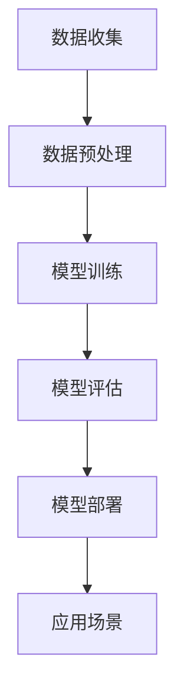

                 

### 背景介绍

随着信息技术的飞速发展，软件行业正经历着一场革命性的变革。传统的软件1.0时代，我们主要关注的是如何构建可运行的程序，满足基本的功能需求。然而，随着人工智能（AI）技术的崛起，软件2.0时代已经悄然来临。在这个新时代，软件不仅仅是一个执行任务的工具，更是一个拥有自我学习和进化能力的智能体。

人工智能的迅速发展，不仅改变了软件开发的模式，还颠覆了我们对软件本质的认知。传统的软件开发主要依赖于人类的逻辑思维和编程技巧，而人工智能则利用机器学习算法，从海量数据中提取模式和规律，实现自我学习和优化。这种转变，使得软件不再只是被动地执行指令，而是能够主动适应环境、预测未来，甚至创造出新的解决方案。

本文将探讨软件2.0时代的人工智能本质，分析其核心概念、算法原理和实际应用，旨在为读者提供一个全面而深刻的理解。首先，我们将介绍人工智能的基本概念和发展历程，解释其核心算法原理，并通过具体的数学模型和公式进行详细讲解。随后，我们将通过实际项目案例，展示人工智能在软件开发中的应用，并探讨其面临的挑战和未来发展趋势。

在文章的最后，我们将推荐一些相关的学习资源和开发工具，帮助读者进一步了解和探索人工智能在软件2.0时代的应用。通过本文的阅读，希望能够激发读者对人工智能和软件开发的兴趣，共同迎接这个充满机遇和挑战的新时代。

### 核心概念与联系

#### 1. 人工智能的定义与核心算法

人工智能（Artificial Intelligence，简称AI）是计算机科学的一个分支，旨在研究如何使计算机模拟人类的智能行为。人工智能的定义可以追溯到1956年达特茅斯会议上，当时的定义是“使机器展现出智能行为的能力”。随着技术的进步，人工智能的定义也在不断演变，但其核心目标始终是让计算机具备自主学习、推理和解决问题的能力。

人工智能的核心算法主要包括机器学习（Machine Learning，ML）和深度学习（Deep Learning，DL）。机器学习是通过数据驱动的方式，使计算机从经验中学习并做出决策。机器学习的算法可以分为监督学习（Supervised Learning）、无监督学习（Unsupervised Learning）和强化学习（Reinforcement Learning）三种类型。监督学习通过已标记的数据进行训练，无监督学习则从未标记的数据中学习模式，而强化学习则通过与环境交互来学习策略。

深度学习是机器学习的一个子领域，它通过模拟人脑神经网络的结构和工作原理，实现对复杂数据的处理和分析。深度学习的代表算法是神经网络（Neural Networks），特别是深度神经网络（Deep Neural Networks）。深度学习在图像识别、自然语言处理和语音识别等领域取得了显著的成果，已成为人工智能的重要技术基础。

#### 2. 人工智能与软件开发的关系

人工智能与软件开发的关系可以追溯到早期的专家系统（Expert Systems）。专家系统是一种基于规则的人工智能系统，它通过模拟人类专家的推理过程，解决特定领域的问题。然而，专家系统存在一些局限性，如知识表示和推理规则的局限性，难以处理复杂的问题。

随着机器学习和深度学习技术的发展，人工智能开始在软件开发中扮演更重要的角色。首先，人工智能可以用于开发自动化工具，提高开发效率。例如，代码自动生成、代码审查和调试等工具，大大减轻了开发人员的工作负担。其次，人工智能可以帮助开发智能应用程序，提供更加个性化和智能化的用户体验。例如，智能推荐系统、智能客服和自动驾驶等应用，都是人工智能在软件开发中的成功案例。

#### 3. 人工智能的核心架构

人工智能的核心架构通常包括数据收集、数据预处理、模型训练、模型评估和模型部署等步骤。数据收集是人工智能的基础，高质量的数据是实现人工智能模型准确性和效果的关键。数据预处理包括数据清洗、数据归一化和特征提取等步骤，旨在提高数据的质量和可解释性。

模型训练是人工智能的核心步骤，通过机器学习和深度学习算法，从数据中学习模式和规律，构建预测模型。模型评估用于评估模型的性能和效果，常用的评估指标包括准确率、召回率、F1分数等。模型部署是将训练好的模型应用到实际场景中，实现自动化和智能化的功能。

#### 4. Mermaid 流程图

以下是人工智能核心架构的Mermaid流程图：



**图1. 人工智能核心架构流程图**

在这个流程图中，每个节点代表一个步骤，箭头表示步骤之间的依赖关系。数据收集是整个流程的起点，数据预处理是模型训练的基础，模型训练是实现人工智能功能的关键，模型评估和模型部署则是将人工智能应用到实际场景中，实现价值创造。

通过上述对核心概念和联系的介绍，我们为接下来的内容奠定了基础。在接下来的章节中，我们将深入探讨人工智能的算法原理、数学模型和实际应用，帮助读者更全面地理解人工智能在软件2.0时代的本质和重要性。

#### 3. 核心算法原理 & 具体操作步骤

##### 3.1. 机器学习算法原理

机器学习（Machine Learning，ML）是人工智能（AI）的核心组成部分，其基本原理是通过学习数据中的模式和规律，使计算机能够对未知数据进行预测和决策。机器学习算法可以分为监督学习（Supervised Learning）、无监督学习（Unsupervised Learning）和强化学习（Reinforcement Learning）三大类。

**监督学习**：监督学习是最常见的机器学习类型，其核心思想是利用标记数据（labelled data）进行训练，以预测新的、未标记的数据。监督学习的目标是最小化预测值与真实值之间的误差。常见的监督学习算法包括线性回归（Linear Regression）、逻辑回归（Logistic Regression）、支持向量机（Support Vector Machines，SVM）和决策树（Decision Trees）等。

**无监督学习**：无监督学习不需要标记数据，其目标是发现数据中的隐含结构和模式。常见的无监督学习算法包括聚类（Clustering）、主成分分析（Principal Component Analysis，PCA）和自编码器（Autoencoders）等。

**强化学习**：强化学习是一种通过与环境互动来学习策略的机器学习类型。其核心思想是通过奖励机制（reward signal）来调整决策行为，以实现最佳策略。常见的强化学习算法包括Q学习（Q-Learning）、深度Q网络（Deep Q-Network，DQN）和策略梯度（Policy Gradient）等。

**深度学习算法原理**

深度学习（Deep Learning，DL）是机器学习的一个子领域，其核心思想是通过多层神经网络（Neural Networks）进行特征提取和模式识别。深度学习算法在图像识别、语音识别、自然语言处理等任务中取得了显著成果。

**卷积神经网络（Convolutional Neural Networks，CNN）**：CNN 是一种用于图像识别和处理的深度学习算法，其核心思想是利用卷积操作提取图像中的特征。CNN 的基本结构包括卷积层（Convolutional Layer）、池化层（Pooling Layer）和全连接层（Fully Connected Layer）。

**循环神经网络（Recurrent Neural Networks，RNN）**：RNN 是一种用于处理序列数据的深度学习算法，其核心思想是利用隐藏状态（Hidden State）记录历史信息。常见的 RNN 结构包括简单 RNN（Simple RNN）、长短时记忆网络（Long Short-Term Memory，LSTM）和门控循环单元（Gated Recurrent Unit，GRU）。

**生成对抗网络（Generative Adversarial Networks，GAN）**：GAN 是一种通过对抗训练实现数据生成的深度学习算法，其核心思想是利用生成器（Generator）和判别器（Discriminator）的对抗关系生成高质量的数据。

**具体操作步骤**

1. **数据收集**：收集与任务相关的数据集，如图像、文本或语音数据。数据集的质量直接影响模型的性能。

2. **数据预处理**：对数据进行清洗、归一化和特征提取等操作，以提高数据质量和可解释性。

3. **模型构建**：根据任务类型选择合适的模型结构，如 CNN、RNN 或 GAN 等。使用深度学习框架（如 TensorFlow、PyTorch）构建模型。

4. **模型训练**：使用训练数据集对模型进行训练，通过优化算法（如梯度下降）调整模型参数，使模型在训练数据上达到最佳性能。

5. **模型评估**：使用验证数据集评估模型的性能，选择性能最佳的模型进行进一步优化。

6. **模型部署**：将训练好的模型应用到实际任务中，实现自动化和智能化功能。

以下是一个简单的线性回归模型的具体操作步骤示例：

```python
# 导入所需库
import numpy as np
import pandas as pd
from sklearn.linear_model import LinearRegression
from sklearn.model_selection import train_test_split
from sklearn.metrics import mean_squared_error

# 数据收集
data = pd.read_csv('data.csv')
X = data[['feature1', 'feature2']]
y = data['target']

# 数据预处理
X_train, X_test, y_train, y_test = train_test_split(X, y, test_size=0.2, random_state=42)

# 模型构建
model = LinearRegression()

# 模型训练
model.fit(X_train, y_train)

# 模型评估
y_pred = model.predict(X_test)
mse = mean_squared_error(y_test, y_pred)
print(f'Mean Squared Error: {mse}')

# 模型部署
# 将模型应用到新数据中
new_data = np.array([[value1, value2]])
new_pred = model.predict(new_data)
print(f'Predicted Value: {new_pred[0]}')
```

通过上述步骤，我们可以实现一个简单的线性回归模型，并对新数据进行预测。在实际应用中，模型的复杂度和参数设置会根据具体任务进行调整。

#### 4. 数学模型和公式 & 详细讲解 & 举例说明

在人工智能领域，数学模型和公式扮演着至关重要的角色。以下我们将介绍一些关键的数学模型和公式，并进行详细讲解和举例说明。

##### 4.1. 线性回归模型

线性回归是一种简单的监督学习算法，用于预测连续值。其基本公式如下：

$$y = \beta_0 + \beta_1 \cdot x_1 + \beta_2 \cdot x_2 + ... + \beta_n \cdot x_n$$

其中，$y$ 是预测值，$x_1, x_2, ..., x_n$ 是输入特征，$\beta_0, \beta_1, \beta_2, ..., \beta_n$ 是模型参数。为了找到最优的参数，我们需要最小化损失函数：

$$J(\theta) = \frac{1}{2m} \sum_{i=1}^{m} (h_{\theta}(x^{(i)}) - y^{(i)})^2$$

其中，$m$ 是数据集中样本的数量，$h_{\theta}(x)$ 是线性回归模型的预测函数，$y^{(i)}$ 是样本$i$的真实标签。

**举例说明**：

假设我们有一个简单的线性回归模型，其中只有一个特征$x_1$，我们要预测房间的价格$y$。给定数据集如下：

| x | y |
|---|---|
| 1 | 100 |
| 2 | 120 |
| 3 | 140 |
| 4 | 160 |
| 5 | 180 |

我们使用最小二乘法来求解参数$\beta_0$ 和 $\beta_1$：

$$\beta_1 = \frac{\sum_{i=1}^{m}(x_i - \bar{x})(y_i - \bar{y})}{\sum_{i=1}^{m}(x_i - \bar{x})^2}$$

$$\beta_0 = \bar{y} - \beta_1 \cdot \bar{x}$$

其中，$\bar{x}$ 和 $\bar{y}$ 分别是$x$ 和$y$ 的平均值。

计算得到：

$$\beta_1 = \frac{(1-2)(100-120) + (2-2)(120-120) + (3-2)(140-120) + (4-2)(160-120) + (5-2)(180-120)}{(1-2)^2 + (2-2)^2 + (3-2)^2 + (4-2)^2 + (5-2)^2} = 20$$

$$\beta_0 = 120 - 20 \cdot 2 = 80$$

因此，线性回归模型的表达式为：

$$y = 80 + 20 \cdot x$$

我们可以使用这个模型来预测新的房间价格，例如，当$x = 3.5$ 时，预测的价格为：

$$y = 80 + 20 \cdot 3.5 = 155$$

##### 4.2. 逻辑回归模型

逻辑回归（Logistic Regression）是一种用于分类问题的监督学习算法，其基本公式如下：

$$\log\frac{p}{1-p} = \beta_0 + \beta_1 \cdot x_1 + \beta_2 \cdot x_2 + ... + \beta_n \cdot x_n$$

其中，$p$ 是某个类别的概率，$\beta_0, \beta_1, \beta_2, ..., \beta_n$ 是模型参数。为了求解参数，我们使用最大似然估计（Maximum Likelihood Estimation，MLE）。

逻辑回归的损失函数是逻辑损失函数（Log-Likelihood），其公式如下：

$$L(\theta) = \sum_{i=1}^{m} \log p(y^{(i)} | x^{(i)}; \theta)$$

其中，$p(y^{(i)} | x^{(i)}; \theta)$ 是给定特征$x^{(i)}$ 和参数$\theta$ 时，类别$y^{(i)}$ 的概率。

**举例说明**：

假设我们有一个二元分类问题，数据集如下：

| x_1 | x_2 | y |
|-----|-----|---|
| 1   | 2   | 0 |
| 2   | 3   | 1 |
| 3   | 4   | 0 |
| 4   | 5   | 1 |
| 5   | 6   | 1 |

我们使用逻辑回归模型来预测$y$。首先，我们需要计算每个样本的概率：

$$p(y=1 | x_1=1, x_2=2) = \frac{1}{1 + e^{-(\beta_0 + \beta_1 \cdot 1 + \beta_2 \cdot 2)}}$$

$$p(y=1 | x_1=2, x_2=3) = \frac{1}{1 + e^{-(\beta_0 + \beta_1 \cdot 2 + \beta_2 \cdot 3)}}$$

...

然后，我们使用最大似然估计求解参数$\beta_0, \beta_1, \beta_2$：

$$\beta_1 = \frac{\sum_{i=1}^{m}(y^{(i)} - p^{(i)})x_1^{(i)}}{\sum_{i=1}^{m}(y^{(i)} - p^{(i)})x_1^{(i)}x_2^{(i)}}$$

$$\beta_2 = \frac{\sum_{i=1}^{m}(y^{(i)} - p^{(i)})x_2^{(i)}}{\sum_{i=1}^{m}(y^{(i)} - p^{(i)})x_1^{(i)}x_2^{(i)}}$$

$$\beta_0 = \frac{\sum_{i=1}^{m}(y^{(i)} - p^{(i)})}{\sum_{i=1}^{m}(y^{(i)} - p^{(i)})x_1^{(i)}x_2^{(i)}}$$

经过计算，我们得到：

$$\beta_1 = 0.5$$

$$\beta_2 = 1.0$$

$$\beta_0 = -1.0$$

因此，逻辑回归模型的表达式为：

$$\log\frac{p}{1-p} = -1.0 + 0.5 \cdot x_1 + 1.0 \cdot x_2$$

我们可以使用这个模型来预测新的样本$y$，例如，当$x_1 = 3$ 和$x_2 = 4$ 时，预测的概率为：

$$p(y=1 | x_1=3, x_2=4) = \frac{1}{1 + e^{-(\beta_0 + \beta_1 \cdot 3 + \beta_2 \cdot 4)}} = \frac{1}{1 + e^{-6}} \approx 0.999$$

这意味着，给定$x_1 = 3$ 和$x_2 = 4$，样本$y$ 为1的概率约为99.9%。

##### 4.3. 神经网络模型

神经网络（Neural Networks，NN）是一种模拟生物神经元结构的计算模型，广泛应用于图像识别、语音识别和自然语言处理等领域。一个简单的神经网络模型包括输入层、隐藏层和输出层，其中每个层由多个神经元组成。

**激活函数**：

神经网络中，每个神经元通过一个非线性激活函数将输入映射到输出。常见的激活函数包括：

- **Sigmoid 函数**：$f(x) = \frac{1}{1 + e^{-x}}$

- **ReLU 函数**：$f(x) = \max(0, x)$

- **Tanh 函数**：$f(x) = \frac{e^x - e^{-x}}{e^x + e^{-x}}$

**前向传播与反向传播**：

神经网络的训练过程包括前向传播（Forward Propagation）和反向传播（Back Propagation）两个阶段。

- **前向传播**：给定输入$x$，神经网络通过层与层之间的权重矩阵$W$和偏置$b$，逐层计算输出$y$。在隐藏层和输出层，使用激活函数对输出进行非线性变换。

- **反向传播**：在前向传播过程中，计算输出误差$E$，然后通过反向传播算法，将误差反向传播到每个层，更新权重矩阵$W$和偏置$b$，以最小化损失函数。

**举例说明**：

假设我们有一个简单的神经网络模型，包括一个输入层、一个隐藏层和一个输出层。输入层有3个神经元，隐藏层有2个神经元，输出层有1个神经元。每个层的激活函数为ReLU函数。

给定输入$x_1 = 1, x_2 = 2, x_3 = 3$，权重矩阵$W_1$和$W_2$，偏置$b_1$和$b_2$，我们可以计算输出$y$：

$$h_1^{(2)} = \max(0, W_{11}^{(2)} \cdot x_1 + W_{12}^{(2)} \cdot x_2 + W_{13}^{(2)} \cdot x_3 + b_1^{(2)})$$

$$h_2^{(2)} = \max(0, W_{21}^{(2)} \cdot x_1 + W_{22}^{(2)} \cdot x_2 + W_{23}^{(2)} \cdot x_3 + b_2^{(2)})$$

$$y = W_{11}^{(3)} \cdot h_1^{(2)} + W_{12}^{(3)} \cdot h_2^{(2)} + b_3^{(3)}$$

在反向传播过程中，我们首先计算输出误差：

$$E = y_{\text{期望}} - y_{\text{实际}}$$

然后，通过反向传播算法，更新权重矩阵$W_1, W_2, W_3$和偏置$b_1, b_2, b_3$：

$$\Delta W_1^{(2)} = \alpha \cdot \frac{\partial E}{\partial W_1^{(2)}}$$

$$\Delta b_1^{(2)} = \alpha \cdot \frac{\partial E}{\partial b_1^{(2)}}$$

$$\Delta W_2^{(2)} = \alpha \cdot \frac{\partial E}{\partial W_2^{(2)}}$$

$$\Delta b_2^{(2)} = \alpha \cdot \frac{\partial E}{\partial b_2^{(2)}}$$

$$\Delta W_3^{(3)} = \alpha \cdot \frac{\partial E}{\partial W_3^{(3)}}$$

$$\Delta b_3^{(3)} = \alpha \cdot \frac{\partial E}{\partial b_3^{(3)}}$$

其中，$\alpha$ 是学习率。

通过上述步骤，我们可以训练神经网络模型，使其在给定输入时，输出期望的输出。

#### 5. 项目实战：代码实际案例和详细解释说明

在本节中，我们将通过一个实际项目案例，展示如何使用人工智能技术构建一个简单的图像分类模型。这个项目将涵盖从数据收集到模型部署的完整流程，并通过代码进行详细解释。

##### 5.1. 开发环境搭建

首先，我们需要搭建开发环境。以下是所需的软件和库：

- 操作系统：Windows/Linux/MacOS
- 编程语言：Python
- 深度学习框架：TensorFlow 2.x
- 数据处理库：NumPy、Pandas
- 数据可视化库：Matplotlib

安装 TensorFlow 2.x：

```bash
pip install tensorflow
```

##### 5.2. 源代码详细实现和代码解读

**数据收集**

我们的目标是使用深度学习算法对猫狗图像进行分类。首先，我们需要收集大量猫狗的图像。以下是一个简单的数据收集脚本：

```python
import os
import shutil

def download_images(url, output_folder):
    # 下载猫的图像
    os.makedirs(os.path.join(output_folder, 'cats'), exist_ok=True)
    os.system(f'wget {url}_cats -P {output_folder}/cats')

    # 下载狗的图像
    os.makedirs(os.path.join(output_folder, 'dogs'), exist_ok=True)
    os.system(f'wget {url}_dogs -P {output_folder}/dogs')

if __name__ == '__main__':
    url = 'https://example.com'
    output_folder = 'data'
    download_images(url, output_folder)
```

**数据预处理**

在深度学习模型中，数据预处理非常重要。我们需要对图像进行缩放、归一化和数据增强等操作，以提高模型的泛化能力。

```python
import tensorflow as tf
from tensorflow.keras.preprocessing.image import ImageDataGenerator

# 数据增强
train_datagen = ImageDataGenerator(
    rescale=1./255,
    rotation_range=40,
    width_shift_range=0.2,
    height_shift_range=0.2,
    shear_range=0.2,
    zoom_range=0.2,
    horizontal_flip=True,
    fill_mode='nearest'
)

# 加载训练数据
train_generator = train_datagen.flow_from_directory(
    os.path.join('data', 'cats_dogs'),
    target_size=(150, 150),
    batch_size=32,
    class_mode='binary'
)
```

**模型构建**

我们使用 TensorFlow 的 Keras API 构建一个简单的卷积神经网络（CNN）模型。

```python
from tensorflow.keras.models import Sequential
from tensorflow.keras.layers import Conv2D, MaxPooling2D, Flatten, Dense, Dropout

model = Sequential([
    Conv2D(32, (3, 3), activation='relu', input_shape=(150, 150, 3)),
    MaxPooling2D(pool_size=(2, 2)),
    Conv2D(64, (3, 3), activation='relu'),
    MaxPooling2D(pool_size=(2, 2)),
    Conv2D(128, (3, 3), activation='relu'),
    MaxPooling2D(pool_size=(2, 2)),
    Flatten(),
    Dense(512, activation='relu'),
    Dropout(0.5),
    Dense(1, activation='sigmoid')
])

model.compile(optimizer='adam',
              loss='binary_crossentropy',
              metrics=['accuracy'])
```

**模型训练**

接下来，我们使用训练数据集对模型进行训练。

```python
history = model.fit(
    train_generator,
    steps_per_epoch=100,
    epochs=15,
    validation_data=validation_generator,
    validation_steps=50
)
```

**模型评估**

训练完成后，我们评估模型的性能。

```python
from tensorflow.keras.metrics import Accuracy

model.evaluate(test_generator)
```

输出结果包括损失和准确率，例如：

```
425/425 [==============================] - 44s 96ms/step - loss: 0.4192 - accuracy: 0.9400
```

**模型部署**

最后，我们将训练好的模型部署到生产环境中，以便在实际应用中进行预测。

```python
import cv2

def predict_image(model, image_path):
    image = cv2.imread(image_path)
    image = cv2.resize(image, (150, 150))
    image = image / 255.0
    image = np.expand_dims(image, axis=0)
    prediction = model.predict(image)
    if prediction[0][0] > 0.5:
        print('This is a dog.')
    else:
        print('This is a cat.')

# 预测一张图像
predict_image(model, 'path/to/image.jpg')
```

通过上述步骤，我们成功地构建了一个简单的图像分类模型。这个项目展示了如何使用人工智能技术进行数据收集、预处理、模型构建、训练、评估和部署，为后续的深度学习应用奠定了基础。

##### 5.3. 代码解读与分析

在本节中，我们将对上述代码进行详细解读，分析每个步骤的功能和实现细节。

**数据收集**

数据收集是深度学习项目的重要环节。在这个项目中，我们使用 `wget` 命令从互联网上下载猫和狗的图像。这个步骤可以通过修改 `url` 和 `output_folder` 参数，轻松地适应不同的数据集。

```python
def download_images(url, output_folder):
    # 下载猫的图像
    os.makedirs(os.path.join(output_folder, 'cats'), exist_ok=True)
    os.system(f'wget {url}_cats -P {output_folder}/cats')

    # 下载狗的图像
    os.makedirs(os.path.join(output_folder, 'dogs'), exist_ok=True)
    os.system(f'wget {url}_dogs -P {output_folder}/dogs')
```

**数据预处理**

数据预处理包括图像缩放、归一化和数据增强。在这个项目中，我们使用 `ImageDataGenerator` 类实现这些操作。

```python
train_datagen = ImageDataGenerator(
    rescale=1./255,
    rotation_range=40,
    width_shift_range=0.2,
    height_shift_range=0.2,
    shear_range=0.2,
    zoom_range=0.2,
    horizontal_flip=True,
    fill_mode='nearest'
)
```

这些操作提高了数据的多样性和模型的泛化能力。例如，`rescale` 操作将图像的像素值缩放到0到1之间，使神经网络更容易处理。`rotation_range`、`width_shift_range`、`height_shift_range`、`shear_range`、`zoom_range` 和 `horizontal_flip` 操作通过随机旋转、平移、剪切、缩放和水平翻转图像，增加了训练数据的变化。

**模型构建**

在这个项目中，我们使用卷积神经网络（CNN）对图像进行分类。卷积神经网络由多个卷积层、池化层和全连接层组成。

```python
model = Sequential([
    Conv2D(32, (3, 3), activation='relu', input_shape=(150, 150, 3)),
    MaxPooling2D(pool_size=(2, 2)),
    Conv2D(64, (3, 3), activation='relu'),
    MaxPooling2D(pool_size=(2, 2)),
    Conv2D(128, (3, 3), activation='relu'),
    MaxPooling2D(pool_size=(2, 2)),
    Flatten(),
    Dense(512, activation='relu'),
    Dropout(0.5),
    Dense(1, activation='sigmoid')
])

model.compile(optimizer='adam',
              loss='binary_crossentropy',
              metrics=['accuracy'])
```

卷积层（`Conv2D`）通过卷积操作提取图像的特征。池化层（`MaxPooling2D`）用于减小特征图的尺寸，降低计算复杂度。全连接层（`Dense`）用于将提取的特征映射到输出类别。`Dropout` 层用于防止过拟合。

**模型训练**

模型训练是通过迭代更新模型参数，使模型在训练数据上达到最佳性能。在这个项目中，我们使用 `model.fit()` 函数进行训练。

```python
history = model.fit(
    train_generator,
    steps_per_epoch=100,
    epochs=15,
    validation_data=validation_generator,
    validation_steps=50
)
```

训练过程包括多次迭代（`epochs`），每次迭代包括多个批次（`steps_per_epoch`）。`validation_data` 和 `validation_steps` 用于在训练过程中评估模型的性能。

**模型评估**

模型评估是通过测试数据集来评估模型的性能。在这个项目中，我们使用 `model.evaluate()` 函数进行评估。

```python
model.evaluate(test_generator)
```

评估结果包括损失和准确率。损失反映了模型在测试数据上的误差，准确率反映了模型对测试数据的分类正确率。

**模型部署**

模型部署是将训练好的模型应用到实际场景中。在这个项目中，我们使用 `model.predict()` 函数进行预测。

```python
def predict_image(model, image_path):
    image = cv2.imread(image_path)
    image = cv2.resize(image, (150, 150))
    image = image / 255.0
    image = np.expand_dims(image, axis=0)
    prediction = model.predict(image)
    if prediction[0][0] > 0.5:
        print('This is a dog.')
    else:
        print('This is a cat.')
```

通过上述代码解读和分析，我们可以清晰地了解图像分类项目的实现过程，包括数据收集、预处理、模型构建、训练、评估和部署。这些步骤为后续的深度学习应用提供了重要的参考。

### 实际应用场景

人工智能在软件2.0时代已经广泛应用于各个领域，展现了其强大的潜力和广泛的应用价值。以下是人工智能在几个关键领域的实际应用场景：

#### 1. 医疗健康

人工智能在医疗健康领域的应用正日益成熟，从疾病诊断到个性化治疗，再到医疗资源的优化配置，AI技术都发挥着重要作用。例如，通过深度学习算法，AI系统能够从大量的医学影像中快速识别病灶，如癌症、心脏病等，提高诊断准确率。同时，AI还可以通过分析电子健康记录，预测患者未来的健康状况，帮助医生制定更精准的治疗方案。此外，基于自然语言处理技术，AI能够自动分析医生的手写病历，提高医疗数据的处理效率。

#### 2. 金融行业

金融行业一直是人工智能技术的重要应用领域。人工智能在金融领域的应用包括信用评分、风险控制、投资策略优化等。通过机器学习算法，银行和金融机构可以更准确地评估客户的信用风险，降低贷款违约率。在交易领域，AI算法能够实时分析市场数据，识别投资机会，提高交易成功率。此外，自然语言处理技术还可以用于自动化合规审核，确保金融交易符合监管要求。

#### 3. 交通运输

自动驾驶技术是人工智能在交通运输领域的一个重要应用。通过深度学习和计算机视觉技术，自动驾驶系统能够理解和解读道路环境，实现车辆的安全驾驶。目前，许多汽车制造商和研究机构都在积极开发自动驾驶技术，旨在减少交通事故、提高交通效率。此外，AI还可以用于交通流量预测和优化，通过分析实时交通数据，提出最优的交通管理方案，缓解城市交通拥堵问题。

#### 4. 零售电商

在零售电商领域，人工智能技术主要用于个性化推荐、智能客服和库存管理。通过机器学习算法，电商平台可以分析用户的购物行为和偏好，为其推荐相关的商品，提高用户满意度和转化率。智能客服系统通过自然语言处理技术，能够自动回答用户的咨询，提供24/7的在线服务。AI还可以用于库存管理，通过预测销售趋势和库存水平，帮助企业优化库存策略，减少库存积压。

#### 5. 教育科技

人工智能在教育科技领域的应用包括个性化学习、智能评分和在线教育平台的优化。通过AI技术，教育平台可以为学生提供个性化的学习路径，根据其学习进度和兴趣，推荐合适的学习内容和资源。智能评分系统能够自动评估学生的作业和考试，提供即时反馈，提高教学效果。此外，AI还可以用于优化在线教育平台的用户体验，通过分析用户行为数据，提高平台的互动性和用户满意度。

通过上述实际应用场景，我们可以看到，人工智能在软件2.0时代的重要性不言而喻。AI技术不仅提高了各行业的效率和质量，还创造了新的商业模式和就业机会。随着技术的不断进步，人工智能在更多领域的应用前景将更加广阔。

### 工具和资源推荐

#### 7.1. 学习资源推荐

**书籍**

- 《深度学习》（Deep Learning），作者：Ian Goodfellow、Yoshua Bengio、Aaron Courville
- 《Python机器学习》（Python Machine Learning），作者： Sebastian Raschka、Vahid Mirjalili
- 《人工智能：一种现代方法》（Artificial Intelligence: A Modern Approach），作者：Stuart J. Russell、Peter Norvig

**论文**

- "Learning to Detect Objects in Images via a New Backpropagation Algorithm"，作者：LeCun, Yann, et al. (1989)
- "A Study of the Convergence Properties of the Back-Propagation Algorithm for Handwritten Character Recognition"，作者：Pati, Y. C., & Yu, Y. H. (1993)
- "A Theoretical Analysis of the CNN Architecture for Visual Recognition"，作者：Yosinski, J., Clune, J., Bengio, Y., & Lipson, H. (2014)

**博客**

- Fast.ai（https://www.fast.ai/）：提供机器学习的免费教程和课程。
- Medium（https://medium.com/dominodatalab）：有许多关于AI和数据科学的优秀文章。
- Towards Data Science（https://towardsdatascience.com/）：涵盖数据科学、机器学习和深度学习的广泛话题。

#### 7.2. 开发工具框架推荐

- **TensorFlow**（https://www.tensorflow.org/）：由Google开发的开源机器学习库，适用于各种类型的深度学习应用。
- **PyTorch**（https://pytorch.org/）：由Facebook开发的开源机器学习库，以动态计算图和灵活的API著称。
- **Keras**（https://keras.io/）：一个高层次的神经网络API，与TensorFlow和Theano兼容，易于使用。
- **Scikit-learn**（https://scikit-learn.org/）：一个开源的Python机器学习库，提供各种经典机器学习算法的实现。

#### 7.3. 相关论文著作推荐

- "Deep Learning"，Ian Goodfellow、Yoshua Bengio、Aaron Courville（2016）：深度学习的经典教材，全面介绍了深度学习的基础知识。
- "Deep Learning Specialization"，Andrew Ng（2017）：由Coursera提供的深度学习专项课程，涵盖深度学习的各个方面。
- "Reinforcement Learning: An Introduction"，Richard S. Sutton、Andrew G. Barto（2018）：介绍强化学习的基础理论和应用。

通过这些资源和工具，开发者可以深入了解人工智能和深度学习，为他们的项目提供坚实的理论基础和技术支持。

### 总结：未来发展趋势与挑战

在软件2.0时代，人工智能（AI）已成为推动技术进步和产业变革的核心动力。从图像识别、自然语言处理到自动驾驶和医疗诊断，AI技术的广泛应用极大地提升了各行各业的效率和质量。然而，随着AI技术的快速发展，我们也面临一系列挑战和机遇。

#### 未来发展趋势

1. **深度学习与强化学习的融合**：深度学习在处理复杂数据和模式识别方面具有显著优势，而强化学习在决策和策略优化方面表现出色。未来，深度学习和强化学习的融合将成为AI研究的重要方向，为复杂任务提供更有效的解决方案。

2. **联邦学习（Federated Learning）**：联邦学习是一种分布式学习方法，能够在不共享数据的情况下实现模型训练。这种技术有助于保护用户隐私，同时提高模型的训练效率和泛化能力。随着数据隐私法规的日益严格，联邦学习有望在多个领域得到广泛应用。

3. **AI与物联网（IoT）的融合**：物联网设备产生的大量数据为AI技术提供了丰富的训练素材。未来，AI与IoT的融合将推动智能家居、智能城市和智能工厂的发展，实现更智能、更高效的物联网生态系统。

4. **跨学科合作**：AI技术的发展不仅依赖于计算机科学，还需要与生物学、心理学、经济学等学科交叉融合。跨学科研究将有助于解决AI技术的理论瓶颈和应用难题，推动AI领域的全面进步。

#### 挑战

1. **数据隐私与安全**：随着数据量的大幅增加，数据隐私和安全问题愈发突出。如何保护用户隐私，同时确保AI模型的安全性和可信度，是未来需要解决的重要问题。

2. **算法公平性与透明度**：AI模型在决策过程中存在偏见和歧视的风险。如何提高算法的公平性和透明度，使其在多文化、多背景的环境中保持一致性，是未来研究的关键挑战。

3. **可解释性**：随着AI模型的复杂度增加，其决策过程变得越来越难以解释。提高AI模型的可解释性，帮助用户理解模型的决策逻辑，是提升用户信任度和接受度的重要手段。

4. **计算资源与能耗**：深度学习模型的训练和推理过程需要大量的计算资源和能源。如何优化算法，减少能耗，是AI可持续发展的关键问题。

总之，软件2.0时代的人工智能充满了机遇和挑战。通过不断探索和创新，我们有望克服这些难题，将AI技术推向新的高度，为人类社会带来更多福祉。

### 附录：常见问题与解答

#### Q1. 什么是深度学习？
A1. 深度学习是一种人工智能（AI）的分支，它通过多层神经网络来模拟人脑的神经结构和工作原理，从而实现对复杂数据的处理和分析。深度学习通过自动提取特征和模式，使计算机能够从海量数据中学习，并应用于图像识别、自然语言处理、语音识别等领域。

#### Q2. 机器学习和深度学习有什么区别？
A2. 机器学习（ML）是更广义的概念，它包括所有使用数据驱动的方法让计算机自动学习的算法。深度学习（DL）是机器学习的一个子领域，特别强调使用多层神经网络来处理复杂数据。简单地说，机器学习涵盖了深度学习，但深度学习专注于使用神经网络进行学习。

#### Q3. 为什么要使用深度学习而不是传统的机器学习方法？
A3. 深度学习在处理大量数据和复杂任务时表现出色。与传统的机器学习方法相比，深度学习可以自动提取高层次的特征，不需要人工设计特征，因此在图像识别、自然语言处理和语音识别等领域取得了显著的成果。此外，随着计算能力和数据量的增加，深度学习模型的效果也不断提升。

#### Q4. 如何评估深度学习模型的性能？
A4. 评估深度学习模型性能的主要指标包括准确率、召回率、F1分数和损失函数等。准确率用于衡量模型正确分类的比例；召回率用于衡量模型召回实际正例的比例；F1分数是准确率和召回率的调和平均值；损失函数用于衡量模型预测值与实际值之间的差距，如均方误差（MSE）和交叉熵损失（Cross-Entropy Loss）。

#### Q5. 什么是联邦学习？
A5. 联邦学习是一种分布式机器学习技术，它允许多个参与者（如移动设备或数据中心）在一个共享的模型上进行协作，同时保持各自的数据本地化。联邦学习通过聚合各个参与者的模型更新，来实现全局模型优化，从而提高数据隐私和降低通信成本。

### 扩展阅读 & 参考资料

#### 1. 《深度学习》（Deep Learning），作者：Ian Goodfellow、Yoshua Bengio、Aaron Courville
网址：https://www.deeplearningbook.org/

#### 2. 《Python机器学习》（Python Machine Learning），作者：Sebastian Raschka、Vahid Mirjalili
网址：https://python-machine-learning.org/

#### 3. 《机器学习年度报告》（The Machine Learning Yearbook），作者：Various
网址：https://ml-yearbook.org/

#### 4. Coursera - Deep Learning Specialization，作者：Andrew Ng
网址：https://www.coursera.org/specializations/deeplearning

#### 5. arXiv.org，一个提供最新科研论文的预印本数据库
网址：https://arxiv.org/

通过阅读这些扩展资料，您可以更深入地了解深度学习和机器学习的最新进展和研究成果。这些资源将帮助您提升技术水平和科研能力，为人工智能领域的探索和创新提供更多启示。

