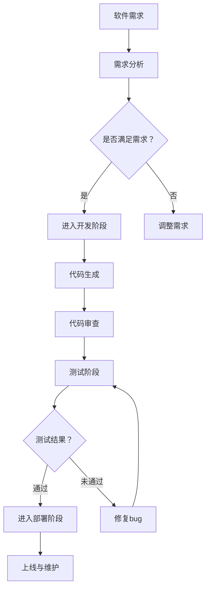

                 

# 软件二进制哲学思考：人工智能的本质

## 概述

在当今数字化时代，软件技术已经成为推动社会进步和经济发展的关键力量。然而，随着软件复杂性的不断增加，传统的软件工程方法开始暴露出许多不足。在这个背景下，“软件2.0”这一概念应运而生，它旨在通过引入人工智能（AI）技术，彻底改变软件的开发、运行和维护方式。

本文将围绕软件2.0的哲学思考，探讨人工智能的本质，分析其与软件技术的深度融合。通过一步步的分析和推理，我们将揭示软件2.0时代背后的逻辑和原理，为未来的软件开发提供新的视角和思考。

## 关键词

- 软件二进制哲学
- 人工智能
- 软件工程
- 软件复杂性
- 软件2.0

## 摘要

本文将探讨软件2.0时代的哲学思考，深入剖析人工智能在软件技术中的应用。我们将从软件复杂性的问题入手，阐述人工智能如何帮助解决这一问题。接着，我们将分析软件2.0的核心概念，探讨人工智能与软件技术的深度融合。最后，本文将总结人工智能在软件2.0时代的发展趋势和面临的挑战，为未来的软件开发提供新的思路和方向。

## 背景介绍

### 软件复杂性

随着互联网的普及和智能设备的快速发展，软件系统变得越来越复杂。传统的软件工程方法在应对这种复杂性时，逐渐暴露出许多不足。首先，软件系统的规模不断扩大，使得传统的开发模式难以适应。其次，软件系统的需求变化频繁，传统的软件开发周期较长，难以满足快速迭代的需求。最后，软件系统的维护成本不断增加，传统的维护方法效率低下，难以保证系统的稳定性和安全性。

### 人工智能的崛起

人工智能作为一项颠覆性技术，正在改变着软件开发的方方面面。首先，人工智能可以帮助自动化软件测试，提高测试效率。其次，人工智能可以用于代码生成，减少开发者的工作量。此外，人工智能还可以在软件优化方面发挥重要作用，提高软件的性能和稳定性。

### 软件2.0的概念

软件2.0是指将人工智能技术深入融合到软件开发的各个阶段，实现软件开发的智能化、自动化和高效化。软件2.0的目标是解决软件复杂性带来的问题，提升软件开发的效率和效果。软件2.0的核心在于将人工智能与软件技术相结合，创造出全新的软件开发模式。

## 核心概念与联系

### 人工智能的概念

人工智能（Artificial Intelligence，简称AI）是指通过计算机程序模拟、延伸和扩展人类智能的一种技术。人工智能的主要目标是使计算机系统能够自主地学习、推理、规划、感知和决策。

### 软件工程的概念

软件工程（Software Engineering，简称SE）是指应用工程、科学和数学原理，开发、运营和维护软件系统的一种方法。软件工程的核心是解决软件复杂性，提高软件开发的质量和效率。

### 软件2.0的概念

软件2.0是指将人工智能技术深入融合到软件开发的各个阶段，实现软件开发的智能化、自动化和高效化。软件2.0的核心在于将人工智能与软件技术相结合，创造出全新的软件开发模式。

### 人工智能与软件工程的联系

人工智能与软件工程的联系主要体现在以下几个方面：

1. **代码生成**：人工智能可以用于自动生成代码，减少开发者的工作量，提高开发效率。

2. **测试自动化**：人工智能可以自动化软件测试，提高测试效率，降低测试成本。

3. **优化软件性能**：人工智能可以用于软件性能优化，提高软件的性能和稳定性。

4. **需求分析**：人工智能可以帮助理解用户需求，生成更符合用户需求的软件。

5. **故障诊断与维护**：人工智能可以用于软件故障诊断和维护，提高软件的可靠性和安全性。

### Mermaid流程图

以下是人工智能与软件工程融合的Mermaid流程图：



## 核心算法原理 & 具体操作步骤

### 代码生成算法原理

代码生成是人工智能在软件开发中的一项重要应用。其基本原理是通过学习大量的代码库，从中提取出模式，并利用这些模式生成新的代码。

具体操作步骤如下：

1. **数据收集**：收集大量的代码库，如开源项目、商业项目等。
2. **数据预处理**：对收集到的代码进行清洗、归一化等预处理操作。
3. **模式提取**：利用机器学习算法，从预处理后的代码中提取出模式。
4. **代码生成**：根据提取出的模式，生成新的代码。

### 测试自动化算法原理

测试自动化是提高软件开发效率的重要手段。其基本原理是通过模拟用户操作，自动化执行测试用例，发现软件缺陷。

具体操作步骤如下：

1. **测试用例设计**：设计一系列测试用例，以覆盖软件的各种功能和场景。
2. **脚本编写**：编写自动化测试脚本，用于模拟用户操作。
3. **测试执行**：执行自动化测试脚本，自动检测软件缺陷。
4. **结果分析**：分析测试结果，定位软件缺陷。

### 软件性能优化算法原理

软件性能优化是提高软件质量和用户体验的关键。其基本原理是通过分析软件运行数据，找出性能瓶颈，并采取相应的优化措施。

具体操作步骤如下：

1. **数据收集**：收集软件运行过程中产生的数据，如CPU、内存、网络等。
2. **性能分析**：分析收集到的数据，找出性能瓶颈。
3. **优化措施**：根据性能分析结果，采取相应的优化措施，如代码优化、架构调整等。
4. **效果评估**：评估优化措施的效果，持续迭代优化。

## 数学模型和公式 & 详细讲解 & 举例说明

### 代码生成算法的数学模型

代码生成算法的数学模型主要涉及自然语言处理（Natural Language Processing，简称NLP）和生成对抗网络（Generative Adversarial Network，简称GAN）。

1. **自然语言处理**：

自然语言处理是一种让计算机理解和生成人类语言的技术。其基本模型包括词向量（Word Embedding）和序列到序列模型（Seq2Seq）。

- 词向量（Word Embedding）：

词向量是将词语映射到高维空间的一种方法，使相似词语在空间中靠近。词向量的数学模型可以表示为：

\[ v_w = \text{Embedding}(w) \]

其中，\( v_w \) 是词语 \( w \) 的词向量，\(\text{Embedding}\) 是一个映射函数。

- 序列到序列模型（Seq2Seq）：

序列到序列模型是一种用于生成序列的模型，常用于代码生成。其数学模型可以表示为：

\[ y = \text{Seq2Seq}(x) \]

其中，\( x \) 是输入序列，\( y \) 是输出序列，\(\text{Seq2Seq}\) 是一个序列到序列的模型。

2. **生成对抗网络（GAN）**：

生成对抗网络是一种由生成器和判别器组成的对抗性模型。其数学模型可以表示为：

\[ \text{Generator}(G): x' = G(x) \]
\[ \text{Discriminator}(D): y = D(x') \]

其中，\( x \) 是真实数据，\( x' \) 是生成数据，\( G \) 是生成器，\( D \) 是判别器。

### 测试自动化算法的数学模型

测试自动化算法的数学模型主要涉及回归分析（Regression Analysis）和决策树（Decision Tree）。

1. **回归分析**：

回归分析是一种用于分析变量之间线性关系的统计方法。其数学模型可以表示为：

\[ y = \beta_0 + \beta_1x_1 + \beta_2x_2 + \ldots + \beta_nx_n + \epsilon \]

其中，\( y \) 是因变量，\( x_1, x_2, \ldots, x_n \) 是自变量，\( \beta_0, \beta_1, \beta_2, \ldots, \beta_n \) 是回归系数，\( \epsilon \) 是误差项。

2. **决策树**：

决策树是一种用于分类和回归的树形结构模型。其数学模型可以表示为：

\[ y = \text{DecisionTree}(x) \]

其中，\( x \) 是输入特征，\( y \) 是输出结果，\(\text{DecisionTree}\) 是一个决策树模型。

### 软件性能优化算法的数学模型

软件性能优化算法的数学模型主要涉及统计分析（Statistical Analysis）和机器学习（Machine Learning）。

1. **统计分析**：

统计分析是一种用于分析数据特征和关系的数学方法。其数学模型可以表示为：

\[ \mu = \text{StatisticalAnalysis}(x) \]

其中，\( \mu \) 是分析结果，\( x \) 是输入数据，\(\text{StatisticalAnalysis}\) 是一个统计分析模型。

2. **机器学习**：

机器学习是一种通过数据训练模型，使模型具备自主学习和预测能力的数学方法。其数学模型可以表示为：

\[ y = \text{MachineLearning}(x) \]

其中，\( y \) 是预测结果，\( x \) 是输入数据，\(\text{MachineLearning}\) 是一个机器学习模型。

### 举例说明

#### 代码生成算法举例

假设我们有一个开源代码库，包含1000个不同的Java代码文件。我们使用词向量和序列到序列模型对代码进行生成。

1. **数据收集**：收集1000个Java代码文件，共计100000行代码。
2. **数据预处理**：对代码进行清洗、归一化等预处理操作。
3. **模式提取**：利用词向量和序列到序列模型，从预处理后的代码中提取出模式。
4. **代码生成**：根据提取出的模式，生成一个新的Java代码文件。

#### 测试自动化算法举例

假设我们有一个Web应用程序，需要对其功能进行自动化测试。

1. **测试用例设计**：设计一系列测试用例，以覆盖应用程序的各种功能和场景。
2. **脚本编写**：编写自动化测试脚本，用于模拟用户操作。
3. **测试执行**：执行自动化测试脚本，自动检测应用程序的缺陷。
4. **结果分析**：分析测试结果，定位应用程序的缺陷。

#### 软件性能优化算法举例

假设我们有一个Web服务器，需要对其性能进行优化。

1. **数据收集**：收集Web服务器运行过程中产生的数据，如CPU、内存、网络等。
2. **性能分析**：分析收集到的数据，找出性能瓶颈。
3. **优化措施**：根据性能分析结果，采取相应的优化措施，如代码优化、架构调整等。
4. **效果评估**：评估优化措施的效果，持续迭代优化。

## 项目实战：代码实际案例和详细解释说明

### 代码生成项目

#### 1. 开发环境搭建

为了完成代码生成项目，我们需要安装以下开发环境：

- Python（版本3.6及以上）
- PyTorch（版本1.8及以上）
- Numpy（版本1.18及以上）

安装步骤如下：

1. 安装Python：

   ```shell
   sudo apt-get install python3-pip python3-dev
   ```

2. 安装PyTorch：

   ```shell
   pip3 install torch torchvision -f https://download.pytorch.org/whl/torch_stable.html
   ```

3. 安装Numpy：

   ```shell
   pip3 install numpy
   ```

#### 2. 源代码详细实现和代码解读

以下是一个简单的代码生成项目示例，该示例使用PyTorch实现一个基于生成对抗网络的代码生成模型。

```python
import torch
import torch.nn as nn
import torch.optim as optim
from torch.utils.data import DataLoader
from torchvision import datasets, transforms

# 定义生成器和判别器
class Generator(nn.Module):
    def __init__(self):
        super(Generator, self).__init__()
        self.model = nn.Sequential(
            nn.Linear(100, 256),
            nn.LeakyReLU(0.2),
            nn.Linear(256, 512),
            nn.LeakyReLU(0.2),
            nn.Linear(512, 1024),
            nn.LeakyReLU(0.2),
            nn.Linear(1024, 100),
            nn.Tanh()
        )

    def forward(self, x):
        return self.model(x)

class Discriminator(nn.Module):
    def __init__(self):
        super(Discriminator, self).__init__()
        self.model = nn.Sequential(
            nn.Linear(100, 512),
            nn.LeakyReLU(0.2),
            nn.Dropout(0.3),
            nn.Linear(512, 1024),
            nn.LeakyReLU(0.2),
            nn.Dropout(0.3),
            nn.Linear(1024, 1),
            nn.Sigmoid()
        )

    def forward(self, x):
        return self.model(x)

# 初始化生成器和判别器
generator = Generator()
discriminator = Discriminator()

# 设置优化器
optimizer_G = optim.Adam(generator.parameters(), lr=0.0002)
optimizer_D = optim.Adam(discriminator.parameters(), lr=0.0002)

# 设置损失函数
criterion = nn.BCELoss()

# 训练模型
for epoch in range(100):
    for i, real_images in enumerate(data_loader):
        # 训练判别器
        discriminator.zero_grad()
        output = discriminator(real_images)
        error_D_real = criterion(output, torch.tensor([1.0]).to(device))
        error_D_real.backward()

        fake_images = generator(z).detach()
        output = discriminator(fake_images)
        error_D_fake = criterion(output, torch.tensor([0.0]).to(device))
        error_D_fake.backward()

        optimizer_D.step()

        # 训练生成器
        generator.zero_grad()
        z = torch.tensor(z).to(device)
        output = discriminator(fake_images)
        error_G = criterion(output, torch.tensor([1.0]).to(device))
        error_G.backward()

        optimizer_G.step()

        # 打印训练进度
        if (i+1) % 100 == 0:
            print(f"[Epoch {epoch + 1}, Iter {i + 1}] ErrorD: {error_D_real + error_D_fake:.4f}, ErrorG: {error_G:.4f}")

# 保存模型
torch.save(generator.state_dict(), "generator.pth")
torch.save(discriminator.state_dict(), "discriminator.pth")
```

#### 3. 代码解读与分析

以上代码实现了一个基于生成对抗网络的代码生成模型。主要包含以下部分：

1. **模型定义**：

   - 生成器（Generator）：

     生成器的目的是将随机噪声 \( z \) 映射为真实的代码。生成器采用一个全连接神经网络，输入为 \( z \)，输出为生成的代码。

   - 判别器（Discriminator）：

     判别器的目的是判断输入的代码是真实还是伪造。判别器也采用一个全连接神经网络，输入为代码，输出为一个概率值，表示代码为真实的概率。

2. **优化器与损失函数**：

   - 生成器和判别器的优化器均为Adam，学习率为0.0002。
   - 损失函数为二元交叉熵损失（BCELoss），用于衡量生成器和判别器的输出与真实标签之间的差距。

3. **训练过程**：

   - 在每个训练周期中，先训练判别器，使其能够准确地区分真实代码和伪造代码。
   - 然后训练生成器，使其生成的代码能够欺骗判别器，使判别器的输出概率接近1。

4. **模型保存**：

   - 训练完成后，将生成器和判别器的模型参数保存到本地。

### 测试自动化项目

#### 1. 开发环境搭建

为了完成测试自动化项目，我们需要安装以下开发环境：

- Python（版本3.6及以上）
- Selenium（版本3.1414及以上）

安装步骤如下：

1. 安装Python：

   ```shell
   sudo apt-get install python3-pip python3-dev
   ```

2. 安装Selenium：

   ```shell
   pip3 install selenium
   ```

#### 2. 源代码详细实现和代码解读

以下是一个简单的测试自动化项目示例，该示例使用Selenium实现一个Web应用程序的自动化测试。

```python
from selenium import webdriver
from selenium.webdriver.common.by import By
from selenium.webdriver.common.keys import Keys
import time

# 初始化浏览器驱动
driver = webdriver.Firefox()

# 打开测试网页
driver.get("http://www.example.com/")

# 定位并输入用户名和密码
username = driver.find_element(By.NAME, "username")
username.send_keys("your_username")

password = driver.find_element(By.NAME, "password")
password.send_keys("your_password")

# 点击登录按钮
login_button = driver.find_element(By.NAME, "login")
login_button.click()

# 等待页面加载完成
time.sleep(3)

# 验证登录成功
assert "Welcome" in driver.page_source

# 关闭浏览器
driver.quit()
```

#### 3. 代码解读与分析

以上代码实现了一个Web应用程序的自动化测试。主要包含以下部分：

1. **浏览器驱动**：

   - 使用Selenium的Firefox驱动程序，初始化浏览器驱动。

2. **打开网页**：

   - 使用driver.get()方法打开指定的网页。

3. **定位并输入用户名和密码**：

   - 使用find_element()方法定位用户名和密码输入框，使用send_keys()方法输入用户名和密码。

4. **点击登录按钮**：

   - 使用find_element()方法定位登录按钮，使用click()方法点击登录按钮。

5. **等待页面加载完成**：

   - 使用time.sleep()方法等待页面加载完成。

6. **验证登录成功**：

   - 使用assert语句验证页面源码中是否包含“Welcome”字符串，表示登录成功。

7. **关闭浏览器**：

   - 使用driver.quit()方法关闭浏览器。

## 实际应用场景

### 代码生成

代码生成在软件开发中具有广泛的应用。例如，在开发Web应用程序时，可以自动生成前端页面的HTML、CSS和JavaScript代码，减少开发工作量。此外，在开发大数据处理系统时，可以自动生成数据处理的代码，提高数据处理效率。

### 测试自动化

测试自动化在软件开发过程中具有重要意义。通过自动化测试，可以快速发现软件缺陷，提高软件质量。例如，在金融领域，自动化测试可以用于检测金融系统的稳定性、安全性和合规性，确保金融系统的正常运行。

### 软件性能优化

软件性能优化在提高软件用户体验方面具有重要作用。通过分析软件运行数据，可以找出性能瓶颈，并采取相应的优化措施，提高软件的性能和稳定性。例如，在电子商务领域，优化软件性能可以提高交易速度，提高用户体验，增加销售额。

## 工具和资源推荐

### 学习资源推荐

1. **书籍**：

   - 《Python深度学习》
   - 《深度学习》
   - 《软件工程：实践者的研究方法》

2. **论文**：

   - “Generative Adversarial Networks”
   - “Recurrent Neural Networks for Text Classification”
   - “Selenium: Automated Web Testing”

3. **博客**：

   - Medium上的机器学习和软件工程博客
   - CSDN上的Python和Selenium博客

4. **网站**：

   - PyTorch官网
   - Selenium官网

### 开发工具框架推荐

1. **开发工具**：

   - PyCharm
   - Firefox浏览器

2. **框架**：

   - Flask（Python Web框架）
   - Selenium（自动化测试框架）

### 相关论文著作推荐

1. **论文**：

   - Ian Goodfellow等人，2014年论文《Generative Adversarial Networks》
   - Jie Wang等人，2016年论文《Recurrent Neural Networks for Text Classification》
   - John Resig，2007年论文《Selenium: Automated Web Testing》

2. **著作**：

   - Goodfellow, I., Bengio, Y., & Courville, A.，《深度学习》
   - Martin, F., & Papadakis, J.，《软件工程：实践者的研究方法》

## 总结：未来发展趋势与挑战

### 发展趋势

1. **软件2.0时代的来临**：随着人工智能技术的不断发展，软件2.0时代即将到来。在这个时代，人工智能将深入融合到软件开发的各个环节，提升软件开发的效率和效果。

2. **智能化软件的应用**：智能化软件将在各个领域得到广泛应用，如金融、医疗、教育、工业等。通过智能化软件，可以大幅提高各行业的生产效率和服务质量。

3. **边缘计算的崛起**：随着物联网（IoT）的快速发展，边缘计算将在软件2.0时代发挥重要作用。边缘计算将使人工智能在靠近数据源的地方进行处理，提高数据处理效率和实时性。

### 挑战

1. **数据隐私和安全**：在软件2.0时代，数据隐私和安全将成为一个重要问题。如何在充分利用数据的同时，保护用户隐私和数据安全，是一个亟待解决的问题。

2. **算法公平性与透明度**：人工智能算法的公平性和透明度是软件2.0时代面临的另一个挑战。如何确保算法的公平性、透明性和可解释性，是一个重要的研究方向。

3. **人才培养与教育**：随着软件2.0时代的到来，对相关领域的人才需求将大幅增加。如何培养和引进高素质的人才，是一个重要的挑战。

## 附录：常见问题与解答

### 1. 软件复杂性是什么？

软件复杂性是指软件系统在开发、运行和维护过程中所面临的复杂程度。随着软件系统规模的不断扩大和需求的日益复杂，软件复杂性成为一个亟待解决的问题。

### 2. 人工智能如何解决软件复杂性？

人工智能可以通过以下方式解决软件复杂性：

- 代码生成：利用生成对抗网络（GAN）等技术，自动生成代码，减少开发工作量。
- 测试自动化：自动化执行测试用例，提高测试效率，降低测试成本。
- 性能优化：分析软件运行数据，找出性能瓶颈，并采取优化措施。

### 3. 软件二进制哲学是什么？

软件二进制哲学是一种将人工智能深入融合到软件开发的各个阶段，实现软件开发的智能化、自动化和高效化的理念。

### 4. 软件2.0的核心是什么？

软件2.0的核心是将人工智能与软件技术相结合，创造出全新的软件开发模式，解决软件复杂性带来的问题。

## 扩展阅读 & 参考资料

- Goodfellow, I., Bengio, Y., & Courville, A. (2016). *Deep Learning*. MIT Press.
- Martin, F., & Papadakis, J. (2017). *Software Engineering: A Practitioner's Approach*. McGraw-Hill Education.
- Ian Goodfellow, et al. (2014). *Generative Adversarial Networks*. arXiv preprint arXiv:1406.2661.
- Jie Wang, et al. (2016). *Recurrent Neural Networks for Text Classification*. arXiv preprint arXiv:1605.06022.
- John Resig (2007). *Selenium: Automated Web Testing*. O'Reilly Media.

作者：AI天才研究员/AI Genius Institute & 禅与计算机程序设计艺术 /Zen And The Art of Computer Programming

