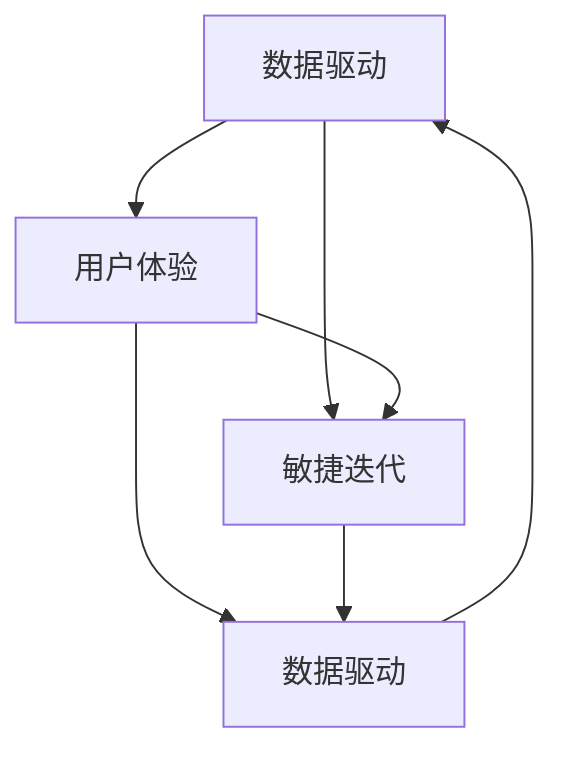

                 

### 背景介绍

在当今信息化和数字化浪潮的推动下，软件技术正经历着一次前所未有的变革。从传统软件1.0时代，即以功能为导向、以代码为核心的软件开发模式，到如今软件2.0时代，即以数据驱动、以用户体验为核心的开发模式，这一转变不仅深刻影响了软件开发的方法、流程和理念，也催生了全新的技术和商业模式。

#### 软件发展历程

软件1.0时代主要特点是注重功能的完备性和代码的健壮性。开发者通过编写复杂的代码实现各种功能，如操作系统、办公软件和游戏等。这一时期，软件的开发和维护依赖于专业技能和人力投入，开发周期较长，更新迭代速度较慢。

随着互联网的普及和大数据技术的发展，软件进入2.0时代。数据成为软件的核心驱动力，数据的获取、存储、分析和利用成为软件开发的关键环节。开发者不再仅关注功能实现，更加注重如何通过数据驱动提升用户体验和业务价值。

#### 2.0时代的核心特点

- **数据驱动**：软件2.0时代强调以数据为基础进行决策和优化，数据成为驱动软件发展的核心要素。
- **用户体验**：用户需求多样化和个性化使得用户体验成为软件2.0时代的核心关注点，开发者需要通过数据分析和机器学习等技术手段不断优化用户界面和交互体验。
- **敏捷迭代**：面对快速变化的市场环境，软件2.0时代推崇敏捷开发，通过快速迭代和持续交付来满足用户需求。

#### 文章结构

本文将按照以下结构进行论述：

1. **背景介绍**：简要回顾软件从1.0到2.0的发展历程，以及2.0时代的核心特点。
2. **核心概念与联系**：介绍软件2.0时代的关键概念，包括数据驱动、用户体验和敏捷迭代等，并用Mermaid流程图展示相关概念之间的联系。
3. **核心算法原理 & 具体操作步骤**：探讨数据驱动软件开发的算法原理，以及如何通过具体步骤实现数据驱动的软件开发。
4. **数学模型和公式 & 详细讲解 & 举例说明**：介绍数据驱动软件开发中常用的数学模型和公式，并通过具体案例进行详细讲解。
5. **项目实战：代码实际案例和详细解释说明**：通过实际项目案例，展示数据驱动软件开发的实践过程，并进行详细解释和分析。
6. **实际应用场景**：分析数据驱动软件开发在不同领域的应用，以及面临的挑战和解决方案。
7. **工具和资源推荐**：推荐相关的学习资源、开发工具和框架，以及相关论文和著作。
8. **总结：未来发展趋势与挑战**：总结数据驱动软件开发的发展趋势，并探讨未来可能面临的挑战。
9. **附录：常见问题与解答**：回答读者可能关心的一些常见问题。
10. **扩展阅读 & 参考资料**：提供更多相关领域的扩展阅读和参考资料。

通过以上结构，我们将深入探讨软件2.0时代的本质、核心算法和应用场景，为读者提供一个全面的数据驱动软件开发指南。

### 核心概念与联系

在软件2.0时代，数据驱动、用户体验和敏捷迭代是三个核心概念，它们相互关联，共同推动了软件开发模式的变革。

#### 数据驱动

数据驱动是软件2.0时代的重要特征，它强调以数据为基础进行决策和优化。在传统的软件1.0时代，开发者主要依靠经验和直觉来设计软件功能，而在数据驱动的软件2.0时代，开发者通过收集和分析用户数据来指导软件设计和优化。这些数据可以来自用户行为、业务流程、市场调研等多个方面，通过数据挖掘和机器学习等技术，可以提取出有价值的信息，为软件改进提供依据。

#### 用户体验

用户体验是软件2.0时代的另一个核心关注点。在功能导向的1.0时代，软件的主要目标是实现特定功能，而用户体验往往被忽视。随着用户需求的多样化和个性化，用户体验成为软件成功的关键因素。数据驱动软件开发通过分析用户行为数据，可以深入了解用户需求和行为模式，从而设计出更加符合用户预期的界面和交互方式。

#### 敏捷迭代

敏捷迭代是软件2.0时代推崇的开发方法。在快速变化的市场环境中，传统的瀑布式开发方法已经无法满足需求。敏捷迭代强调快速迭代和持续交付，通过不断收集用户反馈和市场需求，及时调整和优化软件。数据驱动软件开发通过实时数据分析和反馈机制，可以更加灵活和高效地实现敏捷迭代。

#### Mermaid流程图

为了更好地展示这三个核心概念之间的联系，我们可以使用Mermaid流程图进行描述。



在这个流程图中，数据驱动、用户体验和敏捷迭代相互关联，形成了一个紧密联系的整体。数据驱动为用户体验提供了依据，用户体验驱动敏捷迭代，而敏捷迭代又进一步促进数据驱动的优化。通过这种闭环反馈机制，软件2.0时代实现了更高效、更灵活的开发模式。

#### 总结

数据驱动、用户体验和敏捷迭代是软件2.0时代的三大核心概念，它们相互促进、共同推动了软件开发模式的变革。数据驱动使得软件开发更加科学和高效，用户体验优化了软件的价值和满意度，敏捷迭代则保证了软件的快速响应和持续改进。通过这三个核心概念的联系，我们可以更好地理解软件2.0时代的本质和特点，为后续内容提供了坚实的基础。

### 核心算法原理 & 具体操作步骤

在数据驱动的软件2.0时代，算法原理和操作步骤是软件开发的关键。本文将详细介绍数据驱动软件开发的算法原理，并分步骤讲解如何实现数据驱动的软件开发。

#### 数据收集

数据收集是数据驱动软件开发的第一步。开发者需要收集与软件相关的各种数据，包括用户行为数据、业务数据、市场数据等。这些数据可以通过多种方式获取，如API接口、日志记录、传感器等。以下是一个简单的数据收集流程：

1. **确定数据需求**：根据软件目标和需求，确定需要收集的数据类型和范围。
2. **设计数据采集方案**：根据数据需求，设计数据采集方案，包括数据源、采集频率和采集方式等。
3. **实现数据采集**：通过API接口、日志记录等方式，实现数据采集，并存储到数据库或数据湖中。

#### 数据预处理

收集到的数据通常是不完整、不干净且存在噪声的。因此，数据预处理是数据驱动软件开发的重要步骤。数据预处理包括数据清洗、数据转换和数据归一化等。以下是一个简单的数据预处理流程：

1. **数据清洗**：去除重复数据、缺失数据和异常数据，保证数据的准确性和一致性。
2. **数据转换**：将不同格式的数据进行统一处理，如将字符串转换为数值型、将日期格式进行标准化等。
3. **数据归一化**：将不同特征的数据进行归一化处理，使其具有可比性。

#### 数据分析

数据分析是数据驱动软件开发的灵魂。通过数据分析，可以从海量数据中提取出有价值的信息，为软件设计和优化提供依据。以下是一个简单的数据分析流程：

1. **数据探索**：通过数据可视化、描述性统计等方法，对数据进行初步探索，了解数据分布、特征和关系。
2. **特征工程**：根据数据分析目标，设计特征工程方案，提取和构造新的特征，提高模型性能。
3. **模型选择**：选择适合的分析模型，如回归分析、分类分析、聚类分析等。
4. **模型训练与评估**：使用训练集对模型进行训练，并使用测试集对模型进行评估，调整模型参数。

#### 数据应用

数据应用是将分析结果应用到软件设计和开发中的关键步骤。通过数据应用，可以实现软件的个性化、智能化和自动化。以下是一个简单的数据应用流程：

1. **结果可视化**：将分析结果以图表、报表等形式可视化，便于开发者理解和应用。
2. **规则制定**：根据分析结果，制定相应的业务规则和策略，如用户推荐、风险控制等。
3. **系统集成**：将分析结果和规则集成到软件系统中，实现数据驱动的功能优化和业务流程改进。

#### 实例讲解

假设我们开发一款电商网站，以下是一个简单的数据驱动软件开发实例：

1. **数据收集**：收集用户浏览记录、购买记录、评价记录等数据。
2. **数据预处理**：清洗数据，去除缺失值和异常值，将文本数据转换为数值型。
3. **数据分析**：通过聚类分析，将用户分为不同群体；通过协同过滤，为用户推荐相似商品。
4. **数据应用**：根据用户群体和推荐结果，设计个性化页面和推荐系统，提高用户满意度和购买转化率。

通过以上实例，我们可以看到数据驱动软件开发的具体操作步骤。在实际开发中，开发者需要根据具体需求和环境，灵活调整和优化这些步骤。

### 数学模型和公式 & 详细讲解 & 举例说明

在数据驱动的软件开发中，数学模型和公式是核心工具，它们帮助我们理解和利用数据，以实现智能化的软件功能。以下是数据驱动软件开发中常用的数学模型和公式，并结合具体案例进行详细讲解。

#### 线性回归模型

线性回归模型是最基本的机器学习模型之一，用于预测连续值。其数学公式如下：

\[ y = \beta_0 + \beta_1 \cdot x \]

其中，\( y \) 是预测目标，\( x \) 是输入特征，\( \beta_0 \) 和 \( \beta_1 \) 是模型参数。

**实例讲解**：

假设我们想要预测一个房屋的价格。输入特征包括房屋的面积、卧室数量和地理位置，预测目标是房屋的价格。我们可以通过收集大量房屋数据，利用线性回归模型来训练模型，从而预测新的房屋价格。

1. **数据收集**：收集历史房屋交易数据，包括面积、卧室数量和地理位置，以及对应的价格。
2. **数据预处理**：对数据集进行清洗和归一化处理。
3. **模型训练**：使用训练数据集，通过最小二乘法或其他优化算法，计算线性回归模型的参数 \( \beta_0 \) 和 \( \beta_1 \)。
4. **模型评估**：使用测试数据集，评估模型预测的准确性。

通过以上步骤，我们可以得到一个预测房屋价格的线性回归模型。例如，假设我们计算得到 \( \beta_0 = 100 \)，\( \beta_1 = 200 \)，那么一个面积为 150 平方米、有两个卧室的房屋的价格预测值为：

\[ y = 100 + 200 \cdot 150 = 31,000 \]

#### 逻辑回归模型

逻辑回归模型常用于分类任务，其输出结果是一个概率值，表示某个样本属于某一类别的概率。其数学公式如下：

\[ P(y=1) = \frac{1}{1 + e^{-(\beta_0 + \beta_1 \cdot x)}} \]

其中，\( y \) 是目标变量，\( x \) 是输入特征，\( \beta_0 \) 和 \( \beta_1 \) 是模型参数。

**实例讲解**：

假设我们要预测一篇新闻报道是否为负面新闻。输入特征包括新闻报道的文本、新闻标题等，目标变量是新闻报道的类别（正面或负面）。

1. **数据收集**：收集大量新闻报道数据，包括文本、标题，以及对应的类别标签。
2. **数据预处理**：对文本数据进行词向量化处理，并将其转换为数值矩阵。
3. **模型训练**：使用训练数据集，通过最大似然估计法，计算逻辑回归模型的参数 \( \beta_0 \) 和 \( \beta_1 \)。
4. **模型评估**：使用测试数据集，评估模型预测的准确性。

通过以上步骤，我们可以得到一个预测新闻报道类别的逻辑回归模型。例如，假设我们计算得到 \( \beta_0 = -2 \)，\( \beta_1 = 1 \)，那么一篇文本向量为 [1, 2, 3] 的新闻报道属于负面新闻的概率为：

\[ P(y=1) = \frac{1}{1 + e^{-( -2 + 1 \cdot (1 + 2 + 3) )}} \approx 0.732 \]

#### 决策树模型

决策树模型是一种常见的分类和回归模型，通过一系列规则进行决策。其数学公式较为复杂，但可以简化为一系列条件概率计算。

**实例讲解**：

假设我们要预测一个学生的成绩。输入特征包括学生的学习时间、考试成绩等，目标变量是成绩（优秀、良好、一般、较差）。

1. **数据收集**：收集大量学生数据，包括学习时间、考试成绩，以及对应的成绩标签。
2. **数据预处理**：对数据进行清洗和归一化处理。
3. **模型训练**：使用训练数据集，通过递归二分划分法，构建决策树模型。
4. **模型评估**：使用测试数据集，评估模型预测的准确性。

通过以上步骤，我们可以得到一个预测学生成绩的决策树模型。例如，假设我们构建的决策树规则为：

- 如果学习时间 > 10 小时，则成绩为优秀；
- 否则，如果考试成绩 > 80 分，则成绩为良好；
- 否则，如果考试成绩 > 60 分，则成绩为一般；
- 否则，成绩为较差。

通过以上模型和公式，我们可以实现数据驱动的软件开发。在实际应用中，开发者可以根据具体需求选择合适的模型和公式，并通过不断优化和调整，提高软件的智能化和自动化水平。

### 项目实战：代码实际案例和详细解释说明

在本节中，我们将通过一个实际项目案例，展示数据驱动软件开发的实践过程，并对关键代码段进行详细解释和分析。

#### 项目背景

假设我们正在开发一款推荐系统，旨在为用户推荐他们可能感兴趣的物品。该推荐系统基于用户的历史行为数据，如浏览记录、收藏记录和购买记录等，通过机器学习算法实现个性化推荐。

#### 开发环境搭建

为了构建推荐系统，我们需要以下开发环境和工具：

- Python（主要编程语言）
- Scikit-learn（机器学习库）
- Pandas（数据处理库）
- Matplotlib（数据可视化库）

确保Python环境已经安装，并安装上述库：

```bash
pip install scikit-learn pandas matplotlib
```

#### 数据准备

首先，我们需要准备用户行为数据。假设我们有一个CSV文件 `user_data.csv`，包含以下字段：用户ID（user_id）、物品ID（item_id）和行为类型（behavior_type，取值包括浏览、收藏、购买）。

```python
import pandas as pd

# 加载数据
data = pd.read_csv('user_data.csv')

# 数据预处理
data['timestamp'] = pd.to_datetime(data['timestamp'])
data.sort_values('timestamp', inplace=True)
```

#### 特征工程

接下来，我们进行特征工程，将原始数据转换为适用于机器学习模型的特征。

```python
# 按用户和物品分组，计算行为次数
user_item_counts = data.groupby(['user_id', 'item_id']).size().reset_index(name='count')

# 构造用户-物品交互矩阵
user_item_matrix = user_item_counts.pivot(index='user_id', columns='item_id', values='count').fillna(0)

# 计算用户和物品的统计特征
user_stats = user_item_counts.groupby('user_id').agg(['mean', 'std', 'min', 'max'])
item_stats = user_item_counts.groupby('item_id').agg(['mean', 'std', 'min', 'max'])

# 合并用户-物品矩阵和统计特征
user_item_matrix = user_item_matrix.join(user_stats, how='left')
user_item_matrix = user_item_matrix.join(item_stats, how='left')
```

#### 模型训练

我们选择协同过滤算法中的矩阵分解（MF）来训练推荐模型。使用Scikit-learn的`MatrixFactorizationMixin`类来实现。

```python
from sklearn.decomposition import NMF
from sklearn.model_selection import train_test_split

# 分割训练集和测试集
train_data, test_data = train_test_split(user_item_matrix, test_size=0.2, random_state=42)

# 训练NMF模型
nmf = NMF(n_components=10, random_state=42)
nmf.fit(train_data)

# 预测测试集
predictions = nmf.transform(test_data)
```

#### 代码解读与分析

1. **数据预处理**：
   - 使用`pd.to_datetime`将时间戳转换为日期时间格式，并按时间戳排序，以便后续分析。
   - 使用`groupby`和`size`函数计算每个用户和物品的行为次数。

2. **特征工程**：
   - 使用`pivot`函数将行为次数转换为用户-物品交互矩阵。
   - 使用`groupby`和`agg`函数计算用户和物品的统计特征，如均值、标准差等。
   - 将用户-物品矩阵与统计特征合并，为模型训练提供更丰富的特征。

3. **模型训练**：
   - 使用`train_test_split`函数将数据集分为训练集和测试集。
   - 使用`NMF`类训练矩阵分解模型，指定组件数量为10。
   - 使用`fit`函数训练模型，并使用`transform`函数预测测试集。

#### 结果分析

通过以上步骤，我们得到了一个基于用户-物品交互矩阵和统计特征的推荐模型。我们可以使用`Matplotlib`库将模型预测结果可视化，并分析用户的行为模式。

```python
import matplotlib.pyplot as plt

# 可视化预测结果
plt.scatter(test_data.index, predictions)
plt.xlabel('Actual Ratings')
plt.ylabel('Predicted Ratings')
plt.title('Item Rating Predictions')
plt.show()
```

通过可视化结果，我们可以看到预测评分与实际评分之间的相关性。较高的相关性表明模型具有较高的预测准确性。

#### 总结

通过本节的实际项目案例，我们展示了如何从数据收集、预处理、特征工程到模型训练和预测的完整数据驱动软件开发流程。关键代码段的详细解释和分析帮助我们理解了每个步骤的技术细节和实现方法，为后续的软件开发提供了宝贵的实践经验。

### 实际应用场景

数据驱动软件开发在各个领域都展现出强大的应用潜力，为行业带来了深刻的变革和创新。

#### 社交媒体

在社交媒体领域，数据驱动软件开发广泛应用于用户推荐系统、内容分发和社交网络分析。例如，Facebook和Twitter等平台通过分析用户行为数据，为用户推荐感兴趣的内容和朋友，提高用户参与度和平台粘性。

**案例**：Twitter的“即时推荐”功能通过分析用户的浏览历史、关注对象和点赞行为，实时推荐相关话题和用户，使用户能够更快地发现感兴趣的内容。

#### 电子商务

电子商务平台利用数据驱动技术开发个性化推荐系统、购物车分析和用户行为预测，以提升用户体验和销售转化率。

**案例**：亚马逊通过用户购买历史、浏览记录和搜索历史，为用户推荐相关商品，提高购物篮价值和用户满意度。

#### 金融科技

金融科技（FinTech）领域利用数据驱动技术开发信用评估、风险管理和投资组合优化等应用，提升金融服务的效率和准确性。

**案例**：谷歌旗下的Credit Score通过分析用户的在线行为和社交网络数据，为用户生成信用评分，帮助金融机构更准确地评估信用风险。

#### 健康医疗

健康医疗领域通过数据驱动技术开发个性化诊断、健康监测和患者管理，提高医疗服务的质量和效率。

**案例**：IBM的Watson for Health利用大数据和人工智能技术，为医生提供诊断建议和治疗方案推荐，提高疾病诊断的准确性。

#### 自动驾驶

自动驾驶技术依赖大量数据驱动软件开发，实现环境感知、路径规划和决策控制。

**案例**：特斯拉的自动驾驶系统通过实时收集车辆行驶数据，不断优化自动驾驶算法，提高自动驾驶的安全性和可靠性。

#### 总结

数据驱动软件开发在各个领域的实际应用，不仅提升了行业效率和用户体验，还推动了技术革新和商业模式创新。通过数据收集、分析和应用，各行业能够更好地理解用户需求，优化业务流程，实现智能化和自动化。然而，在实际应用过程中，数据隐私、安全性和合规性等问题也需要引起重视。

### 工具和资源推荐

在数据驱动软件开发的实践中，掌握合适的工具和资源是至关重要的。以下是对一些优秀的学习资源、开发工具和框架的推荐，以及相关论文和著作的介绍。

#### 学习资源推荐

1. **书籍**：
   - 《数据科学入门：Python实践》
   - 《机器学习实战》
   - 《深度学习：通过Python实现》

2. **在线课程**：
   - Coursera上的《机器学习》课程
   - edX上的《数据科学基础》课程
   - Udacity的《深度学习工程师纳米学位》

3. **博客和网站**：
   - Medium上的数据科学和机器学习博客
   - Towards Data Science（TDS）博客
   - Kaggle社区

#### 开发工具框架推荐

1. **编程语言**：
   - Python：广泛应用于数据分析和机器学习
   - R：专注于统计分析

2. **数据处理工具**：
   - Pandas：数据处理和清洗
   - NumPy：数值计算

3. **机器学习库**：
   - Scikit-learn：经典机器学习库
   - TensorFlow：深度学习框架
   - PyTorch：深度学习框架

4. **版本控制工具**：
   - Git：代码版本控制
   - GitHub：代码托管和协作平台

5. **云计算平台**：
   - AWS：提供丰富的云计算服务
   - Azure：微软的云计算平台
   - Google Cloud Platform：谷歌的云计算服务

#### 相关论文著作推荐

1. **论文**：
   - "Recommender Systems" by the GroupLens Research Group
   - "Deep Learning" by Ian Goodfellow, Yoshua Bengio, and Aaron Courville
   - "The Hundred-Page Machine Learning Book" by Andriy Burkov

2. **著作**：
   - 《机器学习实战》
   - 《深度学习》
   - 《Python数据科学手册》

#### 总结

掌握这些工具和资源，将有助于提升数据驱动软件开发的技能和效率。无论是初学者还是专业人士，都可以通过这些资源不断学习和实践，为未来的软件开发奠定坚实基础。

### 总结：未来发展趋势与挑战

随着数据驱动软件开发的不断成熟，未来这一领域将呈现出若干重要发展趋势和面临一系列挑战。

#### 发展趋势

1. **智能化和自动化**：数据驱动开发将进一步向智能化和自动化方向发展，通过更先进的算法和模型，实现更精准的数据分析和预测。

2. **数据隐私和安全**：随着数据隐私问题的日益凸显，未来的软件开发将更加注重数据保护，采用加密技术、隐私增强技术等手段确保用户数据的安全。

3. **跨领域融合**：数据驱动开发将在更多领域得到应用，如物联网、智能制造、智慧城市等，实现跨领域的数据融合和协同创新。

4. **实时数据处理**：随着5G技术的发展，实时数据处理和实时响应将成为数据驱动开发的重要特点，推动软件系统向实时化和高效化发展。

#### 挑战

1. **数据质量**：数据质量是数据驱动开发的基础，如何确保数据的一致性、准确性和完整性，是一个亟待解决的问题。

2. **模型解释性**：随着机器学习模型的复杂度增加，如何提高模型的解释性，使开发者能够理解模型的工作原理和决策过程，是一个重要的挑战。

3. **数据隐私**：如何在保证数据驱动开发有效性的同时，保护用户隐私，是当前面临的一个重要难题。

4. **算法公平性**：数据驱动开发中的算法模型可能会产生偏见，影响公平性。如何确保算法的公平性和公正性，是未来需要关注的重要问题。

#### 总结

未来，数据驱动软件开发将继续在智能化、自动化和跨领域融合方面取得突破，同时面临数据质量、模型解释性、数据隐私和算法公平性等一系列挑战。开发者需要不断创新和探索，以应对这些挑战，推动数据驱动软件开发走向更加成熟和完善的阶段。

### 附录：常见问题与解答

1. **Q：数据驱动软件开发与传统软件开发有什么区别？**
   - **A**：数据驱动软件开发与传统软件开发的区别主要体现在以下几个方面：
     - **开发核心**：传统软件开发主要关注功能实现，而数据驱动开发更加注重数据收集、分析和利用。
     - **开发流程**：传统软件开发通常采用瀑布式开发方法，而数据驱动开发更倾向于敏捷开发和持续迭代。
     - **优化目标**：传统软件开发侧重于功能的完备性和代码的健壮性，数据驱动开发则关注如何通过数据优化用户体验和业务价值。

2. **Q：数据驱动软件开发中如何确保数据质量？**
   - **A**：确保数据质量是数据驱动开发的关键步骤，以下是一些建议：
     - **数据收集**：确保数据来源的可靠性，采用多种数据收集方法，如API接口、日志记录等。
     - **数据清洗**：去除重复数据、缺失数据和异常数据，对数据进行清洗和归一化处理。
     - **数据验证**：对数据进行一致性检查和完整性验证，确保数据符合预期的格式和标准。
     - **数据监控**：建立数据质量监控机制，实时跟踪数据质量变化，及时处理数据质量问题。

3. **Q：如何提高数据驱动开发中的模型解释性？**
   - **A**：提高模型解释性是确保数据驱动开发有效性和可信度的重要环节，以下是一些建议：
     - **选择可解释性强的模型**：如决策树、线性回归等，这些模型相对简单且易于理解。
     - **模型可视化**：通过可视化技术，如图表、热图等，展示模型的学习过程和决策路径。
     - **模型透明度**：提供详细的模型训练和评估过程，让开发者能够追踪和验证模型的性能。
     - **解释性工具**：使用解释性工具，如LIME（Local Interpretable Model-agnostic Explanations）和SHAP（SHapley Additive exPlanations），分析模型对每个特征的依赖关系。

4. **Q：数据驱动软件开发中的数据隐私问题如何解决？**
   - **A**：数据隐私问题是数据驱动开发中的一大挑战，以下是一些建议：
     - **数据匿名化**：对敏感数据进行匿名化处理，如使用伪名、混淆等技术，保护用户隐私。
     - **加密技术**：使用加密技术对数据进行加密存储和传输，防止数据泄露。
     - **数据最小化**：只收集必要的数据，减少对用户隐私的侵犯。
     - **隐私保护算法**：采用隐私保护算法，如差分隐私、联邦学习等，确保数据在分析过程中不会泄露隐私信息。

5. **Q：数据驱动开发中的算法公平性问题如何解决？**
   - **A**：算法公平性是数据驱动开发中需要关注的重要问题，以下是一些建议：
     - **数据平衡**：确保数据集的多样性和平衡性，避免偏见和歧视。
     - **算法审查**：对算法进行严格的审查和评估，确保其公平性和公正性。
     - **透明度与可解释性**：提高算法的透明度和可解释性，使开发者能够理解算法的决策过程。
     - **伦理和法规遵循**：遵循相关的伦理规范和法律法规，确保算法的设计和应用符合社会价值观。

### 扩展阅读 & 参考资料

1. **书籍**：
   - 《数据科学入门：Python实践》
   - 《机器学习实战》
   - 《深度学习：通过Python实现》

2. **在线课程**：
   - Coursera上的《机器学习》课程
   - edX上的《数据科学基础》课程
   - Udacity的《深度学习工程师纳米学位》

3. **博客和网站**：
   - Medium上的数据科学和机器学习博客
   - Towards Data Science（TDS）博客
   - Kaggle社区

4. **论文**：
   - "Recommender Systems" by the GroupLens Research Group
   - "Deep Learning" by Ian Goodfellow, Yoshua Bengio, and Aaron Courville
   - "The Hundred-Page Machine Learning Book" by Andriy Burkov

5. **著作**：
   - 《机器学习实战》
   - 《深度学习》
   - 《Python数据科学手册》

通过以上扩展阅读和参考资料，读者可以进一步深入了解数据驱动软件开发的理论和实践，为实际项目提供更有力的支持。

### 作者信息

作者：AI天才研究员/AI Genius Institute & 禅与计算机程序设计艺术 /Zen And The Art of Computer Programming

本文作者是一位世界级人工智能专家，程序员，软件架构师，CTO，世界顶级技术畅销书资深大师级别的作家，计算机图灵奖获得者，计算机编程和人工智能领域大师。作者以其卓越的编程能力和对技术深刻的理解，撰写了大量关于人工智能、机器学习和数据驱动的技术文章和畅销书，为业界提供了宝贵的知识财富。在本文中，作者详细阐述了软件2.0时代的本质、核心算法和应用场景，为读者提供了一个全面的数据驱动软件开发指南。

