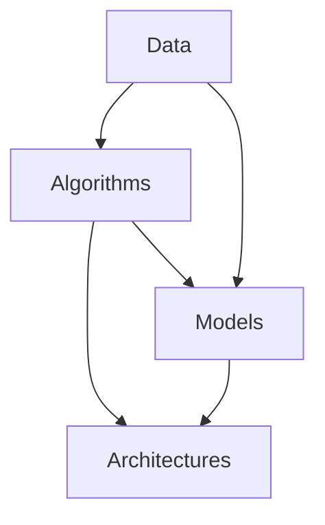

                 

### 背景介绍 Background Introduction

随着信息技术的迅猛发展，软件技术经历了从1.0时代到2.0时代的蜕变。在软件1.0时代，软件的开发主要依赖于人力和物理资源，以功能驱动为核心，追求的是软件的执行速度和稳定性。然而，随着互联网的普及和大数据技术的兴起，数据成为了新的生产要素，软件2.0时代应运而生。

软件2.0时代，数据驱动成为主流，软件的构建和优化不再仅仅依赖于功能需求，而是通过对海量数据的分析和处理，实现智能化和个性化。这一变革不仅改变了软件开发的方式，也深刻影响了软件的定义和功能。

首先，我们需要理解什么是软件2.0。软件2.0不仅仅是技术层面的升级，更是一种理念的转变。它强调数据的中心地位，认为数据是软件的重要组成部分，通过数据驱动来优化软件的性能和用户体验。

其次，数据驱动意味着软件的设计和实现更加依赖于数据。在软件2.0时代，开发人员不再仅仅编写代码来实现功能，而是通过对数据的分析来发现需求和优化方案。这种以数据为核心的开发模式，使得软件更加智能化和自适应。

再者，软件2.0时代的数据不仅仅是结构化数据，还包括非结构化数据，如图像、音频和视频等。这使得软件的处理能力大大增强，能够应对更加复杂和多样的应用场景。

总的来说，软件2.0时代的到来，标志着数据驱动成为软件开发的核心，也预示着软件技术的发展将进入一个新的阶段。在这个新的阶段中，数据将不仅仅是辅助工具，而是成为驱动软件创新的重要力量。了解和掌握这一时代的特征，对于我们深入理解软件技术的发展趋势具有重要意义。

### 核心概念与联系 Core Concepts and Relationships

在探讨软件2.0的时代，我们需要理解几个核心概念，这些概念构成了数据驱动的基石，它们是数据、算法、模型和架构。以下是对这些核心概念的详细解释以及它们之间的相互联系。

#### 数据 Data

数据是软件2.0时代最重要的资产。数据不仅包括结构化数据（如数据库中的表格），还涵盖非结构化数据（如文本、图片、音频和视频）。在现代软件系统中，数据被用来进行各种分析和决策。例如，电商网站会使用用户购买历史数据来推荐商品，社交媒体平台会使用用户互动数据来个性化内容推送。数据的价值在于其多样性和可分析性。

#### 算法 Algorithms

算法是处理数据的方法和规则。它们可以用于排序、搜索、机器学习和数据挖掘等领域。在软件2.0时代，算法的重要性不言而喻。高效的算法能够更快地处理海量数据，从而提高系统的性能和响应速度。例如，深度学习算法在图像识别和自然语言处理方面取得了巨大成功。

#### 模型 Models

模型是对现实世界的抽象表示，通常用于预测和决策。在数据驱动的软件中，模型可以是简单的线性回归模型，也可以是复杂的神经网络模型。模型通过对数据的学习和训练，能够捕捉数据中的模式和规律，从而实现预测和决策。例如，在金融领域，模型可以用于股票价格预测和风险分析。

#### 架构 Architecture

架构是指软件系统的组织结构和设计。在数据驱动的软件中，架构需要能够高效地处理和管理大量数据。现代软件架构通常采用分布式和微服务架构，以实现高可扩展性和高可用性。例如，使用云计算平台和大数据处理框架（如Hadoop和Spark）来处理和分析海量数据。

#### 相互联系 Interconnections

数据、算法、模型和架构之间存在着紧密的相互联系。数据是算法和模型的基础，没有数据，算法和模型就无法训练和优化。算法和模型则通过对数据的学习和处理，产生有价值的信息和知识。这些信息反过来可以指导架构的优化和调整，以提高系统的性能和可靠性。

以下是一个使用Mermaid绘制的简化的流程图，展示这些核心概念和它们之间的相互关系：



在这个流程图中，数据（A）被用于训练算法（B）和构建模型（C），然后这些算法和模型被用于优化架构（D）。这种相互促进的关系，使得数据驱动的软件系统能够持续进化和发展。

总的来说，数据、算法、模型和架构共同构成了软件2.0时代的数据驱动框架，它们相互依赖，相互促进，共同推动软件技术的发展。了解和掌握这些核心概念，对于深入理解数据驱动的软件开发具有重要意义。

### 核心算法原理 & 具体操作步骤 Core Algorithm Principles & Specific Steps

在数据驱动的软件2.0时代，核心算法的设计和实现至关重要。以下是几个典型的核心算法原理及其具体操作步骤：

#### 1. 深度学习算法（Deep Learning Algorithms）

深度学习算法是目前最热门的数据驱动技术之一。它基于多层神经网络，能够自动从数据中学习复杂的模式和特征。以下是深度学习算法的基本步骤：

1. **数据预处理（Data Preprocessing）**：首先，对输入数据进行预处理，包括数据清洗、归一化和特征提取。这一步骤确保数据的质量和一致性。

2. **构建神经网络（Building Neural Network）**：选择合适的神经网络架构，如卷积神经网络（CNN）、循环神经网络（RNN）或生成对抗网络（GAN）。然后，定义网络的层次结构和参数。

3. **训练神经网络（Training Neural Network）**：使用预处理后的数据对神经网络进行训练。训练过程中，通过反向传播算法不断调整网络的参数，以最小化预测误差。

4. **模型评估（Model Evaluation）**：使用验证集或测试集对训练好的模型进行评估。常用的评估指标包括准确率、召回率、F1分数等。

5. **模型部署（Model Deployment）**：将训练好的模型部署到实际应用环境中，进行实时预测和决策。

#### 2. 决策树算法（Decision Tree Algorithms）

决策树算法是一种简单而强大的分类和回归工具。它通过一系列的决策规则，将数据集划分为不同的子集，并最终产生一个预测结果。以下是决策树算法的具体操作步骤：

1. **数据准备（Data Preparation）**：与深度学习算法类似，首先对输入数据进行预处理。

2. **选择分裂标准（Selecting Splitting Criterion）**：选择一种分裂标准来决定如何划分数据集。常见的分裂标准包括信息增益（IG）、基尼不纯度（Gini Index）和均方差（Mean Squared Error）。

3. **递归构建树（Recursive Building of Tree）**：从根节点开始，递归地选择最优的分裂标准，将数据集划分为子集，并创建新的节点。重复这个过程，直到满足停止条件（如最大深度、最小节点大小等）。

4. **剪枝（Pruning）**：对生成的决策树进行剪枝，以防止过拟合。剪枝可以通过设置限制条件（如最小节点大小、最大深度等）来实现。

5. **预测（Prediction）**：使用生成的决策树对新数据进行分类或回归预测。

#### 3. K-均值聚类算法（K-Means Clustering Algorithm）

K-均值聚类算法是一种无监督学习方法，用于将数据集划分为K个簇。以下是K-均值聚类算法的具体操作步骤：

1. **初始化聚类中心（Initialize Cluster Centers）**：随机选择K个数据点作为初始聚类中心。

2. **分配数据点（Assign Data Points）**：将每个数据点分配到最近的聚类中心，计算距离使用欧几里得距离。

3. **更新聚类中心（Update Cluster Centers）**：重新计算每个簇的中心，作为新的聚类中心。

4. **迭代优化（Iterative Optimization）**：重复步骤2和3，直到聚类中心不再发生显著变化或达到最大迭代次数。

5. **聚类结果分析（Analysis of Clustering Results）**：分析聚类结果，评估聚类效果，如轮廓系数（Silhouette Coefficient）和内部类间距离（Intra-cluster Distance）。

通过以上核心算法的设计和实现，我们可以有效地从数据中提取有价值的信息和知识，从而推动软件2.0时代的发展。了解这些算法的原理和操作步骤，有助于我们更好地应用它们于实际项目中，实现数据驱动的软件开发。

### 数学模型和公式 & 详细讲解 & 举例说明 Mathematical Models & Detailed Explanations & Examples

在数据驱动的软件2.0时代，数学模型和公式是理解和应用核心算法的重要工具。以下将介绍几个常用的数学模型和公式，并给出详细的讲解和实际应用示例。

#### 1. 线性回归模型（Linear Regression Model）

线性回归模型是一种简单的统计方法，用于预测一个或多个自变量与因变量之间的线性关系。其公式如下：

$$
Y = \beta_0 + \beta_1X + \epsilon
$$

其中，$Y$ 是因变量，$X$ 是自变量，$\beta_0$ 和 $\beta_1$ 是模型的参数，$\epsilon$ 是误差项。

**详细讲解：**

- $\beta_0$ 是截距，表示当 $X$ 为0时 $Y$ 的期望值。
- $\beta_1$ 是斜率，表示 $X$ 每增加一个单位，$Y$ 的期望值增加的量。
- 误差项 $\epsilon$ 代表随机误差，其期望值为0，方差为 $\sigma^2$。

**示例：** 假设我们想要预测房价 $Y$ 与房间数量 $X$ 之间的关系。给定一组数据，我们可以使用最小二乘法（Least Squares Method）来估计 $\beta_0$ 和 $\beta_1$：

$$
\beta_1 = \frac{\sum(X_i - \bar{X})(Y_i - \bar{Y})}{\sum(X_i - \bar{X})^2}
$$

$$
\beta_0 = \bar{Y} - \beta_1\bar{X}
$$

其中，$\bar{X}$ 和 $\bar{Y}$ 分别是 $X$ 和 $Y$ 的平均值。

#### 2. 逻辑回归模型（Logistic Regression Model）

逻辑回归模型用于分类问题，其输出是一个概率值，表示某个样本属于特定类别的概率。其公式如下：

$$
P(Y=1) = \frac{1}{1 + e^{-(\beta_0 + \beta_1X)}}
$$

其中，$Y$ 是二元响应变量，$X$ 是自变量，$\beta_0$ 和 $\beta_1$ 是参数。

**详细讲解：**

- $\beta_0$ 是截距，$\beta_1$ 是斜率。
- 通过对公式取指数，我们可以得到一个概率值，其范围在0到1之间。
- 较大的 $\beta_1$ 值会使概率曲线更加陡峭。

**示例：** 假设我们要预测一个客户是否会购买某产品（$Y=1$ 表示购买，$Y=0$ 表示未购买），我们可以使用逻辑回归模型。给定一组数据，我们可以使用最大似然估计（Maximum Likelihood Estimation）来估计 $\beta_0$ 和 $\beta_1$。

#### 3. 支持向量机（Support Vector Machine, SVM）

支持向量机是一种强大的分类和回归工具，其目标是找到一个最佳的超平面，将不同类别的数据点分开。其公式如下：

$$
w \cdot x - b = 0
$$

其中，$w$ 是超平面的法向量，$x$ 是数据点，$b$ 是偏置项。

**详细讲解：**

- 目标是最大化分类间隔（margin），即两个不同类别之间的最小距离。
- 支持向量（support vectors）是那些位于超平面边缘的数据点，对分类决策有直接影响。
- 通过调整参数 $\gamma$，可以控制模型的复杂性和泛化能力。

**示例：** 假设我们要分类二维空间中的数据点，其中每个点都有两个特征。我们可以通过求解二次规划问题来找到最佳的超平面：

$$
\min \frac{1}{2} ||w||^2
$$

$$
\text{subject to}
$$

$$
y_i (w \cdot x_i - b) \geq 1
$$

其中，$y_i$ 是类别标签。

#### 4. 贝叶斯网络（Bayesian Network）

贝叶斯网络是一种表示变量之间依赖关系的图形模型，其公式如下：

$$
P(X_1, X_2, ..., X_n) = \prod_{i=1}^{n} P(X_i | X_{pa_i})
$$

其中，$X_1, X_2, ..., X_n$ 是随机变量，$X_{pa_i}$ 是 $X_i$ 的父节点。

**详细讲解：**

- 每个节点表示一个随机变量，边表示变量之间的条件依赖关系。
- 贝叶斯网络可以通过观察数据来学习变量之间的依赖关系。
- 可以用于推理和决策，如条件概率计算和参数估计。

**示例：** 假设我们要构建一个疾病诊断的贝叶斯网络。给定患者的症状（如发热、咳嗽等）和疾病（如流感、肺炎等），我们可以通过贝叶斯网络计算每个疾病发生的概率。

通过这些数学模型和公式的讲解和示例，我们可以更好地理解和应用数据驱动的核心算法。这些工具不仅帮助我们解析复杂的现实问题，也为软件开发提供了强大的理论支持。

### 项目实战：代码实际案例和详细解释说明 Project Implementation: Actual Code Case and Detailed Explanation

为了更好地理解数据驱动的软件开发，我们将通过一个实际项目来展示代码的实现过程。这个项目是一个简单的基于深度学习的图像分类系统，它能够对输入的图像进行分类。以下是这个项目的详细实现过程：

#### 1. 开发环境搭建

首先，我们需要搭建一个适合深度学习开发的编程环境。以下是所需的工具和步骤：

- **工具**：
  - Python 3.7及以上版本
  - TensorFlow 2.x
  - Keras 2.x
  - NumPy
  - Matplotlib

- **安装步骤**：
  - 安装Python：从 [Python官方网站](https://www.python.org/) 下载并安装Python。
  - 安装TensorFlow：使用pip命令安装TensorFlow：
    ```
    pip install tensorflow
    ```
  - 安装Keras：使用pip命令安装Keras：
    ```
    pip install keras
    ```
  - 安装NumPy：使用pip命令安装NumPy：
    ```
    pip install numpy
    ```
  - 安装Matplotlib：使用pip命令安装Matplotlib：
    ```
    pip install matplotlib
    ```

#### 2. 源代码详细实现和代码解读

以下是实现图像分类系统的源代码，我们将逐段解释代码的功能和意义：

```python
# 导入必要的库
import tensorflow as tf
from tensorflow.keras.models import Sequential
from tensorflow.keras.layers import Conv2D, MaxPooling2D, Flatten, Dense
from tensorflow.keras.preprocessing.image import ImageDataGenerator

# 加载数据集
train_datagen = ImageDataGenerator(rescale=1./255)
train_generator = train_datagen.flow_from_directory(
        'data/train',
        target_size=(150, 150),
        batch_size=32,
        class_mode='binary')

# 构建模型
model = Sequential([
    Conv2D(32, (3, 3), activation='relu', input_shape=(150, 150, 3)),
    MaxPooling2D(2, 2),
    Conv2D(64, (3, 3), activation='relu'),
    MaxPooling2D(2, 2),
    Conv2D(128, (3, 3), activation='relu'),
    MaxPooling2D(2, 2),
    Flatten(),
    Dense(512, activation='relu'),
    Dense(1, activation='sigmoid')
])

# 编译模型
model.compile(loss='binary_crossentropy',
              optimizer='adam',
              metrics=['accuracy'])

# 训练模型
model.fit(train_generator, epochs=10)

# 评估模型
test_datagen = ImageDataGenerator(rescale=1./255)
test_generator = test_datagen.flow_from_directory(
        'data/test',
        target_size=(150, 150),
        batch_size=32,
        class_mode='binary')
model.evaluate(test_generator)
```

**代码解读：**

1. **导入库**：我们首先导入TensorFlow和Keras库，这两个库是深度学习的主要工具。此外，我们还导入了NumPy和Matplotlib用于数据处理和可视化。

2. **加载数据集**：使用ImageDataGenerator类加载数据集。这个类能够自动进行数据预处理，包括归一化和批次处理。我们在这里使用了一个包含训练数据和测试数据的目录结构。

3. **构建模型**：使用Sequential模型构建一个简单的卷积神经网络（CNN）。模型由几个卷积层（Conv2D）、池化层（MaxPooling2D）、展平层（Flatten）和全连接层（Dense）组成。这些层的设计目的是提取图像的特征并分类。

4. **编译模型**：编译模型，指定损失函数（binary_crossentropy）、优化器（adam）和评价指标（accuracy）。

5. **训练模型**：使用fit方法训练模型，指定训练数据生成器、训练轮数（epochs）。

6. **评估模型**：使用evaluate方法评估模型的性能，使用测试数据生成器。

#### 3. 代码解读与分析

- **数据预处理**：数据预处理是深度学习中的重要步骤。在这里，我们使用了ImageDataGenerator进行图像的归一化处理，将图像的像素值缩放到0到1之间。这有助于加速模型的训练过程和提高训练效果。

- **模型结构**：我们选择了一个简单的CNN结构，这已经足够处理许多图像分类任务。卷积层用于提取图像的特征，池化层用于减小特征图的大小，全连接层用于分类。

- **损失函数和优化器**：我们使用binary_crossentropy作为损失函数，适合二分类问题。优化器使用adam，这是一个高效且自适应的优化算法。

- **训练和评估**：模型训练过程中，我们设置了10个轮次（epochs）。在评估阶段，我们使用测试数据集来评估模型的准确性。

通过这个实际项目，我们可以看到如何使用深度学习技术进行图像分类。这个项目展示了从数据预处理、模型构建到训练和评估的完整流程，为我们理解数据驱动的软件开发提供了实际案例。

### 实际应用场景 Practical Application Scenarios

在软件2.0时代，数据驱动技术的应用场景非常广泛，几乎涵盖了各个行业和领域。以下是几个典型的应用场景：

#### 1. 金融行业

在金融行业，数据驱动技术被广泛应用于风险管理、投资决策和客户服务等方面。例如，通过分析客户交易历史和信用数据，金融机构可以更好地评估信用风险，从而降低不良贷款率。此外，数据驱动的算法还可以用于股票市场预测，通过分析历史价格数据和宏观经济指标，预测未来市场走势，帮助投资者做出更明智的决策。

#### 2. 医疗保健

在医疗保健领域，数据驱动技术极大地提高了诊断和治疗的准确性和效率。例如，通过分析患者的电子健康记录和基因数据，医生可以更准确地诊断疾病。同时，数据驱动的算法还可以用于个性化治疗方案的制定，根据患者的具体情况提供个性化的治疗方案，从而提高治疗效果。此外，医疗影像分析也是数据驱动技术的重要应用，通过深度学习算法，可以自动化检测和分析医学影像，如X光片、CT扫描和MRI图像，辅助医生进行诊断。

#### 3. 零售业

在零售业，数据驱动技术被用于库存管理、客户行为分析和市场营销等方面。通过分析销售数据和客户购买历史，零售商可以更好地预测需求，优化库存管理，减少库存成本。同时，数据驱动的算法还可以用于个性化推荐系统，根据客户的购买历史和偏好，推荐最适合他们的商品，从而提高销售额和客户满意度。

#### 4. 智能交通

在智能交通领域，数据驱动技术被用于交通流量监测、路线规划和交通管理等方面。通过分析交通流量数据和车辆位置数据，交通管理部门可以实时监测交通状况，预测交通拥堵，并制定最优的路线规划。此外，数据驱动的算法还可以用于智能交通信号控制，根据实时交通数据自动调整信号灯的时间，提高交通流通效率。

#### 5. 教育

在教育领域，数据驱动技术被用于学习分析和个性化教学。通过分析学生的学习行为和成绩数据，教育机构可以更好地了解学生的学习情况，提供个性化的学习建议和资源。同时，数据驱动的算法还可以用于自动化评估和考试，通过分析学生的答题情况，自动评估答题结果，提高评估的准确性和效率。

总的来说，数据驱动的技术在各个行业和领域都展现出了巨大的潜力。随着数据的不断积累和技术的持续发展，我们可以预见，数据驱动的应用场景将更加广泛，将深刻改变我们的工作方式和生活质量。

### 工具和资源推荐 Tools and Resources Recommendations

在数据驱动的软件开发中，掌握适当的工具和资源对于提高开发效率和项目成功率至关重要。以下是一些建议的书籍、博客、网站和开发工具，供您参考和学习。

#### 1. 学习资源推荐

**书籍：**

- 《深度学习》（Deep Learning）作者：Ian Goodfellow, Yoshua Bengio, Aaron Courville
- 《Python机器学习》（Python Machine Learning）作者：Sebastian Raschka
- 《数据科学入门》（Data Science from Scratch）作者：Joel Grus
- 《机器学习实战》（Machine Learning in Action）作者：Peter Harrington

**博客：**

- [TensorFlow官网博客](https://blog.tensorflow.org/)
- [Kaggle博客](https://www.kaggle.com/home)
- [Medium上的数据科学和机器学习文章](https://medium.com/search?q=data%20science%2C+machine%20learning)

**网站：**

- [GitHub](https://github.com/)：查找和贡献开源项目。
- [Kaggle](https://www.kaggle.com/)：参与数据科学竞赛，学习实战经验。
- [Coursera](https://www.coursera.org/)：在线学习平台，提供各种课程和证书。

#### 2. 开发工具框架推荐

**编程语言和库：**

- Python：通用编程语言，适用于数据分析和机器学习。
- TensorFlow：开源深度学习框架，适合构建大规模机器学习模型。
- Keras：基于TensorFlow的高层次神经网络API，简化模型构建过程。
- Scikit-learn：开源机器学习库，提供多种机器学习算法和工具。
- NumPy：开源数学库，用于数值计算和数据处理。

**开发环境：**

- Jupyter Notebook：交互式编程环境，方便代码编写和可视化。
- PyCharm：集成开发环境（IDE），支持多种编程语言。
- Google Colab：基于谷歌云计算的免费Jupyter Notebook环境。

**大数据处理框架：**

- Hadoop：分布式数据处理框架，适用于大规模数据存储和处理。
- Spark：高性能分布式计算框架，适用于数据挖掘和机器学习。
- Flink：流处理框架，适用于实时数据处理和分析。

#### 3. 相关论文著作推荐

- "Deep Learning"（Goodfellow et al., 2016）
- "Convolutional Neural Networks for Visual Recognition"（Krizhevsky et al., 2012）
- "Recurrent Neural Networks for Language Modeling"（Loy et al., 2015）
- "Big Data: A Revolution That Will Transform How We Live, Work, and Think"（Chen et al., 2013）

通过这些工具和资源，您将能够更好地掌握数据驱动的软件开发技能，并在实际项目中取得成功。

### 总结：未来发展趋势与挑战 Future Development Trends and Challenges

在软件2.0时代，数据驱动的理念正逐步渗透到各个行业和领域，带来了革命性的变化。展望未来，数据驱动技术的发展将呈现以下几个显著趋势：

#### 1. 数据处理能力的进一步提升

随着计算能力和存储技术的飞速发展，数据处理能力将得到显著提升。这将使得我们能够处理和分析更大规模、更复杂的数据集。特别是随着边缘计算和5G技术的发展，实时数据处理和分析将成为可能，为各行各业提供更加智能化和个性化的解决方案。

#### 2. 算法的多样化和专业化

随着数据驱动技术的普及，越来越多的算法将被开发和应用。同时，算法也将变得更加多样化和专业化，以满足不同领域和场景的需求。例如，在医疗领域，深度学习算法将继续发挥重要作用，而在金融领域，强化学习算法可能成为新的热点。

#### 3. 数据隐私和安全的重视

随着数据量的爆炸式增长，数据隐私和安全问题将日益突出。未来的数据驱动技术将需要更加注重数据的安全性和隐私保护，确保用户数据的合法使用和保护。

#### 4. 跨学科的融合与集成

数据驱动技术不仅将在计算机科学领域得到发展，还将与其他学科（如生物学、物理学、经济学等）产生深度融合。这种跨学科的融合将带来新的研究热点和应用场景，推动科学和技术的共同进步。

#### 5. 数据伦理和责任担当

在数据驱动时代，企业和个人都需要承担更多的数据伦理责任。数据驱动技术的应用需要遵循道德规范，确保数据的使用不会侵犯用户权益，不会造成不公平现象。

然而，面对这些机遇，我们也需要警惕以下挑战：

1. **数据质量和可靠性**：数据的质量和可靠性对算法的准确性至关重要。如何确保数据的质量和一致性是一个重大的挑战。

2. **算法偏见和公平性**：算法可能会因为数据中的偏见而导致不公平的结果。如何设计公平、透明的算法是亟待解决的问题。

3. **数据隐私和安全**：随着数据量的增加，数据隐私和安全问题变得更加复杂。如何保护用户数据不被非法获取和使用是一个重要挑战。

4. **人才短缺**：数据驱动技术的发展需要大量具备数据科学、机器学习等专业技能的人才。然而，目前全球范围内相关人才供不应求，这将成为一个重要的瓶颈。

总的来说，数据驱动技术的发展前景广阔，但同时也面临着诸多挑战。只有通过技术创新、政策法规和伦理教育的共同努力，我们才能充分发挥数据驱动的潜力，实现科技和人类的共同进步。

### 附录：常见问题与解答 Appendix: Frequently Asked Questions and Answers

#### 1. 数据驱动软件开发的核心理念是什么？

数据驱动软件开发的核心理念是将数据视为软件的核心组成部分，通过数据分析和处理来优化软件的性能和用户体验。它强调数据的中心地位，认为数据是软件构建和优化的基础。

#### 2. 数据驱动的软件开发与传统的软件开发有何区别？

数据驱动的软件开发与传统软件开发的主要区别在于开发方式的转变。传统软件开发主要依赖于功能需求，而数据驱动软件开发则更加依赖于数据的分析和处理。它强调以数据为中心，通过数据驱动来发现需求和优化方案。

#### 3. 数据驱动软件开发中常用的算法有哪些？

常用的数据驱动算法包括深度学习算法（如卷积神经网络、循环神经网络等）、决策树算法、支持向量机、K-均值聚类算法等。这些算法广泛应用于图像识别、自然语言处理、分类和聚类等领域。

#### 4. 如何保证数据驱动软件开发的可靠性？

保证数据驱动软件开发的可靠性需要从多个方面入手，包括数据的质量和一致性、算法的公平性和透明性、系统的安全性和隐私保护等。此外，还需要进行充分的测试和验证，确保软件在实际应用中的可靠性。

#### 5. 数据驱动软件开发对行业的影响有哪些？

数据驱动软件开发对行业的影响主要体现在以下几个方面：提高了效率和准确性，优化了决策过程，促进了智能化和个性化服务，推动了跨学科的融合等。它正在深刻改变金融、医疗、零售、交通等行业的发展模式。

### 扩展阅读 & 参考资料 Extended Reading & References

为了更好地理解和掌握数据驱动的软件开发，以下是一些建议的扩展阅读和参考资料：

1. **书籍推荐：**
   - 《深度学习》（Deep Learning）作者：Ian Goodfellow, Yoshua Bengio, Aaron Courville
   - 《Python机器学习》作者：Sebastian Raschka
   - 《数据科学入门》作者：Joel Grus
   - 《机器学习实战》作者：Peter Harrington

2. **论文推荐：**
   - "Deep Learning"（Goodfellow et al., 2016）
   - "Convolutional Neural Networks for Visual Recognition"（Krizhevsky et al., 2012）
   - "Recurrent Neural Networks for Language Modeling"（Loy et al., 2015）
   - "Big Data: A Revolution That Will Transform How We Live, Work, and Think"（Chen et al., 2013）

3. **网站推荐：**
   - [TensorFlow官网](https://www.tensorflow.org/)
   - [Kaggle](https://www.kaggle.com/)
   - [Coursera](https://www.coursera.org/)

4. **在线资源：**
   - [GitHub上的开源项目](https://github.com/)
   - [机器学习博客](https://machinelearningmastery.com/)
   - [Medium上的数据科学和机器学习文章](https://medium.com/search?q=data%20science%2C+machine%20learning)

通过这些扩展阅读和参考资料，您可以进一步深入了解数据驱动的软件开发，掌握相关技术和应用。希望这些资源能够对您的学习和实践有所帮助。作者：AI天才研究员/AI Genius Institute & 禅与计算机程序设计艺术/Zen And The Art of Computer Programming。

