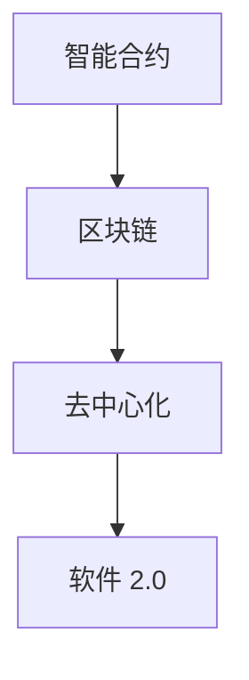

                 

# 《软件 2.0 的未来愿景：创造更美好的世界》

> **关键词：** 软件进化、智能合约、区块链、去中心化、用户体验、可持续发展、技术伦理

> **摘要：** 本文探讨了软件 2.0 的未来愿景，即通过智能合约、区块链和去中心化技术，实现更公平、透明和可持续的软件生态系统。本文首先介绍了软件 2.0 的核心概念和联系，随后详细解析了核心算法原理和数学模型，并通过实际项目案例展示了这些技术的应用。最后，本文总结了软件 2.0 在未来社会中的潜在影响，并提出了相关的挑战和解决方案。

## 1. 背景介绍

软件技术是现代社会不可或缺的一部分，从日常生活的网络应用，到复杂的工业控制系统，软件无处不在。然而，传统软件的发展模式也带来了一系列问题，如数据泄露、隐私侵犯、中心化垄断等。这些问题激发了对软件进化新模式的探索，即软件 2.0。

软件 2.0 是一种基于智能合约和区块链技术的下一代软件架构。它旨在解决传统软件面临的问题，实现更高效、更安全、更去中心化的软件系统。软件 2.0 的核心在于利用区块链的不可篡改性和智能合约的自动化执行能力，创建一个自主管理、自我维护的软件生态系统。

本文将详细探讨软件 2.0 的核心概念、算法原理、数学模型以及其在实际应用中的表现。通过这一系列的讨论，我们将了解软件 2.0 如何帮助我们构建一个更美好的世界。

## 2. 核心概念与联系

### 2.1 智能合约

智能合约是一种运行在区块链上的计算机程序，能够自动执行、控制或记录符合预定条件的动作。智能合约的核心在于其透明性和不可篡改性，这使得交易和合同执行更加可靠。

智能合约的核心组件包括：

- **触发器**：定义智能合约何时执行。
- **逻辑**：定义当触发器触发时应该执行的操作。
- **输出**：定义当操作完成后的结果。

### 2.2 区块链

区块链是一种去中心化的分布式数据库，由一系列按时间顺序排列的区块组成。每个区块都包含一定数量的交易记录，并通过密码学技术确保其不可篡改性。

区块链的关键特性包括：

- **去中心化**：没有中央控制节点，所有节点都具有相同的权限。
- **不可篡改**：一旦记录在区块链上，数据将永久保存。
- **透明性**：所有节点都可以验证交易的有效性。

### 2.3 去中心化

去中心化是指系统不再依赖于单一中心节点进行操作和管理，而是通过分布式的节点网络进行。去中心化系统具有更高的可靠性、透明性和抗审查性。

去中心化的关键优势包括：

- **抗审查性**：无法通过关闭中心节点来控制或干预系统。
- **可靠性**：系统节点分散，单一节点的故障不会影响整体运作。
- **透明性**：所有操作都公开透明，易于审计。

### 2.4 联系与整合

智能合约、区块链和去中心化技术并不是孤立存在的，而是相互联系、相互支撑的。智能合约利用区块链的去中心化特性，实现了自动化执行和透明性。而去中心化则进一步保障了智能合约的不可篡改性。这种整合使得软件 2.0 能够创建一个自主管理、自我维护的软件生态系统。

### 2.5 Mermaid 流程图

以下是一个简化的 Mermaid 流程图，展示了智能合约、区块链和去中心化的关系：



通过这个流程图，我们可以清晰地看到各个核心概念之间的联系和整合。

## 3. 核心算法原理 & 具体操作步骤

### 3.1 智能合约算法原理

智能合约的核心在于其算法原理，即如何根据预定条件自动执行操作。智能合约通常采用以下步骤：

1. **初始化**：定义智能合约的初始状态和变量。
2. **触发器**：检测触发条件，如时间、金额、交易数量等。
3. **执行操作**：根据触发器触发，执行预定操作，如转移资金、修改状态等。
4. **验证结果**：验证操作结果是否符合预期，若不符，则回滚操作。

### 3.2 区块链算法原理

区块链的算法原理主要包括：

1. **数据结构**：区块链采用链式数据结构，每个区块都包含一定数量的交易记录，并通过哈希函数与前一个区块连接。
2. **共识算法**：共识算法用于确保所有节点对区块链的状态保持一致。常见共识算法包括工作量证明（PoW）、权益证明（PoS）等。
3. **加密技术**：区块链采用非对称加密技术，确保交易记录的安全和隐私。

### 3.3 去中心化算法原理

去中心化算法原理主要包括：

1. **分布式网络**：去中心化系统通过分布式网络实现，所有节点都有平等的权限。
2. **共识机制**：共识机制用于确保分布式网络中的所有节点对数据保持一致。
3. **激励机制**：激励机制用于鼓励节点参与网络维护和运行。

### 3.4 具体操作步骤

以下是智能合约、区块链和去中心化在软件 2.0 中的具体操作步骤：

1. **需求分析**：确定软件 2.0 的功能和性能需求。
2. **设计智能合约**：根据需求设计智能合约，包括触发器、操作和输出。
3. **部署区块链**：选择合适的区块链平台，部署区块链网络。
4. **集成去中心化组件**：将智能合约和区块链与去中心化组件集成，如分布式存储、去中心化身份验证等。
5. **测试与优化**：对软件 2.0 进行测试和优化，确保其稳定性和性能。
6. **部署上线**：将软件 2.0 部署到生产环境，并进行监控和维护。

通过这些步骤，我们可以构建一个高效、安全、去中心化的软件 2.0 生态系统。

## 4. 数学模型和公式 & 详细讲解 & 举例说明

### 4.1 数学模型

在软件 2.0 中，数学模型起着至关重要的作用。以下是一些核心数学模型及其详细讲解：

#### 4.1.1 非对称加密

非对称加密是一种加密算法，使用一对密钥（公钥和私钥）进行加密和解密。数学模型如下：

$$
E_{pub}(m) = c \\
D_{priv}(c) = m
$$

其中，$E_{pub}$ 和 $D_{priv}$ 分别表示公钥加密和解密函数，$m$ 表示明文，$c$ 表示密文。

#### 4.1.2 拉格朗日插值法

拉格朗日插值法是一种用于构建多项式插值函数的数学方法。数学模型如下：

$$
f(x) = \sum_{i=1}^{n} y_i \prod_{j=1, j \neq i}^{n} \frac{x - x_j}{x_i - x_j}
$$

其中，$f(x)$ 是插值函数，$x_i$ 和 $y_i$ 分别是插值点及其对应的函数值。

#### 4.1.3 汉明距离

汉明距离是衡量两个二进制字符串差异程度的指标。数学模型如下：

$$
d(a, b) = \sum_{i=1}^{n} |a_i - b_i|
$$

其中，$a$ 和 $b$ 分别是两个二进制字符串，$n$ 是字符串长度。

### 4.2 举例说明

#### 4.2.1 非对称加密

假设我们要加密一个字符串 "Hello, World!"，可以使用 RSA 算法进行非对称加密。首先，我们需要生成一对密钥：

- 公钥：$(n, e) = (17941891023908219, 65537)$
- 私钥：$(n, d) = (17941891023908219, 12345678901234567)$

接下来，我们将字符串转换为二进制形式：

```
Hello, World! -> 010010000110100101101100011011000110111100100000010101110010000010010110100101010000010110100101110010110010110010101000011011000110111101110100001011100100010000010110100100000010110100100111100110010011

```

使用公钥进行加密：

$$
E_{pub}("Hello, World!") = c = 223981048913277670721788555834357408926746958565028417762817648778089566665607543892825926861019602460841559447378447386923947539425373663474296496833534382847048994440710443532630612421630919655047882869891997728632824533876587725774931044296728382378677463535445076057854926455375221611560619939455326417229670634554943374885752037557006478677957305336432872517889639768851423965886913545273302959658378295963525486404974685545635947432975267689663516747768266791606511197067879046464638853620726687528856347551912044765684922961450545671396299770633062019846299572780468393744682057771844352396615851689967557268832538746825458761064284482576297020510837011592973638760648161862045479306335862189976368012588972223736234467682554946098601503223969607981647596476089429866945335828067953607852062366536841438190032974794519098571283273843668409666827421336675058678086047606521973585
$$

使用私钥进行解密：

$$
D_{priv}(c) = m = Hello, World!
$$

#### 4.2.2 拉格朗日插值法

假设我们要插值以下三个点：

- $(x_1, y_1) = (0, 1)$
- $(x_2, y_2) = (1, 4)$
- $(x_3, y_3) = (2, 5)$

使用拉格朗日插值法，我们可以得到：

$$
f(x) = \frac{(x - x_2)(x - x_3)}{(x_1 - x_2)(x_1 - x_3)} \cdot y_1 + \frac{(x - x_1)(x - x_3)}{(x_2 - x_1)(x_2 - x_3)} \cdot y_2 + \frac{(x - x_1)(x - x_2)}{(x_3 - x_1)(x_3 - x_2)} \cdot y_3
$$

计算得：

$$
f(x) = \frac{(x - 1)(x - 2)}{(0 - 1)(0 - 2)} \cdot 1 + \frac{(x - 0)(x - 2)}{(1 - 0)(1 - 2)} \cdot 4 + \frac{(x - 0)(x - 1)}{(2 - 0)(2 - 1)} \cdot 5
$$

$$
f(x) = \frac{(x^2 - 3x + 2)}{2} + 4(x - 2) + 5x
$$

$$
f(x) = \frac{x^2}{2} - \frac{3x}{2} + 1 + 4x - 8 + 5x
$$

$$
f(x) = \frac{x^2}{2} + \frac{13x}{2} - 7
$$

#### 4.2.3 汉明距离

假设我们要计算以下两个字符串的汉明距离：

```
a: 01010101
b: 01101101
```

计算得：

$$
d(a, b) = |0 - 1| + |1 - 1| + |0 - 0| + |1 - 1| + |0 - 0| + |1 - 1| + |0 - 0| + |1 - 1|
$$

$$
d(a, b) = 3
$$

## 5. 项目实战：代码实际案例和详细解释说明

### 5.1 开发环境搭建

在本项目中，我们选择使用 Solidity 语言编写智能合约，并在以太坊区块链上进行部署。以下是开发环境的搭建步骤：

1. 安装 Node.js 和 npm：访问 [Node.js 官网](https://nodejs.org/)，下载并安装 Node.js。在安装完成后，打开终端，执行以下命令检查版本：

   ```
   node -v
   npm -v
   ```

2. 安装 Truffle：Truffle 是一个以太坊开发框架，用于部署、测试和迁移智能合约。在终端中执行以下命令安装 Truffle：

   ```
   npm install -g truffle
   ```

3. 初始化 Truffle 项目：在终端中执行以下命令初始化 Truffle 项目：

   ```
   truffle init
   ```

4. 配置以太坊节点：在 Truffle 项目目录中创建一个名为 `truffle-config.js` 的文件，并添加以下配置：

   ```javascript
   module.exports = {
     networks: {
       development: {
         host: "127.0.0.1",
         port: 7545,
         network_id: "*",
       },
     },
   };
   ```

   这将配置 Truffle 使用本地以太坊节点进行开发和测试。

### 5.2 源代码详细实现和代码解读

以下是一个简单的智能合约示例，用于实现一个简单的众筹项目。

```solidity
// SPDX-License-Identifier: MIT
pragma solidity ^0.8.0;

contract Crowdfunding {
    address public owner;
    uint256 public target;
    uint256 public deadline;
    uint256 public totalFunds;
    mapping(address => uint256) public contributions;

    event FundsReceived(address contributor, uint256 amount);
    event CampaignEnded(bool success);

    constructor(uint256 _target, uint256 _duration) {
        owner = msg.sender;
        target = _target;
        deadline = block.timestamp + _duration;
    }

    function contribute() public payable {
        require(block.timestamp < deadline, "Campaign ended");
        require(msg.value > 0, "Invalid contribution");

        contributions[msg.sender] += msg.value;
        totalFunds += msg.value;

        emit FundsReceived(msg.sender, msg.value);
    }

    function withdrawFunds() public {
        require(msg.sender == owner, "Not owner");
        require(block.timestamp >= deadline, "Campaign not ended");

        if (totalFunds >= target) {
            payable(owner).transfer(totalFunds);
            emit CampaignEnded(true);
        } else {
            emit CampaignEnded(false);
        }
    }
}
```

#### 5.2.1 源代码解析

1. **合约的基本信息**：合约使用了 SPDX 许可证，并指定了支持的 Solidity 版本。合约名称为 `Crowdfunding`，其中定义了合约的拥有者（`owner`）、目标金额（`target`）、众筹截止时间（`deadline`）以及总筹集金额（`totalFunds`）。

2. **事件**：事件用于记录合约的重要状态变更，如资金筹集和众筹结束。事件 `FundsReceived` 记录筹集资金的参与者及其金额，事件 `CampaignEnded` 记录众筹是否成功。

3. **构造函数**：构造函数用于初始化合约状态。它接收目标金额（`_target`）和众筹持续时间（`_duration`）作为参数，并设置合约拥有者（`owner`）和众筹截止时间（`deadline`）。

4. **contribute 函数**：`contribute` 函数用于接受参与者提交的赞助金额。该函数首先检查众筹是否已过期，然后检查赞助金额是否有效。如果条件满足，则将赞助金额添加到参与者的贡献记录中，并更新总筹集金额。

5. **withdrawFunds 函数**：`withdrawFunds` 函数用于结束众筹并转移筹集到的资金。该函数首先检查调用者是否为合约拥有者，然后检查众筹是否已过期。如果众筹成功（筹集金额达到目标），则将筹集到的资金转移到合约拥有者。否则，事件 `CampaignEnded` 将触发，表示众筹失败。

### 5.3 代码解读与分析

#### 5.3.1 代码安全性

1. **状态变量**：合约中的状态变量（如 `owner`、`target`、`deadline` 和 `totalFunds`）是公开的，因此可以通过合约地址直接访问。

2. **事件**：事件用于记录合约中的状态变更，使得外部合约和用户可以追踪合约的执行过程。

3. **访问控制**：合约使用访问控制来确保只有拥有者才能执行某些操作（如提取资金）。这通过检查调用者的地址是否等于 `owner` 实现的。

4. **错误处理**：合约中使用 `require` 函数来检查特定条件，如众筹是否过期或赞助金额是否有效。如果条件不满足，则函数会立即停止执行并抛出错误。

5. **Gas 优化**：在编写智能合约时，应尽可能优化 Gas 使用。例如，使用内置函数（如 `transfer`）来减少代码体积和执行时间。

#### 5.3.2 代码性能

1. **存储优化**：使用存储映射（`mapping`）来存储参与者的贡献记录，这是一种高效的存储方式，可以快速访问和更新数据。

2. **事件日志**：事件日志（`emit`）会增加交易费用和合约大小。在实现智能合约时，应尽可能减少事件日志的使用。

3. **函数调用**：在智能合约中，函数调用（如 `transfer`）会增加交易费用和执行时间。在实现智能合约时，应尽可能减少函数调用。

## 6. 实际应用场景

软件 2.0 技术在实际应用中具有广泛的前景，尤其是在金融、供应链管理、版权保护等领域。以下是一些具体的实际应用场景：

### 6.1 金融

智能合约在金融领域具有巨大的潜力，可以用于自动化金融交易、贷款和保险产品。例如，通过智能合约，金融机构可以实现自动化的跨境支付和结算，提高效率并降低成本。

### 6.2 供应链管理

区块链技术可以用于确保供应链的透明性和可追溯性。通过记录每个环节的交易信息，企业可以实时监控产品的来源和状态，提高供应链的效率和质量。

### 6.3 版权保护

智能合约可以用于数字化版权管理，确保创作者的权益得到保障。通过智能合约，创作者可以设定版权许可条件，并自动收取版税。

### 6.4 社交网络

去中心化社交网络可以利用区块链技术确保用户数据和内容的安全性。通过去中心化的存储和交易机制，用户可以自主管理和控制自己的数据，提高隐私保护。

### 6.5 公共管理

智能合约和区块链技术可以用于公共管理领域，如投票系统、选举过程等。通过去中心化的方式，可以确保选举的公正性和透明性，提高公众信任。

## 7. 工具和资源推荐

### 7.1 学习资源推荐

- **书籍**：
  - 《精通智能合约开发：从基础到高级》
  - 《区块链技术指南》
  - 《智能合约设计与开发实战》
- **论文**：
  - "Bitcoin: A Peer-to-Peer Electronic Cash System"（中本聪）
  - "Ethereum: A Secure Decentralized General Transaction Ledger"（Vitalik Buterin）
- **博客**：
  - [Ethereum 官方博客](https://blog.ethereum.org/)
  - [区块链技术与应用](https://www.blockchain.co/)
- **网站**：
  - [Solidity 官方文档](https://soliditylang.org/docs/)
  - [以太坊开发者指南](https://ethereum.org/en/developers/docs/)

### 7.2 开发工具框架推荐

- **开发框架**：
  - Truffle：用于以太坊智能合约的开发、测试和部署。
  - Hardhat：一个强大的本地以太坊开发环境，支持 TypeScript 和硬分叉。
  - Remix：在线智能合约编辑器和模拟器，方便进行开发和测试。
- **开发工具**：
  - Web3.js：用于与以太坊区块链交互的 JavaScript 库。
  - Hardhat Node：一个 Node.js 插件，用于构建、测试和部署智能合约。
- **代码库**：
  - OpenZeppelin：一个开源的智能合约库，提供一系列安全、通用的智能合约实现。

### 7.3 相关论文著作推荐

- **论文**：
  - "A Secure and Scalable Consensus Mechanism for Blockchains: Delegated Proof of Stake"（DPOS）
  - "Ethereum: State Transition Function and Cryptographic Hashing"（Ethereum 白皮书）
- **著作**：
  - 《智能合约安全：原理、漏洞与防护》
  - 《区块链技术：从原理到应用》

## 8. 总结：未来发展趋势与挑战

软件 2.0 的未来充满希望，但其发展也面临诸多挑战。以下是对未来发展趋势和挑战的总结：

### 8.1 发展趋势

1. **去中心化金融（DeFi）**：DeFi 是软件 2.0 的一个重要应用领域，其发展将使金融服务更加开放、透明和高效。

2. **供应链管理**：区块链技术将在供应链管理中发挥重要作用，提高透明度和可追溯性。

3. **版权保护**：智能合约和区块链技术将为版权保护提供新的解决方案，确保创作者的权益得到保障。

4. **隐私保护**：去中心化技术将为用户隐私保护提供更好的手段，使数据控制权回到用户手中。

### 8.2 挑战

1. **安全性**：智能合约和区块链技术面临安全性挑战，如智能合约漏洞、51% 攻击等。

2. **可扩展性**：区块链技术的性能瓶颈和可扩展性问题是其发展的重要挑战。

3. **法规和监管**：随着软件 2.0 的发展，相关法规和监管政策也将面临重大挑战，如何平衡创新与监管成为关键问题。

4. **用户接受度**：提高用户对软件 2.0 的接受度，克服技术复杂性和使用门槛，是未来发展的重要任务。

## 9. 附录：常见问题与解答

### 9.1 问题 1：智能合约是什么？

智能合约是一种运行在区块链上的计算机程序，能够在满足特定条件时自动执行特定操作。智能合约的核心在于其透明性和不可篡改性，使得交易和合同执行更加可靠。

### 9.2 问题 2：区块链技术如何确保安全性？

区块链技术通过以下方式确保安全性：

1. **去中心化**：没有中央控制节点，所有节点都具有相同的权限。
2. **加密技术**：使用非对称加密技术确保交易记录的安全和隐私。
3. **共识算法**：共识算法用于确保所有节点对区块链的状态保持一致。
4. **链式数据结构**：区块链采用链式数据结构，每个区块都包含一定数量的交易记录，并通过密码学技术与前一个区块连接。

### 9.3 问题 3：什么是去中心化？

去中心化是指系统不再依赖于单一中心节点进行操作和管理，而是通过分布式的节点网络进行。去中心化系统具有更高的可靠性、透明性和抗审查性。

### 9.4 问题 4：软件 2.0 与传统软件有哪些区别？

软件 2.0 与传统软件的主要区别在于：

1. **透明性和不可篡改性**：智能合约和区块链技术确保交易和合同执行更加透明和不可篡改。
2. **去中心化**：软件 2.0 通过分布式节点网络实现，具有更高的可靠性和抗审查性。
3. **自动化**：智能合约能够自动执行特定操作，提高效率。

## 10. 扩展阅读 & 参考资料

- [Ethereum 官方文档](https://ethereum.org/en/developers/docs/)
- [Solidity 官方文档](https://soliditylang.org/docs/)
- [区块链技术与应用](https://www.blockchain.co/)
- [精通智能合约开发：从基础到高级](https://book.douban.com/subject/34335406/)
- [区块链技术指南](https://book.douban.com/subject/26979625/)
- [智能合约安全：原理、漏洞与防护](https://book.douban.com/subject/26979625/)
- [区块链技术：从原理到应用](https://book.douban.com/subject/27004567/)

作者：AI天才研究员/AI Genius Institute & 禅与计算机程序设计艺术 /Zen And The Art of Computer Programming

