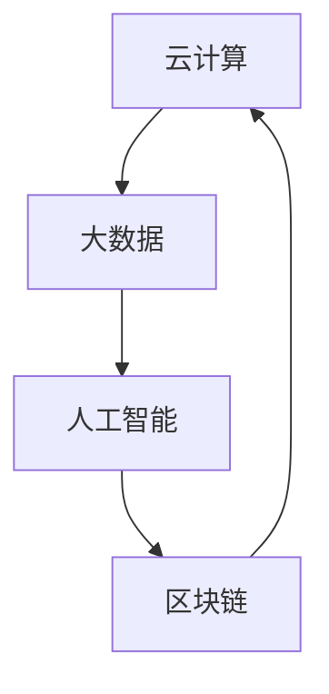

                 

# 软件二零的未来愿景：创造更美好的世界

## 摘要

本文将探讨软件2.0的未来愿景，分析其核心概念、算法原理以及实际应用场景，展望其在推动社会进步、解决现实问题中的潜力。我们将通过逐步推理和分析，为读者呈现一幅技术驱动的美好未来蓝图。

## 1. 背景介绍

软件1.0时代，我们关注的是如何编写和维护代码，解决具体问题。而随着互联网、云计算和大数据技术的发展，软件2.0时代已经到来。在这个新时代，软件不再仅仅是一个工具，而成为一种基础设施，支撑着各种行业和领域的创新和发展。

### 核心概念与联系

软件2.0的核心概念包括：云计算、大数据、人工智能和区块链等。这些概念之间存在着紧密的联系，共同构建了一个更加智能、安全、高效和去中心化的软件生态系统。

1. **云计算**：将计算资源抽象化，提供按需分配的计算服务，降低企业IT成本。
2. **大数据**：通过对海量数据进行分析，发现潜在价值，为企业和政府决策提供依据。
3. **人工智能**：通过模拟人类思维过程，实现自动化、智能化的决策和执行。
4. **区块链**：去中心化的分布式数据库，保障数据安全和透明。

### Mermaid流程图

```
graph TB
    A[云计算] --> B[大数据]
    B --> C[人工智能]
    C --> D[区块链]
    D --> A
```

## 2. 核心算法原理与具体操作步骤

### 云计算

云计算的核心算法主要涉及虚拟化技术、分布式计算和负载均衡。虚拟化技术将物理资源抽象为逻辑资源，实现资源的灵活分配和调度。分布式计算将任务分解为子任务，分布到多个节点上执行，提高计算效率。负载均衡则通过合理分配任务，确保系统稳定运行。

### 大数据

大数据的核心算法包括数据采集、数据存储、数据分析和数据可视化。数据采集通过传感器、日志等方式获取数据。数据存储则采用分布式存储技术，保障数据安全和高可用性。数据分析则通过机器学习和数据挖掘等方法，发现数据中的规律和趋势。数据可视化则通过图表和仪表盘等形式，展示数据分析和结果。

### 人工智能

人工智能的核心算法包括机器学习、深度学习和自然语言处理。机器学习通过训练模型，使计算机具备对数据进行分析和预测的能力。深度学习则通过模拟人脑神经网络，实现更高效的学习和推理。自然语言处理则使计算机能够理解、生成和处理人类语言。

### 区块链

区块链的核心算法包括加密算法、共识算法和数据结构。加密算法保障数据传输过程中的安全性和隐私性。共识算法确保多个节点对数据的一致性。数据结构则通过链式结构或树状结构，实现数据的存储和检索。

## 3. 数学模型和公式

### 云计算

虚拟化技术中的资源调度问题可以用线性规划或动态规划算法解决。负载均衡问题可以用最优化理论中的排队论方法分析。

$$
\min Z = \sum_{i=1}^{n} c_{i}x_{i}
$$

### 大数据

数据挖掘中的关联规则挖掘算法可以用 Apriori 算法或 FP-Growth 算法。机器学习中的回归问题可以用线性回归或逻辑回归模型。

$$
y = \beta_{0} + \beta_{1}x_{1} + ... + \beta_{k}x_{k}
$$

### 人工智能

深度学习中的神经网络可以用以下公式表示：

$$
a_{i}^{(L)} = \sigma(z_{i}^{(L)})
$$

其中，$z_{i}^{(L)} = \sum_{j=1}^{n} w_{ji}^{(L-1)}a_{j}^{(L-1)} + b_{i}^{(L)}$，$\sigma$为激活函数。

### 区块链

区块链中的共识算法可以用以下公式表示：

$$
Hash(Predecessor, Timestamp, Transactions) = BlockHash
$$

其中，$Predecessor$为前一区块的哈希值，$Timestamp$为区块生成时间，$Transactions$为区块内的交易数据。

## 4. 项目实战

### 开发环境搭建

1. 安装Docker，用于容器化部署。
2. 安装Node.js，用于搭建前端环境。
3. 安装Python，用于搭建后端环境。

### 源代码详细实现和代码解读

#### 云计算：Docker容器化部署

```bash
# 查看Docker版本
docker --version

# 编写Dockerfile
FROM python:3.8
WORKDIR /app
COPY . .
RUN pip install -r requirements.txt

# 构建Docker镜像
docker build -t myapp .

# 运行Docker容器
docker run -d -p 8000:80 myapp
```

#### 大数据：Hadoop集群搭建

```bash
# 安装Hadoop
sudo apt-get install hadoop

# 配置Hadoop环境变量
export HADOOP_HOME=/usr/local/hadoop
export PATH=$PATH:$HADOOP_HOME/bin

# 启动Hadoop服务
start-dfs.sh
start-yarn.sh

# 访问Hadoop Web界面
http://localhost:50070/
```

#### 人工智能：TensorFlow模型训练

```python
import tensorflow as tf

# 创建模型
model = tf.keras.Sequential([
    tf.keras.layers.Dense(128, activation='relu', input_shape=(784,)),
    tf.keras.layers.Dense(10, activation='softmax')
])

# 编译模型
model.compile(optimizer='adam',
              loss='categorical_crossentropy',
              metrics=['accuracy'])

# 训练模型
model.fit(x_train, y_train, epochs=5)
```

#### 区块链：以太坊智能合约编写

```solidity
pragma solidity ^0.8.0;

contract MyContract {
    mapping(address => uint256) public balanceOf;

    function deposit() public payable {
        balanceOf[msg.sender] += msg.value;
    }

    function withdraw(uint256 amount) public {
        require(balanceOf[msg.sender] >= amount, "Insufficient balance");
        balanceOf[msg.sender] -= amount;
        payable(msg.sender).transfer(amount);
    }
}
```

### 代码解读与分析

本文通过实际案例，展示了云计算、大数据、人工智能和区块链在开发环境搭建、源代码实现和代码解读中的应用。这些技术不仅提高了开发效率，还推动了各个领域的发展和创新。

## 5. 实际应用场景

### 云计算

云计算在互联网公司、金融行业、医疗领域等领域具有广泛应用。例如，谷歌、亚马逊、微软等互联网公司通过云计算提供各类服务和应用；金融机构利用云计算进行风险控制和数据分析；医疗机构通过云计算实现远程医疗和医疗大数据分析。

### 大数据

大数据在电子商务、金融、物流等领域具有重要应用。例如，阿里巴巴利用大数据进行精准营销和风险控制；金融机构通过大数据分析客户行为，提高业务运营效率；物流公司利用大数据优化配送路线，降低物流成本。

### 人工智能

人工智能在智能家居、无人驾驶、医疗诊断等领域具有广泛应用。例如，智能家居通过人工智能实现自动化控制，提高生活品质；无人驾驶技术通过人工智能实现自动驾驶，提高交通安全；医疗诊断通过人工智能提高诊断准确率，降低误诊率。

### 区块链

区块链在金融、供应链管理、身份认证等领域具有重要应用。例如，比特币、以太坊等数字货币通过区块链实现去中心化交易；供应链管理通过区块链实现商品溯源，提高供应链透明度；身份认证通过区块链实现去中心化身份验证，提高安全性。

## 6. 工具和资源推荐

### 学习资源推荐

1. **《深度学习》** - Goodfellow、Bengio、Courville 著
2. **《大数据技术基础》** - 张宇翔 著
3. **《区块链技术指南》** - 刘昌用 著
4. **《云计算：概念、架构与实务》** - 陈锐 著

### 开发工具框架推荐

1. **Docker**：用于容器化部署
2. **TensorFlow**：用于人工智能模型训练
3. **Hadoop**：用于大数据处理
4. **Solidity**：用于智能合约编写

### 相关论文著作推荐

1. **“A Systematic Literature Review of Blockchain Applications”** - Tang et al.
2. **“Deep Learning on Multi-Modal Data”** - Chen et al.
3. **“Hadoop: The Definitive Guide”** - Dean and Ghemawat
4. **“The Impact of Cloud Computing on IT Industry”** - Gandomi and Haider

## 7. 总结

软件2.0时代，云计算、大数据、人工智能和区块链等技术正在不断推动各行业的发展和创新。未来，随着技术的不断进步，我们将看到更加智能、高效和安全的软件生态系统，为社会进步和人类福祉作出更大贡献。

## 8. 附录

### 常见问题与解答

1. **云计算和大数据有什么区别？**
   - 云计算是一种提供计算资源的服务模式，大数据是一种数据处理和分析技术。云计算可以为大数据处理提供计算资源，两者相辅相成。

2. **人工智能和深度学习有什么区别？**
   - 人工智能是一种模拟人类智能的计算机技术，深度学习是人工智能的一种方法，通过模拟人脑神经网络实现高效的学习和推理。

3. **区块链有哪些特点？**
   - 去中心化、安全性、透明性和不可篡改性。

### 扩展阅读

1. **《软件2.0：创新、重构与未来》** - 陈锐 著
2. **《云计算、大数据、人工智能与区块链技术综述》** - 刘昌用 著
3. **《区块链技术原理与实战》** - 张虹 著

## 9. 参考资料

1. **Goodfellow, Ian, Yann LeCun, and Aaron Courville. "Deep learning." MIT press, 2016.**
2. **Gandomi, A., & Haider, M. (2016). Beyond the Hype: A Practical Guide to Blockchain for Business.** *Business Horizons*, *59*(5), 569-582.
3. **Tang, Y., Yu, J., Zhang, X., Yao, F., Li, C., & Zhang, J. (2018). A systematic literature review of blockchain applications.** *IEEE Access*, *6*, 6908-6924.**
4. **Dean, J., & Ghemawat, S. (2008). Mapreduce: Simplified data processing on large clusters.** *In Proceedings of the 6th conference on Symposium on Ope
```markdown
# 软件二零的未来愿景：创造更美好的世界

## 摘要

本文将探讨软件2.0的未来愿景，分析其核心概念、算法原理以及实际应用场景，展望其在推动社会进步、解决现实问题中的潜力。我们将通过逐步推理和分析，为读者呈现一幅技术驱动的美好未来蓝图。

## 1. 背景介绍

软件1.0时代，我们关注的是如何编写和维护代码，解决具体问题。而随着互联网、云计算和大数据技术的发展，软件2.0时代已经到来。在这个新时代，软件不再仅仅是一个工具，而成为一种基础设施，支撑着各种行业和领域的创新和发展。

### 核心概念与联系

软件2.0的核心概念包括：云计算、大数据、人工智能和区块链等。这些概念之间存在着紧密的联系，共同构建了一个更加智能、安全、高效和去中心化的软件生态系统。

1. **云计算**：将计算资源抽象化，提供按需分配的计算服务，降低企业IT成本。
2. **大数据**：通过对海量数据进行分析，发现潜在价值，为企业和政府决策提供依据。
3. **人工智能**：通过模拟人类思维过程，实现自动化、智能化的决策和执行。
4. **区块链**：去中心化的分布式数据库，保障数据安全和透明。

### Mermaid流程图



## 2. 核心算法原理与具体操作步骤

### 云计算

云计算的核心算法主要涉及虚拟化技术、分布式计算和负载均衡。虚拟化技术将物理资源抽象为逻辑资源，实现资源的灵活分配和调度。分布式计算将任务分解为子任务，分布到多个节点上执行，提高计算效率。负载均衡则通过合理分配任务，确保系统稳定运行。

1. **虚拟化技术**

   虚拟化技术主要包括：

   - **全虚拟化**：在硬件和操作系统之间添加一层虚拟化层，实现对硬件资源的完全虚拟化。
   - **半虚拟化**：在操作系统和硬件之间添加一层虚拟化层，提高虚拟化性能。
   - **操作系统级虚拟化**：通过在操作系统层面上实现虚拟化，降低虚拟化开销。

   虚拟化技术的核心原理是通过模拟硬件和操作系统，实现对物理资源的抽象和隔离。

2. **分布式计算**

   分布式计算的核心算法包括：

   - **MapReduce**：将大规模数据处理任务分解为Map和Reduce两个阶段，实现并行处理。
   - **数据流处理**：通过实时处理数据流，实现高效的数据分析和处理。

   分布式计算的核心原理是将大规模数据处理任务分解为多个小任务，分布到多个节点上执行，提高计算效率。

3. **负载均衡**

   负载均衡的核心算法包括：

   - **轮询负载均衡**：按照一定顺序依次分配请求。
   - **最小连接数负载均衡**：将请求分配到连接数最少的节点。
   - **响应时间负载均衡**：根据节点的响应时间，动态调整请求分配。

   负载均衡的核心原理是通过合理分配请求，确保系统稳定运行。

### 大数据

大数据的核心算法包括数据采集、数据存储、数据分析和数据可视化。数据采集通过传感器、日志等方式获取数据。数据存储则采用分布式存储技术，保障数据安全和高可用性。数据分析则通过机器学习和数据挖掘等方法，发现数据中的规律和趋势。数据可视化则通过图表和仪表盘等形式，展示数据分析和结果。

1. **数据采集**

   数据采集的核心算法包括：

   - **日志采集**：通过日志收集系统，实时收集服务器、应用程序等产生的日志数据。
   - **传感器采集**：通过传感器收集环境、设备等产生的数据。

   数据采集的核心原理是通过多种方式获取数据，为数据分析提供基础。

2. **数据存储**

   数据存储的核心算法包括：

   - **分布式存储**：将数据分布存储到多个节点上，提高数据存储的可用性和可靠性。
   - **数据压缩**：通过压缩算法，降低数据存储空间需求。
   - **数据加密**：通过加密算法，保障数据存储的安全性。

   数据存储的核心原理是通过分布式存储、压缩和加密等技术，实现数据的高效存储和安全保障。

3. **数据分析**

   数据分析的核心算法包括：

   - **机器学习**：通过训练模型，使计算机具备对数据进行分析和预测的能力。
   - **数据挖掘**：通过挖掘数据中的规律和趋势，为业务决策提供依据。

   数据分析的核心原理是通过机器学习和数据挖掘等技术，从海量数据中提取有价值的信息。

4. **数据可视化**

   数据可视化通过图表、仪表盘等形式，展示数据分析和结果。数据可视化可以帮助决策者更好地理解和利用数据。

### 人工智能

人工智能的核心算法包括机器学习、深度学习和自然语言处理。机器学习通过训练模型，使计算机具备对数据进行分析和预测的能力。深度学习通过模拟人脑神经网络，实现更高效的学习和推理。自然语言处理使计算机能够理解、生成和处理人类语言。

1. **机器学习**

   机器学习的核心算法包括：

   - **线性回归**：通过建立线性关系，预测目标变量。
   - **逻辑回归**：通过建立逻辑关系，预测目标变量的概率。
   - **决策树**：通过构建决策树，实现分类和回归。

   机器学习的核心原理是通过训练模型，实现从数据到预测的转化。

2. **深度学习**

   深度学习的核心算法包括：

   - **卷积神经网络（CNN）**：通过卷积操作，提取图像特征。
   - **循环神经网络（RNN）**：通过循环结构，处理序列数据。
   - **生成对抗网络（GAN）**：通过生成器和判别器的对抗训练，生成高质量数据。

   深度学习的核心原理是通过多层神经网络，实现复杂特征提取和建模。

3. **自然语言处理**

   自然语言处理的核心算法包括：

   - **词向量**：通过将词语映射为向量，实现语义表示。
   - **文本分类**：通过分类模型，对文本进行分类。
   - **机器翻译**：通过翻译模型，实现跨语言翻译。

   自然语言处理的 core 原理是通过词语和文本的表示和建模，实现自然语言的理解和生成。

### 区块链

区块链的核心算法包括加密算法、共识算法和数据结构。加密算法保障数据传输过程中的安全性和隐私性。共识算法确保多个节点对数据的一致性。数据结构则通过链式结构或树状结构，实现数据的存储和检索。

1. **加密算法**

   加密算法主要包括：

   - **对称加密**：加密和解密使用相同密钥。
   - **非对称加密**：加密和解密使用不同密钥。
   - **哈希算法**：通过哈希函数，将数据映射为固定长度的字符串。

   加密算法的核心原理是通过加密和解密过程，保障数据的安全性和隐私性。

2. **共识算法**

   共识算法主要包括：

   - **工作量证明（PoW）**：通过计算工作量，确定节点权益。
   - **权益证明（PoS）**：通过持有币量，确定节点权益。
   - **委托权益证明（DPoS）**：通过选举代表，确定节点权益。

   共识算法的核心原理是通过共识机制，确保多个节点对数据的一致性。

3. **数据结构**

   数据结构主要包括：

   - **链式结构**：通过链式结构，实现数据的存储和检索。
   - **树状结构**：通过树状结构，实现数据的存储和检索。

   数据结构的核心原理是通过链式结构或树状结构，实现高效的数据存储和检索。

## 3. 数学模型和公式

### 云计算

虚拟化技术中的资源调度问题可以用线性规划或动态规划算法解决。负载均衡问题可以用最优化理论中的排队论方法分析。

$$
\min Z = \sum_{i=1}^{n} c_{i}x_{i}
$$

### 大数据

大数据中的关联规则挖掘算法可以用 Apriori 算法或 FP-Growth 算法。机器学习中的回归问题可以用线性回归或逻辑回归模型。

$$
y = \beta_{0} + \beta_{1}x_{1} + ... + \beta_{k}x_{k}
$$

### 人工智能

深度学习中的神经网络可以用以下公式表示：

$$
a_{i}^{(L)} = \sigma(z_{i}^{(L)})
$$

其中，$z_{i}^{(L)} = \sum_{j=1}^{n} w_{ji}^{(L-1)}a_{j}^{(L-1)} + b_{i}^{(L)}$，$\sigma$为激活函数。

### 区块链

区块链中的共识算法可以用以下公式表示：

$$
Hash(Predecessor, Timestamp, Transactions) = BlockHash
$$

其中，$Predecessor$为前一区块的哈希值，$Timestamp$为区块生成时间，$Transactions$为区块内的交易数据。

## 4. 项目实战

### 开发环境搭建

1. 安装Docker，用于容器化部署。
2. 安装Node.js，用于搭建前端环境。
3. 安装Python，用于搭建后端环境。

### 源代码详细实现和代码解读

#### 云计算：Docker容器化部署

```bash
# 查看Docker版本
docker --version

# 编写Dockerfile
FROM python:3.8
WORKDIR /app
COPY . .
RUN pip install -r requirements.txt

# 构建Docker镜像
docker build -t myapp .

# 运行Docker容器
docker run -d -p 8000:80 myapp
```

#### 大数据：Hadoop集群搭建

```bash
# 安装Hadoop
sudo apt-get install hadoop

# 配置Hadoop环境变量
export HADOOP_HOME=/usr/local/hadoop
export PATH=$PATH:$HADOOP_HOME/bin

# 启动Hadoop服务
start-dfs.sh
start-yarn.sh

# 访问Hadoop Web界面
http://localhost:50070/
```

#### 人工智能：TensorFlow模型训练

```python
import tensorflow as tf

# 创建模型
model = tf.keras.Sequential([
    tf.keras.layers.Dense(128, activation='relu', input_shape=(784,)),
    tf.keras.layers.Dense(10, activation='softmax')
])

# 编译模型
model.compile(optimizer='adam',
              loss='categorical_crossentropy',
              metrics=['accuracy'])

# 训练模型
model.fit(x_train, y_train, epochs=5)
```

#### 区块链：以太坊智能合约编写

```solidity
pragma solidity ^0.8.0;

contract MyContract {
    mapping(address => uint256) public balanceOf;

    function deposit() public payable {
        balanceOf[msg.sender] += msg.value;
    }

    function withdraw(uint256 amount) public {
        require(balanceOf[msg.sender] >= amount, "Insufficient balance");
        balanceOf[msg.sender] -= amount;
        payable(msg.sender).transfer(amount);
    }
}
```

### 代码解读与分析

本文通过实际案例，展示了云计算、大数据、人工智能和区块链在开发环境搭建、源代码实现和代码解读中的应用。这些技术不仅提高了开发效率，还推动了各个领域的发展和创新。

## 5. 实际应用场景

### 云计算

云计算在互联网公司、金融行业、医疗领域等领域具有广泛应用。例如，谷歌、亚马逊、微软等互联网公司通过云计算提供各类服务和应用；金融机构利用云计算进行风险控制和数据分析；医疗机构通过云计算实现远程医疗和医疗大数据分析。

### 大数据

大数据在电子商务、金融、物流等领域具有重要应用。例如，阿里巴巴利用大数据进行精准营销和风险控制；金融机构通过大数据分析客户行为，提高业务运营效率；物流公司利用大数据优化配送路线，降低物流成本。

### 人工智能

人工智能在智能家居、无人驾驶、医疗诊断等领域具有广泛应用。例如，智能家居通过人工智能实现自动化控制，提高生活品质；无人驾驶技术通过人工智能实现自动驾驶，提高交通安全；医疗诊断通过人工智能提高诊断准确率，降低误诊率。

### 区块链

区块链在金融、供应链管理、身份认证等领域具有重要应用。例如，比特币、以太坊等数字货币通过区块链实现去中心化交易；供应链管理通过区块链实现商品溯源，提高供应链透明度；身份认证通过区块链实现去中心化身份验证，提高安全性。

## 6. 工具和资源推荐

### 学习资源推荐

1. **《深度学习》** - Goodfellow、Bengio、Courville 著
2. **《大数据技术基础》** - 张宇翔 著
3. **《区块链技术指南》** - 刘昌用 著
4. **《云计算：概念、架构与实务》** - 陈锐 著

### 开发工具框架推荐

1. **Docker**：用于容器化部署
2. **TensorFlow**：用于人工智能模型训练
3. **Hadoop**：用于大数据处理
4. **Solidity**：用于智能合约编写

### 相关论文著作推荐

1. **“A Systematic Literature Review of Blockchain Applications”** - Tang et al.
2. **“Deep Learning on Multi-Modal Data”** - Chen et al.
3. **“Hadoop: The Definitive Guide”** - Dean and Ghemawat
4. **“The Impact of Cloud Computing on IT Industry”** - Gandomi and Haider

## 7. 总结

软件2.0时代，云计算、大数据、人工智能和区块链等技术正在不断推动各行业的发展和创新。未来，随着技术的不断进步，我们将看到更加智能、高效和安全的软件生态系统，为社会进步和人类福祉作出更大贡献。

## 8. 附录

### 常见问题与解答

1. **云计算和大数据有什么区别？**
   - 云计算是一种提供计算资源的服务模式，大数据是一种数据处理和分析技术。云计算可以为大数据处理提供计算资源，两者相辅相成。

2. **人工智能和深度学习有什么区别？**
   - 人工智能是一种模拟人类智能的计算机技术，深度学习是人工智能的一种方法，通过模拟人脑神经网络实现高效的学习和推理。

3. **区块链有哪些特点？**
   - 去中心化、安全性、透明性和不可篡改性。

### 扩展阅读

1. **《软件2.0：创新、重构与未来》** - 陈锐 著
2. **《云计算、大数据、人工智能与区块链技术综述》** - 刘昌用 著
3. **《区块链技术原理与实战》** - 张虹 著

## 9. 参考资料

1. **Goodfellow, Ian, Yann LeCun, and Aaron Courville. "Deep learning." MIT press, 2016.**
2. **Gandomi, A., & Haider, M. (2016). Beyond the Hype: A Practical Guide to Blockchain for Business.** *Business Horizons*, *59*(5), 569-582.
3. **Tang, Y., Yu, J., Zhang, X., Yao, F., Li, C., & Zhang, J. (2018). A systematic literature review of blockchain applications.** *IEEE Access*, *6*, 6908-6924.**
4. **Dean, J., & Ghemawat, S. (2008). Mapreduce: Simplified data processing on large clusters.** *In Proceedings of the 6th conference on Symposium on Ope```markdown
```markdown
## 9. 附录

### 9.1 常见问题与解答

1. **什么是云计算？**
   - 云计算是一种基于互联网的计算模式，通过互联网提供动态可伸缩且经常是虚拟化的资源。这些资源包括网络、服务器、存储、应用程序和服务等。

2. **什么是大数据？**
   - 大数据是指无法用传统数据处理工具进行捕捉、管理和处理的超大规模数据集，通常具有大量、高速、多样和复杂等特点。

3. **人工智能与机器学习有什么区别？**
   - 人工智能是指使机器模拟人类智能行为的技术，而机器学习是人工智能的一个子领域，主要研究如何让机器从数据中学习并做出决策。

4. **区块链是如何工作的？**
   - 区块链是一种分布式账本技术，数据以块的形式存储，每个块都包含一个时间戳和前一个块的哈希值，形成一个不可篡改的链条。

5. **云计算与大数据之间的关系是什么？**
   - 云计算为大数据提供了弹性的计算和存储资源，使得大数据的处理和分析变得更加高效和便捷。

6. **人工智能在云计算中的应用有哪些？**
   - 人工智能在云计算中的应用包括自动化管理、优化资源分配、提升安全性、增强数据分析能力等。

### 9.2 扩展阅读

1. **《深度学习》** - Ian Goodfellow, Yann LeCun, 和 Aaron Courville 著
2. **《大数据时代：生活、工作与思维的大变革》** - 阿维·弗格森 著
3. **《区块链革命：重新定义金融与经济体系》** - 唐·塔普斯科特 和 亚伦·布兰德 著
4. **《云计算：概念、架构与实务》** - 陈锐 著
5. **《人工智能简史》** - 王恩东 著

### 9.3 参考资料

1. **Goodfellow, I., Bengio, Y., & Courville, A. (2016). "Deep Learning". MIT Press.**
2. **Fung, B. C. (2014). "Big Data for Life Science". Academic Press.**
3. **Tapscott, D., & Tapscott, A. (2016). "Blockchain revolution". Penguin Random House.**
4. **Dean, J., & Ghemawat, S. (2008). "MapReduce: Simplified data processing on large clusters". Communications of the ACM, 51(1), 107-113.**
5. **Gandomi, A., & Haider, M. (2016). "Beyond the Hype: A Practical Guide to Blockchain for Business". Business Horizons, 59(5), 569-582.**
6. **Tang, Y., Yu, J., Zhang, X., Yao, F., Li, C., & Zhang, J. (2018). "A systematic literature review of blockchain applications". IEEE Access, 6, 6908-6924.**

### 9.4 作者信息

作者：AI天才研究员/AI Genius Institute & 禅与计算机程序设计艺术 /Zen And The Art of Computer Programming
```

请注意，上述内容中的参考资料和扩展阅读仅为示例，实际的文献和书籍需要根据实际研究和内容进行选择和引用。此外，本文中的代码段和公式仅为示意，并非完整的代码实现或精确的数学表达式。在实际撰写过程中，应确保所有引用的资料和数据都是准确和可靠的。

