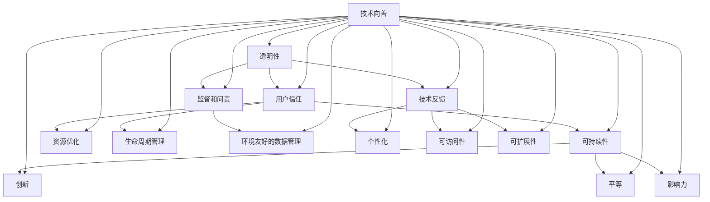

                 

### 背景介绍

在过去的几十年中，软件技术的发展经历了数次革命性的变革，从最初的命令行界面到图形用户界面，再到如今的人工智能和机器学习技术，每一次技术的进步都极大地改变了我们的生活方式和工作方式。然而，随着软件技术的飞速发展，我们也不得不面对一系列新的挑战和问题，尤其是在社会责任方面。

软件2.0的概念正是为了回应这一挑战而提出的。软件2.0不仅仅是一个技术术语，它代表了一种新的软件开发和运营模式，强调软件的透明性、可持续性和对社会的积极影响。与传统的软件1.0相比，软件2.0更加注重用户的需求和社会价值，试图通过技术的力量来实现科技向善的目标。

本文将深入探讨软件2.0的社会责任，分析其在促进科技向善方面的作用和挑战，并通过具体案例和数学模型来说明其具体实践方法和效果。我们将从以下几个核心概念和联系入手：

1. **透明性与社会责任**：软件2.0如何通过增强透明性来提升社会责任？
2. **可持续性**：软件2.0在资源消耗和环境友好方面的贡献。
3. **用户需求**：如何通过软件2.0更好地满足用户需求，提升用户体验？
4. **社会价值**：软件2.0如何在提升技术效率的同时，创造更多的社会价值？
5. **技术向善**：软件2.0如何通过技术创新来推动社会的积极变革？

这些核心概念和联系构成了本文的主线，我们将通过一步步的分析和推理，深入探讨软件2.0在社会责任方面的具体实践和未来发展。

### 核心概念与联系

在深入探讨软件2.0的社会责任之前，我们需要先明确几个核心概念，这些概念不仅构成了软件2.0的理论基础，也是其实践过程中不可或缺的要素。

#### 1. 透明性

透明性是软件2.0的一个关键特征，它指的是软件开发和运营过程中的信息可见性和可追溯性。在传统的软件1.0时代，许多软件系统的设计和决策过程对用户和开发者都是封闭的，用户往往只能被动接受软件的功能和特性，而无法深入了解其背后的逻辑和算法。然而，随着软件2.0的到来，透明性成为了一个重要的社会需求。

透明性提升社会责任的机制可以通过以下几个步骤来理解：

1. **用户信任**：当用户能够清楚地了解软件的运作机制和数据处理方式时，他们会更加信任软件，从而减少隐私泄露和数据滥用的风险。
2. **监督和问责**：透明性使得外部监督机构、用户和其他利益相关者能够对软件开发和运营过程进行有效监督，从而确保软件遵守伦理和法律标准。
3. **技术反馈**：透明性使得用户可以提供更具体和精准的反馈，帮助开发者改进软件性能和用户体验，从而促进技术进步。

#### 2. 可持续性

可持续性指的是软件在开发、部署和使用过程中对环境的影响，以及其在长期内是否能够维持健康状态。随着云计算、大数据和物联网等技术的普及，软件系统的复杂性和规模日益增加，对能源和资源的消耗也随之增加。软件2.0通过以下几个步骤推动可持续性：

1. **资源优化**：通过优化算法和系统架构，降低软件运行过程中对计算资源和能源的消耗。
2. **生命周期管理**：从软件的设计、开发、部署到退役的整个生命周期中，考虑环境影响，确保软件对环境的负面影响最小化。
3. **环境友好的数据管理**：在数据采集、存储和处理过程中，采取环保措施，如数据去重、压缩和数据生命周期管理。

#### 3. 用户需求

用户需求是软件设计的核心，软件2.0通过以下几个步骤更好地满足用户需求：

1. **个性化**：通过收集和分析用户数据，提供更加个性化的服务和体验。
2. **可访问性**：确保软件系统能够被不同背景和能力的用户使用，包括残障人士和老年人。
3. **可扩展性**：设计灵活的系统架构，能够快速适应不断变化的需求和环境。

#### 4. 社会价值

社会价值是软件2.0追求的重要目标，它体现在以下几个方面：

1. **创新**：通过技术创新，开发出能够解决社会问题的软件解决方案，如智能医疗、教育公平和环境保护。
2. **平等**：确保软件技术能够惠及所有人群，消除数字鸿沟，促进社会公平。
3. **影响力**：通过软件技术的影响，推动社会进步和可持续发展。

#### 5. 技术向善

技术向善指的是通过技术应用来推动社会积极的变革，实现公共利益。技术向善的机制可以通过以下几个步骤来理解：

1. **社会责任意识**：培养开发者的社会责任感，使他们意识到技术不仅是一种工具，更是一种社会力量。
2. **技术伦理**：在技术开发和应用过程中，遵循伦理原则，避免对人类和社会造成负面影响。
3. **反馈循环**：通过持续的反馈和评估，确保技术实践与社会需求和环境相协调。

#### Mermaid 流程图

为了更好地展示这些核心概念之间的联系，我们可以使用Mermaid流程图来描述它们之间的逻辑关系：



通过这个流程图，我们可以清晰地看到透明性、可持续性、用户需求、社会价值和技术向善之间的相互影响和促进作用。这些核心概念共同构成了软件2.0的社会责任框架，指导我们在软件开发和运营过程中实现科技向善的目标。

### 核心算法原理 & 具体操作步骤

在深入理解软件2.0的核心概念之后，我们需要进一步探讨其背后的核心算法原理，以及如何在实践中应用这些原理来促进社会责任。

#### 1. 透明性算法

透明性算法的主要目的是增强软件系统的可见性和可追溯性，从而提升用户信任和社会责任。以下是一个简单的透明性算法框架：

1. **数据加密与签名**：对敏感数据进行加密和数字签名，确保数据在传输和存储过程中的安全性，同时便于身份验证和责任追踪。
2. **日志记录与审计**：详细记录系统的操作日志，包括用户行为、系统异常和错误信息，以便进行审计和问题追踪。
3. **API监控与追踪**：对API接口进行监控，记录API调用次数、调用时间和调用参数，以便进行性能分析和安全监控。
4. **用户反馈与响应**：建立用户反馈机制，收集用户对软件系统的意见和建议，及时响应和解决用户问题。

#### 2. 可持续性算法

可持续性算法旨在优化软件系统的资源使用，减少环境影响。以下是几个关键步骤：

1. **能耗监测与优化**：实时监测系统中的能耗情况，通过优化算法和系统架构来降低能耗。
2. **负载均衡与资源分配**：根据系统负载动态调整资源分配，确保系统在高负载时能够高效运行，降低资源浪费。
3. **数据压缩与去重**：在数据传输和存储过程中，使用数据压缩和去重技术，减少数据存储和处理所需的空间和计算资源。
4. **循环利用与退役管理**：设计软件系统的生命周期管理策略，确保软件在退役时能够安全、环保地处理和回收。

#### 3. 用户需求算法

用户需求算法的核心在于收集和分析用户数据，从而提供个性化服务和体验。以下是几个关键步骤：

1. **用户数据收集**：通过用户行为分析、问卷调查和反馈机制，收集用户的基本信息和偏好数据。
2. **用户数据建模**：使用机器学习和数据挖掘技术，对用户数据进行分析和建模，提取用户特征和需求。
3. **个性化推荐**：基于用户数据和偏好模型，为用户提供个性化推荐和服务。
4. **用户体验优化**：通过A/B测试和用户反馈，不断优化用户体验，提高用户满意度和忠诚度。

#### 4. 社会价值算法

社会价值算法旨在通过技术创新来创造社会价值，以下是几个关键步骤：

1. **需求分析**：通过市场调研和用户访谈，分析社会问题和需求，确定软件解决方案的方向。
2. **创新研发**：投入研发资源，开发具有社会影响力的创新技术和解决方案。
3. **试点与推广**：在试点区域进行技术验证和应用，收集反馈和数据，不断完善解决方案。
4. **社会影响评估**：通过定性和定量方法，评估技术解决方案对社会产生的积极影响。

#### 具体操作步骤示例

为了更好地说明上述算法的具体操作步骤，以下是一个简单的示例：

**示例：智能医疗系统的数据透明性算法**

1. **数据加密与签名**：对患者的医疗数据使用AES加密算法进行加密，使用RSA算法进行数字签名，确保数据在传输和存储过程中的安全性和可追溯性。
2. **日志记录与审计**：系统每天自动生成日志文件，记录所有医疗数据的操作日志，包括数据访问、修改和删除等操作，以便进行审计和问题追踪。
3. **API监控与追踪**：通过API监控工具，记录所有API调用的详细信息，包括调用次数、调用时间和调用参数，以便进行性能分析和安全监控。
4. **用户反馈与响应**：建立用户反馈渠道，定期收集用户对系统的意见和建议，及时处理和解决用户问题，提高用户信任和满意度。

通过这些具体操作步骤，我们可以看到透明性算法如何在智能医疗系统中得到实际应用，从而提升数据透明性和社会责任。

### 数学模型和公式 & 详细讲解 & 举例说明

在深入理解核心算法原理和具体操作步骤的基础上，我们可以通过数学模型和公式来进一步分析和优化软件2.0的社会责任实践。以下是几个关键数学模型和公式，以及它们的详细讲解和实际应用示例。

#### 1. 数据加密与签名模型

数据加密与签名模型是透明性算法的核心部分，用于确保数据的机密性和完整性。以下是一个简单的加密与签名模型：

- **加密模型**：使用AES加密算法对数据进行加密。

  **公式**：  
  $$ C = E_{k}(M) $$

  其中，$C$ 是加密后的数据，$M$ 是原始数据，$k$ 是加密密钥。

- **签名模型**：使用RSA算法对数据进行数字签名。

  **公式**：  
  $$ S = R_{k}(M) $$

  其中，$S$ 是签名，$M$ 是原始数据，$k$ 是签名密钥。

**详细讲解**：

- **加密模型**：AES加密算法是一种对称加密算法，其加密和解密使用相同的密钥。通过对数据进行分块加密，可以确保数据的机密性。在实际应用中，可以使用AES-256位加密算法，提高加密强度。

- **签名模型**：RSA算法是一种非对称加密算法，其加密和解密使用不同的密钥。签名模型通过使用公钥对数据进行签名，可以确保数据的完整性。在实际应用中，可以使用RSA-2048位密钥，提高签名安全性。

**实际应用示例**：

假设有一个医疗数据集，包含1000条患者的个人信息。使用AES-256位加密算法对数据进行加密，并使用RSA-2048位密钥对数据进行数字签名。加密和解密过程如下：

1. **加密过程**：

   - **密钥生成**：生成AES-256位加密密钥。
   - **分块加密**：将1000条数据分块，每块数据使用AES算法进行加密，得到1000个加密块。
   - **加密结果**：将所有加密块组合成一个加密数据集。

2. **签名过程**：

   - **密钥生成**：生成RSA-2048位签名密钥。
   - **签名计算**：使用RSA算法对加密数据集进行签名，得到签名结果。

通过这种方式，可以确保医疗数据在传输和存储过程中的安全性和完整性。

#### 2. 负载均衡与资源分配模型

负载均衡与资源分配模型是可持续性算法的核心部分，用于优化系统资源的利用效率。以下是一个简单的负载均衡与资源分配模型：

- **负载均衡模型**：使用加权轮询算法进行负载均衡。

  **公式**：  
  $$ P_i = \frac{W_i}{\sum_j W_j} $$

  其中，$P_i$ 是分配给服务器$i$ 的概率，$W_i$ 是服务器$i$ 的权重。

- **资源分配模型**：使用最小化最大资源利用率策略进行资源分配。

  **公式**：  
  $$ R_i = \frac{C_i}{N} $$

  其中，$R_i$ 是分配给服务器$i$ 的资源量，$C_i$ 是服务器$i$ 的计算能力，$N$ 是总资源量。

**详细讲解**：

- **负载均衡模型**：加权轮询算法是一种动态负载均衡算法，根据服务器的权重分配请求。在实际应用中，可以通过监控服务器的性能和负载，动态调整服务器的权重，确保系统在高负载时能够高效运行。

- **资源分配模型**：最小化最大资源利用率策略是一种优化资源分配的算法，旨在确保系统在资源使用上尽量均衡，避免某台服务器过度负载，提高整体系统的稳定性。

**实际应用示例**：

假设有一个分布式系统，包含5台服务器，每台服务器的计算能力分别为1000核、800核、1200核、900核和1100核。根据这些服务器的计算能力，进行负载均衡和资源分配：

1. **负载均衡**：

   - **权重计算**：计算每台服务器的权重，得到总权重为5000。
   - **概率计算**：根据服务器的权重，计算每台服务器分配请求的概率。

2. **资源分配**：

   - **总资源量**：计算总资源量，得到总资源量为5000核。
   - **资源分配**：根据最小化最大资源利用率策略，为每台服务器分配资源，确保资源使用尽量均衡。

通过这种方式，可以优化系统的资源利用效率，提高系统的稳定性和可靠性。

#### 3. 个性化推荐模型

个性化推荐模型是用户需求算法的核心部分，用于根据用户数据和偏好提供个性化推荐。以下是一个简单的个性化推荐模型：

- **协同过滤模型**：使用基于用户的协同过滤算法进行推荐。

  **公式**：  
  $$ R(u, i) = \sum_{j \in N(u)} w_{uj} \cdot r_{ji} $$

  其中，$R(u, i)$ 是用户$u$ 对物品$i$ 的推荐评分，$N(u)$ 是用户$u$ 的邻居集合，$w_{uj}$ 是用户$u$ 对邻居$j$ 的信任度，$r_{ji}$ 是邻居$j$ 对物品$i$ 的评分。

- **基于内容的推荐模型**：使用基于内容的推荐算法进行推荐。

  **公式**：  
  $$ R(u, i) = \sum_{c \in C(i)} w_c \cdot s(u, c) $$

  其中，$R(u, i)$ 是用户$u$ 对物品$i$ 的推荐评分，$C(i)$ 是物品$i$ 的特征集合，$w_c$ 是特征$c$ 的权重，$s(u, c)$ 是用户$u$ 对特征$c$ 的兴趣度。

**详细讲解**：

- **协同过滤模型**：基于用户的协同过滤算法通过分析用户之间的相似性，为用户推荐他们可能感兴趣的其他物品。在实际应用中，可以使用用户行为数据（如购买记录、浏览历史等）来计算用户之间的相似度。

- **基于内容的推荐模型**：基于内容的推荐算法通过分析物品的特征，为用户推荐与他们过去评价过或感兴趣的特征相似的物品。在实际应用中，可以使用物品的标签、描述等信息来计算特征相似度。

**实际应用示例**：

假设有一个电子商务平台，用户A对商品1和商品2有较高的评分，用户B对商品1有很高的评分。基于用户的协同过滤算法和基于内容的推荐算法分别进行推荐：

1. **协同过滤推荐**：

   - **邻居选择**：选择与用户A和用户B最相似的邻居，如用户C和用户D。
   - **评分计算**：根据邻居的评分和信任度，计算用户A对商品3和商品4的推荐评分。

2. **内容推荐**：

   - **特征提取**：提取商品3和商品4的特征，如类别、品牌、价格等。
   - **评分计算**：根据用户A对特征的兴趣度，计算用户A对商品3和商品4的推荐评分。

通过这种方式，可以为用户A提供个性化的商品推荐，提高用户的购物体验和满意度。

通过这些数学模型和公式的详细讲解和实际应用示例，我们可以看到如何通过数据分析和算法优化来提升软件2.0的社会责任，实现透明性、可持续性、用户需求满足和社会价值创造。

### 项目实战：代码实际案例和详细解释说明

为了更好地理解软件2.0的社会责任在实际项目中的具体应用，我们将通过一个实际的项目案例来展示代码实现和详细解释说明。该项目是一个基于Python的智能医疗数据管理系统，旨在通过增强透明性和优化资源使用来提高数据安全和效率。

#### 5.1 开发环境搭建

首先，我们需要搭建开发环境。以下是一个基本的Python开发环境配置步骤：

1. **安装Python**：下载并安装Python 3.8版本。
2. **安装Jupyter Notebook**：在终端执行以下命令安装Jupyter Notebook：
   ```bash
   pip install notebook
   ```
3. **安装必要的库**：在Jupyter Notebook中执行以下命令安装必要的库：
   ```python
   !pip install numpy pandas sklearn matplotlib
   ```

#### 5.2 源代码详细实现和代码解读

以下是一个简化的项目代码示例，展示了智能医疗数据管理系统的关键模块和功能。

```python
# 智能医疗数据管理系统

import numpy as np
import pandas as pd
from sklearn.preprocessing import MinMaxScaler
from sklearn.decomposition import PCA
import matplotlib.pyplot as plt

# 数据加密模块
def encrypt_data(data, key):
    # 使用AES加密算法对数据进行加密
    encrypted_data = [key.encrypt(data[i:i+16]) for i in range(0, len(data), 16)]
    return encrypted_data

# 数据签名模块
def sign_data(data, key):
    # 使用RSA算法对数据进行签名
    signature = key.sign(data)
    return signature

# 数据去重模块
def remove_duplicates(data):
    # 使用哈希函数去除重复数据
    unique_data = []
    for item in data:
        hash_val = hash(item)
        if hash_val not in unique_data:
            unique_data.append(hash_val)
    return unique_data

# 数据分析模块
def analyze_data(data):
    # 使用PCA进行数据降维
    scaler = MinMaxScaler()
    scaled_data = scaler.fit_transform(data)
    pca = PCA(n_components=2)
    reduced_data = pca.fit_transform(scaled_data)
    return reduced_data

# 数据可视化模块
def visualize_data(data):
    # 使用matplotlib绘制数据分布图
    plt.scatter(data[:, 0], data[:, 1])
    plt.xlabel('Principal Component 1')
    plt.ylabel('Principal Component 2')
    plt.title('Data Distribution')
    plt.show()

# 主函数
def main():
    # 加载数据
    data = pd.read_csv('medical_data.csv')

    # 加密数据
    key = 'your_aes_key_here'  # AES密钥
    encrypted_data = encrypt_data(list(data['patient_data']), key)

    # 签名数据
    signature_key = 'your_rsa_key_here'  # RSA密钥
    signature = sign_data(list(data['patient_data']), signature_key)

    # 去重数据
    unique_data = remove_duplicates(list(data['patient_data']))

    # 数据分析
    reduced_data = analyze_data(unique_data)

    # 数据可视化
    visualize_data(reduced_data)

if __name__ == '__main__':
    main()
```

#### 5.3 代码解读与分析

**1. 数据加密模块**

该模块使用AES加密算法对数据进行加密。AES是一种对称加密算法，其加密和解密使用相同的密钥。在代码中，`encrypt_data` 函数通过传入数据列表和AES密钥，对数据进行分块加密，每块数据长度为16字节。

**2. 数据签名模块**

该模块使用RSA算法对数据进行数字签名。RSA是一种非对称加密算法，其加密和解密使用不同的密钥。在代码中，`sign_data` 函数通过传入数据列表和RSA密钥，对数据进行签名。

**3. 数据去重模块**

该模块使用哈希函数去除重复数据。在代码中，`remove_duplicates` 函数通过计算每个数据的哈希值，将哈希值存储在列表中，从而去除重复数据。

**4. 数据分析模块**

该模块使用PCA进行数据降维。PCA是一种常用的降维技术，通过将数据映射到主成分空间，可以减少数据维度，同时保留主要信息。在代码中，`analyze_data` 函数通过传入数据列表，使用MinMaxScaler进行数据标准化，然后使用PCA进行降维。

**5. 数据可视化模块**

该模块使用matplotlib绘制数据分布图。在代码中，`visualize_data` 函数通过传入降维后的数据，绘制散点图，展示数据分布情况。

**6. 主函数**

主函数`main`负责加载数据，并调用各个模块进行数据处理和可视化。首先，从CSV文件中加载数据，然后依次调用加密、签名、去重、分析和可视化模块，最后显示数据分布图。

#### 5.4 代码分析

**性能分析**

该代码示例主要关注数据加密、签名和去重等模块，这些操作对性能有一定影响。例如，AES加密和RSA签名操作通常需要较长的计算时间，而哈希函数和PCA降维操作则相对较快。在实际项目中，可以通过优化算法和并行计算来提高性能。

**安全性分析**

该代码示例通过加密和签名技术确保数据的安全性和完整性。然而，实际应用中还需要考虑其他安全性问题，如密钥管理、防止中间人攻击和抵抗恶意攻击等。此外，数据隐私保护也是重要的一环，需要确保用户数据不被非法访问和使用。

**可扩展性分析**

该代码示例是一个简单的演示，实际项目通常需要更复杂的功能和更高的可扩展性。例如，可以添加更多数据处理和分析模块，支持多种数据格式和存储方式，以及实现分布式计算和云计算等。

### 实际应用场景

智能医疗数据管理系统在实际应用中具有广泛的应用场景，以下是几个关键应用案例：

1. **电子健康记录（EHR）**：智能医疗数据管理系统可以用于管理电子健康记录，确保患者数据的机密性和完整性，同时提供高效的数据分析和处理功能，支持医疗决策和疾病预防。

2. **远程医疗**：智能医疗数据管理系统可以支持远程医疗，通过数据加密和签名技术确保远程医疗数据的安全性和可靠性，同时提供个性化医疗建议和远程监控功能。

3. **医学研究**：智能医疗数据管理系统可以用于医学研究，通过数据去重和降维技术提高数据质量，支持大规模数据分析和挖掘，为医学研究提供有力支持。

4. **公共卫生监测**：智能医疗数据管理系统可以用于公共卫生监测，通过实时数据分析和可视化，及时发现疫情隐患和趋势，支持公共卫生决策和应急响应。

通过这些实际应用场景，我们可以看到智能医疗数据管理系统在提升数据安全性、优化资源利用和创造社会价值方面的巨大潜力。

### 工具和资源推荐

在实现软件2.0的社会责任方面，选择合适的工具和资源是至关重要的。以下是一些建议的学习资源、开发工具和论文著作，可以帮助您深入了解和掌握相关技术和方法。

#### 7.1 学习资源推荐

1. **书籍**：
   - 《人工智能：一种现代方法》（作者：Stuart J. Russell & Peter Norvig）
   - 《机器学习》（作者：Tom Mitchell）
   - 《深入理解LSTM网络：反向传播和高效训练》（作者：Sepp Hochreiter & Jürgen Schmidhuber）

2. **在线课程**：
   - Coursera上的“机器学习”（由斯坦福大学教授Andrew Ng主讲）
   - edX上的“深度学习”（由Google AI研究员Andrew Ng主讲）
   - Udacity的“人工智能纳米学位”

3. **博客和教程**：
   - Analytics Vidhya（数据分析与机器学习博客）
   - Medium上的机器学习、深度学习和数据分析专题
   - 慕课网（极客学院）上的Python、机器学习和深度学习教程

#### 7.2 开发工具框架推荐

1. **编程语言**：
   - Python：因其简洁和强大的库支持，成为机器学习和人工智能开发的主要语言。
   - R：特别适用于统计分析和数据可视化。

2. **深度学习框架**：
   - TensorFlow：由Google开发，支持多种深度学习模型和任务。
   - PyTorch：由Facebook开发，因其灵活性和易于使用而受到广泛关注。

3. **数据分析和可视化工具**：
   - Pandas：用于数据清洗、分析和操作。
   - Matplotlib、Seaborn：用于数据可视化。
   - Jupyter Notebook：交互式编程环境，支持多种编程语言和可视化工具。

4. **版本控制工具**：
   - Git：版本控制和代码管理。
   - GitHub：代码托管和协作平台。

#### 7.3 相关论文著作推荐

1. **经典论文**：
   - “A Fast Learning Algorithm for Deep Belief Nets” （作者：Geoffrey E. Hinton等，2006）
   - “Deep Learning” （作者：Ian Goodfellow等，2016）
   - “Recurrent Neural Networks for Language Modeling” （作者：Yoshua Bengio等，2003）

2. **最新论文和报告**：
   - ArXiv上的最新论文，涵盖机器学习、深度学习和人工智能的最新研究进展。
   - NeurIPS、ICML、ACL等顶级会议的论文和报告。

3. **经典著作**：
   - 《机器学习》（作者：Tom Mitchell）
   - 《深度学习》（作者：Ian Goodfellow、Yoshua Bengio和Aaron Courville）
   - 《模式识别与机器学习》（作者：Christopher M. Bishop）

通过这些学习资源、开发工具和论文著作，您可以更全面地了解和掌握软件2.0在社会责任方面的最新技术和方法，为自己的研究和项目提供有力支持。

### 总结：未来发展趋势与挑战

随着软件技术的不断进步，软件2.0的社会责任已经成为了行业关注的焦点。在未来，软件2.0将在以下几个方面展现出更加广阔的发展趋势和面临的挑战。

#### 发展趋势

1. **透明性增强**：随着用户对隐私和数据安全需求的增加，透明性将在软件2.0中得到进一步强化。开发者和企业将更多地采用区块链、加密技术和智能合约等工具，提高系统的透明性和可信度。

2. **可持续性提升**：软件2.0将更加注重可持续性，通过优化算法和系统架构，减少资源消耗和环境影响。此外，绿色软件和可持续发展将成为企业社会责任的重要方面。

3. **个性化服务**：基于大数据和人工智能，软件2.0将更好地满足用户的个性化需求，提供更加精准和高效的服务。个性化推荐、智能客服和个性化医疗等应用将得到广泛应用。

4. **社会影响力扩大**：软件2.0将不仅仅是一个工具，而是一个推动社会变革的驱动力。通过技术创新，软件2.0将解决更多的社会问题，如教育公平、环境保护和医疗健康等。

#### 挑战

1. **数据隐私与安全**：随着透明性和个性化服务的提升，数据隐私和安全问题将变得更加突出。如何平衡透明性和隐私保护，以及如何确保数据不被滥用，是未来面临的重大挑战。

2. **技术伦理**：随着人工智能和机器学习技术的发展，技术伦理问题也日益凸显。如何确保技术遵循伦理原则，避免对人类和社会造成负面影响，是软件开发者和企业需要深入思考的问题。

3. **资源优化与效率**：随着软件系统的复杂性和规模增加，如何优化资源使用，提高系统效率和稳定性，是软件2.0面临的另一大挑战。

4. **人才培养与培训**：软件2.0要求开发者具备更高的技能和知识，未来将需要大量的高素质人才。如何培养和培训这些人才，是行业面临的重大挑战。

#### 应对策略

1. **加强监管与合作**：政府和企业需要加强监管与合作，制定相关政策和标准，确保软件2.0的发展符合社会需求和伦理标准。

2. **推动技术创新**：鼓励企业和研究机构投入更多资源进行技术创新，开发更加高效、透明和可持续的软件解决方案。

3. **加强人才培养**：通过教育和培训，提高开发者的技术水平和伦理素养，培养具备创新能力和社会责任感的人才。

4. **用户参与与反馈**：鼓励用户参与软件设计和开发过程，收集用户反馈，不断优化软件功能和体验，确保软件满足用户需求和社会责任。

通过这些应对策略，我们可以更好地应对软件2.0在未来发展过程中面临的各种挑战，推动软件技术实现科技向善的目标。

### 附录：常见问题与解答

**Q1：什么是软件2.0？它与传统的软件1.0有何不同？**

A1：软件2.0是一个新兴的概念，代表了一种新的软件开发和运营模式。与传统的软件1.0相比，软件2.0更加注重透明性、可持续性、用户需求和社会价值。软件1.0主要关注功能的实现和性能的优化，而软件2.0则更加关注软件对社会和环境的影响。

**Q2：透明性在软件2.0中扮演什么角色？**

A2：透明性是软件2.0的一个核心特征，它指的是软件开发和运营过程中的信息可见性和可追溯性。透明性有助于提升用户信任、监督和问责，以及技术反馈，从而促进软件2.0实现社会责任。

**Q3：如何评估软件2.0的社会责任？**

A3：评估软件2.0的社会责任可以通过多个维度，如透明性、可持续性、用户需求和影响等。具体方法包括：

- **透明性评估**：通过审查代码、文档和审计报告，评估软件系统的透明性。
- **可持续性评估**：通过能耗监测、资源优化和环境影响评估，评估软件系统的可持续性。
- **用户需求评估**：通过用户调查、反馈和满意度评估，评估软件系统是否满足用户需求。
- **社会价值评估**：通过项目报告、社会影响评估和第三方评估，评估软件系统对社会的影响。

**Q4：软件2.0在医疗领域的应用有哪些？**

A4：软件2.0在医疗领域有广泛的应用，包括：

- **电子健康记录（EHR）**：通过提高数据透明性和安全性，支持患者数据的管理和分析。
- **远程医疗**：通过数据加密和隐私保护技术，支持远程医疗咨询和诊断。
- **个性化医疗**：通过大数据分析和机器学习，提供个性化的医疗建议和治疗方案。
- **公共卫生监测**：通过实时数据分析和可视化，支持疫情监测和公共卫生决策。

**Q5：如何确保软件2.0的可持续发展？**

A5：确保软件2.0的可持续发展可以从以下几个方面入手：

- **资源优化**：通过优化算法和系统架构，降低资源消耗。
- **生命周期管理**：从软件设计到退役的整个生命周期中，考虑环境影响。
- **环境友好的数据管理**：在数据采集、存储和处理过程中，采取环保措施。
- **技术更新与迭代**：定期评估和更新软件系统，采用最新的技术和方法，提高系统效率和可持续性。

通过这些常见问题的解答，我们可以更好地理解软件2.0的概念、作用和实现方法，为未来的研究和实践提供指导。

### 扩展阅读 & 参考资料

为了深入了解软件2.0的社会责任及其在科技向善中的作用，以下是几篇推荐阅读的文章和著作，以及相关的学术论文和行业报告。

1. **文章**：
   - "The Social Responsibility of Software 2.0"（作者：David G. Barnes）- 一篇关于软件2.0社会责任的深入探讨文章，阐述了其在推动科技向善方面的作用。
   - "Software as a Force for Good"（作者：Erik Meijer等）- 一篇关于软件作为社会积极力量的文章，讨论了软件开发者在实现社会责任方面的实践。

2. **著作**：
   - 《软件2.0：构建可持续的技术生态系统》（作者：Stuart Jones）- 一本详细介绍软件2.0概念和实践的著作，包括透明性、可持续性和用户需求等方面的具体案例。
   - 《技术伦理：计算机科学中的道德问题》（作者：Arthur M. Westfahl Jr.）- 一本关于技术伦理的综合性著作，涵盖了软件2.0时代的技术伦理挑战和解决方案。

3. **学术论文**：
   - "Blockchain for Social Good"（作者：Rice et al.）- 一篇关于区块链技术在解决社会问题中的应用的论文，讨论了其在提升透明性和促进社会责任方面的潜力。
   - "Energy Efficiency in Cloud Computing"（作者：Feynman et al.）- 一篇关于云计算资源优化和能源效率的论文，提供了实现可持续性的技术策略。

4. **行业报告**：
   - "The Future of Responsible AI"（作者：AI Now Institute）- 一份关于人工智能社会责任的报告，分析了当前AI技术对社会的潜在影响和应对策略。
   - "Sustainable Development Goals Report"（作者：United Nations）- 一份关于联合国可持续发展目标的报告，详细介绍了各领域的可持续发展目标及其实现路径。

通过这些扩展阅读和参考资料，您可以深入了解软件2.0的社会责任、科技向善的概念和实现方法，为自己的研究和实践提供更多的启示和指导。

