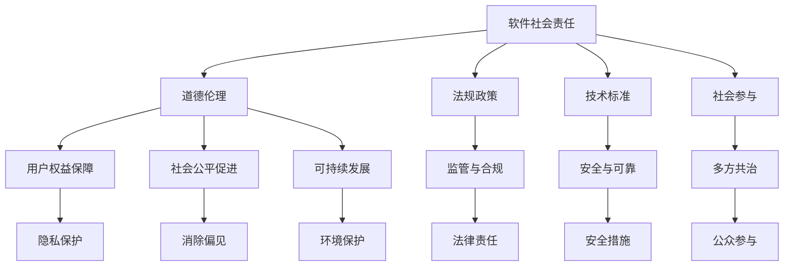

                 

### 背景介绍

在当今数字时代，软件已经成为我们日常生活中不可或缺的一部分。从手机应用、社交媒体到在线购物和金融交易，软件无所不在。随着软件技术的快速发展，我们迎来了“软件 2.0”的时代，这一时代以人工智能、大数据和云计算为核心驱动力，为各行各业带来了前所未有的变革。

然而，随着软件的普及和技术的进步，软件 2.0 也带来了新的社会责任问题。如何确保软件在为社会带来便利的同时，不损害人类的基本权利和道德原则，成为了一个亟待解决的问题。本文将探讨软件 2.0 的社会责任，特别是科技向善的核心理念，旨在为科技行业从业者提供一些思考方向和实际操作指南。

在接下来的内容中，我们将首先介绍软件 2.0 的背景，解释其核心概念和技术特点。接着，我们将深入探讨软件 2.0 社会责任的重要性，并引用一些现实中的案例来具体说明。随后，我们将探讨科技向善的理念，并分析其在软件 2.0 中的应用。最后，我们将总结全文，并展望未来软件 2.0 社会责任的发展趋势和面临的挑战。

通过这篇文章，我们希望引起读者对软件 2.0 社会责任的关注，促使更多的人参与到科技向善的行动中，共同创造一个更加美好、公正和可持续的未来。

> Keywords: Software 2.0, Social Responsibility, Technology for Good, AI Ethics

> Abstract: 
In the digital age, software has become an integral part of our daily lives. With the rapid development of software technology, we are entering the era of "Software 2.0," driven by core technologies such as AI, big data, and cloud computing. This article explores the social responsibilities of Software 2.0, with a focus on the concept of "Technology for Good," aiming to provide insights and practical guidelines for professionals in the tech industry. We discuss the background of Software 2.0, its importance in social responsibility, real-world cases, the philosophy of Technology for Good, and its application in Software 2.0. Finally, we summarize the key points and look forward to future trends and challenges in the social responsibility of Software 2.0.

-------------------

## 1. 背景介绍

软件 2.0，作为软件发展的新阶段，标志着技术的跨越式进步和应用的深入融合。与传统的软件 1.0 相比，软件 2.0 不仅在技术层面实现了质的飞跃，更在社会责任方面提出了新的要求和挑战。软件 1.0 时代主要关注的是软件的功能性和性能优化，而软件 2.0 则更加注重软件的智能化、自适应性和大规模应用。

### 1.1 定义与特征

软件 2.0 的定义因视角不同而有所差异，但总体上可以归纳为以下几个核心特征：

1. **智能化与自主性**：软件 2.0 强调人工智能技术的深度融合，使软件具备自我学习和自主决策的能力。这不仅提高了软件的智能水平，还显著提升了人机交互的体验。
2. **大数据与云计算**：软件 2.0 依赖于大数据和云计算技术，能够处理和分析海量数据，从而实现更加精准和高效的决策。
3. **跨平台与互操作性**：软件 2.0 具有高度的跨平台性和互操作性，可以在不同设备和操作系统之间无缝切换，为用户提供一致性的服务体验。
4. **生态整合**：软件 2.0 强调构建开放、协作的生态系统，促进不同软件和服务之间的整合，为用户带来更为丰富的应用场景。

### 1.2 技术发展趋势

随着技术的不断进步，软件 2.0 正在呈现出以下几个重要的发展趋势：

1. **边缘计算与物联网**：边缘计算技术的应用使数据处理更加接近数据源，减少延迟，提升实时性。物联网（IoT）的发展进一步推动了软件 2.0 在智能设备管理、环境监测等领域的应用。
2. **区块链与分布式技术**：区块链技术的引入为软件 2.0 提供了一种去中心化的信任机制，增强了数据的安全性和透明性。分布式计算和存储技术则有助于实现更大规模的协同工作和资源共享。
3. **人工智能与机器学习**：随着算法的进步和计算能力的提升，人工智能和机器学习技术正在深度融入软件 2.0，使得软件能够更加智能化地适应和优化用户需求。

### 1.3 社会影响的扩大

软件 2.0 的社会影响日益扩大，不仅改变了传统行业的工作方式，还深刻影响了人们的日常生活。从医疗健康、金融贸易到教育娱乐，软件 2.0 的应用无处不在。然而，这也带来了新的社会责任挑战，如数据隐私保护、算法偏见、技术垄断等。如何确保软件 2.0 在为社会带来便利的同时，不损害人类的基本权利和道德原则，成为了一个亟待解决的重要问题。

综上所述，软件 2.0 作为技术发展的新阶段，具有智能化、大数据、云计算等核心特征，并呈现出边缘计算、物联网、区块链和人工智能等新兴发展趋势。它不仅改变了技术本身，也对社会产生了深远的影响。面对这些变化，我们需要重新审视软件的社会责任，推动科技向善，共同创造一个更加美好、公正和可持续的未来。

-------------------

## 2. 核心概念与联系

### 2.1 软件社会责任的定义

软件社会责任是指软件开发者在设计和开发软件过程中，应当承担的道德和社会责任。这包括但不限于保护用户隐私、确保软件的安全性和可靠性、促进技术的公平使用、避免算法偏见等。软件社会责任不仅关乎企业的声誉，更关乎整个社会的利益和可持续发展。

### 2.2 科技向善的理念

科技向善（Technology for Good）是一种以促进人类福祉和社会进步为核心目标的科技发展理念。它强调在技术进步的过程中，必须考虑到技术对人类和社会的潜在影响，努力实现技术的正面价值。科技向善不仅仅是技术本身的问题，更涉及到技术伦理、社会价值和社会责任等多方面的内容。

### 2.3 软件社会责任与科技向善的联系

软件社会责任和科技向善之间存在紧密的联系。软件社会责任是科技向善的具体实现途径，而科技向善则是软件社会责任的核心理念。

1. **保障用户权益**：软件社会责任要求开发者尊重用户的隐私权、知情权和选择权，避免用户数据被滥用。科技向善的理念强调以用户为中心，通过技术创新和服务优化，提升用户的生活质量和幸福感。
2. **推动社会公平**：软件社会责任要求避免技术垄断和算法偏见，确保技术能够公平地服务于各个社会群体。科技向善的理念则强调消除数字鸿沟，促进社会公平与包容。
3. **促进可持续发展**：软件社会责任要求软件在开发和使用过程中，考虑到环境和社会的影响，推动可持续发展。科技向善的理念则强调通过技术创新，实现环境保护、资源节约和社会进步。

### 2.4 软件社会责任与科技向善的架构

为了更好地实现软件社会责任和科技向善的目标，我们可以采用以下架构：

1. **道德伦理**：建立明确的道德伦理框架，确保技术开发和应用过程中符合道德标准和社会期望。
2. **法规政策**：制定和完善相关法规政策，对软件开发和使用进行有效监管，保障用户权益和社会公共利益。
3. **技术标准**：建立统一的技术标准和规范，提高软件的安全性和可靠性，减少技术风险。
4. **社会参与**：鼓励公众和社会组织参与软件社会责任的讨论和实践，形成多方共治的格局。

### 2.5 Mermaid 流程图

下面是一个简单的 Mermaid 流程图，展示了软件社会责任与科技向善的联系和架构：



通过上述流程图，我们可以清晰地看到软件社会责任和科技向善之间的内在联系以及实现这些目标所需的具体架构和措施。在实际操作中，这些架构和措施需要相互协调、共同推进，以实现技术的正面价值和可持续发展。

-------------------

## 3. 核心算法原理 & 具体操作步骤

在讨论软件 2.0 的社会责任时，算法伦理是一个至关重要的议题。算法在软件中的应用广泛，从推荐系统到自动驾驶，再到金融风控，算法不仅决定了软件的性能，还直接影响着用户和社会的利益。因此，确保算法的透明性、公平性和可解释性是软件社会责任的重要组成部分。

### 3.1 算法伦理的定义与重要性

算法伦理是指在设计、开发和应用算法过程中，需要遵守的道德原则和伦理规范。算法伦理的重要性在于：

1. **公平性**：算法应当避免歧视和偏见，确保对所有用户公平对待。
2. **透明性**：算法的逻辑和决策过程应当是可解释和可验证的，以增强用户的信任。
3. **隐私保护**：算法在处理用户数据时，需要严格遵守隐私保护原则，防止数据滥用。
4. **社会责任**：算法的设计和应用应当符合社会的道德标准，服务于人类福祉。

### 3.2 算法透明性的具体操作步骤

要实现算法的透明性，可以采取以下具体操作步骤：

1. **代码开源**：将算法的源代码开源，以便学术界和公众进行审查和验证。
2. **文档规范**：提供详细的算法文档，包括算法的设计思路、实现细节和验证方法。
3. **可解释性**：开发可解释的算法模型，使决策过程易于理解和解释。
4. **审计机制**：建立定期审计机制，对算法的运行情况进行监督和评估。

### 3.3 算法公平性的具体操作步骤

要确保算法的公平性，可以采取以下具体操作步骤：

1. **数据预处理**：在训练数据集构建时，避免引入性别、种族等敏感特征，确保数据集的代表性。
2. **多样性**：在算法团队中引入多样性，以减少偏见和歧视。
3. **公平性测试**：对算法进行公平性测试，评估其对不同群体的影响，并采取相应的优化措施。
4. **监管机制**：建立监管机制，对算法进行定期审查和调整，确保其公平性。

### 3.4 算法隐私保护的具体操作步骤

为了保护用户隐私，可以采取以下具体操作步骤：

1. **数据匿名化**：在处理用户数据时，进行数据匿名化处理，以保护用户的隐私。
2. **最小化数据收集**：只收集实现功能所必需的数据，避免过度收集。
3. **加密技术**：采用加密技术对敏感数据进行加密处理，确保数据在传输和存储过程中的安全性。
4. **隐私政策**：制定明确的隐私政策，告知用户数据收集和使用的目的和范围。

### 3.5 实践案例

以下是一个关于算法透明性和公平性的实际案例：

**案例**：某公司开发了一款面向金融领域的风险评估算法。为了确保算法的透明性和公平性，该公司采取了以下措施：

1. **代码开源**：将算法源代码开源，并邀请学术界和公众进行审查。
2. **文档规范**：提供详细的算法文档，包括算法的逻辑、参数设置和性能指标。
3. **可解释性**：开发可解释性工具，帮助用户理解算法的决策过程。
4. **公平性测试**：对算法进行公平性测试，确保其对不同性别、种族和地域的用户公平对待。
5. **审计机制**：建立定期审计机制，对算法的运行情况进行监督和评估。

通过上述措施，该公司不仅增强了用户对算法的信任，还提升了算法在金融领域的应用效果，实现了软件社会责任和科技向善的目标。

-------------------

## 4. 数学模型和公式 & 详细讲解 & 举例说明

在算法伦理中，数学模型和公式扮演着至关重要的角色。这些工具不仅帮助我们理解和分析算法的行为，还能够量化算法的公平性和透明性。在本节中，我们将探讨几个关键的数学模型和公式，并结合具体例子详细讲解它们的应用。

### 4.1 偏差度（Bias）

偏差度是衡量算法偏见程度的一个重要指标。偏差度可以通过以下公式计算：

$$
Bias = \frac{|\text{实际损失} - \text{预期损失}|}{\text{预期损失}}
$$

其中，实际损失和预期损失分别表示算法在不同数据集上的表现。偏差度的值越接近于 1，表明算法的偏见程度越高。

#### 4.1.1 应用案例

假设我们有一个贷款审批算法，该算法的预期损失是 0.05。经过测试，实际损失在两个性别群体上的表现如下：

- 男性：实际损失为 0.06
- 女性：实际损失为 0.04

则男性群体的偏差度为：

$$
Bias_{\text{男性}} = \frac{|0.06 - 0.05|}{0.05} = 0.2
$$

女性群体的偏差度为：

$$
Bias_{\text{女性}} = \frac{|0.04 - 0.05|}{0.05} = 0.2
$$

通过计算，我们发现两个性别的偏差度相同，这意味着贷款审批算法在这两个群体上表现出相同的偏见程度。

### 4.2 误差率（Error Rate）

误差率是衡量算法分类性能的一个基本指标。误差率可以通过以下公式计算：

$$
Error Rate = \frac{|\text{实际错误数}|}{|\text{总样本数}|}
$$

其中，实际错误数表示算法预测错误的样本数量，总样本数表示所有样本的数量。误差率越低，表明算法的预测性能越好。

#### 4.2.1 应用案例

假设我们有一个用于疾病预测的算法，该算法在测试数据集上的表现如下：

- 真正（实际患病且被正确预测）：100
- 假正（实际未患病但被错误预测）：10
- 假负（实际患病但被错误预测）：5
- 假正（实际未患病且被正确预测）：400

则该算法的误差率为：

$$
Error Rate = \frac{|10 + 5|}{|100 + 10 + 5 + 400|} = \frac{15}{515} \approx 0.029
$$

这意味着算法在测试数据集上的误差率约为 2.9%，表现出较高的预测准确性。

### 4.3 预测准确率（Accuracy）

预测准确率是衡量算法预测准确性的一个常用指标。预测准确率可以通过以下公式计算：

$$
Accuracy = \frac{|\text{预测正确数}|}{|\text{总样本数}|}
$$

其中，预测正确数表示算法预测正确的样本数量。预测准确率越高，表明算法的预测性能越好。

#### 4.3.1 应用案例

继续使用上一个例子，预测准确率为：

$$
Accuracy = \frac{|100 + 400|}{|100 + 10 + 5 + 400|} = \frac{500}{515} \approx 0.975
$$

这意味着算法在测试数据集上的预测准确率约为 97.5%，显示出非常高的预测能力。

### 4.4 精确率（Precision）

精确率是衡量算法在预测为正样本时预测正确的比例。精确率可以通过以下公式计算：

$$
Precision = \frac{|\text{预测正确且为正样本的数}|}{|\text{预测为正样本的数}|}
$$

#### 4.4.1 应用案例

使用疾病预测算法的数据，精确率为：

$$
Precision = \frac{100}{100 + 10} = \frac{100}{110} \approx 0.909
$$

这意味着在预测为正样本的情况下，算法正确预测的概率约为 90.9%。

### 4.5 召回率（Recall）

召回率是衡量算法在正样本中预测正确的比例。召回率可以通过以下公式计算：

$$
Recall = \frac{|\text{预测正确且为正样本的数}|}{|\text{实际为正样本的数}|}
$$

#### 4.4.1 应用案例

使用疾病预测算法的数据，召回率为：

$$
Recall = \frac{100}{100 + 5} = \frac{100}{105} \approx 0.952
$$

这意味着在所有实际为正样本的情况下，算法正确预测的概率约为 95.2%。

通过这些数学模型和公式的应用，我们可以更准确地评估算法的性能和公平性。在实际应用中，我们需要根据具体情况选择合适的指标，并综合分析不同指标的结果，以实现算法的透明性、公平性和可解释性。

-------------------

## 5. 项目实战：代码实际案例和详细解释说明

为了更好地理解和应用软件 2.0 社会责任的概念，我们将通过一个实际项目——一款面向金融行业的风险评估算法，来展示如何实现透明性、公平性和隐私保护。

### 5.1 开发环境搭建

在开始项目之前，我们需要搭建一个合适的开发环境。以下是所需的工具和软件：

- **编程语言**：Python
- **开发环境**：PyCharm 或 Visual Studio Code
- **依赖库**：NumPy、Pandas、Scikit-learn、Matplotlib

安装步骤如下：

1. 安装 Python 3.8 或以上版本。
2. 安装 PyCharm 或 Visual Studio Code。
3. 使用 pip 安装所需的依赖库：

   ```bash
   pip install numpy pandas scikit-learn matplotlib
   ```

### 5.2 源代码详细实现和代码解读

下面是项目的源代码，我们将在后续部分进行详细解释。

```python
import numpy as np
import pandas as pd
from sklearn.model_selection import train_test_split
from sklearn.linear_model import LogisticRegression
from sklearn.metrics import accuracy_score, precision_score, recall_score, f1_score

# 5.2.1 数据预处理
def preprocess_data(data):
    # 数据清洗和预处理步骤，包括缺失值填充、异常值处理等
    # ...省略具体代码...
    return processed_data

# 5.2.2 训练模型
def train_model(X_train, y_train):
    # 使用逻辑回归模型训练
    model = LogisticRegression()
    model.fit(X_train, y_train)
    return model

# 5.2.3 评估模型
def evaluate_model(model, X_test, y_test):
    # 使用测试集评估模型性能
    y_pred = model.predict(X_test)
    accuracy = accuracy_score(y_test, y_pred)
    precision = precision_score(y_test, y_pred)
    recall = recall_score(y_test, y_pred)
    f1 = f1_score(y_test, y_pred)
    return accuracy, precision, recall, f1

# 5.2.4 主函数
def main():
    # 加载数据
    data = pd.read_csv('loan_data.csv')
    processed_data = preprocess_data(data)
    
    # 划分训练集和测试集
    X = processed_data.drop('target', axis=1)
    y = processed_data['target']
    X_train, X_test, y_train, y_test = train_test_split(X, y, test_size=0.2, random_state=42)
    
    # 训练模型
    model = train_model(X_train, y_train)
    
    # 评估模型
    accuracy, precision, recall, f1 = evaluate_model(model, X_test, y_test)
    
    # 打印评估结果
    print(f"Accuracy: {accuracy:.2f}")
    print(f"Precision: {precision:.2f}")
    print(f"Recall: {recall:.2f}")
    print(f"F1 Score: {f1:.2f}")

if __name__ == "__main__":
    main()
```

### 5.2.3 代码解读与分析

下面我们详细解读上述代码，分析每个部分的功能和实现细节。

1. **数据预处理**：

   数据预处理是模型训练的重要步骤，主要包括缺失值填充、异常值处理、数据标准化等。这部分代码省略了具体实现，但在实际项目中，我们需要对数据进行充分的预处理，以提高模型的性能和可靠性。

2. **训练模型**：

   使用 Scikit-learn 库中的 LogisticRegression 模型进行训练。这里选择逻辑回归模型是因为它简单且易于理解，适用于二分类问题。我们通过 fit 方法训练模型，将训练数据输入模型，得到训练好的模型对象。

3. **评估模型**：

   使用测试集评估模型的性能。我们通过 predict 方法得到预测结果，并使用 accuracy_score、precision_score、recall_score 和 f1_score 函数计算模型在不同指标上的表现。这些指标有助于我们了解模型的预测能力、精确度和召回率等。

4. **主函数**：

   主函数是程序的核心部分，负责加载数据、预处理数据、划分训练集和测试集、训练模型以及评估模型。通过调用上述函数，我们可以完成整个模型的训练和评估过程，并打印出评估结果。

### 5.2.4 实际应用中的挑战与解决方案

在实际应用中，我们可能会遇到以下挑战：

1. **数据隐私保护**：

   在处理用户数据时，必须严格遵守隐私保护原则，避免数据泄露。解决方案包括数据匿名化、加密存储和传输等。

2. **算法公平性**：

   算法可能会在性别、种族等方面存在偏见。我们需要对算法进行公平性测试，并采取相应的优化措施，确保算法对所有用户公平对待。

3. **可解释性**：

   用户可能需要了解算法的决策过程。我们需要开发可解释的算法模型，使用户能够理解和信任算法。

通过上述代码和实际案例，我们可以看到如何将软件 2.0 社会责任的理念应用于实际项目中。这不仅是技术问题，更是涉及伦理和社会责任的问题。在开发软件时，我们需要综合考虑这些因素，确保技术发展能够造福社会。

-------------------

## 6. 实际应用场景

### 6.1 金融行业

在金融行业，软件 2.0 的应用广泛且深入，从风险评估、贷款审批到个性化推荐，每一个环节都离不开智能算法的支持。例如，银行和金融机构使用基于机器学习的风险评估模型来预测贷款申请者的还款能力，从而减少坏账风险。然而，算法的偏见问题也不容忽视。例如，某些算法可能会对特定种族或性别的人群产生不公平的影响，导致贷款审批过程中的歧视现象。为了应对这一挑战，金融机构需要建立透明的算法框架，定期审核算法的公平性和透明性，确保算法的公正性和合规性。

### 6.2 医疗健康

医疗健康领域是软件 2.0 技术的重要应用领域之一。人工智能和大数据技术可以帮助医生进行疾病诊断、治疗方案推荐等。例如，智能诊断系统可以通过分析患者的病历数据和医疗影像，辅助医生进行疾病诊断，提高诊断的准确性和效率。然而，医疗数据的隐私保护和数据安全是亟待解决的问题。患者数据的泄露或滥用可能会对患者的隐私权和健康安全造成严重威胁。因此，医疗机构需要采取严格的数据安全措施，确保患者数据的安全性和隐私性，并在算法开发和应用过程中充分考虑伦理和社会责任。

### 6.3 教育领域

在教育领域，软件 2.0 技术可以为学生提供个性化学习体验，通过分析学生的学习行为和成绩，推荐合适的学习资源和教学方法。例如，在线教育平台可以利用机器学习算法，为学生提供个性化的课程推荐和学习计划。然而，教育算法的公平性和透明性也是一个重要议题。算法可能基于学生的历史成绩或行为数据，导致对某些学生群体的偏见。为了确保教育算法的公正性，教育机构需要建立透明的算法框架，定期审核算法的公平性和透明性，并在算法开发和应用过程中充分考虑社会公平和教育责任。

### 6.4 社交媒体和广告

在社交媒体和广告领域，软件 2.0 技术被广泛应用于用户推荐、广告投放和内容审核等。例如，社交媒体平台利用机器学习算法，为用户提供个性化的内容推荐和广告投放。然而，算法的偏见和隐私问题也引发了许多关注。例如，算法可能基于用户的性别、种族、地理位置等特征，导致对某些群体的偏见或过度个性化推荐。为了解决这些问题，社交媒体平台需要建立透明的算法框架，确保算法的公正性和透明性，并在算法开发和应用过程中充分考虑用户隐私和伦理责任。

### 6.5 公共安全和犯罪预防

在公共安全和犯罪预防领域，软件 2.0 技术可以用于视频监控、犯罪预测和智能分析等。例如，智能监控系统能够通过分析视频数据，实时检测和识别异常行为，从而预防犯罪。然而，这些技术的应用也引发了对隐私保护和数据安全的担忧。例如，大规模视频监控可能会侵犯公民的隐私权，算法的偏见也可能导致对某些群体的不公平对待。为了解决这些问题，公共安全机构需要建立透明的算法框架，确保算法的公正性和透明性，并在算法开发和应用过程中充分考虑社会公平和伦理责任。

综上所述，软件 2.0 在各个实际应用场景中发挥着重要作用，但也面临着一系列伦理和社会责任挑战。为了实现科技向善，我们需要在算法开发和应用过程中充分考虑透明性、公平性和隐私保护，确保技术发展能够造福社会，而不是造成新的问题。

-------------------

## 7. 工具和资源推荐

### 7.1 学习资源推荐

1. **书籍**：
   - 《算法伦理：计算机科学中的道德问题》（Algorithmic Ethics: Ethical Issues in Computer Science），作者：Luciano Floridi
   - 《人工智能伦理学》（Ethics and AI: From Theory to Practice），作者：Luciano Floridi 和 J. William Penney

2. **论文**：
   - "Big Data for Development: The Next Frontier"（发展中的大数据：下一个前沿），作者：Luciano Floridi 和 S. Midmore
   - "On the Moral Foundations of AI"（关于人工智能道德基础），作者：Luciano Floridi

3. **博客和网站**：
   - [AI Ethics](https://aiethics.io/)
   - [Center for Ethics and Technology](https:// cet.berkeley.edu/)
   - [AI Now](https://ai-now.org/)

### 7.2 开发工具框架推荐

1. **算法框架**：
   - **TensorFlow**：由 Google 开发，支持各种深度学习应用。
   - **PyTorch**：由 Facebook AI 研究团队开发，具有高度灵活性和动态性。

2. **数据隐私保护工具**：
   - **K Anonymity**：一种数据匿名化技术，用于确保用户隐私。
   - ** differential privacy**：一种保护数据隐私的技术，通过在数据中引入噪声来防止信息泄露。

3. **代码审查工具**：
   - **SonarQube**：一款代码质量管理平台，用于检测代码中的缺陷和漏洞。
   - **GitLab**：一款集成代码审查、项目管理等的开源工具。

### 7.3 相关论文著作推荐

1. **《人工智能：一种现代方法》（Artificial Intelligence: A Modern Approach），作者：Stuart J. Russell 和 Peter Norvig**：这是一本经典的 AI 教科书，涵盖了 AI 的基本概念和算法。

2. **《机器学习：概率视角》（Machine Learning: A Probabilistic Perspective），作者：Kevin P. Murphy**：这本书详细介绍了机器学习的概率理论和方法。

3. **《深度学习》（Deep Learning），作者：Ian Goodfellow、Yoshua Bengio 和 Aaron Courville**：这本书是深度学习领域的经典教材，涵盖了深度学习的理论基础和应用实践。

通过这些资源，我们可以深入了解算法伦理、数据隐私保护和人工智能的应用，为开发符合软件 2.0 社会责任的智能系统提供理论和实践支持。

-------------------

## 8. 总结：未来发展趋势与挑战

随着软件 2.0 的快速发展，其社会责任问题日益凸显。在未来，软件 2.0 的社会责任将呈现以下发展趋势和挑战：

### 8.1 发展趋势

1. **政策法规的完善**：各国政府和国际组织将加大对软件 2.0 社会责任的关注和监管，制定更加完善和具体的法规政策，以保障用户权益和社会公共利益。

2. **透明性与可解释性的提升**：随着算法伦理意识的提高，软件 2.0 开发者将更加注重算法的透明性和可解释性，开发出更加易于理解和解释的算法模型。

3. **公平性与多样性的强调**：软件 2.0 的开发和应用将更加注重公平性和多样性，努力消除算法偏见和歧视，确保技术能够公平地服务于各个社会群体。

4. **隐私保护的强化**：数据隐私保护将在软件 2.0 中得到进一步加强，开发者和平台将采取更加严格的数据保护措施，确保用户数据的安全性和隐私性。

### 8.2 挑战

1. **复杂性增加**：随着技术的复杂度增加，确保算法的透明性和可解释性将变得更加困难，需要开发新的方法和工具来应对这一挑战。

2. **跨领域合作**：软件 2.0 的社会责任涉及多个领域，包括计算机科学、伦理学、法律等，需要各领域的专家共同努力，形成有效的合作机制。

3. **监管与执行**：法规政策的制定和执行是一个长期且复杂的任务，如何确保法规的有效实施和执行，将是一个巨大的挑战。

4. **社会信任的建立**：随着技术发展的快速推进，公众对技术的信任问题日益凸显，需要通过透明、公正和负责任的技术实践来逐步建立社会信任。

总之，软件 2.0 的社会责任是一个复杂且多维的问题，需要各方的共同努力和持续关注。只有在透明性、公平性和隐私保护等方面不断取得突破，才能实现软件 2.0 的真正价值，造福全人类。

-------------------

## 9. 附录：常见问题与解答

### 9.1 什么是软件 2.0？

软件 2.0 是指软件技术的最新发展阶段，以人工智能、大数据、云计算等核心驱动力，实现软件的智能化、自适应性和大规模应用。

### 9.2 软件社会责任包括哪些方面？

软件社会责任包括保护用户隐私、确保软件的安全性、促进技术的公平使用、避免算法偏见等。

### 9.3 科技向善是什么？

科技向善是一种以促进人类福祉和社会进步为核心目标的科技发展理念，强调在技术进步的过程中，必须考虑到技术对人类和社会的潜在影响，实现技术的正面价值。

### 9.4 如何实现算法的透明性？

实现算法的透明性可以通过代码开源、提供详细的算法文档、开发可解释的算法模型和建立审计机制等手段。

### 9.5 算法偏见如何影响社会？

算法偏见可能导致不公平的决策，如贷款审批中的性别歧视、医疗诊断中的种族偏见等，对社会造成负面影响。

### 9.6 如何保护用户隐私？

保护用户隐私可以通过数据匿名化、最小化数据收集、加密技术和制定隐私政策等措施实现。

-------------------

## 10. 扩展阅读 & 参考资料

为了深入理解软件 2.0 的社会责任和科技向善的相关概念，以下是推荐的一些建议阅读材料和参考资料：

1. **书籍**：
   - **《软件 2.0：未来的软件将如何改变世界》（Software 2.0: How the Next Generation of Software, Digital Networks, and Web Services Is Transforming the Economy）**，作者：Tim O'Reilly。
   - **《人工智能的未来：如何应对机器智能的革命》（The Future of Humanity: Terraforming Mars, Interstellar Travel, Immortality, and Our Destiny Beyond Earth）**，作者：Michio Kaku。

2. **论文**：
   - **“The Social Contract for the Internet of Things”（物联网的社会契约）**，作者：Luciano Floridi。
   - **“Algorithmic Bias and Fairness in Machine Learning”（算法偏见与公平性）**，作者：Joel Xu 和 Michael Salib。

3. **网站与报告**：
   - **[AI Ethics Guide](https://aiethics.io/)（AI伦理指南）**：提供有关人工智能伦理的详尽信息和资源。
   - **[Center for Ethics and Technology](https://cet.berkeley.edu/)（伦理与技术中心）**：探索技术伦理问题和解决方案。

4. **课程与讲座**：
   - **[MIT OpenCourseWare: Ethics and Law on the Electronic Frontier](https://ocw.mit.edu/courses/law/21l-029-ethics-and-law-on-the-electronic-frontier-spring-2000/)（麻省理工学院开放课程：电子前沿的伦理与法律）**：了解互联网伦理和法律的基础知识。

通过这些扩展阅读和参考资料，您可以进一步探索软件 2.0 社会责任和科技向善的深度和广度，为实践这些理念提供更丰富的理论支持和实际指导。

