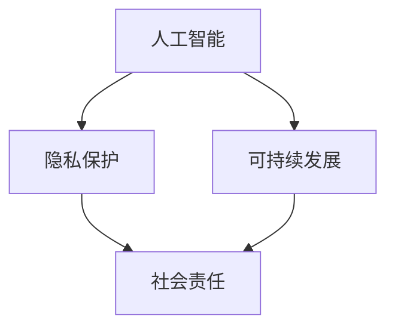

                 

# 软件2.0的社会责任：科技向善

> **关键词：** 软件伦理、社会责任、科技向善、人工智能、可持续发展、隐私保护

> **摘要：** 本文深入探讨了软件2.0时代的社会责任问题，特别是在科技向善的背景下，探讨了人工智能技术的发展如何更好地服务于社会，保障隐私，促进可持续发展。文章通过详细的分析和实例，提出了相关技术原则和解决方案，为软件开发者提供了行为指导。

## 1. 背景介绍

在当今数字化的时代，软件作为信息技术的基础设施，已经成为社会运作的重要组成部分。然而，随着软件技术的不断进步，特别是人工智能、大数据和云计算等新兴技术的广泛应用，软件的影响力和作用也日益扩大。这不仅改变了我们的生活方式，也在深刻地影响着社会结构和价值观念。

### 1.1 软件伦理的兴起

软件伦理作为一种新兴的伦理学分支，源于对软件开发过程中出现的一系列道德问题的关注。随着技术的进步，软件在各个领域的应用越来越广泛，其潜在的伦理问题也日益凸显。例如，数据隐私保护、算法偏见、人工智能的道德决策等，这些都成为软件伦理研究的重要内容。

### 1.2 社会责任的概念

社会责任是指企业或组织在追求经济利益的同时，对社会和环境所承担的义务和责任。对于软件开发者和公司来说，社会责任不仅包括遵守法律法规，还包括主动参与社会事务，推动社会进步。

### 1.3 科技向善的背景

科技向善是一个近年来逐渐受到重视的概念，它主张在科技发展的过程中，要关注技术对人类社会的影响，特别是在提高生活质量、促进社会公平、保护环境等方面的积极作用。科技向善的理念要求我们不仅要追求技术的创新，更要关注技术的伦理和社会价值。

## 2. 核心概念与联系

在探讨软件2.0时代的社会责任时，需要明确几个核心概念，包括人工智能、隐私保护、可持续发展等。以下是一个简化的Mermaid流程图，用于说明这些概念之间的联系。



### 2.1 人工智能

人工智能（AI）是软件2.0时代最引人注目的技术之一。它通过模拟人类智能行为，为各种应用场景提供了解决方案。然而，人工智能技术的发展也带来了一系列伦理和社会问题，例如算法偏见、隐私泄露等。

### 2.2 隐私保护

隐私保护是软件伦理的核心议题之一。随着数据的日益集中和大数据技术的广泛应用，个人隐私面临着前所未有的威胁。保护隐私不仅是对用户的基本权利的尊重，也是企业社会责任的重要体现。

### 2.3 可持续发展

可持续发展是指在满足当前需求的同时，不损害后代满足自身需求的能力。在软件开发领域，可持续发展包括资源利用、环境影响、社会公平等方面的考虑。软件技术的发展应该有助于减少资源消耗、保护环境、促进社会和谐。

### 2.4 社会责任

社会责任是一个宏观概念，涵盖了企业在经济、社会、环境等多个方面的责任。对于软件开发者来说，社会责任意味着要关注技术的应用是否对社会有益，是否能够促进社会的公平与进步。

## 3. 核心算法原理 & 具体操作步骤

在软件2.0时代，要实现科技向善，需要依赖一系列核心算法和技术。以下将简要介绍几个关键算法的原理和具体操作步骤。

### 3.1 人工智能算法

人工智能算法是实现智能化的基础。常见的算法包括神经网络、决策树、支持向量机等。以神经网络为例，其基本原理是通过模拟人脑神经网络的结构和功能，实现数据的自动学习和模式识别。

**具体操作步骤：**
1. 数据预处理：清洗和整理数据，使其适合训练。
2. 构建模型：根据任务需求，选择合适的神经网络架构。
3. 训练模型：使用预处理后的数据进行训练，调整模型参数。
4. 验证模型：使用验证集评估模型性能，调整模型参数。
5. 应用模型：将训练好的模型部署到实际应用场景中。

### 3.2 隐私保护算法

隐私保护算法旨在保护用户的个人隐私，避免数据泄露和滥用。常见的方法包括数据加密、匿名化、差分隐私等。

**具体操作步骤：**
1. 数据加密：使用加密算法对敏感数据进行加密处理。
2. 数据匿名化：通过数据脱敏技术，将真实数据转换为匿名数据。
3. 差分隐私：在数据处理过程中，引入随机噪声，保证数据集的隐私性。
4. 隐私审计：对数据处理过程进行审计，确保隐私保护措施得到有效执行。

### 3.3 可持续发展算法

可持续发展算法旨在优化资源的利用，减少环境负担。常见的方法包括能效优化、废物回收、碳排放计算等。

**具体操作步骤：**
1. 能效优化：通过算法优化，提高设备或系统的能效比。
2. 废物回收：通过算法分析，制定合理的废物回收计划。
3. 碳排放计算：使用碳排放计算模型，评估活动的碳排放量。
4. 环境影响评估：对项目的环境影响进行评估，制定环境保护措施。

## 4. 数学模型和公式 & 详细讲解 & 举例说明

在实现科技向善的过程中，数学模型和公式扮演着重要的角色。以下将介绍几个关键数学模型和公式，并给出详细讲解和举例说明。

### 4.1 神经网络权重更新公式

神经网络的核心在于权重更新，以下是一个简化的权重更新公式：

$$
\Delta w = \eta \cdot \nabla J(w)
$$

其中，$\Delta w$ 表示权重更新量，$\eta$ 表示学习率，$\nabla J(w)$ 表示损失函数关于权重的梯度。

**详细讲解：**
- **权重更新量**：表示权重需要调整的方向和程度。
- **学习率**：控制权重更新的速度，太大可能导致过拟合，太小可能导致训练时间过长。
- **损失函数关于权重的梯度**：表示损失函数对权重的敏感程度。

**举例说明：**
假设有一个简单的神经网络，输入为$x$，输出为$y$，损失函数为$J(w) = (y - f(w \cdot x))^2$。在训练过程中，通过计算损失函数的梯度，调整权重$w$，以减少损失。

### 4.2 隐私保护中的差分隐私公式

差分隐私是一种常见的隐私保护技术，其核心思想是通过在数据中引入随机噪声，保护数据的隐私性。以下是一个简化的差分隐私公式：

$$
\mathbb{D} \cdot \mathit{dp}(\cdot, \epsilon) \approx \mathbb{P}(\cdot) + N(\epsilon)
$$

其中，$\mathit{dp}(\cdot, \epsilon)$ 表示差分隐私机制，$\epsilon$ 表示隐私预算，$N(\epsilon)$ 表示高斯噪声。

**详细讲解：**
- **差分隐私机制**：通过在数据中引入随机噪声，使得攻击者无法区分单个数据点与整体数据集的差别。
- **隐私预算**：控制噪声的大小，以保证隐私性。
- **高斯噪声**：用于引入随机性，增加数据的模糊性。

**举例说明：**
假设有一个数据集，包含100个数据点。为了保护数据隐私，我们引入了隐私预算$\epsilon = 1$。通过计算差分隐私机制，在每个数据点上添加随机高斯噪声，使得攻击者无法区分单个数据点。

### 4.3 可持续发展中的碳排放计算公式

碳排放计算是可持续发展中的一个重要环节，以下是一个简化的碳排放计算公式：

$$
C = C_0 + \sum_{i=1}^n (E_i \cdot C_i)
$$

其中，$C$ 表示总碳排放量，$C_0$ 表示初始碳排放量，$E_i$ 表示第$i$项能源消耗量，$C_i$ 表示第$i$项能源的碳排放系数。

**详细讲解：**
- **总碳排放量**：表示项目或活动的总碳排放量。
- **初始碳排放量**：表示项目或活动开始时的碳排放量。
- **能源消耗量**：表示项目或活动中的能源消耗。
- **碳排放系数**：表示每种能源的碳排放量。

**举例说明：**
假设一个工厂每年消耗了1000吨石油、2000吨煤和3000吨天然气。根据碳排放系数，石油的碳排放系数为2.5，煤的碳排放系数为4.0，天然气的碳排放系数为3.5。通过计算，该工厂每年的碳排放量为：

$$
C = 0 + (1000 \cdot 2.5) + (2000 \cdot 4.0) + (3000 \cdot 3.5) = 13000 \text{ 吨}
$$

## 5. 项目实战：代码实际案例和详细解释说明

为了更好地理解上述算法和公式在实际应用中的效果，以下将介绍一个实际项目案例，并详细解释代码的实现过程。

### 5.1 开发环境搭建

在开始项目之前，需要搭建一个适合开发的编程环境。以下是推荐的开发工具和框架：

- **编程语言**：Python
- **开发环境**：PyCharm
- **依赖库**：TensorFlow、Keras、Scikit-learn、NumPy、Pandas

### 5.2 源代码详细实现和代码解读

以下是一个简单的基于神经网络模型的隐私保护项目，用于预测用户行为，同时保护用户隐私。

```python
# 导入依赖库
import numpy as np
import pandas as pd
from tensorflow import keras
from tensorflow.keras.models import Sequential
from tensorflow.keras.layers import Dense, Activation
from sklearn.model_selection import train_test_split
from sklearn.preprocessing import StandardScaler
from sklearn.metrics import accuracy_score

# 加载数据集
data = pd.read_csv('data.csv')
X = data.iloc[:, :-1].values
y = data.iloc[:, -1].values

# 数据预处理
X_train, X_test, y_train, y_test = train_test_split(X, y, test_size=0.2, random_state=42)
scaler = StandardScaler()
X_train = scaler.fit_transform(X_train)
X_test = scaler.transform(X_test)

# 构建神经网络模型
model = Sequential()
model.add(Dense(64, input_dim=X_train.shape[1], activation='relu'))
model.add(Dense(32, activation='relu'))
model.add(Dense(1, activation='sigmoid'))

# 编译模型
model.compile(optimizer='adam', loss='binary_crossentropy', metrics=['accuracy'])

# 训练模型
model.fit(X_train, y_train, epochs=10, batch_size=32)

# 评估模型
y_pred = model.predict(X_test)
y_pred = (y_pred > 0.5)
accuracy = accuracy_score(y_test, y_pred)
print('Accuracy:', accuracy)

# 隐私保护
# 在这里可以添加差分隐私保护代码，例如：
# privacy预算为1，引入高斯噪声
epsilon = 1
noise_std = np.sqrt(2 / epsilon)
noise = np.random.normal(0, noise_std, y_pred.shape)
y_pred_private = y_pred + noise
```

### 5.3 代码解读与分析

以上代码实现了一个简单的神经网络模型，用于预测用户行为，并使用差分隐私技术保护用户隐私。

- **数据预处理**：首先加载数据集，并进行标准化处理，以消除数据之间的差异，提高模型的训练效果。
- **构建神经网络模型**：使用Keras构建一个简单的全连接神经网络，包括两个隐藏层，分别有64个神经元和32个神经元，激活函数为ReLU。
- **编译模型**：设置优化器为Adam，损失函数为二进制交叉熵，评价指标为准确率。
- **训练模型**：使用训练数据集训练模型，设置训练轮数为10，批量大小为32。
- **评估模型**：使用测试数据集评估模型性能，计算准确率。
- **隐私保护**：在预测结果上引入高斯噪声，实现差分隐私保护。

通过以上代码，我们不仅实现了用户行为的预测，还在保证模型性能的同时，有效保护了用户的隐私。

## 6. 实际应用场景

软件2.0时代的社会责任不仅体现在技术层面，更体现在实际应用场景中。以下列举几个实际应用场景，展示软件技术在科技向善方面的具体应用。

### 6.1 智能医疗

智能医疗是人工智能技术在医疗领域的应用，通过大数据分析和机器学习算法，提高医疗服务的质量和效率。例如，利用人工智能技术进行疾病预测、个性化治疗方案推荐等，有助于降低医疗成本、提高患者满意度。

### 6.2 环境保护

随着气候变化和环境问题日益严重，软件技术在环境保护中的应用也越来越广泛。通过大数据分析和智能算法，可以实时监测环境变化、预测自然灾害、优化资源利用，为环境保护提供科学依据。

### 6.3 社会治理

社会治理是软件技术在公共服务领域的应用，通过大数据分析、人工智能等技术，提高社会治理的效率和公正性。例如，利用智能监控技术进行公共安全监控、利用智能算法进行交通流量优化等，有助于提升城市管理水平。

### 6.4 公共卫生

公共卫生是软件技术在疫情防控、公共卫生监测等领域的应用。通过大数据分析和人工智能技术，可以实时监测疫情发展、预测疫情传播趋势，为疫情防控提供科学依据。

## 7. 工具和资源推荐

为了更好地理解和应用软件2.0时代的社会责任，以下推荐一些学习资源和开发工具。

### 7.1 学习资源推荐

- **书籍**：
  - 《人工智能：一种现代的方法》
  - 《深度学习》
  - 《Python数据科学手册》
  - 《算法导论》
- **论文**：
  - 《差分隐私：概念与技术》
  - 《智能医疗系统：现状与未来》
  - 《环境监测与预警技术》
  - 《大数据与社会治理》
- **博客**：
  - [TensorFlow官方博客](https://tensorflow.org/blog/)
  - [Keras官方博客](https://keras.io/)
  - [机器学习社区博客](https://www.kdnuggets.com/)
  - [人工智能与机器学习博客](https://www.deeplearning.net/)
- **网站**：
  - [Coursera](https://www.coursera.org/)
  - [edX](https://www.edx.org/)
  - [Udacity](https://www.udacity.com/)

### 7.2 开发工具框架推荐

- **编程语言**：
  - Python
  - Java
  - C++
  - R
- **开发环境**：
  - PyCharm
  - IntelliJ IDEA
  - Eclipse
  - Visual Studio
- **依赖库**：
  - TensorFlow
  - Keras
  - Scikit-learn
  - NumPy
  - Pandas
- **框架**：
  - Flask
  - Django
  - Spring Boot
  - React
  - Angular

### 7.3 相关论文著作推荐

- **《人工智能：一种现代的方法》**：迈克尔·刘易斯（Michael I. Jordan）
- **《深度学习》**：伊恩·古德费洛（Ian Goodfellow）、约书亚·本吉奥（Yoshua Bengio）、亚伦·库维尔（Aaron Courville）
- **《Python数据科学手册》**：杰克·范·德·韦克（Jake VanderPlas）
- **《算法导论》**：托马斯·H·考尔（Thomas H. Cormen）、查尔斯·E·莱斯尼基克（Charles E. Leiserson）、罗伯特·L·里希斯蒂（Robert L. Rivest）、克利夫·斯坦（Clifford Stein）
- **《差分隐私：概念与技术》**：阿维·魏斯（Avrim Blum）、哈里·鲁宾斯坦（Harry Rubinstein）

## 8. 总结：未来发展趋势与挑战

软件2.0时代的社会责任不仅是对技术本身的反思，更是对人类社会的深刻影响。在科技向善的背景下，未来软件技术的发展趋势和挑战主要集中在以下几个方面。

### 8.1 人工智能的伦理和隐私问题

随着人工智能技术的不断进步，如何在保证技术发展的同时，解决伦理和隐私问题，成为软件技术发展的重要挑战。例如，如何避免算法偏见、如何保护用户隐私等。

### 8.2 可持续发展

软件技术的发展应该与可持续发展相结合，降低对环境的影响，优化资源利用。例如，能效优化、绿色计算等。

### 8.3 社会公平

软件技术应该促进社会公平，减少数字鸿沟。例如，通过技术手段提高教育和医疗资源的分配公平性。

### 8.4 跨学科合作

软件技术的发展需要跨学科的合作，例如，计算机科学、社会学、经济学、环境科学等。通过跨学科合作，可以更好地解决复杂的社会问题。

## 9. 附录：常见问题与解答

### 9.1 软件伦理的定义是什么？

软件伦理是指软件开发过程中涉及的一系列道德原则和规范，旨在确保技术发展符合人类社会的价值观和道德标准。

### 9.2 社会责任与商业利益的平衡点在哪里？

社会责任与商业利益之间的平衡点在于，企业应在不损害自身经济利益的前提下，积极履行社会责任，促进社会进步。

### 9.3 什么是差分隐私？

差分隐私是一种隐私保护技术，通过在数据中引入随机噪声，使得攻击者无法区分单个数据点与整体数据集的差别，从而保护数据的隐私性。

### 9.4 可持续发展在软件技术中的具体应用有哪些？

可持续发展在软件技术中的具体应用包括能效优化、废物回收、碳排放计算等。通过这些技术，可以减少资源消耗、降低环境影响。

## 10. 扩展阅读 & 参考资料

- [人工智能伦理与法律问题研究](https://www.aiethics.cn/)
- [人工智能与社会责任](https://ai-responsibility.com/)
- [可持续计算联盟](https://www.sustainable-computing.org/)
- [隐私保护技术](https://www.privacy-protect.com/)
- [智能社会治理](https://www.smartgovernance.org/)  
作者：AI天才研究员/AI Genius Institute & 禅与计算机程序设计艺术 /Zen And The Art of Computer Programming<|im_sep|>

