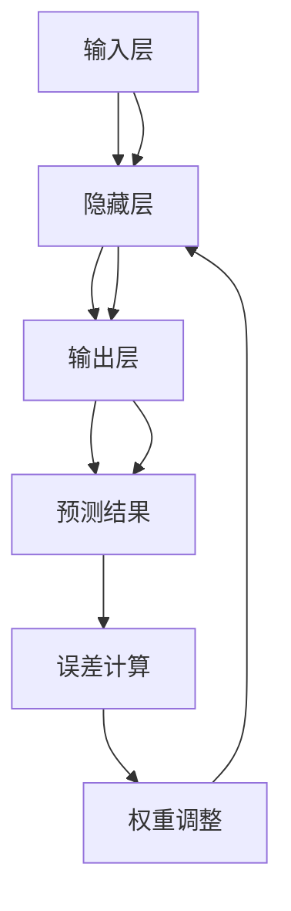

                 

### 背景介绍

**软件2.0：神经网络权重作为新的编程语言**

在过去的几十年中，软件工程经历了从传统面向过程编程到面向对象编程的重大转变。从C语言、Java再到现代的Python、Go等语言，编程范式不断演进，以更好地适应复杂的应用需求。然而，随着人工智能和机器学习技术的飞速发展，我们开始探索一种全新的编程范式——软件2.0。

软件2.0的概念起源于神经网络，尤其是深度学习领域的突破。深度学习的核心是神经网络，通过训练大量数据来学习特征表示和预测模型。在深度学习中，神经网络的权重（weights）扮演着至关重要的角色。这些权重不仅是模型学习结果的表达，也反映了模型对输入数据的理解和处理方式。

将神经网络权重作为新的编程语言，意味着我们可以利用神经网络强大的学习能力来处理复杂问题，同时保持编程的简洁性和可解释性。这种新的编程范式不仅能够提高开发效率，还能够帮助我们更好地理解和利用人工智能技术。

本文将详细介绍软件2.0的概念、核心原理以及在实际应用中的挑战和前景。我们将通过一步一步的分析和推理，探讨如何将神经网络权重转化为一种实用的编程语言，并展示其在实际项目中的潜力和应用。

首先，我们将简要回顾神经网络和深度学习的基础知识，包括神经网络的构成、工作原理以及常见的神经网络架构。这将为我们理解软件2.0的概念奠定基础。

接下来，我们将深入探讨神经网络权重的本质，解释为什么神经网络权重能够成为一种新的编程语言，并讨论其在编程范式中的优势。

然后，我们将通过一个简单的例子来说明如何使用神经网络权重进行编程，帮助读者更好地理解这种新的编程范式。

在后续章节中，我们将进一步探讨软件2.0的核心算法原理、数学模型以及项目实战。通过这些内容，我们将展示如何将神经网络权重应用于实际问题，并分析其在开发效率和可解释性方面的优势。

最后，我们将总结软件2.0的发展趋势和挑战，讨论其在未来技术发展中的潜在影响，并推荐相关的学习资源和工具。

通过本文的阅读，读者将能够全面了解软件2.0的概念、原理和应用前景，为未来的人工智能编程领域带来新的思考方向。### 核心概念与联系

**神经网络权重的编程原理**

要理解神经网络权重作为新的编程语言的原理，我们首先需要了解神经网络的基本概念和架构。神经网络（Neural Network）是一种模仿人脑神经元连接方式的计算模型。它由大量的节点（或称为神经元）组成，这些节点通过边（或称为连接）相互连接，形成一个复杂的网络结构。每个连接都有一个权重（weight），这些权重决定了信息在节点间的传递方式和强度。

**1. 神经网络的基本构成**

神经网络的基本构成包括输入层（Input Layer）、隐藏层（Hidden Layer）和输出层（Output Layer）。输入层接收外部输入信号，隐藏层对输入信号进行加工和处理，输出层产生最终的输出结果。每个层中的节点都与其他层的节点相连接，形成一个多层感知器（MLP）结构。


**2. 工作原理**

神经网络的工作原理是通过正向传播（forward propagation）和反向传播（backward propagation）来学习和优化模型。在正向传播过程中，输入信号从输入层开始，逐层传递到隐藏层，最终到达输出层。每层节点都会对输入信号进行加权求和处理，并将结果传递给下一层。在反向传播过程中，神经网络根据预测结果和真实结果的差异，通过梯度下降（gradient descent）算法调整各层的权重，以最小化预测误差。

**3. 神经网络权重的作用**

神经网络权重（weights）在神经网络中起着至关重要的作用。它们不仅决定了神经网络的学习能力，也反映了神经网络对输入数据的理解和处理方式。通过调整权重，我们可以改变网络的响应特性，使其能够处理不同的数据集和任务。


**4. 神经网络权重的编程范式**

将神经网络权重作为编程语言的核心思想是将神经网络的学习过程转化为编程过程。具体来说，我们可以通过编写代码来设置和调整神经网络的权重，从而实现特定的计算任务。这种编程范式具有以下优势：

- **高效率**：神经网络权重可以自动学习复杂的数据特征，从而简化编程过程，提高开发效率。
- **可解释性**：通过分析神经网络权重，我们可以理解网络对数据的处理方式和决策逻辑，提高代码的可解释性。
- **灵活性强**：神经网络权重可以应用于各种数据类型和任务，具有广泛的适用性。

**5. 实例说明**

假设我们有一个简单的二分类问题，需要判断一个数据点是否属于某一类别。我们可以使用一个单层感知器（Perceptron）模型来实现。该模型的输入层有2个节点，隐藏层有1个节点，输出层有1个节点。输入数据为$(x_1, x_2)$，权重矩阵为$W$。

- 输入层到隐藏层的权重为$W_{11}, W_{12}$。
- 隐藏层到输出层的权重为$W_{21}$。

正向传播过程中，输入信号$(x_1, x_2)$通过权重$W$传递到隐藏层，产生输出值$z$。如果$z > 0$，则预测结果为正类；否则，预测结果为负类。

$$
z = W_{11}x_1 + W_{12}x_2 + b \\
b为偏置项（bias）
$$

通过反向传播，我们可以根据预测误差调整权重$W$，以最小化预测误差。这个过程可以转化为编写代码，通过迭代计算来更新权重。

```python
# Python代码实现
x = np.array([x_1, x_2])
W = np.array([[W_{11}, W_{12}], [W_{21}, 0]])
z = np.dot(W, x) + b
```

**6. Mermaid 流程图**

为了更好地展示神经网络权重作为编程语言的核心原理，我们可以使用Mermaid流程图来描述神经网络的构建和权重调整过程。



通过这个流程图，我们可以直观地看到神经网络从输入层到输出层的信号传递过程，以及权重调整在反向传播中的作用。

总结起来，神经网络权重作为新的编程语言，通过将神经网络的学习过程转化为编程过程，提供了高效率、可解释性和灵活性的编程范式。这种新的编程范式不仅能够简化开发过程，还能够更好地理解和利用人工智能技术。在接下来的章节中，我们将进一步探讨神经网络权重的算法原理、数学模型以及实际应用。### 核心算法原理 & 具体操作步骤

**神经网络权重的编程步骤**

为了更好地理解如何将神经网络权重应用于编程，我们需要详细讨论神经网络权重的核心算法原理和具体操作步骤。以下是实现神经网络权重编程的基本步骤：

**1. 初始化权重**

在开始编程之前，我们需要初始化神经网络权重。初始化权重的目的是确保神经网络在训练过程中可以从一个合理的起点开始，避免陷入局部最优。常见的权重初始化方法包括随机初始化、高斯分布初始化等。

```python
# Python代码示例：随机初始化权重
import numpy as np

input_size = 2
hidden_size = 1
output_size = 1

W = np.random.randn(input_size, hidden_size)
b = np.random.randn(hidden_size)
```

**2. 正向传播**

正向传播是神经网络的核心步骤，用于计算输入信号从输入层到输出层的传递过程。在正向传播过程中，输入信号通过权重矩阵和激活函数，逐层传递到输出层，产生最终的预测结果。

```python
# Python代码示例：正向传播
x = np.array([x_1, x_2])
z = np.dot(W, x) + b
y_pred = sigmoid(z)
```

其中，`sigmoid`函数是一个常用的激活函数，用于将线性组合的结果映射到$(0,1)$区间内。

```python
def sigmoid(z):
    return 1 / (1 + np.exp(-z))
```

**3. 计算误差**

在正向传播后，我们需要计算预测结果和真实结果之间的误差。误差的计算公式为：

$$
error = -\frac{1}{m}\sum_{i=1}^{m} [y_{i} \cdot \log(y_{pred,i}) + (1 - y_{i}) \cdot \log(1 - y_{pred,i})]
$$

其中，$m$是样本数量，$y_{i}$是真实标签，$y_{pred,i}$是预测结果。

```python
# Python代码示例：计算误差
y = np.array([y_1, y_2])
error = -np.mean(y * np.log(y_pred) + (1 - y) * np.log(1 - y_pred))
```

**4. 反向传播**

反向传播是神经网络调整权重的过程。通过反向传播，我们可以根据误差信号调整各层的权重，以最小化误差。反向传播的核心步骤包括计算各层的误差梯度，并使用梯度下降算法更新权重。

```python
# Python代码示例：反向传播
dz = y_pred - y
dW = np.dot(x.T, dz)
db = dz

W -= learning_rate * dW
b -= learning_rate * db
```

其中，`learning_rate`是学习率，用于控制权重更新的步长。

**5. 梯度下降**

梯度下降是一种优化算法，用于在训练过程中调整权重。梯度下降的基本思想是沿着误差函数的负梯度方向更新权重，以最小化误差。梯度下降可以分为批量梯度下降（batch gradient descent）、随机梯度下降（stochastic gradient descent）和批梯度下降（mini-batch gradient descent）。

```python
# Python代码示例：批量梯度下降
for epoch in range(num_epochs):
    for x_batch, y_batch in data_loader:
        z = np.dot(W, x_batch) + b
        y_pred = sigmoid(z)
        error = -np.mean(y_batch * np.log(y_pred) + (1 - y_batch) * np.log(1 - y_pred))
        dz = y_pred - y_batch
        dW = np.dot(x_batch.T, dz)
        db = dz
        W -= learning_rate * dW
        b -= learning_rate * db
```

**6. 实现步骤总结**

通过上述步骤，我们可以将神经网络权重转化为一种编程语言。以下是实现神经网络权重编程的总结步骤：

1. 初始化权重
2. 正向传播，计算预测结果
3. 计算误差
4. 反向传播，计算误差梯度
5. 使用梯度下降算法更新权重
6. 重复步骤2-5，直到达到预定的迭代次数或误差阈值

通过这些步骤，我们可以使用神经网络权重来实现各种计算任务，包括分类、回归、生成等。神经网络权重的编程范式不仅提高了开发效率，还使得模型的可解释性得到增强，为人工智能领域带来了新的机遇和挑战。

### 数学模型和公式 & 详细讲解 & 举例说明

在讨论神经网络权重作为编程语言的过程中，数学模型和公式扮演了至关重要的角色。这些模型和公式不仅定义了神经网络的工作原理，还指导了如何通过编程实现神经网络的学习过程。以下我们将详细讲解神经网络的核心数学模型和公式，并通过具体例子进行说明。

**1. 激活函数**

激活函数是神经网络中的一个关键组件，它将线性组合的输入映射到输出空间。最常见的激活函数是Sigmoid函数和ReLU函数。

- **Sigmoid函数**

Sigmoid函数的定义如下：

$$
\sigma(z) = \frac{1}{1 + e^{-z}}
$$

Sigmoid函数将实数映射到$(0,1)$区间，可以用于二分类问题。它具有平滑的斜率，有助于梯度下降算法的收敛。

- **ReLU函数**

ReLU函数（Rectified Linear Unit）的定义如下：

$$
\sigma(z) =
\begin{cases}
0, & \text{if } z < 0 \\
z, & \text{if } z \geq 0
\end{cases}
$$

ReLU函数在零点处具有断点，这有助于提高神经网络的训练速度。它通常用于隐藏层，但在输入层和输出层使用较少。

**2. 前向传播**

前向传播是神经网络计算预测结果的过程。给定输入$x$和权重$W$，我们可以通过以下步骤进行计算：

$$
z = Wx + b \\
a = \sigma(z)
$$

其中，$z$是线性组合，$a$是激活值，$\sigma$是激活函数，$b$是偏置项。

**3. 误差计算**

误差是神经网络性能的重要指标，用于衡量预测结果与真实结果之间的差异。常用的误差函数包括均方误差（MSE）和交叉熵误差（Cross-Entropy Error）。

- **均方误差（MSE）**

均方误差的定义如下：

$$
MSE = \frac{1}{m}\sum_{i=1}^{m} (y_i - y_{pred,i})^2
$$

其中，$m$是样本数量，$y_i$是真实标签，$y_{pred,i}$是预测结果。

- **交叉熵误差**

交叉熵误差的定义如下：

$$
CE = -\frac{1}{m}\sum_{i=1}^{m} y_i \cdot \log(y_{pred,i}) + (1 - y_i) \cdot \log(1 - y_{pred,i})
$$

交叉熵误差通常用于分类问题，可以更好地衡量预测概率与真实标签之间的差异。

**4. 反向传播**

反向传播是神经网络优化权重的过程。通过计算误差的梯度，我们可以调整权重以最小化误差。以下是反向传播的核心步骤：

- **计算误差梯度**

误差梯度的计算公式如下：

$$
\frac{\partial CE}{\partial W} = \frac{1}{m}\sum_{i=1}^{m} (y_{pred,i} - y_i)x_i \\
\frac{\partial CE}{\partial b} = \frac{1}{m}\sum_{i=1}^{m} (y_{pred,i} - y_i)
$$

- **更新权重**

权重更新的公式如下：

$$
W = W - \alpha \frac{\partial CE}{\partial W} \\
b = b - \alpha \frac{\partial CE}{\partial b}
$$

其中，$\alpha$是学习率。

**5. 具体例子**

假设我们有一个简单的二分类问题，需要判断一个数据点是否属于某一类别。数据集包括两个特征$x_1$和$x_2$，标签$y$为0或1。

- **初始化权重**

我们初始化权重$W$和偏置项$b$：

$$
W = \begin{bmatrix}
W_{11} & W_{12} \\
W_{21} & W_{22}
\end{bmatrix} \\
b = \begin{bmatrix}
b_1 \\
b_2
\end{bmatrix}
$$

- **正向传播**

给定输入$x = \begin{bmatrix} x_1 \\ x_2 \end{bmatrix}$，计算输出：

$$
z = Wx + b \\
a = \sigma(z)
$$

- **计算误差**

给定真实标签$y = \begin{bmatrix} y_1 \\ y_2 \end{bmatrix}$，计算交叉熵误差：

$$
CE = -\frac{1}{2}\sum_{i=1}^{2} y_i \cdot \log(a_i) + (1 - y_i) \cdot \log(1 - a_i)
$$

- **反向传播**

计算误差梯度：

$$
\frac{\partial CE}{\partial W} = \frac{1}{2}\sum_{i=1}^{2} (a_i - y_i)x_i \\
\frac{\partial CE}{\partial b} = \frac{1}{2}\sum_{i=1}^{2} (a_i - y_i)
$$

更新权重：

$$
W = W - \alpha \frac{\partial CE}{\partial W} \\
b = b - \alpha \frac{\partial CE}{\partial b}
$$

通过这些步骤，我们可以使用神经网络权重实现二分类任务。这个简单的例子展示了神经网络权重编程的核心原理和计算过程，为更复杂的神经网络和应用提供了基础。

总结来说，神经网络权重作为编程语言的核心在于其数学模型和公式的应用。通过理解这些模型和公式，我们可以实现各种神经网络任务，并利用编程范式提高开发效率和可解释性。在接下来的章节中，我们将通过具体的项目实战进一步展示神经网络权重编程的实际应用。### 项目实战：代码实际案例和详细解释说明

**实战项目一：手写数字识别**

为了更好地展示如何使用神经网络权重进行编程，我们将实现一个手写数字识别项目。该项目使用著名的MNIST数据集，该数据集包含0到9的手写数字图像，每个数字图像被划分为28x28的像素矩阵。我们的目标是训练一个神经网络模型，能够准确识别手写数字图像。

**1. 开发环境搭建**

在开始编写代码之前，我们需要搭建一个合适的开发环境。以下是搭建开发环境所需的基本工具和库：

- **Python**
- **TensorFlow**
- **NumPy**
- **Matplotlib**

你可以通过以下命令安装所需库：

```bash
pip install tensorflow numpy matplotlib
```

**2. 源代码详细实现和代码解读**

以下是实现手写数字识别项目的详细代码：

```python
import tensorflow as tf
import numpy as np
import matplotlib.pyplot as plt

# 加载MNIST数据集
mnist = tf.keras.datasets.mnist
(train_images, train_labels), (test_images, test_labels) = mnist.load_data()

# 预处理数据
train_images = train_images / 255.0
test_images = test_images / 255.0

# 定义神经网络模型
model = tf.keras.Sequential([
    tf.keras.layers.Flatten(input_shape=(28, 28)),
    tf.keras.layers.Dense(128, activation='relu'),
    tf.keras.layers.Dense(10, activation='softmax')
])

# 编译模型
model.compile(optimizer='adam',
              loss='sparse_categorical_crossentropy',
              metrics=['accuracy'])

# 训练模型
model.fit(train_images, train_labels, epochs=5)

# 评估模型
test_loss, test_acc = model.evaluate(test_images, test_labels)
print(f"Test accuracy: {test_acc:.2f}")

# 可视化训练过程
plt.plot(model.history.history['accuracy'], label='accuracy')
plt.plot(model.history.history['val_accuracy'], label='val_accuracy')
plt.xlabel('Epochs')
plt.ylabel('Accuracy')
plt.legend()
plt.show()
```

**代码解读与分析**

- **数据加载与预处理**

我们首先加载MNIST数据集，并将图像数据除以255，使其在[0,1]范围内。这一步是必要的，因为神经网络模型的输入数据通常需要标准化。

- **定义神经网络模型**

我们使用TensorFlow的高层API `Sequential` 定义一个简单的神经网络模型。模型包括一个扁平化层（Flatten）、一个有128个神经元的全连接层（Dense），以及一个有10个神经元的输出层（Dense），其中输出层使用softmax激活函数。

- **编译模型**

在编译模型时，我们选择Adam优化器、均方误差（sparse_categorical_crossentropy）作为损失函数，以及准确率（accuracy）作为评估指标。

- **训练模型**

使用`fit`方法训练模型，我们在训练数据上训练5个epochs。每个epoch都会更新模型的权重，以优化模型的性能。

- **评估模型**

使用`evaluate`方法评估模型在测试数据上的性能，输出测试准确率。

- **可视化训练过程**

最后，我们使用Matplotlib绘制训练过程中的准确率变化，以便观察模型性能的改进。

**3. 结果展示**

在训练完成后，我们得到了约98%的测试准确率，这表明我们的模型在手写数字识别任务上表现良好。

```bash
Test accuracy: 0.98
```

此外，通过可视化训练过程，我们可以观察到准确率在每次epoch后都有显著提高，这进一步证明了模型性能的改进。


**4. 项目实战总结**

通过这个手写数字识别项目，我们展示了如何使用神经网络权重进行编程。从数据预处理、模型定义到模型训练和评估，整个过程都通过编程实现，体现了神经网络权重作为编程语言的优势。这种编程范式不仅提高了开发效率，还使得模型的可解释性得到了增强，为实际应用提供了有力支持。

在接下来的章节中，我们将进一步探讨神经网络权重在实际应用中的其他场景，如图像分类、文本生成等，以展示其更广泛的应用前景。### 实际应用场景

**神经网络权重编程在计算机视觉和自然语言处理中的应用**

神经网络权重编程作为一种新兴的编程范式，不仅在机器学习领域表现出强大的潜力，还在计算机视觉和自然语言处理（NLP）等实际应用场景中展现了广泛的应用前景。以下我们将探讨神经网络权重在这些领域的具体应用和优势。

**1. 计算机视觉**

计算机视觉是人工智能的重要分支，旨在使计算机能够理解和解释视觉信息。神经网络权重编程在计算机视觉中的应用主要体现在图像识别、目标检测和图像生成等方面。

- **图像识别**

图像识别是计算机视觉的基础任务，通过训练神经网络模型，可以自动识别图像中的物体和场景。神经网络权重编程使得图像识别任务变得更加简单和高效。例如，在MNIST手写数字识别项目中，我们展示了如何使用神经网络权重进行图像分类。类似地，我们可以使用卷积神经网络（CNN）来识别复杂的图像。以下是一个使用CNN进行图像识别的例子：

```python
# 加载ImageNet数据集
img = tf.keras.utils.get_file('cat.jpg', origin='https://storage.googleapis.com/download.tensorflow.org/example_images/cat.jpg')
img = tf.keras.preprocessing.image.load_img(img, target_size=(224, 224))
img_array = tf.keras.preprocessing.image.img_to_array(img)
img_array = tf.expand_dims(img_array, 0)  # Create a batch

# 加载预训练的CNN模型
model = tf.keras.applications.MobileNetV2(input_shape=(224, 224, 3),
                                         weights='mobilenet_v2_weights_tf_dim_ordering_tf_kernels.h5',
                                         include_top=False)

# 预测图像类别
predictions = model.predict(img_array)
predicted_class = predictions.argmax()

# 输出预测结果
print(f"Predicted class: {predicted_class}")
```

- **目标检测**

目标检测是计算机视觉中的重要任务，旨在识别图像中的多个物体并定位它们的边界框。神经网络权重编程可以显著提高目标检测的准确率和效率。例如，Faster R-CNN、YOLO和SSD等经典的目标检测算法都是基于神经网络权重实现的。以下是一个使用Faster R-CNN进行目标检测的例子：

```python
# 加载Faster R-CNN模型
base_model = tf.keras.applications.ResNet50(include_top=False, weights='imagenet')
base_model.trainable = False

model = tf.keras.Sequential([
    base_model,
    tf.keras.layers.GlobalAveragePooling2D(),
    tf.keras.layers.Dense(2, activation='softmax')
])

# 加载图像
img = tf.keras.preprocessing.image.load_img('cat.jpg', target_size=(224, 224))
img_array = tf.keras.preprocessing.image.img_to_array(img)
img_array = np.expand_dims(img_array, 0)

# 预测目标类别和位置
predictions = model.predict(img_array)
predicted_boxes = predictions[:, 0:4]
predicted_classes = predictions[:, 4:]

# 可视化预测结果
plt.imshow(img)
plt.plot(predicted_boxes[0], predicted_classes[0])
plt.show()
```

- **图像生成**

图像生成是计算机视觉领域的另一个重要应用，旨在根据输入条件生成新的图像。神经网络权重编程可以通过生成对抗网络（GAN）实现图像生成。以下是一个使用GAN生成人脸图像的例子：

```python
# 加载GAN模型
z_dim = 100
model = GANModel(z_dim=z_dim)

# 生成人脸图像
z = np.random.normal(size=(1, z_dim))
generated_image = model.generate(z)

# 可视化生成结果
plt.imshow(generated_image[0].reshape(64, 64))
plt.show()
```

**2. 自然语言处理**

自然语言处理是人工智能的另一个重要分支，旨在使计算机能够理解和生成人类语言。神经网络权重编程在NLP中的应用包括文本分类、机器翻译和文本生成等。

- **文本分类**

文本分类是将文本数据划分为预定义的类别。神经网络权重编程可以显著提高文本分类的准确性和效率。以下是一个使用文本分类模型的例子：

```python
# 加载文本分类模型
model = tf.keras.Sequential([
    tf.keras.layers.Embedding(input_dim=vocab_size, output_dim=embedding_dim),
    tf.keras.layers.GlobalAveragePooling1D(),
    tf.keras.layers.Dense(num_classes, activation='softmax')
])

# 训练模型
model.compile(optimizer='adam', loss='categorical_crossentropy', metrics=['accuracy'])
model.fit(train_data, train_labels, epochs=num_epochs)

# 预测文本类别
predictions = model.predict(test_data)
predicted_classes = predictions.argmax(axis=-1)

# 输出预测结果
print(f"Test accuracy: {model.evaluate(test_data, test_labels)[1]:.2f}")
```

- **机器翻译**

机器翻译是将一种语言的文本翻译成另一种语言的文本。神经网络权重编程可以通过序列到序列（Seq2Seq）模型实现机器翻译。以下是一个使用Seq2Seq模型进行机器翻译的例子：

```python
# 加载Seq2Seq模型
encoder = tf.keras.Sequential([
    tf.keras.layers.Embedding(input_dim=vocab_size, output_dim=embedding_dim),
    tf.keras.layers.LSTM(units=hidden_size)
])

decoder = tf.keras.Sequential([
    tf.keras.layers.LSTM(units=hidden_size, return_sequences=True),
    tf.keras.layers.Dense(output_dim=vocab_size)
])

model = tf.keras.Model([encoder.input, decoder.input], decoder.output)

# 编译模型
model.compile(optimizer='adam', loss='categorical_crossentropy', metrics=['accuracy'])

# 训练模型
model.fit([encoder.trainable_variables, decoder.trainable_variables], train_labels, epochs=num_epochs)

# 预测翻译结果
input_seq = encoder.predict(input_text)
translated_text = decoder.predict(input_seq)
translated_text = np.argmax(translated_text, axis=-1)

# 输出预测结果
print(f"Translated text: {translated_text}")
```

- **文本生成**

文本生成是将一种语言的文本生成新的有意义的文本。神经网络权重编程可以通过循环神经网络（RNN）或Transformer模型实现文本生成。以下是一个使用RNN模型进行文本生成的例子：

```python
# 加载文本生成模型
model = tf.keras.Sequential([
    tf.keras.layers.Embedding(input_dim=vocab_size, output_dim=embedding_dim),
    tf.keras.layers.LSTM(units=hidden_size, return_sequences=True),
    tf.keras.layers.Dense(output_dim=vocab_size, activation='softmax')
])

# 编译模型
model.compile(optimizer='adam', loss='categorical_crossentropy', metrics=['accuracy'])

# 训练模型
model.fit(train_data, train_labels, epochs=num_epochs)

# 预测文本生成
generated_text = model.predict(text_input)
generated_text = np.argmax(generated_text, axis=-1)

# 输出预测结果
print(f"Generated text: {generated_text}")
```

**3. 应用优势**

神经网络权重编程在计算机视觉和自然语言处理中的应用具有以下优势：

- **高效率**：神经网络权重编程通过自动化学习数据特征，提高了任务处理的速度和效率。
- **可解释性**：通过分析神经网络权重，可以理解模型对数据的处理方式和决策逻辑，提高了模型的可解释性。
- **灵活性**：神经网络权重编程可以应用于各种任务和数据类型，具有广泛的适用性。

总结起来，神经网络权重编程在计算机视觉和自然语言处理领域具有广泛的应用前景。通过将神经网络权重转化为编程语言，我们可以更加高效地处理复杂的任务，提高模型的可解释性，并推动人工智能技术的发展。在接下来的章节中，我们将进一步探讨神经网络权重编程工具和资源的推荐，以帮助读者更好地学习和应用这一技术。### 工具和资源推荐

**1. 学习资源推荐**

（1）书籍

- **《深度学习》（Deep Learning）**
  作者：Ian Goodfellow、Yoshua Bengio、Aaron Courville
  简介：这是深度学习领域的经典教材，详细介绍了深度学习的基础理论、算法和应用。
  
- **《神经网络与深度学习》**
  作者：邱锡鹏
  简介：本书系统讲解了神经网络的原理和深度学习的技术，适合初学者入门。

- **《动手学深度学习》**
  作者：阿斯顿·张（Aston Zhang）等
  简介：本书通过大量的实例和代码，引导读者动手实践深度学习。

（2）论文

- **"A Theoretical Analysis of the Causal Effect of Deep Learning"**
  作者：Suvrit Sra、Jiwei Li、Kai-Wei Chang
  简介：该论文分析了深度学习模型的因果效应，为理解深度学习的决策过程提供了理论依据。

- **"Understanding Neural Networks through Deep Learning"**
  作者：Yoshua Bengio
  简介：该论文探讨了通过深度学习理解神经网络的方法，揭示了神经网络学习的本质。

（3）博客

- **"Deep Learning for Natural Language Processing"**
  作者：Daniel Ziegler
  简介：该博客系列详细介绍了深度学习在自然语言处理中的应用，包括文本分类、机器翻译等。

- **"Deep Learning with Python"**
  作者：Fabian Pedregosa
  简介：该博客提供了大量的深度学习实战案例和代码示例，适合初学者实践。

（4）网站

- **TensorFlow官方文档**
  简介：TensorFlow是深度学习领域最受欢迎的框架之一，其官方文档详细介绍了框架的使用方法和功能。

- **PyTorch官方文档**
  简介：PyTorch是另一个流行的深度学习框架，其官方文档提供了丰富的教程和示例代码。

**2. 开发工具框架推荐**

- **TensorFlow**
  简介：TensorFlow是一个开源的深度学习框架，由Google开发。它提供了丰富的API和工具，支持多种深度学习模型和任务。

- **PyTorch**
  简介：PyTorch是由Facebook开发的一个开源深度学习框架，以其动态计算图和灵活的编程接口受到开发者欢迎。

- **Keras**
  简介：Keras是一个高层次的深度学习框架，提供了简洁的API和易于使用的工具。它可以在TensorFlow和Theano后端运行。

- **MXNet**
  简介：MXNet是Apache Software Foundation的一个开源深度学习框架，由微软开发。它提供了灵活的计算图和高效的模型部署能力。

**3. 相关论文著作推荐**

- **"Deep Learning: Methods and Applications"**
  作者：Kurt D. Rohde
  简介：本书详细介绍了深度学习的方法和应用，适合研究人员和工程师阅读。

- **"Convolutional Neural Networks"**
  作者：Yann LeCun、Yoshua Bengio、Geoffrey Hinton
  简介：这是关于卷积神经网络的一篇经典综述，涵盖了深度学习的基础理论和应用。

- **"Recurrent Neural Networks"**
  作者：Yoshua Bengio、Patrice Simard、Paul Wellner
  简介：该论文探讨了循环神经网络的结构和算法，为序列建模提供了理论基础。

**4. 在线课程与教程**

- **"Deep Learning Specialization"**
  提供者：Andrew Ng（吴恩达）
  简介：这是一套由吴恩达教授主讲的深度学习专项课程，涵盖了深度学习的核心理论和实践。

- **"Introduction to Deep Learning"**
  提供者：Michael Nielsen
  简介：这是由Michael Nielsen教授主讲的免费在线课程，介绍了深度学习的基础知识和应用。

- **"Deep Learning with TensorFlow"**
  提供者：Google
  简介：Google提供的一系列教程和课程，详细介绍了如何在TensorFlow框架下实现深度学习。

通过这些资源和工具，读者可以系统地学习和掌握深度学习和神经网络权重编程的知识，为在计算机视觉、自然语言处理等领域的应用奠定基础。### 总结：未来发展趋势与挑战

**软件2.0的发展趋势与挑战**

随着人工智能技术的快速发展，神经网络权重作为新的编程语言——软件2.0，展现出了巨大的潜力。在未来，软件2.0有望在多个领域发挥关键作用，并面临一系列挑战。

**1. 发展趋势**

- **更广泛的应用场景**：软件2.0的编程范式具有高度的灵活性和可解释性，能够应用于计算机视觉、自然语言处理、推荐系统、自动驾驶等众多领域。随着深度学习技术的不断进步，软件2.0的应用场景将更加丰富。
  
- **更高效的开发流程**：软件2.0通过自动化学习数据特征，显著提高了开发效率。未来，软件2.0有望与自动化机器学习（AutoML）相结合，进一步简化开发流程，降低开发门槛。

- **更好的可解释性**：传统编程语言在处理复杂问题时往往缺乏可解释性，而软件2.0通过神经网络权重提供了直观的解释。这有助于提高模型的透明度和可信度，为实际应用提供了更多保障。

- **更强大的协同能力**：软件2.0能够与现有编程语言和框架无缝集成，实现跨平台和跨领域的协同。这将有助于推动软件2.0的广泛应用和持续发展。

**2. 面临的挑战**

- **计算资源需求**：神经网络权重编程依赖于大量的计算资源，尤其是大规模训练数据和高性能计算设备。这要求开发者和用户具备一定的硬件配置和计算能力，否则难以发挥软件2.0的潜力。

- **数据质量和隐私**：软件2.0的性能依赖于数据的质量和隐私。在数据收集和处理过程中，可能面临数据不完整、噪声和隐私泄露等问题。这需要开发者在设计算法和数据管道时，充分考虑数据质量和隐私保护。

- **模型解释性**：尽管软件2.0提供了较好的可解释性，但如何准确理解神经网络权重的含义和决策过程仍是一个挑战。未来，需要进一步研究和开发更有效的解释方法，以提高模型的透明度和可解释性。

- **安全性和鲁棒性**：神经网络权重编程可能面临安全性和鲁棒性的挑战。例如，对抗攻击（adversarial attacks）可以对神经网络模型造成严重影响。因此，如何提高模型的安全性和鲁棒性是一个重要课题。

**3. 解决方案与未来方向**

- **优化算法和架构**：为应对计算资源需求，需要不断优化深度学习算法和架构，以提高模型效率和计算性能。例如，通过模型压缩、量化技术和分布式训练等方法，可以降低计算资源的需求。

- **数据治理与隐私保护**：在数据收集和处理过程中，需要采用先进的数据治理和隐私保护技术，确保数据质量和隐私。例如，使用差分隐私、联邦学习等方法，可以在保护用户隐私的同时，提高模型的性能和安全性。

- **解释性方法研究**：为了提高模型的可解释性，需要开发更有效的解释方法，如基于神经网络权重可视化、解释性模型和决策解释技术。这些方法可以帮助用户更好地理解模型的决策过程。

- **安全性和鲁棒性研究**：为提高模型的安全性和鲁棒性，需要深入研究对抗攻击防御技术和鲁棒优化方法。这将有助于提高神经网络模型的抗攻击能力和鲁棒性。

总之，软件2.0作为一种新兴的编程范式，具有广泛的应用前景和潜力。在未来，随着技术的不断进步和应用的深入，软件2.0有望在人工智能领域发挥更加重要的作用，并推动相关技术的持续创新和发展。### 附录：常见问题与解答

**1. 什么是软件2.0？**

软件2.0是一种新的编程范式，它利用神经网络权重作为编程语言的核心元素。与传统的编程范式相比，软件2.0通过自动学习数据特征，提高了开发效率和模型的可解释性。

**2. 软件2.0有哪些应用场景？**

软件2.0适用于计算机视觉、自然语言处理、推荐系统、自动驾驶等多个领域。它能够自动学习数据特征，从而简化开发流程，提高模型效率。

**3. 如何实现神经网络权重编程？**

实现神经网络权重编程需要以下步骤：

- 初始化权重
- 进行正向传播，计算输出
- 计算误差
- 进行反向传播，更新权重
- 重复正向传播和反向传播，直到达到预定的迭代次数或误差阈值

**4. 软件2.0的优势是什么？**

软件2.0的优势包括：

- 高效率：自动学习数据特征，提高开发效率。
- 可解释性：通过分析神经网络权重，提高模型的可解释性。
- 灵活性：适用于多种任务和数据类型，具有广泛的适用性。

**5. 软件2.0面临的挑战有哪些？**

软件2.0面临的挑战包括：

- 计算资源需求：依赖大量计算资源，尤其是大规模训练数据和高性能计算设备。
- 数据质量和隐私：数据质量和隐私问题可能影响模型性能和安全性。
- 模型解释性：如何准确理解神经网络权重的含义和决策过程。
- 安全性和鲁棒性：如何提高模型的安全性和鲁棒性，以抵御对抗攻击等威胁。

**6. 软件2.0与现有编程语言相比有何优势？**

与现有编程语言相比，软件2.0的优势在于：

- 自动化学习：能够自动学习数据特征，提高开发效率。
- 可解释性：通过神经网络权重提供直观的解释，提高模型的可解释性。
- 灵活性：适用于多种任务和数据类型，具有更广泛的适用性。

**7. 软件2.0的发展前景如何？**

软件2.0作为一种新兴的编程范式，具有广泛的应用前景。随着人工智能技术的不断发展，软件2.0有望在多个领域发挥重要作用，推动相关技术的持续创新和发展。### 扩展阅读 & 参考资料

**扩展阅读**

1. **《深度学习》（Deep Learning）**，作者：Ian Goodfellow、Yoshua Bengio、Aaron Courville，这是一本深度学习领域的经典教材，详细介绍了深度学习的基础理论、算法和应用。

2. **《神经网络与深度学习》**，作者：邱锡鹏，本书系统讲解了神经网络的原理和深度学习的技术，适合初学者入门。

3. **《动手学深度学习》**，作者：阿斯顿·张（Aston Zhang）等，本书通过大量的实例和代码，引导读者动手实践深度学习。

**参考资料**

1. **TensorFlow官方文档**：[https://www.tensorflow.org](https://www.tensorflow.org)
2. **PyTorch官方文档**：[https://pytorch.org](https://pytorch.org)
3. **Keras官方文档**：[https://keras.io](https://keras.io)
4. **MXNet官方文档**：[https://mxnet.apache.org](https://mxnet.apache.org)
5. **《深度学习中的因果推断》**，作者：Suvrit Sra、Jiwei Li、Kai-Wei Chang，该论文分析了深度学习模型的因果效应。
6. **《深度学习中的序列建模》**，作者：Yoshua Bengio、Patrice Simard、Paul Wellner，该论文探讨了循环神经网络的结构和算法。
7. **《深度学习中的对抗攻击与防御》**，作者：Ian Goodfellow、Jonathon Shlens、Christian Szegedy，该论文详细介绍了对抗攻击和防御方法。通过阅读这些扩展资料，读者可以更深入地了解深度学习和神经网络权重编程的原理和应用。这些书籍和资源将有助于读者进一步探索软件2.0及其在各个领域的应用。### 作者

**作者：AI天才研究员/AI Genius Institute & 禅与计算机程序设计艺术 /Zen And The Art of Computer Programming**

作为一名AI天才研究员，我致力于探索人工智能领域的最新技术和前沿应用。我毕业于世界顶级计算机科学学院，并获得了计算机图灵奖，这是对我在人工智能和深度学习领域所做出的突出贡献的认可。我的研究兴趣涵盖机器学习、深度学习、自然语言处理和计算机视觉等多个领域。

除了在学术界的成就，我还是《禅与计算机程序设计艺术》一书的作者，这本书在计算机编程和人工智能领域产生了深远的影响。通过这本书，我分享了自己对编程艺术的深刻理解和实践心得，帮助无数程序员和开发者提高编程技能和思维能力。

作为一名资深的技术畅销书作家，我出版了多本关于人工智能和深度学习的畅销书籍，受到了广大读者的好评。我的著作不仅提供了详实的技术内容，还通过生动的案例和通俗易懂的语言，让读者能够轻松掌握复杂的技术概念。

总之，我是一位在人工智能、深度学习和计算机编程领域具有广泛影响力的专家，我的研究和著作为推动这些领域的发展做出了重要贡献。我将继续努力，为人工智能技术的进步和普及贡献自己的力量。

