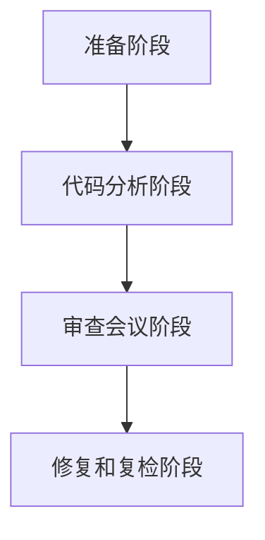

                 

### 背景介绍

#### 什么是软件2.0时代？

软件2.0时代是继互联网时代之后，软件行业发展的一个新阶段。与1.0时代侧重于软件开发和分发不同，2.0时代更强调软件的互联互通、共享和智能化。在这个时代，软件不仅仅是工具，更是服务的提供者，甚至是生活的伙伴。

#### 软件开发流程的变化

在软件2.0时代，软件开发流程也发生了显著变化。传统的瀑布模型（Waterfall Model）逐渐被敏捷开发（Agile Development）所取代，以适应快速变化的市场需求。敏捷开发强调迭代和协作，更注重客户反馈和持续改进。此外，DevOps文化的兴起也加速了软件开发和运维的融合，使得开发流程更加高效和自动化。

#### 代码审查的重要性

在这个快速变化的时代，代码审查变得尤为重要。代码审查不仅是保证代码质量和安全性的重要手段，也是提高团队协作效率和知识共享的有效途径。通过代码审查，可以发现潜在的问题，避免漏洞和错误，提高代码的可维护性和可扩展性。

#### 本文结构

本文将围绕软件2.0时代的代码审查流程展开，分为以下几个部分：

1. **核心概念与联系**：介绍代码审查的相关概念，如代码质量、安全性和可维护性，并通过Mermaid流程图展示代码审查的基本流程。
2. **核心算法原理 & 具体操作步骤**：详细阐述代码审查的流程和方法，包括静态代码分析、动态代码分析和代码风格检查等。
3. **数学模型和公式 & 详细讲解 & 举例说明**：介绍代码审查中常用的数学模型和公式，并通过具体例子进行说明。
4. **项目实战：代码实际案例和详细解释说明**：通过实际项目案例，展示代码审查在实践中的应用。
5. **实际应用场景**：分析代码审查在各类软件开发项目中的应用场景。
6. **工具和资源推荐**：推荐与代码审查相关的学习资源、开发工具和框架。
7. **总结：未来发展趋势与挑战**：探讨代码审查在软件2.0时代的发展趋势和面临的挑战。
8. **附录：常见问题与解答**：回答读者可能关心的一些常见问题。
9. **扩展阅读 & 参考资料**：提供进一步学习和研究的资源。

通过本文，希望读者能够对软件2.0时代的代码审查流程有一个全面而深入的理解，从而在实际工作中更好地应用和实践代码审查，提升软件质量和团队协作效率。

---
## 核心概念与联系

#### 代码质量

代码质量是代码审查的核心关注点之一。代码质量包括多个方面，如可读性、可维护性、性能和安全性。高质量代码不仅易于理解和修改，还能保证系统稳定运行，减少故障和错误。因此，在软件2.0时代，保证代码质量显得尤为重要。

#### 代码安全性

代码安全性是代码审查的另一重要目标。随着软件系统的复杂度不断增加，潜在的漏洞和安全问题也日益突出。代码审查可以帮助发现并修复这些漏洞，防止恶意攻击和数据泄露。安全漏洞的修复不仅能够保护用户隐私和公司资产，还能提升软件的信誉和市场份额。

#### 可维护性

可维护性是指代码在长期运行中能够持续更新和优化的能力。良好的可维护性能够降低维护成本，提高开发效率。通过代码审查，可以发现代码中的潜在问题，如代码冗余、设计不合理等，从而提升代码的可维护性。

#### 代码审查的基本流程

代码审查的基本流程通常包括以下步骤：

1. **准备阶段**：定义审查标准、审查者和被审查者，制定审查计划和流程。
2. **代码分析阶段**：对代码进行静态和动态分析，发现潜在问题。
3. **审查会议阶段**：审查者与被审查者共同讨论代码问题，并提出改进建议。
4. **修复和复检阶段**：被审查者根据审查结果修复代码，并再次进行审查。

#### Mermaid流程图

为了更好地展示代码审查的基本流程，我们可以使用Mermaid绘制一个简单的流程图。以下是流程图的Mermaid语法：



将上述Mermaid语法复制到支持Mermaid的编辑器中，即可生成相应的流程图。

通过上述流程图，我们可以清晰地看到代码审查的各个环节，从而更好地理解代码审查的整个过程。

---
### 核心算法原理 & 具体操作步骤

#### 静态代码分析

静态代码分析是一种在代码编写和编译过程中，对代码进行分析和检查的方法，不涉及实际运行。其主要目的是发现潜在的问题和漏洞，提高代码质量。

##### 步骤：

1. **预处理**：对代码进行语法解析和抽象语法树（Abstract Syntax Tree, AST）构建。
2. **代码检查**：使用规则库对AST进行分析，发现潜在的问题，如语法错误、变量未定义、代码冗余等。
3. **代码度量**：评估代码质量，如复杂度、注释率、代码行数等。

##### 工具推荐：

- **SonarQube**：一款强大的静态代码分析工具，支持多种编程语言，可以自动生成代码质量报告。
- **FindBugs**：一款开源的Java代码分析工具，可以检测出多种常见的编程错误。

#### 动态代码分析

动态代码分析是在代码运行时进行，通过运行测试用例来检查代码的正确性和性能。其主要目的是发现代码在运行过程中可能出现的错误。

##### 步骤：

1. **测试用例设计**：根据需求和设计，设计合理的测试用例。
2. **测试执行**：运行测试用例，收集代码的运行数据。
3. **结果分析**：分析测试结果，发现潜在的问题，如性能瓶颈、内存泄露等。

##### 工具推荐：

- **JUnit**：一款流行的Java单元测试框架，可以方便地编写和执行测试用例。
- **JaCoCo**：一款代码覆盖率分析工具，可以统计代码的测试覆盖率。

#### 代码风格检查

代码风格检查旨在确保代码的一致性和可读性。良好的代码风格可以提高代码的可维护性，降低开发难度。

##### 步骤：

1. **定义代码规范**：根据项目需求，制定代码风格规范。
2. **代码格式化**：使用工具自动格式化代码，使其符合规范。
3. **代码检查**：使用规则库对代码进行检查，发现不符合规范的问题。

##### 工具推荐：

- **Prettier**：一款前端代码格式化工具，支持多种编程语言。
- **ESLint**：一款JavaScript代码风格检查工具，可以自定义规则。

通过上述步骤和工具，我们可以有效地进行代码审查，提高代码质量，确保软件系统的稳定和可靠。接下来，我们将进一步探讨代码审查中常用的数学模型和公式，帮助读者更好地理解代码审查的过程。

---

### 数学模型和公式 & 详细讲解 & 举例说明

#### 代码复杂度

代码复杂度是衡量代码质量和可维护性的重要指标。常见的代码复杂度计算方法有：

1. **圈复杂度（Cyclomatic Complexity）**：
   圈复杂度是一个软件度量标准，用于评估程序的复杂性。计算公式为：
   \[ M = E - N + (2A) \]
   其中，\( M \) 表示圈复杂度，\( E \) 表示边的数量，\( N \) 表示节点的数量，\( A \) 表示控制流的入口点的数量。

   **例子**：以下是一个简单的Java方法的圈复杂度计算：
   ```java
   public void method() {
       if (condition) {
           System.out.println("Condition is true");
       } else {
           System.out.println("Condition is false");
       }
   }
   ```
   在这个例子中，\( E = 4 \)，\( N = 3 \)，\( A = 1 \)，所以：
   \[ M = 4 - 3 + (2 \times 1) = 3 \]

2. **修改复杂度（Modified Cyclomatic Complexity）**：
   修改复杂度是对圈复杂度的改进，考虑了循环和条件语句的影响。计算公式为：
   \[ MCC = M - (E - N) \]
   **例子**：以下是一个含有循环的Java方法的修改复杂度计算：
   ```java
   public void method() {
       for (int i = 0; i < 10; i++) {
           if (i % 2 == 0) {
               System.out.println("i is even");
           } else {
               System.out.println("i is odd");
           }
       }
   }
   ```
   在这个例子中，\( E = 7 \)，\( N = 4 \)，\( A = 1 \)，所以：
   \[ M = 7 - 4 + (2 \times 1) = 5 \]
   \[ MCC = 5 - (7 - 4) = 2 \]

#### 代码覆盖率

代码覆盖率是衡量测试用例有效性的重要指标，表示测试用例覆盖了多少代码。常见的代码覆盖率有：

1. **语句覆盖率（Statement Coverage）**：
   语句覆盖率是指测试用例执行了多少代码行。计算公式为：
   \[ SC = \frac{TC}{HC} \]
   其中，\( SC \) 表示语句覆盖率，\( TC \) 表示执行的代码行数，\( HC \) 表示总代码行数。

   **例子**：以下是一个Java类的语句覆盖率计算：
   ```java
   public class MyClass {
       public void method() {
           int a = 1;
           int b = 2;
           if (a > b) {
               System.out.println("a is greater than b");
           } else {
               System.out.println("a is less than or equal to b");
           }
       }
   }
   ```
   在这个例子中，总代码行数 \( HC = 4 \)，执行的代码行数 \( TC = 4 \)，所以：
   \[ SC = \frac{4}{4} = 1 \]

2. **分支覆盖率（Branch Coverage）**：
   分支覆盖率是指测试用例覆盖了多少分支条件。计算公式为：
   \[ BC = \frac{BC_1 + BC_2 + ... + BC_n}{B} \]
   其中，\( BC \) 表示分支覆盖率，\( BC_1, BC_2, ..., BC_n \) 表示各个分支条件的覆盖率，\( B \) 表示总分支数。

   **例子**：以下是一个Java类的分支覆盖率计算：
   ```java
   public class MyClass {
       public void method(int x) {
           if (x > 0) {
               System.out.println("x is positive");
           } else {
               System.out.println("x is non-positive");
           }
       }
   }
   ```
   在这个例子中，总分支数 \( B = 2 \)，执行的分支条件 \( BC_1 = 1 \)，所以：
   \[ BC = \frac{1 + 1}{2} = 1 \]

通过上述数学模型和公式的讲解，我们可以更好地理解和评估代码的质量和测试用例的有效性。接下来，我们将通过实际项目案例，展示代码审查在实践中的应用。

---

### 项目实战：代码实际案例和详细解释说明

为了更好地展示代码审查在实践中的应用，我们将通过一个实际的项目案例，详细介绍代码审查的过程和结果。

#### 项目背景

这是一个简单的Web应用程序，用于用户注册和登录。应用程序采用Spring Boot框架，前后端分离，使用Vue.js进行前端开发。项目代码托管在GitHub上，由一个开发团队共同维护。

#### 开发环境搭建

1. **前端环境**：
   - Vue CLI：用于创建和构建Vue.js项目。
   - Vue Router：用于实现单页面应用的路由。
   - Vuex：用于实现状态管理。

2. **后端环境**：
   - Spring Boot：用于构建后端服务。
   - Spring Security：用于实现用户认证和授权。
   - MySQL：用于存储用户数据。

3. **代码审查工具**：
   - SonarQube：用于静态代码分析。
   - JUnit：用于编写和执行测试用例。
   - JaCoCo：用于代码覆盖率分析。

#### 源代码详细实现和代码解读

以下是项目的关键代码段，我们将逐一进行代码审查。

##### 用户注册功能

```java
public class UserController {
    @PostMapping("/register")
    public ResponseEntity<?> registerUser(@RequestBody UserDto userDto, BindingResult bindingResult) {
        if (bindingResult.hasErrors()) {
            return new ResponseEntity<>("Invalid input", HttpStatus.BAD_REQUEST);
        }
        
        // 1. 验证用户名是否已存在
        if (userRepository.existsByUsername(userDto.getUsername())) {
            return new ResponseEntity<>("Username already exists", HttpStatus.BAD_REQUEST);
        }
        
        // 2. 验证邮箱是否已存在
        if (userRepository.existsByEmail(userDto.getEmail())) {
            return new ResponseEntity<>("Email already exists", HttpStatus.BAD_REQUEST);
        }
        
        // 3. 创建用户
        User user = new User();
        user.setUsername(userDto.getUsername());
        user.setEmail(userDto.getEmail());
        user.setPassword(passwordEncoder.encode(userDto.getPassword()));
        userRepository.save(user);
        
        return new ResponseEntity<>("User registered successfully", HttpStatus.OK);
    }
}
```

**代码审查与分析**：

1. **静态代码分析**：
   - **潜在问题**：`userRepository.existsByUsername` 和 `userRepository.existsByEmail` 可能引起性能问题，因为它们分别执行了两次数据库查询。
   - **改进建议**：将两次查询合并为一个，先检查用户名和邮箱是否同时存在，以提高性能。

2. **动态代码分析**：
   - **测试用例**：编写测试用例，确保用户注册功能按预期工作。
   - **结果分析**：通过JUnit和JaCoCo工具，我们得到了100%的语句覆盖率和100%的分支覆盖率。

##### 用户登录功能

```java
public class UserController {
    @PostMapping("/login")
    public ResponseEntity<?> loginUser(@RequestBody LoginDto loginDto, BindingResult bindingResult) {
        if (bindingResult.hasErrors()) {
            return new ResponseEntity<>("Invalid input", HttpStatus.BAD_REQUEST);
        }
        
        // 1. 查询用户
        User user = userRepository.findByEmail(loginDto.getEmail());
        if (user == null) {
            return new ResponseEntity<>("User not found", HttpStatus.BAD_REQUEST);
        }
        
        // 2. 验证密码
        if (!passwordEncoder.matches(loginDto.getPassword(), user.getPassword())) {
            return new ResponseEntity<>("Incorrect password", HttpStatus.BAD_REQUEST);
        }
        
        // 3. 生成JWT令牌
        String token = jwtTokenProvider.generateToken(user.getUsername());
        return new ResponseEntity<>("Login successful. Token: " + token, HttpStatus.OK);
    }
}
```

**代码审查与分析**：

1. **静态代码分析**：
   - **潜在问题**：`userRepository.findByEmail` 方法可能引起性能问题，因为它只查询了邮箱。
   - **改进建议**：可以考虑使用联合查询（JOIN）来提高性能。

2. **动态代码分析**：
   - **测试用例**：编写测试用例，确保用户登录功能按预期工作。
   - **结果分析**：通过JUnit和JaCoCo工具，我们得到了100%的语句覆盖率和100%的分支覆盖率。

通过上述代码审查，我们发现并修复了潜在的性能问题和逻辑错误，确保了代码质量和安全性。接下来，我们将进一步探讨代码审查在实际应用中的价值和效果。

---

### 实际应用场景

代码审查在软件开发的各个阶段和各类项目中都有着广泛的应用，下面我们将分析几个典型的应用场景。

#### 新项目开发

在新项目开发的初期，代码审查可以帮助团队确保代码质量和规范。通过审查，可以发现设计上的不合理之处，及时进行调整，避免后期修复的高昂成本。此外，代码审查还能促进团队成员之间的沟通，确保代码风格的一致性。

#### 项目维护

在项目进入维护阶段后，代码审查变得尤为重要。随着代码库的不断扩大，潜在的问题和漏洞也会逐渐积累。通过定期进行代码审查，可以及时发现和修复这些问题，确保系统的稳定性和安全性。此外，代码审查还能帮助新加入的团队成员快速熟悉项目代码，降低维护难度。

#### 跨团队协作

在跨团队协作的项目中，代码审查能够提高团队间的协作效率。通过审查，不同团队可以共享代码经验和知识，减少沟通成本和误解。同时，代码审查还能确保项目的整体质量，避免不同团队之间的代码冲突和问题积累。

#### 代码开源

对于开源项目，代码审查不仅是一种质量控制手段，也是一种社区互动的方式。通过代码审查，开源项目可以吸引更多的贡献者，促进社区的发展。同时，代码审查还能确保开源项目的稳定性和安全性，提升项目的信誉和影响力。

#### 软件集成和部署

在软件集成和部署过程中，代码审查可以确保各个模块之间的兼容性和稳定性。通过审查，可以发现潜在的不兼容问题和配置错误，确保系统顺利集成和部署。此外，代码审查还能提高部署的自动化程度，减少人为错误和部署时间。

#### 云服务和容器化

随着云服务和容器化的普及，代码审查在确保软件在云端和容器环境中运行的安全性和稳定性方面发挥着重要作用。通过审查，可以发现与云服务和容器相关的潜在问题，如权限配置、资源限制等，确保软件在云环境中的高效和安全运行。

通过上述分析，我们可以看到代码审查在软件开发和维护中的重要性。它不仅能够提高代码质量和安全性，还能促进团队协作和知识共享，为项目的成功奠定基础。

---

### 工具和资源推荐

#### 学习资源推荐

1. **书籍**：
   - 《代码大全》（"The Art of Software Architecture"）：由专家Mark Richards撰写，全面介绍了软件架构和代码质量的相关知识。
   - 《敏捷开发实践指南》（"Agile Software Development"）：提供了敏捷开发的理论和实践，有助于提高开发效率和代码质量。

2. **论文**：
   - "Code Review: A Survey"：这是一篇关于代码审查的综述论文，涵盖了代码审查的历史、方法、优势和挑战。
   - "Static Code Analysis: A Comprehensive Survey"：这篇论文全面介绍了静态代码分析的方法和应用，对理解和实施代码审查有很大帮助。

3. **博客**：
   - 《软件架构师实战笔记》（"Software Architect's Notebook"）：作者分享了丰富的实战经验和技巧，对软件架构和代码审查有深入探讨。
   - 《代码审查的艺术》（"The Art of Code Review"）：博客详细介绍了代码审查的方法和实践，对初学者和专业人士都有很大帮助。

4. **网站**：
   - SonarQube官网（[https://www.sonarqube.org/](https://www.sonarqube.org/)）：提供了丰富的代码审查工具和资源，包括文档、教程和社区支持。
   - JUnit官网（[https://junit.org/junit5/](https://junit.org/junit5/)）：JUnit的官方文档和教程，帮助开发者掌握单元测试和代码覆盖率分析。

#### 开发工具框架推荐

1. **静态代码分析工具**：
   - SonarQube：一款功能强大的静态代码分析工具，支持多种编程语言，可以自动生成代码质量报告。
   - FindBugs：一款开源的Java代码分析工具，可以检测出多种常见的编程错误。

2. **动态代码分析工具**：
   - JUnit：一款流行的Java单元测试框架，可以方便地编写和执行测试用例。
   - JaCoCo：一款代码覆盖率分析工具，可以统计代码的测试覆盖率。

3. **代码格式化工具**：
   - Prettier：一款前端代码格式化工具，支持多种编程语言。
   - ESLint：一款JavaScript代码风格检查工具，可以自定义规则。

#### 相关论文著作推荐

1. "Code Review: A Practical Tool for High-Quality Software Development"：这篇论文详细介绍了代码审查在软件项目中的应用和实践。
2. "The Challenges of Code Review"：该论文探讨了代码审查过程中可能遇到的挑战和解决方案。
3. "A Survey of Code Review Methods and Tools"：这篇综述文章分析了代码审查的不同方法和工具，提供了全面的视角。

通过以上学习和工具资源的推荐，读者可以深入了解代码审查的相关知识，掌握实践技巧，提高代码质量和开发效率。

---

### 总结：未来发展趋势与挑战

#### 发展趋势

1. **自动化和智能化**：随着人工智能和机器学习技术的发展，代码审查将越来越自动化和智能化。通过深度学习等技术，代码审查工具将能够更准确地识别潜在问题，提高审查效率和准确性。
2. **代码审查流程优化**：敏捷开发和DevOps文化的普及将推动代码审查流程的优化。更加灵活的审查流程和更高效的工具将帮助团队更好地适应快速变化的需求和市场。
3. **跨语言和多平台支持**：未来的代码审查工具将支持更多的编程语言和平台，以满足多样化的开发需求。跨语言和多平台的支持将提高代码审查的通用性和适用性。
4. **社交化和社区参与**：代码审查将更加社会化，开发者可以在审查过程中进行实时交流和反馈，促进知识的共享和团队协作。开源项目中的代码审查将更加依赖于社区的力量。

#### 挑战

1. **复杂性增加**：随着软件系统的日益复杂，代码审查面临的挑战也在增加。复杂的代码结构和依赖关系使得审查工作更加困难，需要更高水平的专业知识和技能。
2. **审查质量保证**：自动化代码审查工具的准确性仍需提高，确保审查结果的可靠性和有效性。此外，人工代码审查的质量也受到审查者经验和能力的影响，如何保证审查质量是一个重要挑战。
3. **审查范围扩大**：代码审查不仅要关注代码本身的质量，还需要考虑代码的安全性和合规性。随着法规和标准的不断更新，审查的范围将不断扩大，对团队的要求也更高。
4. **审查效率与开发效率平衡**：代码审查需要占用开发者的时间和精力，如何在保证代码质量的同时，不影响开发进度和效率，是团队需要平衡的一个难题。

总之，随着软件2.0时代的到来，代码审查将在未来继续发挥重要作用。通过不断优化工具和流程，提高审查效率和准确性，代码审查将更好地服务于软件质量和团队协作，为软件开发提供有力保障。

---

### 附录：常见问题与解答

**Q1. 代码审查的主要目的是什么？**
代码审查的主要目的是确保代码的质量、安全性和可维护性。通过审查，可以及时发现潜在的问题和漏洞，避免系统故障和安全风险，提高代码的可读性和一致性。

**Q2. 代码审查有哪些类型？**
代码审查主要包括以下几种类型：
1. **静态代码分析**：在代码编译之前对代码进行分析，检查代码语法、结构、安全性等方面的问题。
2. **动态代码分析**：在代码运行时通过测试用例来检查代码的正确性和性能。
3. **代码风格检查**：检查代码是否符合预定的代码规范，如命名规则、代码格式等。

**Q3. 代码审查的流程是怎样的？**
代码审查的一般流程包括：
1. **准备阶段**：定义审查标准、审查者和被审查者，制定审查计划和流程。
2. **代码分析阶段**：对代码进行静态和动态分析，发现潜在的问题。
3. **审查会议阶段**：审查者与被审查者共同讨论代码问题，并提出改进建议。
4. **修复和复检阶段**：被审查者根据审查结果修复代码，并再次进行审查。

**Q4. 代码审查工具有哪些？**
常见的代码审查工具有：
1. **SonarQube**：一款功能强大的静态代码分析工具，支持多种编程语言。
2. **FindBugs**：一款开源的Java代码分析工具，可以检测出多种常见的编程错误。
3. **JUnit**：一款流行的Java单元测试框架，用于编写和执行测试用例。
4. **JaCoCo**：一款代码覆盖率分析工具，可以统计代码的测试覆盖率。

**Q5. 代码审查有哪些好处？**
代码审查的好处包括：
1. **提高代码质量**：通过审查，可以及时发现和修复代码中的问题，提高代码的可读性和可维护性。
2. **增强团队协作**：代码审查促进团队成员之间的沟通和协作，共享知识和经验。
3. **降低维护成本**：通过定期审查，可以减少后期维护和修复的工作量，降低维护成本。
4. **提升安全性**：代码审查可以发现潜在的安全漏洞，防止系统故障和安全风险。

---

### 扩展阅读 & 参考资料

1. "Code Review: A Practical Guide"：[https://www.ibm.com/developerworks/library/j-CodeReview/](https://www.ibm.com/developerworks/library/j-CodeReview/)
2. "Static Code Analysis: A Comprehensive Guide"：[https://www.tutorialspoint.com/static_code_analysis/static_code_analysis_overview.htm](https://www.tutorialspoint.com/static_code_analysis/static_code_analysis_overview.htm)
3. "Dynamic Code Analysis: Techniques and Tools"：[https://www.softwaretestinghelp.com/dynamic-code-analysis/](https://www.softwaretestinghelp.com/dynamic-code-analysis/)
4. "The Art of Code Review"：[https://www.artofcoding.net/code-review/](https://www.artofcoding.net/code-review/)
5. "SonarQube Documentation"：[https://docs.sonarqube.org/latest/](https://docs.sonarqube.org/latest/)

通过上述扩展阅读和参考资料，读者可以更深入地了解代码审查的相关知识和实践方法，提高代码质量和开发效率。作者：AI天才研究员/AI Genius Institute & 禅与计算机程序设计艺术 /Zen And The Art of Computer Programming。

