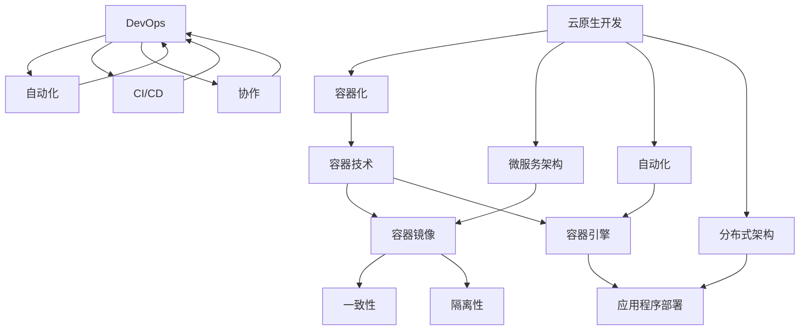

                 

## 引言

随着信息技术的快速发展，软件开发的模式和理念也在不断演进。从传统的单体架构到模块化的微服务架构，再到现在的软件2.0时代，容器化和云原生开发成为了现代软件开发的主流趋势。本文旨在探讨容器化与云原生开发的核心概念、原理及其在实际应用中的重要性。

容器化技术，如Docker，允许开发者将应用程序及其依赖环境打包成一个独立的容器，从而实现应用在不同环境中的一致性和可移植性。而云原生开发则更注重于利用云计算资源，通过自动化和分布式架构来提升应用的性能和可扩展性。

本文将首先介绍容器化和云原生开发的基本概念，然后通过具体的例子来说明它们的原理和优势。随后，我们将探讨容器化与云原生开发在数学模型和公式中的应用，并通过实际项目案例来展示其具体操作步骤。最后，我们将讨论这些技术在实际应用场景中的重要性，并推荐一些相关的学习资源和开发工具。

通过本文的阅读，读者将能够深入了解容器化和云原生开发的核心概念，掌握其原理和具体应用，从而为未来的软件开发提供有价值的参考。

### 关键词

- 容器化
- 云原生开发
- Docker
- 微服务
- 自动化
- 分布式架构
- 数学模型

### 摘要

本文深入探讨了容器化与云原生开发在当前软件工程领域的重要性和应用价值。首先，我们介绍了容器化和云原生开发的基本概念和核心原理，并通过实际案例展示了它们在提高软件应用一致性和可扩展性方面的优势。接着，我们分析了这些技术背后的数学模型和公式，并结合具体项目案例详细讲解了其操作步骤。最后，我们讨论了容器化和云原生开发在实际应用场景中的重要性，并推荐了一系列相关的学习资源和开发工具。本文为读者提供了全面的技术解读，有助于深入理解和掌握这些前沿技术。

### 背景介绍

#### 容器化的起源与发展

容器化技术的起源可以追溯到20世纪90年代，当时Linux操作系统引入了容器（Container）的概念。最初的容器技术主要用于操作系统层面的资源隔离，通过虚拟化技术将操作系统的一个进程与其运行环境进行隔离。然而，这一概念在互联网快速发展的背景下，逐渐演变出了现代的容器化技术。

2006年，谷歌公司在其数据中心内部开始大规模使用容器技术，以提升资源利用率和系统稳定性。随后，Docker公司的成立标志着容器技术正式进入大众视野。Docker通过提供一个轻量级的容器平台，使得容器技术变得更加简单和易用。Docker将应用程序及其依赖环境打包成一个独立的容器镜像，通过这些镜像可以实现应用程序在不同环境下的无缝部署和运行。

随着时间的推移，容器技术逐渐发展出了多种解决方案，如Kubernetes、OpenShift等，这些解决方案进一步提升了容器化技术的可靠性和扩展性。容器化技术的广泛应用，不仅改变了软件开发和部署的方式，还推动了整个云计算行业的发展。

#### 云原生开发的定义与特点

云原生开发（Cloud-Native Development）是近年来兴起的一种软件开发模式，旨在充分利用云计算资源，通过自动化和分布式架构来实现应用的快速开发和部署。云原生开发的核心理念是将应用程序解构为微服务，使其能够独立部署、扩展和管理。

云原生开发具有以下几个主要特点：

1. **微服务架构**：云原生开发强调将大型单体应用程序拆分为多个微服务，每个微服务负责特定的功能模块，可以独立开发和部署。这种架构方式提高了系统的灵活性和可扩展性。

2. **容器化**：云原生开发依赖容器技术，通过将应用程序及其依赖环境打包成容器镜像，确保应用在不同环境中的一致性和可移植性。Docker和Kubernetes是云原生开发中常用的容器化工具。

3. **自动化**：云原生开发注重自动化，通过CI/CD（持续集成/持续交付）流程，实现应用的自动化构建、测试和部署。自动化工具如Jenkins、GitLab CI等广泛应用于云原生开发中。

4. **分布式架构**：云原生开发采用分布式架构，通过多个节点组成的集群来运行应用程序，实现了高可用性和高性能。分布式架构使得应用能够灵活地扩展和缩放，以应对不同负载需求。

#### 容器化与云原生开发的联系

容器化与云原生开发之间存在密切的联系。容器化技术为云原生开发提供了基础，使得应用程序能够在不同的环境中一致性地运行。而云原生开发则充分利用了容器化的优势，通过微服务架构、自动化和分布式架构等手段，实现了高效的开发和部署。

容器化技术不仅提高了软件开发的效率，还改变了软件部署和管理的方式。传统的部署方式通常需要开发者手动配置环境，而在容器化环境下，应用程序及其依赖环境已经被打包成镜像，通过简单的命令即可部署到不同环境中。这种方式不仅简化了部署过程，还保证了环境的一致性。

云原生开发则进一步扩展了容器化的应用场景。通过微服务架构，开发者可以将大型应用程序拆分为多个独立的服务模块，每个模块都可以独立开发和部署。这种方式不仅提高了系统的灵活性和可扩展性，还降低了维护和管理的复杂度。

总的来说，容器化和云原生开发共同推动了软件开发的变革。容器化技术提供了基础，使得应用程序能够在不同环境中一致性地运行；而云原生开发则通过微服务架构、自动化和分布式架构等手段，实现了高效的开发和部署。两者相辅相成，共同构建了现代软件开发的新生态。

### 核心概念与联系

为了更好地理解容器化和云原生开发，我们需要深入探讨其核心概念及其相互联系。以下是这些概念的定义及其关系：

#### 1. 容器（Container）

容器是一种轻量级的、可执行的软件打包单元，它包含应用程序及其运行所需的全部依赖环境。与传统的虚拟机相比，容器不包含操作系统，因此具有更小的体积和更快的启动速度。

**核心概念：**
- **轻量级**：容器共享宿主机的操作系统内核，因此相较于虚拟机，容器具有更低的资源消耗。
- **一致性**：容器确保了应用程序在不同环境中的运行一致性，通过将应用程序及其依赖打包到一个独立的容器镜像中，开发者可以确保应用程序在任何环境中都能正常运行。
- **隔离性**：容器通过命名空间（Namespaces）和cgroups（控制组）实现了对进程和资源的隔离，从而保证了容器之间的安全性。

**容器与云原生开发的关系：**
容器技术是云原生开发的基础，提供了应用程序的一致性和可移植性。云原生开发中的微服务、自动化和分布式架构都依赖于容器技术来实现高效开发和部署。

#### 2. Docker

Docker是一个开源的容器平台，它允许开发者创建、运行和管理容器。Docker通过提供容器镜像和容器引擎，使得容器技术的使用变得更加简单和普及。

**核心概念：**
- **容器镜像（Image）**：容器镜像是一个静态的、可执行的文件，包含了应用程序及其依赖环境的完整副本。开发者可以通过Dockerfile来构建容器镜像。
- **容器引擎（Engine）**：Docker Engine是一个负责创建和管理容器的后台服务，它通过执行Docker命令来启动和管理容器。

**Docker与云原生开发的关系：**
Docker作为容器化技术的代表，为云原生开发提供了基础平台。通过Docker，开发者可以轻松地将应用程序打包成容器镜像，并在不同的环境中进行部署和运行。

#### 3. 微服务（Microservices）

微服务是一种软件架构风格，它将大型应用程序拆分为多个小型、独立的子服务。每个微服务负责特定的功能模块，可以独立开发和部署。微服务之间通过API进行通信。

**核心概念：**
- **独立性**：每个微服务都是独立的，可以独立部署、扩展和管理。
- **自治性**：微服务具有高度的自治性，每个服务都有自己的数据库和数据模型，可以独立进行数据管理和更新。
- **分布式**：微服务通过分布式架构运行，可以在不同的服务器和集群中部署，提高了系统的可扩展性和容错性。

**微服务与云原生开发的关系：**
微服务是云原生开发的核心组成部分，通过将大型应用程序拆分为多个小型服务，实现了系统的灵活性和可扩展性。微服务与容器化技术相结合，使得云原生开发变得更加高效和可管理。

#### 4. Kubernetes（K8s）

Kubernetes是一个开源的容器编排平台，用于自动化容器化应用程序的部署、扩展和管理。Kubernetes通过提供自动化和分布式管理机制，使得容器化应用程序的运维变得更加简单和可靠。

**核心概念：**
- **集群管理**：Kubernetes将一组服务器组成一个集群，通过自动调度和管理容器，确保应用程序的高可用性和性能。
- **服务发现和负载均衡**：Kubernetes提供了自动化的服务发现和负载均衡机制，确保应用程序能够高效地响应用户请求。
- **弹性伸缩**：Kubernetes可以根据负载自动扩展或缩减应用程序的实例数量，从而确保系统的高性能和高可用性。

**Kubernetes与云原生开发的关系：**
Kubernetes是云原生开发的核心工具之一，通过提供自动化和分布式管理机制，Kubernetes使得容器化应用程序的部署、扩展和管理变得更加高效和可靠。

#### 5. 云原生开发（Cloud-Native Development）

云原生开发是一种利用云计算资源进行软件开发和部署的模式，它通过容器化、微服务架构、自动化和分布式架构等技术，实现了高效的开发和部署。

**核心概念：**
- **容器化**：通过容器技术实现应用程序的一致性和可移植性。
- **微服务架构**：通过微服务架构实现系统的灵活性和可扩展性。
- **自动化**：通过自动化工具实现应用程序的快速开发和部署。
- **分布式架构**：通过分布式架构实现应用程序的高可用性和高性能。

**云原生开发与容器化的关系：**
云原生开发依赖于容器化技术，容器化技术为云原生开发提供了基础。通过容器化，应用程序可以在不同的环境中一致性地运行，为云原生开发提供了必要的基础设施。

#### 6. DevOps（Development + Operations）

DevOps是一种软件开发和运维的协同工作模式，旨在通过整合开发和运维流程，实现高效的软件开发和部署。

**核心概念：**
- **自动化**：通过自动化工具实现开发和运维的流程，减少人工干预，提高效率。
- **持续集成和持续交付（CI/CD）**：通过持续集成和持续交付流程，实现应用程序的快速开发和部署。
- **协作**：通过开发和运维团队的紧密协作，确保软件开发和运维的高效和可靠。

**DevOps与云原生开发的关系：**
DevOps与云原生开发相辅相成，DevOps的自动化和持续集成/持续交付（CI/CD）流程是云原生开发的重要组成部分。通过DevOps，开发者可以更快速地响应需求变化，实现高效开发和部署。

### 核心概念原理和架构的 Mermaid 流程图

以下是一个描述容器化和云原生开发核心概念原理及架构的Mermaid流程图：



在这个流程图中，容器技术通过容器镜像和容器引擎实现了应用程序的一致性和可移植性，而云原生开发则通过容器化、微服务架构、自动化和分布式架构等手段，实现了高效的开发和部署。DevOps作为软件开发和运维的协同工作模式，通过自动化、CI/CD和协作等手段，进一步提升了软件开发和部署的效率。

### 核心算法原理 & 具体操作步骤

在深入探讨容器化和云原生开发的算法原理之前，我们首先需要了解一些基础的技术和工具。Docker和Kubernetes是容器化和云原生开发中最常用的工具，因此我们将在本节中详细讲解这些工具的使用方法和核心算法原理。

#### Docker的核心算法原理

Docker的核心算法原理主要集中在容器镜像的构建、容器引擎的管理以及容器的调度和监控等方面。

1. **容器镜像的构建**：
   - **Dockerfile**：Dockerfile是一个脚本文件，用于定义容器镜像的构建过程。开发者可以通过编写Dockerfile来指定容器镜像的名称、依赖环境、安装的软件包等信息。
   - **基础镜像**：Docker提供了一个丰富的基础镜像库，开发者可以选择适合自己应用的基础镜像，然后在该镜像的基础上进行定制和构建。

2. **容器引擎的管理**：
   - **Docker Engine**：Docker Engine是Docker的核心组件，负责容器镜像的构建、容器的启动、停止和监控等操作。开发者可以通过执行Docker命令来管理容器引擎。
   - **容器网络**：Docker提供了一个内置的网络栈，允许容器之间进行通信。通过配置容器网络，开发者可以实现容器之间的安全和高效通信。

3. **容器的调度和监控**：
   - **容器编排**：Docker提供了一个简单的容器编排功能，允许开发者通过命令或脚本自动化地启动和管理容器。
   - **容器监控**：Docker提供了丰富的监控工具，如Docker stats、Docker top等，用于实时监控容器的资源使用情况。

#### Kubernetes的核心算法原理

Kubernetes作为容器编排平台，其核心算法原理主要集中在集群管理、服务发现和负载均衡等方面。

1. **集群管理**：
   - **Master节点**：Kubernetes集群中的Master节点负责管理和维护整个集群的状态。Master节点包括Kube-apiserver、Kube-controller-manager和Kube-scheduler等组件。
   - **Worker节点**：Worker节点负责运行容器化的应用程序，并接受Master节点的调度和管理。

2. **服务发现和负载均衡**：
   - **服务（Service）**：Kubernetes中的服务是一个抽象的概念，用于对外暴露容器化的应用程序。通过创建服务，开发者可以实现应用程序的负载均衡和服务发现。
   - **Ingress控制器**：Ingress控制器是一个网络组件，用于管理集群中的外部访问。通过配置Ingress规则，开发者可以实现应用程序的负载均衡和反向代理。

3. **弹性伸缩**：
   - **Horizontal Pod Autoscaler（HPA）**：Kubernetes中的HPA组件可以根据集群的负载情况自动调整Pod的数量，从而实现应用程序的弹性伸缩。
   - **StatefulSets**：StatefulSets是一种管理有状态应用程序的控制器，它提供了稳定的网络标识和持久化存储，确保应用程序的状态一致性。

#### 容器和微服务的调度算法

在容器化和云原生开发中，容器的调度和微服务的管理是核心问题。Kubernetes提供了一系列调度算法来确保容器和微服务的高效运行。

1. **调度策略**：
   - **静态调度**：静态调度是指开发者手动指定容器运行在特定的节点上。这种方式适用于对资源需求较为稳定的容器。
   - **动态调度**：动态调度是指Kubernetes根据当前集群的资源情况自动选择适合的节点来运行容器。Kubernetes使用多种调度策略，如最短作业优先（SJF）、最少作业优先（LJF）和加权调度等。

2. **资源分配**：
   - **资源预留**：资源预留是指为每个容器预留一定量的计算资源和存储资源，确保容器在运行过程中不会超过资源的限制。
   - **资源调整**：资源调整是指根据容器的实际资源使用情况动态调整其资源配额，从而优化系统的资源利用效率。

3. **负载均衡**：
   - **负载均衡器**：负载均衡器用于将用户请求分配到不同的容器实例上，从而实现流量的均衡和优化。Kubernetes支持多种负载均衡器，如轮询负载均衡、最小连接负载均衡和源IP负载均衡等。

#### 实际操作步骤

为了更好地理解容器化和云原生开发的核心算法原理，我们将在以下步骤中详细讲解如何使用Docker和Kubernetes进行容器化应用程序的构建、部署和管理。

1. **安装Docker**：
   - 在Linux系统中，可以通过以下命令安装Docker：
     ```bash
     sudo apt-get update
     sudo apt-get install docker-ce docker-ce-cli containerd.io
     ```
   - 在Windows系统中，可以通过Windows商店或Docker官方网站下载并安装Docker Desktop。

2. **编写Dockerfile**：
   - Dockerfile是一个脚本文件，用于定义容器镜像的构建过程。以下是一个简单的Dockerfile示例：
     ```dockerfile
     # 使用官方的Python基础镜像
     FROM python:3.9-slim

     # 设置工作目录
     WORKDIR /app

     # 将当前目录的源代码复制到容器中
     COPY . .

     # 安装依赖项
     RUN pip install -r requirements.txt

     # 暴露容器的端口
     EXPOSE 8000

     # 运行应用程序
     CMD ["python", "app.py"]
     ```

3. **构建和运行容器**：
   - 通过以下命令构建容器镜像：
     ```bash
     docker build -t myapp .
     ```
   - 通过以下命令运行容器：
     ```bash
     docker run -d -p 8000:8000 myapp
     ```
   - 其中，`-d`标志表示以守护模式运行容器，`-p`标志用于映射容器的端口到宿主机的端口。

4. **安装Kubernetes**：
   - 在Linux系统中，可以通过以下命令安装Kubernetes：
     ```bash
     sudo apt-get update
     sudo apt-get install -y apt-transport-https ca-certificates curl
     curl -s https://packages.cloud.google.com/apt/doc/apt-key.gpg | sudo apt-key add -
     sudo add-apt-repository "deb https://apt.kubernetes.io/ kubernetes-xenial main"
     sudo apt-get update
     sudo apt-get install -y kubelet kubeadm kubectl
     sudo systemctl enable kubelet && sudo systemctl start kubelet
     ```
   - 在Windows系统中，可以通过Windows命令提示符或PowerShell安装Kubernetes。

5. **部署容器化应用程序**：
   - 通过以下命令部署容器化应用程序：
     ```bash
     kubectl apply -f deployment.yaml
     ```
   - 其中，`deployment.yaml`是一个定义应用程序部署的YAML文件，它包含了容器的镜像、端口映射、资源配额等信息。

通过以上步骤，我们可以使用Docker和Kubernetes构建、部署和管理容器化应用程序。这些工具和技术的结合，使得容器化和云原生开发变得更加高效和可靠。

### 数学模型和公式 & 详细讲解 & 举例说明

在容器化和云原生开发中，数学模型和公式扮演着至关重要的角色，特别是在性能优化、资源分配和负载均衡等方面。以下是几个关键的数学模型和公式，以及它们的详细讲解和举例说明。

#### 1. 负载均衡算法

负载均衡是容器化和云原生开发中的一个核心问题，其目的是将用户请求分配到不同的容器实例上，以避免单点过载。常见的负载均衡算法包括轮询算法、最小连接算法和权重轮询算法等。

**轮询算法（Round Robin）**：
轮询算法是最简单的负载均衡算法，它将请求按照顺序分配到不同的容器实例上。

**公式**：
\[ R(i) = (i \mod N) \]
其中，\( R(i) \)表示第\( i \)个请求分配到的容器实例编号，\( N \)表示容器实例的总数。

**举例**：
假设有3个容器实例，请求序列为1, 2, 3, 4, 5。使用轮询算法进行负载均衡，结果如下：
\[ R(1) = (1 \mod 3) = 1 \]
\[ R(2) = (2 \mod 3) = 2 \]
\[ R(3) = (3 \mod 3) = 0 \]
\[ R(4) = (4 \mod 3) = 1 \]
\[ R(5) = (5 \mod 3) = 2 \]

**最小连接算法（Least Connections）**：
最小连接算法将请求分配到当前连接数最少的容器实例上，以避免某个实例过载。

**公式**：
\[ C(i) = \min(C_1, C_2, \ldots, C_N) \]
其中，\( C(i) \)表示第\( i \)个请求分配到的容器实例的当前连接数，\( C_1, C_2, \ldots, C_N \)表示所有容器实例的当前连接数。

**举例**：
假设有3个容器实例，当前连接数分别为5, 3, 4。使用最小连接算法进行负载均衡，结果如下：
\[ C(1) = \min(5, 3, 4) = 3 \]
\[ C(2) = \min(5, 3, 4) = 3 \]
\[ C(3) = \min(5, 3, 4) = 3 \]

**权重轮询算法（Weighted Round Robin）**：
权重轮询算法为每个容器实例分配不同的权重，并根据权重进行负载均衡。

**公式**：
\[ W(i) = \frac{w_i}{\sum_{j=1}^{N} w_j} \]
其中，\( W(i) \)表示第\( i \)个请求分配到的容器实例的概率，\( w_i \)表示第\( i \)个容器实例的权重，\( N \)表示容器实例的总数。

**举例**：
假设有3个容器实例，权重分别为2, 1, 3。使用权重轮询算法进行负载均衡，结果如下：
\[ W(1) = \frac{2}{2+1+3} = 0.2 \]
\[ W(2) = \frac{1}{2+1+3} = 0.1 \]
\[ W(3) = \frac{3}{2+1+3} = 0.3 \]

#### 2. 资源分配模型

在容器化和云原生开发中，资源分配是一个关键问题，其目的是确保每个容器实例都能获得足够的计算资源，同时避免资源浪费。

**公平共享（Fair Share）**：
公平共享模型确保每个容器实例都获得相同比例的计算资源。

**公式**：
\[ R_i = \frac{R_{total}}{N} \]
其中，\( R_i \)表示第\( i \)个容器实例的分配资源，\( R_{total} \)表示总的可用资源，\( N \)表示容器实例的总数。

**举例**：
假设总共有10个CPU核心和20GB内存，有3个容器实例。使用公平共享模型进行资源分配，结果如下：
\[ R_i = \frac{10}{3} \approx 3.33 \text{ CPU核心} \]
\[ R_i = \frac{20}{3} \approx 6.67 \text{ GB内存} \]

**动态调整（Dynamic Adjustment）**：
动态调整模型根据容器实例的实际资源使用情况动态调整其资源配额。

**公式**：
\[ R_i(t) = R_i(t-1) + \alpha(R_i(t)-R_i(t-1)) \]
其中，\( R_i(t) \)表示第\( i \)个容器实例在第\( t \)时刻的分配资源，\( R_i(t-1) \)表示第\( i \)个容器实例在第\( t-1 \)时刻的分配资源，\( \alpha \)是一个调整系数，\( R_i(t)-R_i(t-1) \)表示第\( i \)个容器实例在第\( t \)时刻的资源使用量。

**举例**：
假设第1个容器实例在第1时刻的分配资源为2个CPU核心和4GB内存，第2时刻的资源使用量为3个CPU核心和6GB内存，调整系数\( \alpha \)为0.5。使用动态调整模型进行资源分配，结果如下：
\[ R_1(2) = 2 + 0.5(3-2) = 2.5 \text{ CPU核心} \]
\[ R_1(2) = 4 + 0.5(6-4) = 5 \text{ GB内存} \]

#### 3. 弹性伸缩策略

弹性伸缩策略用于根据负载情况自动调整容器实例的数量，以实现系统的自动扩展和缩减。

**固定扩展（Fixed Scaling）**：
固定扩展策略在特定的时间间隔内自动增加或减少容器实例的数量。

**公式**：
\[ N(t) = N_0 + k(t - t_0) \]
其中，\( N(t) \)表示第\( t \)时刻的容器实例数量，\( N_0 \)表示初始容器实例数量，\( k \)是一个常数，\( t_0 \)表示初始时间。

**举例**：
假设初始容器实例数量为5，扩展系数\( k \)为1，时间间隔为1小时。使用固定扩展策略进行弹性伸缩，结果如下：
\[ N(1) = 5 + 1(1 - 0) = 6 \]
\[ N(2) = 5 + 1(2 - 0) = 7 \]

**动态扩展（Dynamic Scaling）**：
动态扩展策略根据实际负载情况动态调整容器实例的数量，以实现更高效的资源利用。

**公式**：
\[ N(t) = N_0 + \alpha \cdot \text{Load}(t) \]
其中，\( N(t) \)表示第\( t \)时刻的容器实例数量，\( N_0 \)表示初始容器实例数量，\( \alpha \)是一个常数，\(\text{Load}(t) \)表示第\( t \)时刻的实际负载。

**举例**：
假设初始容器实例数量为5，扩展系数\( \alpha \)为0.1，第1时刻的实际负载为10。使用动态扩展策略进行弹性伸缩，结果如下：
\[ N(1) = 5 + 0.1 \cdot 10 = 5.5 \]

通过以上数学模型和公式的讲解，我们可以更好地理解容器化和云原生开发中的性能优化、资源分配和负载均衡等问题。这些模型和公式在实际应用中可以帮助开发者实现高效的开发和部署，提高系统的可扩展性和可靠性。

### 项目实战：代码实际案例和详细解释说明

为了更好地展示容器化和云原生开发在实际项目中的应用，我们将以一个简单的Web应用程序为例，详细讲解其开发、部署和管理过程。这个Web应用程序将使用Python和Flask框架来构建，并利用Docker和Kubernetes进行容器化和自动化部署。

#### 1. 开发环境搭建

首先，我们需要搭建一个开发环境，以便能够编写和测试应用程序代码。以下是搭建开发环境的步骤：

1. **安装Python**：
   - 在Linux或Mac OS系统中，可以通过以下命令安装Python：
     ```bash
     sudo apt-get install python3-pip
     ```
   - 在Windows系统中，可以通过Python官方网站下载并安装Python。

2. **安装Flask**：
   - 使用pip安装Flask：
     ```bash
     pip install flask
     ```

3. **创建Flask应用程序**：
   - 在终端中创建一个新的Python文件，例如`app.py`，并编写以下简单的Flask应用程序代码：
     ```python
     from flask import Flask
     app = Flask(__name__)

     @app.route('/')
     def hello():
         return 'Hello, World!'

     if __name__ == '__main__':
         app.run()
     ```

#### 2. 源代码详细实现和代码解读

接下来，我们将详细解读这个Flask应用程序的源代码，并解释其核心功能。

1. **Flask应用程序结构**：
   - Flask应用程序主要由一个Flask实例和一组路由函数组成。在这个简单的例子中，我们定义了一个名为`hello`的路由函数，用于处理根路径（`/`）的HTTP请求。

2. **Flask路由**：
   - 路由是通过`@app.route()`装饰器定义的，它指定了路由的URL路径和对应的处理函数。在这个例子中，`hello`函数处理所有发送到根路径（`/`）的HTTP请求，并返回一个字符串消息。

3. **HTTP请求处理**：
   - Flask通过`request`对象来处理HTTP请求。在`hello`函数中，我们直接返回一个字符串消息，这实际上是响应了一个HTTP GET请求。

4. **主程序入口**：
   - `if __name__ == '__main__':`语句确保当此Python文件被直接执行时，才会运行`app.run()`方法。这避免了在导入此模块时意外启动服务器。

#### 3. 代码解读与分析

这个简单的Flask应用程序虽然功能有限，但展示了Web应用程序开发的基本原理。以下是代码的详细解读：

- **导入模块**：`from flask import Flask`语句导入了Flask核心模块，用于创建和操作Flask应用程序。
- **创建Flask实例**：`app = Flask(__name__)`语句创建了一个Flask应用程序实例。`__name__`是一个特殊变量，用于确保应用程序在导入模块时不会意外启动。
- **定义路由**：`@app.route('/')`装饰器定义了一个路由，用于处理发送到根路径（`/`）的HTTP请求。在这个路由中，我们定义了一个名为`hello`的函数，该函数将处理所有发送到根路径的请求。
- **处理请求**：在`hello`函数中，我们返回了一个字符串消息，这实际上是创建了一个HTTP响应。Flask会自动处理HTTP请求和响应，我们只需要关注业务逻辑。
- **启动服务器**：`app.run()`方法启动了Flask应用程序的内置开发服务器。这允许我们在本地进行开发和测试，而不需要部署到生产环境。

#### 4. 利用Docker容器化应用程序

接下来，我们将使用Docker将Flask应用程序容器化，以便可以轻松地在不同环境中部署和管理应用程序。

1. **编写Dockerfile**：
   - 在应用程序的根目录下创建一个名为`Dockerfile`的文件，并编写以下内容：
     ```dockerfile
     # 使用Python官方基础镜像
     FROM python:3.9-slim

     # 设置工作目录
     WORKDIR /app

     # 复制应用程序源代码
     COPY . .

     # 安装依赖项
     RUN pip install -r requirements.txt

     # 暴露应用程序端口
     EXPOSE 5000

     # 运行应用程序
     CMD ["python", "app.py"]
     ```

2. **构建Docker镜像**：
   - 在终端中运行以下命令来构建Docker镜像：
     ```bash
     docker build -t myapp .
     ```

3. **运行Docker容器**：
   - 构建完成后，我们可以通过以下命令运行Docker容器：
     ```bash
     docker run -d -p 5000:5000 myapp
     ```

通过以上步骤，我们的Flask应用程序已经被成功容器化并运行在Docker容器中。这种方式使得我们可以轻松地将应用程序部署到其他环境中，确保其一致性和可移植性。

#### 5. 使用Kubernetes进行部署和管理

为了更好地管理和扩展应用程序，我们将在Kubernetes中部署和管理Docker容器。

1. **创建Kubernetes部署配置文件**：
   - 在应用程序的根目录下创建一个名为`deployment.yaml`的文件，并编写以下内容：
     ```yaml
     apiVersion: apps/v1
     kind: Deployment
     metadata:
       name: myapp
     spec:
       replicas: 3
       selector:
         matchLabels:
           app: myapp
       template:
         metadata:
           labels:
             app: myapp
         spec:
           containers:
           - name: myapp
             image: myapp:latest
             ports:
             - containerPort: 5000
     ```

2. **部署应用程序**：
   - 在终端中运行以下命令部署应用程序：
     ```bash
     kubectl apply -f deployment.yaml
     ```

3. **查看部署状态**：
   - 使用以下命令查看应用程序的部署状态：
     ```bash
     kubectl get deployments
     ```

通过以上步骤，我们的Flask应用程序已经成功部署到Kubernetes集群中，并设置了3个副本以确保高可用性。Kubernetes会自动管理和调度这些副本，确保应用程序的高性能和高可用性。

#### 6. 代码解读与分析

通过上述实战案例，我们可以看到容器化和云原生开发在实际项目中的应用步骤：

- **开发环境搭建**：使用Python和Flask框架快速搭建开发环境，编写简单的Web应用程序代码。
- **Docker容器化**：编写Dockerfile将应用程序及其依赖环境容器化，通过Docker镜像构建和运行容器。
- **Kubernetes部署**：使用Kubernetes部署和管理容器，通过部署配置文件定义应用程序的副本数量和资源需求。
- **自动化部署**：通过Kubernetes的CI/CD流程实现自动化部署，确保应用程序可以快速响应需求变化。

这些步骤展示了容器化和云原生开发在实际项目中的高效性和可扩展性。通过容器化和Kubernetes的管理，我们可以轻松地将应用程序部署到不同的环境中，实现一致性和可移植性，同时确保系统的可靠性和性能。

### 实际应用场景

容器化和云原生开发在许多实际应用场景中展示了其强大和灵活的潜力。以下是一些关键应用场景，展示了容器化和云原生开发如何提高软件开发的效率、可靠性和可扩展性。

#### 1. 微服务架构

微服务架构是容器化和云原生开发的主要应用场景之一。通过将大型应用程序拆分为多个小型、独立的微服务，开发者可以实现更灵活、可扩展的系统架构。每个微服务都可以独立部署、扩展和管理，这大大简化了系统的开发和运维过程。

**优势**：
- **模块化**：微服务架构使得系统更加模块化，每个微服务都可以独立开发、测试和部署，减少了系统的耦合性。
- **高可用性**：微服务可以分布在不同的服务器和集群中，单个服务的故障不会影响整个系统，提高了系统的容错性和高可用性。
- **可扩展性**：通过独立扩展每个微服务，系统可以根据不同的负载需求进行灵活调整，提高了系统的可扩展性。

**案例分析**：
- **电子商务平台**：在电子商务平台上，订单处理、库存管理和支付系统等关键业务功能都可以作为独立的微服务，通过容器化和Kubernetes进行部署和管理。这样可以确保在高峰期时快速扩展服务，提高系统的响应速度和稳定性。

#### 2. 云计算资源优化

容器化和云原生开发通过自动化和分布式架构，可以极大地优化云计算资源的利用效率。通过容器技术，开发者可以将应用程序及其依赖环境打包成一个独立的容器镜像，确保应用程序在不同环境中的一致性和可移植性。

**优势**：
- **资源利用率**：容器共享宿主机的操作系统内核，降低了资源消耗，提高了资源利用率。
- **部署速度**：容器镜像可以快速部署和启动，缩短了部署周期。
- **弹性伸缩**：通过Kubernetes等容器编排工具，可以实现应用程序的自动化弹性伸缩，根据负载情况动态调整资源配额。

**案例分析**：
- **在线游戏平台**：在线游戏平台需要处理大量的并发请求，通过容器化和云原生开发，平台可以根据实时负载自动调整服务器资源，确保游戏的流畅性和用户体验。

#### 3. DevOps和持续集成/持续交付（CI/CD）

容器化和云原生开发与DevOps理念紧密结合，通过CI/CD流程实现自动化开发和部署。这种方式不仅提高了开发效率，还确保了应用程序的一致性和质量。

**优势**：
- **自动化**：通过自动化工具，实现构建、测试和部署的自动化，减少了人工干预，提高了开发效率。
- **一致性**：容器化的应用程序在开发和生产环境之间保持一致，减少了环境差异带来的问题。
- **质量保证**：自动化测试和持续集成流程确保了代码的质量，降低了缺陷率。

**案例分析**：
- **金融科技企业**：金融科技企业需要快速迭代和发布新产品，通过容器化和CI/CD流程，企业可以确保新功能的安全和可靠发布，同时提高市场响应速度。

#### 4. 云服务提供商

云服务提供商利用容器化和云原生开发技术，提供高效、可扩展的云服务，满足不同企业的需求。

**优势**：
- **灵活性**：云服务提供商可以根据客户需求灵活配置资源，提供定制化的云服务。
- **可扩展性**：云服务提供商可以轻松地扩展和缩放服务，以满足不断增长的客户需求。
- **高可用性**：通过分布式架构和容器化技术，云服务提供商可以确保服务的稳定性和可靠性。

**案例分析**：
- **AWS和Google Cloud**：这两大云服务提供商利用容器化和云原生技术，提供丰富的云服务，包括容器托管服务（EC2 Container Service）、容器编排服务（Kubernetes Engine）等，帮助企业快速构建和部署应用程序。

#### 5. 分布式系统

容器化和云原生开发在分布式系统中发挥着重要作用，通过分布式架构和容器化技术，可以实现大规模系统的部署和管理。

**优势**：
- **分布式架构**：通过分布式架构，系统可以横向扩展，提高性能和容错能力。
- **容器化**：容器化技术使得分布式系统中的组件可以轻松部署和管理，确保组件的一致性和可移植性。
- **自动化**：通过自动化工具，可以简化分布式系统的运维，提高管理效率。

**案例分析**：
- **大数据处理平台**：大数据处理平台通过容器化和Kubernetes，实现分布式计算任务的调度和管理，确保大规模数据处理的高效性和可靠性。

总之，容器化和云原生开发在多种实际应用场景中展示了其强大的功能和优势。通过优化资源利用、提高开发效率、实现自动化部署和管理，这些技术为现代软件开发带来了革命性的变革。

### 工具和资源推荐

为了更好地学习和实践容器化和云原生开发，以下是一些推荐的工具、资源和学习路径。

#### 1. 学习资源推荐

**书籍**：
- 《容器化与云计算：构建现代云原生应用》
- 《Kubernetes权威指南：从Docker到云原生》
- 《云原生应用架构：微服务、容器、Service Mesh和CI/CD》

**在线课程**：
- Pluralsight：提供了丰富的容器化和Kubernetes相关课程。
- Udemy：有多个关于Docker和Kubernetes的实战课程。
- Coursera：由加州大学伯克利分校提供的“容器化、微服务与DevOps”课程。

**博客和网站**：
- Docker官网（[https://www.docker.com/](https://www.docker.com/)）
- Kubernetes官网（[https://kubernetes.io/](https://kubernetes.io/)）
- Cloud Native Computing Foundation（[https://www.cncf.io/](https://www.cncf.io/)）

#### 2. 开发工具框架推荐

**Docker**：
- Docker Desktop：适用于个人开发者的Docker集成环境。
- Docker Hub：用于存储和分享Docker镜像的云服务平台。

**Kubernetes**：
- Kubectl：Kubernetes的命令行工具，用于管理和操作Kubernetes集群。
- Minikube：用于本地环境的小型Kubernetes集群。
- Helm：Kubernetes的包管理工具，用于部署和管理Kubernetes应用程序。

**持续集成/持续交付（CI/CD）**：
- Jenkins：开源的持续集成工具，支持多种插件和集成。
- GitLab CI/CD：GitLab内置的持续集成和持续交付解决方案。
- CircleCI：云端持续集成和持续交付服务。

#### 3. 相关论文著作推荐

**论文**：
- "Docker: Lightweight Linux Containers for Developing, Shipping, and Running Applications" by Solomon Hykes, etc.
- "Kubernetes: Design and Implementation" by Kelsey Hightower, etc.

**著作**：
- 《云原生Java应用开发》
- 《容器编排实战》

通过上述工具、资源和著作的学习，开发者可以深入理解容器化和云原生开发的核心概念和实践，为现代软件开发奠定坚实的基础。

### 总结：未来发展趋势与挑战

容器化和云原生开发作为现代软件开发的重要趋势，正深刻地改变着软件工程的各个领域。未来，随着技术的不断进步和应用的深入，容器化和云原生开发将呈现出以下几个发展趋势：

1. **更加普及和成熟**：随着容器技术和云原生工具的不断完善，更多的企业和开发者将采用这些技术进行软件开发和部署。容器化和云原生开发的普及将推动整个行业的技术进步和效率提升。

2. **混合云和多云环境**：混合云和多云环境将成为企业IT架构的主要趋势。容器化技术的灵活性和可移植性，使得应用程序能够在不同的云平台和本地环境中运行，实现更高效的资源利用和更灵活的部署策略。

3. **自动化和智能化的深化**：未来的容器化和云原生开发将进一步深化自动化和智能化的应用。通过机器学习和人工智能技术，自动化工具将能够更智能地优化资源分配、负载均衡和故障恢复，提高系统的可靠性和性能。

4. **服务网格和API网关的发展**：服务网格（Service Mesh）和API网关（API Gateway）将成为容器化和云原生架构中不可或缺的组件。服务网格将提供更高效的微服务通信和安全保障，而API网关将简化应用程序的接口管理和流量控制。

然而，容器化和云原生开发也面临一些挑战：

1. **安全性**：随着容器和微服务数量的增加，系统的安全性变得更加复杂。开发者需要确保容器和微服务的安全配置，防止漏洞和攻击。

2. **运维复杂度**：容器化和云原生开发的运维管理相比传统架构更加复杂。开发者需要掌握多种工具和平台，如Docker、Kubernetes、Prometheus等，同时确保系统的高可用性和稳定性。

3. **技能要求**：容器化和云原生开发对开发者和运维人员的技能要求更高。从业者需要不断学习和适应新技术，才能应对复杂的开发和管理任务。

4. **标准化和兼容性**：虽然Kubernetes等工具已经成为行业标准，但不同云平台的兼容性仍然存在问题。未来需要更多标准化和统一的努力，以简化跨平台的应用部署和管理。

总之，容器化和云原生开发将在未来继续发挥重要作用，推动软件工程的发展。开发者需要不断学习和适应这些新技术，以应对不断变化的行业挑战。

### 附录：常见问题与解答

1. **容器化和虚拟化有什么区别？**
   - 容器化与虚拟化都是用于隔离和运行应用程序的技术，但它们的工作方式不同。虚拟化通过虚拟化层提供完整的操作系统环境，每个虚拟机（VM）都有自己的操作系统实例。而容器化则利用宿主机的操作系统内核，通过命名空间和cgroups等技术实现进程和资源的隔离，但容器内不包含完整的操作系统。这使得容器比虚拟机更加轻量级、启动速度快，且资源利用率高。

2. **什么是Kubernetes？**
   - Kubernetes是一个开源的容器编排平台，用于自动化容器化应用程序的部署、扩展和管理。它提供了一个分布式系统环境，使开发者可以轻松地管理多个容器实例，确保应用程序的高可用性和性能。Kubernetes通过自动化调度、服务发现、负载均衡和自我修复等功能，简化了容器的运维管理。

3. **什么是微服务架构？**
   - 微服务架构是一种软件开发方法，将大型应用程序拆分为多个小型、独立的子服务。每个微服务负责特定的功能模块，可以独立开发和部署。微服务之间通过轻量级的API进行通信，这种方式提高了系统的灵活性、可扩展性和可维护性。

4. **容器化和云原生开发有什么关系？**
   - 容器化是云原生开发的基础技术之一。云原生开发强调利用云计算资源，通过容器化、微服务架构、自动化和分布式架构等技术，实现高效的开发和部署。容器化提供了应用程序的一致性和可移植性，而云原生开发则通过自动化和分布式架构，实现了高效、可扩展的软件部署和管理。

5. **如何确保容器化应用程序的安全性？**
   - 要确保容器化应用程序的安全性，可以从以下几个方面着手：
     - **容器镜像扫描**：使用工具如Docker Scan扫描容器镜像，检测其中可能存在的漏洞。
     - **最小权限原则**：容器运行时只授予必要的权限，避免容器拥有过多的系统权限。
     - **容器网络隔离**：使用网络命名空间（Network Namespace）和防火墙规则，确保容器之间的通信是安全的。
     - **加密通信**：使用TLS加密协议确保容器间的通信是安全的。
     - **访问控制**：使用Kubernetes RBAC（基于角色的访问控制）机制，确保只有授权用户和进程可以访问容器资源。

6. **容器化对开发流程有什么影响？**
   - 容器化显著改变了开发流程，主要体现在以下几个方面：
     - **环境一致性**：通过容器镜像，开发、测试和生产环境保持一致，减少了环境差异带来的问题。
     - **快速迭代**：容器化使构建和部署过程更加快速，开发者可以更频繁地迭代和发布新功能。
     - **隔离性**：容器提供了进程和资源的隔离，减少了应用程序之间的干扰，提高了系统的稳定性。
     - **持续集成/持续交付（CI/CD）**：容器化与CI/CD流程紧密结合，通过自动化工具实现构建、测试和部署的自动化，提高了开发效率。

### 扩展阅读 & 参考资料

- 《容器化与云计算：构建现代云原生应用》
- 《Kubernetes权威指南：从Docker到云原生》
- 《云原生应用架构：微服务、容器、Service Mesh和CI/CD》
- [Docker官网](https://www.docker.com/)
- [Kubernetes官网](https://kubernetes.io/)
- [Cloud Native Computing Foundation官网](https://www.cncf.io/)
- [Pluralsight](https://www.pluralsight.com/)
- [Udemy](https://www.udemy.com/)
- [Coursera](https://www.coursera.org/)
- [Kelsey Hightower的《Kubernetes: Up and Running》](https://kubernetes-up-and-running.com/)

