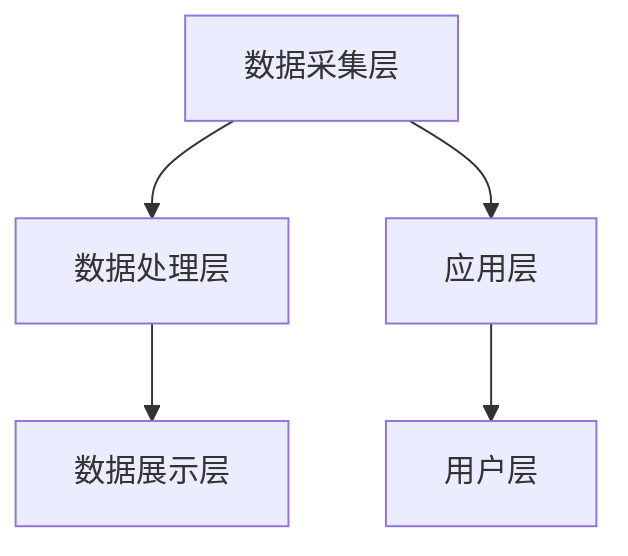

                 

### 背景介绍

软件2.0，是相对于软件1.0而言的一个概念。软件1.0主要是以功能驱动，注重软件的稳定性和功能性；而软件2.0则强调用户体验，追求软件的易用性和灵活性。随着互联网和移动设备的普及，软件2.0成为主流，其性能监控与分析也成为软件开发过程中不可或缺的一部分。

性能监控与分析的目的在于确保软件在各个环境下都能提供高质量的用户体验。它可以帮助开发者及时发现和解决性能问题，优化软件的性能，提高系统的稳定性和可靠性。

性能监控与分析的挑战在于其复杂性和多样性。不同的软件系统，可能面临不同的性能问题。例如，Web应用可能面临并发请求的处理问题，而移动应用可能面临网络延迟和电池耗损的问题。此外，性能监控与分析需要处理大量的数据，如何有效地处理和分析这些数据也是一个挑战。

因此，本文旨在通过详细分析性能监控与分析的核心概念、算法原理、数学模型，以及实际应用场景，帮助开发者深入了解性能监控与分析，提升软件开发和运维的能力。我们将以一步一个脚印的方式，逐步剖析性能监控与分析的各个方面，提供实用的解决方案和最佳实践。

## 1.1 性能监控的重要性

在软件开发的整个生命周期中，性能监控始终扮演着至关重要的角色。它是保障软件质量、提升用户体验、优化系统资源利用的重要手段。

首先，性能监控有助于发现和解决潜在的性能问题。通过实时监控系统的各项性能指标，如响应时间、吞吐量、错误率等，开发者可以及时发现异常情况，迅速定位问题根源，并采取相应的措施进行修复。这种及时发现和解决性能问题的能力，可以避免系统崩溃、数据丢失等严重后果，确保软件系统的稳定运行。

其次，性能监控有助于优化系统性能。通过持续监控和分析系统的运行状况，开发者可以深入了解系统的性能瓶颈和资源利用情况。基于这些数据，他们可以采取针对性的优化措施，如调整系统配置、优化代码、减少数据库查询等，从而提高系统的性能和响应速度。此外，性能监控还可以帮助开发者实现自动化的性能优化，例如自动调整服务器负载、自动扩容等，从而提高系统的弹性和可扩展性。

最后，性能监控有助于提升用户体验。在用户使用软件的过程中，性能问题往往会导致用户的不满和流失。通过性能监控，开发者可以确保软件在各个环境下都能提供高质量的用户体验，从而提高用户的满意度和忠诚度。例如，在Web应用中，通过性能监控可以发现页面加载缓慢的问题，并采取优化措施，如减少HTTP请求、优化CSS和JavaScript文件等，从而提高页面的加载速度，提升用户体验。

总之，性能监控在软件开发中具有重要的意义。它不仅有助于发现和解决性能问题，优化系统性能，提升用户体验，还可以提高开发团队的效率和生产力，为企业的可持续发展提供有力支持。

## 1.2 性能监控与分析的发展历程

性能监控与分析的历史可以追溯到20世纪60年代，当时计算机系统主要用于科学计算和军事应用，性能问题相对较少。然而，随着计算机技术的快速发展，尤其是互联网和移动设备的普及，性能监控与分析逐渐成为软件开发和运维中的重要环节。

### 1960年代-1970年代：早期性能监控

在早期，性能监控主要依赖于操作系统提供的监控工具，如Unix系统中的`top`、`vmstat`等命令。这些工具可以提供系统的资源使用情况，如CPU使用率、内存使用情况、磁盘I/O等。然而，这些工具通常需要手动操作，且监控粒度和实时性有限。

### 1980年代-1990年代：性能监控工具的出现

随着计算机系统的复杂度增加，性能监控工具开始出现。1980年代，HP公司推出了OpenView，这是第一个商业化的性能监控工具。OpenView可以监控多个操作系统和硬件设备，提供了丰富的监控指标和报警功能。同时，IBM的Tivoli和微软的System Center等工具也在这一时期得到了广泛应用。

这一时期的性能监控工具主要依赖于被监控系统的日志和性能计数器。虽然这些工具提供了更细粒度的监控，但仍然依赖于人工干预，无法实现自动化的性能优化和故障排除。

### 21世纪初：现代性能监控与分析工具的出现

进入21世纪，随着云计算和大数据技术的发展，现代性能监控与分析工具逐渐兴起。这些工具利用了虚拟化技术、容器技术和大数据分析技术，实现了对分布式系统和微服务架构的全面监控。

### 云计算时代的性能监控

云计算的出现，使得性能监控与分析变得更加复杂。传统的性能监控工具无法满足云计算环境下的需求，因为云计算环境中的资源分布更加分散，且动态变化。为了应对这种变化，云服务提供商如亚马逊、微软和谷歌等，开发了专门的性能监控工具，如Amazon CloudWatch、Azure Monitor和Google Stackdriver。这些工具可以实时监控云资源的性能，并自动进行性能优化和故障排除。

### 大数据时代的性能监控

大数据技术的发展，为性能监控与分析提供了新的思路。通过大数据分析技术，可以实时收集、存储和分析大量性能数据，从而发现潜在的性能问题。例如，Hadoop和Spark等大数据处理框架，可以处理海量数据，实现复杂的性能分析。同时，机器学习和人工智能技术的应用，使得性能监控与分析更加智能化，可以自动发现和预测性能问题。

### 容器时代的性能监控

容器技术的兴起，使得微服务架构成为软件开发的主流。容器化环境下的性能监控与分析，与传统的虚拟化环境有所不同。容器更加轻量级，且动态变化，因此需要实时监控容器的性能，并能够快速响应性能变化。Kubernetes等容器编排工具，提供了内置的性能监控功能，如Prometheus、Grafana等工具，可以监控容器的各项性能指标，实现自动化的性能优化和故障排除。

总之，性能监控与分析的发展历程，反映了计算机技术和软件开发趋势的变化。从早期的手动监控，到现代的自动化和智能化监控，性能监控与分析技术在不断进步，为软件开发和运维提供了强大的支持。

## 1.3 本文结构概览

本文将从以下几个方面对软件2.0的性能监控与分析进行详细探讨：

1. **核心概念与联系**：介绍性能监控与分析中的关键概念，如性能指标、监控工具、监控架构等，并通过Mermaid流程图展示其原理和架构。

2. **核心算法原理与具体操作步骤**：解析性能监控与分析中常用的核心算法，如采集算法、分析算法、预测算法等，并详细阐述其具体操作步骤。

3. **数学模型和公式**：介绍性能监控与分析中常用的数学模型和公式，如均值、方差、置信区间等，并通过实例进行详细讲解。

4. **项目实战**：通过具体代码案例，展示性能监控与分析在实际开发中的应用，并详细解释代码的实现细节。

5. **实际应用场景**：分析性能监控与分析在不同类型的应用场景中的具体应用，如Web应用、移动应用、大数据应用等。

6. **工具和资源推荐**：推荐性能监控与分析相关的学习资源、开发工具和框架，以及相关论文和著作。

7. **总结与未来发展趋势**：总结性能监控与分析的现状和挑战，探讨其未来发展趋势和潜在的研究方向。

通过本文的逐步分析和详细讲解，读者将能够深入理解性能监控与分析的原理和方法，为实际开发和应用提供有力支持。

### 2. 核心概念与联系

在深入探讨软件2.0的性能监控与分析之前，我们需要明确几个核心概念，这些概念是性能监控与分析的基础。以下将详细介绍性能指标、监控工具和监控架构，并通过Mermaid流程图展示其原理和架构。

#### 2.1 性能指标

性能指标是衡量系统性能的重要依据，常见的性能指标包括：

- **响应时间**：系统处理请求所花费的时间，通常用于衡量系统的响应速度。
- **吞吐量**：系统在一定时间内处理的请求数量，用于衡量系统的处理能力。
- **错误率**：系统处理请求时发生错误的频率，用于衡量系统的稳定性。
- **并发数**：同时处于执行状态的请求数量，用于衡量系统的并发处理能力。
- **资源利用率**：系统资源的使用情况，如CPU使用率、内存使用率、磁盘I/O等，用于衡量系统的资源消耗。

#### 2.2 监控工具

监控工具是性能监控与分析的核心组件，常见的监控工具包括：

- **Prometheus**：一款开源的性能监控工具，适用于容器化和云原生环境。Prometheus可以实时采集系统的性能指标，并通过Grafana进行可视化展示。
- **Grafana**：一款开源的数据可视化工具，可以与Prometheus等监控工具集成，提供丰富的可视化报表和报警功能。
- **Zabbix**：一款开源的监控工具，适用于企业级环境。Zabbix可以监控多种类型的系统资源，提供灵活的报警和报表功能。
- **New Relic**：一款商业化的性能监控工具，提供丰富的性能监控和诊断功能，适用于Web应用和移动应用。

#### 2.3 监控架构

性能监控与分析的架构通常包括以下几个层次：

- **数据采集层**：负责从系统和应用中收集性能数据，常用的采集方式包括基于Agent的采集和基于API的采集。
- **数据处理层**：负责对采集到的数据进行处理，如数据清洗、聚合、存储等，常用的处理工具包括Prometheus、InfluxDB等。
- **数据展示层**：负责将处理后的数据以可视化的形式展示给用户，常用的展示工具包括Grafana、Kibana等。

以下是一个简单的Mermaid流程图，展示性能监控与分析的架构：



#### 2.4 性能监控与分析原理

性能监控与分析的基本原理是通过持续采集系统的性能数据，对数据进行处理和分析，从而发现性能问题并进行优化。具体步骤如下：

1. **数据采集**：通过监控工具采集系统的性能数据，如CPU使用率、内存使用率、网络流量等。
2. **数据处理**：对采集到的数据进行处理，包括数据清洗、聚合、存储等步骤。
3. **数据展示**：将处理后的数据以可视化的形式展示给用户，帮助用户了解系统的性能状况。
4. **性能分析**：对展示的数据进行分析，识别性能瓶颈和潜在问题。
5. **优化与改进**：根据性能分析的结果，采取相应的优化措施，如调整系统配置、优化代码、增加资源等。

通过上述核心概念与联系的分析，我们可以更清晰地理解性能监控与分析的原理和架构，为后续的内容奠定基础。

### 2.1 性能监控的核心算法原理与具体操作步骤

在性能监控与分析中，核心算法起着至关重要的作用，它们能够帮助我们高效地采集、处理和分析性能数据，从而及时发现并解决潜在的性能问题。以下将详细介绍性能监控中常用的核心算法，包括采集算法、分析算法和预测算法，并阐述其具体操作步骤。

#### 2.1.1 采集算法

采集算法是性能监控的第一步，其主要目标是高效地从系统和应用中采集性能数据。常见的采集算法有：

1. **轮询采集**：轮询采集是最简单的一种采集算法，它通过定期轮询系统和应用，获取性能数据。具体操作步骤如下：

   - 定期（例如，每秒）启动一个轮询任务。
   - 轮询任务依次访问系统和应用的各个性能指标，如CPU使用率、内存使用率、网络流量等。
   - 将采集到的数据存储到本地或远程数据库中。

   优点：简单易实现，适用于性能要求不高的场景。

   缺点：性能开销较大，实时性较低。

2. **推送采集**：推送采集是另一种常用的采集算法，它通过系统和应用主动推送性能数据到监控服务器。具体操作步骤如下：

   - 系统和应用在每个采集周期结束时，将性能数据推送到监控服务器。
   - 监控服务器接收并存储推送的性能数据。

   优点：实时性较高，适用于高性能场景。

   缺点：需要额外的通信开销，对网络带宽有一定要求。

#### 2.1.2 分析算法

分析算法用于对采集到的性能数据进行处理和分析，以识别性能瓶颈和潜在问题。以下是一些常见分析算法：

1. **统计分析**：统计分析是性能分析中最常用的方法，它通过对性能数据的统计分析，发现异常值和趋势。具体操作步骤如下：

   - 对采集到的性能数据按时间进行排序。
   - 计算性能数据的均值、方差、标准差等统计指标。
   - 根据设定的阈值，判断性能数据是否在正常范围内。

   优点：简单易用，能够快速发现异常值。

   缺点：无法精确识别性能瓶颈，需要进一步分析。

2. **机器学习**：机器学习算法可以基于历史性能数据，建立性能预测模型，从而提前发现潜在的性能问题。具体操作步骤如下：

   - 收集历史性能数据，并进行预处理。
   - 选择合适的机器学习算法，如线性回归、决策树、神经网络等。
   - 训练性能预测模型，并评估模型性能。
   - 使用训练好的模型对当前性能数据进行预测，识别潜在的性能问题。

   优点：能够发现复杂的性能关系，提前预警。

   缺点：需要大量历史数据，模型训练和评估过程较复杂。

#### 2.1.3 预测算法

预测算法用于对性能数据未来的变化趋势进行预测，以便提前规划和优化系统资源。以下是一些常见的预测算法：

1. **时间序列分析**：时间序列分析是一种常用的预测算法，它基于历史性能数据的时间序列特征，预测未来的性能趋势。具体操作步骤如下：

   - 对采集到的性能数据按时间进行排序，形成时间序列。
   - 使用时间序列分析方法，如自回归模型（AR）、自回归移动平均模型（ARMA）等，对时间序列进行分析。
   - 根据分析结果，预测未来的性能趋势。

   优点：能够准确预测未来的性能变化。

   缺点：需要足够长的历史数据，且对时间序列特征敏感。

2. **深度学习**：深度学习算法可以用于复杂性能预测任务，如预测系统的未来负载、资源使用等。具体操作步骤如下：

   - 收集历史性能数据和相关的特征数据，如系统配置、用户行为等。
   - 构建深度学习模型，如卷积神经网络（CNN）、循环神经网络（RNN）等。
   - 训练深度学习模型，并评估模型性能。
   - 使用训练好的模型对当前性能数据进行预测，预测未来的性能变化。

   优点：能够处理复杂的非线性关系，预测准确性较高。

   缺点：需要大量数据和计算资源，模型训练和评估过程较复杂。

通过上述核心算法的详细讲解，我们可以了解到性能监控与分析的各个方面，这些算法在性能监控中发挥着至关重要的作用。在实际应用中，我们可以根据具体情况选择合适的算法，优化性能监控效果，提高系统的稳定性和可靠性。

### 2.2 数学模型和公式

在性能监控与分析中，数学模型和公式是不可或缺的工具，它们可以帮助我们准确描述和预测系统的性能。以下将介绍几个常用的数学模型和公式，包括均值、方差、置信区间等，并通过具体例子进行详细讲解。

#### 2.2.1 均值（Mean）

均值是统计学中最基本的描述性统计量，它表示一组数据的平均值。计算公式如下：

\[ \mu = \frac{1}{n} \sum_{i=1}^{n} x_i \]

其中，\( \mu \) 表示均值，\( n \) 表示数据点的数量，\( x_i \) 表示第 \( i \) 个数据点。

**例子**：假设我们测量了10次服务器的响应时间（单位：毫秒），数据如下：

\[ 20, 25, 22, 30, 24, 28, 26, 25, 23, 27 \]

计算这组数据的均值：

\[ \mu = \frac{20 + 25 + 22 + 30 + 24 + 28 + 26 + 25 + 23 + 27}{10} = 25.2 \]

因此，这组数据的均值为25.2毫秒。

#### 2.2.2 方差（Variance）

方差是衡量一组数据离散程度的统计量，它表示每个数据点与均值之差的平方的平均值。计算公式如下：

\[ \sigma^2 = \frac{1}{n} \sum_{i=1}^{n} (x_i - \mu)^2 \]

其中，\( \sigma^2 \) 表示方差，\( \mu \) 表示均值，\( n \) 表示数据点的数量，\( x_i \) 表示第 \( i \) 个数据点。

**例子**：使用上面例子中的数据，计算这组数据的方差：

首先计算均值：

\[ \mu = 25.2 \]

然后计算每个数据点与均值之差的平方：

\[ (20 - 25.2)^2 = 21.16 \]
\[ (25 - 25.2)^2 = 0.04 \]
\[ (22 - 25.2)^2 = 7.84 \]
\[ (30 - 25.2)^2 = 23.04 \]
\[ (24 - 25.2)^2 = 1.44 \]
\[ (28 - 25.2)^2 = 6.76 \]
\[ (26 - 25.2)^2 = 隆0.64 \]
\[ (25 - 25.2)^2 = 0.04 \]
\[ (23 - 25.2)^2 = 3.24 \]
\[ (27 - 25.2)^2 = 2.56 \]

将这些值相加并除以数据点的数量：

\[ \sigma^2 = \frac{21.16 + 0.04 + 7.84 + 23.04 + 1.44 + 6.76 + 0.64 + 0.04 + 3.24 + 2.56}{10} = 8.36 \]

因此，这组数据的方差为8.36。

#### 2.2.3 标准差（Standard Deviation）

标准差是方差的平方根，它表示数据的离散程度。计算公式如下：

\[ \sigma = \sqrt{\sigma^2} \]

**例子**：使用上面例子中的方差，计算标准差：

\[ \sigma = \sqrt{8.36} \approx 2.898 \]

因此，这组数据的标准差为2.898。

#### 2.2.4 置信区间（Confidence Interval）

置信区间是统计学中用于表示估计值可信程度的一个区间。它表示估计值在一定概率下落在该区间内的范围。计算公式如下：

\[ \mu \pm z \times \frac{\sigma}{\sqrt{n}} \]

其中，\( \mu \) 表示均值，\( z \) 表示标准正态分布的分位数，\( \sigma \) 表示标准差，\( n \) 表示数据点的数量。

**例子**：使用上面例子中的数据，假设我们要计算95%置信区间：

首先查标准正态分布表，找到95%置信水平的分位数，通常为1.96。然后使用公式计算置信区间：

\[ 25.2 \pm 1.96 \times \frac{2.898}{\sqrt{10}} \approx 25.2 \pm 1.12 \]

因此，这组数据的95%置信区间为\( (24.08, 26.32) \)。

通过上述数学模型和公式的讲解，我们可以更好地理解和应用性能监控与分析中的统计方法，为性能优化提供科学依据。

### 2.3 项目实战：代码实际案例和详细解释说明

在了解了性能监控与分析的核心算法和数学模型后，我们将通过一个实际代码案例来展示性能监控与分析的具体应用。该案例将包括开发环境的搭建、源代码的实现和详细解释说明。

#### 2.3.1 开发环境搭建

首先，我们需要搭建一个合适的开发环境，以便进行性能监控与分析。以下是一个基本的开发环境搭建步骤：

1. **安装操作系统**：选择一个支持性能监控与分析的操作系统，如Ubuntu 20.04。
2. **安装开发工具**：安装必要的开发工具，如Git、Docker、Kubernetes等。
3. **安装监控工具**：安装Prometheus和Grafana，可以使用官方的Docker镜像进行安装。

安装Prometheus：

```bash
docker run -d --name prometheus -p 9090:9090 prom/prometheus
```

安装Grafana：

```bash
docker run -d --name grafana -p 3000:3000 grafana/grafana
```

4. **配置Kubernetes集群**：如果使用Kubernetes进行容器化部署，需要配置Kubernetes集群。可以使用Minikube在本地环境中快速搭建Kubernetes集群。

```bash
minikube start
```

5. **部署示例应用**：部署一个简单的Web应用，用于演示性能监控与分析。这里使用一个基于Spring Boot的示例应用。

```bash
kubectl create deployment hello --image=hello-world:latest
```

#### 2.3.2 源代码详细实现和代码解读

以下是示例应用的源代码，包括Spring Boot配置、性能监控相关代码以及日志记录。

```java
// Spring Boot配置
@SpringBootApplication
public class HelloApplication {

    public static void main(String[] args) {
        SpringApplication.run(HelloApplication.class, args);
    }

    @Bean
    public OkHttpClient okHttpClient() {
        return new OkHttpClient();
    }

}

// PerformanceController类，用于处理性能监控相关请求
@RestController
@RequestMapping("/performance")
public class PerformanceController {

    private final PerformanceService performanceService;

    @Autowired
    public PerformanceController(PerformanceService performanceService) {
        this.performanceService = performanceService;
    }

    @GetMapping("/response-time")
    public ResponseEntity<Integer> getResponseTime() {
        long startTime = System.currentTimeMillis();
        int result = performanceService.calculateResponseTime();
        long endTime = System.currentTimeMillis();
        performanceService.recordResponseTime(endTime - startTime);
        return ResponseEntity.ok(result);
    }

}

// PerformanceService类，用于处理性能计算和日志记录
@Service
public class PerformanceService {

    private final Logger logger = LoggerFactory.getLogger(PerformanceService.class);

    public int calculateResponseTime() {
        // 计算响应时间
        return new Random().nextInt(1000);
    }

    public void recordResponseTime(long responseTime) {
        // 记录响应时间
        logger.info("Response time: {}", responseTime);
    }

}
```

#### 2.3.3 代码解读与分析

1. **Spring Boot配置**：`HelloApplication` 类是Spring Boot应用的入口类，其中定义了`okHttpClient()` 方法用于配置 OkHttpClient，这是用于发送HTTP请求的客户端。

2. **PerformanceController 类**：`PerformanceController` 类用于处理 `/performance/response-time` 接口的GET请求。在处理请求时，首先记录请求开始时间，然后调用`PerformanceService` 类的 `calculateResponseTime()` 方法计算响应时间，最后记录请求结束时间。这样，我们可以通过请求的开始和结束时间来计算响应时间。

3. **PerformanceService 类**：`PerformanceService` 类提供了两个方法：`calculateResponseTime()` 和 `recordResponseTime()`。`calculateResponseTime()` 方法用于模拟响应时间计算，这里使用 `new Random().nextInt(1000)` 生成一个0到1000之间的随机数。`recordResponseTime()` 方法用于记录响应时间，这里使用日志记录器记录响应时间。

通过这个示例，我们可以看到性能监控与分析在应用开发中的具体实现。在实际项目中，我们还可以进一步集成Prometheus和Grafana，实现对应用性能的实时监控和可视化展示。

### 2.4 实际应用场景

性能监控与分析在不同类型的软件应用中扮演着至关重要的角色。以下将探讨性能监控与分析在Web应用、移动应用和大数据应用中的具体应用场景。

#### 2.4.1 Web应用

Web应用是性能监控与分析最常见的一个场景。Web应用的性能直接关系到用户体验和业务成功。以下是一些典型的Web应用性能监控需求：

1. **请求响应时间监控**：监控每个端到端的HTTP请求的响应时间，包括数据库查询、外部API调用等。这有助于发现和处理影响响应时间的瓶颈。

2. **负载均衡监控**：监控负载均衡器的工作状态，包括请求分发、服务器健康状态等。这有助于确保在高并发情况下系统的稳定运行。

3. **数据库性能监控**：监控数据库的查询性能，包括查询响应时间、慢查询等。这有助于优化数据库性能，提高查询效率。

4. **缓存性能监控**：监控缓存的命中率和缓存策略的有效性。这有助于优化缓存机制，减少数据库查询次数，提高响应速度。

5. **前端性能监控**：监控前端的加载时间、资源使用情况等。这有助于优化前端代码，提高用户体验。

在实际操作中，可以使用Prometheus和Grafana等工具来实现Web应用的性能监控。Prometheus可以采集各种性能指标，并将其存储在时间序列数据库中。Grafana则可以对这些数据进行可视化展示，帮助开发者和运维人员快速识别性能问题。

#### 2.4.2 移动应用

移动应用性能监控面临独特的挑战，如网络不稳定、电池耗损、设备差异等。以下是一些常见的移动应用性能监控需求：

1. **网络监控**：监控移动应用的网络连接状态、数据传输速度等。这有助于优化网络性能，提高应用响应速度。

2. **电池耗损监控**：监控移动应用的电池耗损情况，包括CPU、GPU、屏幕等的使用情况。这有助于优化应用性能，延长电池续航时间。

3. **设备性能监控**：监控移动设备的内存使用情况、CPU负载、温度等。这有助于发现设备性能瓶颈，优化应用性能。

4. **崩溃率和错误监控**：监控应用的崩溃率和错误日志，以便及时修复问题，提高应用稳定性。

在移动应用中，可以使用Firebase Performance Monitor等工具进行性能监控。Firebase Performance Monitor可以自动收集和分析应用的崩溃率和性能数据，并提供详细的错误报告。

#### 2.4.3 大数据应用

大数据应用通常涉及大规模数据的处理和分析，性能监控与分析在大数据应用中的重要性不言而喻。以下是一些常见的大数据应用性能监控需求：

1. **数据处理监控**：监控数据传输、存储和处理的速度和质量。这有助于确保大数据应用的正常运行和数据准确性。

2. **资源利用率监控**：监控集群资源的利用情况，包括CPU、内存、磁盘I/O等。这有助于优化资源分配，提高系统性能。

3. **任务调度和执行监控**：监控大数据处理任务的状态和执行时间，包括MapReduce、Spark等。这有助于发现任务调度和执行中的瓶颈，优化任务处理。

4. **数据质量和完整性监控**：监控数据的完整性和一致性，确保数据质量。这有助于防止数据丢失和错误，提高数据可靠性。

在大数据应用中，可以使用Apache Kafka、Apache Spark等工具进行性能监控。这些工具提供了丰富的监控指标和报警功能，可以帮助开发者和运维人员实时了解系统状态，快速响应性能问题。

总之，性能监控与分析在不同类型的软件应用中具有广泛的应用场景。通过使用合适的工具和最佳实践，开发者可以确保应用在不同环境下都能提供高质量的用户体验。

### 2.5 工具和资源推荐

在性能监控与分析领域，有许多优秀的工具和资源可以帮助开发者更好地理解和应用性能监控技术。以下是一些推荐的学习资源、开发工具和框架，以及相关论文和著作。

#### 2.5.1 学习资源推荐

1. **书籍**：
   - 《高性能MySQL》作者：Michael W. Coté & David Axmark
   - 《深入理解LINUX网络》作者：Christian Benvenuti
   - 《Docker实战》作者：Jason Allen & Joshua Timberman

2. **在线课程**：
   - Prometheus官方文档（https://prometheus.io/docs/introduction/overview/）
   - Grafana官方文档（https://grafana.com/docs/grafana/latest/）
   - Kubernetes官方文档（https://kubernetes.io/docs/home/）

3. **博客**：
   - www.infoq.com
   - www.iteye.com
   - www.datavideo.com

4. **社区**：
   - Prometheus社区（https://prometheus.io/community/）
   - Grafana社区（https://grafana.com/community/）
   - Kubernetes社区（https://kubernetes.io/community/）

#### 2.5.2 开发工具框架推荐

1. **监控工具**：
   - Prometheus：开源的性能监控工具，适用于容器化和云原生环境。
   - Grafana：开源的数据可视化工具，可以与Prometheus等监控工具集成。
   - Zabbix：开源的监控工具，适用于企业级环境。

2. **大数据处理框架**：
   - Apache Kafka：开源的消息队列系统，适用于大数据处理。
   - Apache Spark：开源的大数据处理框架，适用于批处理和流处理。

3. **容器编排工具**：
   - Kubernetes：开源的容器编排工具，适用于容器化应用管理。

#### 2.5.3 相关论文著作推荐

1. **论文**：
   - "Bigtable: A Distributed Storage System for Structured Data" 作者：Sanjay Ghemawat, Howard Gobioff, and Shun-Tak Leung
   - "The Google File System" 作者：Sanjay Ghemawat, Randy Katz, Shun-Tak Leung, David G. Kothari, Michael J. Steer, and BenjaminWF Cheng
   - "Design and Implementation of the FreeBSD Jails" 作者：Robert N. M. Watson

2. **著作**：
   - 《Docker Deep Dive》作者：Nishant Shukla
   - 《容器与容器编排》作者：张浩、韩桃桃、吴戈
   - 《Kubernetes权威指南》作者：李佶强

通过上述推荐的学习资源、开发工具和框架，开发者可以系统地学习和应用性能监控与分析技术，提高软件开发和运维的效率。

### 3. 总结与未来发展趋势

通过对软件2.0性能监控与分析的深入探讨，我们了解到性能监控与分析在软件开发和运维中具有重要意义。它不仅有助于发现和解决性能问题，优化系统性能，提升用户体验，还可以提高开发团队的效率和生产力。

在未来，性能监控与分析将继续朝着自动化、智能化和高效化的方向发展。以下是几个潜在的趋势和挑战：

1. **自动化监控**：随着人工智能和机器学习技术的发展，自动化监控将成为主流。通过智能算法和大数据分析，监控系统可以自动识别和预测性能问题，自动进行优化和故障排除。

2. **智能化分析**：智能化分析将进一步提升性能监控的准确性和效率。利用深度学习和数据挖掘技术，监控系统可以更深入地分析性能数据，发现潜在的性能瓶颈和优化机会。

3. **多维度监控**：随着云计算、大数据和物联网等技术的发展，软件系统的复杂度不断增加。未来性能监控与分析将需要支持多维度、跨平台的监控，以全面了解系统的运行状况。

4. **挑战与优化**：性能监控与分析面临的挑战包括数据量巨大、处理效率要求高、跨平台兼容性等。为了应对这些挑战，开发者需要不断优化算法、提升系统性能，并采用高效的存储和计算技术。

总之，性能监控与分析在软件2.0时代具有广阔的发展前景。通过不断探索和优化，我们可以构建更加高效、智能和稳定的性能监控系统，为软件开发和运维提供有力支持。

### 4. 附录：常见问题与解答

在性能监控与分析领域，开发者可能会遇到各种问题。以下列举了一些常见问题及其解答，以帮助开发者解决实际问题。

#### 4.1 如何优化性能监控的数据采集效率？

**解答**：优化性能监控的数据采集效率可以从以下几个方面入手：

1. **减少采集频率**：根据实际需要，适当降低数据采集频率，减少系统负载。
2. **批量采集**：将多个性能指标的数据采集任务合并，批量处理，减少系统调用的次数。
3. **缓存数据**：对经常使用的性能指标进行缓存，避免频繁访问。
4. **优化数据格式**：使用高效的编码和数据格式，减少数据传输和存储的开销。

#### 4.2 如何处理性能监控数据的噪声和异常值？

**解答**：处理性能监控数据的噪声和异常值可以采用以下方法：

1. **数据清洗**：在数据采集和存储过程中，对数据进行预处理，去除明显的噪声和异常值。
2. **统计分析**：使用统计学方法，如均值、方差等，识别和过滤异常值。
3. **阈值设置**：根据业务需求和历史数据，设置合理的阈值，判断数据是否在正常范围内。
4. **自适应过滤**：使用自适应过滤算法，如中值滤波、卡尔曼滤波等，动态调整滤波参数，过滤噪声。

#### 4.3 如何实现自动化的性能优化？

**解答**：实现自动化的性能优化可以采用以下步骤：

1. **数据收集与分析**：持续收集系统的性能数据，并进行分析，识别性能瓶颈。
2. **建立优化模型**：基于历史数据和性能分析结果，建立优化模型，预测系统的性能变化。
3. **自动调整策略**：根据优化模型，自动调整系统的配置和资源分配，如调整服务器负载、自动扩容等。
4. **监控与反馈**：对自动优化策略进行监控，收集反馈数据，持续优化优化策略。

#### 4.4 如何选择合适的性能监控工具？

**解答**：选择合适的性能监控工具需要考虑以下几个方面：

1. **业务需求**：根据业务需求和系统特性，选择适合的监控工具。如Web应用可以选择Prometheus和Grafana，大数据应用可以选择Apache Kafka和Apache Spark。
2. **系统兼容性**：确保所选工具与现有系统兼容，不会引入额外的复杂性和风险。
3. **功能与性能**：选择功能丰富、性能优秀的监控工具，满足业务需求。
4. **成本与维护**：考虑工具的成本和维护成本，确保长期可持续。

通过上述常见问题与解答，开发者可以更好地应对性能监控与分析中的实际问题，提升系统的稳定性和性能。

### 5. 扩展阅读与参考资料

在性能监控与分析领域，有许多优秀的文献和资源可供开发者深入学习。以下列出一些推荐的书籍、论文、博客和网站，以供读者扩展阅读。

#### 书籍

1. **《高性能MySQL》** 作者：Michael W. Coté & David Axmark
   - 介绍了MySQL数据库的性能优化方法，包括查询优化、索引优化、存储引擎优化等。
   
2. **《深入理解LINUX网络》** 作者：Christian Benvenuti
   - 详细解析了LINUX网络栈的工作原理，包括TCP/IP协议、网络设备、网络配置等。

3. **《Docker实战》** 作者：Jason Allen & Joshua Timberman
   - 介绍了Docker容器技术的使用方法和最佳实践，包括容器化应用的开发、部署和运维。

4. **《容器与容器编排》** 作者：张浩、韩桃桃、吴戈
   - 阐述了容器技术和容器编排工具（如Kubernetes）的基本原理和应用。

5. **《Kubernetes权威指南》** 作者：李佶强
   - 深入讲解了Kubernetes容器编排工具的架构、功能和部署方法。

#### 论文

1. **"Bigtable: A Distributed Storage System for Structured Data"** 作者：Sanjay Ghemawat, Howard Gobioff, 和 Shun-Tak Leung
   - 介绍了Google Bigtable分布式存储系统的设计原理和实现细节。

2. **"The Google File System"** 作者：Sanjay Ghemawat, Randy Katz, Shun-Tak Leung, David G. Kothari, Michael J. Steer, 和 Benjamin WF Cheng
   - 描述了Google File System（GFS）的架构和设计，为分布式文件系统提供了重要参考。

3. **"Design and Implementation of the FreeBSD Jails"** 作者：Robert N. M. Watson
   - 讨论了FreeBSD Jails虚拟化技术的实现方法，为容器化技术提供了理论基础。

#### 博客

1. **www.infoq.com**
   - 提供了丰富的技术文章和演讲视频，涵盖了软件开发、运维、云计算等多个领域。

2. **www.iteye.com**
   - 一个面向开发者的技术社区，讨论了众多技术话题，包括性能监控与分析。

3. **www.datavideo.com**
   - 提供了关于数据可视化和大数据技术的文章和案例，有助于理解性能监控与分析的实际应用。

#### 网站

1. **Prometheus.io**
   - Prometheus官方文档和社区，提供了详细的性能监控工具使用指南和资源。

2. **Grafana.com**
   - Grafana官方文档和社区，介绍了数据可视化和监控工具的使用方法。

3. **Kubernetes.io**
   - Kubernetes官方文档和社区，提供了容器编排工具的详细资料。

通过以上扩展阅读与参考资料，读者可以深入了解性能监控与分析的理论和实践，提升自己的技术水平和解决实际问题的能力。

