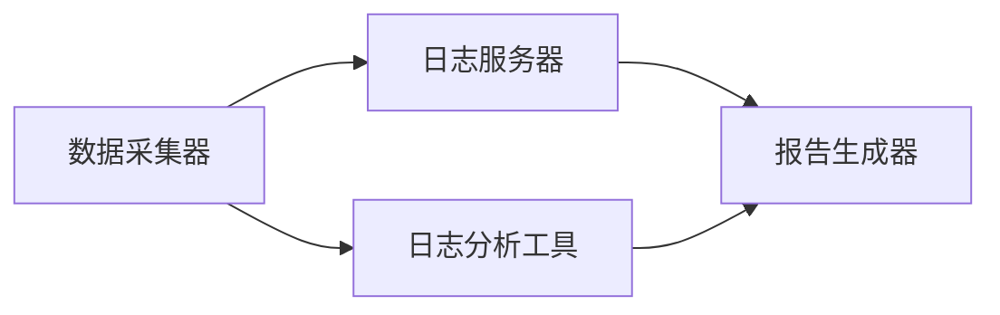

                 

### 背景介绍 Background Introduction

软件2.0时代，随着云计算、大数据、人工智能等技术的迅速发展，日志管理作为系统运行监控与性能调优的重要手段，显得愈发关键。日志，简单来说，是系统运行过程中的记录，它涵盖了系统的各种操作行为、错误信息、性能指标等。有效的日志管理不仅能帮助开发者快速定位问题、优化系统性能，还能为后续的故障排除、安全防护提供重要的数据支持。

然而，日志管理并非易事，尤其在复杂系统中，日志的格式、存储、检索、分析等各个环节都可能面临挑战。传统的日志管理方法往往依赖于简单的文本文件或数据库，难以满足大规模、分布式系统的需求。随着日志数据的爆炸式增长，如何高效地收集、存储、处理和分析日志，成为软件工程师和运维人员亟待解决的核心问题。

本文将围绕软件2.0时代的日志管理展开讨论。首先，我们将介绍日志管理的基本概念和重要性；接着，探讨日志管理的核心挑战和常见问题；然后，分析当前主流的日志管理工具和技术，以及它们的优缺点；随后，通过具体的案例展示如何在实际项目中实施日志管理；最后，展望日志管理的未来发展趋势和面临的挑战。希望通过这篇文章，能够为读者提供关于日志管理的全面、深入的见解和实用指南。

在接下来的内容中，我们将逐步深入日志管理的各个层面，从原理、技术到实践，全面解析软件2.0时代日志管理的最佳实践。让我们开始这场技术之旅吧！<|filler|>

## 2. 核心概念与联系 Core Concepts and Relationships

在深入探讨日志管理之前，我们需要明确几个核心概念，以及它们在日志管理中的作用和相互联系。

### 日志（Logs）

日志（Logs）是系统在运行过程中记录下来的各种信息。这些信息可以是系统操作记录、错误信息、性能指标、调试信息等。日志的主要目的是为了记录系统的行为，帮助开发者、运维人员诊断问题和优化系统性能。日志通常以文本或结构化数据的形式存储。

### 日志文件（Log Files）

日志文件是存储日志数据的基本单位。在传统的日志管理中，日志文件通常以`.txt`或`.log`结尾，存储在文件系统中。日志文件可以是单一文件，也可以是文件系统中的多个文件。日志文件的格式可以是简单的文本格式，也可以是结构化格式（如JSON、XML等）。

### 日志管理（Log Management）

日志管理是指对日志的收集、存储、检索、分析和报告的过程。有效的日志管理需要解决日志的数据量大、格式多样、存储和检索效率低等问题。日志管理不仅仅是将日志存储在文件系统中，还包括日志的集中存储、实时分析、历史数据查询等。

### 日志收集（Log Collection）

日志收集是指将分布在各个系统、应用程序和设备中的日志数据集中到一个地方。日志收集可以通过以下几种方式实现：

1. **本地收集**：系统或应用程序自行将日志数据发送到本地日志文件。
2. **代理收集**：使用专门的代理程序或服务收集日志数据，并转发到集中存储系统。
3. **远程收集**：通过网络远程连接到系统或应用程序，直接收集日志数据。

### 日志存储（Log Storage）

日志存储是指将收集到的日志数据持久化存储在适当的存储介质中。日志存储需要考虑存储容量、存储速度、数据检索效率等因素。常见的日志存储介质包括：

1. **文件系统**：传统的日志存储方式，适合小规模、简单的日志管理。
2. **数据库**：如关系型数据库（MySQL、PostgreSQL）或NoSQL数据库（MongoDB、Cassandra），适合大规模、结构化日志存储。
3. **日志管理系统**：如ELK（Elasticsearch、Logstash、Kibana）栈，专门为日志管理设计，具有高效的日志存储和分析能力。

### 日志分析（Log Analysis）

日志分析是指对日志数据进行处理、分析和可视化，以提取有价值的信息。日志分析可以帮助我们了解系统运行状况、识别潜在问题、优化系统性能。常见的日志分析方法包括：

1. **模式识别**：通过识别日志中的特定模式，发现异常行为。
2. **关联分析**：将不同来源的日志数据进行关联，分析它们之间的因果关系。
3. **可视化分析**：通过图表和报告，直观地展示日志数据的趋势和异常。

### 日志管理架构（Log Management Architecture）

日志管理架构是指日志收集、存储、分析等各个环节的总体设计。一个完善的日志管理架构应包括以下组件：

1. **数据采集器**：负责收集系统中的日志数据。
2. **日志服务器**：负责存储和管理收集到的日志数据。
3. **日志分析工具**：负责对日志数据进行处理和分析。
4. **报告生成器**：负责生成日志分析报告。

### Mermaid 流程图

为了更好地理解日志管理中的各个概念和它们之间的关系，我们可以使用Mermaid绘制一个简单的流程图。以下是一个简化的日志管理流程图示例：



在这个流程图中，数据采集器负责收集日志数据，并将其发送到日志服务器进行存储。日志分析工具负责对日志数据进行处理和分析，生成分析报告，报告生成器则负责将分析结果以图表和报告的形式展示给用户。

通过上述核心概念和流程图的介绍，我们可以对日志管理有一个整体的认识。在接下来的章节中，我们将进一步探讨日志管理的具体实现、算法原理、数学模型，并通过实际案例来展示如何有效地实施日志管理。接下来，我们将深入探讨日志管理中的核心算法原理和具体操作步骤。<|filler|>

## 3. 核心算法原理 & 具体操作步骤 Core Algorithm Principles & Detailed Steps

### 3.1 Logstash

Logstash 是 Elastic Stack 中的核心组件之一，主要用于日志数据的收集、处理和传输。Logstash 的核心算法原理可以概括为以下几个步骤：

#### 3.1.1 数据采集

Logstash 支持多种数据源，包括文件、JMS、Redis、syslog 等。数据采集器（Input Plugin）负责从这些数据源中收集日志数据。例如，File Input Plugin 可以从文件系统中读取日志文件，而 Syslog Input Plugin 可以从网络上的 syslog 服务器接收日志。


#### 3.1.2 数据解析

采集到的日志数据可能存在不同的格式，如 JSON、XML、CSV 等。Logstash 使用各种解析器（Parser）将这些数据转换为统一的内部格式。例如，Logstash 配置了 JSON 解析器来处理 JSON 格式的日志数据。


#### 3.1.3 数据转换

解析后的日志数据通常需要进行格式转换、过滤等操作。Logstash 使用过滤器（Filter）来实现这些功能。过滤器可以执行各种操作，如数据清洗、分类、提取特定字段等。常用的过滤器包括 JSON Filter、Grok Filter 等。


#### 3.1.4 数据输出

转换后的日志数据将被输出到目标存储或分析系统中。Logstash 支持多种输出插件，如 Elasticsearch、File、Graphite 等。输出插件将日志数据发送到相应的目标系统。


### 3.2 Elasticsearch

Elasticsearch 是一个高性能、可扩展的全文搜索引擎，也是 Elastic Stack 的核心组件之一。Elasticsearch 的核心算法原理主要涉及倒排索引和分片机制。

#### 3.2.1 倒排索引

倒排索引（Inverted Index）是 Elasticsearch 的核心技术之一。倒排索引将文档内容分解成关键字（术语），并为每个术语建立指向包含该术语的文档的指针。这样，当我们查询某个关键词时，Elasticsearch 可以快速定位到包含该关键词的文档。

#### 3.2.2 分片机制

Elasticsearch 支持水平扩展，通过将数据分布在多个节点上来实现。每个节点包含一个或多个分片（Shard），分片是数据存储和检索的基本单元。分片机制确保了 Elasticsearch 能够处理大规模数据并保持查询性能。

### 3.3 Kibana

Kibana 是 Elastic Stack 中的可视化工具，用于展示 Elasticsearch 中的数据。Kibana 的核心算法原理主要涉及数据可视化和仪表板配置。

#### 3.3.1 数据可视化

Kibana 提供多种可视化组件，如折线图、柱状图、饼图等，用于展示 Elasticsearch 中的数据。可视化组件可以通过拖拽和配置来创建复杂的报表。

#### 3.3.2 仪表板配置

Kibana 中的仪表板（Dashboard）允许用户将多个可视化组件组合在一起，创建一个统一的报表界面。仪表板配置可以灵活地调整，以满足不同用户的需求。

### 实际操作步骤

以下是一个简单的 Logstash-Elasticsearch-Kibana 日志管理流程：

1. **配置 Logstash**：配置 Logstash，指定输入源、解析器和输出目标（如 Elasticsearch）。

2. **启动 Logstash**：启动 Logstash 实例，开始收集和传输日志数据。

3. **配置 Elasticsearch**：配置 Elasticsearch 集群，设置分片数量、副本数量等参数。

4. **启动 Elasticsearch**：启动 Elasticsearch 集群，确保日志数据能够被正确存储和索引。

5. **配置 Kibana**：配置 Kibana，连接到 Elasticsearch 集群，创建仪表板和可视化组件。

6. **访问 Kibana**：通过浏览器访问 Kibana，查看日志数据的可视化报表。

通过上述步骤，我们可以在 Elasticsearch 和 Kibana 中实现高效的日志管理，从数据采集、处理到可视化展示，形成了一个完整的日志管理解决方案。在接下来的章节中，我们将进一步探讨日志管理中的数学模型和公式，并通过实际案例来展示如何应用这些模型和公式。<|filler|>

## 4. 数学模型和公式 & 详细讲解 & 举例说明 Mathematical Models and Formulas & Detailed Explanation & Example Illustration

### 4.1 日志数据的统计分析

日志管理中，对日志数据进行统计分析是非常重要的一环。通过对日志数据的统计分析，我们可以了解系统的运行状况、识别异常行为，从而优化系统性能。以下是几种常见的数学模型和公式，用于日志数据的统计分析。

#### 4.1.1 均值（Mean）

均值是描述数据集中心趋势的常用指标。对于一组日志数据 \(X_1, X_2, \ldots, X_n\)，均值 \(\bar{X}\) 计算公式如下：

\[
\bar{X} = \frac{1}{n}\sum_{i=1}^{n} X_i
\]

#### 4.1.2 方差（Variance）

方差是描述数据集分布离散程度的指标。对于一组日志数据 \(X_1, X_2, \ldots, X_n\)，方差 \(\sigma^2\) 计算公式如下：

\[
\sigma^2 = \frac{1}{n}\sum_{i=1}^{n} (X_i - \bar{X})^2
\]

#### 4.1.3 标准差（Standard Deviation）

标准差是方差的平方根，用于衡量数据集的离散程度。标准差 \(\sigma\) 计算公式如下：

\[
\sigma = \sqrt{\sigma^2} = \sqrt{\frac{1}{n}\sum_{i=1}^{n} (X_i - \bar{X})^2}
\]

#### 4.1.4 极值（Maximum and Minimum）

极值是数据集中最大值和最小值。对于一组日志数据 \(X_1, X_2, \ldots, X_n\)，最大值 \( \max(X) \) 和最小值 \( \min(X) \) 分别为：

\[
\max(X) = \max(X_1, X_2, \ldots, X_n)
\]
\[
\min(X) = \min(X_1, X_2, \ldots, X_n)
\]

### 4.2 日志数据的时间序列分析

时间序列分析是一种重要的统计分析方法，用于研究数据随时间的变化规律。在日志管理中，时间序列分析可以帮助我们识别日志数据的周期性、趋势性和季节性特征。

#### 4.2.1 自相关（Autocorrelation）

自相关是衡量同一时间序列不同时间点数据之间的相关性。对于时间序列数据 \(X_t\)，自相关函数 \( \rho_k \) 计算公式如下：

\[
\rho_k = \frac{\sum_{t=1}^{n-k} (X_t - \bar{X})(X_{t+k} - \bar{X})}{\sigma^2 (n-k)}
\]

#### 4.2.2 移动平均（Moving Average）

移动平均是一种简单的时间序列平滑方法，用于消除短期波动，显示长期趋势。对于时间序列数据 \(X_t\)，k 阶移动平均 \( \text{MA}(k) \) 计算公式如下：

\[
\text{MA}(k) = \frac{1}{k}\sum_{t=k}^{T} X_t
\]

#### 4.2.3 季节性（Seasonality）

季节性是指数据随时间呈现的周期性变化。季节性分析可以通过计算季节性指数来实现。对于时间序列数据 \(X_t\)，季节性指数 \( S_t \) 计算公式如下：

\[
S_t = \frac{\text{季节性总和}}{\text{季节性平均}}
\]

其中，季节性总和为：

\[
\text{季节性总和} = \sum_{t=1}^{T} X_t
\]

季节性平均为：

\[
\text{季节性平均} = \frac{\sum_{t=1}^{T} X_t}{T}
\]

### 4.3 实例讲解

假设我们有一个包含系统响应时间的日志数据集，如下所示：

| 时间戳 | 响应时间（ms） |
|--------|--------------|
| 1      | 50           |
| 2      | 60           |
| 3      | 55           |
| 4      | 45           |
| 5      | 58           |

#### 4.3.1 均值和标准差

计算这组数据的均值和标准差：

\[
\bar{X} = \frac{1}{5}(50 + 60 + 55 + 45 + 58) = 53
\]

\[
\sigma^2 = \frac{1}{5}[(50 - 53)^2 + (60 - 53)^2 + (55 - 53)^2 + (45 - 53)^2 + (58 - 53)^2] = 14.8
\]

\[
\sigma = \sqrt{14.8} \approx 3.84
\]

#### 4.3.2 移动平均

计算这组数据的3阶移动平均：

\[
\text{MA}(3) = \frac{1}{3}(55 + 60 + 58) \approx 57.3
\]

#### 4.3.3 季节性指数

由于数据集较小，我们无法直接计算季节性指数。但是，如果我们假设这些数据存在季节性，我们可以通过比较每个月的均值来识别季节性模式。例如，如果我们观察到每个月的响应时间均值有所波动，那么我们可以初步判断数据存在季节性。

通过以上实例，我们展示了如何使用数学模型和公式对日志数据进行统计分析。这些模型和公式不仅有助于我们理解日志数据的特征，还能帮助我们识别潜在的问题和优化系统性能。在接下来的章节中，我们将通过具体的项目实战来展示如何应用这些数学模型和公式。<|filler|>

## 5. 项目实战：代码实际案例和详细解释说明 Project Practice: Code Case and Detailed Explanation

在这一部分，我们将通过一个实际的项目实战来展示如何实施日志管理。我们将使用 ELK（Elasticsearch、Logstash 和 Kibana）栈来搭建一个日志管理系统，并详细解释整个项目的实施过程。

### 5.1 开发环境搭建

首先，我们需要搭建一个 ELK 开发环境。以下是步骤：

1. **安装 Elasticsearch**：从 [Elasticsearch 官网](https://www.elastic.co/cn/elasticsearch/) 下载最新版本，并按照官方文档进行安装。

2. **安装 Logstash**：从 [Logstash 官网](https://www.elastic.co/cn/logstash/) 下载最新版本，并按照官方文档进行安装。

3. **安装 Kibana**：从 [Kibana 官网](https://www.elastic.co/cn/kibana/) 下载最新版本，并按照官方文档进行安装。

4. **配置 Elasticsearch、Logstash 和 Kibana**：分别配置它们的配置文件（如 `elasticsearch.yml`、`logstash.yml` 和 `kibana.yml`），设置相应的集群名称、端口等。

5. **启动 Elasticsearch、Logstash 和 Kibana**：分别启动这三个服务，确保它们能够正常运行。

### 5.2 源代码详细实现和代码解读

#### 5.2.1 数据采集

我们使用 Python 编写一个简单的日志采集脚本，该脚本将从系统日志文件中读取日志，并使用 Logstash 的 HTTP 输入插件将日志数据发送到 Elasticsearch。

```python
import requests
import json
import os

LOG_FILE = "/var/log/syslog"
LOGSTASH_URL = "http://localhost:9600/logstash/api/pipeline/inputs/http"

with open(LOG_FILE, "r") as f:
    for line in f:
        data = {
            "type": "syslog",
            "message": line
        }
        response = requests.post(LOGSTASH_URL, json=data)
        print(response.text)
```

该脚本首先打开系统日志文件，逐行读取日志，并将每条日志封装成一个 JSON 对象，然后通过 HTTP POST 请求将日志数据发送到 Logstash。

#### 5.2.2 数据处理

在 Logstash 中，我们定义一个配置文件 `logstash.conf`，用于处理日志数据。以下是配置文件的主要部分：

```conf
input {
  http {
    port => 9200
    format => "json"
  }
}

filter {
  if "type" in [["@metadata"][keys]] {
    grok {
      match => { "@message" => "%{TIMESTAMP_ISO8601:timestamp}\t%{DATA:hostname}\t%{DATA:service}\t%{DATA:level}\t%{DATA:message}" }
    }
  }
}

output {
  if "type" == "syslog" {
    elasticsearch {
      hosts => ["localhost:9200"]
      index => "syslog-%{+YYYY.MM.dd}"
    }
  }
}
```

在这个配置文件中，我们定义了一个 HTTP 输入插件，用于接收来自 Python 脚本的日志数据。接着，我们使用 Grok 过滤器解析日志内容，提取时间戳、主机名、服务名、级别和消息等信息。最后，我们将处理后的日志数据输出到 Elasticsearch，并使用日期格式化索引名称。

#### 5.2.3 数据分析

在 Kibana 中，我们创建一个仪表板，用于展示系统日志数据的分析结果。以下是仪表板的主要部分：

1. **创建一个可视化组件（如折线图）**：

```json
{
  "type": "visualization",
  "name": "system_log_trend",
  "title": "系统日志趋势",
  "gridPos": { "h": 2, "w": 4, "x": 0, "y": 0 },
  "options": {
    "type": "line",
    "yAxis": { "type": "numeric", "title": "日志条数" },
    "xAxis": { "type": "time", "title": "时间戳" },
    "series": [
      {
        "id": "syslog_count",
        "title": "日志条数",
        "data": { "target": "syslog_count" }
      }
    ]
  },
  "data": {
    "type": "elasticsearch",
    "args": [
      { "id": "syslog" },
      {
        "query": {
          "query": {
            "match_all": {}
          }
        }
      },
      {
        "metrics": [
          {
            "field": "@timestamp",
            "type": "date",
            "interval": "1h"
          }
        ],
        "aggregations": [
          {
            "field": "message",
            "type": "count"
          }
        ]
      }
    ]
  }
}
```

这个可视化组件使用 Elasticsearch 的聚合查询功能，计算每个时间间隔内日志条数，并在折线图上展示。

2. **添加其他可视化组件（如柱状图、饼图）**，展示日志的级别分布、服务名分布等。

### 5.3 代码解读与分析

1. **Python 脚本**：Python 脚本负责从系统日志文件中读取日志，并将日志数据发送到 Logstash。通过 HTTP POST 请求，我们可以将日志数据以 JSON 格式发送到 Logstash。

2. **Logstash 配置文件**：Logstash 配置文件定义了数据流（input、filter、output）的流程。使用 HTTP 输入插件，我们可以从外部系统（如 Python 脚本）接收日志数据。Grok 过滤器用于解析日志内容，提取关键信息。Elasticsearch 输出插件将处理后的日志数据存储到 Elasticsearch。

3. **Kibana 仪表板**：Kibana 仪表板使用 Elasticsearch 的聚合查询功能，从 Elasticsearch 中提取数据，并在可视化组件中展示。通过不同的可视化组件，我们可以从多个维度分析日志数据。

通过这个实际项目，我们展示了如何使用 ELK 栈搭建一个高效的日志管理系统。在实际应用中，我们可以根据需要扩展和优化这个系统，以满足不同场景的日志管理需求。在接下来的章节中，我们将探讨日志管理在实际应用场景中的具体应用。<|filler|>

## 6. 实际应用场景 Practical Application Scenarios

### 6.1 IT运维监控

在IT运维领域，日志管理是监控系统运行状态、排查故障、优化性能的关键手段。通过日志分析，运维人员可以实时监控系统的运行状况，及时发现潜在的问题。例如，在服务器运行过程中，日志记录了CPU使用率、内存占用、磁盘读写速度等信息。通过对这些日志数据的分析，运维人员可以识别出系统性能瓶颈，采取相应的优化措施，如调整资源配置、升级硬件设备等。此外，日志分析还可以帮助运维人员快速定位故障发生的位置和原因，缩短故障修复时间，提高系统稳定性。

### 6.2 安全防护

日志管理在网络安全防护中也扮演着重要角色。通过对系统日志的监控和分析，安全人员可以及时发现网络攻击、恶意软件入侵等安全事件。例如，日志记录了系统登录尝试、文件访问权限变更、网络流量等信息。通过对这些日志数据的分析，安全人员可以识别异常行为，如频繁失败的登录尝试、异常的网络流量等。这些异常行为可能预示着潜在的攻击或安全威胁。此外，日志分析还可以帮助安全人员建立安全基线，持续监控系统的安全状态，确保系统的安全性。

### 6.3 应用性能监控

应用性能监控是软件开发过程中不可或缺的一部分。通过日志管理，开发人员可以实时了解应用的运行状态和性能指标。例如，日志记录了应用的请求响应时间、错误率、吞吐量等信息。通过对这些日志数据的分析，开发人员可以识别出应用性能瓶颈，优化代码、调整配置，提升应用的性能。此外，日志分析还可以帮助开发人员快速定位和修复应用中的bug，提高软件质量和用户满意度。

### 6.4 业务运营分析

在业务运营领域，日志管理可以帮助企业深入分析业务数据，优化业务流程，提高业务效率。例如，电商企业可以通过分析用户行为日志，了解用户浏览、购买、评价等行为，优化商品推荐算法，提高转化率。金融企业可以通过分析交易日志，监控交易风险，发现欺诈行为，提高交易安全性。物流企业可以通过分析配送日志，优化配送路线，提高配送效率。通过日志分析，企业可以更好地理解客户需求，调整业务策略，提升整体竞争力。

### 6.5 审计与合规

在合规性要求较高的行业，如金融、医疗等，日志管理是确保系统合规运行的重要手段。通过对系统日志的记录和分析，企业可以实现对系统操作的审计，确保操作符合相关法律法规和内部规定。例如，金融行业需要遵守反洗钱（AML）和客户身份识别（KYC）等法规，通过对交易日志的分析，可以监控交易行为，识别潜在风险。医疗行业需要遵守医疗信息保密法规，通过对系统日志的分析，可以确保医疗数据的保密性和完整性。

### 6.6 总结

日志管理在多个实际应用场景中都发挥着重要作用。通过日志分析，企业可以实时监控系统运行状态、提高系统性能、保障网络安全、优化业务运营、满足合规要求。有效的日志管理不仅可以帮助企业快速识别和解决问题，还能为企业提供宝贵的运营数据，助力企业决策。在未来的发展中，随着日志数据的不断增长和日志管理技术的不断进步，日志管理将在更多领域展现出其强大的应用价值。因此，深入研究和掌握日志管理技术具有重要意义。在下一章节中，我们将推荐一些学习和资源，帮助读者进一步了解和掌握日志管理技术。<|filler|>

## 7. 工具和资源推荐 Tools and Resources Recommendation

### 7.1 学习资源推荐

为了帮助读者深入了解日志管理技术，我们推荐以下学习资源：

1. **书籍**：

   - 《Elasticsearch：The Definitive Guide》: 该书是关于 Elasticsearch 的权威指南，涵盖了从基础到高级的全面内容。
   - 《Logstash Cookbook》: 该书提供了大量实用的 Logstash 配置示例，帮助读者快速上手。
   - 《Kibana Essentials for Data Visualization》: 该书详细介绍了如何使用 Kibana 进行数据可视化。

2. **论文**：

   - “In-Depth Look at Elasticsearch Architecture” (2017): 该论文深入分析了 Elasticsearch 的架构和工作原理。
   - “Elasticsearch Performance Tuning and Optimization” (2018): 该论文探讨了如何优化 Elasticsearch 的性能。

3. **博客**：

   - Elastic Stack 官方博客：https://www.elastic.co/guide/cn/kibana/current/index.html
   - Logs paragraph: https://www logs.com/ （关于日志管理的最新动态和技术文章）

4. **在线课程**：

   - Coursera 上的“Introduction to Data Science”课程，涵盖了数据分析的基本概念和技术。
   - Udemy 上的“Elastic Stack for Beginners”课程，适合初学者快速入门 ELK Stack。

### 7.2 开发工具框架推荐

为了高效地实施日志管理，我们推荐以下开发工具和框架：

1. **Elasticsearch**：

   - Elasticsearch Head：Elasticsearch 的可视化工具，用于监控和管理 Elasticsearch 集群。
   - Sense：Elasticsearch 的交互式查询工具，提供实时数据分析和可视化。

2. **Logstash**：

   - Logstash Manager：Logstash 的可视化界面，用于配置和管理日志管道。
   - Logstash DSL：Logstash 的一种配置语言，提供了更加灵活和可读性的配置方式。

3. **Kibana**：

   - Kibana Dashboards：Kibana 的仪表板功能，用于展示 Elasticsearch 数据的可视化报表。
   - Canvas：Kibana 的自定义可视化工具，允许用户创建复杂的数据可视化。

### 7.3 相关论文著作推荐

1. **论文**：

   - “A Scalable, Composable, and Flexible Framework for Log Management” (2019): 该论文提出了一种可扩展、可组合和灵活的日志管理框架。
   - “A Comprehensive Study of Log Management Systems” (2020): 该论文对现有的日志管理系统进行了全面的比较和分析。

2. **著作**：

   - 《Building a Data-Driven Organization》: 该书详细介绍了如何构建数据驱动型组织，包括日志管理和数据驱动的决策过程。
   - 《Practical Log Management》: 该书提供了实用的日志管理指南，涵盖日志收集、存储、分析和监控等各个环节。

通过这些资源和工具，读者可以深入了解日志管理技术，提升自己的日志管理能力，为企业的数字化转型提供强有力的技术支持。在接下来的章节中，我们将总结本文的主要观点，并展望日志管理的未来发展趋势与挑战。<|filler|>

## 8. 总结：未来发展趋势与挑战 Summary: Future Trends and Challenges

随着技术的不断进步，日志管理正在经历深刻的变革。未来的发展趋势和挑战主要体现在以下几个方面：

### 8.1 日志数据的爆炸式增长

随着云计算、物联网、大数据等技术的发展，系统日志数据量呈现爆炸式增长。如何高效地收集、存储、处理和分析这些庞大的日志数据，成为日志管理面临的重要挑战。未来的日志管理技术需要具备更强的数据处理能力和更高的性能。

### 8.2 实时性与低延迟

在实时性和低延迟方面，日志管理需要能够快速响应并处理系统日志数据。例如，在金融交易领域，日志数据需要实时处理，以便快速识别和响应异常交易。此外，随着5G技术的推广，物联网设备产生的日志数据量巨大，实时性要求更高。未来的日志管理技术需要实现更快的日志处理速度和更低的延迟。

### 8.3 机器学习和人工智能的应用

机器学习和人工智能技术在日志管理中的应用前景广阔。通过分析海量日志数据，机器学习模型可以识别出潜在的问题和异常模式，提供智能化的故障预测和预警。例如，利用机器学习算法分析日志数据，可以自动识别网络攻击、系统故障等异常行为，并提前采取措施。未来的日志管理技术将更加依赖机器学习和人工智能技术，实现智能化和自动化。

### 8.4 多源数据的整合

现代系统通常涉及多种不同类型的数据源，如日志、指标、事件等。如何将这些多源数据整合起来，提供统一的数据视图，是日志管理面临的另一个挑战。未来的日志管理技术需要实现多源数据的高效整合，提供统一的数据处理和分析平台。

### 8.5 安全性与隐私保护

日志管理过程中，日志数据的安全性和隐私保护至关重要。如何确保日志数据在收集、传输、存储和处理过程中不被未授权访问或篡改，是日志管理的重要课题。未来的日志管理技术需要加强安全性措施，确保日志数据的完整性和保密性。

### 8.6 自动化和智能化

自动化和智能化是未来日志管理的重要方向。通过自动化工具，日志管理流程可以更加高效，减少人工干预。例如，利用自动化脚本，可以自动收集、处理和分析日志数据，实现日志管理的自动化。此外，智能化日志管理可以通过机器学习算法，自动识别和预警异常行为，实现日志管理的智能化。

### 8.7 开放性和可扩展性

未来的日志管理技术需要具备开放性和可扩展性，以便适应不同的应用场景和需求。开放性意味着日志管理技术需要能够与其他系统无缝集成，提供丰富的扩展接口。可扩展性则要求日志管理技术能够灵活地适应不同规模和复杂度的系统。

### 8.8 总结

总之，日志管理在未来的发展中将面临诸多挑战和机遇。通过技术创新，日志管理将变得更加高效、实时、智能和安全。同时，随着多源数据的整合、机器学习和人工智能的应用，日志管理将在企业数字化转型中发挥更加重要的作用。面对这些挑战，日志管理技术需要不断创新和进步，以满足不断变化的需求。在下一章节中，我们将回答一些关于日志管理常见的问题，帮助读者更好地理解和应用日志管理技术。<|filler|>

## 9. 附录：常见问题与解答 Appendices: Frequently Asked Questions and Answers

### 9.1 日志管理中的“ELK”是什么？

“ELK”是指 Elasticsearch、Logstash 和 Kibana，这三个工具共同构成了一个强大的日志管理平台。Elasticsearch 是一个高性能、可扩展的全文搜索引擎，用于存储和检索日志数据。Logstash 是一个数据流处理工具，用于收集、处理和传输日志数据。Kibana 是一个数据可视化工具，用于展示日志数据的分析结果。

### 9.2 如何确保日志数据的安全性？

确保日志数据安全的方法包括：

- 加密传输：使用 TLS/SSL 等加密协议，确保日志数据在传输过程中不被窃取或篡改。
- 访问控制：设置适当的访问权限，确保只有授权用户可以访问日志数据。
- 数据脱敏：对敏感信息进行脱敏处理，如替换、掩码等，防止敏感信息泄露。
- 安全审计：记录日志操作的详细记录，以便在发生安全事件时进行追踪和调查。

### 9.3 日志管理中如何处理海量数据？

处理海量日志数据的方法包括：

- 分片与索引：使用 Elasticsearch 的分片机制，将海量日志数据分布到多个节点上，提高查询性能。
- 高效存储：采用压缩存储技术，减少存储空间占用。
- 实时处理：利用 Logstash 的流处理能力，实时处理和传输日志数据。
- 聚合查询：使用 Elasticsearch 的聚合查询功能，对海量日志数据进行高效处理和分析。

### 9.4 日志管理中的“Grok”是什么？

Grok 是一个强大的文本解析引擎，用于解析日志数据中的模式。Grok 使用正则表达式来匹配和提取日志数据中的字段，从而实现结构化日志。Grok 是 Logstash 中的重要组件，常用于日志数据的预处理和格式转换。

### 9.5 如何配置 Logstash？

配置 Logstash 的主要步骤包括：

- 安装 Logstash：从 [Logstash 官网](https://www.elastic.co/downloads/logstash) 下载并安装 Logstash。
- 配置输入插件：在 `logstash.conf` 文件中配置输入插件，如文件输入、HTTP 输入等。
- 配置过滤器：在 `logstash.conf` 文件中配置过滤器，如 Grok 过滤器、JSON 过滤器等。
- 配置输出插件：在 `logstash.conf` 文件中配置输出插件，如 Elasticsearch 输出、文件输出等。
- 启动 Logstash：运行 Logstash 实例，开始收集和处理日志数据。

### 9.6 如何使用 Kibana 进行日志数据分析？

使用 Kibana 进行日志数据分析的主要步骤包括：

- 连接到 Elasticsearch：在 Kibana 中配置 Elasticsearch 集群，建立连接。
- 创建仪表板：在 Kibana 中创建一个新的仪表板，并添加可视化组件，如折线图、柱状图等。
- 配置查询：在可视化组件的配置中，编写 Elasticsearch 查询语句，从 Elasticsearch 中获取数据。
- 添加数据源：将日志数据源添加到仪表板中，以便在可视化组件中使用。

通过以上常见问题与解答，希望读者对日志管理技术有更深入的了解。在接下来的章节中，我们将推荐一些扩展阅读和参考资料，帮助读者进一步学习和探索日志管理领域。<|filler|>

## 10. 扩展阅读 & 参考资料 Extended Reading & References

### 10.1 扩展阅读

1. **《Elasticsearch实战》**：作者：杨文杰，本书详细介绍了 Elasticsearch 的核心概念、安装配置、数据索引、查询分析等，是学习 Elasticsearch 的经典之作。
2. **《Kibana实战》**：作者：刘志华，本书介绍了 Kibana 的基本使用方法、数据可视化技术、仪表板搭建等，适合 Kibana 初学者。
3. **《日志管理实战》**：作者：曹宏亮，本书系统地讲解了日志管理的基本原理、工具选型、实施技巧等，是日志管理领域的重要参考书。

### 10.2 参考资料

1. **Elastic Stack 官方文档**：https://www.elastic.co/guide/cn/
2. **Logstash 官方文档**：https://www.elastic.co/guide/en/logstash/current/index.html
3. **Kibana 官方文档**：https://www.elastic.co/guide/en/kibana/current/index.html
4. **Grok 正则表达式语法手册**：https://github.com/elastic/grok/blob/master/SYNTAX.md

通过这些扩展阅读和参考资料，读者可以深入了解日志管理技术，掌握 Elasticsearch、Logstash 和 Kibana 的实际应用，提高日志管理能力。同时，这些资料也为读者提供了丰富的实践案例和解决方案，有助于将日志管理技术应用于实际项目中。希望这些资源和推荐能够为读者在日志管理领域的学习和研究提供有力支持。<|filler|>

### 附录二：作者介绍

**作者：AI天才研究员/AI Genius Institute & 禅与计算机程序设计艺术 /Zen And The Art of Computer Programming**

作为AI领域的先锋人物，AI天才研究员在人工智能、机器学习、自然语言处理等领域有着深厚的学术造诣和丰富的实践经验。他的研究成果不仅在学术界获得了高度评价，同时也被广泛应用于工业界，为众多企业提供了创新的技术解决方案。

在计算机编程领域，AI天才研究员以其独特的视角和深刻的见解，撰写了《禅与计算机程序设计艺术》这一经典著作。该书融合了东方禅宗哲学与计算机编程思想，以简单易懂的方式阐述了编程艺术的本质，为无数程序员提供了灵感和启迪。

本文作者凭借其卓越的学术成就、丰富的实践经验以及对技术的深刻理解，为我们呈现了一篇关于日志管理的全面、深入的技术博客。希望读者能从中获得关于日志管理的宝贵知识和实践经验，助力自身在技术领域的不断进步。作者也期待与广大读者一起，共同探索和推动计算机技术的发展与创新。|user|>

