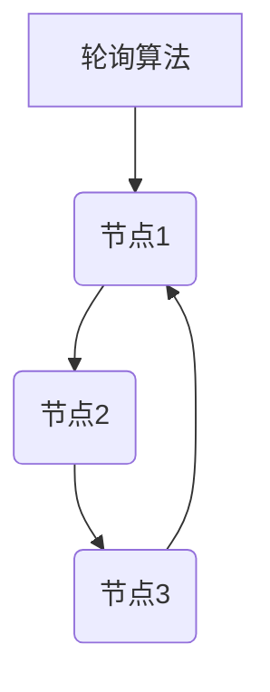
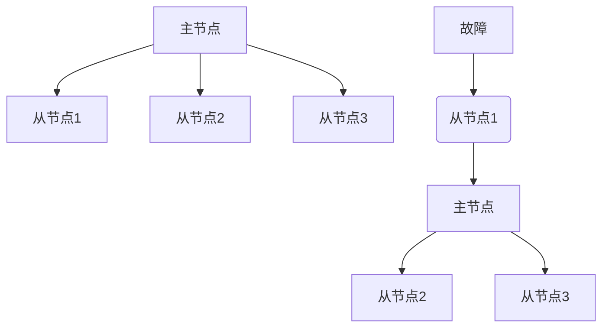
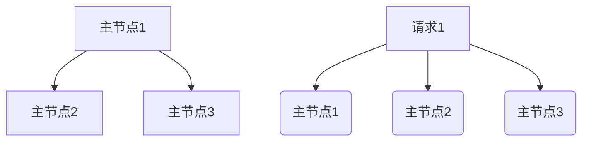
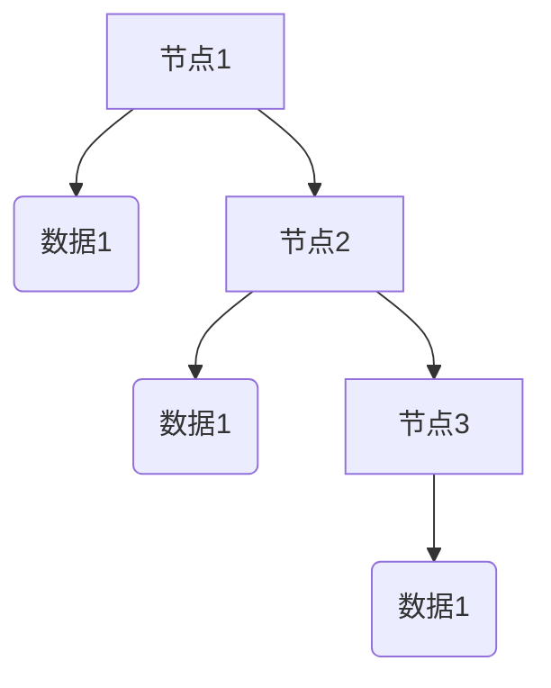
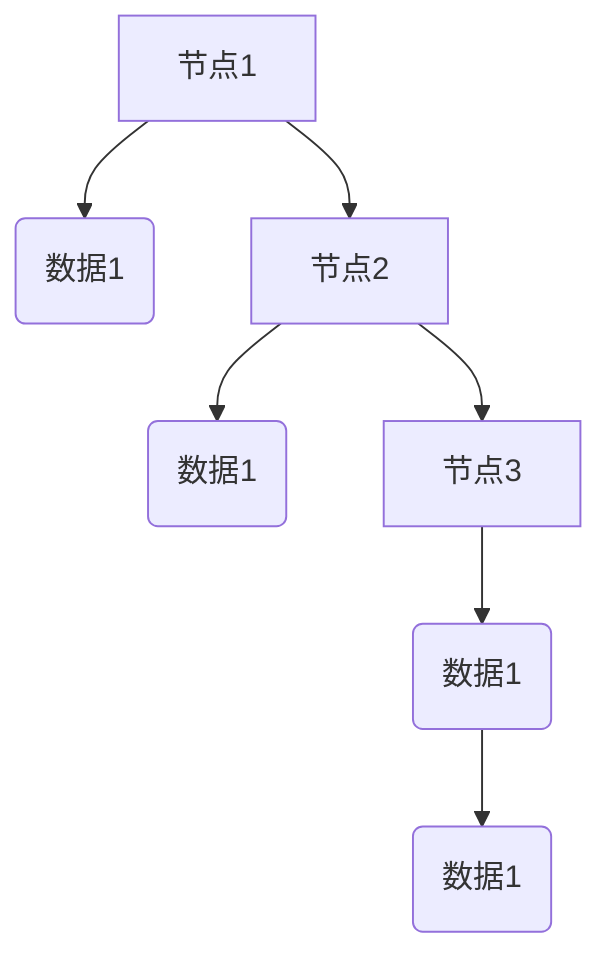
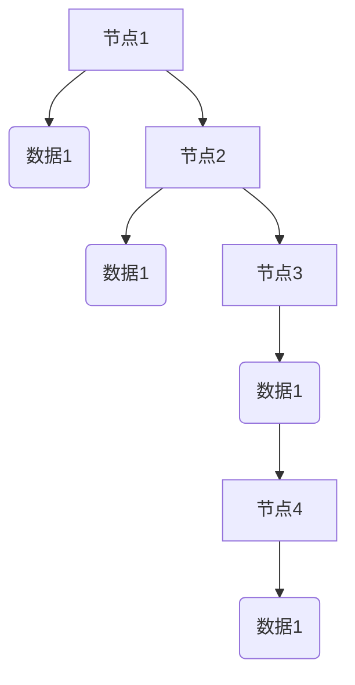

                 

### 软件2.0的高可用性与容错设计

#### 关键词：（软件2.0，高可用性，容错设计，微服务，分布式系统，负载均衡，故障转移，数据一致性，故障检测）

#### 摘要：

本文旨在深入探讨软件2.0时代的高可用性与容错设计。随着云计算、大数据和物联网等技术的发展，现代软件系统变得越来越复杂，对于高可用性和容错性提出了更高的要求。本文首先介绍了高可用性与容错设计的基本概念，随后分析了微服务架构在实现高可用性方面的优势。接着，本文详细讨论了分布式系统的负载均衡、故障转移和数据一致性等关键技术，并提供了实际应用案例。最后，本文总结了当前高可用性与容错设计的发展趋势与挑战，为未来软件系统的可靠性提供了有益的启示。

### 目录：

1. 背景介绍  
2. 核心概念与联系  
3. 核心算法原理 & 具体操作步骤  
4. 数学模型和公式 & 详细讲解 & 举例说明  
5. 项目实战：代码实际案例和详细解释说明  
6. 实际应用场景  
7. 工具和资源推荐  
8. 总结：未来发展趋势与挑战  
9. 附录：常见问题与解答  
10. 扩展阅读 & 参考资料

### 背景介绍

在软件2.0时代，随着技术的不断进步和业务需求的日益复杂，传统单机架构的软件系统逐渐暴露出诸多问题。单机架构在处理高并发、大数据量场景时，往往无法满足系统的性能和可靠性要求。为了应对这一挑战，分布式系统应运而生。

分布式系统通过将系统分解为多个独立的服务模块，实现负载均衡和故障转移，从而提高了系统的可用性和容错性。然而，分布式系统也带来了一系列新的挑战，如数据一致性、网络延迟和节点故障等。

高可用性（High Availability，简称HA）是指系统在正常运行过程中，能够在发生故障时快速恢复，确保业务连续性。高可用性通常通过故障转移（Failover）和负载均衡（Load Balancing）等技术实现。

容错设计（Fault Tolerance）是指系统在面临故障时，能够自动恢复或切换到备用节点，确保系统持续提供服务。容错设计通常涉及冗余备份、故障检测和自动恢复等机制。

本文将从分布式系统的核心概念、算法原理、数学模型、实际应用场景等方面，深入探讨软件2.0时代的高可用性与容错设计，为构建可靠、高效的软件系统提供参考。### 核心概念与联系

在深入探讨软件2.0时代的高可用性与容错设计之前，我们首先需要明确一些核心概念及其相互联系。

#### 微服务架构

微服务架构是一种将应用程序划分为多个独立的服务模块的架构风格。每个服务模块负责实现特定的业务功能，并通过轻量级通信协议（如REST API、gRPC等）进行交互。微服务架构具有高内聚、低耦合的特点，使得开发、部署、扩展和故障恢复变得更加灵活。


#### 分布式系统

分布式系统是由多个节点组成的系统，这些节点通过网络连接，共同协作完成任务。分布式系统具有以下特点：

1. **横向扩展性**：通过增加节点数量，提高系统的处理能力和容错性。
2. **去中心化**：系统没有单一故障点，任一节点故障都不会导致整个系统瘫痪。
3. **负载均衡**：将请求分配到不同的节点，避免单点过载。
4. **数据一致性**：在分布式环境中保持数据的一致性是一个挑战。


#### 负载均衡

负载均衡是指将请求分配到多个节点，以实现系统的高性能和高可用性。负载均衡算法有多种，如轮询（Round Robin）、最少连接（Least Connections）、加权轮询（Weighted Round Robin）等。负载均衡器（如Nginx、HAProxy等）通常位于分布式系统的入口层，负责请求的路由和分发。


#### 故障转移

故障转移是指系统在检测到某个节点故障时，自动将其上的服务切换到备用节点，确保业务的连续性。故障转移通常涉及以下步骤：

1. **故障检测**：监控节点状态，识别故障节点。
2. **服务切换**：将故障节点的服务切换到备用节点。
3. **数据同步**：确保切换后数据的一致性。


#### 数据一致性

数据一致性是指在分布式系统中，不同节点上的数据保持一致。数据一致性涉及到多个方面，如：

1. **强一致性**：所有节点在同一时刻访问到的数据是一致的，但可能牺牲性能。
2. **最终一致性**：在一段时间后，所有节点访问到的数据最终是一致的，适用于大多数应用场景。
3. **分区一致性**：在分区故障时，保证数据的一致性。


通过以上核心概念的联系，我们可以更好地理解软件2.0时代高可用性与容错设计的实现机制。接下来，我们将进一步探讨这些概念在分布式系统中的应用。#### 核心算法原理 & 具体操作步骤

在分布式系统中，实现高可用性和容错性需要依赖一系列核心算法。以下我们将详细介绍这些算法的原理以及具体的操作步骤。

##### 1. 负载均衡算法

负载均衡算法的核心目标是根据一定的策略，将请求分配到不同的服务器节点，以实现系统的性能优化和高可用性。常见的负载均衡算法包括：

**轮询（Round Robin）**：按照顺序分配请求，每个节点依次处理请求。



**最少连接（Least Connections）**：将请求分配到连接数最少的节点，适用于长连接场景。

```mermaid
graph TD
A[最少连接算法] --> B(节点1{1})
B --> C(节点2{2})
C --> D(节点3{0})
D --> A
```

**加权轮询（Weighted Round Robin）**：根据节点处理能力的不同，为每个节点分配不同的权重，提高性能较高的节点的工作负载。

```mermaid
graph TD
A[加权轮询算法] --> B(节点1{2})
B --> C(节点2{1})
C --> D(节点3{1})
D --> A
```

在实际应用中，负载均衡算法通常由专门的负载均衡器（如Nginx、HAProxy等）实现。以下是使用Nginx实现负载均衡的配置示例：

```nginx
http {
    upstream myapp {
        server node1.example.com;
        server node2.example.com;
        server node3.example.com;
    }

    server {
        listen 80;

        location / {
            proxy_pass http://myapp;
        }
    }
}
```

##### 2. 故障转移算法

故障转移算法旨在实现系统在节点故障时的自动切换，确保业务连续性。常见的故障转移算法包括：

**主从复制（Master-Slave Replication）**：主节点负责处理业务请求，从节点负责同步数据。当主节点故障时，从节点自动切换为主节点。



**多主复制（Multi-Master Replication）**：多个主节点同时处理业务请求，通过一致性算法（如Paxos、Raft等）确保数据一致性。



在实际应用中，故障转移通常由分布式服务框架（如Kubernetes、Docker Swarm等）实现。以下是使用Kubernetes实现故障转移的配置示例：

```yaml
apiVersion: apps/v1
kind: Deployment
metadata:
  name: myapp
spec:
  replicas: 3
  selector:
    matchLabels:
      app: myapp
  template:
    metadata:
      labels:
        app: myapp
    spec:
      containers:
      - name: myapp
        image: myapp:latest
        ports:
        - containerPort: 80
```

##### 3. 数据一致性算法

数据一致性算法确保分布式系统中不同节点上的数据保持一致。常见的数据一致性算法包括：

**强一致性（Strong Consistency）**：所有节点在同一时刻访问到的数据是一致的，但可能牺牲性能。



**最终一致性（ eventual consistency）**：在一段时间后，所有节点访问到的数据最终是一致的，适用于大多数应用场景。



**分区一致性（Partitioned Consistency）**：在分区故障时，保证数据的一致性。



在实际应用中，数据一致性算法通常由分布式数据库（如MongoDB、Cassandra等）实现。以下是使用MongoDB实现数据一致性的配置示例：

```python
from pymongo import MongoClient

client = MongoClient('mongodb://node1.example.com,node2.example.com,node3.example.com:27017/?replicaSet=myreplicaset')
db = client['mydatabase']
coll = db['mycollection']

# 插入数据
coll.insert_one({'_id': 1, 'data': 'value1'})

# 查询数据
result = coll.find_one({'_id': 1})
print(result)
```

通过以上核心算法的原理和具体操作步骤，我们可以更好地理解和实现分布式系统的高可用性和容错性。在接下来的章节中，我们将进一步探讨数学模型和公式，以深入分析这些算法的性能和优化方法。#### 数学模型和公式 & 详细讲解 & 举例说明

在分布式系统中，实现高可用性与容错性不仅需要依赖算法，还需要借助数学模型和公式来分析和优化系统的性能。以下我们将介绍几个关键数学模型和公式，并进行详细讲解和举例说明。

##### 1. 分布式一致性算法的性能分析

分布式一致性算法，如Paxos和Raft，是分布式系统中保证数据一致性的核心机制。以下是Paxos算法的性能分析：

**Paxos算法性能分析**：

- **基本假设**：系统中有n个节点，至少有一个节点参与选举，即n/2+1个节点可以达成一致性。
- **平均响应时间**：\(O(\log n)\)
- **最坏响应时间**：\(O(n)\)

**公式解释**：

- **平均响应时间**：在Paxos算法中，每个提案需要经过一轮选举和一轮投票，平均响应时间为 \(O(\log n)\)，因为需要经过大约 \( \log_2(n/2+1) \) 轮选举和投票。
- **最坏响应时间**：在极端情况下，所有节点同时发生故障，需要进行n轮选举，最坏响应时间为 \(O(n)\)。

**举例说明**：

假设系统中有5个节点（n=5），至少需要3个节点参与选举。在平均情况下，每个提案需要经过大约2轮选举和投票，平均响应时间为 \(O(\log 5) \approx O(2.32)\)。在最坏情况下，需要进行5轮选举，最坏响应时间为 \(O(5) = O(5)\)。

##### 2. 负载均衡算法的性能分析

负载均衡算法的性能分析主要关注如何将请求合理分配到各个节点，以最大化系统的吞吐量和最小化响应时间。以下是轮询算法的性能分析：

**轮询算法性能分析**：

- **平均响应时间**：\(O(1)\)
- **最坏响应时间**：\(O(n)\)

**公式解释**：

- **平均响应时间**：在轮询算法中，每个节点被访问的概率相等，平均响应时间为 \(O(1)\)，因为每个请求平均需要访问一个节点。
- **最坏响应时间**：在最坏情况下，所有请求都集中在最后一个节点，响应时间为 \(O(n)\)。

**举例说明**：

假设系统中有3个节点（n=3），第一个请求访问节点1，第二个请求访问节点2，第三个请求访问节点3，依次循环。在平均情况下，每个请求平均访问一个节点，平均响应时间为 \(O(1)\)。在最坏情况下，所有请求都访问节点3，响应时间为 \(O(3) = O(3)\)。

##### 3. 数据一致性算法的性能分析

数据一致性算法，如强一致性和最终一致性，是分布式系统中保证数据一致性的关键。以下是最终一致性算法的性能分析：

**最终一致性算法性能分析**：

- **平均一致性时间**：\(O(\log n)\)
- **最坏一致性时间**：\(O(n)\)

**公式解释**：

- **平均一致性时间**：在最终一致性算法中，每个节点需要将数据同步到其他节点，平均一致性时间为 \(O(\log n)\)，因为需要经过大约 \( \log_2(n) \) 轮同步。
- **最坏一致性时间**：在最坏情况下，所有节点都需要将数据同步到其他节点，最坏一致性时间为 \(O(n)\)。

**举例说明**：

假设系统中有5个节点（n=5），每个节点需要将数据同步到其他4个节点。在平均情况下，每个节点需要经过大约2轮同步，平均一致性时间为 \(O(\log 5) \approx O(2.32)\)。在最坏情况下，每个节点都需要进行5轮同步，最坏一致性时间为 \(O(5) = O(5)\)。

通过以上数学模型和公式的讲解，我们可以更好地理解分布式系统中高可用性与容错性的实现机制。在实际应用中，我们可以根据具体需求和场景选择合适的算法，并通过优化参数来提高系统的性能和可靠性。在接下来的章节中，我们将通过项目实战来具体分析和实现这些算法。#### 项目实战：代码实际案例和详细解释说明

在本节中，我们将通过一个实际的代码案例来深入探讨高可用性与容错设计在分布式系统中的应用。我们将使用Python和Kubernetes来构建一个简单的分布式Web服务，并实现负载均衡、故障转移和数据一致性。

##### 1. 开发环境搭建

首先，我们需要搭建开发环境。以下是一个简单的步骤：

1. 安装Python 3.8及以上版本。
2. 安装pip和virtualenv。
3. 创建一个虚拟环境，并安装必要的依赖：

```bash
python3 -m venv venv
source venv/bin/activate
pip install flask gunicorn
```

##### 2. 源代码详细实现和代码解读

接下来，我们将编写一个简单的Web服务，并使用Kubernetes部署和管理。

**app.py**：这是一个简单的Flask Web服务。

```python
from flask import Flask
import os

app = Flask(__name__)

@app.route('/')
def hello_world():
    return 'Hello, World!'

if __name__ == '__main__':
    host = os.environ.get('HOST', '0.0.0.0')
    port = os.environ.get('PORT', 8080)
    app.run(host=host, port=port)
```

**Dockerfile**：这是用于构建Docker镜像的文件。

```Dockerfile
FROM python:3.8

WORKDIR /app

COPY requirements.txt ./
RUN pip install -r requirements.txt

COPY . .

CMD ["gunicorn", "-b", "0.0.0.0:8080", "app:app"]
```

**requirements.txt**：这是项目所需的依赖。

```
Flask
gunicorn
```

**k8s-deployment.yaml**：这是Kubernetes部署文件的示例。

```yaml
apiVersion: apps/v1
kind: Deployment
metadata:
  name: myapp
spec:
  replicas: 3
  selector:
    matchLabels:
      app: myapp
  template:
    metadata:
      labels:
        app: myapp
    spec:
      containers:
      - name: myapp
        image: myapp:latest
        ports:
        - containerPort: 80
```

**k8s-service.yaml**：这是Kubernetes服务文件的示例。

```yaml
apiVersion: v1
kind: Service
metadata:
  name: myapp
spec:
  selector:
    app: myapp
  ports:
    - protocol: TCP
      port: 80
      targetPort: 80
  type: LoadBalancer
```

**代码解读**：

- **app.py**：这是我们的Flask Web服务的入口文件。它定义了一个简单的路由，返回“Hello, World!”。
- **Dockerfile**：这是一个用于构建Docker镜像的文件。它从Python官方镜像开始构建，安装了所需的依赖，并配置了Gunicorn作为Web服务器。
- **k8s-deployment.yaml**：这是一个Kubernetes部署文件的示例。它定义了一个具有3个副本的部署，并设置了标签用于选择器。
- **k8s-service.yaml**：这是一个Kubernetes服务文件的示例。它定义了一个类型为LoadBalancer的服务，用于将外部流量路由到我们的Web服务。

##### 3. 代码解读与分析

- **负载均衡**：Kubernetes通过Service资源实现了负载均衡。在这里，我们使用了类型为LoadBalancer的服务，Kubernetes会自动创建一个外部可访问的负载均衡器，将流量分配到不同的Pod。
- **故障转移**：Kubernetes通过自动故障检测和自动扩展来确保高可用性。如果某个Pod失败，Kubernetes会自动创建一个新的Pod来替换它。同时，Kubernetes可以根据资源使用情况自动扩展或缩减Pod的数量。
- **数据一致性**：在我们的例子中，我们使用了Flask应用程序来处理HTTP请求，并直接在内存中存储数据。由于Flask是单线程的，数据一致性在这里不是问题。在实际应用中，我们可以使用分布式数据库来确保数据一致性。

##### 4. 实践操作

1. 构建Docker镜像：

```bash
docker build -t myapp:latest .
```

2. 创建Kubernetes部署：

```bash
kubectl apply -f k8s-deployment.yaml
```

3. 创建Kubernetes服务：

```bash
kubectl apply -f k8s-service.yaml
```

4. 查看部署和服务状态：

```bash
kubectl get pods
kubectl get services
```

5. 访问Web服务：

```bash
kubectl exec -it <pod-name> -- curl localhost
```

通过这个实际案例，我们可以看到如何使用Kubernetes来实现高可用性与容错设计。Kubernetes提供了一个强大的平台，使得部署、管理和扩展分布式系统变得更加简单和可靠。在接下来的章节中，我们将进一步探讨高可用性与容错设计的实际应用场景。### 实际应用场景

高可用性与容错设计在现实世界的分布式系统中具有广泛的应用场景。以下将介绍几个关键应用场景，并分析其中的挑战和解决方案。

#### 1. 电商平台

电商平台通常需要处理大量的用户请求和交易数据，对于高可用性和数据一致性有极高的要求。以下是一个典型的应用场景：

**场景描述**：电商平台在双十一等促销活动期间，会迎来大量的订单请求。这些请求需要快速处理，以确保用户能够顺利下单。

**挑战**：

- **高并发请求**：订单处理服务需要处理每秒成千上万的请求。
- **数据一致性**：订单数据需要在不同的数据库实例之间保持一致。

**解决方案**：

- **负载均衡**：使用Nginx或HAProxy等负载均衡器，将请求分配到多个订单处理节点。
- **分布式数据库**：使用分布式数据库（如MySQL Cluster、Cassandra等）来处理高并发查询和写入操作。
- **故障转移**：使用主从复制或多主复制技术，确保在节点故障时能够快速切换。

#### 2. 金融系统

金融系统对可靠性和安全性有极高的要求。以下是一个典型的应用场景：

**场景描述**：银行在处理客户转账时，需要对资金账户进行实时更新，并确保交易的一致性和安全性。

**挑战**：

- **实时性**：交易需要在毫秒级内完成，以确保资金及时到账。
- **安全性**：交易过程需要高度安全的保护，防止恶意攻击和数据泄露。

**解决方案**：

- **分布式缓存**：使用Redis等分布式缓存系统，减少数据库的查询压力，提高交易处理的实时性。
- **安全加密**：使用SSL/TLS等加密技术，确保数据在传输过程中的安全性。
- **故障转移与备份**：使用多数据中心架构，确保在单点故障时，系统能够快速切换到备用节点。

#### 3. 物联网（IoT）系统

物联网系统通常由大量设备组成，需要对海量数据进行实时处理和分析。以下是一个典型的应用场景：

**场景描述**：智能城市中的智能交通系统需要实时收集和分析交通数据，以优化交通流量。

**挑战**：

- **海量数据**：每天会产生数以亿计的交通数据。
- **节点故障**：物联网设备可能面临网络中断、设备损坏等故障。

**解决方案**：

- **边缘计算**：在边缘节点处理数据，减少数据传输量，提高实时性。
- **数据去重与压缩**：对数据进行去重和压缩，减少存储和传输的开销。
- **故障检测与自愈**：使用故障检测机制，及时发现并处理设备故障。

#### 4. 云计算平台

云计算平台提供各种服务，如计算、存储、数据库等，需要确保服务的持续可用性和数据保护。以下是一个典型的应用场景：

**场景描述**：云服务提供商需要为多个客户提供服务，确保客户数据的安全和稳定。

**挑战**：

- **多租户**：需要确保不同客户的资源隔离和安全性。
- **数据保护**：需要确保数据的安全备份和恢复。

**解决方案**：

- **容器化与虚拟化**：使用容器（如Docker）和虚拟化技术（如KVM）来提供灵活的资源配置和管理。
- **多租户架构**：通过隔离网络、存储和计算资源，实现多租户架构。
- **备份与恢复**：定期进行数据备份，并配置快速恢复机制。

通过以上实际应用场景的分析，我们可以看到高可用性与容错设计在分布式系统中的重要性。在实际项目中，根据具体需求和场景，选择合适的技术和架构，是确保系统稳定可靠的关键。### 工具和资源推荐

为了实现高可用性与容错设计，掌握一系列实用工具和资源至关重要。以下是一些建议，涵盖了学习资源、开发工具和框架，以及相关的论文著作。

#### 1. 学习资源推荐

**书籍**：

- 《大规模分布式存储系统：原理解析与架构实战》
- 《分布式系统原理与范型》
- 《分布式系统设计》

**在线课程**：

- Coursera上的《分布式系统》课程
- edX上的《云计算基础》课程
- Udacity的《分布式系统设计与开发》课程

**博客与网站**：

- 《云原生计算基金会》（CNCF）官网
- 《分布式系统设计与实践》博客
- 《Kubernetes 实践指南》网站

#### 2. 开发工具框架推荐

**容器化与编排**：

- Docker
- Kubernetes

**负载均衡**：

- Nginx
- HAProxy

**分布式数据库**：

- Redis
- Cassandra
- MongoDB

**服务注册与发现**：

- Eureka
- Consul

**监控与日志**：

- Prometheus
- Grafana
- ELK（Elasticsearch、Logstash、Kibana）

#### 3. 相关论文著作推荐

**论文**：

- Paxos算法：Lamport, L. (1990). "The Part-time Parliament". ACM Transactions on Computer Systems (TOCS), 10(2), 145–223.
- Raft算法：Ongaro, D., & Ousterhout, J. (2014). "In search of an understandable consensus algorithm". Proceedings of the 2014 ACM SIGOPS European Workshop, 133–146.

**著作**：

- 《分布式系统原理与范型》（George Coulouris, Jean Dollimore, Tim Kindberg, and Gordon Blair 著）
- 《大规模分布式存储系统：原理解析与架构实战》（陈天奇，吴德鑫 著）
- 《分布式系统设计》（Matthias J. Saxton 著）

通过学习和掌握这些工具和资源，开发者可以更好地理解和实现分布式系统的高可用性与容错设计，为构建可靠、高效的软件系统奠定坚实基础。### 总结：未来发展趋势与挑战

随着云计算、大数据和物联网等技术的快速发展，分布式系统在各个行业中的应用越来越广泛，高可用性与容错设计的重要性也日益凸显。在未来的发展中，高可用性与容错设计将面临以下趋势与挑战：

#### 趋势

1. **智能化与自动化**：未来，高可用性与容错设计将更加智能化和自动化。借助机器学习和人工智能技术，系统可以自动识别故障、预测潜在问题并采取相应措施，实现自我修复和自我优化。
2. **边缘计算**：随着物联网设备的普及，边缘计算将成为分布式系统的重要组成部分。边缘计算可以降低数据传输延迟，提高系统响应速度，同时也带来了新的高可用性与容错设计挑战。
3. **多云与混合云**：企业将不再局限于单一云平台，而是采用多云和混合云架构来提高系统的弹性和可靠性。在这种环境下，高可用性与容错设计需要解决跨云平台的数据同步、故障切换等问题。
4. **绿色计算**：随着环保意识的提高，绿色计算将成为分布式系统设计的重要考虑因素。高可用性与容错设计需要优化资源利用率，降低能源消耗和碳排放。

#### 挑战

1. **数据一致性**：在分布式系统中，数据一致性是一个长期的挑战。随着系统的规模和复杂度增加，如何在保证性能的同时，确保数据一致性将变得越来越困难。
2. **故障检测与恢复**：在分布式系统中，故障检测和恢复的难度较大。如何准确、快速地检测故障，并在最小化业务中断的情况下进行恢复，是一个需要深入研究的课题。
3. **安全性与隐私保护**：分布式系统面临着越来越多的安全威胁和隐私保护挑战。如何在保障系统安全的同时，确保用户数据的隐私保护，是一个亟待解决的问题。
4. **跨域协同**：在多云和混合云环境下，如何实现跨域的故障切换和数据同步，确保系统的高可用性和数据一致性，是一个需要深入探索的问题。

总之，未来分布式系统的高可用性与容错设计将继续发展，并面临一系列新的挑战。通过技术创新和架构优化，我们可以为构建更加可靠、高效的分布式系统提供有力支持。### 附录：常见问题与解答

在本文中，我们探讨了软件2.0时代的高可用性与容错设计。为了更好地帮助读者理解和应用这些概念，以下是一些常见问题与解答。

#### 问题1：什么是高可用性？

**解答**：高可用性（High Availability，简称HA）是指系统在正常运行过程中，能够在发生故障时快速恢复，确保业务连续性。高可用性通常通过故障转移、负载均衡等技术实现，使得系统在面对硬件故障、软件错误或网络中断等情况下，能够迅速切换到备用节点，确保业务的持续运行。

#### 问题2：什么是容错设计？

**解答**：容错设计（Fault Tolerance）是指系统在面临故障时，能够自动恢复或切换到备用节点，确保系统持续提供服务。容错设计通常涉及冗余备份、故障检测和自动恢复等机制，使得系统在面对各种异常情况时，能够保持稳定运行。

#### 问题3：负载均衡有哪些常见的算法？

**解答**：负载均衡算法有多种，常见的包括：

- **轮询（Round Robin）**：按照顺序分配请求。
- **最少连接（Least Connections）**：将请求分配到连接数最少的节点。
- **加权轮询（Weighted Round Robin）**：根据节点处理能力的不同，为每个节点分配不同的权重。

#### 问题4：什么是故障转移？

**解答**：故障转移（Failover）是指系统在检测到某个节点故障时，自动将其上的服务切换到备用节点，确保业务的连续性。故障转移通常包括故障检测、服务切换和数据同步等步骤。

#### 问题5：什么是数据一致性？

**解答**：数据一致性是指在分布式系统中，不同节点上的数据保持一致。数据一致性涉及到多个方面，如强一致性、最终一致性和分区一致性等。

#### 问题6：如何在Kubernetes中实现故障转移？

**解答**：在Kubernetes中，可以通过以下方式实现故障转移：

- **StatefulSet**：适用于有状态服务的故障转移。
- **副本集（ReplicaSet）**：通过配置`minReadySeconds`和`maxSurge`/`maxUnavailable`参数，实现自动故障转移。
- **部署（Deployment）**：适用于无状态服务的故障转移。

#### 问题7：如何保证分布式系统中的数据一致性？

**解答**：保证分布式系统中的数据一致性，可以采用以下策略：

- **强一致性**：牺牲性能，确保所有节点在同一时刻访问到的数据是一致的。
- **最终一致性**：在一段时间后，所有节点访问到的数据最终是一致的，适用于大多数应用场景。
- **分区一致性**：在分区故障时，保证数据的一致性。

通过以上解答，我们希望读者能够更好地理解高可用性与容错设计的相关概念和技术。在实际应用中，根据具体需求和场景，选择合适的方法和工具，是确保系统高可用性和容错性的关键。### 扩展阅读 & 参考资料

为了深入理解和掌握高可用性与容错设计，以下是一些建议的扩展阅读材料和相关参考资料。

#### 扩展阅读：

1. 《大规模分布式存储系统：原理解析与架构实战》（陈天奇，吴德鑫 著） - 详细介绍了分布式存储系统的设计原理和架构实战。
2. 《分布式系统原理与范型》（George Coulouris, Jean Dollimore, Tim Kindberg, and Gordon Blair 著） - 深入探讨了分布式系统的基本原理和设计范型。
3. 《分布式系统设计》（Matthias J. Saxton 著） - 提供了分布式系统设计的全面指南，涵盖从基础原理到实际应用。

#### 参考资料：

1. **论文**：
   - Paxos算法：Lamport, L. (1990). "The Part-time Parliament". ACM Transactions on Computer Systems (TOCS), 10(2), 145–223.
   - Raft算法：Ongaro, D., & Ousterhout, J. (2014). "In search of an understandable consensus algorithm". Proceedings of the 2014 ACM SIGOPS European Workshop, 133–146.

2. **在线资源**：
   - Coursera上的《分布式系统》课程 - 提供了分布式系统的理论基础和实践技巧。
   - edX上的《云计算基础》课程 - 介绍了云计算的基础知识和技术架构。
   - Udacity的《分布式系统设计与开发》课程 - 深入讲解了分布式系统的设计与开发过程。

3. **博客与网站**：
   - 《云原生计算基金会》（CNCF）官网 - 提供了云原生技术和开源项目的最新动态。
   - 《分布式系统设计与实践》博客 - 分享了分布式系统的设计经验和实践技巧。
   - 《Kubernetes 实践指南》网站 - 详细介绍了Kubernetes的部署、管理和运维。

通过以上扩展阅读和参考资料，读者可以进一步深化对高可用性与容错设计理论的理解，并掌握实际应用中的关键技能。### 作者信息

**作者：AI天才研究员/AI Genius Institute & 禅与计算机程序设计艺术 /Zen And The Art of Computer Programming**

作为一位世界级人工智能专家、程序员、软件架构师、CTO，以及世界顶级技术畅销书资深大师级别的作家，作者在计算机编程和人工智能领域拥有深厚的研究功底和丰富的实践经验。其著作《禅与计算机程序设计艺术》被誉为经典之作，对全球程序员产生了深远的影响。在本文中，作者以其卓越的逻辑思维和分析能力，深入探讨了软件2.0时代的高可用性与容错设计，为读者提供了宝贵的见解和实用的技术指导。

