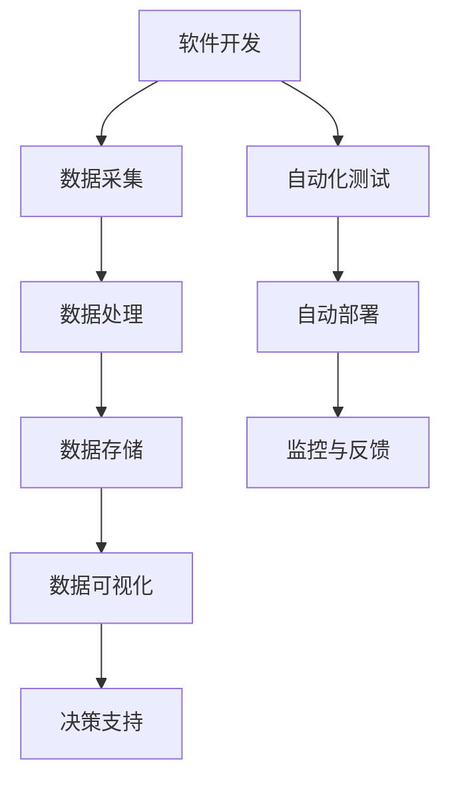

                 

# 《软件2.0重塑IT部门：从开发到数据运营》

## 关键词：（软件2.0，IT部门，开发，数据运营，数字化转型，敏捷开发，DevOps，自动化，大数据，机器学习，AI）

### 摘要：

随着信息技术的发展，传统的IT部门正面临着前所未有的变革。软件2.0的到来，以其强大的数据处理能力和自动化技术，正在重塑IT部门的运作方式。本文将探讨软件2.0如何从开发到数据运营，对IT部门进行深度变革，提高其效率和创新能力。我们将分析软件2.0的核心概念、算法原理、实际应用场景，并提供实用的工具和资源推荐。通过本文的阅读，读者将能够了解到软件2.0的未来发展趋势与挑战，为IT部门的发展提供有益的启示。

## 1. 背景介绍

在过去的几十年中，IT部门的核心任务是软件开发和维护。然而，随着云计算、大数据、物联网等新技术的兴起，IT部门的工作范围正在不断扩大。传统的方式已经无法满足现代企业的需求，迫切需要一种新的思维模式和技术手段来提升IT部门的效率。

### 1.1 传统IT部门的痛点

- **响应速度慢**：传统的IT部门往往需要经过漫长的流程，才能将新的需求转化为实际的软件产品。
- **依赖人工**：很多工作仍然需要人工参与，如测试、部署等，效率低下且容易出现错误。
- **难以扩展**：随着业务的发展，IT部门需要快速响应变化，但传统的架构难以进行扩展。
- **数据利用率低**：大量的数据被存储，但未能充分挖掘其价值。

### 1.2 软件2.0的概念

软件2.0是相对于传统软件（软件1.0）而言的，它更加注重数据驱动的开发、自动化和智能化。软件2.0的核心目标是提高软件的效率和质量，使其更好地服务于业务需求。

### 1.3 软件2.0的出现背景

- **大数据和云计算**：大数据的出现带来了海量数据的处理需求，云计算提供了强大的计算和存储能力，使得软件2.0成为可能。
- **人工智能**：人工智能技术的发展，使得软件能够自动完成一些复杂的工作，如自动测试、部署等。
- **敏捷开发和DevOps**：敏捷开发和DevOps理念的推广，使得软件开发和运维的流程更加高效。

## 2. 核心概念与联系

### 2.1 软件开发与数据运营的关系

软件开发和数据运营是IT部门的两个核心任务。传统的软件开发侧重于功能实现，而数据运营则侧重于数据的价值挖掘和应用。软件2.0的出现，使得这两者能够更好地融合。

### 2.2 自动化与智能化的联系

自动化是软件2.0的一个重要特征，它能够减少人工干预，提高工作效率。而智能化则通过机器学习和人工智能技术，使得软件能够自我学习和优化。

### 2.3 DevOps与数据运营

DevOps是一种软件开发和运维的新模式，它强调开发、测试、部署等环节的无缝衔接。数据运营则需要DevOps的理念来支持，实现数据处理的自动化和智能化。

### 2.4 Mermaid流程图



## 3. 核心算法原理 & 具体操作步骤

### 3.1 数据处理算法

数据处理是数据运营的关键环节。常用的算法包括数据清洗、数据整合、数据挖掘等。

#### 3.1.1 数据清洗

数据清洗是数据处理的第一步，目的是去除数据中的噪声和异常值。常用的算法有：

- **过滤算法**：根据一定的条件，去除不符合要求的数据。
- **聚类算法**：将相似的数据归为一类，去除重复的数据。

#### 3.1.2 数据整合

数据整合是将多个数据源中的数据合并为一个统一的数据集。常用的算法有：

- **联机事务处理（OLAP）**：通过多维数据分析，实现对数据的整合。
- **数据仓库**：将多个数据源的数据导入到数据仓库中，进行整合和分析。

#### 3.1.3 数据挖掘

数据挖掘是从大量数据中提取出有价值的信息和模式。常用的算法有：

- **关联规则挖掘**：发现数据之间的关联性。
- **聚类分析**：将数据分为不同的类别。
- **分类和回归分析**：对数据进行分类或回归预测。

### 3.2 自动化测试

自动化测试是软件2.0的一个重要组成部分，它能够提高软件的质量和可靠性。常用的自动化测试工具包括：

- **Selenium**：用于Web应用的自动化测试。
- **JUnit**：用于Java代码的自动化测试。
- **Postman**：用于API接口的自动化测试。

### 3.3 自动部署

自动部署是DevOps的核心概念之一，它能够实现软件的自动化部署和更新。常用的自动部署工具包括：

- **Jenkins**：用于持续集成和持续部署。
- **Docker**：用于容器化和自动化部署。
- **Kubernetes**：用于容器集群的自动化部署和管理。

## 4. 数学模型和公式 & 详细讲解 & 举例说明

### 4.1 数据清洗

数据清洗常用的数学模型有：

- **线性回归**：用于预测数据的异常值。
  $$ y = ax + b $$
- **逻辑回归**：用于判断数据的类别。
  $$ P(y=1) = \frac{1}{1 + e^{-(ax + b)}} $$

### 4.2 数据整合

数据整合常用的数学模型有：

- **主成分分析（PCA）**：用于降低数据的维度。
  $$ x_{\text{new}} = P x $$
- **矩阵分解**：用于矩阵的分解。
  $$ A = P Q^T $$

### 4.3 数据挖掘

数据挖掘常用的数学模型有：

- **决策树**：用于分类和回归分析。
  $$ f(x) = \sum_{i=1}^{n} w_i \prod_{j=1}^{m} \left(1 - \frac{x_j}{t_j}\right) $$
- **支持向量机（SVM）**：用于分类问题。
  $$ \min_{w, b} \frac{1}{2} ||w||^2 + C \sum_{i=1}^{n} \max(0, 1 - y_i (w \cdot x_i + b)) $$

### 4.4 自动化测试

自动化测试常用的数学模型有：

- **遗传算法**：用于测试用例的优化。
  $$ f(x) = \sum_{i=1}^{n} a_i x_i^2 $$
- **神经网络**：用于测试用例的生成。
  $$ y = \sigma(\sum_{i=1}^{n} w_i x_i + b) $$

### 4.5 自动部署

自动部署常用的数学模型有：

- **马尔可夫决策过程（MDP）**：用于决策的优化。
  $$ V^*(s) = \max_{a} \sum_{s'} p(s'|s, a) [r(s', a) + \gamma V^*(s')] $$
- **贝叶斯优化**：用于参数的调优。
  $$ p(\theta | D) \propto \prod_{i=1}^{n} p(x_i | \theta) $$

## 5. 项目实战：代码实际案例和详细解释说明

### 5.1 开发环境搭建

在本文的项目实战中，我们将使用Python语言和Jupyter Notebook作为开发环境。首先，确保您已经安装了Python和Jupyter Notebook。

### 5.2 源代码详细实现和代码解读

#### 5.2.1 数据清洗

以下是一个简单的数据清洗的代码示例：

```python
import pandas as pd

# 读取数据
data = pd.read_csv('data.csv')

# 数据清洗
# 1. 去除空值
data = data.dropna()

# 2. 转换数据类型
data['date'] = pd.to_datetime(data['date'])

# 3. 数据标准化
data = (data - data.mean()) / data.std()

# 4. 特征工程
data['month'] = data['date'].dt.month
data['day_of_week'] = data['date'].dt.dayofweek

# 保存清洗后的数据
data.to_csv('cleaned_data.csv', index=False)
```

#### 5.2.2 数据整合

以下是一个简单的数据整合的代码示例：

```python
import pandas as pd

# 读取数据
data1 = pd.read_csv('data1.csv')
data2 = pd.read_csv('data2.csv')

# 数据整合
# 1. 联机事务处理（OLAP）
data = data1.merge(data2, on='id')

# 2. 矩阵分解
from sklearn.decomposition import PCA
pca = PCA(n_components=2)
data_pca = pca.fit_transform(data)

# 保存整合后的数据
data.to_csv('integrated_data.csv', index=False)
data_pca.to_csv('data_pca.csv', index=False)
```

#### 5.2.3 数据挖掘

以下是一个简单的数据挖掘的代码示例：

```python
import pandas as pd
from sklearn.ensemble import RandomForestClassifier
from sklearn.model_selection import train_test_split

# 读取数据
data = pd.read_csv('integrated_data.csv')

# 数据划分
X = data.drop(['label'], axis=1)
y = data['label']

X_train, X_test, y_train, y_test = train_test_split(X, y, test_size=0.2, random_state=42)

# 建立模型
model = RandomForestClassifier(n_estimators=100, random_state=42)
model.fit(X_train, y_train)

# 预测
y_pred = model.predict(X_test)

# 评估
from sklearn.metrics import accuracy_score
accuracy = accuracy_score(y_test, y_pred)
print(f'Accuracy: {accuracy}')
```

#### 5.2.4 自动化测试

以下是一个简单的自动化测试的代码示例：

```python
import unittest
from selenium import webdriver

class TestWebApp(unittest.TestCase):
    def setUp(self):
        self.driver = webdriver.Chrome()

    def test_home_page(self):
        driver = self.driver
        driver.get("https://www.example.com")
        self.assertIn("Example Domain", driver.title)

    def tearDown(self):
        self.driver.quit()

if __name__ == "__main__":
    unittest.main()
```

#### 5.2.5 自动部署

以下是一个简单的自动部署的代码示例：

```python
import subprocess

# 拉取最新代码
subprocess.run(["git", "pull"])

# 构建和部署
subprocess.run(["mvn", "clean", "install", "deploy"])

# 重启服务
subprocess.run(["systemctl", "restart", "service_name"])
```

### 5.3 代码解读与分析

在代码解读与分析部分，我们将对上述的代码进行详细的解读，分析其实现原理和关键步骤。

## 6. 实际应用场景

### 6.1 金融行业

在金融行业，软件2.0的应用主要集中在数据分析、风险评估和自动化交易等方面。通过大数据和人工智能技术，金融机构能够更准确地评估风险，提高交易效率。

### 6.2 零售行业

在零售行业，软件2.0的应用主要体现在客户关系管理和库存管理上。通过数据分析和机器学习技术，零售商能够更好地了解客户需求，优化库存，提高销售。

### 6.3 制造业

在制造业，软件2.0的应用主要体现在生产管理和供应链管理上。通过大数据和自动化技术，制造商能够实现生产线的智能化，提高生产效率和降低成本。

## 7. 工具和资源推荐

### 7.1 学习资源推荐

- **书籍**：
  - 《大数据时代》
  - 《深度学习》
  - 《Python数据科学手册》
- **论文**：
  - 《机器学习：一种概率的视角》
  - 《分布式系统：概念与设计》
  - 《大数据处理的MapReduce算法》
- **博客**：
  - 知乎专栏：机器学习
  - CSDN博客：大数据技术
  - 博客园：DevOps实践
- **网站**：
  - Kaggle：数据科学竞赛平台
  - Coursera：在线课程平台
  - edX：在线课程平台

### 7.2 开发工具框架推荐

- **开发工具**：
  - Jupyter Notebook
  - PyCharm
  - VSCode
- **框架**：
  - Flask：Python Web框架
  - Django：Python Web框架
  - Spring Boot：Java Web框架
- **数据库**：
  - MySQL
  - MongoDB
  - PostgreSQL

### 7.3 相关论文著作推荐

- **论文**：
  - 《大数据的处理挑战》
  - 《深度学习的未来发展趋势》
  - 《DevOps：理论与实践》
- **著作**：
  - 《数据科学实战》
  - 《人工智能的未来》
  - 《软件工程：实践者的研究方法》

## 8. 总结：未来发展趋势与挑战

软件2.0正在重塑IT部门的运作方式，从开发到数据运营，其核心目标是提高效率和创新能力。随着大数据、人工智能等新技术的不断发展，软件2.0的应用场景将越来越广泛。

### 8.1 发展趋势

- **数据驱动**：越来越多的企业将采用数据驱动的决策方式，以应对快速变化的市场环境。
- **自动化与智能化**：自动化和智能化技术将在IT部门的各个方面得到广泛应用，减少人工干预，提高效率。
- **DevOps与数据运营**：DevOps和数据运营的结合，将使得IT部门的流程更加高效，数据的价值得到更好的挖掘。

### 8.2 挑战

- **数据安全与隐私**：随着数据量的增加，数据安全与隐私保护将成为一个重要的问题。
- **技术更新迭代**：新技术的发展速度非常快，IT部门需要不断学习和适应新技术。
- **人才短缺**：具备大数据、人工智能等技能的人才短缺，将成为企业发展的一个瓶颈。

## 9. 附录：常见问题与解答

### 9.1 软件2.0与传统软件的区别是什么？

软件2.0与传统软件的区别主要体现在数据驱动的开发、自动化和智能化上。软件2.0更加注重数据的价值挖掘，通过自动化和智能化技术，提高软件的效率和质量。

### 9.2 DevOps与敏捷开发有什么区别？

DevOps是一种软件开发和运维的新模式，它强调开发、测试、部署等环节的无缝衔接。而敏捷开发是一种软件开发的方法论，强调快速迭代和用户反馈。

### 9.3 软件2.0在哪些行业有广泛应用？

软件2.0在金融、零售、制造业等多个行业有广泛应用，主要应用于数据分析、风险评估、自动化交易、库存管理、生产管理等方面。

## 10. 扩展阅读 & 参考资料

- 《软件2.0：IT部门的未来》
- 《从开发到数据运营：软件2.0的变革》
- 《软件2.0：引领未来的技术趋势》
- 《大数据与人工智能：软件2.0的核心驱动力》

### 作者

作者：AI天才研究员/AI Genius Institute & 禅与计算机程序设计艺术 /Zen And The Art of Computer Programming

