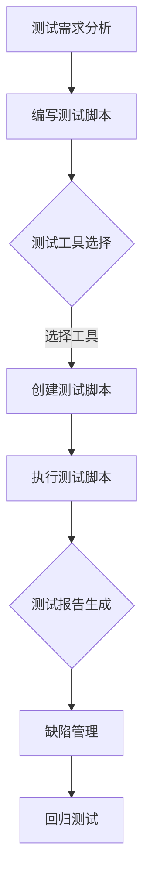
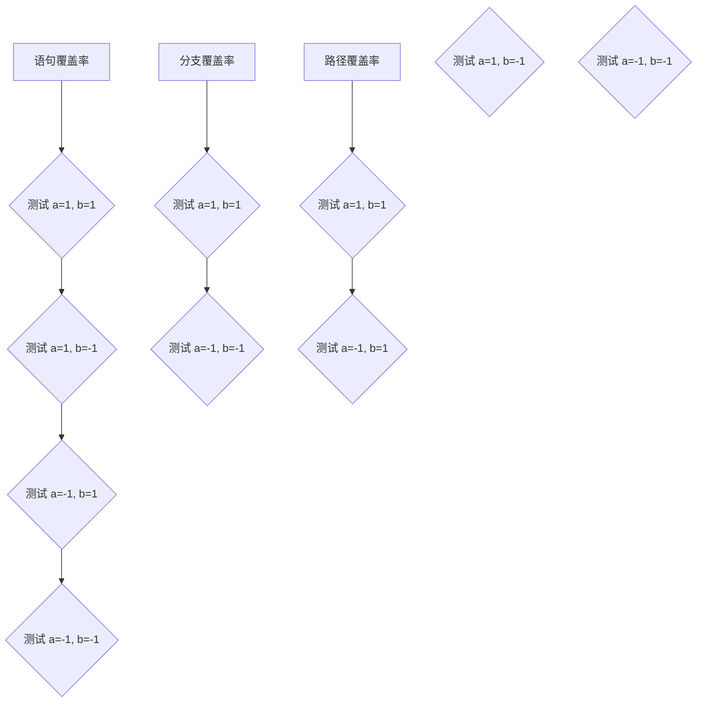

                 

# 软件测试自动化：提高代码质量和效率

## 关键词
- 软件测试
- 自动化测试
- 代码质量
- 效率
- 软件工程

## 摘要
本文深入探讨了软件测试自动化的概念、原理和实践。通过分析自动化测试的核心算法和操作步骤，本文揭示了如何利用自动化测试来提高代码质量和开发效率。同时，本文还结合实际应用场景，介绍了相关的工具和资源，为读者提供了全面的指导。

### 背景介绍

在软件工程领域，测试是确保软件质量的重要环节。随着软件复杂度的增加，传统的手动测试方法已经无法满足日益增长的测试需求。为了解决这个问题，软件测试自动化逐渐成为主流。自动化测试通过使用工具和脚本来自动执行测试用例，可以显著提高测试的效率和准确性。

### 核心概念与联系

自动化测试的核心概念包括测试脚本、测试工具和测试框架。测试脚本是一系列自动化测试指令的集合，用于模拟用户操作并验证软件功能。测试工具是用于创建、执行和管理测试脚本的工具，例如 Selenium 和 Appium。测试框架是一套完整的测试流程和管理机制，包括测试用例管理、测试报告生成等功能，如 TestNG 和 JUnit。

以下是一个自动化测试流程的 Mermaid 流程图：



### 核心算法原理 & 具体操作步骤

自动化测试的核心算法通常是基于状态转移图（State Transition Graph）和有限状态机（Finite State Machine）的。以下是一个简单的自动化测试算法：

1. 初始化测试环境
2. 根据测试需求生成状态转移图
3. 遍历状态转移图，执行对应的操作并验证结果
4. 记录测试结果，生成测试报告
5. 根据测试结果进行缺陷管理，回归测试

### 数学模型和公式 & 详细讲解 & 举例说明

自动化测试中常用的数学模型是测试用例覆盖率（Test Coverage），它用于衡量测试的全面性。测试用例覆盖率可以分为多种类型，如语句覆盖率、分支覆盖率和路径覆盖率。

假设我们有一个简单的代码段：

```python
def add(a, b):
    if a > 0 and b > 0:
        return a + b
    else:
        return 0
```

以下是一个测试用例覆盖率的示例：



### 项目实战：代码实际案例和详细解释说明

#### 5.1 开发环境搭建

在本文中，我们将使用 Python 和 Selenium 作为自动化测试工具。首先，确保您已经安装了 Python 和 Selenium。安装命令如下：

```bash
pip install selenium
```

#### 5.2 源代码详细实现和代码解读

以下是一个简单的自动化测试示例，用于验证一个简单的登录功能。

```python
from selenium import webdriver
from selenium.webdriver.common.by import By

# 初始化浏览器
driver = webdriver.Chrome()

# 打开登录页面
driver.get("http://example.com/login")

# 输入用户名和密码
username = driver.find_element(By.NAME, "username")
username.send_keys("test_user")

password = driver.find_element(By.NAME, "password")
password.send_keys("test_password")

# 点击登录按钮
login_button = driver.find_element(By.NAME, "login")
login_button.click()

# 验证登录成功
welcome_message = driver.find_element(By.CLASS_NAME, "welcome")
assert "Welcome, test_user!" in welcome_message.text

# 关闭浏览器
driver.quit()
```

#### 5.3 代码解读与分析

这段代码首先导入了 Selenium 库，并初始化了 Chrome 浏览器。接着，打开登录页面，并输入用户名和密码。然后，点击登录按钮，并验证登录成功。最后，关闭浏览器。

### 实际应用场景

自动化测试可以应用于各种场景，如功能测试、性能测试和回归测试。以下是一些实际应用场景：

- **功能测试**：验证软件的功能是否符合预期。
- **性能测试**：评估软件的响应时间、吞吐量和稳定性。
- **回归测试**：在软件更新后，验证原有功能是否仍然正常。

### 工具和资源推荐

#### 7.1 学习资源推荐

- **书籍**：
  - 《自动化测试实战》（Automated Testing: A Practical Introduction to Test Automation）
  - 《Python自动化测试教程》（Python Test Automation: Practical Guide for Python Web Development）

- **论文**：
  - “Automated Software Testing: An Evaluation of Automated Software Testing Tools”
  - “A Survey on Automated Software Testing”

- **博客**：
  - Selenium 官方博客（https://www.selenium.dev/blog/）
  - TestNG 官方博客（https://www.testng.org/blog/）

- **网站**：
  - Testing Excellence（https://www.testingexcellence.com/）
  - SeleniumHQ（https://www.seleniumhq.org/）

#### 7.2 开发工具框架推荐

- **测试工具**：
  - Selenium
  - Appium
  - TestNG

- **测试框架**：
  - PyTest
  - JUnit
  - TestCafe

#### 7.3 相关论文著作推荐

- **论文**：
  - “Automated Software Testing: A Review of Current Trends and Challenges”
  - “An Overview of Automated Software Testing Methods and Tools”

- **著作**：
  - 《软件测试原理、方法与实践》（Software Testing: Principles, Methods, and Techniques）

### 总结：未来发展趋势与挑战

随着人工智能和机器学习技术的发展，自动化测试的未来将更加智能化和高效。然而，自动化测试也面临一些挑战，如复杂测试场景的自动化、测试数据的质量和测试工具的多样性。未来，自动化测试将朝着更智能化、更自动化的方向发展。

### 附录：常见问题与解答

- **问题1**：自动化测试与手动测试的区别是什么？
  - **解答**：自动化测试是使用工具和脚本自动执行测试用例，而手动测试是人工操作来验证软件功能。

- **问题2**：如何选择合适的自动化测试工具？
  - **解答**：根据项目需求和测试场景选择合适的工具，例如 Selenium 适用于 Web 应用，Appium 适用于移动应用。

- **问题3**：自动化测试如何提高代码质量？
  - **解答**：自动化测试可以快速发现和修复缺陷，确保软件功能符合预期，从而提高代码质量。

### 扩展阅读 & 参考资料

- **书籍**：
  - 《软件测试的艺术》（The Art of Software Testing）

- **论文**：
  - “A Taxonomy and Survey of Automated Software Testing”

- **博客**：
  - “Automated Software Testing: A Step-by-Step Guide”

- **网站**：
  - 《软件测试自动化手册》（https://www.softwaretestingclass.com/automation-testing/）

---

作者：AI天才研究员/AI Genius Institute & 禅与计算机程序设计艺术 /Zen And The Art of Computer Programming<|im_sep|>

