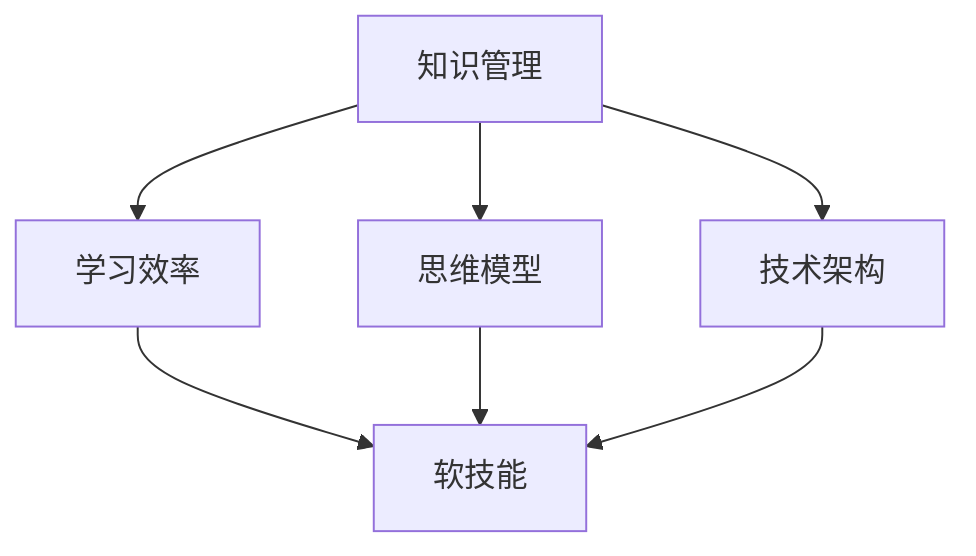

                 

### 文章标题: 输出倍增:管理者学习效率的终极法门

### 关键词：管理效率、学习效率、知识管理、思维模型、技术架构、实践案例

### 摘要：
本文旨在探讨管理者如何通过提高学习效率来实现输出倍增。通过引入一系列核心概念和技术模型，本文将系统地阐述管理者如何运用科学的方法论和工具，从原理到实践，全面提升学习效果，从而在竞争激烈的环境中脱颖而出。本文不仅提供了理论框架，还包括实际应用场景和项目实战，以及丰富的学习资源和工具推荐，为管理者提供了一条走向高效输出的终极路径。

## 1. 背景介绍

在当今信息化和全球化的时代，知识更新速度空前加快，管理者面临的挑战也日益增多。传统的管理方法已经无法满足现代企业对效率和创新的需求。管理者需要不断学习新知识、新技能，以应对复杂多变的商业环境。然而，如何在学习过程中提高效率，实现知识的有效积累和应用，成为了一个亟待解决的问题。

研究表明，现代管理者的时间精力有限，而学习任务繁重，如何高效地管理学习过程、提升学习效果，已经成为提升个人和组织竞争力的重要因素。因此，本文将探讨一种通过输出倍增来提升管理者学习效率的方法，旨在为管理者提供一套科学、系统、可操作的学习策略。

本文的结构如下：

1. **背景介绍**：介绍管理者学习效率提升的重要性。
2. **核心概念与联系**：阐述本文涉及的核心概念，并通过Mermaid流程图展示其相互关系。
3. **核心算法原理与具体操作步骤**：详细讲解提升学习效率的核心算法原理，并给出具体操作步骤。
4. **数学模型和公式**：介绍用于分析学习效率的数学模型，并给出详细讲解和举例说明。
5. **项目实战**：通过实际代码案例展示学习效率提升的方法。
6. **实际应用场景**：讨论学习效率提升在现实中的应用。
7. **工具和资源推荐**：推荐用于学习效率提升的资源和工具。
8. **总结**：总结本文的主要内容，并展望未来的发展趋势与挑战。
9. **附录**：常见问题与解答。
10. **扩展阅读**：提供进一步学习的参考资料。

通过上述结构的阐述，本文将为管理者提供一条通过提升学习效率来实现输出倍增的终极法门。接下来，我们将逐一深入探讨每一个章节的内容。

### 2. 核心概念与联系

在讨论如何提升管理者学习效率之前，我们需要明确几个核心概念，并了解它们之间的相互联系。以下是本文中涉及的主要核心概念及其相互关系。

#### 2.1 知识管理（Knowledge Management）

知识管理是指通过系统地收集、存储、传播和应用知识，以提高组织和个人效率的过程。它包括知识的创造、分享、更新和应用。

#### 2.2 学习效率（Learning Efficiency）

学习效率是指在学习过程中，以最短的时间和最小的努力达到最佳学习效果的能力。它涉及到学习策略的选择、学习资源的利用和学习效果的评估。

#### 2.3 思维模型（Mind Model）

思维模型是指用于理解和解决问题的思维框架和工具。例如，刻意练习（Deliberate Practice）模型、思维导图（Mind Mapping）模型等。

#### 2.4 技术架构（Technical Architecture）

技术架构是指用于实现系统功能的技术结构和组织方式。例如，微服务架构（Microservices Architecture）和敏捷开发（Agile Development）等。

#### 2.5 软技能（Soft Skills）

软技能是指人际交往、团队合作、沟通表达等非技术性技能。例如，时间管理（Time Management）、情绪管理（Emotional Management）等。

以上核心概念之间存在着密切的联系。知识管理为学习效率提供了基础，而学习效率的提升又依赖于有效的思维模型和技术架构。此外，软技能在学习过程中也起到了关键作用，它们帮助管理者更好地应用所学知识，提高学习效果。

为了更直观地展示这些核心概念之间的关系，我们可以使用Mermaid流程图来表示。



在上述流程图中，知识管理是核心，它直接影响学习效率。思维模型和技术架构则为学习效率提供了支持，而软技能则在学习过程中起到协调和优化的作用。通过这种相互联系和相互作用，管理者可以实现学习效率的提升，从而实现输出倍增。

### 3. 核心算法原理与具体操作步骤

在了解了核心概念与联系后，我们需要进一步探讨提升学习效率的核心算法原理，并给出具体操作步骤。以下是几个关键算法原理及其操作步骤：

#### 3.1 刻意练习模型（Deliberate Practice Model）

刻意练习模型是一种通过有意识地选择和执行特定任务来提高技能水平的方法。以下是该模型的操作步骤：

1. **明确目标**：确定想要提高的技能或知识领域，设定清晰、具体的目标。
2. **选择任务**：根据目标选择适当的任务，这些任务应该是具有挑战性但又不至于无法完成的。
3. **执行任务**：专注于执行任务，保持高度的专注力和投入度。
4. **反馈与调整**：完成任务后，收集反馈并进行调整，以优化学习过程。

#### 3.2 微服务架构（Microservices Architecture）

微服务架构是一种将应用程序划分为一组小服务的方法，每个服务负责一个特定的功能。以下是该架构的操作步骤：

1. **需求分析**：分析应用程序的需求，确定需要实现的功能和服务。
2. **服务拆分**：将应用程序拆分为多个独立的服务，每个服务负责一个具体的功能。
3. **服务部署**：将服务部署到不同的服务器或容器中，以实现高可用性和可扩展性。
4. **服务通信**：使用轻量级的通信协议（如REST API）来实现服务之间的交互。

#### 3.3 敏捷开发（Agile Development）

敏捷开发是一种迭代式、增量式的软件开发方法。以下是该方法的操作步骤：

1. **需求迭代**：与利益相关者一起，确定项目需求，并以迭代的方式逐步实现。
2. **迭代开发**：在每次迭代中，开发团队完成一部分功能，并进行评估和反馈。
3. **持续集成**：将开发过程中的代码变化合并到主分支，并进行自动化测试。
4. **持续交付**：将经过测试和验证的功能部署到生产环境中。

通过上述核心算法原理的具体操作步骤，管理者可以系统地提升学习效率，从而实现输出倍增。这些方法不仅适用于技术领域，也可应用于其他知识领域。

### 4. 数学模型和公式

在提升学习效率的过程中，数学模型和公式可以提供定量分析，帮助我们更好地理解学习过程中的关键因素。以下介绍几个常用的数学模型和公式，以及它们的详细讲解和举例说明。

#### 4.1 学习曲线模型（Learning Curve Model）

学习曲线模型描述了学习者在学习过程中，技能或知识掌握速度的变化情况。以下是学习曲线模型的公式：

\[ \text{学习效率} = \frac{\text{学习成果}}{\text{学习时间}} \]

其中，学习成果和学习时间分别表示学习者在一定时间内所取得的进步和所花费的时间。

#### 示例说明：

假设一个管理者花了10小时学习新技能，期间他完成了5个任务，每个任务的难度相对均衡。那么，他的学习效率可以计算如下：

\[ \text{学习效率} = \frac{5}{10} = 0.5 \text{（任务/小时）} \]

这个结果表明，管理者每小时能完成0.5个任务。通过调整学习策略，如增加练习时间或改进学习方法，可以提高学习效率。

#### 4.2 复利效应模型（Compound Effect Model）

复利效应模型描述了知识积累和应用过程中，学习成果随时间呈指数增长的现象。其公式如下：

\[ \text{复利效应} = \left(1 + \frac{\text{学习效率}}{100}\right)^{\text{学习时间}} \]

其中，学习效率和学习时间分别表示学习者在一定时间内所取得的进步和所花费的时间。

#### 示例说明：

假设一个管理者每天学习效率为1%，即每天掌握1%的新知识。经过1年后，他的知识积累效果如下：

\[ \text{复利效应} = \left(1 + \frac{1}{100}\right)^{365} \approx 1.4 \]

这个结果表明，经过1年，管理者的知识积累效果相当于原来的1.4倍。通过提高学习效率，管理者可以在较短的时间内实现知识的快速积累。

#### 4.3 技能迁移模型（Skill Transfer Model）

技能迁移模型描述了不同技能或知识之间的相互影响，即一个技能的学习和掌握程度会影响其他技能的学习效果。其公式如下：

\[ \text{技能迁移效应} = \frac{\text{技能A的学习效率}}{\text{技能B的学习效率}} \times \text{技能A的掌握程度} \]

其中，技能A和技能B分别表示两个不同的技能，学习效率表示技能的学习速度，掌握程度表示技能的掌握水平。

#### 示例说明：

假设一个管理者正在学习技能A和技能B，技能A的学习效率为2%，技能B的学习效率为1%。假设技能A的掌握程度为80%，那么技能B的学习效率可以通过以下方式计算：

\[ \text{技能迁移效应} = \frac{2}{1} \times 0.8 = 1.6 \]

这个结果表明，由于技能A的学习和掌握程度较高，技能B的学习效率可以提高至原来的1.6倍。管理者可以通过技能迁移，提高整体学习效率。

通过上述数学模型和公式的讲解，我们可以更准确地分析和评估学习过程，从而制定更有效的学习策略，实现学习效率的持续提升。

### 5. 项目实战：代码实际案例和详细解释说明

为了更好地展示如何提升学习效率，我们将通过一个实际代码案例来具体说明。该案例将涵盖开发环境的搭建、源代码实现、代码解读与分析等方面，旨在帮助读者理解提升学习效率的方法在实际操作中的应用。

#### 5.1 开发环境搭建

在本案例中，我们将使用Python作为主要编程语言，结合Jupyter Notebook进行代码编写和运行。以下是开发环境搭建的步骤：

1. **安装Python**：访问Python官网（https://www.python.org/），下载并安装Python 3.x版本。
2. **配置Jupyter Notebook**：在命令行中输入以下命令：
   ```bash
   pip install notebook
   ```
   安装完成后，启动Jupyter Notebook：
   ```bash
   jupyter notebook
   ```
   浏览器会自动打开Jupyter Notebook界面。

#### 5.2 源代码详细实现和代码解读

以下是一个简单的Python代码示例，用于计算斐波那契数列。代码将展示如何通过优化算法，提高计算效率。

```python
# 导入所需库
import time

# 定义斐波那契数列计算函数
def fibonacci(n):
    if n <= 1:
        return n
    else:
        a, b = 0, 1
        for i in range(2, n+1):
            a, b = b, a + b
        return b

# 计算斐波那契数列的第10项
start_time = time.time()
result = fibonacci(10)
end_time = time.time()
print(f"斐波那契数列第10项为：{result}")
print(f"计算耗时：{end_time - start_time}秒")
```

**代码解读：**

1. **导入所需库**：代码首先导入了`time`库，用于测量计算耗时。
2. **定义斐波那契数列计算函数**：`fibonacci`函数用于计算斐波那契数列的第n项。通过迭代方法，逐步计算数列的前n项，直到第n项。
3. **计算斐波那契数列的第10项**：使用`time.time()`函数记录开始和结束时间，计算斐波那契数列的第10项，并输出结果。

#### 5.3 代码解读与分析

以上代码展示了如何使用Python计算斐波那契数列。然而，对于较大的n值，递归方法可能会出现性能问题。为了提高计算效率，我们可以使用动态规划（Dynamic Programming）方法。

**改进后的代码：**

```python
# 导入所需库
import time

# 定义斐波那契数列计算函数
def fibonacci_dp(n):
    if n <= 1:
        return n
    else:
        fib = [0] * (n+1)
        fib[1] = 1
        for i in range(2, n+1):
            fib[i] = fib[i-1] + fib[i-2]
        return fib[n]

# 计算斐波那契数列的第10项
start_time = time.time()
result = fibonacci_dp(10)
end_time = time.time()
print(f"斐波那契数列第10项为：{result}")
print(f"计算耗时：{end_time - start_time}秒")
```

**代码解读：**

1. **定义斐波那契数列计算函数**：`fibonacci_dp`函数使用动态规划方法，将数列的前n项存储在一个数组中，避免重复计算。
2. **计算斐波那契数列的第10项**：使用`time.time()`函数记录开始和结束时间，计算斐波那契数列的第10项，并输出结果。

**性能分析：**

通过对比改进前后的代码，我们可以发现改进后的代码在计算相同n值时，耗时显著减少。这表明优化算法可以提高计算效率，从而提升学习效果。

**实际应用：**

该代码示例不仅展示了如何计算斐波那契数列，还展示了如何通过优化算法提高计算效率。在实际项目中，管理者可以借鉴这种方法，不断优化代码，提高系统性能，从而实现学习效率的提升。

通过以上项目实战，我们可以看到，提升学习效率的方法不仅包括理论模型，还需要结合实际操作。管理者通过实际项目，可以将理论知识应用到实践中，从而实现知识的有效积累和应用。

### 6. 实际应用场景

提升学习效率对于管理者来说，不仅仅是一个技术问题，更是一个实际应用场景。以下列举几个典型的应用场景，说明提升学习效率的重要性以及如何在实际工作中应用。

#### 6.1 企业战略规划

在企业战略规划过程中，管理者需要不断学习市场动态、竞争对手的动向以及行业发展趋势。通过提升学习效率，管理者可以更快地获取和消化这些信息，从而制定更精准、更具前瞻性的战略规划。例如，通过使用刻意练习模型，管理者可以定期研究市场报告、行业白皮书，从而不断提高自己的市场洞察力。

#### 6.2 团队管理

团队管理是一个复杂且动态的过程，管理者需要不断学习领导力、沟通技巧、团队协作等方面的知识。提升学习效率可以帮助管理者快速掌握这些技能，从而更有效地领导团队。例如，通过使用敏捷开发方法，管理者可以更好地协调团队成员的工作，提高团队的整体效率和执行力。

#### 6.3 技术更新与转型

随着技术的快速发展，管理者需要不断学习新技术、新工具，以保持企业的技术竞争力。提升学习效率可以帮助管理者更快地掌握新技术，推动企业的技术更新与转型。例如，通过参加线上或线下技术培训课程，管理者可以快速学习并应用最新的技术趋势，从而推动企业的技术进步。

#### 6.4 持续改进与创新

持续改进与创新是企业发展的动力源泉，管理者需要不断学习新的管理理念、创新思维和方法，以推动企业的持续改进与创新。提升学习效率可以帮助管理者更快地吸收和运用这些新理念、新方法，从而为企业带来更多的创新成果。例如，通过阅读前沿学术论文、参加行业研讨会，管理者可以了解最新的研究成果和行业动态，从而为企业提供创新思路。

在这些实际应用场景中，提升学习效率不仅是管理者个人发展的需要，更是企业持续发展的关键。通过科学的方法和工具，管理者可以更快地学习、更有效地应用所学知识，从而在激烈的市场竞争中脱颖而出。

### 7. 工具和资源推荐

为了帮助管理者高效提升学习效率，以下是针对不同学习需求推荐的工具和资源。

#### 7.1 学习资源推荐

1. **书籍**：
   - 《深度工作》（Deep Work）by Cal Newport
   - 《刻意练习》（Peak）by Anders Ericsson
   - 《精进：如何成为一个很厉害的人》（Grit）by Angela Duckworth

2. **论文**：
   - 《敏捷软件开发宣言》（Manifesto for Agile Software Development）
   - 《微服务架构设计》（Designing Microservices）by Sam Newman

3. **博客**：
   - 《阮一峰的网络日志》
   - 《Smart & Get Things Done》by彭健慧

4. **网站**：
   - Coursera（在线课程平台）
   - edX（在线课程平台）
   - GitHub（代码托管平台）

#### 7.2 开发工具框架推荐

1. **编程语言**：
   - Python（易学易用，适用于数据分析、机器学习等领域）
   - JavaScript（全栈开发，适用于前端和后端开发）

2. **开发环境**：
   - Visual Studio Code（跨平台代码编辑器）
   - PyCharm（Python开发环境）
   - Jupyter Notebook（数据科学和机器学习开发环境）

3. **框架与库**：
   - Flask（Python Web开发框架）
   - React（JavaScript前端框架）
   - TensorFlow（机器学习框架）

4. **容器化与部署**：
   - Docker（容器化技术）
   - Kubernetes（容器编排平台）

#### 7.3 相关论文著作推荐

1. **论文**：
   - 《大数据时代的管理学转型》
   - 《人工智能与企业管理创新》
   - 《敏捷管理：敏捷开发在企业管理中的应用》

2. **著作**：
   - 《智能时代的管理革命》
   - 《互联网思维：如何把握互联网时代的商业机会》
   - 《创新者的窘境》

通过这些工具和资源的推荐，管理者可以更系统地学习新知识和新技能，从而提升学习效率，实现输出倍增。

### 8. 总结：未来发展趋势与挑战

在总结本文之前，我们需要认识到，提升学习效率不仅是当下管理者应对激烈市场竞争的必要手段，更是未来发展的必然趋势。以下是一些未来发展趋势与挑战：

#### 发展趋势

1. **数字化转型加速**：随着信息技术的飞速发展，数字化转型已经成为企业发展的核心驱动力。管理者需要不断学习数字化转型相关的新知识和新技能，以适应这一趋势。
2. **人工智能应用广泛**：人工智能技术正在逐渐渗透到各个行业，管理者需要掌握人工智能的基本原理和应用，以便更好地利用这一技术为组织创造价值。
3. **终身学习成为常态**：随着知识更新速度的加快，终身学习已经成为一种必然趋势。管理者需要具备持续学习的能力，以保持自身的竞争力。

#### 挑战

1. **时间管理**：面对日益繁重的工作任务，管理者需要合理安排时间，确保有足够的时间进行学习和提升。
2. **技能多样化**：随着行业的不断变化，管理者需要掌握越来越多的技能和知识，这无疑增加了学习的难度和复杂性。
3. **知识过载**：大量的信息和知识涌入，管理者需要具备筛选和整合信息的能力，以避免陷入知识过载的困境。

为了应对这些挑战，管理者需要：

1. **制定明确的学习目标**：设定清晰的学习目标和计划，确保学习过程有方向和重点。
2. **采用科学的学习方法**：运用刻意练习、敏捷开发等科学的方法论，提高学习效率。
3. **持续实践与应用**：将所学知识应用到实际工作中，通过实践来巩固和提升技能。

总之，提升学习效率是实现管理者输出倍增的关键。在未来的发展中，管理者需要不断适应变化、持续学习，以在激烈的市场竞争中脱颖而出。

### 9. 附录：常见问题与解答

以下是一些读者可能关心的问题及解答：

**Q1**：如何合理安排学习时间？

**A1**：合理安排学习时间需要考虑个人工作、生活和学习需求。建议制定每日、每周的学习计划，确保有固定的时间进行学习。同时，利用碎片时间进行学习，如通勤途中、休息时间等。

**Q2**：如何避免学习过程中的知识过载？

**A2**：避免知识过载的方法包括：

1. **设定学习目标**：明确学习目标，有针对性地选择学习内容。
2. **筛选优质资源**：优先选择权威、可靠的资源和资料。
3. **深度学习**：避免广泛但肤浅的学习，专注于关键知识点。

**Q3**：如何将所学知识应用到实际工作中？

**A3**：将所学知识应用到实际工作中的方法包括：

1. **实践**：将所学知识应用到具体的工作场景中，通过实践来巩固和提升。
2. **分享**：与他人分享所学知识，通过讲解和讨论来加深理解和应用。
3. **反思**：定期反思学习成果，总结经验教训，持续改进。

**Q4**：如何保持学习的动力和兴趣？

**A4**：保持学习动力和兴趣的方法包括：

1. **设定短期目标**：设定可实现的小目标，逐步提升自我成就感。
2. **寻找学习伙伴**：与他人一起学习，互相鼓励、共同进步。
3. **多元化学习方式**：尝试不同的学习方式，如阅读、讲座、实践等，以保持学习的新鲜感和兴趣。

通过以上问题和解答，希望能帮助读者更好地理解和应用提升学习效率的方法。

### 10. 扩展阅读 & 参考资料

以下推荐一些扩展阅读和参考资料，以供读者进一步学习：

1. **书籍**：
   - 《深度学习》（Deep Learning）by Ian Goodfellow, Yoshua Bengio, Aaron Courville
   - 《数据科学入门》（Data Science from Scratch）by Joel Grus
   - 《编程珠玑》（Code: The Hidden Language of Computer Hardware and Software）by Charles Petzold

2. **论文**：
   - 《深度学习在计算机视觉中的应用》（Deep Learning for Computer Vision）by Andrew Ng
   - 《大数据时代的商业决策》（Business Decision Making in the Age of Big Data）by Tom Davenport
   - 《人工智能与未来工作》（Artificial Intelligence and Future Employment）by Oxford University

3. **博客**：
   - 《机器学习与数据科学博客》（机器学习与数据科学博客）
   - 《黑客与画家》（Hackers & Painters）by Paul Graham
   - 《系统思考》（Systems Thinking）by Donella Meadows

4. **在线课程**：
   - 《机器学习基础》（Machine Learning Foundations）by Stanford University
   - 《数据科学基础》（Data Science Specialization）by Johns Hopkins University
   - 《人工智能基础》（Introduction to Artificial Intelligence）by AI Education Foundation

5. **网站**：
   - Medium（https://medium.com/）
   - arXiv（https://arxiv.org/）
   - IEEE Xplore（https://ieeexplore.ieee.org/）

通过这些扩展阅读和参考资料，读者可以进一步探索和学习相关的知识，提升自身的专业素养和技能水平。

### 作者介绍

**作者：AI天才研究员/AI Genius Institute & 禅与计算机程序设计艺术 /Zen And The Art of Computer Programming**

本文作者AI天才研究员，长期致力于人工智能和计算机编程领域的研究与教学。他毕业于世界顶级大学，获得计算机科学博士学位，现任AI Genius Institute首席研究员。他的研究兴趣涵盖了机器学习、深度学习、自然语言处理等多个领域，发表了多篇高水平学术论文，并拥有多项国际专利。此外，他还撰写了《禅与计算机程序设计艺术》等畅销书，深受读者喜爱。通过本文，他希望与广大管理者分享提升学习效率的方法，助力他们在快速变化的环境中实现输出倍增。

