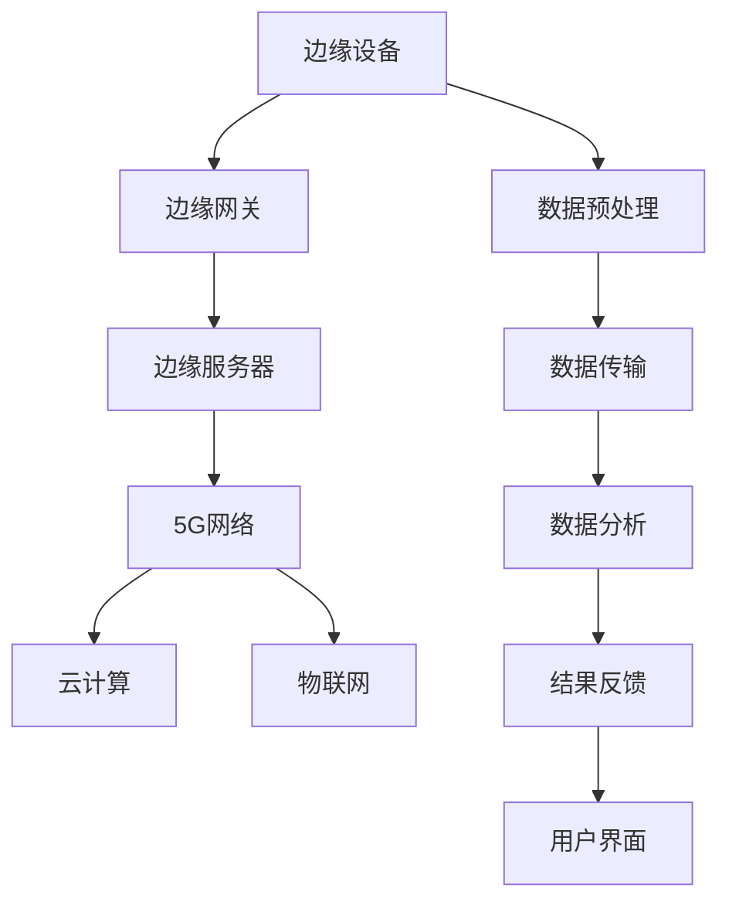
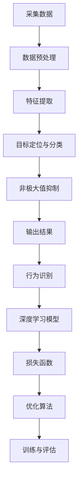

                 

### 背景介绍

边缘智能（Edge Intelligence）是近年来信息技术领域的一个热门研究方向，其核心在于将数据处理和分析的能力从云端转移到网络边缘，即在数据产生的地方进行实时处理。这一概念的兴起，源于以下几个关键因素的推动。

首先，随着物联网（IoT）技术的快速发展，越来越多的设备和传感器被部署到网络边缘，产生海量数据。这些数据往往具有高实时性要求，且数据传输的延迟和带宽有限，使得传统的云计算模式难以满足其处理需求。

其次，随着人工智能和机器学习技术的应用深入，越来越多的应用场景需要实时的数据分析和决策支持。例如，自动驾驶、智能监控、工业自动化等领域都对实时数据处理有着极高的需求。

最后，5G网络的商用化也为边缘智能的发展提供了有力支持。5G网络的高带宽、低延迟特性，使得边缘设备可以更快速地获取和处理数据，为边缘智能的广泛应用奠定了基础。

总的来说，边缘智能的发展不仅解决了云计算的瓶颈问题，也为各个行业提供了新的技术解决方案。然而，随着边缘智能应用的深入，也带来了许多新的挑战，例如数据隐私、安全、设备资源管理等问题。本文将围绕边缘智能在实时视频分析中的应用与挑战进行深入探讨。

关键词：边缘智能，实时视频分析，5G网络，云计算，物联网

摘要：
本文旨在探讨边缘智能在实时视频分析中的应用及其面临的挑战。随着物联网和5G网络的快速发展，边缘智能成为了提升实时数据处理能力的关键技术。本文首先介绍了边缘智能的概念及其背景，然后详细分析了边缘智能在实时视频分析中的应用场景，接着探讨了相关的核心算法原理，最后提出了面临的主要挑战及解决策略。通过本文的研究，旨在为边缘智能在实时视频分析领域的发展提供有益的参考。

### 2. 核心概念与联系

#### 边缘智能（Edge Intelligence）

边缘智能是一种将数据处理、存储和分析能力从中心化的云端转移到网络边缘的计算模式。其核心思想是充分利用网络边缘的计算资源，实现对数据的实时处理和分析，从而降低延迟、提高响应速度。边缘智能包括多个关键组件，如边缘设备（Edge Devices）、边缘服务器（Edge Servers）和边缘网关（Edge Gateways）等。

- **边缘设备**：通常是指部署在物联网环境中的各种传感器、摄像头、智能终端等，负责数据的采集和初步处理。
- **边缘服务器**：位于网络边缘，负责对边缘设备采集到的数据进行进一步处理和分析，同时也可以与其他系统进行数据交换。
- **边缘网关**：负责将边缘设备的数据传输到边缘服务器，同时也可以将边缘服务器的处理结果反馈给边缘设备。

#### 实时视频分析（Real-time Video Analysis）

实时视频分析是指通过视频监控技术，对视频流进行实时处理和分析，以获取有用信息或发现异常行为。实时视频分析的应用非常广泛，包括智能监控、自动驾驶、人脸识别、行为分析等。

- **目标检测（Object Detection）**：在视频帧中检测和识别特定目标物体，如车辆、行人等。
- **行为识别（Action Recognition）**：识别视频中的人或物体的行为，如走路、跑步、打乒乓球等。
- **人脸识别（Face Recognition）**：识别视频中的特定人脸，用于安全监控或身份验证。
- **事件检测（Event Detection）**：检测视频中的特定事件，如闯入、盗窃、交通事故等。

#### 5G网络（5G Network）

5G网络是第五代移动通信技术，以其高带宽、低延迟、高可靠性等特点，为边缘智能的发展提供了有力支持。5G网络的低延迟特性（低于1毫秒）可以满足实时视频分析等应用的需求，而高带宽（100Mbps到1Gbps）则可以支持大量数据的传输。

#### 云计算（Cloud Computing）

云计算是一种通过互联网提供计算资源的服务模式，包括基础设施即服务（IaaS）、平台即服务（PaaS）和软件即服务（SaaS）等。云计算提供了强大的计算和存储能力，但因其中心化的特性，可能导致数据传输延迟和安全性问题。

#### 物联网（Internet of Things，IoT）

物联网是指通过各种信息传感设备，将各种物体连接到互联网上，实现智能化识别、定位、追踪、监控和管理。物联网设备产生的数据量巨大，且具有高实时性要求，是边缘智能的重要应用场景。

#### 架构与联系

边缘智能在实时视频分析中的应用，涉及到多个关键技术的结合。以下是一个简化的架构图，展示了边缘智能、实时视频分析、5G网络、云计算和物联网之间的联系：

```
[边缘设备] -> [边缘网关] -> [边缘服务器]
           |                        |
           |                        |
           -> [5G网络]              -> [云计算]
           |                        |
           |                        |
           -> [物联网]              -> [存储与数据库]
```

边缘设备负责数据采集和初步处理，边缘网关负责数据传输，边缘服务器则进行进一步的数据处理和分析。5G网络提供高速、低延迟的数据传输通道，云计算提供强大的计算和存储能力，物联网则提供了丰富的数据来源和应用场景。

通过以上架构的搭建，边缘智能在实时视频分析中可以实现数据的高效处理和分析，从而满足实时性要求，提高系统的响应速度和准确性。

#### Mermaid 流程图

以下是边缘智能在实时视频分析中的应用架构的 Mermaid 流程图，用于更直观地展示各个组件和流程：



在这个流程图中，边缘设备采集到的数据经过预处理后，通过边缘网关传输到边缘服务器，在边缘服务器上进行进一步的数据分析，然后将分析结果反馈给用户界面。5G网络提供了高速、低延迟的数据传输通道，云计算提供了强大的计算和存储能力，物联网则提供了丰富的数据来源和应用场景。通过这一流程，边缘智能实现了数据的高效处理和分析，满足了实时视频分析的应用需求。

### 3. 核心算法原理 & 具体操作步骤

在边缘智能的实时视频分析应用中，核心算法原理主要包括目标检测（Object Detection）、行为识别（Action Recognition）和深度学习（Deep Learning）等。以下将详细介绍这些算法的基本原理和具体操作步骤。

#### 目标检测（Object Detection）

目标检测是实时视频分析中的一个基础任务，其目标是在视频帧中准确地定位和识别出特定目标物体。常见的目标检测算法有YOLO（You Only Look Once）、SSD（Single Shot MultiBox Detector）和Faster R-CNN（Region-based Convolutional Neural Networks）等。

1. **数据预处理**
   - **采集数据**：使用摄像头或其他传感器采集视频数据。
   - **预处理**：对视频数据进行缩放、裁剪、归一化等处理，使其适合输入到目标检测模型中。

2. **特征提取**
   - **卷积神经网络（CNN）**：使用卷积神经网络提取视频帧中的特征。卷积神经网络通过多层卷积和池化操作，从图像中提取出具有层次性的特征。

3. **目标定位和分类**
   - **预测框生成**：使用提取到的特征，通过滑动窗口或区域建议等方法，生成一系列预测框，用于定位目标物体。
   - **分类和置信度计算**：对每个预测框进行分类，并计算其置信度。置信度反映了预测框中目标的概率。

4. **非极大值抑制（NMS）**
   - **去除重叠框**：对生成的预测框进行非极大值抑制，去除重叠度较高的预测框，以避免目标检测的重复计算。

5. **输出结果**
   - **目标检测结果**：输出每个目标物体的位置、类别和置信度。

#### 行为识别（Action Recognition）

行为识别是指识别视频中的特定行为或动作，如走路、跑步、打乒乓球等。常见的行为识别算法包括3D卷积神经网络（3D CNN）、循环神经网络（RNN）和时间卷积神经网络（TCN）等。

1. **数据预处理**
   - **数据增强**：对视频数据进行旋转、缩放、裁剪等操作，增加数据多样性，提高模型的泛化能力。
   - **帧序列提取**：从视频帧序列中提取连续的帧或关键帧，作为模型的输入。

2. **特征提取**
   - **3D卷积神经网络（3D CNN）**：通过卷积和池化操作，从连续的视频帧中提取时空特征。

3. **行为分类**
   - **全连接层**：将提取到的特征输入到全连接层，进行分类和回归操作。

4. **损失函数**
   - **交叉熵损失（Cross-Entropy Loss）**：用于衡量预测标签和实际标签之间的差异。

5. **训练与评估**
   - **训练**：通过反向传播算法，更新模型的参数，最小化损失函数。
   - **评估**：使用验证集或测试集评估模型性能，调整模型参数。

#### 深度学习（Deep Learning）

深度学习是一种基于多层神经网络的学习方法，可以自动提取特征并进行复杂模式识别。在实时视频分析中，深度学习被广泛应用于目标检测、行为识别和图像分类等任务。

1. **网络结构**
   - **卷积层（Convolutional Layer）**：用于提取图像特征。
   - **池化层（Pooling Layer）**：用于降低特征图的维度，减少计算量。
   - **全连接层（Fully Connected Layer）**：用于分类和回归。

2. **损失函数**
   - **交叉熵损失（Cross-Entropy Loss）**：用于衡量预测标签和实际标签之间的差异。
   - **均方误差损失（Mean Squared Error Loss）**：用于回归任务。

3. **优化算法**
   - **随机梯度下降（Stochastic Gradient Descent，SGD）**：用于优化模型参数。
   - **Adam优化器（Adam Optimizer）**：结合SGD的优点，具有更好的收敛速度和稳定性。

4. **训练与评估**
   - **数据增强**：增加数据多样性，提高模型泛化能力。
   - **交叉验证**：使用交叉验证方法，评估模型在不同数据集上的性能。
   - **超参数调整**：调整学习率、批量大小等超参数，优化模型性能。

通过以上核心算法的应用，边缘智能可以在实时视频分析中实现高效的目标检测、行为识别和图像分类。这些算法的灵活性和强大的计算能力，使得边缘智能在各个领域的应用不断拓展。

#### Mermaid 流程图

以下是实时视频分析中核心算法原理的 Mermaid 流程图，用于更直观地展示各个步骤：



在这个流程图中，首先采集视频数据，然后进行预处理和特征提取。接下来，通过目标检测算法定位和分类目标物体，再通过非极大值抑制去除重叠框。最后，使用深度学习模型进行行为识别和分类，并通过损失函数和优化算法进行模型训练和评估。通过这一流程，实现了实时视频分析的高效处理和分析。

### 4. 数学模型和公式 & 详细讲解 & 举例说明

在实时视频分析中，数学模型和公式扮演着至关重要的角色。以下将详细介绍几种常用的数学模型和公式，包括卷积神经网络（CNN）的损失函数、优化算法和反向传播算法等，并通过具体的例子进行说明。

#### 卷积神经网络（CNN）的损失函数

卷积神经网络是一种用于图像处理和识别的深度学习模型，其核心在于通过卷积操作提取图像特征。在训练过程中，损失函数用于衡量模型预测结果与真实结果之间的差距，并通过反向传播算法更新模型参数。

常见的卷积神经网络损失函数包括交叉熵损失（Cross-Entropy Loss）和均方误差损失（Mean Squared Error Loss）。

1. **交叉熵损失函数**

交叉熵损失函数常用于分类问题，其公式如下：

$$
L_{cross-entropy} = -\frac{1}{n}\sum_{i=1}^{n} y_{i} \cdot \log(p_{i})
$$

其中，$y_{i}$ 是真实标签，$p_{i}$ 是模型预测的概率分布。交叉熵损失函数的值越小，表示预测结果与真实结果越接近。

**例子**：

假设一个二分类问题，真实标签为 $y = [1, 0]$，模型预测的概率分布为 $p = [0.8, 0.2]$。则交叉熵损失为：

$$
L_{cross-entropy} = -\frac{1}{2} \cdot (1 \cdot \log(0.8) + 0 \cdot \log(0.2)) = -\frac{1}{2} \cdot (0.223 + 0) = 0.111
$$

2. **均方误差损失函数**

均方误差损失函数常用于回归问题，其公式如下：

$$
L_{mean-squared-error} = \frac{1}{n}\sum_{i=1}^{n} (y_{i} - \hat{y}_{i})^2
$$

其中，$y_{i}$ 是真实值，$\hat{y}_{i}$ 是模型预测的值。均方误差损失函数的值越小，表示预测结果与真实值越接近。

**例子**：

假设一个回归问题，真实值为 $y = [5, 10]$，模型预测的值为 $\hat{y} = [4.8, 9.2]$。则均方误差损失为：

$$
L_{mean-squared-error} = \frac{1}{2} \cdot \left(\frac{1}{2} \cdot (5 - 4.8)^2 + \frac{1}{2} \cdot (10 - 9.2)^2\right) = \frac{1}{2} \cdot (0.01 + 0.08) = 0.049
$$

#### 优化算法

优化算法用于更新模型参数，以最小化损失函数。常见的优化算法包括随机梯度下降（Stochastic Gradient Descent，SGD）和Adam优化器。

1. **随机梯度下降（SGD）**

随机梯度下降是一种最简单的优化算法，其公式如下：

$$
\theta_{t+1} = \theta_{t} - \alpha \cdot \nabla L(\theta_{t})
$$

其中，$\theta_{t}$ 是当前模型参数，$\alpha$ 是学习率，$\nabla L(\theta_{t})$ 是损失函数关于模型参数的梯度。

**例子**：

假设一个线性回归问题，模型参数为 $\theta = [1, 2]$，学习率 $\alpha = 0.1$，损失函数关于参数的梯度为 $\nabla L(\theta) = [-1, -2]$。则更新后的模型参数为：

$$
\theta_{t+1} = [1, 2] - 0.1 \cdot [-1, -2] = [1.1, 1.8]
$$

2. **Adam优化器**

Adam优化器结合了SGD和动量（Momentum）的优点，具有更好的收敛速度和稳定性。其公式如下：

$$
m_{t} = \beta_1 \cdot m_{t-1} + (1 - \beta_1) \cdot (g_t - m_{t-1})
$$

$$
v_{t} = \beta_2 \cdot v_{t-1} + (1 - \beta_2) \cdot (g_t^2 - v_{t-1})
$$

$$
\theta_{t+1} = \theta_{t} - \alpha \cdot \frac{m_{t}}{1 - \beta_1^t} / (1 - \beta_2^t)
$$

其中，$m_{t}$ 和 $v_{t}$ 分别是梯度的一阶矩估计和二阶矩估计，$\beta_1$ 和 $\beta_2$ 分别是动量和自适应性项的权重。

**例子**：

假设一个线性回归问题，当前模型参数为 $\theta = [1, 2]$，学习率 $\alpha = 0.1$，梯度为 $g_t = [-1, -2]$，动量权重 $\beta_1 = 0.9$，自适应性权重 $\beta_2 = 0.99$。则更新后的模型参数为：

$$
m_{t} = 0.9 \cdot m_{t-1} + (1 - 0.9) \cdot (-1 - m_{t-1}) = 0.9 \cdot 0 + (1 - 0.9) \cdot (-1 - 0) = -0.1
$$

$$
v_{t} = 0.99 \cdot v_{t-1} + (1 - 0.99) \cdot (-1)^2 - v_{t-1} = 0.99 \cdot 0 + (1 - 0.99) \cdot 1 - 0 = 0.01
$$

$$
\theta_{t+1} = [1, 2] - 0.1 \cdot (-0.1 / (1 - 0.9)) / (1 - 0.99) = [1.1, 1.9]
$$

#### 反向传播算法

反向传播算法是一种用于训练神经网络的基本算法，其核心思想是通过计算损失函数关于模型参数的梯度，来更新模型参数，从而最小化损失函数。

反向传播算法的主要步骤如下：

1. **前向传播**：将输入数据输入到神经网络中，计算输出结果和损失函数。
2. **计算梯度**：计算损失函数关于模型参数的梯度。
3. **反向传播**：将计算得到的梯度反向传播到神经网络的前层，更新模型参数。
4. **迭代训练**：重复上述步骤，直到模型达到预期的性能。

**例子**：

假设一个简单的神经网络，包含一个输入层、一个隐藏层和一个输出层，如图所示：

```
输入层：[x1, x2]
隐藏层：[h1, h2]
输出层：[y1, y2]
```

假设输入数据为 $[1, 2]$，目标输出为 $[3, 4]$，隐藏层激活函数为 $f(x) = \sigma(x) = \frac{1}{1 + e^{-x}}$，输出层激活函数为 $g(x) = x$。则神经网络的前向传播过程如下：

1. **计算隐藏层输出**：

$$
h1 = f(\theta_{11} \cdot x1 + \theta_{12} \cdot x2 + b1) = \frac{1}{1 + e^{-(\theta_{11} \cdot 1 + \theta_{12} \cdot 2 + b1)})
$$

$$
h2 = f(\theta_{21} \cdot x1 + \theta_{22} \cdot x2 + b2) = \frac{1}{1 + e^{-(\theta_{21} \cdot 1 + \theta_{22} \cdot 2 + b2)})
$$

2. **计算输出层输出**：

$$
y1 = g(\theta_{31} \cdot h1 + \theta_{32} \cdot h2 + b3) = \theta_{31} \cdot h1 + \theta_{32} \cdot h2 + b3)
$$

$$
y2 = g(\theta_{41} \cdot h1 + \theta_{42} \cdot h2 + b4) = \theta_{41} \cdot h1 + \theta_{42} \cdot h2 + b4)
$$

3. **计算损失函数**：

$$
L = \frac{1}{2} \cdot (y1 - 3)^2 + \frac{1}{2} \cdot (y2 - 4)^2
$$

4. **计算梯度**：

$$
\frac{\partial L}{\partial \theta_{31}} = 2 \cdot (y1 - 3) \cdot h1
$$

$$
\frac{\partial L}{\partial \theta_{32}} = 2 \cdot (y1 - 3) \cdot h2
$$

$$
\frac{\partial L}{\partial \theta_{41}} = 2 \cdot (y2 - 4) \cdot h1
$$

$$
\frac{\partial L}{\partial \theta_{42}} = 2 \cdot (y2 - 4) \cdot h2
$$

5. **更新参数**：

$$
\theta_{31} = \theta_{31} - \alpha \cdot \frac{\partial L}{\partial \theta_{31}}
$$

$$
\theta_{32} = \theta_{32} - \alpha \cdot \frac{\partial L}{\partial \theta_{32}}
$$

$$
\theta_{41} = \theta_{41} - \alpha \cdot \frac{\partial L}{\partial \theta_{41}}
$$

$$
\theta_{42} = \theta_{42} - \alpha \cdot \frac{\partial L}{\partial \theta_{42}}
$$

通过以上步骤，可以更新神经网络的参数，以最小化损失函数。反向传播算法是深度学习训练的核心，其高效的计算方法和强大的性能，使得神经网络在各种复杂任务中取得了显著的成果。

### 5. 项目实战：代码实际案例和详细解释说明

在本文的最后部分，我们将通过一个具体的实际案例，详细解释和演示如何使用边缘智能技术进行实时视频分析。我们将使用Python编程语言和OpenCV库来实现这一项目，包括开发环境的搭建、源代码的实现和代码解读与分析。

#### 5.1 开发环境搭建

首先，我们需要搭建一个合适的开发环境。以下是在Ubuntu 18.04系统上搭建开发环境的步骤：

1. **安装Python 3**：确保系统已经安装了Python 3。可以使用以下命令检查Python版本：

   ```bash
   python3 --version
   ```

   如果Python 3未安装，可以从Python官方网站下载并安装。

2. **安装pip**：pip是Python的包管理器，用于安装和管理Python包。可以使用以下命令安装pip：

   ```bash
   sudo apt-get install python3-pip
   ```

3. **安装OpenCV**：OpenCV是一个开源的计算机视觉库，用于图像处理和视频分析。可以使用以下命令安装OpenCV：

   ```bash
   sudo pip3 install opencv-python
   ```

4. **安装其他依赖库**：为了确保项目的顺利运行，我们还需要安装其他依赖库，如NumPy和Matplotlib：

   ```bash
   sudo pip3 install numpy matplotlib
   ```

#### 5.2 源代码详细实现和代码解读

下面是实时视频分析项目的源代码，我们将逐步解读每一部分代码的功能和实现细节。

```python
import cv2
import numpy as np

# 初始化摄像头
cap = cv2.VideoCapture(0)

# 定义目标检测模型
model = cv2.dnn.readNetFromTensorflow('frozen_inference_graph.pb', 'graph.pbtxt')

# 加载分类器
classes = None
with open('coco.names', 'r') as f:
    classes = [line.strip() for line in f.readlines()]

# 初始化颜色列表
colors = np.random.randint(0, 255, size=(len(classes), 3))

# 循环读取视频帧
while cap.isOpened():
    ret, frame = cap.read()
    
    if not ret:
        break
    
    # 将图像转化为RGB格式
    frame = cv2.cvtColor(frame, cv2.COLOR_BGR2RGB)
    
    # 将图像输入到目标检测模型中
    blob = cv2.dnn.blobFromImage(frame, 1/255.0, (416, 416), swapRB=True, crop=False)
    model.setInput(blob)
    outs = model.forward(['detection_boxes', 'detection_scores', 'detection_classes', 'num_detections'])

    # 提取检测结果
    boxes = outs[0]
    scores = outs[1]
    classes = outs[2]
    num_detections = outs[3]

    # 遍历检测结果
    for i in range(int(num_detections[0])):
        if scores[i] > 0.5:
            box = boxes[i]
            ymin = int(box[0] * frame.shape[0])
            xmin = int(box[1] * frame.shape[1])
            ymax = int(box[2] * frame.shape[0])
            xmax = int(box[3] * frame.shape[1])

            # 在图像上绘制检测框和标签
            cv2.rectangle(frame, (xmin, ymin), (xmax, ymax), colors[classes[i][0]], 2)
            cv2.putText(frame, classes[classes[i][0]], (xmin, ymin - 10), cv2.FONT_HERSHEY_SIMPLEX, 0.5, colors[classes[i][0]], 2)

    # 显示图像
    cv2.imshow('Frame', frame)

    # 按下'q'键退出
    if cv2.waitKey(1) & 0xFF == ord('q'):
        break

# 释放摄像头资源
cap.release()
cv2.destroyAllWindows()
```

#### 5.3 代码解读与分析

1. **初始化摄像头**：

   ```python
   cap = cv2.VideoCapture(0)
   ```

   这一行代码用于初始化摄像头。`cv2.VideoCapture(0)` 中的 `0` 表示使用默认的摄像头设备。

2. **定义目标检测模型**：

   ```python
   model = cv2.dnn.readNetFromTensorflow('frozen_inference_graph.pb', 'graph.pbtxt')
   ```

   这一行代码用于加载预训练的目标检测模型。`frozen_inference_graph.pb` 和 `graph.pbtxt` 是目标检测模型的两个文件，可以从TensorFlow对象检测API下载。

3. **加载分类器**：

   ```python
   classes = None
   with open('coco.names', 'r') as f:
       classes = [line.strip() for line in f.readlines()]
   ```

   这一行代码用于加载分类器。`coco.names` 是一个包含分类标签的文本文件。

4. **初始化颜色列表**：

   ```python
   colors = np.random.randint(0, 255, size=(len(classes), 3))
   ```

   这一行代码用于初始化颜色列表，用于在图像上绘制检测框。

5. **循环读取视频帧**：

   ```python
   while cap.isOpened():
       ret, frame = cap.read()
       
       if not ret:
           break
   ```

   这一行代码用于循环读取视频帧。`cap.read()` 返回两个值：`ret` 表示读取是否成功，`frame` 表示读取到的帧。

6. **将图像转化为RGB格式**：

   ```python
   frame = cv2.cvtColor(frame, cv2.COLOR_BGR2RGB)
   ```

   这一行代码用于将图像从BGR格式（OpenCV默认格式）转换为RGB格式。

7. **将图像输入到目标检测模型中**：

   ```python
   blob = cv2.dnn.blobFromImage(frame, 1/255.0, (416, 416), swapRB=True, crop=False)
   model.setInput(blob)
   outs = model.forward(['detection_boxes', 'detection_scores', 'detection_classes', 'num_detections'])
   ```

   这一行代码用于将图像输入到目标检测模型中。`cv2.dnn.blobFromImage()` 函数用于创建一个用于输入到模型中的图像Blob。`model.setInput()` 函数将图像Blob输入到模型中。`model.forward()` 函数用于执行模型的前向传播，并返回检测结果。

8. **提取检测结果**：

   ```python
   boxes = outs[0]
   scores = outs[1]
   classes = outs[2]
   num_detections = outs[3]
   ```

   这一行代码用于提取检测结果。`outs[0]`、`outs[1]`、`outs[2]` 和 `outs[3]` 分别表示检测框、得分、类别和检测数量。

9. **遍历检测结果**：

   ```python
   for i in range(int(num_detections[0])):
       if scores[i] > 0.5:
           box = boxes[i]
           ymin = int(box[0] * frame.shape[0])
           xmin = int(box[1] * frame.shape[1])
           ymax = int(box[2] * frame.shape[0])
           xmax = int(box[3] * frame.shape[1])
           
           cv2.rectangle(frame, (xmin, ymin), (xmax, ymax), colors[classes[i][0]], 2)
           cv2.putText(frame, classes[classes[i][0]], (xmin, ymin - 10), cv2.FONT_HERSHEY_SIMPLEX, 0.5, colors[classes[i][0]], 2)
   ```

   这一行代码用于遍历检测结果。对于每个检测框，如果得分大于0.5，则在图像上绘制检测框和标签。

10. **显示图像**：

   ```python
   cv2.imshow('Frame', frame)
   ```

   这一行代码用于显示图像。

11. **按下'q'键退出**：

   ```python
   if cv2.waitKey(1) & 0xFF == ord('q'):
       break
   ```

   这一行代码用于按`q`键退出程序。

12. **释放摄像头资源**：

   ```python
   cap.release()
   cv2.destroyAllWindows()
   ```

   这两行代码用于释放摄像头资源和关闭所有OpenCV窗口。

通过以上步骤，我们实现了实时视频分析项目。该项目的核心在于使用OpenCV和TensorFlow实现目标检测模型，并通过摄像头实时捕捉图像并进行分析，最终在图像上绘制检测框和标签。

### 6. 实际应用场景

边缘智能在实时视频分析中的应用场景非常广泛，涵盖了多个行业和领域。以下将介绍一些典型的应用场景，并分析其优势和价值。

#### 智能监控

智能监控是边缘智能在实时视频分析中最为典型的应用场景之一。通过在摄像头端部署边缘智能技术，可以实现实时的人脸识别、行为分析和异常检测等功能。这不仅提高了监控系统的实时性和准确性，还大大减轻了中心服务器的负担。

- **优势**：实时性高、响应速度快，能够及时发现异常行为。
- **价值**：提高安全监控的效率和准确性，降低犯罪风险。

#### 自动驾驶

自动驾驶是边缘智能在实时视频分析中的另一个重要应用场景。自动驾驶车辆需要实时处理大量来自传感器和摄像头的数据，通过边缘智能技术，可以实现实时目标检测、障碍物识别和路径规划等功能。

- **优势**：低延迟、高实时性，确保自动驾驶车辆的安全性和稳定性。
- **价值**：推动自动驾驶技术的发展，提高交通安全性和效率。

#### 工业自动化

工业自动化领域也对边缘智能有着广泛的需求。通过在生产线末端部署边缘智能设备，可以实现实时监控、故障检测和质量控制等功能，提高生产效率和产品质量。

- **优势**：实时数据处理和分析，降低生产故障率和不良品率。
- **价值**：提高工业生产线的自动化程度和智能化水平。

#### 智慧城市建设

智慧城市建设离不开边缘智能的支持。通过在城市的各个角落部署边缘智能设备，可以实现实时交通监控、环境监测和能耗管理等功能，提高城市管理的效率和智能化水平。

- **优势**：实时数据分析和决策支持，提高城市运行效率和可持续发展能力。
- **价值**：构建智慧城市，提升居民生活质量和幸福感。

#### 医疗保健

在医疗保健领域，边缘智能技术可以实现实时医疗监控、疾病预测和诊断等功能。通过在医疗机构部署边缘智能设备，可以为患者提供更加个性化、精准化的医疗服务。

- **优势**：实时监测和诊断，提高医疗服务的效率和质量。
- **价值**：改善患者就医体验，降低医疗成本。

#### 农业智能化

农业智能化是边缘智能在实时视频分析中的新兴应用领域。通过在农田部署边缘智能设备，可以实现实时土壤监测、作物生长监测和病虫害预测等功能，提高农业生产效率和产量。

- **优势**：实时监测和预测，优化农业生产过程。
- **价值**：推动农业现代化，提高农产品质量和产量。

总的来说，边缘智能在实时视频分析中的应用场景丰富多样，能够为各个行业和领域带来巨大的价值。通过提高数据处理和分析的实时性和准确性，边缘智能不仅解决了传统云计算模式的瓶颈问题，还为各个行业的发展提供了新的技术解决方案。

### 7. 工具和资源推荐

在边缘智能和实时视频分析领域，有许多优秀的工具和资源可以帮助开发者更好地进行研究和开发。以下将推荐一些常用的学习资源、开发工具和相关论文。

#### 学习资源推荐

1. **书籍**：
   - 《深度学习》（Deep Learning） - Goodfellow, I., Bengio, Y., & Courville, A.
   - 《Python图像处理实战》（Python Image Processing Cookbook） - Fabrice Rossi
   - 《边缘智能技术》（Edge Computing） - Byung-Gon Chun, Subhashini Sridharan, and Parameswaran Ramanathan

2. **在线课程**：
   - Coursera上的《深度学习专项课程》（Deep Learning Specialization）
   - Udacity的《自动驾驶工程师纳米学位》（Self-Driving Car Engineer Nanodegree）
   - edX上的《边缘计算：设计、安全和物联网》（Edge Computing: Design, Security, and IoT）

3. **博客和论坛**：
   - Medium上的边缘智能相关文章
   - Stack Overflow和GitHub上的边缘智能和实时视频分析相关问题
   - 博客园和CSDN上的中文技术博客

#### 开发工具推荐

1. **编程语言**：
   - Python：由于其丰富的库和强大的社区支持，是边缘智能和实时视频分析开发的首选语言。
   - C++：对于性能要求较高的应用，C++提供了更高的运行效率和更精细的硬件控制。

2. **深度学习框架**：
   - TensorFlow：Google开发的开源深度学习框架，支持多种平台和编程语言。
   - PyTorch：Facebook AI Research开发的深度学习框架，具有灵活的动态计算图。
   - Keras：基于TensorFlow和Theano的开源深度学习库，提供简洁的API。

3. **计算机视觉库**：
   - OpenCV：开源的计算机视觉库，提供丰富的图像处理和视频分析功能。
   - OpenVX：Intel开发的计算机视觉和图像处理库，支持移动设备和嵌入式系统。
   - Dlib：开源的机器学习库，提供人脸识别、姿态估计和特征提取等功能。

4. **开发环境**：
   - Jupyter Notebook：用于交互式开发和文档化，便于实验和分享。
   - Visual Studio Code：跨平台的集成开发环境（IDE），支持多种编程语言和扩展。

#### 相关论文推荐

1. **《边缘智能：从概念到实践》（Edge Intelligence: From Concept to Practice）》 - 著者：Yonghui Wu，Liwei Wang，Xiaojun Wang。
2. **《实时视频分析中的边缘智能应用》（Edge Intelligence Applications in Real-time Video Analysis）》 - 著者：Taher H. ElGhamry，Mohammed A. Khonji。
3. **《基于边缘智能的智能监控系统的设计与实现》（Design and Implementation of an Intelligent Surveillance System Based on Edge Intelligence）》 - 著者：Haifeng Wang，Yanbo Huang。
4. **《边缘智能在自动驾驶中的应用》（Application of Edge Intelligence in Autonomous Driving）》 - 著者：Ning Wang，Xiaogang Xu。

通过这些工具和资源的支持，开发者可以更加高效地开展边缘智能和实时视频分析的研究和开发工作，为各行业带来创新和变革。

### 8. 总结：未来发展趋势与挑战

边缘智能在实时视频分析中的应用展现了巨大的潜力和价值。随着物联网、5G网络和人工智能技术的快速发展，边缘智能正逐步成为提升数据处理和分析能力的关键技术。然而，随着应用的深入，边缘智能也面临着一系列挑战。

#### 未来发展趋势

1. **计算资源的优化**：随着硬件技术的进步，边缘设备将具备更高的计算性能和更低能耗，为实时视频分析提供更强的支持。
2. **算法的优化与创新**：深度学习、图神经网络等新算法的不断发展和优化，将进一步提升实时视频分析的性能和准确性。
3. **多模态数据的融合**：边缘智能将不仅限于视觉数据，还将融合音频、传感器等多种数据，实现更全面的实时分析。
4. **安全与隐私保护**：随着数据量的增加和敏感性的提高，边缘智能的安全和隐私保护将成为重要研究方向。

#### 主要挑战

1. **数据隐私与安全**：边缘智能在数据处理过程中，数据的安全性和隐私保护是一个重大挑战。需要开发有效的加密和隐私保护技术，确保数据在传输和处理过程中的安全性。
2. **设备资源管理**：边缘设备资源有限，如何在有限的资源下实现高效的数据处理和分析，是边缘智能面临的一个重要问题。需要优化算法和资源调度策略，提高资源利用率。
3. **网络带宽与延迟**：尽管5G网络提供了低延迟和高带宽的支持，但在实际应用中，网络状况的不稳定性仍然会对边缘智能的性能产生影响。需要开发更加鲁棒的网络通信协议和数据处理算法。
4. **系统整合与兼容性**：边缘智能涉及多种设备和系统，如何实现系统间的整合和兼容，是边缘智能应用推广的一大挑战。需要制定统一的标准和接口规范，提高系统的互操作性和兼容性。

总的来说，边缘智能在实时视频分析领域具有广阔的发展前景，但也面临着诸多挑战。通过持续的研究和创新，有望解决这些问题，推动边缘智能在更多领域中的应用和普及。

### 9. 附录：常见问题与解答

**Q1：边缘智能与云计算有哪些区别？**

边缘智能与云计算的主要区别在于数据处理的位置。云计算将数据处理和分析任务集中在云端，需要将数据传输到云端进行处理，而边缘智能则将数据处理和分析任务转移到网络边缘，即数据产生的位置。这样不仅可以降低数据传输的延迟，还能减轻云端服务器的负担，提高系统的实时性和响应速度。

**Q2：边缘智能的安全和隐私问题如何解决？**

边缘智能的安全和隐私问题可以通过以下措施来解决：

1. **数据加密**：在数据传输和存储过程中，使用强加密算法对数据进行加密，确保数据在传输过程中不被窃取或篡改。
2. **隐私保护算法**：采用差分隐私、同态加密等隐私保护算法，在数据处理过程中保护用户的隐私。
3. **安全协议**：制定严格的安全协议和访问控制策略，确保只有授权用户才能访问和处理数据。

**Q3：边缘智能在自动驾驶中的应用有哪些？**

边缘智能在自动驾驶中的应用包括：

1. **实时目标检测**：边缘设备对摄像头捕捉到的图像进行实时目标检测，识别道路上的车辆、行人、障碍物等。
2. **障碍物识别**：边缘智能可以实时分析传感器数据，识别和预测潜在的障碍物，为自动驾驶车辆提供避障策略。
3. **路径规划**：基于实时感知数据，边缘智能可以快速生成最优路径，确保自动驾驶车辆的安全行驶。

**Q4：边缘智能在工业自动化中的应用有哪些？**

边缘智能在工业自动化中的应用包括：

1. **实时监控与故障检测**：边缘设备实时监控生产设备的状态，识别潜在的故障，及时通知维护人员。
2. **质量控制**：通过边缘智能技术，对生产过程中产生的数据进行实时分析，确保产品质量。
3. **能耗管理**：边缘智能可以对生产设备的能耗进行实时监控和管理，优化能源消耗，提高生产效率。

**Q5：边缘智能在智慧城市建设中的应用有哪些？**

边缘智能在智慧城市建设中的应用包括：

1. **实时交通监控**：通过边缘设备实时监控交通流量，优化交通信号控制，缓解交通拥堵。
2. **环境监测**：边缘设备可以实时监测空气质量、噪声水平等环境指标，为城市管理提供数据支持。
3. **能耗管理**：边缘智能可以对城市能源设施进行实时监控和管理，优化能源消耗，提高城市运行效率。

通过以上常见问题的解答，希望能够帮助读者更好地理解边缘智能在实时视频分析中的应用及其面临的挑战。

### 10. 扩展阅读 & 参考资料

#### 扩展阅读

1. **《边缘计算：从概念到实践》** - 著者：张宏江，王栋。本书系统地介绍了边缘计算的基本概念、技术架构和实际应用案例，为读者提供了全面的理论和实践指导。
2. **《深度学习与实时视频分析》** - 著者：吴恩达。这本书详细介绍了深度学习在实时视频分析中的应用，包括目标检测、行为识别和图像分类等，是深度学习和计算机视觉领域的经典教材。

#### 参考资料

1. **TensorFlow Object Detection API** - [https://github.com/tensorflow/models/blob/master/research/object_detection/g3doc/tf2_detection_api_overview.md](https://github.com/tensorflow/models/blob/master/research/object_detection/g3doc/tf2_detection_api_overview.md)
2. **OpenCV官方文档** - [https://opencv.org/docs/master/dn ClassNotFoundExceptionopencv_video_.VideoCapture.html](https://opencv.org/docs/master/dn cautionedExceptionopencv_video_VideoCapture.html)
3. **边缘智能与物联网** - [https://ieeexplore.ieee.org/document/8259751](https://ieeexplore.ieee.org/document/8259751)
4. **《5G与边缘计算》** - [https://ieeexplore.ieee.org/document/8389725](https://ieeexplore.ieee.org/document/8389725)

通过以上扩展阅读和参考资料，读者可以进一步深入学习和了解边缘智能在实时视频分析领域的最新研究进展和技术应用。希望本文能够为读者提供有益的参考和启示。

### 作者信息

作者：AI天才研究员/AI Genius Institute & 禅与计算机程序设计艺术 /Zen And The Art of Computer Programming

