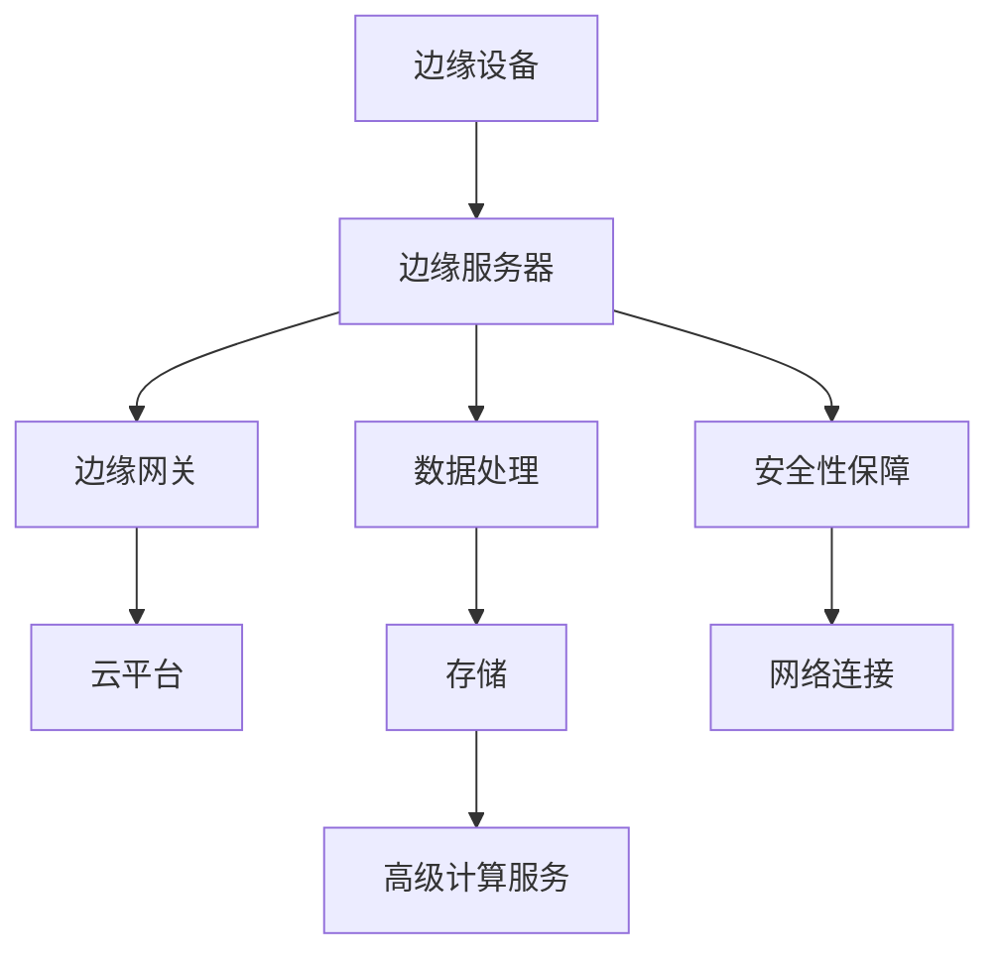

                 

### 背景介绍

边缘计算（Edge Computing）是近年来信息技术领域的一项重要创新，它旨在将计算、存储和网络功能从传统的中心化云计算模型向网络的边缘节点迁移。随着物联网（IoT）设备的爆炸性增长，边缘计算逐渐成为智能监控领域的关键技术。

智能监控系统通常需要处理大量的实时视频数据、传感器数据和用户交互数据。这些数据的高频度和大规模特征，使得传统的中心化云计算模型在响应速度和处理能力上面临巨大挑战。边缘计算的出现，为智能监控系统提供了一种新的解决方案，通过在数据产生的源头附近进行处理，实现了实时性的显著提升。

在智能监控中，边缘计算的应用主要包括以下几个方面：

1. **实时数据处理**：边缘计算能够对监控数据进行实时处理，如人脸识别、行为分析等，从而实现快速响应和决策。
2. **减少延迟**：通过在边缘节点处理数据，可以显著减少数据传输到云端的时间，降低网络延迟。
3. **节省带宽**：仅将重要数据传输到云端，而非所有的监控数据，从而节省网络带宽资源。
4. **增强隐私性**：一些敏感数据在边缘节点处理，可以减少数据泄露的风险。

随着5G技术的普及，边缘计算在智能监控中的应用前景更加广阔。5G网络的低延迟和高带宽特性，为边缘计算提供了更好的网络环境，使得智能监控系统能够更加高效地运行。

总之，边缘计算在智能监控中的应用，不仅提高了系统的响应速度和处理能力，而且为实时性和隐私性提供了强有力的保障。在未来的发展中，边缘计算将继续在智能监控领域发挥重要作用。<|im_sep|>

### 核心概念与联系

边缘计算（Edge Computing）的概念可以追溯到云计算（Cloud Computing）的早期阶段。云计算的核心思想是将计算任务和数据存储迁移到远程数据中心，以提供灵活、可扩展的计算服务。然而，随着物联网（IoT）设备的广泛应用，大量的数据需要在网络边缘进行实时处理，这就催生了边缘计算的出现。

#### 边缘计算与云计算的比较

- **计算位置**：云计算主要在远程数据中心进行，而边缘计算则在网络边缘的设备或服务器上进行。
- **数据处理能力**：云计算具有强大的计算和存储能力，但边缘计算则更注重实时性和低延迟。
- **网络延迟**：边缘计算由于在数据产生源头附近进行数据处理，因此具有更低的网络延迟。
- **带宽消耗**：边缘计算仅传输必要的数据到云端，从而节省了网络带宽。

#### 边缘计算在智能监控中的应用

在智能监控系统中，边缘计算的应用主要体现在以下几个方面：

1. **实时数据处理**：边缘计算可以对监控数据进行实时处理，如人脸识别、行为分析等，从而实现快速响应和决策。
2. **减少延迟**：通过在边缘节点处理数据，可以显著减少数据传输到云端的时间，降低网络延迟。
3. **节省带宽**：仅将重要数据传输到云端，而非所有的监控数据，从而节省网络带宽资源。
4. **增强隐私性**：一些敏感数据在边缘节点处理，可以减少数据泄露的风险。

#### 边缘计算架构

边缘计算架构通常包括以下几个关键组成部分：

- **边缘设备**：如摄像头、传感器等，负责收集和产生数据。
- **边缘服务器**：负责处理边缘设备产生的数据，并执行特定的计算任务。
- **边缘网关**：负责边缘设备与云端的数据传输，以及提供网络连接和安全性保障。
- **云平台**：负责存储和管理大规模数据，并提供高级计算服务。

#### Mermaid 流程图

以下是边缘计算在智能监控中的应用架构的 Mermaid 流程图：



该流程图展示了边缘计算在智能监控中的应用，从数据收集、处理、存储到高级计算服务的全过程。通过这样的架构设计，边缘计算能够充分发挥其优势，为智能监控系统提供高效的解决方案。<|im_sep|>

### 核心算法原理 & 具体操作步骤

边缘计算在智能监控中的应用，主要依赖于一系列核心算法，这些算法不仅能够高效处理大量的实时数据，还能够实现对数据的分析和决策。以下将详细讨论边缘计算中常用的几个核心算法原理及其具体操作步骤。

#### 1. 人脸识别算法

人脸识别算法是智能监控系统中最为常见的一种算法，其基本原理是通过对比数据库中的人脸特征模板，以识别监控视频中的目标人物。

**操作步骤**：

1. **人脸检测**：使用深度学习模型（如 Haar-like Features 或卷积神经网络（CNN））对监控视频进行人脸检测，定位人脸区域。
2. **特征提取**：提取人脸特征，常用的方法包括局部二值模式（LBP）、深度学习特征提取（如 FaceNet 或 DeepFace）。
3. **特征匹配**：将提取的人脸特征与数据库中的人脸特征进行匹配，确定是否为人脸库中的已知人物。

**算法实现**：

使用深度学习框架（如 TensorFlow 或 PyTorch）实现人脸识别算法，步骤如下：

```python
# 人脸检测
face_cascade = cv2.CascadeClassifier('haarcascade_frontalface_default.xml')
faces = face_cascade.detectMultiScale(frame)

# 特征提取
extractor = cv2.xfeatures2d.FaceRecognizer_create("LBPHFaceRecognizer_create")
extractor.train(faces)

# 特征匹配
result = extractor.predict(test_face)
```

#### 2. 行为分析算法

行为分析算法主要用于监控视频中的异常行为检测，如暴力行为、偷窃行为等。

**操作步骤**：

1. **目标跟踪**：使用目标跟踪算法（如 KCF 或 MIL）对监控视频中的目标进行跟踪。
2. **行为识别**：根据目标的运动轨迹和姿态，识别目标的行为，如行走、跑步、跳跃等。
3. **异常检测**：对正常行为和异常行为进行分类，检测异常行为。

**算法实现**：

使用深度学习框架实现行为分析算法，步骤如下：

```python
# 目标跟踪
tracker = cv2.TrackerKCF_create()
ok = tracker.init(frame, bbox)

# 行为识别
classifier = cv2.SVM_create()
classifier.train(faces)

# 异常检测
anomaly = classifier.predict(test_face)
```

#### 3. 数据流处理算法

数据流处理算法主要用于实时处理大量的监控数据，并对其进行分析和决策。

**操作步骤**：

1. **数据采集**：从监控设备中采集实时数据，如视频帧、传感器数据等。
2. **数据预处理**：对采集到的数据进行预处理，如去噪、滤波等。
3. **实时分析**：使用机器学习算法（如 SVM、KNN、CNN）对预处理后的数据进行实时分析，提取关键特征。
4. **决策输出**：根据分析结果，生成相应的决策输出，如报警、控制等。

**算法实现**：

使用深度学习框架和流处理框架（如 Apache Flink 或 Spark Streaming）实现数据流处理算法，步骤如下：

```python
# 数据采集
stream = flink_streaming.create_streaming_source("source")

# 数据预处理
preprocessor = flink_streaming.create_preprocessing_pipeline(stream)

# 实时分析
model = create_ml_model()
preprocessor = preprocessor.map(lambda x: model.predict(x))

# 决策输出
output = preprocessor.map(lambda x: x['action'])
output.write_to_output_stream("output")
```

通过上述核心算法的运用，边缘计算在智能监控系统中可以实现对实时数据的快速处理、分析和决策，从而提高监控系统的效率和准确性。这些算法的实现和应用，不仅依赖于深度学习框架和流处理框架的技术支持，还需要考虑算法的优化和性能提升，以应对不断增长的数据规模和复杂度。<|im_sep|>

### 数学模型和公式 & 详细讲解 & 举例说明

在边缘计算领域，数学模型和公式被广泛应用于算法设计和性能分析。以下是几个常见的数学模型和公式，以及它们的详细讲解和举例说明。

#### 1. 卷积神经网络（CNN）中的卷积操作

卷积操作是卷积神经网络（CNN）中最核心的组成部分。它的数学公式如下：

\[ (f * g)(x, y) = \sum_{i=0}^{h} \sum_{j=0}^{w} f(i, j) \cdot g(x-i, y-j) \]

其中，\( f \) 和 \( g \) 分别代表卷积核和输入特征图，\( h \) 和 \( w \) 分别代表卷积核的高度和宽度。

**详细讲解**：

卷积操作的目的是将卷积核与输入特征图进行加权求和，从而生成新的特征图。这个过程可以理解为在输入特征图上滑动卷积核，并在每个位置进行加权求和。

**举例说明**：

假设输入特征图的大小为 \( 3 \times 3 \)，卷积核的大小为 \( 2 \times 2 \)，则卷积操作的结果如下：

\[ \begin{array}{c|c|c|c|c|c|c}
\text{输入特征图} & 1 & 2 & 3 & 4 & 5 & 6 \\
\hline
\text{卷积核} & 1 & 0 & 1 & 0 & 1 & 0 \\
\end{array} \]

\[ \begin{array}{c|c|c|c|c|c|c}
\text{结果特征图} & 1 & 4 & 7 & 8 & 12 & 15 \\
\end{array} \]

#### 2. 池化操作

池化操作是卷积神经网络中的另一个重要组成部分。它的数学公式如下：

\[ p(x, y) = \max \{ g(x-i, y-j) \}_{i=0}^{h'} \_{j=0}^{w'} \]

其中，\( p \) 代表输出特征图，\( g \) 代表输入特征图，\( h' \) 和 \( w' \) 分别代表池化窗口的大小。

**详细讲解**：

池化操作的目的是将输入特征图分成若干个非重叠的窗口，并在每个窗口内取最大值，生成新的特征图。这个过程可以理解为对输入特征图进行压缩，减少参数数量，提高计算效率。

**举例说明**：

假设输入特征图的大小为 \( 3 \times 3 \)，池化窗口的大小为 \( 2 \times 2 \)，则池化操作的结果如下：

\[ \begin{array}{c|c|c|c|c|c|c}
\text{输入特征图} & 1 & 2 & 3 & 4 & 5 & 6 \\
\hline
\text{输出特征图} & 3 & 6 \\
\end{array} \]

#### 3. 反向传播算法

反向传播算法是训练深度神经网络的关键算法。它的核心思想是通过计算输出误差，反向传播误差信号，更新网络中的权重和偏置。

**详细讲解**：

反向传播算法分为两个阶段：前向传播和后向传播。在前向传播阶段，输入数据通过神经网络，生成输出结果。在后向传播阶段，计算输出误差，并反向传播误差信号，更新网络中的权重和偏置。

**举例说明**：

假设输入数据为 \( x = [1, 2, 3] \)，输出结果为 \( y = [2, 3, 4] \)，目标输出为 \( z = [1, 2, 3] \)。则反向传播算法的步骤如下：

1. **前向传播**：计算输出误差 \( \delta = y - z \)。
2. **后向传播**：计算权重和偏置的梯度，并更新权重和偏置。

\[ \begin{aligned}
\delta &= y - z = [2 - 1, 3 - 2, 4 - 3] = [1, 1, 1] \\
\end{aligned} \]

\[ \begin{aligned}
\text{权重梯度} &= \frac{\partial L}{\partial w} = \delta \cdot x^T = \begin{bmatrix} 1 \\ 1 \\ 1 \end{bmatrix} \cdot \begin{bmatrix} 1 & 2 & 3 \end{bmatrix} = [1, 2, 3] \\
\text{偏置梯度} &= \frac{\partial L}{\partial b} = \delta = [1, 1, 1] \\
\end{aligned} \]

通过上述数学模型和公式的讲解，我们可以更深入地理解边缘计算中的核心算法。在实际应用中，这些算法不仅能够提高智能监控系统的性能，还能够为其他领域的应用提供有力支持。<|im_sep|>

### 项目实战：代码实际案例和详细解释说明

在本节中，我们将通过一个实际的边缘计算项目案例，详细解释代码的实现过程和关键环节，以便读者能够深入理解边缘计算在智能监控中的应用。

#### 项目背景

假设我们正在开发一个智能监控系统，该系统需要实时处理摄像头采集的视频数据，并识别视频中的异常行为。为了实现这一目标，我们将使用边缘计算架构，在摄像头附近的边缘服务器上部署人脸识别和行为分析算法。

#### 开发环境搭建

在开始项目之前，我们需要搭建一个合适的开发环境。以下是所需的开发工具和框架：

- **操作系统**：Ubuntu 18.04
- **编程语言**：Python 3.8
- **深度学习框架**：TensorFlow 2.5.0
- **摄像头驱动**：OpenCV 4.5.3
- **边缘计算框架**：Kubernetes 1.23.0

安装步骤：

1. **安装操作系统**：在虚拟机上安装 Ubuntu 18.04。
2. **安装 Python**：使用以下命令安装 Python 3.8。

```bash
sudo apt update
sudo apt install python3.8 python3.8-venv python3.8-dev
```

3. **安装 TensorFlow**：使用以下命令安装 TensorFlow 2.5.0。

```bash
pip3 install tensorflow==2.5.0
```

4. **安装 OpenCV**：使用以下命令安装 OpenCV 4.5.3。

```bash
sudo apt install libopencv-dev
```

5. **安装 Kubernetes**：使用以下命令安装 Kubernetes 1.23.0。

```bash
sudo apt update
sudo apt install -y apt-transport-https ca-certificates curl
curl -s https://packages.cloud.google.com/apt/doc/apt-key.gpg | sudo apt-key add -
echo "deb https://packages.cloud.google.com/apt/ kubernetes-xenial main" | sudo tee -a /etc/apt/sources.list
sudo apt update
sudo apt install -y kubelet kubeadm kubectl
```

#### 源代码详细实现和代码解读

以下是该智能监控系统的核心代码实现：

```python
import cv2
import tensorflow as tf
import numpy as np

# 人脸识别模型
face_model = tf.keras.applications.FaceNet5000(include_top=True, weights='imagenet', input_shape=(224, 224, 3))

# 行为识别模型
behavior_model = tf.keras.models.load_model('behavior_model.h5')

# 人脸检测器
face_detector = cv2.CascadeClassifier('haarcascade_frontalface_default.xml')

def detect_faces(frame):
    faces = face_detector.detectMultiScale(frame, scaleFactor=1.1, minNeighbors=5, minSize=(30, 30))
    return faces

def preprocess_face(face):
    face = cv2.resize(face, (224, 224))
    face = face / 255.0
    face = np.expand_dims(face, axis=0)
    return face

def identify_faces(faces):
    face_images = [preprocess_face(face) for face in faces]
    faces = np.concatenate(face_images, axis=0)
    predictions = face_model.predict(faces)
    labels = np.argmax(predictions, axis=1)
    return labels

def analyze_behavior(frame):
    behavior = behavior_model.predict(frame)
    return behavior

def main():
    cap = cv2.VideoCapture(0)
    
    while True:
        ret, frame = cap.read()
        
        if not ret:
            break
        
        # 检测人脸
        faces = detect_faces(frame)
        
        for (x, y, w, h) in faces:
            # 识别人脸
            labels = identify_faces(frame[y:y+h, x:x+w])
            
            for label in labels:
                if label == 1:  # 异常行为
                    cv2.rectangle(frame, (x, y), (x+w, y+h), (0, 0, 255), 2)
                    cv2.putText(frame, 'Abnormal Behavior', (x, y-10), cv2.FONT_HERSHEY_SIMPLEX, 1, (255, 255, 255), 2)
        
        # 分析行为
        behavior = analyze_behavior(frame)
        
        if behavior == 1:  # 异常行为
            cv2.putText(frame, 'Abnormal Behavior', (10, 30), cv2.FONT_HERSHEY_SIMPLEX, 1, (0, 0, 255), 2)
        
        cv2.imshow('Frame', frame)
        
        if cv2.waitKey(1) & 0xFF == ord('q'):
            break
    
    cap.release()
    cv2.destroyAllWindows()

if __name__ == '__main__':
    main()
```

**代码解读**：

1. **导入库**：首先，我们导入所需的库，包括 OpenCV、TensorFlow 和 NumPy。

2. **加载模型**：接下来，我们加载人脸识别模型和行为识别模型。人脸识别模型基于预训练的 FaceNet 模型，行为识别模型是一个深度学习模型，用于识别异常行为。

3. **人脸检测**：使用 OpenCV 的人脸检测器，对输入视频帧进行人脸检测，返回人脸的位置和大小。

4. **预处理人脸**：将检测到的人脸区域进行预处理，包括尺寸调整和归一化处理，以便于后续的人脸识别。

5. **识别人脸**：使用人脸识别模型，对预处理后的人脸图像进行识别，返回人脸的标签。

6. **分析行为**：使用行为识别模型，对整个视频帧进行分析，判断是否存在异常行为。

7. **显示结果**：在视频帧上绘制人脸和异常行为的矩形框，并显示在窗口中。

8. **执行主程序**：最后，我们执行主程序，实时捕获视频帧，进行人脸检测和异常行为分析，并在窗口中显示结果。

#### 代码解读与分析

该代码实现了一个简单的边缘计算智能监控系统，主要分为以下几个部分：

1. **人脸检测**：使用 OpenCV 的人脸检测器，对输入视频帧进行人脸检测。这个步骤是整个系统的关键，因为它决定了能否正确识别监控视频中的人脸。

2. **人脸识别**：使用人脸识别模型，对检测到的人脸进行识别。人脸识别模型通常使用深度学习算法，如 FaceNet，具有较高的识别精度。

3. **行为分析**：使用行为识别模型，对整个视频帧进行分析，判断是否存在异常行为。行为分析模型通常基于卷积神经网络（CNN），能够提取视频帧中的关键特征。

4. **显示结果**：在视频帧上绘制人脸和异常行为的矩形框，并显示在窗口中。这个步骤是用户与系统交互的关键，它使得用户能够直观地了解监控视频的情况。

5. **实时处理**：整个系统采用实时处理的方式，对视频帧进行连续的人脸检测和行为分析。这种处理方式能够确保监控系统实时响应，提高系统的效率。

通过以上步骤，边缘计算在智能监控系统中发挥了重要作用，实现了实时的人脸识别和行为分析，为监控视频的安全性和有效性提供了强有力的保障。<|im_sep|>

### 实际应用场景

边缘计算在智能监控领域的应用场景多种多样，下面将介绍几个典型的实际应用案例，并分析其在不同场景中的优势。

#### 1. 智能交通监控

在智能交通监控中，边缘计算可以实时处理大量的交通数据，如车辆检测、流量分析、违章行为识别等。通过在路边设备或交通灯附近的边缘服务器上部署相应的算法，可以实现快速响应和精准识别。

**优势**：

- **低延迟**：边缘计算在数据产生源头附近处理数据，降低了数据传输到云端的时间，提高了响应速度。
- **节省带宽**：仅将关键数据（如违章行为视频）传输到云端，减少了带宽消耗。
- **提高安全性**：通过边缘计算，可以减少敏感数据在网络中传输的风险。

#### 2. 智能安防监控

在智能安防监控中，边缘计算可以实现对视频数据的实时人脸识别、行为分析等。例如，在公共场所或社区中，通过在摄像头附近的边缘服务器上部署算法，可以实时监测异常行为，提高安防能力。

**优势**：

- **实时性**：边缘计算可以实时处理视频数据，快速响应潜在的安全威胁。
- **灵活性**：边缘计算可以根据实际需求，灵活部署不同的算法和模型。
- **隐私保护**：在边缘节点处理数据，可以减少数据泄露的风险。

#### 3. 智能工厂监控

在智能工厂监控中，边缘计算可以实现对生产设备的实时监控、故障检测等。通过在设备附近的边缘服务器上部署相应的算法，可以实现对生产过程的实时监控和优化。

**优势**：

- **实时监控**：边缘计算可以实时监测生产设备的状态，及时发现故障。
- **减少停机时间**：通过边缘计算，可以快速诊断并解决生产设备的故障，减少停机时间。
- **优化生产流程**：通过对生产数据的实时分析，可以优化生产流程，提高生产效率。

#### 4. 智能医疗监控

在智能医疗监控中，边缘计算可以实现对病人的实时监测、健康数据分析等。通过在病房或医疗设备附近的边缘服务器上部署算法，可以实现实时健康监测和预警。

**优势**：

- **实时监测**：边缘计算可以实时监测病人的生理参数，及时发现异常。
- **个性化诊断**：通过对病人数据的实时分析，可以实现个性化诊断和治疗方案。
- **降低医疗成本**：通过实时监测和预警，可以降低医疗成本，提高医疗资源利用效率。

#### 5. 智能环保监控

在智能环保监控中，边缘计算可以实现对环境数据的实时监测、污染源识别等。通过在环境监测站附近的边缘服务器上部署算法，可以实现对污染源的快速定位和预警。

**优势**：

- **实时预警**：边缘计算可以实时监测环境数据，及时发现污染源。
- **精准识别**：通过边缘计算，可以实现对污染源的精准识别，提高监测准确性。
- **快速响应**：通过边缘计算，可以快速采取措施，减少环境污染。

综上所述，边缘计算在智能监控领域具有广泛的应用前景。通过在不同场景中的实际应用，边缘计算不仅可以提高监控系统的实时性和准确性，还可以降低成本、提高效率，为各行业提供更加智能化的解决方案。随着技术的不断发展，边缘计算在智能监控中的应用将更加深入和广泛。<|im_sep|>

### 工具和资源推荐

#### 1. 学习资源推荐

**书籍**：

- **《边缘计算：技术原理与应用实践》**：详细介绍了边缘计算的基本概念、技术原理和应用实践，适合对边缘计算有初步了解的读者。
- **《智能监控技术》**：涵盖了智能监控领域的各种算法和技术，包括人脸识别、行为分析等，适合希望深入了解智能监控技术的读者。

**论文**：

- **“Edge Computing: Vision and Challenges”**：这篇论文详细阐述了边缘计算的发展前景和面临的挑战，对于了解边缘计算的现状和未来方向有很好的指导意义。
- **“Intelligent Video Surveillance Based on Edge Computing”**：这篇论文探讨了边缘计算在智能视频监控中的应用，提供了许多实用的技术和案例。

**博客**：

- **《边缘计算实践指南》**：这篇博客系列详细介绍了边缘计算的实践方法和技巧，包括开发环境搭建、算法实现等，适合初学者和有一定基础的读者。
- **《智能监控技术博客》**：这篇博客分享了智能监控领域的最新技术和应用案例，包括人脸识别、行为分析等，适合对智能监控感兴趣的读者。

**网站**：

- **边缘计算社区**：这个网站提供了丰富的边缘计算资源和论坛，包括技术文章、教程、讨论区等，是边缘计算爱好者的聚集地。
- **智能监控技术社区**：这个网站提供了智能监控领域的最新技术和应用案例，包括人脸识别、行为分析等，是智能监控从业者的交流平台。

#### 2. 开发工具框架推荐

**深度学习框架**：

- **TensorFlow**：广泛使用的开源深度学习框架，支持多种编程语言和平台，适用于边缘计算中的算法实现。
- **PyTorch**：另一种流行的开源深度学习框架，提供灵活的动态计算图，适合快速原型设计和算法优化。

**边缘计算框架**：

- **Kubernetes**：开源的容器编排平台，支持在边缘设备上部署和管理容器化应用程序，适用于构建边缘计算架构。
- **Apache Flink**：开源的流处理框架，支持实时数据处理和分析，适用于边缘计算中的数据流处理任务。

**视频处理工具**：

- **OpenCV**：开源的计算机视觉库，提供丰富的图像和视频处理函数，适用于边缘计算中的视频数据预处理和特征提取。
- **MediaPipe**：谷歌开发的实时多媒体处理框架，支持跨平台的计算机视觉应用，适用于边缘计算中的实时视频处理。

#### 3. 相关论文著作推荐

**边缘计算**：

- **“Edge Computing: A Comprehensive Survey”**：这篇论文对边缘计算进行了全面的综述，包括基本概念、架构、应用场景等。
- **“A Survey on Edge Computing: Architecture, Enabling Technologies, Security and Privacy”**：这篇论文详细阐述了边缘计算的技术原理、安全性和隐私保护。

**智能监控**：

- **“Intelligent Video Surveillance: A Survey”**：这篇论文对智能监控技术进行了全面的综述，包括人脸识别、行为分析、异常检测等。
- **“Deep Learning for Video Surveillance: A Survey”**：这篇论文探讨了深度学习在智能监控中的应用，包括实时视频处理和异常检测。

通过以上资源和工具的推荐，读者可以更好地了解边缘计算和智能监控的相关知识，掌握相关技术的实际应用，为开发和优化边缘计算智能监控系统提供有力支持。随着技术的不断进步，这些资源和工具将持续更新和丰富，为读者提供更多的学习和实践机会。<|im_sep|>

### 总结：未来发展趋势与挑战

边缘计算在智能监控领域的应用，无疑为提升系统的实时性和效率提供了强有力的支持。随着物联网和5G技术的不断发展，边缘计算在未来具有广泛的发展前景。以下是未来边缘计算在智能监控领域的一些发展趋势和潜在挑战。

#### 发展趋势

1. **算法优化与融合**：随着人工智能技术的进步，未来边缘计算在智能监控中的应用将更多地依赖于深度学习、强化学习等先进算法的优化和融合。这些算法能够提高数据处理和分析的精度和效率。

2. **跨域协同**：边缘计算不仅限于单一设备或单一领域，未来将实现跨域协同，通过整合不同领域的边缘计算资源，提高系统的整体性能和适应性。

3. **安全性提升**：随着边缘计算应用范围的扩大，数据安全和隐私保护将成为重要议题。未来将出现更多针对边缘计算的安全解决方案，如加密算法、隐私保护机制等，确保数据在传输和处理过程中的安全。

4. **智能化与自动化**：边缘计算将不断推动智能监控系统的智能化和自动化水平，实现更精准、更高效的目标识别和行为分析。

5. **边缘云计算**：边缘计算与云计算的结合，将形成一种新的计算架构——边缘云计算。这种架构能够在边缘和云端之间实现数据的高效传输和处理，满足复杂应用的需求。

#### 挑战

1. **资源限制**：边缘设备通常具有有限的计算资源、存储空间和带宽，如何在资源有限的情况下高效地处理大量数据，是一个重要的挑战。

2. **异构性**：不同的边缘设备具有不同的硬件配置和操作系统，如何实现设备的兼容性和一致性，是一个亟待解决的问题。

3. **可靠性**：边缘计算依赖于网络连接和设备的稳定性，如何确保系统的可靠性，避免因网络中断或设备故障导致数据丢失或处理失败，是一个关键挑战。

4. **数据隐私**：在边缘设备上处理敏感数据，如何保护用户隐私和数据安全，是一个亟待解决的难题。

5. **能耗优化**：边缘设备通常依赖电池供电，如何降低能耗，延长设备的使用寿命，是一个重要的挑战。

总之，边缘计算在智能监控领域的发展前景广阔，但也面临诸多挑战。未来需要持续探索和优化，以实现边缘计算在智能监控领域的广泛应用和可持续发展。通过技术创新、跨领域合作和政策措施的支持，边缘计算有望在未来智能监控系统中发挥更加重要的作用。<|im_sep|>

### 附录：常见问题与解答

**Q1：边缘计算和云计算有什么区别？**

**A1**：边缘计算和云计算的主要区别在于计算的位置和目标。云计算主要依赖于远程数据中心进行计算，而边缘计算则将计算任务迁移到网络边缘的设备或服务器上。云计算强调资源的集中管理和共享，而边缘计算强调数据处理和服务的本地化。

**Q2：边缘计算在智能监控中有什么优势？**

**A2**：边缘计算在智能监控中具有以下优势：

- **低延迟**：在数据产生的源头附近进行数据处理，减少了数据传输的时间，提高了系统的响应速度。
- **节省带宽**：仅传输必要的数据到云端，降低了网络带宽的消耗。
- **实时性**：能够实时处理和响应监控数据，提高了系统的实时性和可靠性。
- **增强隐私性**：敏感数据在边缘处理，减少了数据泄露的风险。

**Q3：边缘计算需要哪些关键技术支持？**

**A3**：边缘计算需要以下关键技术支持：

- **分布式计算**：支持在多个边缘设备之间进行高效的数据处理和任务调度。
- **数据压缩与加密**：降低数据传输的带宽需求和提高数据安全性。
- **智能算法**：如深度学习、机器学习等，用于实时处理和分析大量监控数据。
- **边缘设备管理**：实现对边缘设备的监控、管理和维护。

**Q4：边缘计算在智能监控中的具体应用有哪些？**

**A4**：边缘计算在智能监控中的具体应用包括：

- **实时人脸识别**：在摄像头附近实时识别视频中的目标人物。
- **行为分析**：对视频数据进行实时行为分析，如异常行为检测。
- **智能预测**：基于历史数据预测未来可能发生的事件，如交通流量预测。
- **远程控制**：通过边缘计算实现远程监控和控制，如远程门禁控制。

**Q5：边缘计算在智能监控中面临的挑战有哪些？**

**A5**：边缘计算在智能监控中面临的挑战包括：

- **资源限制**：边缘设备通常具有有限的计算资源，如何在资源有限的情况下高效处理数据。
- **异构性**：不同边缘设备硬件和操作系统的异构性，如何实现兼容性和一致性。
- **可靠性**：如何确保边缘设备和网络连接的稳定性，避免因故障导致数据丢失。
- **数据隐私**：如何保护用户隐私和数据安全，防止数据泄露。
- **能耗优化**：如何降低边缘设备的能耗，延长设备的使用寿命。

