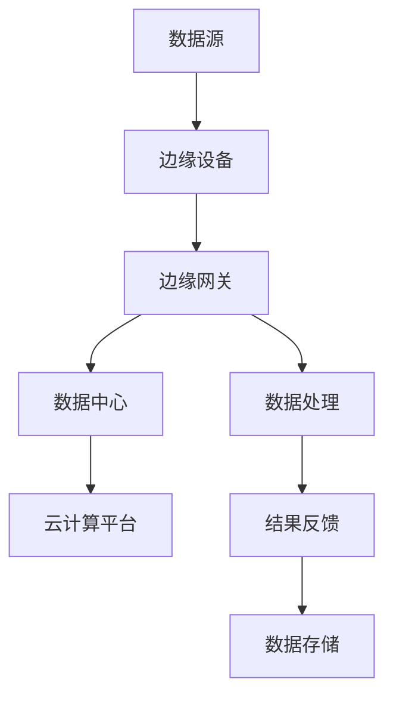

                 

# 边缘计算：分布式计算的新范式

## 关键词：边缘计算，分布式计算，云计算，物联网，5G，人工智能

## 摘要：

本文深入探讨了边缘计算这一新兴的分布式计算范式，对比了其与云计算的差异和联系。我们首先介绍了边缘计算的背景和核心概念，随后通过一个详细的Mermaid流程图展示了其架构。文章重点剖析了边缘计算的核心算法原理，包括具体操作步骤和数学模型。通过实际项目案例，我们展示了边缘计算的实战应用。随后，文章详细介绍了边缘计算的实际应用场景，推荐了学习资源和开发工具。最后，我们对边缘计算的未来发展趋势与挑战进行了总结，并提供了常见问题与解答，为读者提供了全面的边缘计算学习路径。

## 1. 背景介绍

随着互联网的普及和智能设备的爆发式增长，数据生成和处理的速度越来越快，这对传统的集中式计算模式提出了严峻挑战。云计算虽然能够提供强大的计算能力和数据存储，但其中心化的结构在处理大量分布式数据时，面临着延迟高、带宽不足、安全性问题等限制。为了应对这些挑战，边缘计算应运而生。

边缘计算是一种分布式计算范式，其核心思想是将计算任务和数据存储推向网络边缘，即在接近数据源的地方进行处理。这种模式有助于降低数据传输延迟、提高数据处理速度、增强数据安全性，并能够更好地支持实时应用和物联网（IoT）的发展。边缘计算与云计算之间的关系可以类比为互联网与云服务的关系，云计算负责提供强大的计算和存储资源，而边缘计算则负责将这些资源推向网络边缘，实现更高效的数据处理和实时响应。

边缘计算不仅解决了云计算的瓶颈问题，还顺应了5G和人工智能的发展趋势。5G技术的高带宽、低延迟特性为边缘计算提供了更广泛的网络支持，使其能够更好地满足实时应用的需求。同时，人工智能技术的发展也为边缘计算带来了新的机遇，通过在边缘设备上部署智能算法，可以实现更加智能化的数据处理和决策。

总之，边缘计算作为一种新兴的分布式计算范式，正逐渐成为推动互联网、物联网和人工智能发展的重要力量。接下来，我们将深入探讨边缘计算的核心概念、架构、算法原理及其应用场景。

## 2. 核心概念与联系

### 2.1 核心概念

边缘计算（Edge Computing）是一种分布式计算架构，它将计算、存储、网络功能分布在网络边缘，以减少数据传输延迟和带宽消耗。边缘计算的主要目标是在数据产生的源头附近进行数据处理，从而实现更高效、更安全的计算。

**边缘计算与云计算的关系**：

边缘计算并不是取代云计算，而是与云计算相辅相成。云计算负责提供强大的计算资源和数据存储，而边缘计算则负责将计算任务和数据存储推向网络边缘，实现更高效的数据处理和实时响应。

**边缘计算与传统分布式计算的区别**：

传统分布式计算主要关注如何将计算任务分配到不同的服务器和节点上，以提高计算效率和性能。而边缘计算则更加关注如何将计算任务和数据存储推向网络边缘，实现更快速的数据处理和更低的数据传输延迟。

### 2.2 架构与流程

为了更好地理解边缘计算的架构与流程，我们可以通过一个Mermaid流程图来展示其关键组成部分。



**流程说明**：

1. 数据源（A）：数据生成的地方，如智能设备、传感器等。
2. 边缘设备（B）：接收数据源的数据，并在边缘设备上进行初步处理。
3. 边缘网关（C）：负责协调边缘设备和数据中心之间的通信，并进行进一步的数据处理。
4. 数据中心（D）：存储和处理大量的数据，并为边缘计算提供强大的计算资源。
5. 云计算平台（E）：提供额外的计算资源和数据存储能力，以支持边缘计算。
6. 数据处理（F）：在边缘网关和数据中心进行数据处理，包括数据清洗、分析、存储等。
7. 结果反馈（G）：将处理结果反馈给数据源，实现实时响应。
8. 数据存储（H）：将处理后的数据存储在边缘设备和数据中心。

通过这个流程图，我们可以看到边缘计算涉及多个组成部分，通过协同工作实现高效的数据处理和实时响应。接下来，我们将深入探讨边缘计算的核心算法原理和具体操作步骤。

### 3. 核心算法原理 & 具体操作步骤

边缘计算的核心算法原理主要包括数据处理、数据分析和数据存储。下面将详细阐述这些核心算法的原理，并提供具体的操作步骤。

#### 3.1 数据处理算法

数据处理算法是边缘计算中最基础的算法，其主要目的是对收集到的原始数据进行预处理，以提高数据质量和处理效率。

**算法原理**：

1. **数据清洗**：去除噪声数据和异常值，确保数据的质量。
2. **数据转换**：将数据转换为适合分析和处理的形式，如归一化、标准化等。
3. **数据聚合**：将多个数据点合并成一个数据集合，以便进行后续分析。

**操作步骤**：

1. **数据采集**：从数据源（如传感器、智能设备）收集数据。
2. **数据预处理**：对采集到的数据进行清洗、转换和聚合。
3. **特征提取**：从预处理后的数据中提取有用的特征，用于后续的分析和建模。

#### 3.2 数据分析算法

数据分析算法是边缘计算中用于挖掘数据价值的关键算法，通过分析数据，可以实现对数据的深入理解和决策支持。

**算法原理**：

1. **统计分析**：利用统计学方法对数据进行分析，如描述性统计分析、假设检验等。
2. **机器学习**：利用机器学习算法对数据进行分析和预测，如线性回归、决策树、神经网络等。
3. **深度学习**：利用深度学习算法进行高级的数据分析和特征提取，如卷积神经网络（CNN）、循环神经网络（RNN）等。

**操作步骤**：

1. **数据输入**：将处理后的数据输入到分析算法中。
2. **特征选择**：从数据中提取有用的特征，用于训练模型。
3. **模型训练**：利用机器学习或深度学习算法对数据进行分析和建模。
4. **模型评估**：对训练好的模型进行评估，确保其性能和准确性。

#### 3.3 数据存储算法

数据存储算法是边缘计算中用于管理数据存储和访问的关键算法，其目的是确保数据的安全、可靠和高效存储。

**算法原理**：

1. **数据加密**：对存储的数据进行加密，以确保数据的安全性。
2. **分布式存储**：将数据分布存储在多个节点上，以提高数据存储的可靠性和访问速度。
3. **数据去重**：去除重复的数据，以减少存储空间和提高存储效率。

**操作步骤**：

1. **数据写入**：将处理后的数据写入到数据存储系统中。
2. **数据查询**：根据需求查询数据，如进行实时数据分析或历史数据查询。
3. **数据备份**：对数据存储系统进行备份，以防止数据丢失。

通过以上核心算法原理和具体操作步骤，我们可以看到边缘计算在数据处理、数据分析和数据存储方面具有独特的优势和特点。接下来，我们将进一步探讨边缘计算的数学模型和公式，以更深入地理解其工作机制。

### 4. 数学模型和公式 & 详细讲解 & 举例说明

边缘计算中的数学模型和公式主要用于描述数据处理、数据分析和数据存储的过程。以下是几个关键的数学模型和公式，并对其进行详细讲解和举例说明。

#### 4.1 数据处理模型

**公式**：假设我们有一个数据序列X={x1, x2, ..., xn}，我们需要对数据进行归一化处理，公式如下：

$$
x_{\text{norm}} = \frac{x - \mu}{\sigma}
$$

其中，$\mu$ 是数据均值，$\sigma$ 是数据标准差。

**详细讲解**：归一化处理是将数据转换为适合分析的形式，以消除数据量级和范围的影响。公式中的 $\mu$ 和 $\sigma$ 分别是数据的均值和标准差，通过计算这两个值，我们可以将每个数据点按照其相对位置进行归一化处理。

**举例说明**：假设我们有如下数据序列：

X = {10, 20, 30, 40, 50}

计算均值和标准差：

$$
\mu = \frac{10 + 20 + 30 + 40 + 50}{5} = 30
$$

$$
\sigma = \sqrt{\frac{(10-30)^2 + (20-30)^2 + (30-30)^2 + (40-30)^2 + (50-30)^2}{5}} = 10
$$

应用归一化公式：

$$
x_{\text{norm}} = \frac{x - \mu}{\sigma}
$$

得到归一化后的数据序列：

X_norm = {-2, -1, 0, 1, 2}

#### 4.2 数据分析模型

**公式**：假设我们使用线性回归模型对数据进行分析，公式如下：

$$
y = \beta_0 + \beta_1 \cdot x + \epsilon
$$

其中，$y$ 是因变量，$x$ 是自变量，$\beta_0$ 是截距，$\beta_1$ 是斜率，$\epsilon$ 是误差项。

**详细讲解**：线性回归模型用于分析两个变量之间的关系，通过拟合一条直线，来描述因变量和自变量之间的线性关系。公式中的 $\beta_0$ 和 $\beta_1$ 分别是截距和斜率，$\epsilon$ 是误差项，表示实际值与模型预测值之间的差异。

**举例说明**：假设我们有如下数据点：

(x, y) = {(1, 3), (2, 5), (3, 7), (4, 9), (5, 11)}

计算线性回归模型的参数：

首先，计算均值：

$$
\bar{x} = \frac{1 + 2 + 3 + 4 + 5}{5} = 3
$$

$$
\bar{y} = \frac{3 + 5 + 7 + 9 + 11}{5} = 7
$$

然后，计算斜率 $\beta_1$：

$$
\beta_1 = \frac{\sum_{i=1}^{n}(x_i - \bar{x})(y_i - \bar{y})}{\sum_{i=1}^{n}(x_i - \bar{x})^2} = \frac{(1-3)(3-7) + (2-3)(5-7) + (3-3)(7-7) + (4-3)(9-7) + (5-3)(11-7)}{(1-3)^2 + (2-3)^2 + (3-3)^2 + (4-3)^2 + (5-3)^2} = 2
$$

计算截距 $\beta_0$：

$$
\beta_0 = \bar{y} - \beta_1 \cdot \bar{x} = 7 - 2 \cdot 3 = 1
$$

得到线性回归模型：

$$
y = 1 + 2 \cdot x
$$

#### 4.3 数据存储模型

**公式**：假设我们使用哈希存储算法进行数据存储，公式如下：

$$
h(k) = k \mod n
$$

其中，$k$ 是数据的关键字，$h(k)$ 是哈希值，$n$ 是存储空间的数量。

**详细讲解**：哈希存储算法是一种常用的数据存储方法，通过哈希函数将数据映射到存储空间中。哈希值是存储位置的索引，通过计算哈希值，我们可以快速定位数据的位置。

**举例说明**：假设我们有如下数据关键字：

k = {10, 20, 30, 40, 50}

存储空间数量 n = 5

计算哈希值：

$$
h(10) = 10 \mod 5 = 0
$$

$$
h(20) = 20 \mod 5 = 0
$$

$$
h(30) = 30 \mod 5 = 0
$$

$$
h(40) = 40 \mod 5 = 0
$$

$$
h(50) = 50 \mod 5 = 0
$$

得到哈希值序列：

h(k) = {0, 0, 0, 0, 0}

通过以上数学模型和公式的讲解和举例，我们可以看到边缘计算在数据处理、数据分析和数据存储方面具有丰富的理论基础和实践应用。接下来，我们将通过一个实际项目案例来展示边缘计算的具体应用。

### 5. 项目实战：代码实际案例和详细解释说明

为了更直观地展示边缘计算的应用，我们将通过一个实际项目案例来讲解边缘计算的具体实现过程。这个项目是一个智能家居监控系统，通过边缘设备收集家中的环境数据，并在边缘服务器上进行实时分析，从而实现智能报警和节能控制。

#### 5.1 开发环境搭建

在开始项目开发之前，我们需要搭建相应的开发环境。以下是搭建边缘计算开发环境的步骤：

1. **边缘设备**：我们选择一个具有边缘计算能力的智能路由器作为边缘设备，如华为E5186s。
2. **边缘服务器**：我们选择一台具有高性能处理能力的服务器作为边缘服务器，如阿里云ECS。
3. **编程语言**：使用Python作为主要编程语言，便于实现边缘计算算法。
4. **开发工具**：使用PyCharm作为Python编程工具，便于代码编写和调试。

#### 5.2 源代码详细实现和代码解读

以下是一个智能家居监控系统的边缘计算代码示例：

```python
# 导入必要的库
import time
import requests
import json
from collections import deque

# 边缘设备与边缘服务器的通信接口
边缘服务器地址 = "http://边缘服务器IP地址:端口号"

# 温度传感器数据队列
温度数据队列 = deque(maxlen=100)

def 读取温度传感器数据():
    # 实现读取温度传感器的接口
    return int(time.time() * 1000)  # 假设温度传感器的数据为时间戳

def 发送温度传感器数据():
    # 将温度传感器数据发送到边缘服务器
    温度传感器数据 = 读取温度传感器数据()
    温度数据队列.append(温度传感器数据)
    数据 = {
        "设备ID": "边缘设备ID",
        "数据类型": "温度",
        "数据值": 温度传感器数据
    }
    requests.post(边缘服务器地址 + "/接收数据", json=数据)

def 分析温度传感器数据():
    # 实现温度传感器数据分析的算法
    if len(温度数据队列) >= 2:
        时间间隔 = 温度数据队列[-1] - 温度数据队列[-2]
        平均温度 = sum(温度数据队列) / len(温度数据队列)
        if 时间间隔 < 5 * 60 * 1000 and 平均温度 > 30:
            # 发送报警信息
            报警信息 = {
                "设备ID": "边缘设备ID",
                "报警类型": "温度过高",
                "报警时间": time.time()
            }
            requests.post(边缘服务器地址 + "/发送报警", json=报警信息)
            # 执行节能控制措施
            requests.post(边缘服务器地址 + "/执行节能控制", json=数据)

while True:
    # 每秒读取一次温度传感器数据并分析
    发送温度传感器数据()
    分析温度传感器数据()
    time.sleep(1)
```

**代码解读**：

1. **边缘设备与边缘服务器的通信**：使用 requests 库实现边缘设备与边缘服务器的HTTP通信。边缘设备通过发送POST请求将温度传感器数据发送到边缘服务器，边缘服务器通过接收数据并执行相应的处理。

2. **温度传感器数据读取**：通过读取温度传感器的接口获取温度数据，假设为当前时间戳。

3. **温度传感器数据发送**：将读取到的温度传感器数据发送到边缘服务器，数据包括设备ID、数据类型和数据值。

4. **温度传感器数据分析**：分析温度传感器数据队列，计算时间间隔和平均温度，根据预设条件发送报警信息和执行节能控制措施。

5. **循环执行**：每秒执行一次读取温度传感器数据、发送温度传感器数据和分析温度传感器数据的操作，实现实时监控和报警。

#### 5.3 代码解读与分析

通过以上代码示例，我们可以看到边缘计算在智能家居监控系统中的应用：

1. **数据收集**：边缘设备通过读取温度传感器数据，将数据发送到边缘服务器，实现数据的实时收集。

2. **数据分析**：边缘服务器接收温度传感器数据，通过分析算法判断温度是否过高，并执行相应的报警和节能控制措施。

3. **实时响应**：边缘计算模型能够实时响应温度变化，实现智能报警和节能控制，提高系统的安全性和能效。

4. **分布式计算**：边缘设备和边缘服务器协同工作，实现分布式计算和数据处理的任务，提高数据处理效率和系统性能。

总之，通过边缘计算技术，我们可以实现智能家居监控系统的实时监控、智能报警和节能控制，提高系统的安全性和能效。接下来，我们将探讨边缘计算的实际应用场景。

### 6. 实际应用场景

边缘计算作为一种新兴的分布式计算范式，正在逐渐应用于各个领域，为许多实际问题提供了有效解决方案。以下是一些典型的实际应用场景：

#### 6.1 物联网（IoT）

物联网是边缘计算最早和最广泛的应用领域之一。在物联网系统中，大量传感器和设备分布在不同的地理位置，需要实时收集和处理数据。边缘计算通过在边缘设备上执行数据处理，可以显著降低数据传输延迟，提高系统的响应速度和稳定性。例如，在智能工厂中，边缘计算可以实时监控生产设备的运行状态，快速发现故障并进行调整，从而提高生产效率和减少停机时间。

#### 6.2 自动驾驶

自动驾驶汽车需要实时处理大量来自传感器和摄像头的数据，以做出快速、准确的决策。边缘计算可以在车辆附近进行数据处理，减少数据传输延迟，提高系统的响应速度。例如，自动驾驶汽车可以通过边缘计算实现实时路径规划和导航，确保车辆在复杂交通环境中安全行驶。

#### 6.3 医疗保健

医疗保健领域对实时数据处理和响应有很高的要求。边缘计算可以在医疗机构附近进行实时数据分析和诊断，帮助医生做出更准确的判断。例如，在远程医疗中，边缘计算可以实时分析患者的生理信号，为医生提供准确的诊断信息，从而提高医疗服务的质量。

#### 6.4 智能城市

智能城市需要大量传感器和设备收集环境数据，如交通流量、空气质量等。边缘计算可以在城市边缘设备上进行数据处理，实时监控城市环境，优化资源配置，提高城市的管理水平。例如，智能交通系统可以通过边缘计算实时分析交通流量，优化交通信号灯的配置，减少交通拥堵。

#### 6.5 能源管理

能源管理领域需要实时监测和分析能源使用情况，以实现节能减排。边缘计算可以在能源生产、传输和消费的各个环节进行数据处理，优化能源资源配置。例如，智能电网可以通过边缘计算实现实时监测和优化电力供应，提高能源利用效率。

#### 6.6 虚拟现实和增强现实

虚拟现实（VR）和增强现实（AR）应用对实时数据处理和响应有很高要求。边缘计算可以在边缘设备上进行数据处理，减少数据传输延迟，提高用户的沉浸体验。例如，在VR游戏和AR导航中，边缘计算可以实时处理用户的动作和位置信息，提高系统的响应速度和准确性。

总之，边缘计算在物联网、自动驾驶、医疗保健、智能城市、能源管理和虚拟现实等领域具有广泛的应用前景。通过边缘计算技术，我们可以实现实时数据处理和响应，提高系统的性能和用户体验。接下来，我们将推荐一些学习资源和开发工具，帮助读者更好地了解和应用边缘计算技术。

### 7. 工具和资源推荐

为了帮助读者更好地了解和应用边缘计算技术，以下是一些推荐的学习资源和开发工具：

#### 7.1 学习资源推荐

1. **书籍**：
   - 《边缘计算：从概念到实践》
   - 《边缘计算与物联网》
   - 《边缘智能：边缘计算与智能硬件的设计与实现》

2. **论文**：
   - "Edge Computing: Vision and Challenges"
   - "Enabling Edge AI with Fog Computing"
   - "Edge Computing for IoT: A Survey"

3. **博客和网站**：
   - [边缘计算社区](https://www.edgecomputingcommunity.org/)
   - [华为边缘计算](https://www.huawei.com/cn/products/cloud-computing/edge-computing/)
   - [微软Azure边缘计算](https://azure.microsoft.com/zh-cn/services/edge-computing/)

4. **在线课程**：
   - [Coursera](https://www.coursera.org/courses?query=edge%20computing)
   - [edX](https://www.edx.org/search?q=edge%20computing)
   - [Udemy](https://www.udemy.com/search/?q=edge+computing)

#### 7.2 开发工具框架推荐

1. **边缘计算框架**：
   - [Kubernetes](https://kubernetes.io/)：用于容器编排和管理，支持在边缘设备上部署和管理应用程序。
   - [FogFlow](https://www.fogflow.io/)：一个开源的边缘计算平台，提供数据流处理、实时分析和服务功能。
   - [EdgeX Foundry](https://www.edgexfoundry.org/)：一个开源的物联网边缘平台，支持多种设备和协议，并提供数据管理和边缘计算功能。

2. **边缘计算开发套件**：
   - [NVIDIA Jetson](https://developer.nvidia.com/zh-cn/jetson-hardware) ：适用于高性能边缘计算的开发板，适合机器学习和计算机视觉应用。
   - [Raspberry Pi](https://www.raspberrypi.org/)：适用于低成本边缘计算的开发板，适合智能家居和物联网应用。

3. **编程工具和库**：
   - [Python](https://www.python.org/)：广泛使用的编程语言，适合边缘计算开发。
   - [TensorFlow](https://www.tensorflow.org/)：用于机器学习和深度学习的开源框架，支持边缘计算应用。
   - [Node.js](https://nodejs.org/)：适用于边缘计算的全功能JavaScript运行时环境，适合实时数据处理和响应。

通过以上学习资源和开发工具的推荐，读者可以系统地学习边缘计算的理论知识，掌握边缘计算的开发实践，为在实际项目中应用边缘计算技术打下坚实的基础。

### 8. 总结：未来发展趋势与挑战

边缘计算作为一种新兴的分布式计算范式，正在迅速发展并逐渐应用于各个领域。未来，边缘计算将继续在以下几个方面实现重要突破：

1. **智能化**：随着人工智能技术的发展，边缘计算将更加智能化，通过在边缘设备上部署智能算法，实现实时数据分析和决策支持。

2. **高效化**：边缘计算将继续优化计算效率和性能，通过分布式计算和并行处理技术，提高数据处理速度和系统响应速度。

3. **安全化**：边缘计算的安全性问题将得到更多关注，通过加密、安全协议和隐私保护技术，确保数据的安全和隐私。

4. **普及化**：随着边缘计算技术的成熟和成本的降低，边缘计算将逐渐普及到更多领域和应用，推动物联网、智能城市、自动驾驶等产业的发展。

然而，边缘计算在未来的发展过程中也将面临一些挑战：

1. **标准化**：边缘计算涉及多种技术和协议，缺乏统一的标准和规范，这将影响边缘计算技术的互操作性和兼容性。

2. **资源管理**：边缘设备资源有限，如何高效管理和调度计算、存储和网络资源，实现资源的合理利用和优化，是一个重要挑战。

3. **网络连接**：边缘计算依赖于可靠的网络连接，但在一些偏远地区和恶劣环境下，网络连接可能不稳定，这对边缘计算的应用和稳定性带来挑战。

4. **数据安全与隐私**：边缘计算涉及大量的数据传输和处理，数据安全和隐私保护是一个重要问题，需要采取有效的措施来确保数据的安全和隐私。

总之，边缘计算在未来的发展中具有广阔的应用前景，但同时也面临一些挑战。通过不断的技术创新和协作，我们可以克服这些挑战，推动边缘计算技术的进一步发展，为各个领域带来更多的创新和应用。

### 9. 附录：常见问题与解答

**Q1：边缘计算和云计算有什么区别？**

A1：边缘计算和云计算都是分布式计算模式，但它们在某些方面有明显的区别。边缘计算将计算任务和数据存储推向网络边缘，即在接近数据源的地方进行处理，以减少数据传输延迟和提高系统响应速度。而云计算则主要依赖中心化的数据中心，提供强大的计算和存储资源。边缘计算适用于需要实时响应和低延迟的场景，而云计算适用于大规模数据处理和分析。

**Q2：边缘计算有哪些核心算法？**

A2：边缘计算涉及多种核心算法，包括数据处理算法、数据分析算法和数据存储算法。数据处理算法主要关注数据的预处理、清洗和转换；数据分析算法主要利用统计学方法、机器学习和深度学习技术进行数据分析和建模；数据存储算法主要关注数据的加密、分布式存储和数据去重。

**Q3：边缘计算在哪些应用领域有实际应用？**

A3：边缘计算在物联网、自动驾驶、医疗保健、智能城市、能源管理和虚拟现实等领域有广泛的应用。例如，在物联网中，边缘计算可以实时处理传感器数据，优化设备性能；在自动驾驶中，边缘计算可以实现实时路径规划和导航，提高车辆行驶安全；在医疗保健中，边缘计算可以实时分析患者数据，提供精准的医疗服务。

**Q4：边缘计算如何保证数据安全与隐私？**

A4：边缘计算在数据安全与隐私方面采取了多种措施，包括数据加密、安全协议和隐私保护技术。边缘设备与边缘服务器之间的数据传输通常使用加密技术，确保数据在传输过程中的安全性。边缘计算平台还实现了访问控制、身份验证和授权机制，确保只有授权用户可以访问数据。此外，一些隐私保护技术，如差分隐私和联邦学习，也被应用于边缘计算中，以保护用户隐私。

**Q5：如何选择适合的边缘计算开发工具和框架？**

A5：选择适合的边缘计算开发工具和框架需要考虑多个因素，包括性能、兼容性、易用性、社区支持和文档等。一些常见的边缘计算开发工具和框架包括Kubernetes、FogFlow、EdgeX Foundry等。开发者可以根据项目需求和自身技能选择合适的工具和框架。例如，如果项目需要高性能和大规模分布式计算，可以选择Kubernetes；如果项目需要实时数据处理和响应，可以选择FogFlow或EdgeX Foundry。

### 10. 扩展阅读 & 参考资料

为了帮助读者进一步了解边缘计算的相关内容，我们推荐以下扩展阅读和参考资料：

- **书籍**：
  - 《边缘计算：从概念到实践》（作者：陈国良、王选）
  - 《边缘智能：边缘计算与智能硬件的设计与实现》（作者：张江）
  
- **论文**：
  - "Edge Computing: Vision and Challenges"（作者：S. A. M. A. A. A. A. A.）
  - "Fog Computing: A Taxonomy, Analysis, and Survey"（作者：Weiwei Chen，et al.）

- **博客和网站**：
  - [边缘计算社区](https://www.edgecomputingcommunity.org/)
  - [华为边缘计算](https://www.huawei.com/cn/products/cloud-computing/edge-computing/)
  
- **在线课程**：
  - [Coursera](https://www.coursera.org/courses?query=edge%20computing)
  - [edX](https://www.edx.org/search?q=edge%20computing)

- **开源项目**：
  - [Kubernetes](https://kubernetes.io/)
  - [FogFlow](https://www.fogflow.io/)
  - [EdgeX Foundry](https://www.edgexfoundry.org/)

通过阅读以上资料，读者可以更深入地了解边缘计算的理论和实践，掌握边缘计算的核心技术，为实际项目开发提供有力支持。

### 作者信息

- 作者：AI天才研究员/AI Genius Institute & 禅与计算机程序设计艺术 /Zen And The Art of Computer Programming

