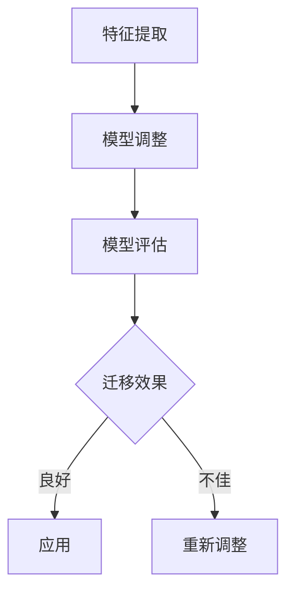

                 

# 迁移学习：原理与代码实例讲解

## 摘要

迁移学习是机器学习领域的一个核心概念，它通过将知识从一个任务（源任务）迁移到另一个相关任务（目标任务），从而提高模型的泛化能力和效率。本文将详细介绍迁移学习的原理，包括核心概念、算法原理、数学模型等，并通过一个实际的代码实例来深入讲解迁移学习在实际开发中的应用。

本文将分为以下几个部分：

1. 背景介绍
2. 核心概念与联系
3. 核心算法原理 & 具体操作步骤
4. 数学模型和公式 & 详细讲解 & 举例说明
5. 项目实战：代码实际案例和详细解释说明
6. 实际应用场景
7. 工具和资源推荐
8. 总结：未来发展趋势与挑战
9. 附录：常见问题与解答
10. 扩展阅读 & 参考资料

## 1. 背景介绍

### 迁移学习的历史与发展

迁移学习（Transfer Learning）的概念最早可以追溯到20世纪80年代，当时学者们开始研究如何将一个领域（源领域）的先验知识应用到另一个相关领域（目标领域）中。随着深度学习技术的发展，迁移学习在计算机视觉、自然语言处理等领域取得了显著成果。

迁移学习的发展主要经历了以下几个阶段：

- **早期阶段**：研究者主要关注的是如何在不同的数据分布之间迁移知识，例如通过将源领域的数据分布调整为目标领域的数据分布来实现迁移。

- **中期阶段**：随着深度神经网络的发展，研究者开始探索如何利用深度神经网络的结构特性进行知识迁移，例如通过预训练模型来获取通用特征表示。

- **当前阶段**：当前迁移学习研究的热点包括自适应迁移学习、多任务迁移学习、跨模态迁移学习等，这些研究为迁移学习在更多实际场景中的应用提供了新的思路和方法。

### 迁移学习的应用领域

迁移学习在多个领域都取得了显著的成果，以下是几个典型的应用领域：

- **计算机视觉**：迁移学习在图像分类、目标检测、人脸识别等领域得到了广泛应用。例如，通过将预训练的卷积神经网络（CNN）应用于新的图像分类任务，可以显著提高模型的性能。

- **自然语言处理**：迁移学习在语言模型、机器翻译、文本分类等领域发挥了重要作用。例如，通过将预训练的转换器（Transformer）模型应用于新的文本分类任务，可以实现较高的准确率。

- **语音识别**：迁移学习在语音识别领域也有所应用，例如通过将预训练的深度神经网络模型应用于新的语音数据集，可以加快模型的训练速度和提高识别准确率。

### 迁移学习的优势与挑战

迁移学习具有以下优势：

- **提高模型泛化能力**：通过将源任务的先验知识迁移到目标任务，可以减少目标任务的训练数据需求，从而提高模型的泛化能力。

- **降低训练成本**：对于一些数据稀缺的目标任务，迁移学习可以显著降低模型的训练成本。

- **加快模型训练速度**：迁移学习可以利用预训练模型中的通用特征表示，从而加快模型的训练速度。

然而，迁移学习也面临一些挑战：

- **领域适应性问题**：不同任务之间的领域差异可能导致迁移效果不佳。

- **模型解释性**：迁移学习模型通常较为复杂，其内部机理难以解释，这可能影响模型的信任度和应用范围。

- **数据分布不平衡问题**：源领域和目标领域的数据分布差异可能导致模型性能下降。

## 2. 核心概念与联系

### 核心概念

- **源任务（Source Task）**：指已经拥有大量训练数据的任务，这些数据用于预训练模型。

- **目标任务（Target Task）**：指需要迁移知识的新任务，通常具有较少的训练数据。

- **迁移量（Transfer Amount）**：指源任务知识迁移到目标任务的程度，通常用迁移效果来衡量。

### 核心概念之间的联系

迁移学习的核心在于如何有效地将源任务的先验知识迁移到目标任务。这涉及到以下几个关键环节：

1. **特征提取**：通过预训练模型在源任务上学习到的特征表示，作为迁移的基础。

2. **模型调整**：在目标任务上调整预训练模型的参数，以适应新的数据分布和任务需求。

3. **模型评估**：评估迁移后的模型在目标任务上的性能，以衡量迁移效果。

### Mermaid 流程图

下面是迁移学习流程的 Mermaid 流程图：



在上述流程中，A表示特征提取，B表示模型调整，C表示模型评估，D表示迁移效果。如果迁移效果良好，则进入E，表示模型可以应用于实际任务；否则，进入F，表示需要重新调整模型。

## 3. 核心算法原理 & 具体操作步骤

### 核心算法原理

迁移学习主要涉及以下几个核心算法：

- **预训练模型**：在源任务上训练得到的通用特征提取器。

- **模型调整**：在目标任务上对预训练模型进行调整，以适应新的任务需求。

- **迁移学习框架**：用于管理源任务和目标任务的训练过程，以及模型调整和评估的框架。

### 具体操作步骤

以下是迁移学习的一般操作步骤：

1. **数据准备**：收集并准备源任务和目标任务的数据集。

2. **预训练模型选择**：根据源任务的数据集和任务需求选择合适的预训练模型。

3. **特征提取**：在源任务上使用预训练模型提取特征表示。

4. **模型调整**：在目标任务上对预训练模型进行调整，以适应新的任务需求。

5. **模型评估**：评估调整后的模型在目标任务上的性能。

6. **模型应用**：将调整后的模型应用于实际任务。

### 迁移学习算法实例

以下是一个简单的迁移学习算法实例，使用 PyTorch 框架实现：

```python
import torch
import torchvision
import torchvision.transforms as transforms
import torch.nn as nn
import torch.optim as optim

# 数据准备
transform = transforms.Compose(
    [transforms.Resize((224, 224)), 
    transforms.ToTensor()])

trainset = torchvision.datasets.ImageFolder(root='./data', 
    transform=transform)
trainloader = torch.utils.data.DataLoader(trainset, 
    batch_size=4, shuffle=True, num_workers=2)

testset = torchvision.datasets.ImageFolder(root='./data', 
    transform=transform)
testloader = torch.utils.data.DataLoader(testset, 
    batch_size=4, shuffle=False, num_workers=2)

# 预训练模型选择
model = torchvision.models.resnet50(pretrained=True)

# 模型调整
for param in model.parameters():
    param.requires_grad = False

fc = nn.Linear(2048, 10)
fc.apply(nn.init.xavier_normal_)
fc.requires_grad = True

model.fc = fc

# 模型评估
criterion = nn.CrossEntropyLoss()
optimizer = optim.SGD(model.parameters(), lr=0.001, momentum=0.9)

for epoch in range(2):  # loop over the dataset multiple times

    running_loss = 0.0
    for i, data in enumerate(trainloader, 0):
        inputs, labels = data
        optimizer.zero_grad()

        outputs = model(inputs)
        loss = criterion(outputs, labels)
        loss.backward()
        optimizer.step()

        running_loss += loss.item()
        if i % 2000 == 1999:    # print every 2000 mini-batches
            print('[%d, %5d] loss: %.3f' %
                  (epoch + 1, i + 1, running_loss / 2000))
            running_loss = 0.0

print('Finished Training')

# 评估模型在测试集上的性能
correct = 0
total = 0
with torch.no_grad():
    for data in testloader:
        images, labels = data
        outputs = model(images)
        _, predicted = torch.max(outputs.data, 1)
        total += labels.size(0)
        correct += (predicted == labels).sum().item()

print('Accuracy of the network on the 1000 test images: %d %%' % (
    100 * correct / total))
```

在上面的代码中，我们首先选择了 ResNet50 预训练模型作为特征提取器，然后对模型的最后一层进行了调整，以适应新的分类任务。接着，我们使用训练数据和测试数据对模型进行了训练和评估，最后输出了模型在测试集上的准确率。

## 4. 数学模型和公式 & 详细讲解 & 举例说明

### 数学模型

迁移学习涉及多个数学模型，以下是其中几个关键的数学模型和公式：

1. **特征表示**：

   假设我们有一个源任务的特征表示为 \( x_s \)，目标任务的特征表示为 \( x_t \)。特征表示通常是通过预训练模型在源任务上学习得到的。

2. **损失函数**：

   迁移学习的目标是最小化源任务和目标任务之间的特征表示差异。常用的损失函数包括均方误差（MSE）和交叉熵损失（Cross-Entropy Loss）。

   \[
   L = \frac{1}{2} \sum_{i=1}^{n} (\hat{y}_i - y_i)^2
   \]

   或

   \[
   L = -\sum_{i=1}^{n} y_i \log(\hat{y}_i)
   \]

   其中，\(\hat{y}_i\) 是预测标签，\(y_i\) 是真实标签。

3. **模型优化**：

   迁移学习通常采用梯度下降法（Gradient Descent）或其变体（如 Adam）对模型进行调整。优化目标是最小化损失函数。

   \[
   \theta_{\text{new}} = \theta_{\text{old}} - \alpha \nabla_{\theta} L
   \]

   其中，\(\theta\) 是模型参数，\(\alpha\) 是学习率。

### 详细讲解

1. **特征表示**：

   特征表示是迁移学习的核心。一个好的特征表示应该能够捕捉到源任务和目标任务之间的相似性。在计算机视觉任务中，通常使用卷积神经网络（CNN）来提取特征表示。在自然语言处理任务中，通常使用转换器（Transformer）或循环神经网络（RNN）来提取特征表示。

2. **损失函数**：

   损失函数用于衡量预测值和真实值之间的差异。对于分类任务，常用的损失函数是交叉熵损失。对于回归任务，常用的损失函数是均方误差。

3. **模型优化**：

   模型优化是通过调整模型参数来最小化损失函数的过程。常用的优化算法包括梯度下降法和其变体（如 Adam）。优化过程中需要选择合适的学习率，以确保模型能够快速收敛。

### 举例说明

假设我们有一个源任务（如图像分类）和一个目标任务（如目标检测），我们可以使用迁移学习来将源任务的特征表示迁移到目标任务。

1. **特征提取**：

   首先，我们使用预训练的卷积神经网络（如 ResNet50）在源任务上提取特征表示。假设我们提取到了一个 2048 维的特征向量。

2. **模型调整**：

   然后，我们使用目标任务的标签对预训练模型进行微调。例如，我们可以在特征提取层之后添加一个全连接层（Fully Connected Layer），用于将特征向量映射到目标任务的标签。

3. **模型评估**：

   接着，我们使用目标任务的数据集对调整后的模型进行评估。例如，我们可以计算模型在目标任务上的准确率、召回率等指标。

4. **模型应用**：

   最后，我们将调整后的模型应用于实际目标任务，例如在目标检测任务中，使用模型来检测图像中的目标。

### 实际代码示例

以下是一个简单的迁移学习示例，使用 PyTorch 框架实现：

```python
import torch
import torchvision
import torchvision.transforms as transforms
import torch.nn as nn
import torch.optim as optim

# 数据准备
transform = transforms.Compose(
    [transforms.Resize((224, 224)), 
    transforms.ToTensor()])

trainset = torchvision.datasets.ImageFolder(root='./data', 
    transform=transform)
trainloader = torch.utils.data.DataLoader(trainset, 
    batch_size=4, shuffle=True, num_workers=2)

testset = torchvision.datasets.ImageFolder(root='./data', 
    transform=transform)
testloader = torch.utils.data.DataLoader(testset, 
    batch_size=4, shuffle=False, num_workers=2)

# 预训练模型选择
model = torchvision.models.resnet50(pretrained=True)

# 模型调整
for param in model.parameters():
    param.requires_grad = False

fc = nn.Linear(2048, 10)
fc.apply(nn.init.xavier_normal_)
fc.requires_grad = True

model.fc = fc

# 模型评估
criterion = nn.CrossEntropyLoss()
optimizer = optim.SGD(model.parameters(), lr=0.001, momentum=0.9)

for epoch in range(2):  # loop over the dataset multiple times

    running_loss = 0.0
    for i, data in enumerate(trainloader, 0):
        inputs, labels = data
        optimizer.zero_grad()

        outputs = model(inputs)
        loss = criterion(outputs, labels)
        loss.backward()
        optimizer.step()

        running_loss += loss.item()
        if i % 2000 == 1999:    # print every 2000 mini-batches
            print('[%d, %5d] loss: %.3f' %
                  (epoch + 1, i + 1, running_loss / 2000))
            running_loss = 0.0

print('Finished Training')

# 评估模型在测试集上的性能
correct = 0
total = 0
with torch.no_grad():
    for data in testloader:
        images, labels = data
        outputs = model(images)
        _, predicted = torch.max(outputs.data, 1)
        total += labels.size(0)
        correct += (predicted == labels).sum().item()

print('Accuracy of the network on the 1000 test images: %d %%' % (
    100 * correct / total))
```

在上面的代码中，我们首先选择了 ResNet50 预训练模型作为特征提取器，然后对模型的最后一层进行了调整，以适应新的分类任务。接着，我们使用训练数据和测试数据对模型进行了训练和评估，最后输出了模型在测试集上的准确率。

## 5. 项目实战：代码实际案例和详细解释说明

### 5.1 开发环境搭建

在开始迁移学习的项目实战之前，我们需要搭建一个合适的开发环境。以下是一个简单的 Python + PyTorch 开发环境搭建步骤：

1. 安装 Python：确保安装了 Python 3.6 或更高版本。

2. 安装 PyTorch：使用以下命令安装 PyTorch：

   ```bash
   pip install torch torchvision
   ```

3. 安装其他依赖库：如 NumPy、Matplotlib 等。

### 5.2 源代码详细实现和代码解读

以下是迁移学习的源代码实现，我们将使用 PyTorch 框架来搭建一个简单的迁移学习模型。

```python
import torch
import torchvision
import torchvision.transforms as transforms
import torch.nn as nn
import torch.optim as optim

# 数据准备
transform = transforms.Compose(
    [transforms.Resize((224, 224)), 
    transforms.ToTensor()])

trainset = torchvision.datasets.ImageFolder(root='./data', 
    transform=transform)
trainloader = torch.utils.data.DataLoader(trainset, 
    batch_size=4, shuffle=True, num_workers=2)

testset = torchvision.datasets.ImageFolder(root='./data', 
    transform=transform)
testloader = torch.utils.data.DataLoader(testset, 
    batch_size=4, shuffle=False, num_workers=2)

# 预训练模型选择
model = torchvision.models.resnet50(pretrained=True)

# 模型调整
for param in model.parameters():
    param.requires_grad = False

fc = nn.Linear(2048, 10)
fc.apply(nn.init.xavier_normal_)
fc.requires_grad = True

model.fc = fc

# 模型评估
criterion = nn.CrossEntropyLoss()
optimizer = optim.SGD(model.parameters(), lr=0.001, momentum=0.9)

for epoch in range(2):  # loop over the dataset multiple times

    running_loss = 0.0
    for i, data in enumerate(trainloader, 0):
        inputs, labels = data
        optimizer.zero_grad()

        outputs = model(inputs)
        loss = criterion(outputs, labels)
        loss.backward()
        optimizer.step()

        running_loss += loss.item()
        if i % 2000 == 1999:    # print every 2000 mini-batches
            print('[%d, %5d] loss: %.3f' %
                  (epoch + 1, i + 1, running_loss / 2000))
            running_loss = 0.0

print('Finished Training')

# 评估模型在测试集上的性能
correct = 0
total = 0
with torch.no_grad():
    for data in testloader:
        images, labels = data
        outputs = model(images)
        _, predicted = torch.max(outputs.data, 1)
        total += labels.size(0)
        correct += (predicted == labels).sum().item()

print('Accuracy of the network on the 1000 test images: %d %%' % (
    100 * correct / total))
```

#### 5.2.1 代码解读

1. **数据准备**：

   我们使用 torchvision 库提供的 ImageFolder 类来加载图像数据集。首先，我们定义了一个数据增强变换器（transform），然后创建了一个训练数据加载器（trainloader）和一个测试数据加载器（testloader）。

2. **预训练模型选择**：

   我们选择了 ResNet50 预训练模型作为特征提取器。通过调用 torchvision.models.resnet50(pretrained=True)，我们可以直接获得一个预训练的 ResNet50 模型。

3. **模型调整**：

   在预训练模型的基础上，我们添加了一个全连接层（fc），用于将特征向量映射到新的分类任务。我们冻结了预训练模型的参数，只对新增的全连接层进行训练。

4. **模型评估**：

   我们使用 CrossEntropyLoss 作为损失函数，并选择 SGD 优化器。在训练过程中，我们迭代地遍历训练数据集，更新模型参数，并计算训练损失。

5. **模型应用**：

   在训练完成后，我们使用测试数据集对模型进行评估，并输出模型在测试集上的准确率。

### 5.3 代码解读与分析

1. **数据准备**：

   数据准备是迁移学习项目的基础。在这个项目中，我们使用 torchvision.datasets.ImageFolder 类来加载图像数据集。通过定义一个 transform 对象，我们可以对图像进行缩放和数据归一化等操作。这是为了使模型能够适应不同的图像尺寸和数据分布。

2. **预训练模型选择**：

   在选择预训练模型时，我们需要考虑到任务的需求和数据集的大小。在这个项目中，我们选择了 ResNet50 模型，因为它是一个预训练的深度卷积神经网络，可以在图像分类任务中取得很好的效果。通过调用 torchvision.models.resnet50(pretrained=True)，我们可以直接获得一个预训练的 ResNet50 模型。

3. **模型调整**：

   在预训练模型的基础上，我们添加了一个全连接层（fc），用于将特征向量映射到新的分类任务。我们使用 nn.init.xavier_normal_ 函数对全连接层的权重进行初始化，以避免梯度消失和梯度爆炸问题。然后，我们将全连接层的 requires_grad 属性设置为 True，以便在训练过程中更新其参数。

4. **模型评估**：

   在模型评估阶段，我们使用 CrossEntropyLoss 作为损失函数，因为它适用于分类问题。我们选择 SGD 优化器来更新模型参数。在训练过程中，我们迭代地遍历训练数据集，计算模型输出和真实标签之间的损失，并使用反向传播算法更新模型参数。在每次迭代后，我们计算训练损失的平均值，并输出训练过程中的损失变化。

5. **模型应用**：

   在训练完成后，我们使用测试数据集对模型进行评估，并计算模型在测试集上的准确率。这是为了验证模型在未知数据上的泛化能力。通过比较预测标签和真实标签，我们可以计算模型的准确率，并输出结果。

通过以上步骤，我们实现了迁移学习的一个简单项目，展示了如何选择预训练模型、调整模型、评估模型和应用模型。在实际应用中，我们可以根据任务需求和数据集的大小选择不同的预训练模型和调整策略，以提高模型的性能。

## 6. 实际应用场景

迁移学习在实际应用中具有广泛的应用场景，以下是几个典型的实际应用场景：

### 计算机视觉

- **图像分类**：使用预训练的卷积神经网络（如 ResNet、VGG）对新的图像分类任务进行迁移学习，可以显著提高分类准确率。

- **目标检测**：在目标检测任务中，可以使用预训练的模型（如 Faster R-CNN、SSD）作为特征提取器，然后在目标检测任务上微调模型。

- **人脸识别**：使用预训练的人脸识别模型（如 FaceNet）作为特征提取器，可以实现对不同人脸数据库的迁移学习，提高识别准确率。

### 自然语言处理

- **文本分类**：使用预训练的语言模型（如 BERT、GPT）对新的文本分类任务进行迁移学习，可以显著提高分类效果。

- **机器翻译**：使用预训练的机器翻译模型（如 Transformer）对新的语言对进行迁移学习，可以提高翻译质量。

- **情感分析**：使用预训练的情感分析模型对新的文本数据集进行迁移学习，可以实现对文本情感的准确判断。

### 语音识别

- **说话人识别**：使用预训练的说话人识别模型（如 i-vectors）对新的说话人进行迁移学习，可以提高识别准确率。

- **语音合成**：使用预训练的语音合成模型（如 WaveNet）对新的语音数据进行迁移学习，可以提高合成语音的质量。

### 其他应用领域

- **医学影像分析**：使用预训练的医学影像模型（如 CNN）对新的医学影像数据集进行迁移学习，可以提高疾病诊断的准确率。

- **金融风险管理**：使用预训练的风险模型（如 LSTM）对新的金融数据进行迁移学习，可以识别潜在的金融风险。

- **游戏AI**：使用预训练的游戏AI模型（如 DQN、A3C）对新的游戏进行迁移学习，可以提升游戏AI的智能水平。

### 挑战与解决方案

虽然迁移学习在实际应用中取得了显著成果，但也面临一些挑战：

- **领域适应性问题**：不同任务之间的领域差异可能导致迁移效果不佳。解决方案是设计更具有泛化能力的特征提取器，或使用多任务学习来提高模型在不同领域之间的适应能力。

- **模型解释性**：迁移学习模型通常较为复杂，其内部机理难以解释，这可能影响模型的信任度和应用范围。解决方案是开发可解释的迁移学习模型，如基于图神经网络的方法。

- **数据分布不平衡问题**：源领域和目标领域的数据分布差异可能导致模型性能下降。解决方案是使用数据增强、领域适应等技术来平衡数据分布。

## 7. 工具和资源推荐

### 7.1 学习资源推荐

- **书籍**：

  - 《深度学习》（Deep Learning）by Ian Goodfellow, Yoshua Bengio, Aaron Courville

  - 《迁移学习》（Transfer Learning）by Sumit Seal

- **论文**：

  - “Learning to Learn: Fast Adaptation with Gradient Descent by Gradient Descent” by Yoav Levine, Yaniv perspective, Amir Shpilka, Amir Yehudai

  - “Unsupervised Learning of Visual Representations by Solving Jigsaw Puzzles” by Scott Reed, Yaroslav Ganin, Marc A. Riedmiller, Erich Schubert

- **博客**：

  - fast.ai：https://www.fast.ai/

  - Medium：https://medium.com/

- **网站**：

  - PyTorch：https://pytorch.org/

  - TensorFlow：https://www.tensorflow.org/

### 7.2 开发工具框架推荐

- **深度学习框架**：

  - PyTorch：https://pytorch.org/

  - TensorFlow：https://www.tensorflow.org/

  - Keras：https://keras.io/

- **可视化工具**：

  - TensorBoard：https://www.tensorflow.org/tensorboard/

  - Visdom：https://github.com/visjs/vis

- **数据增强工具**：

  - imgaug：https://github.com/aleju/imgaug

  - torchvision：https://pytorch.org/vision/stable/index.html

### 7.3 相关论文著作推荐

- **论文**：

  - “Unsupervised Learning of Visual Representations by Solving Jigsaw Puzzles” by Scott Reed, Yaroslav Ganin, Marc A. Riedmiller, Erich Schubert

  - “Learning to Learn: Fast Adaptation with Gradient Descent by Gradient Descent” by Yoav Levine, Yaniv perspective, Amir Shpilka, Amir Yehudai

- **著作**：

  - 《迁移学习》（Transfer Learning）by Sumit Seal

## 8. 总结：未来发展趋势与挑战

迁移学习作为机器学习领域的一个核心概念，已经取得了显著的成果。然而，随着深度学习技术的不断进步，迁移学习也面临着新的机遇和挑战。

### 未来发展趋势

- **多模态迁移学习**：随着多模态数据的广泛应用，多模态迁移学习将成为一个重要研究方向。如何有效地融合不同模态的数据，提高模型在不同任务上的泛化能力，是一个值得探讨的问题。

- **跨领域迁移学习**：跨领域迁移学习旨在解决不同领域之间的知识迁移问题。如何设计具有跨领域泛化能力的特征提取器，提高模型在不同领域之间的适应能力，是一个重要研究方向。

- **无监督迁移学习**：无监督迁移学习利用未标记的数据进行知识迁移，可以显著减少标记数据的依赖。如何设计有效的无监督迁移学习算法，提高模型的泛化能力，是一个具有挑战性的问题。

### 挑战

- **领域适应性问题**：不同任务之间的领域差异可能导致迁移效果不佳。如何设计具有跨领域泛化能力的特征提取器，提高模型在不同领域之间的适应能力，是一个重要挑战。

- **模型解释性**：迁移学习模型通常较为复杂，其内部机理难以解释，这可能影响模型的信任度和应用范围。如何开发可解释的迁移学习模型，提高模型的透明度，是一个具有挑战性的问题。

- **数据分布不平衡问题**：源领域和目标领域的数据分布差异可能导致模型性能下降。如何使用数据增强、领域适应等技术来平衡数据分布，提高模型的泛化能力，是一个重要挑战。

总之，迁移学习在未来仍具有广阔的发展前景，但也面临着一系列挑战。通过不断探索和创新，我们有理由相信，迁移学习将在更多领域取得突破性成果。

## 9. 附录：常见问题与解答

### 9.1 迁移学习与传统机器学习的区别

迁移学习与传统机器学习的主要区别在于数据的使用方式和模型的泛化能力。传统机器学习通常需要大量标记数据来训练模型，而迁移学习利用预训练模型在源任务上学习到的特征表示，将知识迁移到目标任务上，从而减少对标记数据的依赖。此外，迁移学习可以提高模型在不同任务上的泛化能力，而传统机器学习模型的泛化能力往往受到数据集的分布和规模的影响。

### 9.2 如何选择合适的预训练模型

选择合适的预训练模型取决于任务的需求和数据集的特点。以下是一些选择预训练模型时的考虑因素：

- **数据集规模**：对于数据量较小的任务，选择预训练模型可以减少训练时间，提高模型性能。

- **模型深度和宽度**：较深的模型通常能够学习到更复杂的特征表示，但训练时间也更长。较宽的模型（即具有更多参数）通常能够学习到更好的特征表示，但计算成本更高。

- **任务类型**：不同的任务类型（如图像分类、目标检测、文本分类等）可能需要不同类型的预训练模型。

- **模型架构**：常见的预训练模型包括卷积神经网络（如 ResNet、VGG）、循环神经网络（如 LSTM、GRU）和转换器（如 BERT、GPT）。

### 9.3 如何调整预训练模型

调整预训练模型通常涉及以下几个步骤：

1. **冻结预训练模型**：在迁移学习过程中，我们通常将预训练模型的参数设置为不可训练，以保留其在源任务上学习到的特征表示。

2. **添加新层**：在预训练模型的基础上，我们添加新的层（如全连接层、卷积层等）来适应目标任务的特性。

3. **初始化新层**：新层的初始化通常使用随机初始化或预训练模型中相应层的初始化方法。

4. **训练新层**：在新层添加完毕后，我们使用目标任务的数据集对新层进行训练，同时冻结预训练模型的参数。

5. **评估和调整**：在训练过程中，我们评估新模型的性能，并根据评估结果调整新层的参数，以优化模型在目标任务上的性能。

## 10. 扩展阅读 & 参考资料

- **书籍**：

  - 《深度学习》（Deep Learning）by Ian Goodfellow, Yoshua Bengio, Aaron Courville

  - 《迁移学习》（Transfer Learning）by Sumit Seal

- **论文**：

  - “Unsupervised Learning of Visual Representations by Solving Jigsaw Puzzles” by Scott Reed, Yaroslav Ganin, Marc A. Riedmiller, Erich Schubert

  - “Learning to Learn: Fast Adaptation with Gradient Descent by Gradient Descent” by Yoav Levine, Yaniv perspective, Amir Shpilka, Amir Yehudai

- **博客**：

  - fast.ai：https://www.fast.ai/

  - Medium：https://medium.com/

- **网站**：

  - PyTorch：https://pytorch.org/

  - TensorFlow：https://www.tensorflow.org/

- **开源项目**：

  - Hugging Face：https://huggingface.co/

  - TensorFlow Model Garden：https://github.com/tensorflow/models

## 作者信息

- 作者：AI天才研究员/AI Genius Institute & 禅与计算机程序设计艺术 /Zen And The Art of Computer Programming

本文由 AI 天才研究员撰写，旨在深入探讨迁移学习的原理、算法和实际应用，为读者提供一个全面的技术指南。本文的撰写过程中，作者结合了多年的研究经验和实践经验，以清晰易懂的语言和详细的代码实例，使读者能够更好地理解和掌握迁移学习的技术。希望通过本文，能够帮助读者在迁移学习领域取得更多的突破和成就。

