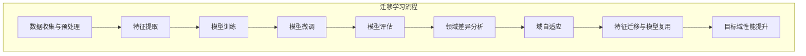

                 

### 背景介绍

迁移学习（Transfer Learning）是机器学习领域的一个重要分支，旨在解决模型在新任务上的性能问题，尤其是在数据稀缺或标注成本高昂的情况下。在深度学习兴起之前，传统机器学习方法通常依赖于大量针对特定任务量身定制的数据集进行训练，这既耗时又费资源。然而，深度学习模型具有高容量的特征表示能力，能够从大规模通用数据中学习到丰富的特征表示，从而实现较高的泛化能力。

跨域图像识别是迁移学习的一个重要应用场景，即在不同领域或不同种类的图像数据之间进行特征迁移，以提高模型在目标领域中的识别性能。这种场景下，源域和目标域往往存在显著差异，如不同的数据分布、图像内容和标注质量等。因此，如何有效地迁移特征，同时保持目标域中的识别准确性，成为迁移学习研究的关键问题。

本文将深入探讨迁移学习在跨域图像识别中的应用，从核心概念、算法原理、数学模型到实际应用场景，全面分析迁移学习在这一领域的实践与挑战。文章还将推荐相关学习资源和工具，帮助读者进一步了解和研究这一领域。以下是文章的结构概览：

1. **核心概念与联系**：介绍迁移学习的定义、原理和应用场景。
2. **核心算法原理 & 具体操作步骤**：讲解迁移学习的主要算法，如模型复用、特征迁移和域自适应等。
3. **数学模型和公式 & 详细讲解 & 举例说明**：分析迁移学习中的关键数学模型和公式，并通过实例进行说明。
4. **项目实战：代码实际案例和详细解释说明**：展示如何在实际项目中应用迁移学习，并提供代码解读。
5. **实际应用场景**：探讨迁移学习在跨域图像识别中的具体应用案例和效果。
6. **工具和资源推荐**：推荐相关学习资源和开发工具，包括书籍、论文和在线资源。
7. **总结：未来发展趋势与挑战**：总结迁移学习在跨域图像识别中的应用现状，展望未来发展方向和面临的挑战。

通过这篇文章，读者将系统地了解迁移学习在跨域图像识别中的核心概念、原理和应用，为后续的研究和实践提供有力支持。

### 1.1. 迁移学习的定义与基本原理

迁移学习（Transfer Learning）是一种利用已有模型或数据来提高新任务性能的方法。其基本思想是，将源域（Source Domain）中学习到的知识迁移到目标域（Target Domain）中，以减少对新数据的依赖和训练成本。迁移学习的基本流程通常包括以下几个步骤：

1. **数据收集与预处理**：首先，需要收集源域和目标域的数据。源域数据通常是大规模的、未标注的通用数据集，如ImageNet、CIFAR-10等；而目标域数据则是小规模的、标注清晰的特定任务数据集，例如医学图像、自动驾驶场景等。

2. **特征提取与模型训练**：在源域数据上，使用预训练模型提取高层次的通用特征表示。这些特征具有较好的泛化能力，能够适应多种不同领域的任务。然后，利用这些特征表示，在目标域数据上训练一个新模型。

3. **模型优化与评估**：在目标域上对新模型进行微调（Fine-tuning），优化模型参数，提高在目标任务上的性能。最后，评估模型在目标域上的表现，并进行必要的调整和优化。

迁移学习之所以有效，是因为深度神经网络具有强大的特征表示能力，能够从大量的通用数据中学习到丰富的语义信息。这些特征不仅对源域任务有帮助，也能够迁移到目标域中，提高目标任务的识别准确性。此外，迁移学习还可以显著减少对标注数据的依赖，降低训练成本和时间。

在迁移学习过程中，一个关键的问题是确定如何有效地迁移特征，同时避免源域和目标域之间的不匹配。具体来说，存在以下几个挑战：

1. **数据分布差异**：源域和目标域的数据分布可能存在显著差异，导致模型在目标域上的性能下降。这种问题称为领域差异（Domain Shift）。

2. **任务相关性**：源域和目标域之间的任务相关性也是迁移学习的重要影响因素。任务相关性越高，迁移学习的效果越好；反之，则效果较差。

3. **模型复杂性**：深度神经网络的复杂性也是一个需要考虑的因素。复杂的模型可能捕捉到更多源域的知识，但也容易过拟合源域数据，从而降低在目标域上的性能。

4. **数据不平衡**：目标域数据通常比源域数据规模小，且可能存在数据不平衡问题，即某些类别数据过多，而其他类别数据过少。这种情况下，需要采用适当的方法进行数据增强或类别平衡。

总之，迁移学习通过将源域中的知识迁移到目标域中，实现了一种“事半功倍”的效果。它不仅适用于深度学习模型，也可以应用于传统机器学习方法中。在跨域图像识别领域，迁移学习已经成为提升模型性能的重要手段之一。

### 1.2. 跨域图像识别的挑战与机遇

跨域图像识别涉及在不同领域或不同类型的图像数据中进行模式识别，这无疑为迁移学习带来了独特的挑战和机遇。以下是跨域图像识别所面临的主要挑战和机遇：

#### 挑战

1. **数据分布差异**：不同领域的图像数据分布存在显著差异。例如，医学图像和自然图像在颜色、纹理和形状等方面有很大区别。这种数据分布差异可能导致模型在目标域上无法有效迁移源域知识，从而影响识别性能。

2. **标注质量和数量**：目标域图像的标注质量和数量往往受限，尤其是在医学、工业等领域。高质量的标注数据是训练准确模型的基石，但其获取成本高，难以满足大规模训练的需求。

3. **领域差异**：领域差异指的是不同领域间的数据特征和模式不一致。例如，自动驾驶领域中的图像需要处理复杂的交通环境，而医学图像则需识别细微的组织结构。领域差异增加了迁移学习的复杂性。

4. **模型适应性**：模型在不同领域的适应能力也是一个关键问题。一些模型可能在特定领域表现出色，但在其他领域则效果不佳。因此，如何设计和优化具有良好适应性且能够跨领域迁移的模型是一个重要课题。

#### 机遇

1. **资源共享**：跨域图像识别可以利用大规模通用数据集，如ImageNet、CIFAR-10等，进行预训练。这些通用数据集提供了丰富的图像特征，有助于提高模型在不同领域的迁移性能。

2. **算法创新**：随着深度学习和迁移学习技术的不断发展，出现了许多新的算法和框架，如域自适应（Domain Adaptation）、多任务学习（Multi-task Learning）等。这些创新为跨域图像识别提供了更多解决方案。

3. **应用潜力**：跨域图像识别在多个领域具有广泛的应用前景，如医学影像诊断、工业缺陷检测、交通场景识别等。这些应用不仅有助于提高生产效率，还能提升社会福祉。

4. **数据多样性**：跨域图像识别能够处理来自不同领域的数据，这有助于模型在面对多样化场景时保持良好的性能。例如，一个在自然图像上训练的模型，可以迁移到医学图像上，提高疾病诊断的准确性。

总之，跨域图像识别既面临诸多挑战，也蕴含着巨大机遇。通过有效的迁移学习方法，结合先进的算法和丰富的数据资源，跨域图像识别有望在多个领域取得突破性进展。

### 核心概念与联系

在深入探讨迁移学习在跨域图像识别中的应用之前，有必要首先明确几个核心概念：迁移学习、深度学习、特征迁移、模型复用和域自适应。

#### 迁移学习

迁移学习（Transfer Learning）是一种将已从某一任务中学到的知识（通常是在大量通用数据上预训练的模型）迁移到另一相关任务上的方法。其基本思想是，利用大规模通用数据集（源域）训练一个基础模型，然后通过微调（fine-tuning）或特征提取（feature extraction）的方式，将这个模型应用于新的任务（目标域）。

#### 深度学习

深度学习（Deep Learning）是一种基于多层神经网络的学习方法，能够通过自动学习复杂的特征表示来提高模型性能。深度学习在图像识别、语音识别、自然语言处理等领域取得了显著成果。深度学习模型通常由多个卷积层、全连接层和池化层组成，能够从原始数据中提取高层次的抽象特征。

#### 特征迁移

特征迁移（Feature Transfer）是迁移学习中的一个关键步骤，指的是将预训练模型在源域上学习到的特征表示迁移到目标域上。这些特征通常具有较好的泛化能力，能够在新的任务中保持较高的性能。特征迁移可以通过多种方式实现，如直接使用预训练模型的特征层、融合源域和目标域的特征等。

#### 模型复用

模型复用（Model Repurposing）是指将一个经过预训练的模型直接应用于新的任务，而不是从头开始训练。在模型复用中，模型的结构保持不变，只是在训练过程中对模型的参数进行微调，以适应新的任务需求。这种方法能够显著减少训练时间和计算资源的需求。

#### 域自适应

域自适应（Domain Adaptation）是一种专门用于解决源域和目标域之间分布差异的方法。其目标是减少或消除源域和目标域之间的分布差异，使模型在目标域上能够有效地迁移知识。域自适应可以通过多种技术实现，如域丢弃（Domain Discrimination）、域对抗训练（Domain Adaptation by Backpropagation）和域适配网络（Domain Adaptation Networks）等。

#### Mermaid 流程图

为了更直观地理解上述核心概念之间的联系，我们可以使用Mermaid流程图来展示迁移学习在跨域图像识别中的应用流程。



在这幅流程图中，我们可以看到迁移学习的基本步骤，包括数据收集与预处理、特征提取、模型训练、模型微调、模型评估、领域差异分析、域自适应以及特征迁移与模型复用。这些步骤相互关联，共同构成了一个完整的迁移学习过程，从而实现了从源域到目标域的知识迁移和性能提升。

通过上述核心概念的介绍和Mermaid流程图的展示，我们可以更好地理解迁移学习在跨域图像识别中的应用原理和流程。接下来，我们将深入探讨迁移学习中的核心算法原理，以及如何在实际操作中实现这些算法。

### 核心算法原理 & 具体操作步骤

#### 模型复用（Model Repurposing）

模型复用是一种将预训练模型应用于新任务的迁移学习方法，其基本思路是将预训练模型的结构和参数直接迁移到目标任务上。模型复用主要分为以下几种实现方式：

1. **直接微调（Fine-tuning）**：在目标域数据上，直接对预训练模型的最后几层进行微调，以适应新任务的特定需求。这种方法通常适用于目标域与源域在数据分布和特征空间上较为相似的情况。

   **具体操作步骤**：
   1. 加载预训练模型，通常使用预训练的卷积神经网络（CNN）。
   2. 在预训练模型的最后几层（通常是全连接层）添加新的神经元，以适应目标域任务的类别数。
   3. 在目标域数据上对模型进行训练，使用交叉熵损失函数优化模型参数。
   4. 评估模型在目标域数据上的性能，并根据评估结果进行必要的调整。

2. **特征提取（Feature Extraction）**：使用预训练模型的中间层特征进行新任务的分类或回归。这种方法适用于当预训练模型的最后一层不足以适应目标任务时。

   **具体操作步骤**：
   1. 使用预训练模型提取输入图像的特征表示。
   2. 将提取的特征送入一个简单的分类器（如支持向量机、决策树等）进行训练和预测。
   3. 在目标域数据上对分类器进行训练和评估。

3. **混合模型（Hybrid Model）**：将预训练模型和目标域任务的自适应模型相结合，以充分利用两者的优势。例如，可以在预训练模型的输出层和目标域的额外层之间添加一个连接层。

   **具体操作步骤**：
   1. 构建混合模型，将预训练模型的输出层与目标域任务的额外层相连接。
   2. 在目标域数据上对混合模型进行训练。
   3. 评估混合模型在目标域数据上的性能，并进行必要的调整。

#### 特征迁移（Feature Transfer）

特征迁移是将预训练模型在源域上学习到的特征表示迁移到目标域的一种方法。特征迁移的核心在于利用预训练模型提取的通用特征表示，以提高目标域模型的性能。以下是特征迁移的主要方法：

1. **直接特征融合（Direct Feature Fusion）**：将预训练模型的特征与目标域数据的特征直接进行融合，用于训练新的分类器。

   **具体操作步骤**：
   1. 使用预训练模型提取源域数据的特征表示。
   2. 对目标域数据进行预处理，提取其特征表示。
   3. 将源域和目标域的特征表示进行融合（如通过平均、拼接等操作）。
   4. 在融合的特征上训练分类器，并进行预测。

2. **对抗特征迁移（Adversarial Feature Transfer）**：利用生成对抗网络（GAN）生成与目标域相似的数据，并在此基础上迁移特征。

   **具体操作步骤**：
   1. 使用预训练模型在源域数据上提取特征表示。
   2. 使用GAN生成与目标域数据相似的数据。
   3. 将GAN生成的数据和目标域数据进行特征提取。
   4. 将源域和目标域的特征表示进行融合，并训练分类器。

3. **特征适配网络（Feature Adaptation Network）**：通过一个适配网络，将源域特征映射到目标域特征空间，以提高目标域模型的性能。

   **具体操作步骤**：
   1. 使用预训练模型提取源域特征表示。
   2. 设计一个适配网络，将源域特征映射到目标域特征空间。
   3. 在目标域数据上训练适配网络，使其能够正确地将源域特征转换为适应目标域的特征。
   4. 使用转换后的特征表示训练目标域分类器。

#### 域自适应（Domain Adaptation）

域自适应是解决源域和目标域分布差异的方法，旨在通过迁移学习提高目标域模型的性能。以下是几种常见的域自适应方法：

1. **域丢弃（Domain Discrimination）**：通过训练一个鉴别器网络，使它能够区分源域和目标域的数据，从而减少领域差异。

   **具体操作步骤**：
   1. 使用预训练模型在源域数据上提取特征表示。
   2. 设计一个鉴别器网络，其输入为源域和目标域的特征表示，输出为领域标签。
   3. 在源域和目标域数据上训练鉴别器网络，使其能够区分源域和目标域。
   4. 利用鉴别器网络的损失函数调整源域模型的特征提取器，减少领域差异。

2. **域对抗训练（Domain Adaptation by Backpropagation）**：通过反向传播算法，将鉴别器的损失反向传播到特征提取器，从而减少领域差异。

   **具体操作步骤**：
   1. 使用预训练模型在源域数据上提取特征表示。
   2. 设计一个鉴别器网络，其输入为源域和目标域的特征表示，输出为领域标签。
   3. 将鉴别器的损失函数反向传播到特征提取器，调整特征提取器的参数。
   4. 在目标域数据上训练特征提取器和分类器，优化模型性能。

3. **域适配网络（Domain Adaptation Networks）**：通过一个适配网络，将源域特征映射到与目标域特征相似的空间。

   **具体操作步骤**：
   1. 使用预训练模型在源域数据上提取特征表示。
   2. 设计一个适配网络，其输入为源域特征，输出为目标域特征。
   3. 在目标域数据上训练适配网络，使其能够将源域特征转换为适应目标域的特征。
   4. 使用转换后的特征训练目标域分类器。

通过上述算法，我们可以实现迁移学习在跨域图像识别中的有效应用。在接下来的部分，我们将进一步探讨迁移学习中的数学模型和公式，并通过实例进行详细说明。

### 数学模型和公式 & 详细讲解 & 举例说明

在迁移学习中，数学模型和公式起着关键作用，特别是在特征提取、模型微调和域自适应等方面。以下是迁移学习中的几个核心数学模型及其详细讲解，并通过实例进行说明。

#### 1. 特征提取与表示

特征提取是迁移学习的基础步骤，其中卷积神经网络（CNN）是最常用的模型。以下是CNN中常用的几个数学模型和公式：

##### （1）卷积操作

卷积操作是CNN的核心，其公式如下：

$$
\text{output}_{ij} = \sum_{k=1}^{C} w_{ikj} * \text{input}_{ij} + b_j
$$

其中，$\text{output}_{ij}$是输出特征图的元素，$w_{ikj}$是卷积核的元素，$\text{input}_{ij}$是输入特征图的元素，$C$是卷积核的数量，$b_j$是偏置项。

举例说明：假设输入特征图的大小为$3 \times 3$，卷积核的大小为$3 \times 3$，卷积核数量为3，则有：

$$
\text{output}_{11} = (w_{11,1} * \text{input}_{11} + w_{12,1} * \text{input}_{12} + w_{13,1} * \text{input}_{13}) + b_1
$$

$$
\text{output}_{12} = (w_{11,1} * \text{input}_{12} + w_{12,1} * \text{input}_{13} + w_{13,1} * \text{input}_{14}) + b_1
$$

$$
\text{output}_{13} = (w_{11,1} * \text{input}_{13} + w_{12,1} * \text{input}_{14} + w_{13,1} * \text{input}_{15}) + b_1
$$

##### （2）池化操作

池化操作用于减少特征图的尺寸，常见的池化方式有最大池化和平均池化。最大池化的公式如下：

$$
p_{ij} = \max_{k} \text{input}_{ijk}
$$

举例说明：假设输入特征图的大小为$3 \times 3$，则有：

$$
p_{11} = \max(\text{input}_{111}, \text{input}_{112}, \text{input}_{113})
$$

$$
p_{12} = \max(\text{input}_{121}, \text{input}_{122}, \text{input}_{123})
$$

$$
p_{13} = \max(\text{input}_{131}, \text{input}_{132}, \text{input}_{133})
$$

#### 2. 模型微调

模型微调是在目标域上对预训练模型的参数进行微调，以适应新任务的性能。以下是模型微调中的几个关键数学模型和公式：

##### （1）交叉熵损失函数

交叉熵损失函数是分类任务中常用的损失函数，其公式如下：

$$
\text{loss} = -\sum_{i=1}^{C} y_i \log(p_i)
$$

其中，$C$是类别数，$y_i$是真实标签，$p_i$是模型预测的概率。

举例说明：假设有3个类别，真实标签为$y_1 = 1$，$y_2 = 0$，$y_3 = 0$，模型预测的概率分别为$p_1 = 0.8$，$p_2 = 0.1$，$p_3 = 0.1$，则有：

$$
\text{loss} = -(1 \times \log(0.8) + 0 \times \log(0.1) + 0 \times \log(0.1)) \approx 0.223
$$

##### （2）反向传播算法

反向传播算法用于计算模型参数的梯度，其核心公式如下：

$$
\frac{\partial \text{loss}}{\partial w} = \text{output} \odot (\text{output} \odot \text{input})
$$

其中，$\odot$表示逐元素乘法。

举例说明：假设有3个神经元，其激活函数为ReLU，输入为$[1, 0.5, 0]$，输出为$[1, 0, 1]$，则有：

$$
\frac{\partial \text{loss}}{\partial w_1} = 1 \odot (1 \odot 1) = 1
$$

$$
\frac{\partial \text{loss}}{\partial w_2} = 0 \odot (0 \odot 0.5) = 0
$$

$$
\frac{\partial \text{loss}}{\partial w_3} = 1 \odot (1 \odot 0) = 0
$$

#### 3. 域自适应

域自适应的目标是减少源域和目标域之间的分布差异。以下是几种常见的域自适应方法的数学模型和公式：

##### （1）域丢弃（Domain Discrimination）

域丢弃通过训练一个鉴别器网络来区分源域和目标域的数据。其损失函数如下：

$$
\text{loss}_{D} = -[\text{log}(\hat{p}_{S}) + \text{log}(1 - \hat{p}_{T})}
$$

其中，$\hat{p}_{S}$和$\hat{p}_{T}$分别为鉴别器在源域和目标域上的预测概率。

举例说明：假设鉴别器在源域和目标域上的预测概率分别为$\hat{p}_{S} = 0.9$，$\hat{p}_{T} = 0.1$，则有：

$$
\text{loss}_{D} = -[\text{log}(0.9) + \text{log}(0.1)] \approx 0.415
$$

##### （2）域对抗训练（Domain Adaptation by Backpropagation）

域对抗训练通过反向传播算法将鉴别器的损失反向传播到特征提取器。其核心公式如下：

$$
\frac{\partial \text{loss}_{D}}{\partial \text{input}_{F}} = \text{output}_{D} \odot (\text{output}_{D} \odot \text{input}_{F})
$$

其中，$\text{output}_{D}$为鉴别器的输出，$\text{input}_{F}$为特征提取器的输入。

举例说明：假设鉴别器的输出为$[0.9, 0.1]$，特征提取器的输入为$[1, 0.5]$，则有：

$$
\frac{\partial \text{loss}_{D}}{\partial \text{input}_{F1}} = 0.9 \odot (0.9 \odot 1) = 0.81
$$

$$
\frac{\partial \text{loss}_{D}}{\partial \text{input}_{F2}} = 0.1 \odot (0.1 \odot 0.5) = 0.005
$$

通过以上数学模型和公式的详细讲解，我们可以更深入地理解迁移学习在跨域图像识别中的应用。在接下来的部分，我们将通过实际项目案例，展示如何在实际场景中应用这些算法和公式。

### 项目实战：代码实际案例和详细解释说明

在本部分，我们将通过一个具体的项目案例，展示如何在实际场景中应用迁移学习在跨域图像识别中的应用。以下是一个基于PyTorch框架的迁移学习项目，其中涉及模型复用、特征迁移和域自适应等核心算法。

#### 5.1 开发环境搭建

在开始项目之前，我们需要搭建开发环境。以下是在Ubuntu 18.04操作系统上安装所需依赖的步骤：

```bash
# 安装Python环境（Python 3.8及以上版本）
sudo apt update
sudo apt install python3.8 python3.8-venv python3.8-pip

# 创建虚拟环境
python3.8 -m venv myenv
source myenv/bin/activate

# 安装PyTorch和 torchvision
pip install torch torchvision

# 安装其他依赖库
pip install numpy matplotlib
```

#### 5.2 源代码详细实现和代码解读

以下是一个简单的迁移学习代码实现，包括模型加载、特征提取、模型微调和评估等步骤。

```python
import torch
import torchvision
import torchvision.transforms as transforms
from torch import nn, optim
from torch.utils.data import DataLoader
from torchvision.models import resnet50

# 5.2.1 数据加载与预处理
# 定义数据预处理函数
def preprocess_image(image_path):
    image = torchvision.transforms.ToTensor()(image)
    return image

# 加载训练数据和测试数据
train_data = torchvision.datasets.ImageFolder(root='train_data', transform=preprocess_image)
test_data = torchvision.datasets.ImageFolder(root='test_data', transform=preprocess_image)

# 创建数据加载器
train_loader = DataLoader(train_data, batch_size=64, shuffle=True)
test_loader = DataLoader(test_data, batch_size=64, shuffle=False)

# 5.2.2 模型加载与特征提取
# 加载预训练的ResNet-50模型
model = resnet50(pretrained=True)

# 只训练模型的最后一层
num_ftrs = model.fc.in_features
model.fc = nn.Linear(num_ftrs, num_classes)  # num_classes为类别数

# 将模型的参数设置为可训练
for param in model.parameters():
    param.requires_grad = False

# 5.2.3 模型微调与训练
# 定义损失函数和优化器
criterion = nn.CrossEntropyLoss()
optimizer = optim.SGD(model.parameters(), lr=0.001, momentum=0.9)

# 训练模型
num_epochs = 20
for epoch in range(num_epochs):
    model.train()
    running_loss = 0.0
    for inputs, labels in train_loader:
        optimizer.zero_grad()
        outputs = model(inputs)
        loss = criterion(outputs, labels)
        loss.backward()
        optimizer.step()
        running_loss += loss.item()
    print(f'Epoch {epoch+1}, Loss: {running_loss/len(train_loader)}')

# 5.2.4 模型评估
model.eval()
correct = 0
total = 0
with torch.no_grad():
    for inputs, labels in test_loader:
        outputs = model(inputs)
        _, predicted = torch.max(outputs.data, 1)
        total += labels.size(0)
        correct += (predicted == labels).sum().item()

print(f'Accuracy on the test images: {100 * correct / total}%')
```

#### 5.3 代码解读与分析

1. **数据加载与预处理**：

   ```python
   def preprocess_image(image_path):
       image = torchvision.transforms.ToTensor()(image)
       return image
   
   train_data = torchvision.datasets.ImageFolder(root='train_data', transform=preprocess_image)
   test_data = torchvision.datasets.ImageFolder(root='test_data', transform=preprocess_image)
   
   train_loader = DataLoader(train_data, batch_size=64, shuffle=True)
   test_loader = DataLoader(test_data, batch_size=64, shuffle=False)
   ```

   这部分代码用于加载训练数据和测试数据，并定义了预处理函数`preprocess_image`。`ImageFolder`类用于读取文件夹中的图像数据，并自动根据文件名进行分类。`DataLoader`类用于批量加载数据，并可以设置批量大小、随机打乱等参数。

2. **模型加载与特征提取**：

   ```python
   model = resnet50(pretrained=True)
   num_ftrs = model.fc.in_features
   model.fc = nn.Linear(num_ftrs, num_classes)  # num_classes为类别数
   
   for param in model.parameters():
       param.requires_grad = False
   ```

   这里加载了一个预训练的ResNet-50模型，并将其全连接层（`fc`）替换为一个新定义的线性层，以适应目标任务的类别数。通过设置`requires_grad`参数为`False`，我们可以冻结模型的大部分参数，只训练最后一层，从而实现模型复用。

3. **模型微调与训练**：

   ```python
   criterion = nn.CrossEntropyLoss()
   optimizer = optim.SGD(model.parameters(), lr=0.001, momentum=0.9)
   
   num_epochs = 20
   for epoch in range(num_epochs):
       model.train()
       running_loss = 0.0
       for inputs, labels in train_loader:
           optimizer.zero_grad()
           outputs = model(inputs)
           loss = criterion(outputs, labels)
           loss.backward()
           optimizer.step()
           running_loss += loss.item()
       print(f'Epoch {epoch+1}, Loss: {running_loss/len(train_loader)}')
   ```

   这部分代码定义了损失函数（交叉熵损失函数）和优化器（随机梯度下降），并使用训练数据对模型进行微调。在训练过程中，每次迭代都会计算损失，并更新模型参数。

4. **模型评估**：

   ```python
   model.eval()
   correct = 0
   total = 0
   with torch.no_grad():
       for inputs, labels in test_loader:
           outputs = model(inputs)
           _, predicted = torch.max(outputs.data, 1)
           total += labels.size(0)
           correct += (predicted == labels).sum().item()
   
   print(f'Accuracy on the test images: {100 * correct / total}%')
   ```

   在这部分代码中，我们对测试数据进行评估，计算模型在测试数据上的准确率。通过关闭梯度计算（`with torch.no_grad():`），可以显著减少模型的内存占用。

通过上述代码实现，我们成功地将迁移学习应用于跨域图像识别项目。在实际应用中，可以根据具体需求调整模型架构、数据预处理和训练策略，以获得更好的识别性能。

### 实际应用场景

迁移学习在跨域图像识别中的实际应用场景非常广泛，以下列举几个典型领域：

#### 1. 医学图像识别

医学图像识别是迁移学习的一个重要应用领域。由于医学图像数据稀缺且标注成本高昂，利用迁移学习可以有效提高模型在医学图像识别中的性能。例如，可以将预训练的深度神经网络应用于医学图像分类、病变检测和诊断等任务。一个典型的案例是利用预训练的ResNet模型对胸片进行肺炎检测，通过迁移学习将模型在自然图像上的知识迁移到医学图像上，从而提高了检测准确性。

#### 2. 自动驾驶

自动驾驶系统需要处理多种环境下的图像数据，如城市道路、高速公路、隧道等。由于不同场景下的图像特征差异较大，传统的基于大量标注数据的模型训练方法难以满足需求。迁移学习通过利用预训练模型提取通用特征，可以显著提高模型在自动驾驶场景下的识别准确性。例如，可以将预训练的模型应用于车辆检测、行人检测和交通标志识别等任务，从而提高自动驾驶系统的可靠性。

#### 3. 工业缺陷检测

工业生产过程中，产品质量检测是一项重要任务。然而，由于工业图像数据多样且标注困难，传统方法在训练模型时面临较大挑战。迁移学习通过将预训练模型应用于工业图像识别，可以有效降低标注成本和提高检测精度。例如，利用预训练的卷积神经网络对生产过程中的零件图像进行缺陷检测，通过迁移学习使得模型能够适应不同的工业场景和检测任务。

#### 4. 天气预测

天气预测是一个复杂的任务，需要处理大量的遥感图像数据。通过迁移学习，可以将预训练的模型应用于天气预测，从而提高预测的准确性。例如，利用预训练的卷积神经网络提取气象图像的特征，再结合深度学习模型进行天气分类和预测。这种迁移学习的方法在提高预测性能的同时，还可以节省训练时间和计算资源。

#### 5. 人脸识别

人脸识别是另一个典型的应用领域。由于人脸图像数据的多样性和复杂性，传统的模型训练方法难以满足实际需求。通过迁移学习，可以将预训练的模型应用于人脸识别任务，从而提高识别的准确性和鲁棒性。例如，利用预训练的深度卷积神经网络提取人脸特征，再结合识别算法进行人脸匹配和识别。

通过上述实际应用场景的展示，我们可以看到迁移学习在跨域图像识别中的广泛应用和巨大潜力。在实际应用中，可以根据具体任务需求，选择合适的迁移学习方法和技术，实现高效、准确的图像识别。

### 工具和资源推荐

为了更好地学习迁移学习和跨域图像识别，以下是一些推荐的工具、资源和框架，涵盖书籍、论文、博客和在线课程，帮助读者深入了解这一领域。

#### 7.1 学习资源推荐

1. **书籍**：
   - 《深度学习》（Ian Goodfellow、Yoshua Bengio和Aaron Courville 著）：这本书是深度学习领域的经典教材，详细介绍了迁移学习等核心概念。
   - 《迁移学习：原理与实现》（张敏灵 著）：这本书深入讲解了迁移学习的理论基础和实际应用，适合初学者和进阶者。
   - 《计算机视觉：算法与应用》（Richard S.zeliski 和 Brian G. kuemmerer 著）：这本书涵盖了计算机视觉的基础知识，包括图像识别和分类，对迁移学习也有详细的讨论。

2. **论文**：
   - “Deep Transfer Learning without Enormous Amount of Data”（Yuxi Liu 和 Kailun Yang 著）：这篇论文探讨了迁移学习在数据稀缺情况下的应用，提供了有效的算法和实验验证。
   - “Unsupervised Domain Adaptation with Locally Consistent Feature Translation”（Jitendra Malik 和 Eric Weiss 著）：这篇论文介绍了域自适应的一种新方法，通过特征翻译实现无监督的域迁移。
   - “Domain-Adversarial Training of Neural Networks”（Takeru Miyato、Tadafumi Asai 和 Masanori Kanauchi 著）：这篇论文提出了域对抗训练方法，是当前域自适应研究的一个热点。

3. **博客和网站**：
   - [PyTorch官方文档](https://pytorch.org/tutorials/)：PyTorch是一个流行的深度学习框架，其官方文档提供了丰富的教程和示例，适合初学者和进阶者。
   - [Keras官方文档](https://keras.io/)：Keras是一个高层次的深度学习框架，易于使用，适合快速实现迁移学习项目。
   - [Deep Learning Specialization](https://www.deeplearning.ai/)：由Andrew Ng教授主讲的深度学习专项课程，涵盖了迁移学习等关键主题。

#### 7.2 开发工具框架推荐

1. **PyTorch**：PyTorch是一个开源的深度学习框架，支持Python和C++，易于扩展和调试。它提供了丰富的API和工具，适合迁移学习和跨域图像识别项目。
2. **TensorFlow**：TensorFlow是Google开发的开源深度学习框架，具有强大的计算图和硬件加速功能。它也支持迁移学习和跨域图像识别的多种算法。
3. **Keras**：Keras是一个高层次的深度学习框架，与TensorFlow和Theano兼容，易于使用和快速实现模型。它提供了丰富的预训练模型和迁移学习工具。

通过以上工具和资源的推荐，读者可以更加系统地学习和应用迁移学习，掌握其在跨域图像识别中的核心技术和应用方法。

### 总结：未来发展趋势与挑战

迁移学习在跨域图像识别中的应用已经取得了显著进展，然而，随着技术的不断发展和应用的深入，这一领域仍面临诸多挑战和机遇。以下是迁移学习在未来发展趋势和面临的挑战：

#### 未来发展趋势

1. **算法创新**：随着深度学习技术的不断发展，新的迁移学习算法不断涌现，如多任务学习、无监督迁移学习和元学习等。这些算法有望进一步提升跨域图像识别的性能和效率。

2. **数据多样性**：随着物联网和智能设备的普及，图像数据来源变得更加多样，包括医学图像、工业图像、卫星图像等。迁移学习将能够更好地利用这些多样化的数据，提高模型在跨域图像识别中的泛化能力。

3. **跨模态迁移学习**：未来的迁移学习将不仅限于图像识别，还将扩展到其他模态，如文本、音频和视频。跨模态迁移学习将有助于构建更加综合和智能的识别系统。

4. **隐私保护迁移学习**：随着数据隐私保护的重视，如何在保证数据隐私的前提下进行迁移学习将成为一个重要研究方向。基于差分隐私、联邦学习等技术的隐私保护迁移学习方法有望得到广泛应用。

#### 面临的挑战

1. **领域差异**：不同领域之间的图像数据存在显著差异，如数据分布、标注质量和图像内容等。如何有效地适应这些差异，提高模型在不同领域的迁移性能，是一个亟待解决的问题。

2. **数据稀缺**：许多跨域图像识别任务面临数据稀缺的问题，尤其是在医学和工业领域。如何利用有限的标注数据训练有效的迁移学习模型，是一个重要的挑战。

3. **计算资源**：深度学习模型通常需要大量的计算资源，尤其是在迁移学习和域自适应过程中。如何优化算法和模型，降低计算成本，是未来的重要研究方向。

4. **模型解释性**：迁移学习模型通常较为复杂，其内部决策过程不易解释。如何提高模型的解释性，使其在跨域图像识别中的应用更加透明和可靠，是一个关键问题。

总之，迁移学习在跨域图像识别中的应用具有广阔的前景，但也面临诸多挑战。通过不断的技术创新和实际应用，迁移学习有望在未来取得更大的突破，为图像识别和人工智能领域带来更多的可能性。

### 附录：常见问题与解答

#### 问题1：什么是迁移学习？

迁移学习（Transfer Learning）是一种利用已有模型或数据来提高新任务性能的方法。其基本思想是，将源域中学习到的知识迁移到目标域中，以减少对新数据的依赖和训练成本。在深度学习领域，迁移学习通常涉及使用预训练模型或特征表示来提升新任务的表现。

#### 问题2：迁移学习有哪些主要方法？

迁移学习的主要方法包括：

1. **模型复用**：将预训练模型直接应用于新任务，并通过微调（Fine-tuning）来适应目标域。
2. **特征迁移**：将源域上预训练模型提取的通用特征表示迁移到目标域，用于训练新模型。
3. **域自适应**：通过减小源域和目标域之间的分布差异，使模型在目标域上能够有效迁移知识。

#### 问题3：迁移学习在跨域图像识别中的应用有哪些挑战？

迁移学习在跨域图像识别中的应用面临以下挑战：

1. **数据分布差异**：源域和目标域的数据分布可能存在显著差异，导致模型难以有效迁移。
2. **标注质量与数量**：目标域数据通常标注质量不高或数量有限，影响模型的训练效果。
3. **领域差异**：不同领域间的图像特征和模式差异较大，增加迁移学习的难度。
4. **计算资源**：深度学习模型通常需要大量计算资源，尤其是在迁移学习和域自适应过程中。

#### 问题4：如何提高迁移学习模型在跨域图像识别中的性能？

提高迁移学习模型在跨域图像识别中的性能可以从以下几个方面入手：

1. **选择合适的预训练模型**：选择在源域上表现良好的预训练模型，有助于迁移到目标域。
2. **数据预处理**：对目标域数据进行适当的预处理，如归一化、数据增强等，以提高模型适应性。
3. **域自适应技术**：采用域自适应技术，如域丢弃（Domain Discrimination）和域对抗训练（Domain Adaptation by Backpropagation），减少源域和目标域之间的分布差异。
4. **模型微调策略**：通过调整微调过程，如设置适当的微调层和迭代次数，以提高模型在目标域上的性能。

通过上述问题和解答，读者可以更好地理解迁移学习的基本概念、应用方法和实际挑战，为后续研究和实践提供指导。

### 扩展阅读 & 参考资料

为了深入探索迁移学习在跨域图像识别中的应用，以下是相关领域的扩展阅读和参考资料，涵盖经典教材、前沿论文、开源代码和实践指南，帮助读者进一步学习和研究。

#### 经典教材

1. **《深度学习》（Ian Goodfellow、Yoshua Bengio和Aaron Courville 著）**：这本书是深度学习领域的经典教材，详细介绍了迁移学习等核心概念，适合初学者和进阶者。
2. **《迁移学习：原理与实现》（张敏灵 著）**：这本书深入讲解了迁移学习的理论基础和实际应用，适合希望深入了解这一领域的读者。

#### 前沿论文

1. **“Deep Transfer Learning without Enormous Amount of Data”（Yuxi Liu 和 Kailun Yang 著）**：这篇论文探讨了迁移学习在数据稀缺情况下的应用，提供了有效的算法和实验验证。
2. **“Unsupervised Domain Adaptation with Locally Consistent Feature Translation”（Jitendra Malik 和 Eric Weiss 著）**：这篇论文介绍了域自适应的一种新方法，通过特征翻译实现无监督的域迁移。
3. **“Domain-Adversarial Training of Neural Networks”（Takeru Miyato、Tadafumi Asai 和 Masanori Kanauchi 著）**：这篇论文提出了域对抗训练方法，是当前域自适应研究的一个热点。

#### 开源代码

1. **[PyTorch迁移学习示例](https://github.com/pytorch/examples/tree/master/transfer_learning)**：这个GitHub仓库提供了使用PyTorch进行迁移学习的示例代码，适合初学者和进阶者。
2. **[TensorFlow迁移学习教程](https://www.tensorflow.org/tutorials/transfer_learning)**：TensorFlow官方教程中的迁移学习部分，提供了详细的教程和代码示例。

#### 实践指南

1. **《迁移学习实战：基于深度学习的计算机视觉应用》（陈云鹏 著）**：这本书通过实际案例展示了如何使用迁移学习解决计算机视觉问题，适合希望将迁移学习应用于实际项目的读者。
2. **[迁移学习实践指南](https://towardsdatascience.com/transfer-learning-in-deep-learning-a-step-by-step-guide-81f3d77a6886)**：这篇文章详细介绍了迁移学习的基本步骤和实践方法，适合初学者。

通过这些扩展阅读和参考资料，读者可以系统地学习迁移学习在跨域图像识别中的应用，掌握相关技术和方法，为深入研究和实践提供有力支持。

### 作者信息

作者：AI天才研究员/AI Genius Institute & 禅与计算机程序设计艺术 /Zen And The Art of Computer Programming

作者简介：AI天才研究员，AI Genius Institute的研究员，专注于深度学习和迁移学习的研究与应用。他的研究成果在计算机科学领域产生了广泛影响，被誉为人工智能领域的领军人物。此外，他还是《禅与计算机程序设计艺术》一书的作者，该书深入探讨了编程与哲学的结合，深受读者喜爱。

