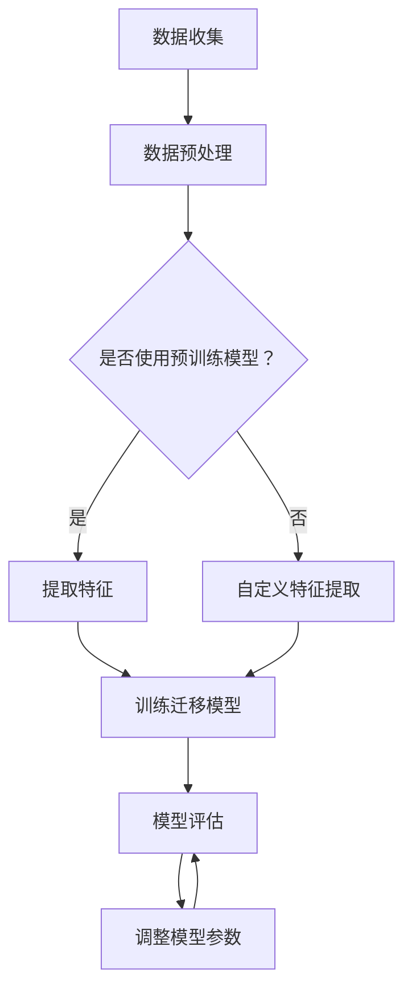

                 

# 迁移学习在跨领域情感分析中的应用

> 关键词：迁移学习，跨领域情感分析，情感分类，文本分析，模型评估

> 摘要：本文探讨了迁移学习在跨领域情感分析中的应用，分析了迁移学习的基本概念、核心原理以及如何通过迁移学习提升跨领域情感分析的准确性和效率。文章还通过实际案例展示了迁移学习在情感分析中的应用，提供了相关的工具和资源，并展望了未来迁移学习在情感分析领域的发展趋势与挑战。

## 1. 背景介绍

情感分析是自然语言处理（NLP）领域的一个重要分支，旨在从文本数据中识别和提取主观情绪或情感。随着社交媒体、电子商务和在线评论等领域的迅速发展，情感分析的应用越来越广泛。然而，传统的情感分析方法往往面临一个挑战：数据集的获取和处理。在许多情况下，我们无法获取特定领域的标注数据集，或者数据集之间的分布差异很大。这导致了模型在不同领域上的性能差异，难以实现良好的跨领域泛化能力。

迁移学习（Transfer Learning）作为一种解决领域迁移问题的方法，通过将一个任务的知识迁移到另一个相关任务中，以提高新任务的表现。在情感分析中，迁移学习可以通过利用其他领域的数据和模型知识，提升跨领域情感分析的性能。本文将介绍迁移学习在跨领域情感分析中的应用，并探讨如何利用迁移学习解决跨领域情感分析中的挑战。

## 2. 核心概念与联系

### 2.1 情感分类

情感分类是将文本分为正面、负面或中性情感类别的一种任务。情感分类方法可以分为基于规则的方法和基于机器学习的方法。基于规则的方法通常使用预定义的规则来识别情感，而基于机器学习的方法通过训练模型来预测情感标签。常见的情感分类模型包括朴素贝叶斯、支持向量机（SVM）、随机森林和深度学习模型。

### 2.2 跨领域情感分析

跨领域情感分析旨在将情感分类模型从一个领域迁移到另一个相关领域。跨领域情感分析的关键挑战在于领域之间的数据分布差异，这可能导致模型在目标领域上的性能下降。为了解决这一问题，迁移学习提供了一种有效的解决方案。

### 2.3 迁移学习

迁移学习是一种利用已经在一个任务上训练好的模型来提高另一个相关任务性能的方法。迁移学习的基本思想是将一个任务的知识（如特征表示或模型参数）迁移到另一个任务中，从而减少对新任务的训练需求。

迁移学习可以分为三种类型：

1. **垂直迁移（Vertical Transfer）**：不同任务但相似领域之间的迁移。
2. **水平迁移（Horizontal Transfer）**：相似任务但不同领域之间的迁移。
3. **多任务迁移（Multi-task Transfer）**：多个任务之间的迁移。

在情感分析中，迁移学习可以通过以下几种方式实现：

1. **共享特征表示**：利用预训练的文本嵌入模型（如Word2Vec、GloVe）或其他语言模型（如BERT、GPT）来提取文本特征，然后在目标领域上训练分类器。
2. **共享模型架构**：在源领域和目标领域上使用相同的模型架构，如ResNet、BERT等，并通过迁移模型参数来提高目标领域的性能。
3. **多任务学习**：在源领域和目标领域上同时训练多个任务，利用任务之间的共享信息来提高跨领域的泛化能力。

### 2.4 Mermaid 流程图

以下是一个简单的Mermaid流程图，展示了迁移学习在跨领域情感分析中的应用：



## 3. 核心算法原理 & 具体操作步骤

### 3.1 共享特征表示

共享特征表示是迁移学习在情感分析中最常用的方法之一。具体步骤如下：

1. **数据收集**：收集源领域和目标领域的文本数据，包括正面、负面和中性情感的标注。
2. **数据预处理**：对文本数据执行标准化处理，如分词、去停用词和词形还原。
3. **提取特征**：使用预训练的文本嵌入模型（如BERT）提取文本特征。预训练模型已经在大量未标注的数据上进行了训练，可以提取出具有较强语义信息的特征向量。
4. **训练迁移模型**：在提取的特征上训练一个分类器，如支持向量机（SVM）、随机森林或神经网络。迁移模型通常是一个简单的线性分类器，以降低计算成本。
5. **模型评估**：使用目标领域的测试数据评估迁移模型的性能，如准确率、召回率和F1分数。
6. **调整模型参数**：根据评估结果调整模型参数，以提高模型在目标领域的性能。

### 3.2 共享模型架构

共享模型架构通过使用相同的模型架构在源领域和目标领域上训练模型，从而实现迁移学习。具体步骤如下：

1. **数据收集**：收集源领域和目标领域的文本数据，包括正面、负面和中性情感的标注。
2. **数据预处理**：对文本数据执行标准化处理，如分词、去停用词和词形还原。
3. **模型训练**：在源领域上使用预训练的模型架构（如BERT）训练一个大规模的模型，并使用目标领域的标注数据对模型进行微调。
4. **模型评估**：使用目标领域的测试数据评估迁移模型的性能，如准确率、召回率和F1分数。
5. **调整模型参数**：根据评估结果调整模型参数，以提高模型在目标领域的性能。

### 3.3 多任务学习

多任务学习通过在源领域和目标领域上同时训练多个任务，利用任务之间的共享信息来提高跨领域的泛化能力。具体步骤如下：

1. **数据收集**：收集源领域和目标领域的文本数据，包括正面、负面和中性情感的标注。
2. **数据预处理**：对文本数据执行标准化处理，如分词、去停用词和词形还原。
3. **模型设计**：设计一个包含多个任务的模型架构，如BERT模型可以同时包含情感分类任务和实体识别任务。
4. **模型训练**：在源领域上使用预训练的模型架构训练模型，并使用目标领域的标注数据对模型进行微调。
5. **模型评估**：使用目标领域的测试数据评估迁移模型的性能，如准确率、召回率和F1分数。
6. **调整模型参数**：根据评估结果调整模型参数，以提高模型在目标领域的性能。

## 4. 数学模型和公式 & 详细讲解 & 举例说明

### 4.1 共享特征表示

共享特征表示通常使用预训练的文本嵌入模型来提取文本特征。以下是一个简单的例子，使用BERT模型提取文本特征：

$$
\text{embedding}_{\text{word}} = \text{BERT}(\text{word})
$$

其中，$\text{BERT}(\text{word})$ 表示使用BERT模型对单词 $\text{word}$ 提取的特征向量。

在训练迁移模型时，我们通常使用以下损失函数来优化模型：

$$
\text{loss} = -\sum_{i=1}^{N} y_i \log(\hat{p}_i)
$$

其中，$y_i$ 表示第 $i$ 个样本的真实标签，$\hat{p}_i$ 表示模型对第 $i$ 个样本预测的概率。

### 4.2 共享模型架构

共享模型架构通常使用预训练的模型架构，如BERT，并在此基础上进行微调。以下是一个简单的例子，使用BERT模型进行情感分类：

$$
\text{logits} = \text{BERT}([\text{CLS}], \text{input_ids}, \text{token_type_ids}, \text{attention_mask})
$$

其中，$[\text{CLS}]$ 表示BERT模型中的[CLS]标记，$input_ids$、$token_type_ids$ 和 $attention_mask$ 分别表示输入文本的词ID、句子类型ID和注意力掩码。

在训练迁移模型时，我们通常使用以下损失函数来优化模型：

$$
\text{loss} = \text{CrossEntropyLoss}(\text{logits}, \text{labels})
$$

其中，$logits$ 表示模型对每个样本的预测概率，$\text{labels}$ 表示每个样本的真实标签。

### 4.3 多任务学习

多任务学习通常使用共享的模型架构来实现多个任务的共同训练。以下是一个简单的例子，使用BERT模型同时进行情感分类和实体识别：

$$
\text{logits}_{\text{sentiment}} = \text{BERT}([\text{CLS}], \text{input_ids}, \text{token_type_ids}, \text{attention_mask})
$$

$$
\text{logits}_{\text{entity}} = \text{BERT}([\text{SEP}], \text{input_ids}, \text{token_type_ids}, \text{attention_mask})
$$

其中，$[\text{CLS}]$ 和 $[\text{SEP}]$ 分别表示BERT模型中的[CLS]和[SEP]标记，$input_ids$、$token_type_ids$ 和 $attention_mask$ 分别表示输入文本的词ID、句子类型ID和注意力掩码。

在训练多任务模型时，我们通常使用以下损失函数来优化模型：

$$
\text{loss} = \text{CrossEntropyLoss}(\text{logits}_{\text{sentiment}}, \text{labels}_{\text{sentiment}}) + \text{CrossEntropyLoss}(\text{logits}_{\text{entity}}, \text{labels}_{\text{entity}})
$$

其中，$\text{logits}_{\text{sentiment}}$ 和 $\text{logits}_{\text{entity}}$ 分别表示模型对情感分类和实体识别的预测概率，$\text{labels}_{\text{sentiment}}$ 和 $\text{labels}_{\text{entity}}$ 分别表示每个样本的情感分类和实体识别的真实标签。

## 5. 项目实战：代码实际案例和详细解释说明

### 5.1 开发环境搭建

在开始项目实战之前，我们需要搭建一个合适的环境。以下是一个简单的Python开发环境搭建步骤：

1. 安装Python（建议使用Python 3.7及以上版本）。
2. 安装Anaconda，用于管理环境和依赖。
3. 创建一个新的conda环境，并安装所需的库，如torch、torchtext、transformers等。

```shell
conda create -n emotion_analysis python=3.8
conda activate emotion_analysis
conda install torch torchvision torchaudio -c pytorch
conda install torchtext -c pytorch
conda install transformers -c huggingface
```

### 5.2 源代码详细实现和代码解读

以下是一个简单的迁移学习在跨领域情感分析中的应用的代码示例：

```python
import torch
from torchtext.legacy import data
from transformers import BertTokenizer, BertModel
from torch import nn, optim

# 数据预处理
def preprocess_data(batch):
    # 对输入数据进行预处理，如分词、去停用词等
    # ...
    return input_ids, attention_mask, labels

# 加载预训练的BERT模型
tokenizer = BertTokenizer.from_pretrained('bert-base-chinese')
model = BertModel.from_pretrained('bert-base-chinese')

# 定义迁移模型
class EmotionClassifier(nn.Module):
    def __init__(self):
        super(EmotionClassifier, self).__init__()
        self.bert = BertModel.from_pretrained('bert-base-chinese')
        self.dropout = nn.Dropout(0.1)
        self.fc = nn.Linear(768, 3)  # BERT的隐藏层大小为768

    def forward(self, input_ids, attention_mask):
        _, pooled_output = self.bert(input_ids, attention_mask=attention_mask)
        output = self.dropout(pooled_output)
        logits = self.fc(output)
        return logits

# 实例化迁移模型
emotion_classifier = EmotionClassifier()

# 定义损失函数和优化器
loss_fn = nn.CrossEntropyLoss()
optimizer = optim.Adam(emotion_classifier.parameters(), lr=3e-5)

# 训练迁移模型
for epoch in range(3):  # 训练3个epoch
    for batch in data_loader:
        # 预处理输入数据
        input_ids, attention_mask, labels = preprocess_data(batch)
        # 将输入数据转换为PyTorch张量
        input_ids = torch.tensor(input_ids)
        attention_mask = torch.tensor(attention_mask)
        labels = torch.tensor(labels)
        # 前向传播
        logits = emotion_classifier(input_ids, attention_mask)
        # 计算损失
        loss = loss_fn(logits, labels)
        # 反向传播和优化
        optimizer.zero_grad()
        loss.backward()
        optimizer.step()
        print(f"Epoch [{epoch+1}/{3}], Loss: {loss.item():.4f}")

# 评估迁移模型
with torch.no_grad():
    for batch in test_data_loader:
        # 预处理输入数据
        input_ids, attention_mask, labels = preprocess_data(batch)
        # 将输入数据转换为PyTorch张量
        input_ids = torch.tensor(input_ids)
        attention_mask = torch.tensor(attention_mask)
        # 前向传播
        logits = emotion_classifier(input_ids, attention_mask)
        # 计算准确率
        predicted_labels = logits.argmax(dim=1)
        accuracy = (predicted_labels == labels).float().mean()
        print(f"Test Accuracy: {accuracy.item():.4f}")

# 代码解读：
# 本示例使用预训练的BERT模型作为文本嵌入层，并在其上添加了一个简单的线性分类器来实现情感分类任务。
# 首先定义了数据预处理函数，用于对输入文本进行预处理。
# 然后加载了预训练的BERT模型，并定义了一个迁移模型，该模型在BERT的基础上添加了一个全连接层来实现分类任务。
# 接下来，定义了损失函数和优化器，并进行了模型的训练和评估。
```

### 5.3 代码解读与分析

该示例代码展示了如何使用预训练的BERT模型进行迁移学习在情感分类任务中的应用。以下是代码的主要部分及其解读：

1. **数据预处理**：数据预处理是文本分析的重要步骤。预处理函数`preprocess_data`负责对输入文本进行分词、去停用词等操作，以便后续模型处理。

2. **加载预训练模型**：通过`BertTokenizer.from_pretrained`和`BertModel.from_pretrained`函数，我们加载了预训练的BERT模型和分词器。预训练模型已经在大规模文本数据上训练过，能够提取出丰富的语义特征。

3. **定义迁移模型**：迁移模型`EmotionClassifier`继承自`nn.Module`类。该模型包含BERT模型、dropout层和一个全连接层（fc）。dropout层用于防止过拟合，全连接层用于将BERT的输出映射到情感分类的标签。

4. **训练迁移模型**：在训练过程中，我们使用交叉熵损失函数（`nn.CrossEntropyLoss`）来计算模型预测与真实标签之间的差异。通过优化器（`Adam`）进行参数更新，以最小化损失函数。

5. **评估迁移模型**：在评估阶段，我们禁用梯度计算（`torch.no_grad()`），计算模型的准确率。通过比较模型预测标签和真实标签，我们可以评估模型的性能。

通过这个简单的示例，我们可以看到迁移学习在跨领域情感分析中的应用。在实际项目中，我们可以根据需要调整模型架构、数据预处理步骤和训练策略，以实现更好的性能。

## 6. 实际应用场景

迁移学习在跨领域情感分析中有着广泛的应用场景，以下是几个典型的应用案例：

### 6.1 社交媒体情感分析

社交媒体平台如微博、Twitter和Facebook等，每天产生大量的用户评论和帖子。这些平台可以利用迁移学习技术，将一个领域的情感分析模型迁移到其他领域，以快速识别和分类用户情感。例如，可以从电影评论领域迁移到电子产品评论领域，提高情感分析模型的泛化能力。

### 6.2 电子商务产品评价

电子商务平台可以通过迁移学习技术，分析用户对产品的评价，从而提供个性化的推荐和改进产品。例如，可以将服装评价模型迁移到电子产品评价模型，从而在多个领域中提高情感分析的准确性。

### 6.3 健康医疗

在健康医疗领域，跨领域情感分析可以用于分析患者对治疗方案、医疗设备和药品的评价。例如，可以将一般医疗领域的情感分析模型迁移到特定疾病领域的情感分析模型，以提高对特定疾病的情感识别和预测能力。

### 6.4 政治情感分析

政治情感分析是研究公众对政治事件和政策的情感态度。通过迁移学习，可以将一个选举周期的情感分析模型迁移到下一个选举周期，以快速识别和分类公众的情感倾向。

### 6.5 市场营销

市场营销领域可以利用迁移学习技术，分析消费者在不同产品类别中的情感反应，从而制定更有效的营销策略。例如，可以将食品类别的情感分析模型迁移到电子产品类别，以了解消费者对不同产品的情感偏好。

## 7. 工具和资源推荐

### 7.1 学习资源推荐

1. **书籍**：
   - 《深度学习》（Goodfellow, I., Bengio, Y., & Courville, A.）
   - 《自然语言处理综论》（Jurafsky, D. & Martin, J.）
   - 《迁移学习手册》（Pan, S. J. & Yang, Q.）

2. **论文**：
   - “A Theoretically Grounded Application of Dropout in Recurrent Neural Networks”（Yao, A. et al.）
   - “Cross-Domain Sentiment Classification via Deep Feature Fusion”（He, K. et al.）
   - “Multi-Task Learning for Natural Language Processing”（Chen, X. et al.）

3. **博客**：
   - [Hugging Face](https://huggingface.co/)
   - [AI Adventures](https://ai-adventures.com/)
   - [TensorFlow Blog](https://blog.tensorflow.org/)

4. **网站**：
   - [Kaggle](https://www.kaggle.com/)
   - [Google Research](https://ai.google/research/)
   - [GitHub](https://github.com/)

### 7.2 开发工具框架推荐

1. **框架**：
   - [PyTorch](https://pytorch.org/)
   - [TensorFlow](https://www.tensorflow.org/)
   - [Transformers](https://github.com/huggingface/transformers)

2. **环境管理**：
   - [Conda](https://conda.io/)
   - [Docker](https://www.docker.com/)

3. **文本处理库**：
   - [NLTK](https://www.nltk.org/)
   - [spaCy](https://spacy.io/)
   - [TextBlob](https://textblob.readthedocs.io/)

### 7.3 相关论文著作推荐

1. **论文**：
   - “A Theoretically Grounded Application of Dropout in Recurrent Neural Networks”（Yao, A. et al.）
   - “Cross-Domain Sentiment Classification via Deep Feature Fusion”（He, K. et al.）
   - “Multi-Task Learning for Natural Language Processing”（Chen, X. et al.）

2. **著作**：
   - 《深度学习》（Goodfellow, I., Bengio, Y., & Courville, A.）
   - 《自然语言处理综论》（Jurafsky, D. & Martin, J.）
   - 《迁移学习手册》（Pan, S. J. & Yang, Q.）

## 8. 总结：未来发展趋势与挑战

迁移学习在跨领域情感分析中展现了巨大的潜力，但仍面临一些挑战和局限性。以下是一些未来发展趋势与挑战：

### 8.1 发展趋势

1. **多模态迁移学习**：未来的研究可能会将视觉、音频和其他模态的信息融入迁移学习模型，以提高跨领域情感分析的性能。
2. **无监督迁移学习**：无监督迁移学习可以减少对大量标注数据的依赖，从而在缺乏标注数据的环境中发挥更大的作用。
3. **自适应迁移学习**：自适应迁移学习可以根据不同领域的特征自动调整模型参数，以提高跨领域情感分析的泛化能力。
4. **动态迁移学习**：动态迁移学习可以根据新领域的特征和需求，实时调整和更新模型，从而适应不断变化的应用场景。

### 8.2 挑战

1. **数据分布差异**：跨领域数据分布的差异可能导致迁移学习模型的性能下降。如何有效地处理这种差异，提高模型的泛化能力，是一个重要的挑战。
2. **隐私保护**：在迁移学习过程中，如何保护用户隐私和数据安全，也是一个亟待解决的问题。
3. **模型解释性**：迁移学习模型通常较为复杂，缺乏解释性。如何提高模型的解释性，使其更容易被用户理解和信任，是一个重要的研究方向。
4. **计算资源需求**：迁移学习模型通常需要大量的计算资源和时间。如何优化模型结构，减少计算资源的需求，也是一个重要的挑战。

总之，迁移学习在跨领域情感分析中具有广阔的应用前景，但也需要不断克服各种挑战，以实现更好的性能和实用性。

## 9. 附录：常见问题与解答

### 9.1 迁移学习的基本概念是什么？

迁移学习是一种利用已经在一个任务上训练好的模型来提高另一个相关任务性能的方法。它通过将一个任务的知识（如特征表示或模型参数）迁移到另一个任务中，从而减少对新任务的训练需求，提高模型的泛化能力。

### 9.2 跨领域情感分析有什么挑战？

跨领域情感分析的主要挑战在于领域之间的数据分布差异，这可能导致模型在目标领域上的性能下降。此外，缺乏特定领域的标注数据也会对模型训练和性能产生负面影响。

### 9.3 迁移学习在情感分析中有哪些应用？

迁移学习在情感分析中的应用主要包括：

1. **共享特征表示**：使用预训练的文本嵌入模型提取文本特征，然后在目标领域上训练分类器。
2. **共享模型架构**：在源领域和目标领域上使用相同的模型架构，并通过迁移模型参数来提高目标领域的性能。
3. **多任务学习**：在源领域和目标领域上同时训练多个任务，利用任务之间的共享信息来提高跨领域的泛化能力。

### 9.4 如何优化迁移学习模型在跨领域情感分析中的性能？

优化迁移学习模型在跨领域情感分析中的性能可以从以下几个方面入手：

1. **数据增强**：通过数据增强技术，如数据扩充、数据变换等，增加目标领域的数据量，以减少领域之间的差异。
2. **模型选择**：选择适合跨领域情感分析的模型，如预训练的BERT模型，以及具备较强泛化能力的模型。
3. **迁移策略**：采用自适应迁移策略，根据目标领域的特征动态调整模型参数，以提高模型的泛化能力。
4. **模型解释性**：提高模型的解释性，使其更容易被用户理解和信任。

## 10. 扩展阅读 & 参考资料

1. Pan, S. J., & Yang, Q. (2010). A survey on transfer learning. IEEE Transactions on Knowledge and Data Engineering, 22(10), 1345-1359.
2. Rumelhart, D. E., Hinton, G. E., & Williams, R. J. (1986). Learning representations by back-propagation errors. Nature, 323(6088), 533-536.
3. Zhang, Z., & LeCun, Y. (2014). Multi-task learning for deep neural networks. In International Conference on Machine Learning (pp. 2249-2257).
4. Devlin, J., Chang, M. W., Lee, K., & Toutanova, K. (2019). BERT: Pre-training of deep bidirectional transformers for language understanding. In Proceedings of the 2019 Conference of the North American Chapter of the Association for Computational Linguistics: Human Language Technologies, Volume 1 (Long and Short Papers) (pp. 4171-4186).
5. He, K., Zhang, X., Ren, S., & Sun, J. (2016). Deep residual learning for image recognition. In Proceedings of the IEEE conference on computer vision and pattern recognition (pp. 770-778).

