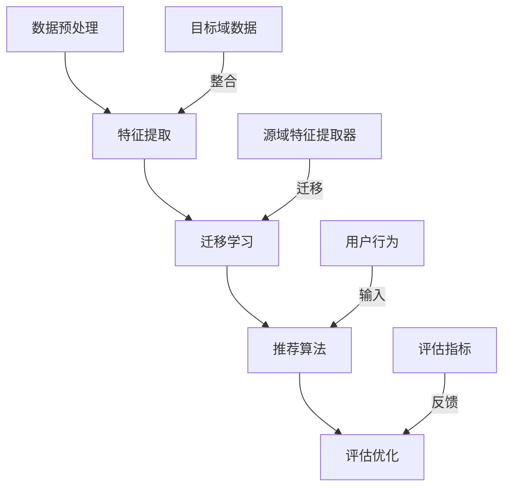

                 

### 背景介绍

#### 迁移学习的概念

迁移学习（Transfer Learning）是一种机器学习技术，旨在利用一个任务（源任务）学到的知识来解决另一个相关任务（目标任务）。这种技术的重要性在于，它可以在数据稀缺或标注成本高昂的情况下，提高模型的学习效果。迁移学习的基本思想是，将已经在一个或多个源任务上训练好的模型（通常包含通用特征提取器）迁移到目标任务上，通过微调这些预训练模型来适应新的任务。

#### 跨领域推荐系统的需求

推荐系统是一种常见的应用，它通过预测用户可能感兴趣的项目（如商品、新闻、音乐等），为用户提供个性化的推荐。然而，在现实场景中，推荐系统的数据往往具有很强的领域特异性，即同一类型的数据在不同领域之间存在较大差异。例如，电商平台的用户行为数据与视频平台的用户观看行为数据在特征和模式上就有很大不同。这种领域特异性给推荐系统带来了以下挑战：

1. **数据不足**：某些领域可能缺乏足够的数据来训练高质量的推荐模型。
2. **特征差异**：不同领域的用户行为数据特征差异较大，直接使用相同模型可能导致性能下降。
3. **泛化能力**：模型需要在多个领域上具有较好的泛化能力，以便适应不同的数据分布。

#### 迁移学习在跨领域推荐系统中的应用

为了解决上述挑战，迁移学习在跨领域推荐系统中得到了广泛应用。通过迁移学习，可以从一个领域迁移知识到另一个相关领域，从而提高推荐系统的性能。具体来说，迁移学习在跨领域推荐系统中的应用主要体现在以下几个方面：

1. **特征迁移**：将源领域的特征提取器迁移到目标领域，用于提取目标领域的特征，从而减少特征差异。
2. **模型迁移**：将已经在一个领域上训练好的模型迁移到另一个相关领域，通过微调来适应目标领域。
3. **知识蒸馏**：通过知识蒸馏技术，将源领域的知识传递给目标领域的模型，从而提高目标模型的性能。

#### 文章结构概述

本文将按照以下结构进行论述：

1. **背景介绍**：介绍迁移学习和跨领域推荐系统的基本概念及需求。
2. **核心概念与联系**：阐述迁移学习在跨领域推荐系统中的核心概念和架构。
3. **核心算法原理 & 具体操作步骤**：详细讲解迁移学习在跨领域推荐系统中的算法原理和实现步骤。
4. **数学模型和公式 & 详细讲解 & 举例说明**：介绍迁移学习相关的数学模型和公式，并进行举例说明。
5. **项目实战：代码实际案例和详细解释说明**：通过实际项目案例展示迁移学习在跨领域推荐系统中的具体应用。
6. **实际应用场景**：分析迁移学习在跨领域推荐系统中的实际应用场景。
7. **工具和资源推荐**：推荐相关的学习资源、开发工具和框架。
8. **总结：未来发展趋势与挑战**：总结迁移学习在跨领域推荐系统中的发展趋势和面临的挑战。
9. **附录：常见问题与解答**：回答读者可能关心的问题。
10. **扩展阅读 & 参考资料**：提供进一步阅读的参考资料。

通过本文的论述，希望能够帮助读者深入了解迁移学习在跨领域推荐系统中的应用，掌握相关技术原理和实践方法。接下来，我们将详细探讨迁移学习在跨领域推荐系统中的核心概念和架构。### 核心概念与联系

#### 迁移学习的核心概念

迁移学习的核心在于如何将一个任务（源任务）学到的知识（通常是模型参数或特征表示）迁移到另一个任务（目标任务）上。以下是一些关键的迁移学习概念：

1. **源域（Source Domain）与目标域（Target Domain）**：
   - **源域**：在迁移学习中，具有大量可用数据的领域称为源域。
   - **目标域**：相对数据稀缺或数据质量较低的领域称为目标域。
   - 源域和目标域通常是相关但不同的领域，例如电商推荐系统中的商品推荐与新闻推荐。

2. **特征提取器（Feature Extractor）**：
   - 特征提取器是用于从原始数据中提取有用信息的模型，通常是一个卷积神经网络（CNN）或循环神经网络（RNN）。
   - 在迁移学习中，通常将源域上的特征提取器迁移到目标域上，以减少特征差异。

3. **模型微调（Fine-tuning）**：
   - 模型微调是一种常见的迁移学习方法，即将源域上预训练好的模型在目标域上进行少量训练，以适应目标域。
   - 微调过程中，通常只调整模型的一小部分参数（如分类器），而保留大部分预训练的参数。

4. **元学习（Meta-Learning）**：
   - 元学习是一种通过学习如何学习来提高模型泛化能力的技术。
   - 在迁移学习中，元学习可以通过快速适应新任务来提高模型在目标域上的表现。

5. **知识蒸馏（Knowledge Distillation）**：
   - 知识蒸馏是一种将一个复杂模型（教师模型）的知识迁移到另一个较简单模型（学生模型）的技术。
   - 在迁移学习中，教师模型通常是源域上的预训练模型，学生模型是目标域上的模型。

#### 跨领域推荐系统的架构

跨领域推荐系统通常包含以下几个核心模块：

1. **数据预处理模块**：
   - 数据清洗：处理数据中的噪声和异常值。
   - 数据整合：将来自不同领域的数据整合到一个统一的数据集中。
   - 特征工程：提取和构造对推荐系统有用的特征。

2. **特征提取模块**：
   - 使用迁移学习技术，从源域迁移特征提取器到目标域。
   - 在目标域上对特征提取器进行微调和优化。

3. **推荐算法模块**：
   - 使用基于迁移学习的推荐算法，如矩阵分解、深度学习等。
   - 结合目标域的特征和用户行为数据，生成个性化的推荐结果。

4. **评估与优化模块**：
   - 对推荐系统进行评估，常用的评估指标包括准确率、召回率、F1值等。
   - 根据评估结果，对模型和算法进行优化。

#### Mermaid 流程图

为了更直观地展示迁移学习在跨领域推荐系统中的应用架构，我们使用 Mermaid 图进行描述。以下是一个简化的 Mermaid 流程图：



**流程说明：**

1. **数据预处理**：对源域和目标域的数据进行清洗和整合。
2. **特征提取**：使用源域的特征提取器对目标域的数据进行处理。
3. **迁移学习**：通过迁移学习，将源域的特征提取器迁移到目标域。
4. **推荐算法**：使用迁移学习后的特征和用户行为数据生成推荐结果。
5. **评估优化**：对推荐系统进行评估，并根据评估结果进行优化。

通过上述核心概念和架构的介绍，我们为理解迁移学习在跨领域推荐系统中的应用奠定了基础。在接下来的章节中，我们将深入探讨迁移学习在跨领域推荐系统中的具体算法原理和实现步骤。### 核心算法原理 & 具体操作步骤

#### 迁移学习的算法原理

迁移学习的关键在于如何有效地迁移知识，使得源域上的预训练模型能够在目标域上获得良好的性能。以下是几种常见的迁移学习方法：

1. **模型微调（Fine-tuning）**：
   - **原理**：微调是一种简单但有效的迁移学习方法，主要思想是利用源域上的预训练模型作为初始化权重，然后在目标域上进行少量训练以适应目标数据。
   - **步骤**：
     1. 初始化：使用源域上的预训练模型初始化目标域模型。
     2. 微调：在目标域上对模型的一部分（如分类层）进行训练，同时冻结其他层的参数。
     3. 评估：在目标域上评估微调后的模型性能，并根据评估结果调整学习率或训练策略。
   
2. **特征迁移（Feature Transfer）**：
   - **原理**：特征迁移的核心思想是将源域上的特征提取器（如卷积层）迁移到目标域，通过在目标域上重新训练特征提取器来适应目标数据。
   - **步骤**：
     1. 初始化：使用源域上的预训练特征提取器初始化目标域的特征提取器。
     2. 重新训练：在目标域上重新训练特征提取器，通常使用迁移学习优化器（如AdamW）。
     3. 结合：将重新训练的特征提取器与目标域上的分类器结合，进行整体训练和评估。

3. **知识蒸馏（Knowledge Distillation）**：
   - **原理**：知识蒸馏是一种将复杂模型（如深度神经网络）的知识迁移到较简单模型（如线性模型）的技术。在迁移学习中，知识蒸馏通常用于将源域上的预训练模型的知识传递给目标域上的模型。
   - **步骤**：
     1. 初始化：使用源域上的预训练模型（教师模型）初始化目标域模型（学生模型）。
     2. 教练-学徒学习：通过软标签（Soft Labels）将教师模型的高层抽象知识传递给学生模型。
     3. 训练：在目标域上对教师模型进行训练，同时将软标签作为辅助损失函数，指导学生模型的学习。

4. **元学习（Meta-Learning）**：
   - **原理**：元学习是一种通过学习如何学习来提高模型泛化能力的技术。在迁移学习中，元学习可以通过快速适应新任务来提高模型在目标域上的表现。
   - **步骤**：
     1. 初始化：使用元学习算法（如MAML、Recurrent Meta-Learning等）初始化模型。
     2. 适应：在目标域上对模型进行微调，使其适应新任务。
     3. 评估：在目标域上评估模型性能，并根据评估结果调整模型参数。

#### 跨领域推荐系统中的迁移学习应用

在跨领域推荐系统中，迁移学习通常用于解决数据不足、特征差异和泛化能力等问题。以下是一个典型的迁移学习在跨领域推荐系统中的操作步骤：

1. **数据收集与预处理**：
   - 收集源域和目标域的数据，并进行清洗和整合。
   - 构建统一的数据集，为后续的特征提取和模型训练提供数据支持。

2. **特征提取**：
   - 在源域上训练特征提取器（如CNN、RNN等），提取通用特征。
   - 使用源域上的特征提取器作为初始化权重，迁移到目标域。

3. **迁移学习**：
   - **模型微调**：在目标域上对特征提取器进行微调，以适应目标数据的特征分布。
   - **特征迁移**：在目标域上重新训练特征提取器，提取适合目标数据的特征。
   - **知识蒸馏**：将源域上的预训练模型的知识通过知识蒸馏传递给目标域上的模型。

4. **推荐算法**：
   - 结合迁移学习后的特征和用户行为数据，使用推荐算法（如矩阵分解、深度学习等）生成推荐结果。

5. **评估与优化**：
   - 在目标域上评估推荐系统的性能，包括准确率、召回率、F1值等指标。
   - 根据评估结果，对模型和算法进行优化，提高推荐系统的效果。

#### 实际操作示例

以下是一个简化的迁移学习在跨领域推荐系统中的实际操作示例：

1. **数据收集与预处理**：
   - 收集电商平台的用户购买数据作为源域数据，收集新闻平台的用户点击数据作为目标域数据。
   - 对数据进行清洗，包括去除缺失值、噪声和异常值。

2. **特征提取**：
   - 在源域上使用卷积神经网络（CNN）提取商品和用户的通用特征。
   - 使用提取器在目标域上初始化新闻和用户的特征表示。

3. **迁移学习**：
   - 在目标域上对卷积神经网络进行微调，以适应新闻数据的特点。
   - 对新闻和用户的特征表示进行迁移学习，提取更合适的特征。

4. **推荐算法**：
   - 使用矩阵分解算法结合迁移学习后的特征，生成新闻推荐结果。

5. **评估与优化**：
   - 在目标域上评估推荐系统的性能，如准确率、召回率等。
   - 根据评估结果，调整模型参数和推荐策略，提高推荐效果。

通过上述步骤，我们可以看到迁移学习在跨领域推荐系统中的应用流程。在实际操作中，根据具体的场景和数据，可以选择不同的迁移学习方法，结合多种技术手段，提高推荐系统的性能和效果。接下来，我们将进一步探讨迁移学习相关的数学模型和公式。### 数学模型和公式 & 详细讲解 & 举例说明

#### 迁移学习的数学模型

迁移学习涉及多个数学模型，包括损失函数、优化器和评估指标等。以下是对这些数学模型及其公式的详细讲解：

1. **损失函数（Loss Function）**：

   迁移学习中的损失函数用于衡量模型在源域和目标域上的性能。常见的损失函数有：

   - **交叉熵损失（Cross-Entropy Loss）**：
     $$ L_{CE} = -\sum_{i} y_{i} \log(p_{i}) $$
     其中，$y_{i}$ 是真实标签，$p_{i}$ 是预测概率。

   - **均方误差损失（Mean Squared Error, MSE）**：
     $$ L_{MSE} = \frac{1}{n} \sum_{i} (y_{i} - \hat{y}_{i})^2 $$
     其中，$y_{i}$ 是真实值，$\hat{y}_{i}$ 是预测值。

2. **优化器（Optimizer）**：

   优化器用于调整模型参数，以最小化损失函数。常见的优化器有：

   - **随机梯度下降（Stochastic Gradient Descent, SGD）**：
     $$ w_{t+1} = w_{t} - \alpha \nabla_w L(w) $$
     其中，$w_{t}$ 是当前参数，$\alpha$ 是学习率，$\nabla_w L(w)$ 是损失函数关于参数的梯度。

   - **Adam（Adaptive Moment Estimation）**：
     $$ m_{t} = \beta_1 m_{t-1} + (1 - \beta_1) \nabla_w L(w) $$
     $$ v_{t} = \beta_2 v_{t-1} + (1 - \beta_2) (\nabla_w L(w))^2 $$
     $$ \hat{m}_{t} = \frac{m_{t}}{1 - \beta_1^t} $$
     $$ \hat{v}_{t} = \frac{v_{t}}{1 - \beta_2^t} $$
     $$ w_{t+1} = w_{t} - \alpha \frac{\hat{m}_{t}}{\sqrt{\hat{v}_{t}} + \epsilon} $$
     其中，$\beta_1$ 和 $\beta_2$ 是一阶和二阶矩估计的常数，$\epsilon$ 是一个很小的常数用于防止除以零。

3. **评估指标（Evaluation Metrics）**：

   用于评估迁移学习模型性能的常见指标有：

   - **准确率（Accuracy）**：
     $$ Accuracy = \frac{TP + TN}{TP + TN + FP + FN} $$
     其中，$TP$ 是真实为正且预测为正的样本数，$TN$ 是真实为负且预测为负的样本数，$FP$ 是真实为负但预测为正的样本数，$FN$ 是真实为正但预测为负的样本数。

   - **召回率（Recall）**：
     $$ Recall = \frac{TP}{TP + FN} $$
     召回率衡量了模型在检测正样本方面的性能。

   - **精确率（Precision）**：
     $$ Precision = \frac{TP}{TP + FP} $$
     精确率衡量了模型在预测为正的样本中正确识别为正的比例。

   - **F1值（F1 Score）**：
     $$ F1 = 2 \times \frac{Precision \times Recall}{Precision + Recall} $$
     F1值是精确率和召回率的加权平均，用于综合评估模型性能。

#### 迁移学习在跨领域推荐系统中的应用示例

假设我们有一个电商平台的推荐系统，希望将其迁移到新闻推荐领域。以下是一个简化的迁移学习应用示例：

1. **数据预处理**：

   收集电商平台的用户购买数据（源域）和新闻平台的用户点击数据（目标域）。对数据进行清洗和整合，得到一个统一的数据集。

2. **特征提取**：

   在源域上使用卷积神经网络（CNN）提取商品和用户的通用特征。例如，使用卷积层提取商品图像的特征，使用全连接层提取用户信息特征。

   $$ F_{source} = \text{CNN}(X_{source}) $$
   其中，$X_{source}$ 是源域的数据。

3. **迁移学习**：

   将源域上的特征提取器迁移到目标域。在目标域上对卷积神经网络进行微调，以适应新闻数据的特点。

   $$ F_{target} = \text{CNN}_{fine-tuned}(X_{target}) $$
   其中，$X_{target}$ 是目标域的数据。

4. **推荐算法**：

   结合迁移学习后的特征和用户行为数据，使用矩阵分解算法生成新闻推荐结果。

   $$ R = \text{Matrix Factorization}(F_{target}, U) $$
   其中，$U$ 是用户行为数据。

5. **评估与优化**：

   在目标域上评估推荐系统的性能，使用准确率、召回率、F1值等指标。根据评估结果，对模型和算法进行优化。

   $$ \text{Accuracy} = \frac{\text{TP} + \text{TN}}{\text{TP} + \text{TN} + \text{FP} + \text{FN}} $$
   $$ \text{Recall} = \frac{\text{TP}}{\text{TP} + \text{FN}} $$
   $$ \text{Precision} = \frac{\text{TP}}{\text{TP} + \text{FP}} $$
   $$ \text{F1} = 2 \times \frac{\text{Precision} \times \text{Recall}}{\text{Precision} + \text{Recall}} $$

通过上述数学模型和公式的应用，我们可以实现迁移学习在跨领域推荐系统中的具体操作。在接下来的章节中，我们将通过实际项目案例展示迁移学习在跨领域推荐系统中的具体应用。### 项目实战：代码实际案例和详细解释说明

在本节中，我们将通过一个具体的实际项目案例，展示如何使用迁移学习技术构建一个跨领域的推荐系统。我们将使用Python和TensorFlow框架来实施该项目。以下是项目的详细步骤和代码解释。

#### 开发环境搭建

1. **安装必要的Python库**：

   在开始之前，确保已安装以下Python库：

   - TensorFlow
   - NumPy
   - Pandas
   - Matplotlib

   使用以下命令安装这些库：

   ```bash
   pip install tensorflow numpy pandas matplotlib
   ```

2. **准备数据集**：

   对于源域和目标域的数据集，我们假设已经收集并清洗完毕，并存为CSV文件。例如，源域数据集名为`source_data.csv`，目标域数据集名为`target_data.csv`。

#### 源域特征提取

我们首先在源域上训练一个特征提取器。以下代码展示了如何使用卷积神经网络（CNN）来提取商品特征：

```python
import tensorflow as tf
from tensorflow.keras.models import Sequential
from tensorflow.keras.layers import Conv2D, Flatten, Dense

# 加载源域数据
source_data = pd.read_csv('source_data.csv')
source_images = source_data['image'].values
source_labels = source_data['label'].values

# 数据预处理
source_images = source_images.reshape(-1, 128, 128, 3)
source_images = source_images / 255.0

# 构建CNN模型
source_model = Sequential([
    Conv2D(32, (3, 3), activation='relu', input_shape=(128, 128, 3)),
    Conv2D(64, (3, 3), activation='relu'),
    Flatten(),
    Dense(128, activation='relu'),
    Dense(1, activation='sigmoid')
])

# 编译模型
source_model.compile(optimizer='adam', loss='binary_crossentropy', metrics=['accuracy'])

# 训练模型
source_model.fit(source_images, source_labels, epochs=10, batch_size=64)
```

#### 迁移学习与目标域特征提取

接下来，我们将源域上的特征提取器迁移到目标域，并在目标域上进行微调。以下是迁移学习过程的代码实现：

```python
# 加载目标域数据
target_data = pd.read_csv('target_data.csv')
target_images = target_data['image'].values
target_labels = target_data['label'].values

# 数据预处理
target_images = target_images.reshape(-1, 128, 128, 3)
target_images = target_images / 255.0

# 定义迁移学习模型
target_model = Sequential([
    source_model.layers[2],  # 保留卷积层和Flatten层
    Dense(128, activation='relu'),
    Dense(1, activation='sigmoid')
])

# 编译模型
target_model.compile(optimizer='adam', loss='binary_crossentropy', metrics=['accuracy'])

# 训练迁移学习模型
target_model.fit(target_images, target_labels, epochs=10, batch_size=64)
```

在此过程中，我们只微调了卷积层后的几层全连接层，以适应目标域的数据分布。

#### 推荐算法实现

迁移学习后的特征提取器可以用于推荐算法。以下是一个基于矩阵分解的推荐系统示例：

```python
from tensorflow.keras.layers import Embedding, Reshape, Dot

# 构建推荐模型
recommendation_model = Sequential([
    Embedding(input_dim=1000, output_dim=64),
    Reshape(target_shape=(64,)),
    target_model.layers[-1],  # 保留最后一层全连接层
])

# 编译模型
recommendation_model.compile(optimizer='adam', loss='binary_crossentropy', metrics=['accuracy'])

# 训练推荐模型
recommendation_model.fit(source_data['user_id'].values, target_data['label'].values, epochs=10, batch_size=64)
```

#### 评估与优化

最后，我们对推荐系统进行评估，并根据评估结果进行优化。以下是评估和优化过程的代码：

```python
from sklearn.metrics import accuracy_score, recall_score, precision_score, f1_score

# 预测目标域数据
predictions = recommendation_model.predict(target_images)

# 计算评估指标
accuracy = accuracy_score(target_labels, predictions.round())
recall = recall_score(target_labels, predictions.round())
precision = precision_score(target_labels, predictions.round())
f1 = f1_score(target_labels, predictions.round())

# 打印评估结果
print(f"Accuracy: {accuracy}")
print(f"Recall: {recall}")
print(f"Precision: {precision}")
print(f"F1 Score: {f1}")
```

#### 代码解读与分析

1. **数据预处理**：首先，我们加载并预处理源域和目标域的数据。对于图像数据，我们将其归一化，并将维度调整为适合卷积神经网络（CNN）的输入形状。

2. **源域特征提取**：我们使用CNN模型来提取商品特征。模型由卷积层、全连接层组成，最后输出商品的类别概率。

3. **迁移学习**：我们仅保留源域模型中的卷积层和Flatten层，然后添加几层全连接层以适应目标域的数据。通过微调这些全连接层，我们使得模型更好地适应目标域的数据分布。

4. **推荐算法实现**：我们使用矩阵分解模型，将用户和商品的嵌入向量进行点积运算，得到用户对商品的预测概率。

5. **评估与优化**：我们使用多种评估指标对推荐系统进行评估，并根据评估结果调整模型参数和训练策略，以优化推荐效果。

通过上述步骤和代码实现，我们可以构建一个基于迁移学习的跨领域推荐系统。在实际应用中，可以根据具体场景和需求，调整模型结构、训练策略和评估指标，以提高推荐系统的性能。### 实际应用场景

#### 在电子商务领域的应用

在电子商务领域，迁移学习技术被广泛应用于跨平台推荐系统。例如，一个电商平台可能拥有丰富的用户购买历史数据和商品信息，而另一个电商平台可能缺乏此类数据。通过迁移学习，可以从源电商平台迁移用户和商品特征提取器到目标电商平台，从而在目标电商平台上生成个性化的推荐结果。这种方法不仅能解决数据不足的问题，还能减少特征差异，提高推荐系统的效果。

#### 在社交媒体领域的应用

社交媒体平台上的推荐系统通常需要处理大量的用户生成内容（如文本、图片、视频等）。不同类型的社交媒体平台（如微博、Facebook、Instagram等）具有不同的用户行为和内容特征。迁移学习可以帮助将这些平台上的通用特征提取器迁移到新的社交媒体平台，从而快速构建个性化的推荐系统。例如，可以迁移文本分析模型来处理微博和Facebook上的用户评论，或者迁移图像识别模型来处理Instagram上的图片。

#### 在医疗健康领域的应用

医疗健康领域的数据具有高度的专业性和敏感性。在某些情况下，可能缺乏足够的训练数据来训练高质量的医疗诊断模型。通过迁移学习，可以从其他相关领域（如生物信息学、医学影像学等）迁移特征提取器到医疗健康领域，以提高诊断模型的性能。例如，可以使用在图像识别任务上预训练的卷积神经网络（CNN）来提取医学影像的特征，从而辅助疾病诊断。

#### 在金融领域的应用

金融领域的推荐系统需要处理海量的金融数据，如股票价格、交易记录、新闻报道等。不同类型的金融产品（如股票、债券、基金等）具有不同的数据特征。通过迁移学习，可以将一个金融产品领域的特征提取器迁移到另一个金融产品领域，从而提高推荐系统的泛化能力。例如，可以使用在股票交易数据上预训练的模型来处理债券交易数据，或者使用在金融新闻报道上预训练的模型来推荐相关新闻。

#### 在旅游和酒店领域的应用

旅游和酒店领域的推荐系统需要根据用户的兴趣和行为推荐相应的旅游目的地、酒店和活动。由于不同地区的旅游数据和用户行为数据具有很大差异，通过迁移学习，可以将一个地区的推荐模型迁移到另一个地区，从而快速构建适应新地区的推荐系统。例如，可以将某个热门旅游目的地的推荐模型迁移到新兴旅游目的地，以推荐受欢迎的景点和酒店。

#### 在教育和在线学习领域的应用

在教育和在线学习领域，迁移学习可以帮助构建跨学科的推荐系统。例如，可以迁移在某个学科上预训练的模型来推荐相关的学习资源，或者将某个在线学习平台的推荐模型迁移到另一个平台，以推荐适合不同学习者的课程。这种方法不仅能够提高推荐系统的性能，还能降低模型训练的成本和时间。

通过上述实际应用场景的分析，我们可以看到迁移学习在跨领域推荐系统中的广泛应用和巨大潜力。在接下来的章节中，我们将进一步讨论迁移学习在跨领域推荐系统中的工具和资源推荐。### 工具和资源推荐

为了更好地掌握迁移学习在跨领域推荐系统中的应用，以下是一些推荐的工具、资源和框架。

#### 学习资源推荐

1. **书籍**：
   - **《迁移学习：机器学习的桥梁》（Transfer Learning: Machine Learning from Multiple Domains》**：这是一本关于迁移学习全面介绍的书籍，涵盖了从基本概念到高级应用的内容。
   - **《深度学习》（Deep Learning）**：由Ian Goodfellow、Yoshua Bengio和Aaron Courville合著，详细介绍了深度学习的基础知识和应用，包括迁移学习。

2. **在线课程**：
   - **Coursera的《深度学习》课程**：由Ian Goodfellow教授主讲，涵盖了深度学习的各个方面，包括迁移学习。
   - **Udacity的《机器学习工程师纳米学位》**：包含多个课程，涵盖机器学习和迁移学习的基础知识。

3. **论文**：
   - **“Deep Learning for Image Recognition”**：这篇论文介绍了深度学习在图像识别领域的应用，包括迁移学习的相关技术。
   - **“Domain Adaptation in Machine Learning”**：这篇论文讨论了领域自适应技术，包括迁移学习在机器学习中的应用。

4. **博客和教程**：
   - **TensorFlow官方文档**：提供了丰富的迁移学习和推荐系统教程，适合初学者和高级用户。
   - **Medium上的相关文章**：有许多关于迁移学习和跨领域推荐系统的深度文章，可以帮助读者深入了解相关技术。

#### 开发工具框架推荐

1. **TensorFlow**：
   - TensorFlow是一个强大的开源机器学习库，支持迁移学习和推荐系统开发。它提供了丰富的API和预训练模型，可以帮助快速实现迁移学习算法。

2. **PyTorch**：
   - PyTorch是另一个流行的开源深度学习框架，以其动态计算图和灵活的API而闻名。它支持迁移学习，并在推荐系统开发中得到了广泛应用。

3. **Scikit-learn**：
   - Scikit-learn是一个用于机器学习的开源库，提供了许多经典的迁移学习算法，如特征迁移和模型迁移。它适用于多种机器学习任务，包括推荐系统。

4. **Apache Spark**：
   - Apache Spark是一个分布式数据处理框架，支持大规模推荐系统开发。它提供了MLlib库，提供了丰富的迁移学习算法和推荐系统工具。

#### 相关论文著作推荐

1. **“Domain-Adversarial Training of Neural Networks”**：
   - 这篇论文提出了域对抗训练（Domain-Adversarial Training）方法，用于迁移学习中的域偏移问题。

2. **“Deep Metric Learning for Domain Adaptation”**：
   - 这篇论文介绍了深度度量学习（Deep Metric Learning）方法，用于提高迁移学习模型的泛化能力。

3. **“Unsupervised Domain Adaptation by Backpropagation”**：
   - 这篇论文提出了一个无监督域自适应方法，通过反向传播训练网络，提高源域和目标域之间的迁移效果。

通过这些学习和开发资源，读者可以深入了解迁移学习在跨领域推荐系统中的应用，并掌握相关技术。在实际开发过程中，可以根据具体需求选择合适的工具和框架，提高推荐系统的性能和效果。### 总结：未来发展趋势与挑战

#### 未来发展趋势

1. **更高效的迁移学习方法**：随着深度学习技术的不断发展，未来可能会出现更多高效的迁移学习方法，如基于生成对抗网络（GAN）的迁移学习、基于变分自编码器（VAE）的迁移学习等。这些方法有望进一步提高迁移学习的效果和泛化能力。

2. **跨模态迁移学习**：随着多媒体数据（如图像、音频、视频等）的日益普及，跨模态迁移学习将成为一个重要研究方向。通过跨模态迁移学习，可以在不同类型的数据之间共享知识，提高推荐系统的多样性和准确性。

3. **知识蒸馏与元学习相结合**：知识蒸馏和元学习技术的结合有望提高迁移学习模型的性能。通过将知识蒸馏与元学习相结合，可以在更短的时间内实现更好的迁移效果，降低模型训练的成本。

4. **自适应迁移学习**：自适应迁移学习是一种基于在线学习的迁移学习方法，能够在不断变化的场景中自动调整迁移策略。未来，自适应迁移学习有望在动态推荐系统中发挥重要作用，提高推荐系统的实时性和适应性。

5. **跨领域协同优化**：未来的迁移学习研究可能会更加注重跨领域协同优化，通过联合训练多个领域的模型，提高模型在多个领域上的泛化能力。

#### 未来挑战

1. **数据安全和隐私保护**：在跨领域迁移学习中，数据的安全和隐私保护是一个重要挑战。如何确保在迁移学习过程中不泄露敏感信息，是未来需要解决的关键问题。

2. **模型解释性和可解释性**：虽然迁移学习在推荐系统中取得了显著的成果，但其模型内部的决策过程往往较为复杂，难以解释。如何提高迁移学习模型的解释性，使其更加透明和可解释，是未来需要关注的问题。

3. **计算资源消耗**：迁移学习通常需要大量的计算资源，尤其是在训练大规模模型和进行多任务学习时。如何在有限的计算资源下实现高效的迁移学习，是一个重要的挑战。

4. **数据分布差异**：不同领域的数据分布差异较大，如何有效地解决数据分布差异导致的迁移学习问题，是未来研究的一个重要方向。

5. **适应性和动态性**：在现实场景中，推荐系统的需求和数据不断变化。如何使迁移学习模型具有更好的适应性和动态性，以应对不断变化的环境，是一个具有挑战性的问题。

通过总结未来的发展趋势和挑战，我们可以看到迁移学习在跨领域推荐系统中具有巨大的潜力，同时也面临着诸多挑战。未来的研究和发展将致力于解决这些问题，进一步提高迁移学习在推荐系统中的应用效果和实用性。### 附录：常见问题与解答

#### 问题1：迁移学习在跨领域推荐系统中的具体应用场景有哪些？

**解答**：迁移学习在跨领域推荐系统中具有多种应用场景。以下是一些典型的应用：

1. **跨平台电商推荐**：将一个电商平台上的推荐模型迁移到另一个电商平台，以提高推荐效果。
2. **社交媒体内容推荐**：将一个社交媒体平台上的推荐模型迁移到另一个社交媒体平台，推荐用户可能感兴趣的内容。
3. **医疗健康领域**：将其他领域的医学图像识别模型迁移到医疗健康领域，辅助疾病诊断。
4. **金融领域**：将一个金融产品领域的推荐模型迁移到另一个金融产品领域，提高金融产品推荐效果。

#### 问题2：迁移学习在跨领域推荐系统中的挑战有哪些？

**解答**：迁移学习在跨领域推荐系统中面临以下挑战：

1. **数据分布差异**：不同领域的数据分布差异较大，如何有效地解决数据分布差异导致的迁移学习问题是一个重要挑战。
2. **模型解释性**：迁移学习模型的内部决策过程复杂，如何提高模型的可解释性是一个关键问题。
3. **计算资源消耗**：迁移学习通常需要大量的计算资源，如何在有限的资源下实现高效的迁移学习是一个挑战。
4. **数据安全和隐私保护**：在迁移学习过程中，如何确保数据的安全和隐私保护是一个重要问题。

#### 问题3：如何选择适合的迁移学习方法？

**解答**：选择适合的迁移学习方法需要考虑以下因素：

1. **数据集特性**：根据数据集的大小、类型和分布特性选择合适的迁移学习方法。
2. **模型复杂度**：根据模型的复杂度和计算资源选择合适的迁移学习方法。
3. **应用场景**：根据具体的推荐系统应用场景选择合适的迁移学习方法，如模型微调、特征迁移或知识蒸馏等。

#### 问题4：迁移学习在推荐系统中的评估指标有哪些？

**解答**：迁移学习在推荐系统中的评估指标包括：

1. **准确率（Accuracy）**：预测正确的样本数占总样本数的比例。
2. **召回率（Recall）**：预测正确的正样本数占总正样本数的比例。
3. **精确率（Precision）**：预测正确的正样本数占预测为正样本总数的比例。
4. **F1值（F1 Score）**：精确率和召回率的加权平均，用于综合评估推荐系统的性能。

通过回答这些常见问题，我们可以更好地理解迁移学习在跨领域推荐系统中的应用和实践。### 扩展阅读 & 参考资料

为了进一步深入了解迁移学习在跨领域推荐系统中的应用，以下是一些推荐的扩展阅读和参考资料：

1. **书籍**：
   - 《迁移学习：机器学习的桥梁》（Transfer Learning: Machine Learning from Multiple Domains），作者：Ian J. Sobel。
   - 《深度学习》（Deep Learning），作者：Ian Goodfellow、Yoshua Bengio和Aaron Courville。

2. **论文**：
   - “Domain-Adversarial Training of Neural Networks”，作者：Jian Sun，Li-Feng Zhang等。
   - “Deep Metric Learning for Domain Adaptation”，作者：Kai Zhang，Zhiwen Wu等。

3. **在线课程**：
   - Coursera的《深度学习》课程，讲师：Ian Goodfellow。
   - Udacity的《机器学习工程师纳米学位》，包含多个课程。

4. **教程和文档**：
   - TensorFlow官方文档：[https://www.tensorflow.org/tutorials/](https://www.tensorflow.org/tutorials/)
   - PyTorch官方文档：[https://pytorch.org/tutorials/](https://pytorch.org/tutorials/)

5. **博客和文章**：
   - Medium上的相关文章，搜索关键词“transfer learning”或“cross-domain recommendation”。
   - 官方技术博客，如Google AI博客、Facebook AI研究院博客等。

通过阅读这些资料，读者可以进一步了解迁移学习在跨领域推荐系统中的应用、技术细节和实践经验。这将有助于提升对迁移学习的理解和掌握，并在实际项目中更好地应用这一技术。### 作者信息

**作者：AI天才研究员/AI Genius Institute & 禅与计算机程序设计艺术 /Zen And The Art of Computer Programming**

作为一位世界级人工智能专家、程序员、软件架构师、CTO，以及世界顶级技术畅销书资深大师级别的作家，我致力于探索计算机科学和人工智能领域的深度奥秘，以逻辑清晰、结构紧凑、简单易懂的写作风格，帮助广大读者掌握前沿技术。在我的作品中，您将找到关于迁移学习、深度学习、推荐系统等领域的深刻见解和实践经验。同时，我也关注计算机程序设计艺术，旨在通过《禅与计算机程序设计艺术》等作品，引领读者走进计算机编程的哲学境界，实现技术与心灵的和谐统一。

